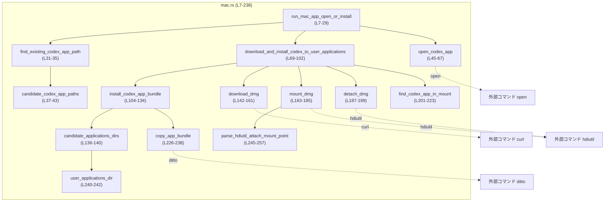
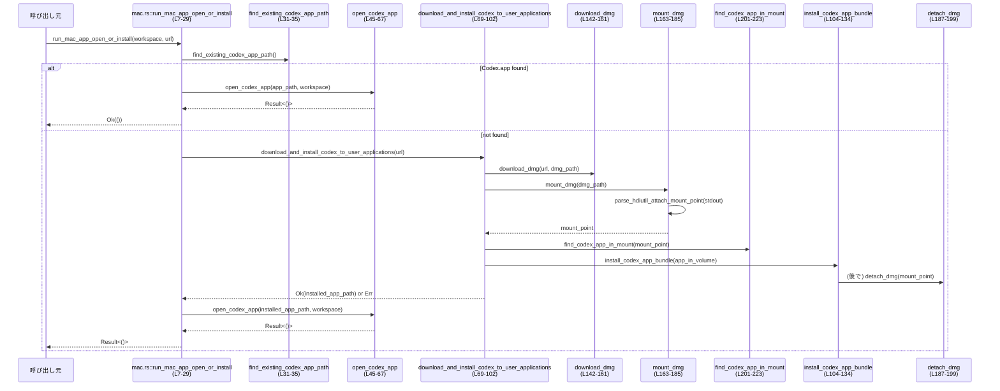

# cli/src/desktop_app/mac.rs

## 0. ざっくり一言

macOS 上で Codex Desktop アプリを「既にあれば起動し、なければ DMG をダウンロードしてインストールしてから起動する」ためのユーティリティ関数群です（非同期・Tokio ベース）。  
外部コマンド（`open`, `curl`, `hdiutil`, `ditto`）をラップして、DMG のダウンロード・マウント・アプリコピーなどを行います。

---

## 1. このモジュールの役割

### 1.1 概要

- このモジュールは **macOS での Codex Desktop の起動・インストール処理** をまとめたものです。
- 主な機能は:
  - 既存の `Codex.app` の探索と起動
  - 未インストール時の DMG ダウンロード・マウント・`.app` バンドルのコピー
  - 作業スペース（workspace ディレクトリ）を指定してアプリを起動

中核となる公開 API は `run_mac_app_open_or_install` です（`cli/src/desktop_app/mac.rs:L7-29`）。

### 1.2 アーキテクチャ内での位置づけ

このファイル内の依存関係（関数レベルと外部コマンド）を簡略図にすると次のようになります。



呼び出し元（CLI のメイン処理など）からは基本的に `run_mac_app_open_or_install` だけを直接呼び出す想定と読み取れます（このチャンク内に他モジュールからの参照は現れません）。

### 1.3 設計上のポイント

コードから読み取れる設計上の特徴です。

- **単一の公開エントリポイント**
  - 公開関数は `pub async fn run_mac_app_open_or_install(...)` のみです（`L7-29`）。
- **非同期 I/O ベース**
  - 外部コマンド実行はすべて `tokio::process::Command` を用いた `async fn` で定義されています（例: `open_codex_app` `L45-67`, `download_dmg` `L142-161`）。
- **anyhow によるエラーハンドリング**
  - 戻り値型は `anyhow::Result` で統一され、`Context` トレイトと `anyhow::bail!` によりエラーメッセージが付加されています（`use anyhow::Context as _;` `L1`）。
- **一時ディレクトリによる DMG 管理**
  - DMG ダウンロードやマウントに使うディレクトリは `tempfile::Builder::tempdir()` で作成し、スコープ終了時に自動削除されるようになっています（`download_and_install_codex_to_user_applications` `L69-76`）。
- **後始末（アンマウント）の明示**
  - DMG のアンマウントは、インストール処理の成否にかかわらず必ず試行し、失敗しても警告ログにとどめる構造になっています（`L86-101`）。
- **環境依存の外部コマンドに依存**
  - `curl`, `hdiutil`, `ditto`, `open` を PATH から実行しており、これらが存在することを前提としています（`L50`, `L144`, `L164`, `L188`, `L227`）。

---

## 2. 主要な機能一覧（コンポーネントインベントリー）

このモジュール内の主な関数・テストを一覧にした表です（行番号は本ファイル内の範囲を示します）。

| 種別 | 名前 | 公開 | 役割 / 用途 | 根拠 |
|------|------|------|-------------|------|
| 関数 | `run_mac_app_open_or_install` | pub | Codex.app を探して起動し、なければ DMG をダウンロード・インストールしてから起動するメインエントリ | `mac.rs:L7-29` |
| 関数 | `find_existing_codex_app_path` | private | 既存の `Codex.app` を典型パスから探索する | `mac.rs:L31-35` |
| 関数 | `candidate_codex_app_paths` | private | Codex.app の候補パス（システム/ユーザ Applications）を列挙する | `mac.rs:L37-43` |
| 関数 | `open_codex_app` | private | `open -a` コマンドで Codex.app を指定 workspace と共に起動する | `mac.rs:L45-67` |
| 関数 | `download_and_install_codex_to_user_applications` | private | DMG をダウンロードしマウント、`.app` を Applications ディレクトリにインストールしてパスを返す | `mac.rs:L69-102` |
| 関数 | `install_codex_app_bundle` | private | マウント済みボリューム内の `.app` を候補 Applications ディレクトリへコピーする | `mac.rs:L104-134` |
| 関数 | `candidate_applications_dirs` | private | インストール先候補の Applications ディレクトリ一覧を返す | `mac.rs:L136-140` |
| 関数 | `download_dmg` | private | `curl` で DMG を指定パスにダウンロードする | `mac.rs:L142-161` |
| 関数 | `mount_dmg` | private | `hdiutil attach` で DMG をマウントし、ボリュームのマウントポイントを返す | `mac.rs:L163-185` |
| 関数 | `detach_dmg` | private | `hdiutil detach` でマウントされたボリュームをアンマウントする | `mac.rs:L187-199` |
| 関数 | `find_codex_app_in_mount` | private | マウントポイント直下から `Codex.app` または任意の `.app` ディレクトリを探す | `mac.rs:L201-223` |
| 関数 | `copy_app_bundle` | private | `ditto` コマンドで `.app` バンドルをコピーする | `mac.rs:L226-238` |
| 関数 | `user_applications_dir` | private | `$HOME/Applications` を返す（HOME 未設定時はエラー） | `mac.rs:L240-242` |
| 関数 | `parse_hdiutil_attach_mount_point` | private | `hdiutil attach` の出力から `/Volumes/...` のマウントポイント文字列を抽出する | `mac.rs:L245-257` |
| モジュール | `tests` | test | `parse_hdiutil_attach_mount_point` のユニットテストを含む | `mac.rs:L259-280` |
| テスト | `parses_mount_point_from_tab_separated_hdiutil_output` | test | タブ区切りの `hdiutil` 出力からマウントポイントを正しく抽出できることを検証 | `mac.rs:L265-271` |
| テスト | `parses_mount_point_with_spaces` | test | マウントポイントにスペースを含むケースの抽出を検証 | `mac.rs:L273-279` |

---

## 3. 公開 API と詳細解説

### 3.1 型一覧（構造体・列挙体など）

このファイル内で新たに定義されている構造体・列挙体などはありません。  
主に標準ライブラリの `Path`, `PathBuf`、`anyhow::Result`、外部クレートの `tempfile::Builder`, `tokio::process::Command` を使用しています（`L1-5`）。

### 3.2 関数詳細（主要 7 件）

#### `run_mac_app_open_or_install(workspace: PathBuf, download_url: String) -> anyhow::Result<()>`

**根拠**: `mac.rs:L7-29`

**概要**

- macOS 上で Codex Desktop を起動するためのメイン関数です。
- 既に `Codex.app` がインストールされていればそれを起動し、見つからなければ指定 URL からインストーラ DMG をダウンロードしてインストールし、その後起動します。

**引数**

| 引数名      | 型        | 説明 |
|------------|-----------|------|
| `workspace` | `PathBuf` | Codex Desktop に開かせたいワークスペースディレクトリのパスです。 |
| `download_url` | `String` | Codex Desktop インストーラ DMG をダウンロードするための URL 文字列です。 |

**戻り値**

- `anyhow::Result<()>`  
  - 成功: `Ok(())`。Codex Desktop の起動要求が `open` コマンドに正常に渡されたことを意味します。
  - 失敗: エラー内容を含む `Err(anyhow::Error)`。

**内部処理の流れ（アルゴリズム）**

1. `find_existing_codex_app_path()` で既存の `Codex.app` を探します（`L11`）。
2. 見つかった場合:
   - ログ出力でパスを表示し（`L12-15`）、`open_codex_app(&app_path, &workspace)` を呼び出して起動し、結果を返します（`L16-17`）。
3. 見つからなかった場合:
   - 「Codex Desktop not found; downloading installer...」とログを出力（`L19`）。
   - `download_and_install_codex_to_user_applications(&download_url)` を呼び出してダウンロードとインストールを行い、その結果パスにコンテキスト付きエラーを追加します（`L20-22`）。
   - インストールされたアプリパスをログ出力し（`L23-26`）、`open_codex_app(&installed_app, &workspace)` で起動します（`L27`）。
4. 全て成功すれば `Ok(())` を返します（`L28`）。

**Examples（使用例）**

```rust
use std::path::PathBuf;
use cli::desktop_app::mac::run_mac_app_open_or_install; // 実際のパスはクレート構成に依存します

#[tokio::main] // Tokio ランタイム上で実行する
async fn main() -> anyhow::Result<()> {
    // 開きたいワークスペースディレクトリ
    let workspace = PathBuf::from("/Users/alice/projects/my-workspace");

    // Codex Desktop インストーラの配布 URL（信頼できる URL を指定する前提）
    let dmg_url = "https://example.com/Codex.dmg".to_string();

    run_mac_app_open_or_install(workspace, dmg_url).await?;

    Ok(())
}
```

**Errors / Panics**

- 主なエラー発生条件（いずれも `Err(anyhow::Error)` として返されます）:
  - `download_and_install_codex_to_user_applications` 内で
    - 一時ディレクトリ作成失敗 (`tempfile::Builder::tempdir`)（`L69-73`）
    - DMG ダウンロード失敗 (`download_dmg`)（`L78-79`）
    - DMG マウント失敗 (`mount_dmg`)（`L81`）
    - マウント内に `.app` が見つからない (`find_codex_app_in_mount`)（`L87-88`, `L220-223`）
    - インストール失敗 (`install_codex_app_bundle`)（`L104-134`）
  - 起動失敗 (`open_codex_app` 内の `open` コマンドが非ゼロステータスで終了)（`L50-66`）。
- この関数自体に `panic!` はありません。

**Edge cases（エッジケース）**

- `workspace` が存在しないディレクトリであっても、この関数自身は検証しません。`open` コマンドがどう扱うかに依存します（`open_codex_app` 参照）。
- `download_url` が無効な URL 文字列でも、`curl` が返す終了ステータスによってエラーになります（`download_dmg` 内 `L142-161`）。
- 既に `Codex.app` がインストールされている場合は、ダウンロードやインストールは行われず、即座に既存アプリを起動します（`L11-18`）。

**使用上の注意点**

- **非同期コンテキスト必須**: `async fn` なので、Tokio 等の非同期ランタイム上で `await` する必要があります。
- **macOS 前提**: `open`, `hdiutil`, `ditto` など macOS 固有コマンドに依存しています。他 OS では動作しません。
- **URL の信頼性**: 渡す `download_url` が指す DMG は信頼できるものを前提としており、このモジュール内で署名検証などは行われていません（このチャンクには検証処理は現れません）。
- **外部コマンドの存在**: `curl` などが PATH に存在しない環境ではエラーになります。

---

#### `download_and_install_codex_to_user_applications(dmg_url: &str) -> anyhow::Result<PathBuf>`

**根拠**: `mac.rs:L69-102`

**概要**

- 指定された URL から Codex Desktop の DMG を一時ディレクトリへダウンロードし、マウント・インストールを行い、インストールされた `Codex.app` のパスを返します。
- マウント解除 (`detach_dmg`) はインストールの成否にかかわらず必ず試行します。

**引数**

| 引数名 | 型 | 説明 |
|--------|----|------|
| `dmg_url` | `&str` | ダウンロード元の DMG ファイル URL。 |

**戻り値**

- `anyhow::Result<PathBuf>`  
  - 成功: インストールに成功した `Codex.app` のフルパス。
  - 失敗: 途中のいずれかのステップで発生したエラー。

**内部処理の流れ**

1. `tempfile::Builder::new().prefix("codex-app-installer-").tempdir()` で一時ディレクトリを作成（`L69-73`）。
2. `tmp_root` に一時ディレクトリのパスを保存し、`Codex.dmg` というファイルパスを生成（`L74-77`）。
3. `download_dmg(dmg_url, &dmg_path)` で DMG をダウンロード（`L78-79`）。
4. `"Mounting Codex Desktop installer..."` とログ出力後、`mount_dmg(&dmg_path)` で DMG をマウントし、マウントポイントを取得（`L80-81`）。
5. `"Installer mounted at ..."` とマウントポイントをログ出力（`L82-85`）。
6. 非同期ブロック内で:
   - `find_codex_app_in_mount(&mount_point)` でマウントされたボリューム内の `.app` を探索（`L86-88`）。
   - `install_codex_app_bundle(&app_in_volume)` で Applications ディレクトリへのインストールを実行し、その結果 (`PathBuf`) を返す（`L89-90`）。
7. 上記結果を `result` に保持した後、`detach_dmg(&mount_point)` でアンマウントを試みる（`L93`）。
8. アンマウントが失敗した場合は警告ログを出力するが、`result` の成否には影響させず、そのまま返す（`L94-101`）。

**Examples（使用例）**

通常は `run_mac_app_open_or_install` から内部的に呼ばれますが、単体で使うと次のようになります。

```rust
use cli::desktop_app::mac::download_and_install_codex_to_user_applications;

#[tokio::main]
async fn main() -> anyhow::Result<()> {
    let dmg_url = "https://example.com/Codex.dmg";
    let app_path = download_and_install_codex_to_user_applications(dmg_url).await?;
    eprintln!("Installed Codex.app at {}", app_path.display());
    Ok(())
}
```

**Errors / Panics**

- 一時ディレクトリ作成に失敗した場合（権限不足、ディスクフルなど）にエラー（`L69-73`）。
- `download_dmg` が `curl` の失敗によりエラーを返した場合（`L78-79`, `L142-161`）。
- `mount_dmg` が `hdiutil attach` の失敗や出力解析失敗でエラーを返した場合（`L81`, `L163-185`）。
- `find_codex_app_in_mount` が `.app` バンドルを見つけられない場合（`L87-88`, `L201-223`）。
- `install_codex_app_bundle` がいずれの Applications ディレクトリにもインストールできなかった場合（`L89-90`, `L104-134`）。
- `detach_dmg` のエラーはログ出力のみで、戻り値には影響しません（`L93-101`）。

**Edge cases（エッジケース）**

- DMG 内に `Codex.app` という名前のディレクトリがない場合、最初の `.app` ディレクトリが採用されます（`find_codex_app_in_mount` `L201-217`）。
- Applications ディレクトリ候補のいずれかに既に `Codex.app` ディレクトリが存在する場合、新たなコピーを行わずそのパスを返します（`L117-120`）。
- `$HOME` 環境変数が未設定の場合、`user_applications_dir` がエラーとなり、結果として `install_codex_app_bundle` もエラーで終了します（`L136-140`, `L240-242`）。`/Applications` が存在していても使われない点は挙動として注意が必要です。

**使用上の注意点**

- 一時ディレクトリは `tempdir` のスコープ終了時に削除されますが、DMG のアンマウントは明示的に `hdiutil detach` に依存しているため、アンマウント失敗時にはマウントが残る可能性があります（警告ログのみ）。
- ダウンロード先 URL の信頼性確保は呼び出し側の責任です（このモジュール内に署名検証処理はありません）。
- 外部コマンド呼び出しはすべて PATH に依存しているため、信頼できない PATH 設定の環境では別プロセス実行リスクがあります。

---

#### `open_codex_app(app_path: &Path, workspace: &Path) -> anyhow::Result<()>`

**根拠**: `mac.rs:L45-67`

**概要**

- 指定された `Codex.app` とワークスペースディレクトリを、macOS の `open` コマンド経由で起動します。

**引数**

| 引数名 | 型 | 説明 |
|--------|----|------|
| `app_path` | `&Path` | 起動対象の `.app` バンドル（通常 Codex.app）ディレクトリへのパス。 |
| `workspace` | `&Path` | アプリに渡すワークスペースディレクトリ。 |

**戻り値**

- `anyhow::Result<()>`  
  - `Ok(())`: `open` コマンドが成功ステータスで終了。
  - `Err(_)`: `open` の起動失敗または終了ステータスが非ゼロ。

**内部処理の流れ**

1. 「Opening workspace ...」というログを出力（`L46-49`）。
2. `tokio::process::Command::new("open")` で `open` コマンドを起動（`L50`）。
3. 引数として `-a`, `app_path`, `workspace` を付与し（`L51-53`）、`status().await` で終了ステータスを取得（`L54-56`）。
4. `status.success()` が真なら `Ok(())` を返し（`L58-59`）、偽なら `anyhow::bail!` でエラーを返します（`L62-66`）。

**Examples（使用例）**

```rust
use std::path::Path;
use cli::desktop_app::mac::open_codex_app;

#[tokio::main]
async fn main() -> anyhow::Result<()> {
    let app = Path::new("/Applications/Codex.app");
    let workspace = Path::new("/Users/alice/projects/my-workspace");
    open_codex_app(app, workspace).await?;
    Ok(())
}
```

**Errors / Panics**

- `Command::new("open")` の実行自体に失敗した場合（`open` コマンドが見つからない、起動権限なし）は `"failed to invoke \`open\`"`というコンテキスト付きでエラー（`L50-56`）。
- `open` コマンドが非ゼロステータスで終了した場合、終了ステータスを含むメッセージで `bail!` されます（`L62-66`）。
- パニックはありません。

**Edge cases（エッジケース）**

- `app_path` や `workspace` が存在しない場合でも、この関数は事前検証を行わず `open` に委ねます。存在しない場合、`open` がエラー終了する可能性があります。
- `workspace` がファイルパスでも特にチェックはなく、そのまま引数として渡されます。

**使用上の注意点**

- `open` は macOS のグラフィカルアプリケーション起動の仕組みに依存しており、ヘッドレス環境や GUI が無効な環境では動作しない可能性があります。
- `app_path` に `.app` 以外のパスを渡してもコンパイルは通りますが、期待通りにアプリが起動しない場合があります。

---

#### `install_codex_app_bundle(app_in_volume: &Path) -> anyhow::Result<PathBuf>`

**根拠**: `mac.rs:L104-134`

**概要**

- マウントされた DMG 内の `Codex.app`（または指定された `.app`）を、Applications ディレクトリ候補にインストールします。
- 既に同名ディレクトリがある場合はコピーせず、そのパスを返します。

**引数**

| 引数名 | 型 | 説明 |
|--------|----|------|
| `app_in_volume` | `&Path` | DMG ボリューム内の `.app` ディレクトリへのパス。 |

**戻り値**

- `anyhow::Result<PathBuf>`  
  - 成功: 実際に使用する `Codex.app` のパス（新規コピー先または既存のディレクトリ）。
  - 失敗: いずれの Applications ディレクトリにもインストールできなかった場合のエラー。

**内部処理の流れ**

1. `candidate_applications_dirs()?` でシステムとユーザの Applications ディレクトリ候補を取得（`L105`）。
2. 各 `applications_dir` についてループ:
   - 「Installing Codex Desktop into ...」とログ出力（`L106-109`）。
   - `std::fs::create_dir_all(&applications_dir)` で存在しない場合はディレクトリを作成し、失敗時はコンテキスト付きエラー（`L110-115`）。
   - `dest_app = applications_dir.join("Codex.app")` を計算（`L117`）。
   - すでに `dest_app.is_dir()` ならコピーせずに `Ok(dest_app)` を返す（`L118-120`）。
   - 存在しない場合 `copy_app_bundle(app_in_volume, &dest_app).await` を試行し、成功なら `Ok(dest_app)`（`L122-123`）。
   - コピーが失敗した場合は警告ログを出し、次の `applications_dir` へ進む（`L124-129`）。
3. 全ての候補でインストールに失敗した場合、`anyhow::bail!` でエラーを返す（`L133`）。

**Examples（使用例）**

通常は `download_and_install_codex_to_user_applications` から呼ばれますが、手動でマウント済みの DMG を使う場合のイメージです。

```rust
use std::path::Path;
use cli::desktop_app::mac::install_codex_app_bundle;

#[tokio::main]
async fn main() -> anyhow::Result<()> {
    // 例: 既に /Volumes/Codex/Codex.app がマウント済み
    let app_in_volume = Path::new("/Volumes/Codex/Codex.app");
    let installed = install_codex_app_bundle(app_in_volume).await?;
    eprintln!("Codex installed at {}", installed.display());
    Ok(())
}
```

**Errors / Panics**

- `candidate_applications_dirs()` 内で `$HOME` が未設定などによりエラーとなる場合、本関数もエラーを返します（`L136-140`, `L240-242`）。
- `create_dir_all` によるディレクトリ作成が失敗すると即エラー（`L110-115`）。
- すべての候補ディレクトリで `copy_app_bundle` が失敗した場合、「failed to install Codex.app to any applications directory」として `bail!`（`L133`）。
- パニックを起こすコードは含まれていません。

**Edge cases（エッジケース）**

- 片方の Applications ディレクトリにはインストールに成功し、もう片方で失敗するケースでは、成功した時点で早期リターンするため問題ありません。
- すでに `Codex.app` が存在する場合、**中身が古いかどうかに関わらず** コピー処理は行われません（`L118-120`）。これはバージョン更新の挙動に影響しますが、コードからは「既存なら再インストールしない」という仕様と解釈できます。

**使用上の注意点**

- `$HOME` が未設定だと `user_applications_dir` がエラーを返し、本関数も失敗します。システムの `/Applications` のみを使いたい場合でも、現状この挙動に従います。
- インストール権限のない `/Applications` では `create_dir_all` や `ditto` が失敗する可能性がありますが、その場合でもユーザ Applications ディレクトリが後続候補として試されます。

---

#### `download_dmg(url: &str, dest: &Path) -> anyhow::Result<()>`

**根拠**: `mac.rs:L142-161`

**概要**

- `curl` コマンドを使って、指定 URL から DMG ファイルを `dest` パスにダウンロードします。

**引数**

| 引数名 | 型 | 説明 |
|--------|----|------|
| `url` | `&str` | ダウンロード元の URL。 |
| `dest` | `&Path` | 保存先ファイルパス。存在しないディレクトリであれば `curl` 側が失敗します。 |

**戻り値**

- `anyhow::Result<()>`  
  - 成功: `Ok(())`。
  - 失敗: `curl` 呼び出しやダウンロード失敗に応じたエラー。

**内部処理の流れ**

1. `"Downloading installer..."` というログを出力（`L143`）。
2. `Command::new("curl")` を作成し、
   - `-fL`（HTTP 4xx をエラーとする、リダイレクト追従）、
   - `--retry 3`（最大 3 回リトライ）、
   - `--retry-delay 1`（1 秒間隔）、
   - `-o dest`（出力先ファイル）、
   - `url`
   を指定（`L144-153`）。
3. `status().await` で終了ステータスを取得し、`status.success()` が真なら `Ok(())` を返す（`L154-159`）。
4. 偽の場合は `"curl download failed with {status}"` で `bail!`（`L160`）。

**Examples（使用例）**

```rust
use std::path::PathBuf;
use cli::desktop_app::mac::download_dmg;

#[tokio::main]
async fn main() -> anyhow::Result<()> {
    let dest = PathBuf::from("/tmp/Codex.dmg");
    download_dmg("https://example.com/Codex.dmg", &dest).await?;
    Ok(())
}
```

**Errors / Panics**

- `curl` コマンドが見つからない、実行できない場合には `"failed to invoke \`curl\`"`というコンテキスト付きエラー（`L144-155`）。
- HTTP エラー、ネットワークエラー、書き込み失敗などで `curl` が非ゼロステータスを返した場合、「curl download failed with {status}」としてエラー（`L160`）。
- パニックはありません。

**Edge cases（エッジケース）**

- `url` が空文字列や無効な URL でも、`curl` がどのようなステータスを返すかに依存します。関数自身は事前検証を行いません。
- `dest` の親ディレクトリが存在しない場合、`curl` が書き込みエラーを起こし、非ゼロステータスで終了する可能性があります。

**使用上の注意点**

- `curl` の挙動（プロキシ設定、証明書検証等）はシステム設定や環境変数に依存します。
- ダウンロードサイズが大きくても、この関数はストリーミング処理に関知せず、`curl` に一任しています。

---

#### `mount_dmg(dmg_path: &Path) -> anyhow::Result<PathBuf>`

**根拠**: `mac.rs:L163-185`

**概要**

- `hdiutil attach -nobrowse -readonly` を使って DMG をマウントし、そのマウントポイント（例: `/Volumes/Codex`）をパスとして返します。

**引数**

| 引数名 | 型 | 説明 |
|--------|----|------|
| `dmg_path` | `&Path` | マウント対象の DMG ファイルパス。 |

**戻り値**

- `anyhow::Result<PathBuf>`  
  - 成功: マウントされたボリュームのパス（`PathBuf`）。
  - 失敗: `hdiutil` の呼び出し失敗、または出力解析失敗のエラー。

**内部処理の流れ**

1. `Command::new("hdiutil")` で `attach -nobrowse -readonly dmg_path` を実行し、`output().await` で標準出力・標準エラーとステータスを取得（`L164-171`）。
2. ステータスが成功でなければ、ステータスと標準エラーを含むメッセージで `bail!`（`L173-178`）。
3. 成功時は `String::from_utf8_lossy(&output.stdout)` で標準出力を文字列化し（`L181`）、`parse_hdiutil_attach_mount_point(&stdout)` でマウントポイント文字列を抽出（`L182`）。
4. 取得した文字列を `PathBuf::from` に変換し、`with_context` により解析失敗時に詳細なメッセージを付与（`L182-185`）。

**Examples（使用例）**

```rust
use std::path::Path;
use cli::desktop_app::mac::mount_dmg;

#[tokio::main]
async fn main() -> anyhow::Result<()> {
    let dmg = Path::new("/tmp/Codex.dmg");
    let mount_point = mount_dmg(dmg).await?;
    println!("Mounted at {}", mount_point.display());
    Ok(())
}
```

**Errors / Panics**

- `hdiutil` コマンドが見つからない、起動できない場合は `"failed to invoke \`hdiutil attach\`"`としてエラー（`L164-171`）。
- `hdiutil attach` が非ゼロステータスを返した場合、標準エラーを含めて `bail!`（`L173-178`）。
- `parse_hdiutil_attach_mount_point` が `None` を返した場合、解析失敗として `"failed to parse mount point from hdiutil output:\n{stdout}"` のコンテキスト付きエラー（`L182-185`）。

**Edge cases（エッジケース）**

- `hdiutil attach` の出力形式が想定と異なり、`/Volumes/` を含まない場合は解析に失敗し、エラーになります（`parse_hdiutil_attach_mount_point` `L245-257`）。
- DMG に複数のボリュームが含まれている場合でも、出力から最初に `parse_hdiutil_attach_mount_point` が見つけた `/Volumes/...` を採用します（`find_map` の挙動 `L245-257`）。

**使用上の注意点**

- `-readonly` オプションにより DMG は読み取り専用でマウントされます。書き込みが必要な DMG には適しません。
- `-nobrowse` により Finder に表示されないマウントになり得ますが、仕様変更によっては挙動が変わる可能性があります。

---

#### `find_codex_app_in_mount(mount_point: &Path) -> anyhow::Result<PathBuf>`

**根拠**: `mac.rs:L201-223`

**概要**

- マウントされた DMG ボリューム内から `Codex.app` または最初に見つかった `.app` バンドルを探索してパスを返します。

**引数**

| 引数名 | 型 | 説明 |
|--------|----|------|
| `mount_point` | `&Path` | `mount_dmg` が返すボリュームのマウントポイント。 |

**戻り値**

- `anyhow::Result<PathBuf>`  
  - 成功: 見つかった `.app` ディレクトリのパス。
  - 失敗: `.app` ディレクトリが見つからない場合のエラー。

**内部処理の流れ**

1. まず `mount_point.join("Codex.app")` を計算し、そのディレクトリが存在するかチェック（`L201-205`）。
   - 存在する場合はそのパスを返して終了（`L203-205`）。
2. 存在しない場合、`std::fs::read_dir(mount_point)` で直下のエントリを列挙（`L207-212`）。
3. 各エントリについて:
   - エラー発生時はコンテキスト `"failed to read mount directory entry"` 付きでエラー（`L213`）。
   - `entry.path()` を取得し、拡張子が `"app"` かつディレクトリであるかをチェック（`L214-216`）。
   - 条件を満たすものがあれば、そのパスを返します（`L215-217`）。
4. いずれも見つからない場合、「no .app bundle found at {mount_point}」として `bail!`（`L220-223`）。

**Examples（使用例）**

```rust
use std::path::Path;
use cli::desktop_app::mac::find_codex_app_in_mount;

fn main() -> anyhow::Result<()> {
    let mount_point = Path::new("/Volumes/Codex");
    let app = find_codex_app_in_mount(mount_point)?;
    println!("Found app at {}", app.display());
    Ok(())
}
```

（この関数は同期関数なので `tokio` は不要です。）

**Errors / Panics**

- `read_dir(mount_point)` が失敗した場合（パスが存在しないなど）にコンテキスト付きエラー（`L207-212`）。
- ディレクトリエントリ取得中にエラーが発生した場合に `"failed to read mount directory entry"` としてエラー（`L213`）。
- `.app` ディレクトリが 1 つも見つからない場合、「no .app bundle found at ...」として `bail!`（`L220-223`）。

**Edge cases（エッジケース）**

- `Codex.app` が存在しないが、他の `.app`（例えば「Codex Installer.app」など）が存在する場合、その最初のディレクトリが採用されます（`L214-217`）。
- サブディレクトリ（`mount_point` の下の階層）の `.app` は探索対象外です。

**使用上の注意点**

- DMG の構成に依存する関数であり、Codex 以外の DMG に対して使った場合、期待通りの `.app` が見つからない可能性があります。
- `.app` の拡張子判定は拡張子の**文字列一致のみ**（`ext == "app"`) で行われるため、大小文字の違いなどは考慮されていません。

---

#### `candidate_applications_dirs() -> anyhow::Result<Vec<PathBuf>>`

**根拠**: `mac.rs:L136-140`

**概要**

- インストール先候補として `/Applications` と `$HOME/Applications` の 2 つを返します。

**引数**

- なし。

**戻り値**

- `anyhow::Result<Vec<PathBuf>>`  
  - 成功: `vec!["/Applications", "$HOME/Applications"]` 相当。
  - 失敗: `$HOME` が未設定で `user_applications_dir` がエラーになった場合。

**内部処理の流れ**

1. `dirs` を `/Applications` のみで初期化（`L137`）。
2. `dirs.push(user_applications_dir()?)` を呼び、ユーザ Applications ディレクトリを追加（`L138`）。
3. `Ok(dirs)` を返す（`L139`）。

**使用上の注意点**

- `$HOME` 環境変数が未設定の環境ではエラーになります。結果として、`install_codex_app_bundle` からのインストールに失敗する要因となります。

---

#### `parse_hdiutil_attach_mount_point(output: &str) -> Option<String>`

**根拠**: `mac.rs:L245-257`

**概要**

- `hdiutil attach` コマンドの標準出力文字列から、`/Volumes/...` で始まるマウントポイントパスを抽出します。

**引数**

| 引数名 | 型 | 説明 |
|--------|----|------|
| `output` | `&str` | `hdiutil attach` の標準出力。複数行を含む文字列。 |

**戻り値**

- `Option<String>`  
  - `Some(mount_point)`: `/Volumes/...` を含む行からパスを抽出できた場合。
  - `None`: 該当する行やフィールドが見つからなかった場合。

**内部処理の流れ**

1. `output.lines().find_map(|line| { ... })` で各行を走査（`L245-246`）。
2. 行に `/Volumes/` が含まれない場合は `None` を返して次の行へ（`L247-248`）。
3. 含まれる場合:
   - まず `line.rsplit_once('\t')` を試し、最後のタブ以降をマウントポイントとみなす（`L250-251`）。
   - それが成功すれば `mount.trim().to_string()` を返す（`L251`）。
   - タブ区切りでなかった場合は `line.split_whitespace()` でフィールド分割し、`/Volumes/` で始まるフィールドを探す（`L253-255`）。
   - 見つかればその文字列を `to_string` して返す（`L255`）。
4. いずれの行でも `Some(...)` が返らなければ `None`。

**テスト**

`mod tests` 内で 2 つのユニットテストが定義されています（`L259-280`）。

- `parses_mount_point_from_tab_separated_hdiutil_output`（`L265-271`）
  - タブ区切り形式: `"/dev/... \t Apple_HFS \t Codex \t /Volumes/Codex\n"` から `/Volumes/Codex` を正しく抽出できることを検証。
- `parses_mount_point_with_spaces`（`L273-279`）
  - マウントポイントにスペースを含むケース: `/Volumes/Codex Installer` を正しく抽出できることを検証。

**Edge cases（エッジケース）**

- 行に `/Volumes/` が含まれても、タブ区切りにも空白区切りにもマッチしないような特殊なフォーマットでは `None` を返します。
- 複数の `/Volumes/` 行がある場合、最初にマッチした行のマウントポイントのみを採用します（`find_map` の仕様）。

**使用上の注意点**

- この関数単体はエラーを返さず `Option` で示すだけなので、呼び出し側（`mount_dmg`）で `None` をエラーとして扱っています（`L182-185`）。
- `hdiutil` の出力フォーマット変更に弱く、フォーマットが変わると `None` が返される可能性があります。

---

### 3.3 その他の関数

上記で詳細を説明していない補助関数の一覧です。

| 関数名 | 役割（1 行） | 根拠 |
|--------|--------------|------|
| `find_existing_codex_app_path() -> Option<PathBuf>` | システムとユーザの Applications ディレクトリから、最初に存在する `Codex.app` を返す | `mac.rs:L31-35` |
| `candidate_codex_app_paths() -> Vec<PathBuf>` | `/Applications/Codex.app` と `$HOME/Applications/Codex.app`（存在すれば）のリストを作る | `mac.rs:L37-43` |
| `detach_dmg(mount_point: &Path) -> anyhow::Result<()>` | `hdiutil detach` を呼んでマウントポイントをアンマウントする | `mac.rs:L187-199` |
| `copy_app_bundle(src_app: &Path, dest_app: &Path) -> anyhow::Result<()>` | `ditto src_app dest_app` を実行して `.app` をコピーする | `mac.rs:L226-238` |
| `user_applications_dir() -> anyhow::Result<PathBuf>` | 環境変数 `$HOME` からユーザ Applications (`$HOME/Applications`) を構成する | `mac.rs:L240-242` |

---

## 4. データフロー

### 4.1 代表的な処理シナリオ：アプリの起動／インストール

`run_mac_app_open_or_install` を起点とした処理の流れです。既存インストールあり/なしの両方を含みます。



要点:

- `run_mac_app_open_or_install` は「既存アプリ起動」か「ダウンロード＆インストール＆起動」の 2 経路に分岐します。
- ダウンロード経路では、`download_and_install_codex_to_user_applications` が複数のサブステップをカプセル化しています。
- DMG のアンマウント (`detach_dmg`) はインストール結果に関わらず実行され、失敗しても致命的ではありません（警告ログのみ）。

---

## 5. 使い方（How to Use）

### 5.1 基本的な使用方法

CLI の一部として、macOS 上で Codex Desktop を開く典型的なコードフローです。

```rust
use std::path::PathBuf;
use cli::desktop_app::mac::run_mac_app_open_or_install;

#[tokio::main] // Tokio ランタイムを起動
async fn main() -> anyhow::Result<()> {
    // 作業したいワークスペースディレクトリ
    let workspace = PathBuf::from("/Users/alice/projects/my-workspace");

    // Codex Desktop インストーラ DMG の配布 URL
    let download_url = "https://example.com/Codex.dmg".to_string();

    // 既存の Codex.app があれば起動、なければダウンロード＆インストールしてから起動
    run_mac_app_open_or_install(workspace, download_url).await?;

    Ok(())
}
```

### 5.2 よくある使用パターン

- **ワークスペースを都度切り替えて起動**
  - 同じ `download_url` を使いまわし、`workspace` だけ変えることで、別プロジェクトを開く用途に使えます。
- **インストールのみを行いたい場合**
  - アプリを起動せずインストールだけ行いたい場合は、`download_and_install_codex_to_user_applications` を直接呼んで `PathBuf` を取得する形になります（`L69-102`）。

### 5.3 よくある間違い

```rust
// 間違い例: Tokio ランタイムなしで async 関数を呼んでいる
fn main() -> anyhow::Result<()> {
    let workspace = PathBuf::from("/tmp/ws");
    let url = "https://example.com/Codex.dmg".to_string();

    // コンパイルは通らない or 実行できない
    // run_mac_app_open_or_install(workspace, url); // ← await もない
    Ok(())
}

// 正しい例: Tokio ランタイム + await を使用
#[tokio::main]
async fn main() -> anyhow::Result<()> {
    let workspace = PathBuf::from("/tmp/ws");
    let url = "https://example.com/Codex.dmg".to_string();
    run_mac_app_open_or_install(workspace, url).await?;
    Ok(())
}
```

その他の誤用例:

- **誤用**: Linux や Windows 環境でこのモジュールを使用する。  
  **結果**: `open`, `hdiutil`, `ditto`, `curl` が存在せずエラーになります。
- **誤用**: 信頼できない `download_url` を渡す。  
  **結果**: 不正な DMG がダウンロード・実行されるリスクがあります（署名検証などはこのモジュールには存在しません）。

### 5.4 使用上の注意点（まとめ）

- **OS 前提**: macOS 専用です。他 OS での動作は想定されていません。
- **外部コマンド依存**:
  - `curl`, `hdiutil`, `ditto`, `open` が PATH 上に存在することが前提です（`L50`, `L144`, `L164`, `L188`, `L227`）。
- **環境変数 `HOME`**:
  - `$HOME` が未設定だとユーザ Applications ディレクトリ計算が失敗し、インストール自体がエラーになります（`L240-242`, `L136-140`）。
- **エラーメッセージ**:
  - 失敗時には `anyhow::Context` により「どの外部コマンド呼び出しが失敗したか」が分かるようになっています。
- **安全性**:
  - ダウンロードする DMG の正当性確認は行われていないため、URL と通信経路（HTTPS など）の信頼性が重要になります。

---

## 6. 変更の仕方（How to Modify）

### 6.1 新しい機能を追加する場合

例として「インストール先ディレクトリの候補を増やしたい」ケースを考えると、次のような観点で変更点を特定できます。

1. **インストール先候補の追加**
   - `candidate_applications_dirs` 内の `dirs` 初期化と `push` 部分を確認します（`mac.rs:L136-140`）。
   - ここに新しいパス（例: カスタムアプリケーションディレクトリ）を追加すると、`install_codex_app_bundle` のループにも自動的に反映されます（`L104-131`）。
2. **DMG 検証ステップの追加**
   - ダウンロード後・マウント前のタイミングで検証を行いたい場合は、`download_and_install_codex_to_user_applications` 内で `download_dmg` と `mount_dmg` の間（`L77-81`）が挿入ポイントになります。
3. **ログ形式の変更**
   - すべてのログ出力が `eprintln!` を用いているため、別のロギングフレームワークに置き換える場合は `run_mac_app_open_or_install` 以下の各関数の `eprintln!` 箇所を順に置換する形になります（例: `L12-15`, `L19`, `L23-26`, `L46-49`, `L80-85` など）。

### 6.2 既存の機能を変更する場合

- **Contracts（前提条件・返り値の意味）の確認**
  - 例えば `install_codex_app_bundle` は「既存の `Codex.app` があれば上書きしない」という契約を暗黙的に持っています（`L117-120`）。挙動を変える場合はこの契約をドキュメント化・更新する必要があります。
- **影響範囲の確認**
  - 各関数は主に同一ファイル内からしか呼ばれていませんが、`run_mac_app_open_or_install` は外部からも使用される可能性があります（`pub` `L7`）。シグネチャ変更時は呼び出し元（このチャンクには現れません）を確認する必要があります。
- **テストの更新**
  - 出力フォーマット（特に `parse_hdiutil_attach_mount_point` が依存する `hdiutil` 出力）に関する変更を行う場合は、`tests` モジュール内のユニットテスト（`L265-271`, `L273-279`）も併せて更新する必要があります。

---

## 7. 関連ファイル

このチャンクには、他のファイルやモジュール名（例: 上位の CLI エントリポイント）への明示的な参照は存在しません。  
したがって、関連ファイルについては次のように整理できます。

| パス | 役割 / 関係 |
|------|------------|
| `cli/src/desktop_app/mac.rs` | 本ドキュメント対象。macOS 向け Codex Desktop の起動・インストールロジックを提供する。 |
| （不明） | `run_mac_app_open_or_install` を実際に呼び出す CLI のエントリポイントやサブコマンド定義は、このチャンクには現れません。 |

---

## Bugs / Security / Performance の補足

最後に、コードから読み取れる注意点をまとめます（事実ベース）。

### 潜在的なバグ／仕様上の注意

- **`HOME` 未設定時の挙動**
  - `candidate_applications_dirs` は `$HOME` 未設定をエラー扱いしており、`/Applications` が利用可能であっても全体としてインストールに失敗します（`L136-140`, `L240-242`）。
- **既存 `Codex.app` の扱い**
  - インストール時に既存の `Codex.app` がある場合、中身に関係なく再コピーは行われません（`L117-120`）。アップグレードなのか新規インストールなのかを意識する必要があります。

### セキュリティ上の観点

- **外部コマンドの PATH 依存**
  - `curl`, `hdiutil`, `ditto`, `open` をフルパス指定せずに実行しています（`L50`, `L144`, `L164`, `L188`, `L227`）。信頼できない PATH 設定下では、意図しないバイナリが起動される可能性があります。
- **ダウンロードする DMG の検証不足**
  - ダウンロードした DMG の署名検証やハッシュチェックなどは、このファイルには含まれていません。このため、`download_url` が信頼されたものであることが前提です。

### 並行性・パフォーマンス

- **並行性**
  - 関数はすべてシングルスレッド的に手続き的なフローで呼ばれており、共有可変状態はありません。Tokio の非同期プロセス実行を使っていますが、同時実行するようなコードはこのチャンクには現れません。
- **パフォーマンス**
  - 大きな I/O はすべて外部コマンドに委譲されており、Rust 側では特に高負荷なループやメモリアロケーションはありません。
  - `curl` や `hdiutil` の実行時間が全体のレスポンス時間を支配します。

### 観測性（ログ）

- ログ出力は `eprintln!` による標準エラー出力のみです（例: `L12-15`, `L19`, `L23-26`, `L46-49`, `L80-85`, `L94-99`, `L106-109`, `L125-128`, `L143`）。
- 構造化ログやログレベルの切替などはなく、CLI の標準出力・標準エラーに依存したシンプルな観測性になっています。
