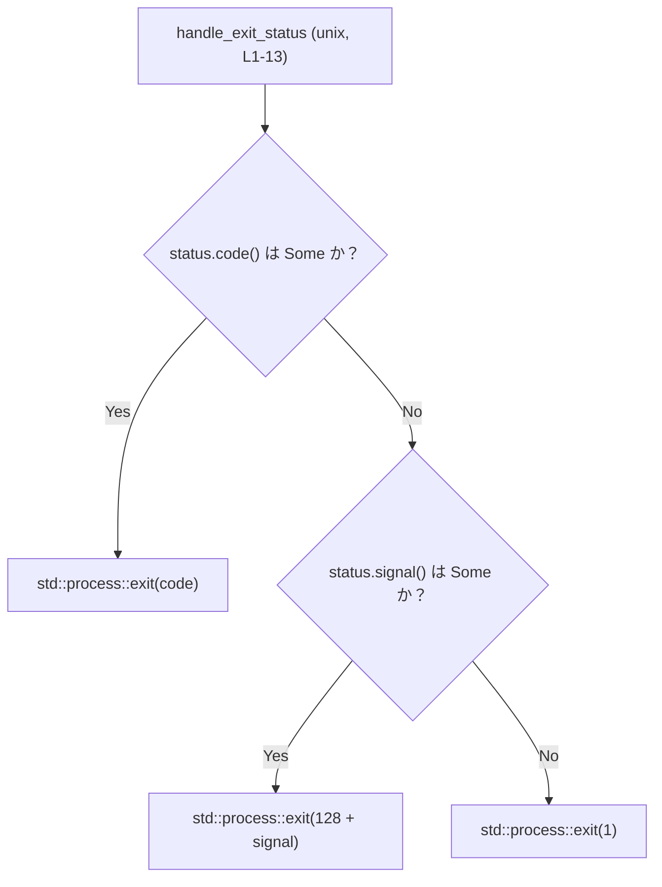
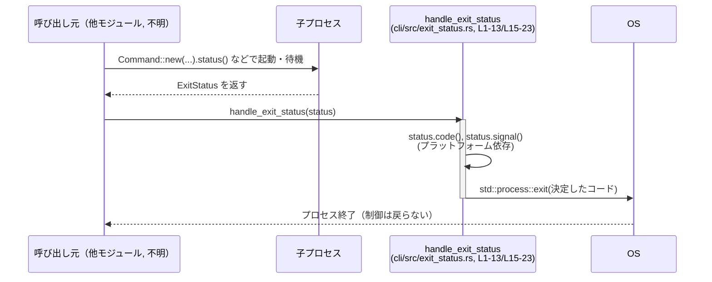

# cli/src/exit_status.rs コード解説

## 0. ざっくり一言

- 子プロセスなどの `std::process::ExitStatus` から適切な終了コードを決定し、`std::process::exit` を呼び出して **現在のプロセスを終了させるユーティリティ関数**を提供するモジュールです（`pub(crate)` のためクレート内部専用）。（根拠: `handle_exit_status` 定義と本体処理 `std::process::exit` 呼び出し, `cli/src/exit_status.rs:L2-12`, `L16-21`）

---

## 1. このモジュールの役割

### 1.1 概要

- このモジュールは、OS 依存の `ExitStatus` 表現から **CLI が返す終了コードを一元的に決定する役割**を持ちます。（根拠: `ExitStatus` を受け取り `std::process::exit` する関数, `L2-12`, `L16-21`）
- Unix と Windows で挙動を切り替え、Unix ではシグナルで終了した場合にも慣習的な「`128 + signal`」という終了コードに変換します。（根拠: `#[cfg(unix)]`, `status.signal()`, `128 + signal`, `L1`, `L3`, `L8-9`）
- 戻り値型が `!`（決して戻らない関数）であるため、**呼び出し後は必ずプロセスが終了する**ことが静的に保証されます。（根拠: シグネチャ `-> !`, `L2`, `L16`）

### 1.2 アーキテクチャ内での位置づけ

このチャンクには呼び出し元は現れませんが、`ExitStatus` を引数に取り `std::process::exit` を呼ぶ構造から、**「CLI の最終出口で呼ばれるラッパ関数」**として設計されていると解釈できます。（根拠: 引数と処理内容, `L2-12`, `L16-21`）

概念的な依存関係は次のようになります。


- `Caller`: このファイルには現れません。`ExitStatus` を生成する側（例: `Command::status()` の結果）を抽象的に表しています。（呼び出し元は不明）
- `Handle`: 本ファイルの `handle_exit_status`（Unix/Windows で実装が分岐）。（根拠: `#[cfg(unix)]`, `#[cfg(windows)]`, `L1`, `L15`）
- `OS`: `std::process::exit` によりプロセス終了を処理する OS 側。（根拠: `std::process::exit(...)`, `L7`, `L9`, `L11`, `L18`, `L21`）

### 1.3 設計上のポイント

- **OS ごとの分岐をコンパイル時に行う**  
  - `#[cfg(unix)]` と `#[cfg(windows)]` により、同名関数をプラットフォーム別に実装しています。（根拠: `L1`, `L15`）
- **決して戻らない API**  
  - 戻り値型が `!` で、関数本体のすべての分岐で `std::process::exit` を呼んでいるため、呼び出し後に処理が続くことはありません。（根拠: `-> !`, `std::process::exit` での早期終了, `L2`, `L6-11`, `L16-21`）
- **エラーハンドリング方針**  
  - `ExitStatus::code()` が `None` の場合（＝通常の終了コードが取れない場合）は、Unix では `signal()` を使ってシグナル値を考慮し、どちらも得られない場合はフォールバックとして終了コード `1` を返します。（根拠: `if let Some(code) = status.code() { ... } else if let Some(signal) = status.signal() { ... } else { std::process::exit(1); }`, `L6-11`）
  - Windows では `code()` が `None` の場合にフォールバックとして `1` を返します。（根拠: `if let Some(code) = status.code() { ... } else { ... std::process::exit(1); }`, `L17-21`）
- **状態を持たない純粋なユーティリティ**  
  - グローバル変数や構造体フィールドを持たず、引数と標準ライブラリの情報のみから終了コードを決定します。（根拠: ファイル全体に状態を持つ定義が存在しない, `L1-23`）
- **並行性における振る舞い**  
  - `std::process::exit` は現在のプロセスを即座に終了させ、他スレッドの実行も含めて強制終了します。これにより、他スレッドのクリーンアップコードは実行されません（Rust 標準ライブラリの仕様による）。

---

## 2. 主要な機能一覧（コンポーネントインベントリー）

このファイルに定義されているコンポーネントを一覧にします。

### 2.1 関数・モジュール一覧

| 名前 | 種別 | cfg 条件 | 役割 / 用途 | 行番号 |
|------|------|----------|-------------|--------|
| `handle_exit_status` | 関数 | `unix` | Unix において `ExitStatus` から終了コード（通常コード or `128 + signal` or `1`）を決定し、プロセスを終了させる | `cli/src/exit_status.rs:L1-13` |
| `handle_exit_status` | 関数 | `windows` | Windows において `ExitStatus` から終了コード（通常コード or `1`）を決定し、プロセスを終了させる | `cli/src/exit_status.rs:L15-23` |

---

## 3. 公開 API と詳細解説

### 3.1 型一覧（構造体・列挙体など）

このファイルには独自の構造体・列挙体などの公開（`pub`/`pub(crate)`）型定義は存在しません。（根拠: 全行確認, `L1-23`）

### 3.2 関数詳細

#### `handle_exit_status(status: std::process::ExitStatus) -> !`

（Unix/Windows で実装が分岐しますが、**インターフェースと目的は共通**です。）

**概要**

- 標準ライブラリの `ExitStatus` から「プロセスが終了すべき終了コード」を決定し、`std::process::exit` によって **現在のプロセスを終了**させます。（根拠: 関数シグネチャと本体, `L2-12`, `L16-21`）
- Unix ではシグナル終了も考慮し、`128 + signal` という慣習的な終了コードに変換します。（根拠: `else if let Some(signal) = status.signal() { std::process::exit(128 + signal); }`, `L8-9`）

**引数**

| 引数名 | 型 | 説明 |
|--------|----|------|
| `status` | `std::process::ExitStatus` | すでに終了したプロセスの終了ステータス。通常は `std::process::Command::status()` や `wait()` の結果です。関数内部で `code()` や（Unix では）`signal()` を通じて解析します。（根拠: 引数シグネチャとメソッド呼び出し, `L2-3`, `L6`, `L8`, `L16-17`） |

**戻り値**

- 戻り値型は `!`（never 型）であり、この関数は決して戻りません。（根拠: シグネチャ `-> !`, `L2`, `L16`）
- 内部で `std::process::exit` を呼び出し、呼び出し元や他スレッドの処理はすべて終了します。（根拠: すべての分岐で `std::process::exit(...)` を呼び、他に処理がない, `L7`, `L9`, `L11`, `L18`, `L21`）

**内部処理の流れ（アルゴリズム）**

Unix 版（`#[cfg(unix)]`）の処理:

1. `std::os::unix::process::ExitStatusExt` を `use` し、Unix 固有メソッド `signal()` などを利用可能にします。（根拠: `use std::os::unix::process::ExitStatusExt;`, `L3`）
2. `status.code()` を呼び、通常の終了コードが取得できるかを確認します。（根拠: `if let Some(code) = status.code() { ... }`, `L6`）
3. コードが取得できた場合は、その値をそのまま `std::process::exit(code)` に渡します。（根拠: `std::process::exit(code);`, `L7`）
4. コードが取得できない場合、`status.signal()` を呼び、シグナル番号が取得できるかを確認します。（根拠: `else if let Some(signal) = status.signal() { ... }`, `L8`）
5. シグナル番号が取得できた場合は、慣習に従い `128 + signal` を終了コードとして `std::process::exit(128 + signal)` を呼びます。（根拠: `std::process::exit(128 + signal);`, `L9`）
6. コードもシグナルも取得できない場合は、フォールバックとして終了コード `1` で終了します。（根拠: `else { std::process::exit(1); }`, `L10-11`）

Windows 版（`#[cfg(windows)]`）の処理:

1. `status.code()` を呼び、終了コードが取得できるかを確認します。（根拠: `if let Some(code) = status.code() { ... }`, `L17`）
2. コードが取得できた場合は、その値をそのまま `std::process::exit(code)` に渡します。（根拠: `std::process::exit(code);`, `L18`）
3. コードが取得できない場合は「まれだが起こりうる」とコメントされており、その場合フォールバックとして終了コード `1` で終了します。（根拠: コメントと `std::process::exit(1);`, `L19-21`）

簡易フローチャート（Unix 版）:



**Examples（使用例）**

> 以下の例では、同一モジュール内に `handle_exit_status` がある前提で呼び出しています。実際のモジュールパスはクレート構成に依存するため、このチャンクからは特定できません。

```rust
use std::process::Command;

// 子プロセスの終了コードを現在のプロセスに伝播させる例
fn main() {
    // "my-subcommand" を実行し、終了を待つ
    let status = Command::new("my-subcommand")          // 子プロセスを起動
        .status()                                       // 終了ステータスを取得
        .expect("failed to execute process");           // 実行失敗時は panic

    // 子プロセスの終了ステータスに従って、このプロセスを終了する
    handle_exit_status(status);                         // 戻ってこない（戻り値型は !）
}
```

- Unix でシグナルにより終了した場合の例（概念的な説明）:

  - 例えば、子プロセスが `SIGINT`（信号番号 2）で終了した `ExitStatus` を `status` として渡したとき、`status.code()` は `None`、`status.signal()` は `Some(2)` となり、`std::process::exit(130)` が呼び出されます。（根拠: `else if let Some(signal) = status.signal() { std::process::exit(128 + signal); }`, `L8-9`）

**Errors / Panics**

- この関数自体は `Result` や `Option` を返さず、**Rust レベルのエラーや panic を発生させません**。（根拠: 戻り値 `!`、`std::process::exit` のみ呼び出し, `L2-12`, `L16-21`）
- `std::process::exit` は OS に対するシステムコール的な動作を行い、スタックのアンワインド（drop 呼び出し）を行わずにプロセスを終了します。  
  そのため、**「通常の意味でのエラー伝播や後処理」は行われません**（Rust 標準ライブラリ仕様による）。

**Edge cases（エッジケース）**

- `status.code()` が `Some(code)` だが `code != 0` の場合  
  - エラー終了とみなすかどうかは呼び出し元ではなく、この関数は単にその値で終了します。（根拠: `std::process::exit(code);`, `L7`, `L18`）
- Unix で `status.code()` が `None` かつ `status.signal()` が `Some(signal)` の場合  
  - `128 + signal` で終了します。一般的に、シグナル番号は比較的小さい整数であるため、`128 + signal` は POSIX 的な慣習に沿った範囲の終了コードになります。（根拠: `status.signal()`, `128 + signal`, `L8-9`）
- Unix で `status.code()` も `status.signal()` も `None` の場合  
  - フォールバックとして終了コード `1` を使用します。（根拠: `else { std::process::exit(1); }`, `L10-11`）
- Windows で `status.code()` が `None` の場合  
  - コメントに「Rare on Windows」とある通りまれなケースとして扱い、終了コード `1` を用います。（根拠: コメントと `std::process::exit(1);`, `L19-21`）
- 異常に大きいシグナル番号  
  - 一般的な OS ではシグナル番号は小さな整数に限定されているため、`128 + signal` によるオーバーフロー等の実用上の問題は想定しにくいですが、コード上は特別なチェックをしていません。（根拠: 単純な `128 + signal` のみが記述され、境界チェックがない, `L9`）

**使用上の注意点**

- **プロセスを即座に終了させるため、ライブラリコードから呼ぶのは危険**です。  
  - `pub(crate)` のため、このクレート内からのみ呼び出せますが、たとえば内部ライブラリ層から呼び出すと、呼び出し元アプリケーション全体を強制終了してしまいます。（根拠: `pub(crate)` 修飾子, `L2`, `L16` と `std::process::exit` 呼び出し, `L7`, `L9`, `L11`, `L18`, `L21`）
- **リソース解放やログ出力が行われない可能性**があります。  
  - `std::process::exit` は通常の関数終了と違い `Drop` 実装を呼びません。そのため、ファイル/ネットワーク接続を明示的に閉じていない場合でも OS が回収することになりますが、ログバッファの flush など、Rust レベルのクリーンアップは実行されません。
- **マルチスレッド環境での使用**  
  - 他スレッドが実行中でもプロセス全体が終了します。共有状態の一貫性や一時ファイルの削除などをスレッド側に任せている場合、それらが完了しないまま終了する可能性があります。
- **制御フロー上の前提**  
  - 戻り値型が `!` のため、コンパイラは「この関数呼び出し後に制御は戻らない」と仮定して最適化します。`handle_exit_status` の後に続くコードに依存するロジックを置くと、そのコードは実行されません（実行不可能コード）。（根拠: `-> !` と `std::process::exit` のみの本体, `L2-12`, `L16-21`）

### 3.3 その他の関数

- このファイルには補助的な関数やラッパー関数は定義されていません。（根拠: 全行確認, `L1-23`）

---

## 4. データフロー

このモジュール単体で完結する代表的な処理シナリオは「子プロセス終了後に終了コードを伝播させる」です。

1. 呼び出し元（不明な別モジュール）が `std::process::Command` などで子プロセスを起動し、`ExitStatus` を取得します。
2. 取得した `ExitStatus` を `handle_exit_status` に渡します。（根拠: 関数引数, `L2`, `L16`）
3. `handle_exit_status` は `code()` や（Unix では）`signal()` から終了コードを決定し、`std::process::exit` を呼び出します。（根拠: `L6-11`, `L17-21`）
4. OS が現在のプロセスを終了し、呼び出し元に制御は戻りません。

Mermaid のシーケンス図で表すと、概念的には次のようになります。



---

## 5. 使い方（How to Use）

### 5.1 基本的な使用方法

CLI エントリポイントから子プロセスの終了ステータスをそのまま現在のプロセスの終了コードとして使う場合の一例です。

```rust
use std::process::Command;

// 同一モジュールに handle_exit_status が定義されていると仮定
fn main() {
    // 子プロセスを起動し終了を待つ
    let status = Command::new("my-subcommand")           // 実行したいコマンド
        .status()                                       // 終了ステータスを取得
        .expect("failed to execute process");           // 実行失敗で panic

    // 子プロセスの終了結果に従って、このプロセスを終了
    handle_exit_status(status);                         // 戻らない（戻り値型は !）
}
```

- このように、アプリケーションの「最後」に置かれるのが自然な使い方です。
- `handle_exit_status` 呼び出し後にはコードが実行されないため、ロギングやクリーンアップは **事前に** 行う必要があります。

### 5.2 よくある使用パターン

1. **単純な終了コード伝播**

   - 子プロセスが CLI のコマンドであり、その終了コードをラッパ CLI もそのまま伝播したい場合。
   - Unix ではシグナルによる終了も慣習に従って `128 + signal` へ変換されます。

2. **処理が 1 つだけのシンプルな CLI**

   - CLI 自身が実際の処理を別バイナリやサブコマンドに委譲している場合、その結果に従って終了する用途。

### 5.3 よくある間違い

```rust
// 誤り例: handle_exit_status のあとに処理が続く前提のコード
fn main() {
    let status = get_status_somehow();

    handle_exit_status(status);

    // ここには絶対に到達しない
    println!("ここには来ないはずだが、ロジック上必要だと思って書いてしまった");
}
```

```rust
// 正しい例: handle_exit_statusを「最終出口」として扱う
fn main() {
    let status = get_status_somehow();

    // ログ出力やクリーンアップはここまでで済ませる
    log::info!("子プロセスが終了しました: {:?}", status);

    // 最後にプロセス終了処理
    handle_exit_status(status);
    // ここ以降にコードを書かない / 実行されない前提で設計する
}
```

### 5.4 使用上の注意点（まとめ）

- **プロセス強制終了**: `handle_exit_status` を呼ぶとプロセス全体が終了し、Rust の `Drop` が走らないため、リソース解放やログ flush を事前に済ませる必要があります。
- **ライブラリ層では使用しない**: `pub(crate)` とはいえ、ユーティリティライブラリ層から呼ぶと、想定外のタイミングでアプリケーション全体が終了する可能性があります。
- **マルチスレッドとの併用**: 実行中の他スレッドがあってもプロセスは終了するため、スレッド間での協調的なシャットダウン（チャネルでの通知など）を行う設計とは両立しません。
- **テストコードでの使用**: 単体テスト内で直接呼ぶと、テストプロセス自体が終了してしまいます。テストでは `handle_exit_status` の手前までを検証するか、終了コード決定ロジックを別関数に切り出してからテストする設計が考えられます（このファイルにはそうした分離は実装されていません）。

---

## 6. 変更の仕方（How to Modify）

### 6.1 新しい機能を追加する場合

代表的な拡張パターンと、その際に見るべき箇所です。

1. **終了コード決定ロジックを拡張したい場合**

   例: ある特定の終了コードを別の値にマッピングしたい、ログ出力を挟みたいなど。

   - Unix 版:  
     - `status.code()` の `if` ブロック内（`std::process::exit(code);` の直前）に、マッピング処理やログ出力を追加することになります。（根拠: `L6-7`）
     - シグナル処理は `else if let Some(signal) = status.signal() { ... }` ブロック内で行われているため、ここに追加します。（根拠: `L8-9`）
   - Windows 版:  
     - `if let Some(code) = status.code() { ... }` ブロック内に同様の処理を追加します。（根拠: `L17-18`）

2. **終了コード算出とプロセス終了を分離したい場合**

   - 現状は `handle_exit_status` がコード算出と `std::process::exit` の両方を担っています。（根拠: `L6-11`, `L17-21`）
   - テスト容易性や再利用性を考える場合、例えば `fn compute_exit_code(status: ExitStatus) -> i32` のような関数を新設し、このファイル内の `handle_exit_status` から呼び出す、という構造も考えられます。  
     ※このような補助関数は現時点のファイルには存在しません。

3. **非 Unix / 非 Windows のサポート**

   - このチャンクには `#[cfg(unix)]` と `#[cfg(windows)]` のみが記述されており、他プラットフォーム向けの実装はありません。（根拠: `L1`, `L15`）
   - もし他プラットフォーム（例: WASI 等）をサポートする場合は、別の `#[cfg(...)]` ブロックを追加し、同名の `handle_exit_status` を実装する必要があります。

### 6.2 既存の機能を変更する場合

変更時に注意すべき契約や影響範囲です。

- **契約: 「決して戻らない」こと**

  - 戻り値型 `!` と「必ず `std::process::exit` を呼ぶ」という契約は、呼び出し側の設計に影響します。  
    - これを `i32` 返却などに変更すると、呼び出し側コードの制御フローやエラー処理パターンが大きく変わります。
  - 既存コードが `handle_exit_status` 呼び出しの後に処理を書いていない前提で実装されている可能性があり、この契約を変える場合は呼び出し元すべての確認が必要です。

- **契約: 「Unix では `128 + signal`」というマッピング**

  - シェルや他のツールチェーンでは「シグナル終了時の終了コードは `128 + signal`」という慣習に依存していることが多く、この挙動を変更すると外部ツールとの互換性に影響します。（根拠: `std::process::exit(128 + signal);`, `L9`）

- **Unix / Windows の両実装を同期させる**

  - インターフェースは同じでも、OS ごとの実装がずれてくると保守性が低下します。  
    - 例: ログ出力を Unix だけに追加して Windows を忘れる、など。
  - 変更時には `#[cfg(unix)]` と `#[cfg(windows)]` 両方の `handle_exit_status` 本体を確認する必要があります。（根拠: 両ブロックの存在, `L1-13`, `L15-23`）

- **テストの観点**

  - 変更内容が終了コードの決定に関わる場合、Unix の `code` / `signal` 両ケース、Windows の `code` / `None` フォールバックケースをテストする必要があります。
  - ただし `handle_exit_status` 自体はプロセスを終了させるため、単体テストでは終了コード算出ロジックを分離してテストすることが望ましい構造です（現状は未分離）。

- **セキュリティ・安定性上の注意**

  - 終了コードの範囲外（極端に大きい値や負値）を生成しないようにするなど、必要に応じて境界チェックを追加することも検討対象ですが、現状コードにはそのようなチェックはありません。（根拠: `std::process::exit(code);` と `std::process::exit(128 + signal);` がそのまま呼ばれている, `L7`, `L9`, `L18`）

---

## 7. 関連ファイル

このチャンクから直接分かる関連は主に標準ライブラリと OS 固有拡張です。

| パス / モジュール | 役割 / 関係 |
|-------------------|------------|
| `std::process` | `ExitStatus` 型および `std::process::exit` を提供し、本モジュールの引数と終了処理として利用されています。（根拠: 関数シグネチャと `std::process::exit` 呼び出し, `L2`, `L7`, `L9`, `L11`, `L16-18`, `L21`） |
| `std::os::unix::process::ExitStatusExt` | Unix 環境で `ExitStatus` に対する `signal()` メソッドなどの拡張を提供し、シグナル終了時の処理に利用されています。（根拠: `use std::os::unix::process::ExitStatusExt;` と `status.signal()`, `L3`, `L8`） |
| （クレート内の呼び出し元） | `ExitStatus` を生成して `handle_exit_status` を呼び出す側のモジュールが存在するはずですが、このチャンクには現れません。パスは不明です。 |

このファイル単体ではテストコードやサポート用ユーティリティファイルは確認できません（`tests` や他モジュールへの参照がないため）。
