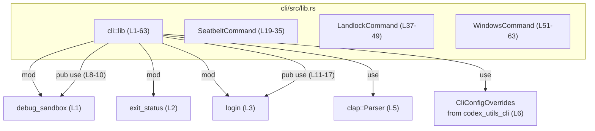
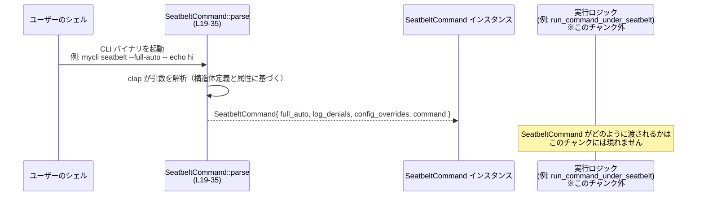

# cli/src/lib.rs コード解説

## 0. ざっくり一言

このモジュールは、CLI ツールのための **サンドボックス実行コマンド（macOS / Linux / Windows）とログイン系処理の公開 API** をまとめるエントリポイントです。  
コマンドライン引数の定義には `clap` の `Parser` 派生を利用しています。

---

## 1. このモジュールの役割

### 1.1 概要

- このモジュールは、CLI 全体の中で **「ライブラリとしての公開インターフェース」** を担っています。
- 具体的には以下を行います。
  - サンドボックス実行関連の内部モジュール `debug_sandbox` と、ログイン関連モジュール `login` の関数を `pub use` で再エクスポートし、外部から利用しやすくする（L8–17）。
  - `clap::Parser` を用いて、OS ごとのサンドボックス実行用 CLI 引数構造体（`SeatbeltCommand` / `LandlockCommand` / `WindowsCommand`）を定義する（L19–63）。

### 1.2 アーキテクチャ内での位置づけ

このファイルは `cli` クレート（名前は仮）における `lib.rs` であり、下位モジュールや外部クレートとの依存関係は次のようになっています。



- `exit_status` モジュール（L2）はこのチャンクに定義が現れません。役割は不明です。
- `debug_sandbox` と `login` は、実装はこのチャンク外にありますが、サンドボックス実行およびログイン処理の本体を持つと考えられます（関数名から推測されますが、詳細は不明です）。

### 1.3 設計上のポイント

コードから読み取れる特徴を整理します。

- **責務分割**
  - 実際のサンドボックス実行・ログイン処理は `debug_sandbox` / `login` モジュールに分離し、このファイルは **型定義と公開 API の集約** に専念しています（L1–3, L8–17）。
- **CLI 引数定義の一元化**
  - OS ごとのサンドボックスコマンド（Seatbelt, Landlock, Windows）について、すべて `#[derive(Parser)]` と属性マクロで定義しており、CLI 仕様が構造体定義に集約されています（L19–63）。
- **設定のオーバーライド**
  - 各コマンド構造体には、`CliConfigOverrides` フィールドが `#[clap(skip)]` 付きで含まれており（L29–30, L43–44, L57–58）、コマンドラインからは設定せず、内部的に上書き値を注入できる設計になっています。
- **エラーハンドリング**
  - 明示的なエラー処理コードはこのファイルにはなく、CLI 解析時のエラーは `clap::Parser` が処理する前提です（L5, L19, L37, L51）。
- **状態 / 並行性**
  - ここで定義される型はすべて単純なデータ保持構造体であり、スレッドや非同期処理は登場しません。並行性に関する処理は、このモジュールからは読み取れません。

---

## 2. 主要な機能一覧（コンポーネントインベントリー）

このファイルに現れる主要コンポーネントと役割を一覧にします。

### 2.1 モジュール・外部依存の一覧

| コンポーネント | 種別 | 役割 / 用途 | 根拠 |
|----------------|------|-------------|------|
| `debug_sandbox` | モジュール | サンドボックス下でコマンドを実行する機能を提供するモジュールと見られますが、実装はこのチャンクには現れません。 | `cli/src/lib.rs:L1`, `L8-10` |
| `exit_status`   | モジュール | 名前から終了ステータス関連の処理が想定されますが、実装はこのチャンクには現れません。 | `cli/src/lib.rs:L2` |
| `login`         | モジュール | ログイン／ログアウト関連処理を提供するモジュールと見られますが、実装はこのチャンクには現れません。 | `cli/src/lib.rs:L3`, `L11-17` |
| `clap::Parser`  | 外部クレートのトレイト | CLI 引数解析用の `Parser` トレイト。`#[derive(Parser)]` で利用されています。 | `cli/src/lib.rs:L5`, `L19`, `L37`, `L51` |
| `CliConfigOverrides` | 外部型 | CLI 設定の上書きを保持する型と見られますが、詳細はこのチャンクからは分かりません。 | `cli/src/lib.rs:L6`, `L29-30`, `L43-44`, `L57-58` |

### 2.2 公開構造体・再エクスポート関数

| コンポーネント | 種別 | 役割 / 用途（コードから確実に言える範囲） | 定義位置 |
|----------------|------|-------------------------------------------|----------|
| `SeatbeltCommand` | 構造体 | macOS seatbelt サンドボックスでコマンドを実行するための CLI 引数を保持する構造体です。 | `cli/src/lib.rs:L19-35` |
| `LandlockCommand` | 構造体 | Linux Landlock サンドボックスでコマンドを実行するための CLI 引数を保持する構造体です。 | `cli/src/lib.rs:L37-49` |
| `WindowsCommand`  | 構造体 | Windows の「restricted token」サンドボックスでコマンドを実行するための CLI 引数を保持する構造体です。 | `cli/src/lib.rs:L51-63` |
| `run_command_under_landlock` | 関数（再エクスポート） | Landlock サンドボックス下でコマンドを実行する関数（と見られます）が公開されています。詳細なシグネチャや挙動はこのチャンクには現れません。 | `cli/src/lib.rs:L8` |
| `run_command_under_seatbelt` | 関数（再エクスポート） | macOS seatbelt サンドボックス下でコマンドを実行する関数（と見られます）。詳細は不明です。 | `cli/src/lib.rs:L9` |
| `run_command_under_windows`  | 関数（再エクスポート） | Windows のサンドボックス下でコマンドを実行する関数（と見られます）。詳細は不明です。 | `cli/src/lib.rs:L10` |
| `read_api_key_from_stdin`    | 関数（再エクスポート） | 標準入力から API キーを読み取る関数（と見られます）が公開されています。詳細は不明です。 | `cli/src/lib.rs:L11` |
| `run_login_status`           | 関数（再エクスポート） | ログイン状態を確認する関数（と見られます）。詳細は不明です。 | `cli/src/lib.rs:L12` |
| `run_login_with_api_key`     | 関数（再エクスポート） | API キーを使ってログインする関数（と見られます）。詳細は不明です。 | `cli/src/lib.rs:L13` |
| `run_login_with_chatgpt`     | 関数（再エクスポート） | ChatGPT を介してログインする関数（と見られます）。詳細は不明です。 | `cli/src/lib.rs:L14` |
| `run_login_with_device_code` | 関数（再エクスポート） | デバイスコード方式でログインする関数（と見られます）。詳細は不明です。 | `cli/src/lib.rs:L15` |
| `run_login_with_device_code_fallback_to_browser` | 関数（再エクスポート） | デバイスコード方式でのログインに失敗した場合にブラウザにフォールバックするログイン関数（と見られます）。詳細は不明です。 | `cli/src/lib.rs:L16` |
| `run_logout`                 | 関数（再エクスポート） | ログアウト処理を行う関数（と見られます）。詳細は不明です。 | `cli/src/lib.rs:L17` |

> 補足: 再エクスポートされた関数群はすべて `debug_sandbox` または `login` モジュールに実装があり、このチャンクには関数定義は現れません。そのためシグネチャや内部処理はここからは把握できません。

---

## 3. 公開 API と詳細解説

### 3.1 型一覧（構造体）

#### 構造体一覧

| 名前 | 種別 | フィールド | 役割 / 用途 | 定義位置 |
|------|------|-----------|-------------|----------|
| `SeatbeltCommand` | 構造体 | `full_auto: bool`, `log_denials: bool`, `config_overrides: CliConfigOverrides`, `command: Vec<String>` | macOS seatbelt サンドボックスでコマンドを実行する CLI サブコマンドの引数を表します。 | `cli/src/lib.rs:L19-35` |
| `LandlockCommand` | 構造体 | `full_auto: bool`, `config_overrides: CliConfigOverrides`, `command: Vec<String>` | Linux Landlock サンドボックスでコマンドを実行する CLI サブコマンドの引数を表します。 | `cli/src/lib.rs:L37-49` |
| `WindowsCommand` | 構造体 | `full_auto: bool`, `config_overrides: CliConfigOverrides`, `command: Vec<String>` | Windows restricted token サンドボックスでコマンドを実行する CLI サブコマンドの引数を表します。 | `cli/src/lib.rs:L51-63` |

##### SeatbeltCommand のフィールド詳細（L19–35）

- `full_auto: bool`（L21–23）
  - `--full-auto` というロングオプションで指定されるブール値です。
  - デフォルトは `false`（L22: `default_value_t = false`）。
  - ドキュメントコメントから、「ネットワーク無効・カレントディレクトリと `TMPDIR` への書き込みのみ許可するサンドボックスでの自動実行」のショートカットであると説明されています（L21）。
- `log_denials: bool`（L25–27）
  - `--log-denials` オプションで指定されるブール値です。
  - デフォルトは `false`。
  - ドキュメントコメントによると、実行中に `log stream` を使って macOS サンドボックスの拒否ログを収集し、終了後に表示するかどうかを制御します（L25）。
- `config_overrides: CliConfigOverrides`（L29–30）
  - `#[clap(skip)]` により、コマンドライン引数としては扱われず、プログラム側で設定するためのフィールドです（L29）。
- `command: Vec<String>`（L32–34）
  - `trailing_var_arg = true` な引数として定義されており、サンドボックス下で実行するコマンドとその引数をフルで保持するベクタです（L32–34）。
  - ドキュメントコメントに「Full command args to run under seatbelt.」とあります（L32）。

##### LandlockCommand のフィールド（L37–49）

- `full_auto: bool`（L39–41）
- `config_overrides: CliConfigOverrides`（L43–44）
- `command: Vec<String>`（L46–48）

SeatbeltCommand と同様に `full_auto` と `command` があり、`log_denials` がない点だけが異なります。ドキュメントコメントから、この構造体は Linux サンドボックス向けであることが分かります（L46）。

##### WindowsCommand のフィールド（L51–63）

- `full_auto: bool`（L53–55）
- `config_overrides: CliConfigOverrides`（L57–58）
- `command: Vec<String>`（L60–62）

LandlockCommand と同じ構成であり、ドキュメントコメントから Windows restricted token サンドボックス用であることが分かります（L60）。

---

### 3.2 関数詳細（clap が提供する `parse` メソッド）

このファイルには明示的な関数定義はありませんが、`#[derive(Parser)]` により、`SeatbeltCommand` / `LandlockCommand` / `WindowsCommand` には `clap::Parser` トレイトのメソッド（特に `parse()`）が実装されます。  
ここでは代表として `SeatbeltCommand::parse` について説明します（他 2 つはフィールド構成を除き同様です）。

> ※ 以下は `clap` クレートの `Parser` トレイト仕様に基づくものであり、このファイル自体には生成コードは現れませんが、`#[derive(Parser)]`（L19, L37, L51）によりこれらのメソッドが利用可能であることが保証されます。

#### `SeatbeltCommand::parse() -> SeatbeltCommand`

**概要**

- コマンドライン引数（`std::env::args_os()`）を解析し、`SeatbeltCommand` 構造体のインスタンスを生成します。
- `full_auto` / `log_denials` / `command` フィールドは CLI 引数から設定され、`config_overrides` は `#[clap(skip)]` により CLI からは設定されません。

**引数**

このメソッドは引数を取りません（`clap::Parser` の標準 API）。

| 引数名 | 型 | 説明 |
|--------|----|------|
| なし | - | 内部で `std::env::args_os()` を読み出し、CLI 引数を解析します。 |

**戻り値**

- 型: `SeatbeltCommand`
- 意味:
  - ユーザーが指定したオプションを反映した `SeatbeltCommand` インスタンスです。
  - `full_auto` / `log_denials` / `command` には CLI の値が入り、`config_overrides` は `#[clap(skip)]` による初期値（通常は `Default` 実装など）になります。

**内部処理の流れ（概念レベル）**

1. `clap` が `SeatbeltCommand` の構造体定義と属性（L21–27, L32–34）を読み取り、コマンドライン仕様を構築する。
2. 実行時に `SeatbeltCommand::parse()` が呼ばれると、`std::env::args_os()` からコマンドライン引数を取得する。
3. `--full-auto` / `--log-denials` のようなロングオプションを解析し、それぞれ `full_auto` / `log_denials` に `bool` として格納する。
4. `trailing_var_arg = true` な `command: Vec<String>` に、残りの引数（サンドボックス下で実行するコマンドとその引数）を順番に格納する。
5. `config_overrides` は `#[clap(skip)]` のため CLI からは設定されず、生成コードが決めるデフォルト値がそのまま使われる。
6. 解析に成功すれば `SeatbeltCommand` インスタンスを返す。解析エラー時には、`clap` がエラーメッセージやヘルプを出力してプロセスを終了させます（通常は非 0 の終了コード）。

**Examples（使用例）**

`SeatbeltCommand` を使って CLI 引数をパースし、その内容を表示する最小例です。

```rust
// この例では、このライブラリのクレート名を仮に `cli` とします。
// 実際のクレート名は Cargo.toml に依存します。

use clap::Parser;                    // Parser トレイトをインポートする
use cli::SeatbeltCommand;            // lib.rs で公開された構造体をインポートする

fn main() {
    // コマンドライン引数を解析して SeatbeltCommand を生成する
    let cmd = SeatbeltCommand::parse();

    // 構造体の内容をデバッグ表示する（#[derive(Debug)] により {:?} が使える）
    println!("{:?}", cmd);
}
```

このコードを `seatbelt-cli --full-auto --log-denials echo hello` のように実行すると、  
`full_auto = true`, `log_denials = true`, `command = ["echo", "hello"]` のような内容を持つ `SeatbeltCommand` が生成されることが期待されます。

**Errors / Panics**

- **パースエラー**
  - 必須引数が不足している、オプションの形式が誤っているなどの場合、`clap` はデフォルトではエラーメッセージを標準エラーに表示し、プロセスを非 0 ステータスで終了します。
  - `SeatbeltCommand::parse()` は `Result` ではなく `Self` を返す API のため、呼び出し側でエラーを `match` することはできません（エラー時はプロセスが終了します）。
- **パニック**
  - `clap` の内部実装によるパニック条件は、このチャンクからは分かりませんが、通常は不正な属性の組み合わせなどコンパイル時に検出されるケースが多いです。

**Edge cases（エッジケース）**

- `command` が空の場合
  - `command: Vec<String>` に `required = true` 等の属性は付いていないため（L33 にそのような指定はありません）、ユーザーがコマンドを指定しなくても `SeatbeltCommand` は生成される可能性があります。
  - その場合、後続処理側で空ベクタをどのように扱うかは、このチャンクからは分かりません。利用側でチェックする必要がある可能性があります。
- `--full-auto` / `--log-denials` を指定しない場合
  - `default_value_t = false` のため、明示的に指定されなければ `false` になります（L22, L26）。
- 同じオプションを複数回指定した場合
  - `bool` フラグに対する複数指定時の挙動は `clap` の仕様に依存し、このファイルからは詳細は分かりません。

**使用上の注意点**

- `config_overrides` は `#[clap(skip)]` により CLI から設定されません（L29）。
  - 後続コードで設定を上書きしたい場合は、`SeatbeltCommand::parse()` の結果に対してフィールドを上書きする必要があります。
- `SeatbeltCommand::parse()` を利用するには、スコープ内に `use clap::Parser;` が必要です（トレイトメソッド呼び出しのため）。
- 並行性
  - `parse()` 自体は単純な同期処理であり、スレッドを生成したり共有状態を扱ったりはしません。このファイルから読み取れる限り、並行性に関する特別な配慮は不要です。

#### `LandlockCommand::parse() -> LandlockCommand`

`SeatbeltCommand::parse()` と同様に、Linux 用サンドボックスコマンドの引数を解析します。  
フィールド構成の違いにより、`log_denials` が存在しない点だけが異なります（L39–41, L43–44, L46–48）。

#### `WindowsCommand::parse() -> WindowsCommand`

`LandlockCommand::parse()` と同様で、Windows 用サンドボックスコマンドの引数を解析します（L53–55, L57–58, L60–62）。

---

### 3.3 その他の関数（再エクスポートのみ）

このファイルでは多くの関数が `pub use` で再エクスポートされていますが、実装はすべて別モジュールにあり、このチャンクから詳細は分かりません。

| 関数名 | 元モジュール | 役割（名称からの概要） | 定義位置（再エクスポート） |
|--------|--------------|------------------------|----------------------------|
| `run_command_under_landlock` | `debug_sandbox` | Landlock サンドボックス下でコマンドを実行する関数と見られますが、実装は不明です。 | `cli/src/lib.rs:L8` |
| `run_command_under_seatbelt` | `debug_sandbox` | macOS seatbelt サンドボックス下でコマンドを実行する関数と見られますが、実装は不明です。 | `cli/src/lib.rs:L9` |
| `run_command_under_windows` | `debug_sandbox` | Windows サンドボックス下でコマンドを実行する関数と見られますが、実装は不明です。 | `cli/src/lib.rs:L10` |
| `read_api_key_from_stdin` | `login` | 標準入力から API キーを読み取る関数と見られますが、実装は不明です。 | `cli/src/lib.rs:L11` |
| `run_login_status` | `login` | ログイン状態を確認する関数と見られますが、実装は不明です。 | `cli/src/lib.rs:L12` |
| `run_login_with_api_key` | `login` | API キーを用いてログインする関数と見られますが、実装は不明です。 | `cli/src/lib.rs:L13` |
| `run_login_with_chatgpt` | `login` | ChatGPT 経由でのログインを行う関数と見られますが、実装は不明です。 | `cli/src/lib.rs:L14` |
| `run_login_with_device_code` | `login` | デバイスコード方式でログインする関数と見られますが、実装は不明です。 | `cli/src/lib.rs:L15` |
| `run_login_with_device_code_fallback_to_browser` | `login` | デバイスコードログインに失敗した際にブラウザへフォールバックする関数と見られますが、実装は不明です。 | `cli/src/lib.rs:L16` |
| `run_logout` | `login` | ログアウト処理を行う関数と見られますが、実装は不明です。 | `cli/src/lib.rs:L17` |

> これらの関数の引数や戻り値・エラー挙動・並行性などは、このチャンクには現れません。

---

## 4. データフロー

このファイルから確実に分かるデータフローは、**「CLI 引数 → clap による解析 → コマンド構造体」** の流れです。

1. ユーザーが OS のシェルから CLI バイナリを実行し、オプションやコマンドを指定する。
2. バイナリ側の `main` などで `SeatbeltCommand::parse()` などが呼ばれ、`clap` が CLI 引数を解析する。
3. 解析結果が `SeatbeltCommand` / `LandlockCommand` / `WindowsCommand` インスタンスとして構造化される。
4. その後、この構造体がどのように `run_command_under_*` や `login` 系関数に渡されるかは、このチャンクからは分かりません。

これをシーケンス図で表します（Seatbelt の例）。



---

## 5. 使い方（How to Use）

### 5.1 基本的な使用方法

このモジュールを利用した基本的なフローは「`clap` による構造体のパース → 構造体の利用」です。  
サンドボックス実行本体に関するコードはこのチャンクにはないため、ここでは **構造体のパースと確認** の例を示します。

```rust
// この例では、ライブラリクレート名を `cli` と仮定します。
// 実際のクレート名は Cargo.toml の `name` に従います。

use clap::Parser;               // Parser トレイトをインポート
use cli::SeatbeltCommand;       // lib.rs で公開された構造体を利用

fn main() {
    // コマンドライン引数を SeatbeltCommand としてパースする
    let cmd = SeatbeltCommand::parse();  // clap が生成したメソッド

    // 得られた値を確認する
    println!("full_auto   : {}", cmd.full_auto);
    println!("log_denials : {}", cmd.log_denials);
    println!("command     : {:?}", cmd.command);

    // config_overrides は #[clap(skip)] なので、ここではデフォルト値が入っている前提です。
}
```

同様に、Linux では `LandlockCommand::parse()`, Windows では `WindowsCommand::parse()` を使う形が自然です。

### 5.2 よくある使用パターン

1. **OS ごとのコマンド構造体を切り替える**

   例えば、単一のバイナリで OS ごとに利用する構造体を切り替える場合は、`cfg` 属性を使うことが考えられます（あくまで一例です）。

   ```rust
   use clap::Parser;

   #[cfg(target_os = "macos")]
   use cli::SeatbeltCommand as SandboxCommand;

   #[cfg(target_os = "linux")]
   use cli::LandlockCommand as SandboxCommand;

   #[cfg(target_os = "windows")]
   use cli::WindowsCommand as SandboxCommand;

   fn main() {
       let cmd = SandboxCommand::parse();
       println!("{:?}", cmd);
   }
   ```

2. **プログラム側から設定オーバーライドを注入する**

   `config_overrides` は `#[clap(skip)]` のため CLI からは設定されず、後から上書きできます。

   ```rust
   use clap::Parser;
   use cli::SeatbeltCommand;
   use codex_utils_cli::CliConfigOverrides;

   fn main() {
       let mut cmd = SeatbeltCommand::parse();

       // ここでは仮に Default で初期化しています。
       // 実際の使用方法は CliConfigOverrides の仕様に依存します。
       cmd.config_overrides = CliConfigOverrides::default();

       // 以降、cmd を使ってサンドボックス実行のロジックに渡すことが想定されます。
   }
   ```

   `CliConfigOverrides` の具体的なフィールドや意味は、このチャンクには現れません。

### 5.3 よくある間違い（想定されるもの）

実装や `clap` の一般的な使い方から起こりやすそうなポイントを挙げます。

```rust
// 間違い例: Parser トレイトをインポートしていない
// use cli::SeatbeltCommand;
//
// fn main() {
//     let cmd = SeatbeltCommand::parse();  // コンパイルエラー: method not found
// }

// 正しい例: Parser トレイトをインポートする
use clap::Parser;
use cli::SeatbeltCommand;

fn main() {
    let cmd = SeatbeltCommand::parse();  // OK
    println!("{:?}", cmd);
}
```

- `SeatbeltCommand::parse()` などのメソッドは `Parser` トレイトから提供されるため、`use clap::Parser;` がないとコンパイラにメソッドが見えません。
- `command` を必須と想定しているのに、実際には `command` が空のままになるケースがあり得ます（L33 に `required = true` 等はないため）。その場合のチェックは呼び出し側で行う必要があります。

### 5.4 使用上の注意点（まとめ）

- **CLI 仕様と実装の分離**
  - このファイルでは引数構造体と関数の公開だけを行い、実際のサンドボックス実行・ログイン処理は他モジュールに委ねています。そのため、この構造体を変更するときは、必ず `debug_sandbox` / `login` 側の参照箇所を確認する必要があります（実際の参照箇所はこのチャンクには現れません）。
- **セキュリティ観点**
  - `command` は `Vec<String>` として保持されており、シェル文字列ではなくトークン化された形になっています（L33–34, L47–48, L61–62）。後続コードが `std::process::Command` などにそのまま渡す実装であれば、シェルインジェクションリスクを下げられますが、実際の実装はこのチャンクからは分かりません。
  - `log_denials` はサンドボックス拒否ログを標準出力に表示するためのフラグであり（L25–27）、有効化するとファイルパスなどの情報がログに残る可能性があります。機密情報との兼ね合いに注意が必要な場合があります。
- **エラー / 終了コード**
  - CLI 引数の誤り等に対する挙動（ヘルプ表示・終了コード）は `clap` の仕様に依存します。アプリケーション全体のエラー処理ポリシーと整合性を取る際には、`clap` の設定（カスタムエラーハンドラなど）も含めて検討する必要がありますが、このチャンクにはその設定は現れません。
- **並行性**
  - このモジュールは状態を持たない構造体定義と再エクスポートのみであり、スレッドセーフ性や非同期 I/O に関する直接の注意点はありません。並行性に関する設計は、サンドボックス実行・ログイン処理の実装側に依存します。

---

## 6. 変更の仕方（How to Modify）

### 6.1 新しい機能を追加する場合

1. **新しい CLI サブコマンドを追加したい場合**
   - 新しい OS 向けサンドボックスや別種の実行モードを追加する場合は、`cli/src/lib.rs` に新しい構造体を `#[derive(Debug, Parser)]` 付きで定義するのが自然です（`SeatbeltCommand` 等と同様のパターン, L19–35, L37–49, L51–63 を参照）。
   - 新しい構造体にも `config_overrides: CliConfigOverrides` を含めるかどうかを決め、必要に応じて `#[clap(skip)]` を付与します。
   - 実際の実行ロジックは新規モジュール（例: `mod new_sandbox;`）に実装し、その関数を `pub use` で再エクスポートすることで、外部からの利用を統一できます（L8–17 のパターン）。

2. **ログインフローを追加したい場合**
   - 既存の `login` モジュールに新しい関数を実装し、このファイルから `pub use login::run_login_with_xxx;` のように再エクスポートする形が一貫しています（L11–17 を参照）。
   - 新しい関数名・挙動は `run_login_with_*` という命名規則に合わせると分かりやすくなります。

### 6.2 既存の機能を変更する場合

- **構造体フィールドの変更**
  - `SeatbeltCommand` / `LandlockCommand` / `WindowsCommand` のフィールドを追加・削除・型変更する場合、これらを使用しているコード（主に `debug_sandbox` や CLI エントリポイント）への影響が大きい可能性があります。
  - 特に `command: Vec<String>` の仕様（必須かどうか・オプション名など）を変えると CLI 互換性に影響します。
- **CLI オプション名の変更**
  - `#[arg(long = "full-auto")]` などのロングオプション名を変更すると、既存ユーザーのコマンドラインが動作しなくなる可能性があります（L22, L40, L54）。
- **契約（前提条件）の確認**
  - このチャンクからは後続処理の実装が分からないため、変更前に必ずコードベース全体を検索し、どのフィールドがどのように前提条件として扱われているかを確認する必要があります。
  - 例えば `full_auto` が「他のすべてのオプションのショートカット」として扱われている可能性などは、このチャンクだけでは判断できません。

---

## 7. 関連ファイル

このモジュールと密接に関係しそうなファイル・モジュールをまとめます。

| パス / モジュール | 役割 / 関係（このチャンクから分かる範囲） | 根拠 |
|-------------------|-------------------------------------------|------|
| `cli/src/debug_sandbox.rs`（推定） / `mod debug_sandbox` | `run_command_under_*` 系関数の実装を持つと見られます。サンドボックス下で実際にコマンドを起動するロジックを担当している可能性が高いですが、実装はこのチャンクには現れません。 | `cli/src/lib.rs:L1`, `L8-10` |
| `cli/src/exit_status.rs`（推定） / `mod exit_status` | 名前から、プロセスの終了コードやエラーコード処理を行うモジュールであると推測されますが、実装は不明です。 | `cli/src/lib.rs:L2` |
| `cli/src/login.rs`（推定） / `mod login` | ログイン／ログアウト処理、および API キーの読み取りなどを実装しているモジュールと見られます。`run_login_*` / `run_logout` / `read_api_key_from_stdin` が再エクスポートされています。 | `cli/src/lib.rs:L3`, `L11-17` |
| 外部クレート `clap` | CLI 引数のパースとヘルプ生成、エラーハンドリングを提供します。`#[derive(Parser)]` と `use clap::Parser;` から依存が分かります。 | `cli/src/lib.rs:L5`, `L19`, `L37`, `L51` |
| 外部クレート `codex_utils_cli` | `CliConfigOverrides` 型を通じて設定上書き機能を提供していると見られますが、詳細はこのチャンクからは分かりません。 | `cli/src/lib.rs:L6`, `L29-30`, `L43-44`, `L57-58` |

### テストについて

- このファイルにはテストモジュール（`mod tests`）やテスト関数は含まれていません。
- CLI 仕様のテスト（オプションの有無・ヘルプメッセージ等）は、別ファイルや別クレートに定義されている可能性がありますが、このチャンクからは位置を特定できません。

---

### まとめ

- `cli/src/lib.rs` は、サンドボックス実行・ログイン機能の **公開 API の集約ポイント** であり、実装の詳細はすべて下位モジュールに委譲されています。
- Rust / `clap` 特有の安全性として、構造体で CLI 引数を型付きで表現することで、不正な型の入力はパース時点で弾かれ、実行ロジックに渡る前に検出される設計になっています。
- 並行性や低レベルのエラーハンドリング、セキュリティ上の中核的なロジックは、このファイルではなく `debug_sandbox` / `login` などのモジュールに存在すると考えられ、このチャンクからは詳細を読み取ることはできません。
