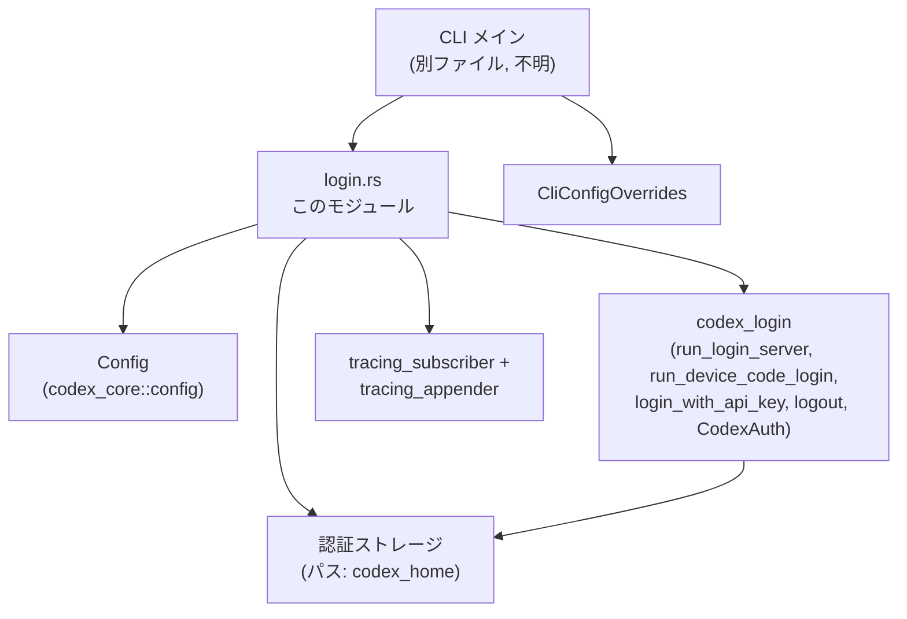
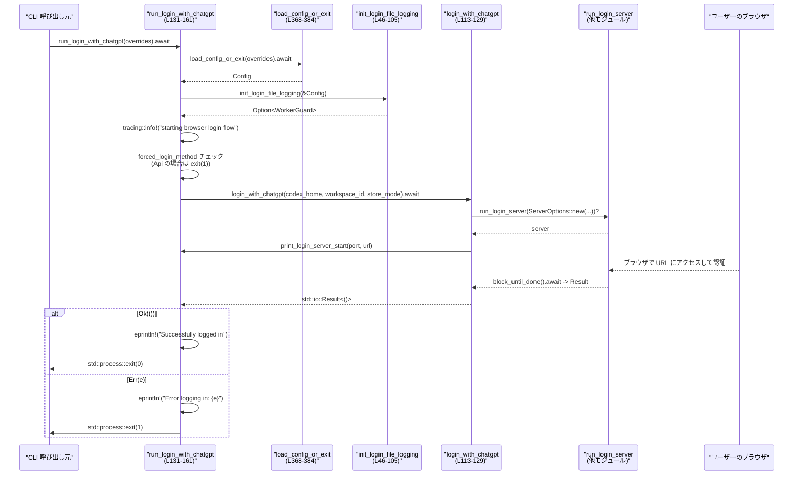

# cli/src/login.rs

## 0. ざっくり一言

`codex login` サブコマンドのための **ログイン処理（ChatGPT / API キー / デバイスコード）とログアウト・ステータス確認、およびログ用トレース初期化**をまとめたモジュールです（`login.rs:L1-8, L113-365`）。

---

## 1. このモジュールの役割

### 1.1 概要

- このモジュールは CLI からの `codex login` 系コマンドを実装し、  
  **ブラウザ（ローカル HTTP サーバ）ログイン、デバイスコードログイン、API キーログイン、ログイン状態確認・ログアウト**を提供します（`login.rs:L113-365`）。
- 併せて、ログイン専用の **ファイルバックトレース (`codex-login.log`) を初期化**し、サポート用に永続化されたログを残します（`login.rs:L39-45, L46-105`）。
- すべての「run_*」系関数は `std::process::exit` を呼び出し、呼び出し元に戻らない設計になっています（戻り値型 `!`、`login.rs:L131-161, L163-190, L221-251, L259-315, L318-365`）。

### 1.2 アーキテクチャ内での位置づけ

主な依存関係は以下の通りです（`login.rs:L10-31`）:

- 設定・ログ出力
  - `codex_core::config::Config` … 設定読み込みとログディレクトリ解決（`login.rs:L12, L47-53, L368-384`）
  - `tracing_appender`, `tracing_subscriber` … ログイン専用のファイルログレイヤ（`login.rs:L26-31, L84-92`）
- 認証・ログインフロー
  - `codex_login::{ServerOptions, run_login_server, run_device_code_login, login_with_api_key, logout, CodexAuth, CLIENT_ID}`（`login.rs:L13-19, L321-323, L352`）
  - `codex_app_server_protocol::AuthMode` … 保存された認証情報の種別（`login.rs:L10, L321-337`）
  - `codex_protocol::config_types::ForcedLoginMethod` … 設定によるログイン方法の強制（`login.rs:L20, L138-141, L171-173, L228-231, L266-268`）
- CLI 設定
  - `codex_utils_cli::CliConfigOverrides` … CLI からの設定上書き（`login.rs:L21, L131-135, L163-167, L221-225, L259-263, L318-320, L349-350, L368-375`）

概略の依存関係図です（主なコンポーネントに絞っています）:



### 1.3 設計上のポイント

- **モードごとのエントリポイント分離**  
  - ブラウザログイン、API キーログイン、デバイスコードログイン、ステータス表示、ログアウトがそれぞれ別関数として実装されています（`run_login_with_*`, `run_login_status`, `run_logout`、`login.rs:L131-365`）。
- **共通の設定・ログ初期化処理**  
  - すべてのログイン系エントリポイントは `load_config_or_exit` と `init_login_file_logging` を通じて同じ手順で設定読み込みとログレイヤ初期化を行います（`login.rs:L131-136, L163-169, L221-227, L259-265, L318-320, L349-350, L368-384`）。
- **エラーハンドリング方針（CLI 指向）**  
  - エラーはすべて `eprintln!` でユーザーに表示した上で `std::process::exit(1)` でプロセスを直ちに終了します。成功時も `std::process::exit(0)` を明示的に呼びます（`login.rs:L139-141, L152-159, L173-188, L229-231, L243-250, L267-268, L283-315, L325-345, L353-364, L370-383`）。
  - パニック（`panic!`）や `unwrap` は使っておらず、すべて `Result` をマッチして分岐しています。
- **Rust/async・並行性の扱い**  
  - ネットワークや I/O を伴う処理はすべて `async fn` + `.await` でラップされており、呼び出し側が非同期ランタイム上で実行する前提です（`login.rs:L113-129, L131-161, L163-190, L221-251, L259-315, L318-365`）。
  - ログ出力は `tracing_appender::non_blocking` により **非同期のバックグラウンドワーカー**にオフロードされます（`login.rs:L84-91`）。
- **観測可能性（Observability）**  
  - ユーザー向けのメッセージは `eprintln!` による stderr 出力で統一され、  
    ログインフロー開始などは `tracing::info!` でログに記録されます（`login.rs:L135-137, L168-170, L226-227, L264-265`）。
  - ログイン専用の `codex-login.log` に出力されるトレースは TUI のフルスタックよりも限定的で、支援用ログとして設計されています（`login.rs:L39-45, L84-101`）。

### 1.4 コンポーネント一覧（関数・定数インベントリー）

| 名前 | 種別 | 公開 | 概要 | 定義位置 |
|------|------|------|------|----------|
| `CHATGPT_LOGIN_DISABLED_MESSAGE` | 定数 `&'static str` | - | ChatGPT ログインが無効な場合のエラーメッセージ | `login.rs:L33-34` |
| `API_KEY_LOGIN_DISABLED_MESSAGE` | 定数 `&'static str` | - | API キーログインが無効な場合のエラーメッセージ | `login.rs:L35-36` |
| `LOGIN_SUCCESS_MESSAGE` | 定数 `&'static str` | - | ログイン成功時の共通メッセージ | `login.rs:L37` |
| `init_login_file_logging` | 関数 | 非公開 | `codex-login.log` 用の `tracing` ファイルレイヤ初期化 | `login.rs:L46-105` |
| `print_login_server_start` | 関数 | 非公開 | ローカルログインサーバ起動メッセージを stderr に表示 | `login.rs:L107-111` |
| `login_with_chatgpt` | `async fn` | 公開 | ローカル HTTP サーバを起動しブラウザベースの ChatGPT ログインを実行 | `login.rs:L113-129` |
| `run_login_with_chatgpt` | `async fn` (戻り `!`) | 公開 | 設定読み込み・ログ初期化を行い、ChatGPT ログインを開始して終了コードでプロセスを終了 | `login.rs:L131-161` |
| `run_login_with_api_key` | `async fn` (戻り `!`) | 公開 | API キーを使ったログインを実行し、成功/失敗に応じて終了コードを返して終了 | `login.rs:L163-190` |
| `read_api_key_from_stdin` | 関数 | 公開 | パイプされた stdin から API キーを読み取りバリデーション | `login.rs:L192-217` |
| `run_login_with_device_code` | `async fn` (戻り `!`) | 公開 | OAuth デバイスコードフローによるログインを実行 | `login.rs:L221-251` |
| `run_login_with_device_code_fallback_to_browser` | `async fn` (戻り `!`) | 公開 | まずデバイスコードログインを試し、未対応ならブラウザログインにフォールバック | `login.rs:L259-315` |
| `run_login_status` | `async fn` (戻り `!`) | 公開 | 保存済み認証情報を調べログイン状態を表示 | `login.rs:L318-346` |
| `run_logout` | `async fn` (戻り `!`) | 公開 | 保存済み認証情報を削除してログアウト | `login.rs:L349-365` |
| `load_config_or_exit` | `async fn` | 非公開 | CLI 上書き設定を解釈し `Config` を読み込む。エラー時は exit | `login.rs:L368-384` |
| `safe_format_key` | 関数 | 非公開 | API キーの一部のみを表示し、残りをマスクする | `login.rs:L386-392` |
| `tests` モジュール | テスト | - | `safe_format_key` の挙動テスト | `login.rs:L395-410` |

---

## 2. 主要な機能一覧

- ブラウザベースの ChatGPT ログイン: ローカル HTTP サーバ + ブラウザで OAuth ログイン（`login.rs:L113-129, L131-161`）。
- API キーによるログイン: stdin からキーを受け取り、API キーとして保存（`login.rs:L163-190, L192-217`）。
- OAuth デバイスコードログイン: ブラウザを使わずコード入力で認証（`login.rs:L221-251`）。
- デバイスコード → ブラウザへのフォールバック: デバイスコード未対応環境ではローカルブラウザログインに退避（`login.rs:L254-315`）。
- ログイン状態確認: 保存済みトークンの種別と存在有無を表示（`login.rs:L318-346`）。
- ログアウト: 保存済み認証情報の削除（`login.rs:L349-365`）。
- ログイン専用トレースレイヤの初期化: `codex-login.log` への非同期ログ出力（`login.rs:L46-105`）。

---

## 3. 公開 API と詳細解説

### 3.1 型一覧（構造体・列挙体など）

このファイル内で新たな構造体・列挙体は定義されていませんが、主要な外部型と役割は以下の通りです（すべて他モジュールで定義、詳細はこのチャンクには現れません）。

| 名前 | 所属 | 種別 | 役割 / 用途 | 使用箇所 |
|------|------|------|-------------|----------|
| `Config` | `codex_core::config` | 構造体 | アプリ全体の設定値と `codex_home` などのパスを保持 | `login.rs:L12, L47-53, L368-384` |
| `CliConfigOverrides` | `codex_utils_cli` | 構造体 | CLI から与えられた `-c` 等の設定上書きを保持 | `login.rs:L21, L131-135, L163-167, L221-225, L259-263, L318-320, L349-350, L368-375` |
| `ServerOptions` | `codex_login` | 構造体 | ログインサーバ・デバイスコードフローのオプション（issuer, client_id, open_browser など） | `login.rs:L15, L118-123, L233-241, L272-281` |
| `CodexAuth` | `codex_login` | 構造体 | 保存済み認証情報を表す型。モードやトークン取得メソッドを提供 | `login.rs:L14, L321-337` |
| `AuthMode` | `codex_app_server_protocol` | 列挙体 | `ApiKey` / `Chatgpt` / `ChatgptAuthTokens` など、認証モードを表す | `login.rs:L10, L321-337` |
| `ForcedLoginMethod` | `codex_protocol::config_types` | 列挙体 | 設定によりログイン方法を `Api` か `Chatgpt` に固定する | `login.rs:L20, L138-141, L171-173, L228-231, L266-268` |
| `WorkerGuard` | `tracing_appender::non_blocking` | 構造体 | 非同期ログワーカーを生かし続けるためのガード | `login.rs:L27, L46, L84-91, L135, L168, L226, L264` |

> `ServerOptions` や `CodexAuth` のフィールド内容や内部実装の詳細は、このチャンクには現れません。

---

### 3.2 関数詳細

#### `login_with_chatgpt(codex_home: PathBuf, forced_chatgpt_workspace_id: Option<String>, cli_auth_credentials_store_mode: AuthCredentialsStoreMode) -> std::io::Result<()>`

**概要**

- ローカルのログインサーバを起動してブラウザログインフローを開始し、認証完了まで待機する非同期関数です（`login.rs:L113-129`）。
- 実際のプロセス終了は行わず、呼び出し元に `std::io::Result<()>` を返します。

**引数**

| 引数名 | 型 | 説明 |
|--------|----|------|
| `codex_home` | `PathBuf` | 認証情報などを保存するベースディレクトリ。`Config` から渡されます（`login.rs:L113-119`）。 |
| `forced_chatgpt_workspace_id` | `Option<String>` | 特定の ChatGPT ワークスペース ID を強制するオプション。詳細な意味はこのチャンクには現れません（`login.rs:L115-122`）。 |
| `cli_auth_credentials_store_mode` | `AuthCredentialsStoreMode` | 認証情報の保存場所や方法を指定するモード（`login.rs:L116-123`）。 |

**戻り値**

- `Ok(())` … ログインサーバの起動と `block_until_done().await` が成功した場合（`login.rs:L124-129`）。
- `Err(std::io::Error)` … ログインサーバ起動など I/O に失敗した場合。`run_login_server(opts)?` の `?` により伝播します（`login.rs:L124`）。

**内部処理の流れ**

1. `ServerOptions::new` でログインサーバのオプションを組み立て（`login.rs:L118-123`）。
2. `run_login_server(opts)?` でローカルログインサーバを起動（`login.rs:L124`）。
3. `print_login_server_start` でポート番号と認証 URL を stderr に表示（`login.rs:L126-127`）。
4. `server.block_until_done().await` でログイン完了まで待機し、その `Result` をそのまま返却（`login.rs:L128-129`）。

**Examples（使用例）**

```rust
use std::path::PathBuf;
use codex_config::types::AuthCredentialsStoreMode;

// 同じクレート内から呼び出す例
async fn do_browser_login(codex_home: PathBuf,
                          store_mode: AuthCredentialsStoreMode) -> std::io::Result<()> {
    // ChatGPT ワークスペースを特に強制しない場合は None を渡す
    let workspace_id = None;

    // ローカルサーバを起動してログイン完了を待つ
    login_with_chatgpt(codex_home, workspace_id, store_mode).await
}
```

**Errors / Panics**

- `run_login_server` が `Err(std::io::Error)` を返した場合、そのまま `Err` が返ります（`login.rs:L124`）。
- `server.block_until_done().await` が失敗した場合も `Err` が返ります（`login.rs:L128-129`）。
- 関数内には `panic!` や `unwrap` は存在しません。

**Edge cases（エッジケース）**

- `forced_chatgpt_workspace_id` が `None` の場合でも、そのまま `ServerOptions::new` に渡されるだけで特別な分岐はありません（`login.rs:L118-123`）。
- `codex_home` が存在しないディレクトリを指していても、この関数内ではエラーにならず、実際のエラー発生有無は `run_login_server` に依存します（このチャンクには詳細実装は現れません）。

**使用上の注意点**

- この関数自体はプロセスを終了しません。CLI コマンドとして使う場合は、`run_login_with_chatgpt` のようなラッパ関数から呼び出して終了コード管理を行う前提です（`login.rs:L131-161`）。
- 非同期関数なので、`tokio` などのランタイム上から `.await` する必要があります。

---

#### `run_login_with_chatgpt(cli_config_overrides: CliConfigOverrides) -> !`

**概要**

- CLI サブコマンド `codex login`（ChatGPT ブラウザログイン）のエントリポイントです。
- 設定読み込み、ログイン専用トレースレイヤ初期化、ログイン方式の強制設定チェック、`login_with_chatgpt` 呼び出しを行い、結果に応じて `std::process::exit` で終了します（`login.rs:L131-161`）。

**引数**

| 引数名 | 型 | 説明 |
|--------|----|------|
| `cli_config_overrides` | `CliConfigOverrides` | `-c` 等で指定された CLI 設定上書き。`load_config_or_exit` で解釈されます（`login.rs:L131-135, L368-375`）。 |

**戻り値**

- 戻り値型は `!`（never 型）で、必ず `std::process::exit` を呼び出してプロセスを終了します（`login.rs:L139-141, L152-159`）。

**内部処理の流れ**

1. `load_config_or_exit(cli_config_overrides).await` で設定を読み込み。失敗時はメッセージ表示後 exit(1)（`login.rs:L134, L368-384`）。
2. `init_login_file_logging(&config)` でログイン用ファイルログを初期化（失敗時は警告表示のみで続行）（`login.rs:L135, L46-105`）。
3. `tracing::info!("starting browser login flow")` を出力（`login.rs:L136`）。
4. `config.forced_login_method` が `Some(ForcedLoginMethod::Api)` の場合、ChatGPT ログインは無効としてメッセージ表示し exit(1)（`login.rs:L138-141`）。
5. `login_with_chatgpt` に `config.codex_home` などを渡して実行し `.await`（`login.rs:L143-150`）。
6. 成功時: `LOGIN_SUCCESS_MESSAGE` を表示し exit(0)。失敗時: エラー内容を表示し exit(1)（`login.rs:L152-159`）。

**Examples（使用例）**

```rust
use codex_utils_cli::CliConfigOverrides;

// CLI サブコマンド実装例（疑似コード）
#[tokio::main]
async fn main() {
    // 引数解析などから CliConfigOverrides を構築する
    let overrides: CliConfigOverrides = /* 引数から構築 */;

    // ChatGPT ブラウザログインを実行する
    // 成功・失敗に関わらずこの関数がプロセスを終了するため、呼び出し後は戻りません。
    run_login_with_chatgpt(overrides).await;
}
```

**Errors / Panics**

- 設定のパースや読み込みに失敗した場合:
  - `"Error parsing -c overrides: {e}"` または `"Error loading configuration: {e}"` を表示し exit(1)（`login.rs:L369-383`）。
- `config.forced_login_method == Some(ForcedLoginMethod::Api)` の場合:
  - `CHATGPT_LOGIN_DISABLED_MESSAGE` を表示し exit(1)（`login.rs:L138-141`）。
- `login_with_chatgpt` が `Err(e)` を返した場合:
  - `"Error logging in: {e}"` を表示し exit(1)（`login.rs:L156-159`）。
- パニックは使用していません。

**Edge cases**

- `forced_chatgpt_workspace_id` が設定されていなくても、`login_with_chatgpt` は `None` をそのまま渡して動作します（`login.rs:L143-149`）。
- `init_login_file_logging` が失敗しても、警告を出してそのままログインフローを継続します（`login.rs:L46-105, L135`）。

**使用上の注意点**

- 戻り値型が `!` のため、コマンドラインアプリケーションの「最終処理」としてのみ使うのが前提です。
- この関数内で `std::process::exit` が呼ばれるため、通常の意味でのリソース解放（`Drop`）は行われません。`WorkerGuard` などのドロップに依存したログフラッシュは期待できない点に注意が必要です（`login.rs:L135, L96-101`）。

---

#### `run_login_with_api_key(cli_config_overrides: CliConfigOverrides, api_key: String) -> !`

**概要**

- API キーを用いたログインフローのエントリポイントです。
- 設定読み込みとログ初期化を行い、`login_with_api_key` を呼び出してログインを試み、結果に応じて終了コード付きでプロセスを終了します（`login.rs:L163-190`）。

**引数**

| 引数名 | 型 | 説明 |
|--------|----|------|
| `cli_config_overrides` | `CliConfigOverrides` | CLI の設定上書き（`login.rs:L163-167`）。 |
| `api_key` | `String` | ログインに使用する API キー文字列。通常は `read_api_key_from_stdin` から取得する想定です（`login.rs:L165, L192-217`）。 |

**戻り値**

- 戻らず、成功時は exit(0)、失敗や誤用時は exit(1) を呼びます（`login.rs:L181-188`）。

**内部処理の流れ**

1. `load_config_or_exit` で `Config` を読み込む（`login.rs:L167, L368-384`）。
2. `init_login_file_logging(&config)` でログレイヤ初期化（`login.rs:L168, L46-105`）。
3. `"starting api key login flow"` を `tracing::info!` でログ出力（`login.rs:L169`）。
4. `config.forced_login_method == Some(ForcedLoginMethod::Chatgpt)` の場合、API キーログインを禁止しメッセージ表示後 exit(1)（`login.rs:L171-173`）。
5. `login_with_api_key(&config.codex_home, &api_key, config.cli_auth_credentials_store_mode)` を呼び、結果をマッチ（`login.rs:L176-180`）。
6. 成功時: `LOGIN_SUCCESS_MESSAGE` を表示して exit(0)。失敗時: `"Error logging in: {e}"` を表示して exit(1)（`login.rs:L181-188`）。

**Examples（使用例）**

```rust
use codex_utils_cli::CliConfigOverrides;

async fn login_with_env_key(overrides: CliConfigOverrides) {
    // 例: すでにどこかで安全に取得した API キー
    let api_key: String = std::env::var("OPENAI_API_KEY").expect("API key not set");

    // API キーでログイン（成功/失敗に関わらず exit する）
    run_login_with_api_key(overrides, api_key).await;
}
```

**Errors / Panics**

- 設定読み込みエラー: `load_config_or_exit` 内でメッセージ表示と exit(1)（`login.rs:L368-383`）。
- `ForcedLoginMethod::Chatgpt` の場合: `API_KEY_LOGIN_DISABLED_MESSAGE` を表示し exit(1)（`login.rs:L171-173`）。
- `login_with_api_key` が `Err(e)` の場合: `"Error logging in: {e}"` を表示し exit(1)（`login.rs:L185-188`）。

**Edge cases**

- 引数 `api_key` が空文字列でも、この関数内ではチェックしていません。通常は `read_api_key_from_stdin` 側で空チェックが行われます（`login.rs:L210-214`）。
- 設定により API キーログインが無効化されている場合、ログイン処理は走らず即座に exit(1) になります。

**使用上の注意点**

- API キーの取得方法（環境変数、stdin 等）は呼び出し側の責務です。
- エラーメッセージには API キーそのものを含めていませんが、`login_with_api_key` や下位のログ実装が何をログに書くかはこのチャンクからは分かりません。

---

#### `read_api_key_from_stdin() -> String`

**概要**

- 標準入力から API キーを読み取って返す関数です（`login.rs:L192-217`）。
- 端末（TTY）からの対話入力は許可せず、**必ずパイプ経由**で渡すことを要求します。

**引数 / 戻り値**

- 引数なし。
- 戻り値: `String` … トリム済みの API キー文字列（`login.rs:L210-216`）。

**内部処理の流れ**

1. `stdin` ハンドルを取得（`login.rs:L193`）。
2. `stdin.is_terminal()` で stdin が TTY か確認（`login.rs:L195`）。
   - TTY の場合: ガイダンスメッセージを表示し exit(1)（`login.rs:L195-200`）。
3. `"Reading API key from stdin..."` を stderr に表示（`login.rs:L202`）。
4. `stdin.read_to_string(&mut buffer)` で全文字列を読み込み（`login.rs:L204-208`）。
   - 失敗時: `"Failed to read API key from stdin: {err}"` を表示し exit(1)。
5. `buffer.trim().to_string()` で前後空白を削除（`login.rs:L210`）。
6. 結果が空文字列なら `"No API key provided via stdin."` を表示して exit(1)（`login.rs:L211-214`）。
7. 上記を満たせば API キー文字列を返す（`login.rs:L216`）。

**Examples（使用例）**

```rust
// `codex login --with-api-key` 相当の処理の一部例
fn read_key_and_print_masked() {
    // パイプされた stdin から API キーを読み取る
    let api_key = read_api_key_from_stdin();

    // ここで `run_login_with_api_key` に渡すなどの処理を行う
    eprintln!("Got API key of length {}", api_key.len());
}
```

**Errors / Panics**

- stdin が TTY の場合:  
  メッセージ  
  `"--with-api-key expects the API key on stdin. Try piping it, e.g. ..."` を表示して exit(1)（`login.rs:L195-200`）。
- 読み込みエラー: `"Failed to read API key from stdin: {err}"` を表示し exit(1)（`login.rs:L204-208`）。
- トリム後に空文字列: `"No API key provided via stdin."` を表示し exit(1)（`login.rs:L210-214`）。
- パニックは使用していません。

**Edge cases**

- 入力が複数行でも全体を 1 つの文字列として読み取り、前後空白を削った結果がキーとして扱われます。
- 非常に長い入力でも `String` に入るサイズであれば特別な制限はありません（メモリ制約は別途考慮が必要ですが、このチャンクでは扱われていません）。

**使用上の注意点**

- セキュリティ上、TTY での直接入力を禁止しているため、ユーザーには **必ずパイプで渡す**ような UX になります（`login.rs:L195-200`）。
- 読み取ったキーはそのままメモリ上に平文で保持されるため、長時間保持しないなどの上位レイヤでの配慮が望ましいです（このチャンクでは消去処理は行っていません）。

---

#### `run_login_with_device_code(cli_config_overrides: CliConfigOverrides, issuer_base_url: Option<String>, client_id: Option<String>) -> !`

**概要**

- OAuth のデバイスコードフローでログインするエントリポイントです（`login.rs:L219-251`）。
- 設定読み込みとログ初期化を行い、デバイスコードログインを実行し、成功/失敗で exit します。

**引数**

| 引数名 | 型 | 説明 |
|--------|----|------|
| `cli_config_overrides` | `CliConfigOverrides` | CLI 上書き設定（`login.rs:L221-225`）。 |
| `issuer_base_url` | `Option<String>` | OAuth Issuer のベース URL。指定された場合 `opts.issuer` に代入（`login.rs:L222-223, L239-241`）。 |
| `client_id` | `Option<String>` | OAuth クライアント ID。指定がなければ `CLIENT_ID` を使用（`login.rs:L223, L233-236`）。 |

**戻り値**

- 戻り値型は `!`。成功時・失敗時ともに内部で exit します（`login.rs:L243-250`）。

**内部処理の流れ**

1. `load_config_or_exit` で `Config` を読み込む（`login.rs:L225, L368-384`）。
2. `init_login_file_logging(&config)` でログレイヤ初期化（`login.rs:L226`）。
3. `"starting device code login flow"` を `tracing::info!` でログ出力（`login.rs:L227`）。
4. `config.forced_login_method == Some(ForcedLoginMethod::Api)` なら ChatGPT ログイン無効としてメッセージ表示後 exit(1)（`login.rs:L228-231`）。
5. `ServerOptions::new` でオプションを組み立て、`client_id` が `Some` ならその値、`None` なら `CLIENT_ID` を使用（`login.rs:L233-237`）。
6. `issuer_base_url` が `Some` の場合、`opts.issuer` を上書き（`login.rs:L239-241`）。
7. `run_device_code_login(opts).await` を実行し、結果をマッチ（`login.rs:L242-251`）。
   - 成功時: `LOGIN_SUCCESS_MESSAGE` を表示し exit(0)。
   - 失敗時: エラーメッセージ表示で exit(1)。

**Errors / Panics**

- 設定読み込み・ログ初期化周りのエラーは `load_config_or_exit` によって exit(1)（`login.rs:L368-383`）。
- `ForcedLoginMethod::Api` の場合は ChatGPT ログイン禁止メッセージで exit(1)（`login.rs:L228-231`）。
- `run_device_code_login` のエラーは `"Error logging in with device code: {e}"` として表示の上 exit(1)（`login.rs:L247-250`）。

**使用上の注意点**

- デバイスコードフローは通常、ブラウザを直接開けない環境（ヘッドレスなど）向けです。
- `issuer_base_url` と `client_id` を外部設定から差し替えられる柔軟性がありますが、正しい値はこのチャンクからは分かりません。

---

#### `run_login_with_device_code_fallback_to_browser(cli_config_overrides: CliConfigOverrides, issuer_base_url: Option<String>, client_id: Option<String>) -> !`

**概要**

- まずデバイスコードログインを試み、機能が無効 (`ErrorKind::NotFound`) な場合のみブラウザログインにフォールバックするエントリポイントです（`login.rs:L254-315`）。
- ヘッドレス環境を優先しつつ、機能フラグによる制限がある場合でも `codex login` を成立させる設計です（関数コメント、`login.rs:L254-257`）。

**内部処理の流れ（要約）**

1. `run_login_with_device_code` とほぼ同様に `Config` / ログ初期化 / 強制ログイン方式チェックを行う（`login.rs:L263-268`）。
2. `ServerOptions::new` でオプションを構築し、`issuer_base_url` や `client_id` を反映（`login.rs:L271-280`）。
3. `opts.open_browser = false;` に設定し、デバイスコードフロー用にブラウザ自動起動を禁止（`login.rs:L281`）。
4. `run_device_code_login(opts.clone()).await` を実行（`login.rs:L283`）。
5. 成功時: `LOGIN_SUCCESS_MESSAGE` を表示し exit(0)（`login.rs:L284-287`）。
6. 失敗時:
   - エラーの `kind()` が `std::io::ErrorKind::NotFound` の場合:
     1. `"Device code login is not enabled; falling back to browser login."` を表示（`login.rs:L289-291`）。
     2. `run_login_server(opts)` でブラウザログイン用ローカルサーバを起動（`login.rs:L291-292`）。
     3. 起動成功なら `print_login_server_start` で URL などを表示（`login.rs:L293-294`）。
     4. `server.block_until_done().await` の結果に応じて成功/エラー表示後 exit(0/1)（`login.rs:L294-303`）。
     5. サーバ起動自体が失敗した場合もエラーメッセージを出して exit(1)（`login.rs:L305-308`）。
   - それ以外のエラー種別: `"Error logging in with device code: {e}"` を表示し exit(1)（`login.rs:L310-313`）。

**Errors / Panics**

- `run_device_code_login` が `ErrorKind::NotFound` 以外のエラーを返した場合: 即座にエラー表示で exit(1)（`login.rs:L310-313`）。
- フォールバック後のブラウザログインサーバ起動・待機でも、どこかで `Err` が返れば `"Error logging in: {e}"` として exit(1)（`login.rs:L296-303, L305-308`）。

**Edge cases**

- ヘッドレス環境でもブラウザログインにフォールバックする際は `opts.open_browser = false` のままなので、ブラウザは自動起動されません。ユーザーはメッセージに表示された URL に自分でアクセスする前提です（`login.rs:L281, L293-294`）。
- `run_device_code_login` のエラー種別設計（`ErrorKind::NotFound` が「機能未サポート」を意味する）は外部依存で、このチャンクには詳細は現れません。

**使用上の注意点**

- デバイスコードログインがサポートされている環境では、常にデバイスコードが優先されます。
- フォールバック先のブラウザログインサーバでも、成功・失敗に応じて exit(0/1) が行われるため、呼び出し元は戻りを期待できません。

---

#### `run_login_status(cli_config_overrides: CliConfigOverrides) -> !`

**概要**

- 現在のログイン状態を確認する CLI エントリポイントです（`login.rs:L318-346`）。
- 認証ストレージから `CodexAuth` を読み出し、モードに応じてメッセージを表示し exit します。

**内部処理の流れ**

1. `load_config_or_exit` で `Config` を取得（`login.rs:L319-320, L368-384`）。
2. `CodexAuth::from_auth_storage(&config.codex_home, config.cli_auth_credentials_store_mode)` を呼び出し、結果をマッチ（`login.rs:L321-337`）。
   - `Ok(Some(auth))` の場合:
     - `auth.auth_mode()` に応じて分岐（`login.rs:L322-337`）:
       - `AuthMode::ApiKey`:
         1. `auth.get_token()` で API キーを取得。
         2. 成功時: `safe_format_key` で一部をマスクして `"Logged in using an API key - ..."` を表示し exit(0)（`login.rs:L323-327, L386-392`）。
         3. 失敗時: `"Unexpected error retrieving API key: {e}"` を表示し exit(1)（`login.rs:L328-331`）。
       - `AuthMode::Chatgpt | AuthMode::ChatgptAuthTokens`:
         - `"Logged in using ChatGPT"` を表示し exit(0)（`login.rs:L333-336`）。
   - `Ok(None)` の場合:
     - `"Not logged in"` を表示し exit(1)（`login.rs:L338-341`）。
   - `Err(e)` の場合:
     - `"Error checking login status: {e}"` を表示し exit(1)（`login.rs:L342-345`）。

**Errors / Panics**

- 認証ストレージアクセスやトークン取得に失敗した場合には `Err(e)` を受け取り、上記のメッセージで exit(1) します。
- `safe_format_key` 内にはパニックを起こす処理はありません（インデックス計算は長さチェック済み、`login.rs:L386-392`）。

**セキュリティ上のポイント**

- API キーの表示は `safe_format_key` により先頭 8 文字と末尾 5 文字のみで、中間を `"***"` に置き換えています（`login.rs:L386-392`）。
- テストによりその挙動が保証されています（`login.rs:L399-407`）。

---

#### `run_logout(cli_config_overrides: CliConfigOverrides) -> !`

**概要**

- 現在の認証情報を削除する CLI ログアウトエントリポイントです（`login.rs:L349-365`）。

**内部処理の流れ**

1. `load_config_or_exit` で `Config` を取得（`login.rs:L350, L368-384`）。
2. `logout(&config.codex_home, config.cli_auth_credentials_store_mode)` を呼び出して結果をマッチ（`login.rs:L352-365`）。
   - `Ok(true)`:
     - `"Successfully logged out"` を表示し exit(0)（`login.rs:L353-355`）。
   - `Ok(false)`:
     - `"Not logged in"` を表示し exit(0)（`login.rs:L356-359`）。
   - `Err(e)`:
     - `"Error logging out: {e}"` を表示し exit(1)（`login.rs:L361-364`）。

**Errors / Panics**

- 認証ストレージの削除に失敗した場合は `Err(e)` を受け取り、exit(1) します。
- パニックは使用していません。

---

### 3.3 その他の関数

| 関数名 | 役割（1 行） | 定義位置 |
|--------|--------------|----------|
| `init_login_file_logging(config: &Config) -> Option<WorkerGuard>` | ログイン専用 `codex-login.log` に出力するための `tracing` ファイルレイヤを構成し、非同期ワーカー用ガードを返す（失敗時は `None`） | `login.rs:L46-105` |
| `print_login_server_start(actual_port: u16, auth_url: &str)` | ローカルログインサーバの起動情報（URL とポート）を stderr に表示する | `login.rs:L107-111` |
| `load_config_or_exit(cli_config_overrides: CliConfigOverrides) -> Config` | CLI 上書き設定のパースと `Config` の非同期読み込みを行い、失敗時にはメッセージ表示後 exit(1) する | `login.rs:L368-384` |
| `safe_format_key(key: &str) -> String` | API キー文字列をマスクして表示用に整形する（短いキーの場合は `"***"` を返す） | `login.rs:L386-392` |

---

## 4. データフロー

### 4.1 代表的シナリオ: ChatGPT ブラウザログインフロー

`run_login_with_chatgpt` を入口とした典型的なデータフローを示します。

- 対象コード: `login.rs:L131-161, L113-129, L368-384`



この図から分かる要点:

- 設定読み込み (`Config`) とログ初期化 (`init_login_file_logging`) はログインフロー開始前に必ず行われます（`login.rs:L134-137`）。
- 実際のブラウザログイン処理は `codex_login` クレートの `run_login_server` に委譲されています（`login.rs:L118-124`）。
- 成否に関わらず、最終的には `std::process::exit` でプロセスを終了します（`login.rs:L152-159`）。

---

## 5. 使い方（How to Use）

### 5.1 基本的な使用方法

CLI メインからこのモジュールの関数を呼び出す際の典型的なパターンです。

```rust
use codex_utils_cli::CliConfigOverrides;

// ChatGPT ブラウザログインサブコマンドのメイン
#[tokio::main]
async fn main() {
    // ここで CLI 引数を解析し、CliConfigOverrides を組み立てる
    let overrides: CliConfigOverrides = /* 引数から構築 */;

    // ChatGPT ブラウザログインフローを開始する
    // 成功・失敗に関わらず、この関数内部で exit(0/1) が呼ばれます。
    run_login_with_chatgpt(overrides).await;
}
```

API キーログインの場合:

```rust
#[tokio::main]
async fn main() {
    let overrides: CliConfigOverrides = /* 引数から構築 */;

    // API キーは環境変数からパイプして読み取る運用を想定
    // 例: printenv OPENAI_API_KEY | codex login --with-api-key
    let api_key = read_api_key_from_stdin();

    run_login_with_api_key(overrides, api_key).await;
}
```

### 5.2 よくある使用パターン

1. **ヘッドレス環境を優先するログイン**

   ```rust
   #[tokio::main]
   async fn main() {
       let overrides: CliConfigOverrides = /* 引数から構築 */;

       // デバイスコードを試し、未サポートならブラウザログインにフォールバック
       run_login_with_device_code_fallback_to_browser(overrides, None, None).await;
   }
   ```

   - デバイスコードがサポートされる環境では、ブラウザを開かなくてもログインできます（`login.rs:L283-287`）。
   - 未サポート (`ErrorKind::NotFound`) の場合はブラウザログインに切り替わります（`login.rs:L289-303`）。

2. **ログイン状態確認と条件付き処理**

   ```rust
   #[tokio::main]
   async fn main() {
       let overrides: CliConfigOverrides = /* 引数から構築 */;

       // run_login_status は常に exit するので、
       // 状態に応じて処理を変える場合は別の API を用意する必要があります。
       run_login_status(overrides).await;
   }
   ```

   - 現状、このモジュールは「ログイン状態だけを返す」API を公開していないため、  
     状態に応じた分岐は別モジュールや別 API を追加する必要があります。

### 5.3 よくある間違い

```rust
// 誤り例: 戻り値を使おうとしている
async fn wrong_usage(overrides: CliConfigOverrides) {
    // run_login_with_chatgpt は戻らない (! 型) ため、このコードは到達しません。
    run_login_with_chatgpt(overrides).await;
    println!("この行には到達しない");
}
```

```rust
// 誤り例: API キーを TTY から直接入力しようとする
fn wrong_read_api_key() {
    // 端末上で `read_api_key_from_stdin` を呼ぶと、
    // 「stdin からのパイプ入力を期待している」メッセージを出して exit(1) します。
    let _api_key = read_api_key_from_stdin();
}
```

正しい例:

```rust
// 正しい例: パイプ経由で API キーを渡す前提の UX を用意する
// シェル側:
//   printenv OPENAI_API_KEY | codex login --with-api-key
```

### 5.4 使用上の注意点（まとめ）

- **プロセス終了 (`!` 型)**  
  - `run_login_with_*`, `run_login_status`, `run_logout` はすべて `!` 型であり、`std::process::exit` によってプロセスを終了します（`login.rs:L131-161, L163-190, L221-251, L259-315, L318-365`）。  
    呼び出し元で後続処理を行う設計にはなっていません。
- **非同期ランタイムの前提**  
  - すべての `run_*` 関数と `load_config_or_exit` は `async` です。`tokio` などの非同期ランタイム外で `.await` することはできません。
- **ログフラッシュと `std::process::exit`**  
  - `init_login_file_logging` によって作成される `WorkerGuard` はローカル変数に束縛されていますが、`std::process::exit` は `Drop` を実行しないため、終了時に完全なログフラッシュが保証されるわけではありません（`login.rs:L46-105, L135, L168, L226, L264`）。
- **認証情報の表示**  
  - API キーは `run_login_status` 内で `safe_format_key` により部分的にマスクされて表示されますが、他のログ（`codex-login.log` や下位クレート）に何が書かれるかはこのチャンクからは分かりません。
- **強制ログインモード**  
  - `config.forced_login_method` が設定されていると、許可されていないログイン方法は即座にエラーとされます。構成変更時はこの挙動を考慮する必要があります（`login.rs:L138-141, L171-173, L228-231, L266-268`）。

---

## 6. 変更の仕方（How to Modify）

### 6.1 新しい機能を追加する場合

例: 新たなログイン方式（例: 企業向け SSO）を追加する場合のステップ:

1. **エントリポイント関数の追加**
   - このファイルに `pub async fn run_login_with_sso(...) -> !` のような関数を追加し、既存の `run_login_with_*` と同様に
     - `load_config_or_exit` で `Config` を取得（`login.rs:L368-384`）
     - `init_login_file_logging(&config)` でログ初期化（`login.rs:L46-105`）
     - `config.forced_login_method` に応じて許可/禁止を判定（`login.rs:L138-141` など）
     を行う構造にすると一貫性が保たれます。
2. **下位クレートとの連携**
   - 実際の SSO ログイン処理は `codex_login` のような専用クレートに実装し、このモジュールからはそれを呼び出すだけにするのが既存コードのパターンです（`login.rs:L113-129, L176-180, L242-251`）。
3. **ユーザー向けメッセージの整備**
   - 成功時には `LOGIN_SUCCESS_MESSAGE` を流用するか、新たなメッセージ定数を追加し `eprintln!` で表示します。
   - 失敗時には `"Error logging in with SSO: {e}"` のような一貫した形式のメッセージを出すのが既存コードと整合的です。

### 6.2 既存の機能を変更する場合

- **設定項目や保存場所を変更する場合**
  - 影響範囲: `Config` のフィールド参照箇所（`config.codex_home`, `config.cli_auth_credentials_store_mode`, `config.forced_login_method`, `config.forced_chatgpt_workspace_id`）をすべて検索し、意味の変更がないか確認します（`login.rs:L138-149, L171-180, L228-238, L266-277, L321-323, L352-353`）。
- **終了コードの意味を変えたい場合**
  - すべての `std::process::exit` 呼び出しを見直す必要があります（`login.rs` 全体に散在）。  
    例えば「ログインしていない」を成功扱い（0）にするかどうかは、`run_login_status` と `run_logout` 双方の仕様に影響します（`login.rs:L338-341, L356-359`）。
- **API キー出力形式の変更**
  - `safe_format_key` の仕様とテスト（`login.rs:L386-392, L399-407`）が事実上の契約になっています。マスク方法を変更する場合は、テストを合わせて更新する必要があります。
- **バグ / セキュリティの観点**
  - 新たにログメッセージを追加する場合、認証トークンや API キーなどの秘匿情報を直接出力しないよう注意が必要です。
  - `codex-login.log` に何が書かれるかは `tracing` のターゲット名とログレベルに依存するため、機密情報がログレベル `info` などで出力されていないか別途確認する必要があります（`login.rs:L84-92`）。

---

## 7. 関連ファイル

このモジュールと密接に関係する他コンポーネント（コード上から推測できる範囲）は次の通りです。

| パス / モジュール | 役割 / 関係 |
|------------------|------------|
| `codex_core::config::Config` | アプリケーション設定の読み込みを提供し、本モジュールの `load_config_or_exit` から利用されます（`login.rs:L12, L368-384`）。 |
| `codex_core::config::log_dir` | ログディレクトリを解決し、`init_login_file_logging` が `codex-login.log` のパスを決定するのに使用します（`login.rs:L47-53`）。 |
| `codex_utils_cli::CliConfigOverrides` | CLI 引数に基づく設定上書きを表す型で、すべての `run_*` 関数の入口引数として使われています（`login.rs:L131, L163, L221, L259, L318, L349`）。 |
| `codex_login::run_login_server` | ローカル HTTP ログインサーバの起動と `block_until_done` を提供し、ブラウザログインフローの中核を担います（`login.rs:L118-124, L291-295`）。 |
| `codex_login::run_device_code_login` | デバイスコードログインを実行し、その成功/失敗が `run_login_with_device_code` とフォールバック関数の挙動を決めます（`login.rs:L242-251, L283-287`）。 |
| `codex_login::login_with_api_key` | API キー保存・検証などログイン処理の実装を提供し、`run_login_with_api_key` から呼び出されます（`login.rs:L176-180`）。 |
| `codex_login::logout` | 認証情報を削除する実装を提供し、`run_logout` によりラップされています（`login.rs:L352-365`）。 |
| `codex_login::CodexAuth` | 保存済み認証情報の読み出し・モード判定・トークン取得を提供し、`run_login_status` から使用されます（`login.rs:L321-337`）。 |

> これら外部モジュールの内部実装やファイルパスは、このチャンクには現れないため不明です。ここではシグネチャと呼び出し方法から分かる範囲のみを記載しています。
