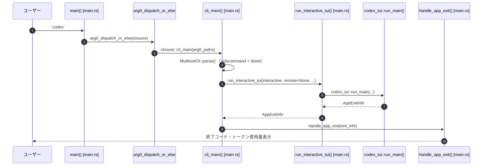

# cli/src/main.rs

## 0. ざっくり一言

Codex CLI バイナリのエントリーポイントであり、`codex` コマンドの引数を解析して、インタラクティブ TUI・非インタラクティブ実行 (`exec`)・app‑server・sandbox・feature 管理など多数のサブコマンドにディスパッチする「ハブ」の役割を持つモジュールです。

> 行番号について: このインターフェイスから正確な行番号を取得できないため、`main.rs:L開始-終了` 形式での厳密な行番号は記載できません。根拠はすべて「このファイル内の該当関数・型定義」として示します。

---

## 1. このモジュールの役割

### 1.1 概要

- このモジュールは **Codex CLI 全体のフロントドア** です。
- clap を用いてコマンドライン引数を解析し、`Subcommand` 列挙体を通じて各機能（TUI、exec、login、sandbox など）に振り分けます。
- ルートレベルの設定オーバーライド（`CliConfigOverrides`）や Feature フラグ (`FeatureToggles`) をサブコマンドに伝播させるロジックを持ちます。
- インタラクティブ TUI に関しては、リモート app‑server への接続 (`--remote`) や、終了時のメッセージ／アップデート実行などもこのモジュールが制御します。

### 1.2 アーキテクチャ内での位置づけ

このファイルは、CLI プロセスの中で「薄いフロントエンド」として動作し、実際の処理は他クレートに委譲されています。

```mermaid
flowchart TD
    User["ユーザー (codex コマンド)"]
    Main["main() / cli_main() (main.rs, chunk 1/1)"]
    Clap["MultitoolCli (clap)"]
    TUI["codex_tui::run_main()"]
    Exec["codex_exec::run_main()"]
    AppServer["codex_app_server::run_main_with_transport()"]
    MCP["codex_mcp_server::run_main() / McpCli::run()"]
    Cloud["codex_cloud_tasks::run_main()"]
    ExecServer["codex_exec_server::run_main_with_listen_url()"]
    Config["codex_core::Config / ConfigEditsBuilder"]
    State["codex_state::StateRuntime"]

    User --> Main
    Main --> Clap
    Clap --> Main
    Main -->|Subcommand::(None/Resume/Fork)| TUI
    Main -->|Subcommand::Exec/Review| Exec
    Main -->|Subcommand::AppServer| AppServer
    Main -->|Subcommand::Mcp/McpServer| MCP
    Main -->|Subcommand::Cloud| Cloud
    Main -->|Subcommand::ExecServer| ExecServer
    Main -->|features, debug| Config
    Main -->|debug clear-memories| State
```

- ユーザーは常に `codex` コマンドでこのバイナリを起動します。
- `main()` → `cli_main()` が全サブコマンドの入り口です。
- 実際のビジネスロジックは `codex_tui`・`codex_exec`・`codex_app_server` 等の別クレートに実装されており、このファイルはそれらを呼び出すだけです。

### 1.3 設計上のポイント

コードから読み取れる特徴は次の通りです。

- **責務の分離**
  - 引数解析とディスパッチはこのファイル。
  - 実処理は各ドメイン別クレート（`codex_tui`, `codex_exec`, `codex_app_server` など）に委譲。
- **状態をほとんど持たない**
  - グローバルな状態は持たず、`MultitoolCli` や `TuiCli` などの構造体を引数として渡し回しています。
- **エラーハンドリング**
  - 非テストコードの多くは `anyhow::Result` を返し、`anyhow::bail!` 等で早期リターンしています。
  - I/O エラー（FS・環境変数・サブプロセス）は基本的に `?` で伝播します。
  - CLI 上の「有効でないフラグの組み合わせ」（例: 非インタラクティブサブコマンドでの `--remote` 利用）は、専用関数 `reject_remote_mode_for_subcommand` によって早期エラー化しています。
- **並行性**
  - 全体は async で動作し、Tokio ランタイムに依存していると推測されます（`tokio::task::spawn_blocking` を使用）。
  - ブロッキング I/O（responses API proxy、stdio→UDS ブリッジ）を実行する箇所は `spawn_blocking` 経由になっており、非同期ランタイムのスレッドプールをブロックしないよう配慮されています。
- **安全性**
  - 環境変数からのトークン読み取りは `read_remote_auth_token_from_env_var_with` により、未設定／空文字列を明示的に拒否しています。
  - インタラクティブ TUI 起動前にターミナルの種類を検査し、`TERM=dumb` かつ TTY が無い場合は安全のため起動を拒否します。

---

## 2. 主要な機能一覧

このモジュールが提供する主な機能を列挙します（Subcommand ベース）。

- インタラクティブ TUI 起動（サブコマンド無し / `resume` / `fork`）
- 非インタラクティブ実行:
  - `exec`: コマンドの非インタラクティブ実行
  - `review`: コードレビューの非インタラクティブ実行
- 認証・認可関連:
  - `login`: 対話ログイン / デバイスコード認証 / API キーベースログイン / ログイン状態表示
  - `logout`: 認証情報の削除
- MCP / Marketplace:
  - `mcp`: 外部 MCP サーバーの管理
  - `mcp-server`: MCP サーバーモード起動
  - `marketplace`: Codex 用プラグインマーケットの管理
- App Server / Exec Server:
  - `app-server`: app‑server 本体起動、TS/JSON Schema 生成、内部スキーマ生成
  - `exec-server`: スタンドアロン exec サーバー起動
- Sandbox 実行:
  - `sandbox macos`: Seatbelt（macOS）でコマンド実行
  - `sandbox linux`: landlock/bubblewrap でコマンド実行
  - `sandbox windows`: Windows restricted token でコマンド実行
- Cloud / プロキシ:
  - `cloud` / `cloud-tasks`: Codex Cloud タスクの一覧・適用
  - `responses-api-proxy`: responses API プロキシの内部実行
  - `stdio-to-uds`: stdio↔Unix ドメインソケットのブリッジ
- デバッグ:
  - `debug app-server send-message-v2`: app‑server デバッグクライアント
  - `debug prompt-input`: モデルに見えるプロンプト入力を JSON で表示
  - `debug clear-memories`: ローカルメモリ状態（DB・ディレクトリ）の初期化
- Feature フラグ・設定:
  - ルートレベル `--enable/--disable` による feature フラグの一時オーバーライド
  - `features list`: 有効な feature とステージの一覧表示
  - `features enable/disable`: `config.toml` に対する恒久的な feature 有効/無効化
- その他:
  - `completion`: 各種シェル向け補完スクリプト生成
  - CLI 終了時のトークン使用量表示や `codex resume ...` のヒント表示
  - アップデートコマンドの実行（`UpdateAction`）

---

## 3. 公開 API と詳細解説

> このバイナリ crate のため `pub` な関数はありませんが、CLI の「外部から利用されるインターフェース」として、clap による構造体・列挙体と主要関数を整理します。

### 3.1 型一覧（構造体・列挙体など）

#### CLI ルートとサブコマンド

| 名前 | 種別 | 役割 / 用途 |
|------|------|-------------|
| `MultitoolCli` | 構造体 (`derive(Parser)`) | `codex` コマンドのルート引数セット。設定オーバーライド、feature トグル、TUI オプション、サブコマンドをまとめます。 |
| `Subcommand` | 列挙体 (`derive(Subcommand)`) | `exec`, `login`, `app-server` 等の全サブコマンドを表す中心的な enum です。 |
| `CompletionCommand` | 構造体 | `codex completion` サブコマンドの引数（生成対象シェル）を表します。 |
| `DebugCommand` / `DebugSubcommand` | 構造体 / 列挙体 | `codex debug ...` のグループ。`app-server`, `prompt-input`, `clear-memories` の下位サブコマンドを保持します。 |
| `AppServerCommand` / `AppServerSubcommand` | 構造体 / 列挙体 | `codex app-server` 用。`listen` アドレス、分析フラグ、WS 認証オプションと、`generate-ts` 等のツールサブコマンドを持ちます。 |
| `ExecServerCommand` | 構造体 | `exec-server` の `--listen` URL を保持します。 |
| `SandboxArgs` / `SandboxCommand` | 構造体 / 列挙体 | `codex sandbox` サブコマンド群（macOS / Linux / Windows）に対応します。 |
| `LoginCommand` / `LoginSubcommand` | 構造体 / 列挙体 | `codex login` のモード（デバイス認証/API キーログイン/状態表示など）を保持します。 |
| `LogoutCommand` | 構造体 | `codex logout` に対するダミーのコンテナ（内部で config_overrides を持つ）。 |
| `ResumeCommand` / `ForkCommand` | 構造体 | `codex resume` / `codex fork` 用。session id / `--last` / `--all` などのフラグと、TUI へのリモートオプション／config オーバーライドを持ちます。 |
| `FeaturesCli` / `FeaturesSubcommand` / `FeatureSetArgs` | 構造体 / 列挙体 / 構造体 | `codex features ...` の CLI 群。`list`/`enable`/`disable` と feature 名を表現します。 |
| `StdioToUdsCommand` | 構造体 | `codex stdio-to-uds` のソケットパスを保持します。 |

#### 設定/feature/リモート関連

| 名前 | 種別 | 役割 / 用途 |
|------|------|-------------|
| `FeatureToggles` | 構造体 (`derive(Parser, Default, Clone)`) | ルートレベル `--enable/--disable` フラグを保持し、`features.<name>=true/false` 形式のオーバーライドに変換します。 |
| `InteractiveRemoteOptions` | 構造体 (`derive(Parser, Default, Clone)`) | `--remote`, `--remote-auth-token-env` など、TUI をリモート app‑server に接続する際のオプションです。 |
| `GenerateTsCommand` / `GenerateJsonSchemaCommand` / `GenerateInternalJsonSchemaCommand` | 構造体 (`derive(Args)`) | app‑server プロトコルの TypeScript/JSON Schema 生成用オプションを保持します。 |

#### 補助的な型

| 名前 | 種別 | 役割 / 用途 |
|------|------|-------------|
| `ExecpolicyCommand` / `ExecpolicySubcommand` | 構造体 / 列挙体 | execpolicy の `check` サブコマンドを束ねます。 |
| `DebugAppServerCommand` / `DebugAppServerSubcommand` / `DebugAppServerSendMessageV2Command` | 構造体 / 列挙体 / 構造体 | app-server デバッグ用サブコマンドと、「ユーザーからのメッセージ」をパラメータとして保持します。 |
| `DebugPromptInputCommand` | 構造体 | `debug prompt-input` 用のオプション（テキストプロンプトと画像パス）を保持します。 |
| `FeaturesSubcommand` | 列挙体 | `features list/enable/disable` のモードを表現します。 |

`AppExitInfo` や `TuiCli` は別クレート `codex_tui` からの型です。このファイルではそれらのフィールドを読み書きしますが、定義はこのチャンクには現れません。

#### 関数インベントリ（主なもの）

| 関数名 | 役割（1 行） |
|--------|--------------|
| `main()` | `arg0_dispatch_or_else` を通じて `cli_main` を呼び出すエントリーポイントです。 |
| `cli_main(arg0_paths)` | `MultitoolCli` を解析し、`Subcommand` ごとに各クレートへディスパッチする中心関数です。 |
| `run_interactive_tui(interactive, remote, remote_auth_token_env, arg0_paths)` | インタラクティブ TUI を起動する前段の検査・リモート設定・トークン読み取りを行い、`codex_tui::run_main` を呼び出します。 |
| `handle_app_exit(exit_info)` | TUI の終了情報を解釈し、エラー時終了コード・トークン使用量表示・アップデートコマンド実行を行います。 |
| `run_update_action(action)` | `UpdateAction` が指定する OS コマンドを実行し、失敗時にエラーを返します。 |
| `run_debug_prompt_input_command(...)` | 設定をロードし、画像・テキストからモデル入力 JSON を構築して表示します。 |
| `run_debug_clear_memories_command(...)` | state DB と `memories` ディレクトリを削除し、メモリ状態を「初期状態」にリセットします。 |
| `finalize_resume_interactive(...)` / `finalize_fork_interactive(...)` | `resume` / `fork` 用の最終的な `TuiCli` を構築するヘルパーです。 |
| `merge_interactive_cli_flags(...)` | ルートとサブコマンドの `TuiCli` をマージし、サブコマンド側を優先させます。 |
| `reject_remote_mode_for_subcommand(...)` | 非インタラクティブサブコマンドでの `--remote` / `--remote-auth-token-env` をエラーにします。 |
| `read_remote_auth_token_from_env_var_with(...)` | 環境変数からリモート認証トークンを読み取り、空値・未設定時にエラーとします。 |

その他にも、feature の永続化 (`enable_feature_in_config` 等)、app‑server/exec-server の起動 (`run_exec_server_command`)、シェル補完生成 (`print_completion`) など、多数の補助関数が定義されています。

---

### 3.2 関数詳細（7 件）

#### `cli_main(arg0_paths: Arg0DispatchPaths) -> anyhow::Result<()>`

**概要**

Codex CLI の中核となる関数です。`MultitoolCli::parse()` で CLI 引数を解析し、サブコマンドごとに対応する処理クレート（`codex_tui`, `codex_exec`, `codex_app_server` など）を呼び出します。

**引数**

| 引数名 | 型 | 説明 |
|--------|----|------|
| `arg0_paths` | `Arg0DispatchPaths` | 実行ファイルの位置など、「arg0」に依存する関連バイナリのパス群です（`codex_arg0` クレートから供給）。 |

**戻り値**

- `anyhow::Result<()>`
  - 成功時は `Ok(())`。
  - エラー時は `anyhow::Error` として詳細なメッセージ付きで返ります（`reject_remote_mode...` やサブコマンド先の処理からのエラーを含む）。

**内部処理の流れ**

1. `MultitoolCli::parse()` で全引数を構造体にパースします。
2. `FeatureToggles::to_overrides()` を呼び出して、`--enable/--disable` を `features.<key>=true/false` 形式の CLI オーバーライド文字列に変換し、ルートの `CliConfigOverrides` に追加します。
3. ルートレベルの `--remote` / `--remote-auth-token-env` を保持します。
4. `match subcommand` でサブコマンド種別に応じた処理に分岐します。
   - **インタラクティブ (None, Resume, Fork)**:
     - `prepend_config_flags` でルートの `config_overrides` を TUI 側に前置。
     - `finalize_*_interactive`（`resume`/`fork`）で `TuiCli` を最終的な形に整えます。
     - `run_interactive_tui` を `await` し、返ってきた `AppExitInfo` を `handle_app_exit` に渡して後処理します。
   - **exec / review**:
     - `reject_remote_mode_for_subcommand` により `--remote` 系フラグを拒否。
     - `ExecCli` にルートのオーバーライドを前置し、`codex_exec::run_main(exec_cli, arg0_paths)` を `await` します。
     - `review` は内部的に `ExecCli` を組み立ててから同じ関数に渡します。
   - **app-server / exec-server / cloud / sandbox / features / debug / login/logout / apply / responses-api-proxy / stdio-to-uds**:
     - 同様に remote フラグを検査した上で、それぞれのクレートの `run_main` 系関数またはローカルヘルパー関数を呼び出します。
5. すべての分岐が完了すると `Ok(())` を返します。

**Examples（使用例）**

テストコードと同様に、特定のサブコマンド入力に対する動作を確認する例です（`exec` の例）。

```rust
// テストや統合ツールから `cli_main` を直接呼び出すイメージ
#[tokio::main]
async fn main() -> anyhow::Result<()> {
    // 実際には `arg0_dispatch_or_else` から渡される
    let arg0_paths = Arg0DispatchPaths::default(); // 仮の例
    
    // OS の引数は MultitoolCli::parse() が読むため、ここでは特に設定しない
    cli_main(arg0_paths).await
}
```

**Errors / Panics**

- `FeatureToggles::to_overrides()` が未知の feature キーを含んでいる場合:
  - `anyhow!("Unknown feature flag: {feature}")` が返され、`cli_main` も `Err` になります。
- 各サブコマンドで `reject_remote_mode_for_subcommand` が失敗した場合:
  - 例: `codex exec --remote ws://...` → 「`--remote` は TUI のみ対応」というエラーで即座に `Err` になります。
- 外部クレートの `run_main` 系関数が `Err` を返した場合も、そのまま `cli_main` のエラーになります。
- プロセス終了を伴うケース:
  - `login` の `--api-key` 使用時は `eprintln!` の後 `std::process::exit(1)` するため、この関数は戻りません。

**Edge cases（エッジケース）**

- サブコマンドが `None`（`codex` だけ）の場合:
  - インタラクティブ TUI にフォールバックします。
- `features list` 等の一部サブコマンドでは、`interactive.web_search` が `true` の場合に `web_search = "live"` を CLI オーバーライドに追加します。
- `responses-api-proxy` / `stdio-to-uds` は `tokio::task::spawn_blocking` でラップされており、ブロッキング I/O を非同期ランタイムから切り離しています。

**使用上の注意点**

- **非インタラクティブサブコマンド**に対して `--remote` / `--remote-auth-token-env` を指定すると `Err` になる設計です。
- `cli_main` 自体はライブラリ API ではなく、「このバイナリを実行したときの挙動」を定めるエントリーポイントです。外部から直接呼び出して再利用するより、CLI 経由の利用が前提になっています。

---

#### `run_interactive_tui(mut interactive: TuiCli, remote: Option<String>, remote_auth_token_env: Option<String>, arg0_paths: Arg0DispatchPaths) -> std::io::Result<AppExitInfo>`

**概要**

インタラクティブ TUI を起動する関数です。プロンプト文字列の正規化、ターミナルの能力チェック（`TERM=dumb` 対応）、`--remote` / `--remote-auth-token-env` の検証・環境変数からのトークン読み取りを行い、最終的に `codex_tui::run_main` を実行します。

**引数**

| 引数名 | 型 | 説明 |
|--------|----|------|
| `interactive` | `TuiCli` | TUI 用の CLI オプション。`MultitoolCli` から引き継がれた構造体です。 |
| `remote` | `Option<String>` | `--remote` で指定された WebSocket アドレス（`ws://` or `wss://`）。 |
| `remote_auth_token_env` | `Option<String>` | リモート認証トークン格納用環境変数名。 |
| `arg0_paths` | `Arg0DispatchPaths` | `codex_tui::run_main` に渡すパス情報。 |

**戻り値**

- `std::io::Result<AppExitInfo>`
  - 成功時は `AppExitInfo`（セッション ID、トークン使用量、アップデートアクション、終了理由）が返ります。
  - I/O エラー（標準入力読み取り・環境変数読み取り・TUI 実行側での I/O）発生時は `Err(std::io::Error)` で返ります。
  - TUI を起動しないまま終了する場合（fatal メッセージ生成など）は、`AppExitInfo::fatal(...)` が `Ok(...)` で返ります。

**内部処理の流れ**

1. `interactive.prompt` が `Some` の場合、`"\r\n"` や `'\r'` を `'\n'` に置き換えます（CRLF 正規化）。
2. `codex_terminal_detection::terminal_info()` でターミナルを検出し、`TerminalName::Dumb` か判定します。
   - `stdin` と `stderr` の両方が TTY でない場合:
     - インタラクティブの確認プロンプトを出せないため、`AppExitInfo::fatal(...)` を返して TUI 起動を拒否します。
   - TTY がある場合:
     - `TERM="dumb"` に対する警告を `eprintln!` し、`confirm("Continue anyway? [y/N]: ")` でユーザーに続行可否を尋ねます。
     - `false` の場合も同様に `AppExitInfo::fatal(...)` を返します。
3. `remote` が `Some` の場合、`codex_tui::normalize_remote_addr` で正規化し、エラーがあれば `std::io::Error::other` でラップして返します。
4. `remote_auth_token_env` が `Some` なのに `remote` が `None` の場合:
   - `AppExitInfo::fatal("`--remote-auth-token-env` requires `--remote`.")` を返します。
5. `remote_auth_token_env` が指定されている場合:
   - `read_remote_auth_token_from_env_var(env_name)` で環境変数からトークンを取得します。
   - 未設定・空文字列の場合は `anyhow` エラー → `std::io::Error::other` に変換されます。
6. 最後に `codex_tui::run_main(interactive, arg0_paths, LoaderOverrides::default(), normalized_remote, remote_auth_token).await` を呼び、結果をそのまま返します。

**Examples（使用例）**

既存コードと同様の TUI 呼び出しをテストから行う例です。

```rust
#[tokio::main]
async fn main() -> std::io::Result<()> {
    // 通常は MultitoolCli::parse() から得たもの
    let interactive = TuiCli::default(); // 仮の例
    let arg0_paths = Arg0DispatchPaths::default(); // 仮の例

    let exit_info = run_interactive_tui(
        interactive,
        /*remote*/ None,
        /*remote_auth_token_env*/ None,
        arg0_paths,
    ).await?;

    // exit_info.exit_reason などを検査して後処理
    Ok(())
}
```

**Errors / Panics**

- `TerminalName::Dumb` かつ `stdin`/`stderr` のどちらか（または両方）が TTY でない場合:
  - panic ではなく、`AppExitInfo::fatal(...)` を返すため、「TUI は起動せずに正常終了」扱いになります。
- `confirm` 内で `stdin.read_line` が失敗した場合:
  - `std::io::Error` として伝播します。
- `read_remote_auth_token_from_env_var` がエラーを返す場合:
  - 未設定 → 「環境変数はセットされていない」メッセージ
  - 空白のみ → 「環境変数は空」のメッセージ
  - これらは `std::io::Error::other` に包まれ、この関数からは I/O エラーとして見えます。
- `codex_tui::run_main` 内のエラーは `std::io::Error` としてこの関数から返されます（実装はこのファイルには現れません）。

**Edge cases**

- `remote_auth_token_env` のみ指定した場合 → 即座に fatal `AppExitInfo` を返します（`--remote` が必須）。
- プロンプト文字列に `\r\n` が含まれる場合 → すべて `\n` に変換され、TUI 側には LF のみが渡されます。

**使用上の注意点**

- `run_interactive_tui` は **非同期関数** であり、Tokio などの async ランタイム上で実行する必要があります。
- `confirm` によるユーザー入力はブロッキング I/O です。これは TUI 起動前に一度だけ行われるため、通常の CLI で問題になりにくい設計です。
- リモート接続用の認証トークンは環境変数から読み取られ、その値が空白のみであってもエラーにされます。オペレーション時には値が確実に設定されていることが前提です。

---

#### `finalize_resume_interactive(...) -> TuiCli`

```rust
fn finalize_resume_interactive(
    mut interactive: TuiCli,
    root_config_overrides: CliConfigOverrides,
    session_id: Option<String>,
    last: bool,
    show_all: bool,
    include_non_interactive: bool,
    resume_cli: TuiCli,
) -> TuiCli
```

**概要**

`codex resume` サブコマンドで使用する最終的な `TuiCli` 設定を組み立てます。セッションの選択ロジック（picker/last/session_id）や `--all`, `--include-non-interactive` のフラグを設定し、サブコマンド特有の TUI オプションをマージします。

**引数（要点）**

- `interactive`: ルートレベルでパースされた `TuiCli`（`codex` 直下）。
- `root_config_overrides`: ルートレベル `-c key=value` 等のオーバーライド。
- `session_id`: `codex resume <SESSION_ID>` で指定された ID。
- `last`: `--last` フラグ。
- `show_all`: `--all` フラグ。
- `include_non_interactive`: `--include-non-interactive` フラグ。
- `resume_cli`: `resume` サブコマンドに付与された TUI オプション（`-m`, `-p`, `--oss`, など）。

**内部処理の流れ**

1. `resume_session_id` を `session_id` から設定。
2. `interactive.resume_picker` を `session_id.is_none() && !last` に設定。
3. `interactive.resume_last`, `interactive.resume_session_id`, `interactive.resume_show_all`, `interactive.resume_include_non_interactive` を引数に応じて設定。
4. `merge_interactive_cli_flags(&mut interactive, resume_cli)` を呼び出し、サブコマンドレベルの TUI フラグで上書きします。
5. `prepend_config_flags(&mut interactive.config_overrides, root_config_overrides)` を呼び出し、ルートレベル `-c` を前置します。
6. 完成した `interactive` を返します。

**テストから読み取れる契約**

- `resume` 単独（ID なし・`--last` なし）:
  - `resume_picker = true`, `resume_last = false`, `resume_session_id = None`。
- `resume --last`:
  - `resume_picker = false`, `resume_last = true`, `resume_session_id = None`。
- `resume <SID>`:
  - `resume_picker = false`, `resume_last = false`, `resume_session_id = Some(SID)`。
- `--all` 指定時は `resume_show_all = true` がセットされます。

**使用上の注意点**

- この関数は **純粋な設定変換** であり、I/O は行いません。
- ルートと `resume` の両方で同じ項目（例: `-m`, `-p`）が指定された場合は、サブコマンド側の指定が優先されます（`merge_interactive_cli_flags` の仕様）。

---

#### `finalize_fork_interactive(...) -> TuiCli`

```rust
fn finalize_fork_interactive(
    mut interactive: TuiCli,
    root_config_overrides: CliConfigOverrides,
    session_id: Option<String>,
    last: bool,
    show_all: bool,
    fork_cli: TuiCli,
) -> TuiCli
```

**概要**

`codex fork` 用の `TuiCli` を構築します。`resume` 版と非常によく似ていますが、`fork_*` 系フィールドを設定します。

**処理のポイント**

- `interactive.fork_picker = session_id.is_none() && !last;`
- `interactive.fork_last`, `interactive.fork_session_id`, `interactive.fork_show_all` を引数に従って設定。
- `merge_interactive_cli_flags` と `prepend_config_flags` を呼び、`resume` の場合と同様に TUI と config オーバーライドをマージします。

**テストから読み取れる契約**

- `fork` 単独 → `fork_picker=true`, `fork_last=false`, `fork_session_id=None`, `fork_show_all=false`。
- `fork --last` → `fork_picker=false`, `fork_last=true`。
- `fork 1234` → `fork_picker=false`, `fork_session_id="1234"`。
- `fork --all` → `fork_show_all=true`。

**使用上の注意点**

- `resume` との違いは「既存セッションを継続するか（resume）」「既存セッションから派生した新しいセッションを作るか（fork）」という意味づけのみであり、構成ロジックは対称性を保っています。

---

#### `merge_interactive_cli_flags(interactive: &mut TuiCli, subcommand_cli: TuiCli)`

**概要**

ルートレベルの TUI 設定 (`interactive`) に、サブコマンドスコープの TUI 設定 (`subcommand_cli`) を上書きマージします。`resume` や `fork` で再利用されています。

**内部処理の流れ**

1. `subcommand_cli.model` が `Some` なら `interactive.model` を上書き。
2. 真偽値フラグ (`oss`, `full_auto`, `dangerously_bypass_approvals_and_sandbox`, `web_search`) は OR 的にマージ（サブコマンド側が `true` なら `true`）。
3. `config_profile`, `sandbox_mode`, `approval_policy`, `cwd` などの Option は、`subcommand_cli` 側に値がある場合のみ上書き。
4. 画像リスト・追加ディレクトリリストは、サブコマンド側に要素があれば置き換えまたは `extend`。
5. プロンプト (`prompt`) はサブコマンド側が `Some` なら、CRLF→LF 正規化したうえで上書き。
6. `interactive.config_overrides.raw_overrides` に `subcommand_cli.config_overrides.raw_overrides` を `extend` し、サブコマンド側の `-c key=value` を最優先にします。

**Examples（使用例）**

テストに近い形の例です。

```rust
// ルート: モデル "gpt-root"
let mut interactive = TuiCli { model: Some("gpt-root".into()), ..Default::default() };

// resume サブコマンド: モデル "gpt-resume", OSS フラグ ON
let resume_cli = TuiCli {
    model: Some("gpt-resume".into()),
    oss: true,
    ..Default::default()
};

merge_interactive_cli_flags(&mut interactive, resume_cli);

// 結果:
// interactive.model == Some("gpt-resume")
// interactive.oss == true
```

**使用上の注意点**

- この関数は「サブコマンド側の設定を優先する」ことが前提です。ルート設定を優先したい場合は別のマージ戦略が必要になります。
- プロンプト文字列には `\r\n` 正規化が入るため、サブコマンド経由で渡した文字列は必ず LF に統一されます。

---

#### `run_debug_prompt_input_command(...) -> anyhow::Result<()>`

```rust
async fn run_debug_prompt_input_command(
    cmd: DebugPromptInputCommand,
    root_config_overrides: CliConfigOverrides,
    interactive: TuiCli,
    arg0_paths: Arg0DispatchPaths,
) -> anyhow::Result<()>
```

**概要**

`codex debug prompt-input ...` の実体です。CLI オーバーライドと TUI 設定から `Config` を構築し、画像とテキストから `UserInput` のリストを組み立て、`codex_core::build_prompt_input` を通じて最終的なモデル入力 JSON を生成して標準出力に書き出します。

**引数（要点）**

- `cmd`: デバッグコマンド専用のプロンプト・画像指定（`DebugPromptInputCommand`）。
- `root_config_overrides`: ルート `-c`。
- `interactive`: `TuiCli` から Web 検索やモデルなどの情報を流用。
- `arg0_paths`: モデル実行系バイナリのパスなど（`ConfigOverrides` の `codex_self_exe` などに利用）。

**内部処理の流れ**

1. ルート `root_config_overrides.parse_overrides()` を呼び、`Vec<(String, toml::Value)>` に変換。
2. `interactive.web_search` が `true` の場合、`("web_search", "live")` をオーバーライドに追加。
3. `approval_policy` と `sandbox_mode` を `interactive` のフラグから決定:
   - `full_auto` → `AskForApproval::OnRequest` + `SandboxMode::WorkspaceWrite`
   - `dangerously_bypass_approvals_and_sandbox` → `AskForApproval::Never` + `SandboxMode::DangerFullAccess`
   - それ以外は元の CLI 設定 (`interactive.approval_policy`, `interactive.sandbox_mode`) を `Into::into` 変換。
4. `ConfigOverrides` を組み立て:
   - `model`, `config_profile`, `approval_policy`, `sandbox_mode`, `cwd` は `interactive` から。
   - `codex_self_exe`, `codex_linux_sandbox_exe`, `main_execve_wrapper_exe` は `arg0_paths` から。
   - `show_raw_agent_reasoning`: `interactive.oss` が `true` のとき `Some(true)`。
   - `ephemeral: Some(true)` で一時的なセッションであることを示す。
   - `additional_writable_roots`: `interactive.add_dir`。
5. `Config::load_with_cli_overrides_and_harness_overrides(...)` で `Config` をロード。
6. 画像入力ベクトルを構築:
   - `interactive.images.into_iter().chain(cmd.images)` を `UserInput::LocalImage { path }` に変換。
7. テキスト入力を追加:
   - `cmd.prompt.or(interactive.prompt)` が `Some` の場合、CRLF→LF 正規化した上で `UserInput::Text { text, text_elements: Vec::new() }` を push。
8. `codex_core::build_prompt_input(config, input).await?` で最終的な入力構造体を生成。
9. `serde_json::to_string_pretty` で JSON にシリアライズし、`println!` で出力。

**Errors / Panics**

- `root_config_overrides.parse_overrides()` が TOML のパースに失敗した場合 → `anyhow::Error::msg` で `Err`。
- `Config::load_with_cli_overrides_and_harness_overrides` / `build_prompt_input` からのエラーはそのまま伝播します。
- `serde_json::to_string_pretty` が失敗する可能性は低いですが、理論的には `Err` になり得ます。

**Edge cases**

- `cmd.prompt` も `interactive.prompt` も `None` の場合:
  - 画像入力だけの JSON が生成されます。
- 画像が 1 枚も指定されない場合:
  - テキストのみ、もしくは空配列の入力になります。
- `interactive.oss` が `true` の場合:
  - `show_raw_agent_reasoning` が `Some(true)` になり、モデル内部の reasoning 表示が有効化される前提です（詳細は他クレート）。

**使用上の注意点**

- このコマンドは「モデルに渡される実際のプロンプト」を確認するためのものであり、本番利用というよりデバッグ用途です。
- 実行には Config ロードや sandbox バイナリパスの解決が必要であり、`codex` 全体がインストールされた環境であることが前提です。

---

#### `run_debug_clear_memories_command(root_config_overrides: &CliConfigOverrides, interactive: &TuiCli) -> anyhow::Result<()>`

**概要**

`codex debug clear-memories` の実体です。現在の Config から state DB のパスと `memories` ディレクトリを求め、存在する場合は状態を削除して「新規インストール直後に近いメモリ状態」にリセットします。

**内部処理の流れ**

1. `root_config_overrides.parse_overrides()` で CLI オーバーライドをパース。
2. `ConfigOverrides { config_profile: interactive.config_profile.clone(), ..Default::default() }` を生成。
3. `Config::load_with_cli_overrides_and_harness_overrides` で Config をロード。
4. `state_path = state_db_path(config.sqlite_home.as_path())` を計算。
5. `tokio::fs::try_exists(&state_path).await?` を用いて state DB の存在を確認。
   - 存在する場合:
     - `StateRuntime::init(config.sqlite_home.clone(), config.model_provider_id.clone()).await?` で DB を開く。
     - `reset_memory_data_for_fresh_start().await?` で内部データを初期化。
     - `cleared_state_db = true` に設定。
6. `memory_root = config.codex_home.join("memories")` を計算し、`tokio::fs::remove_dir_all` を試みる。
   - 成功 → `removed_memory_root = true`。
   - `NotFound` → `removed_memory_root = false`。
   - その他のエラー → `Err` として返す。
7. 処理結果に応じてメッセージを構築:
   - DB 有無: `Cleared memory state from ...` or `No state db found at ...`。
   - `memories` ディレクトリ有無: `Removed ...` or `No memory directory found at ...`。
8. `println!` でメッセージを表示して終了。

**Errors / Panics**

- Config ロード・DB 初期化・FS 操作のいずれかでエラーが発生した場合、`anyhow::Error` として返されます。
- 明示的な `panic!` はありません。

**Edge cases**

- state DB が存在しない場合:
  - `No state db found at ...` メッセージになりますが、これは正常終了として扱われます。
- `memories` ディレクトリが存在しない場合:
  - `No memory directory found at ...` と出力されますが、エラーではありません。
- どちらも存在しない場合:
  - 「何も削除されなかった」という情報付きのメッセージが出力されます。

**使用上の注意点**

- このコマンドは、ユーザーのローカルメモリ状態（DB＋ファイル）を**破壊的に削除**します。誤実行すると元に戻せません。
- 並行性の観点では、他の Codex プロセスが同じ state DB や `memories` ディレクトリを利用していないことが前提です。並行利用時の挙動はこのファイルからは分かりません。

---

#### `read_remote_auth_token_from_env_var_with(env_var_name: &str, get_var: F) -> anyhow::Result<String>`

**概要**

リモート app‑server への認証トークンを、指定された環境変数名から読み取るユーティリティです。テスト容易性のため、実際の環境変数取得関数を引数 `get_var` として注入できるようになっています。

**引数**

| 引数名 | 型 | 説明 |
|--------|----|------|
| `env_var_name` | `&str` | 認証トークンを格納している環境変数名。 |
| `get_var` | `F: FnOnce(&str) -> Result<String, std::env::VarError>` | 環境変数を取得する関数（本番では `std::env::var` を使うラッパ）。 |

**戻り値**

- 成功時は、前後の空白を `trim()` したトークン文字列を返します。
- 失敗時は `anyhow::Error`（`is not set` / `is empty` メッセージ）を返します。

**内部処理の流れ**

1. `get_var(env_var_name)` を呼ぶ。
   - `Err(_)` のとき → `anyhow!("environment variable`{env_var_name}`is not set")` を返す。
2. 得られた文字列に対して `trim()` を行い、前後の空白を除去。
3. 空文字列になった場合 → `anyhow!("environment variable`{env_var_name}`is empty")` を返す。
4. それ以外の場合 → トークン文字列を `Ok` で返す。

**テストから読み取れる契約**

- 未設定 (`VarError::NotPresent`) の場合 → `"is not set"` を含むエラーメッセージ。
- `"  bearer-token  "` のように空白を含む値 → `"bearer-token"` として返却。
- `" \n\t "` のように空白のみ → `"is empty"` を含むエラー。

**使用上の注意点**

- 実際には `read_remote_auth_token_from_env_var(env_var_name)` を通じて使用されます。
- トークン前後の空白が自動的に削除されるため、環境変数値に改行などが紛れ込んでいても安全側に倒れます。

---

#### `handle_app_exit(exit_info: AppExitInfo) -> anyhow::Result<()>`

**概要**

インタラクティブ TUI 終了後の共通処理を行います。致命的エラーの場合の終了コード設定、トークン使用量および `codex resume ...` ヒントの表示、アップデートアクションの実行などをまとめています。

**内部処理の流れ**

1. `match exit_info.exit_reason`:
   - `ExitReason::Fatal(message)`:
     - `eprintln!("ERROR: {message}")` の後、`std::process::exit(1)`。この場合は戻りません。
   - `ExitReason::UserRequested`:
     - 何もせず処理を続行。
2. `update_action = exit_info.update_action` を取り出しておく。
3. `color_enabled = supports_color::on(Stream::Stdout).is_some()` でカラー出力可能か判定。
4. `format_exit_messages(exit_info, color_enabled)` を呼んでメッセージ行リストを生成し、`println!` で順に出力。
5. `update_action` が `Some(action)` の場合:
   - `run_update_action(action)?` を呼び、アップデートコマンドを実行。
6. 最後に `Ok(())` を返す。

**Errors / Panics**

- `Fatal` ケースでは `std::process::exit(1)` のため、panic ではなくプロセス終了です。
- `run_update_action` が `Err` を返した場合、この関数も `Err` を返します。

**使用上の注意点**

- アップデートアクションは OS コマンドとして実行されます。実際にどのコマンドが呼ばれるかは `UpdateAction` の実装次第であり、このファイルには現れません。
- トークン使用量のメッセージは `codex_protocol::protocol::FinalOutput::from(token_usage)` に依存します。

---

### 3.3 その他の関数（抜粋）

| 関数名 | 役割（1 行） |
|--------|--------------|
| `main()` | `arg0_dispatch_or_else` を使って `cli_main` を非同期に実行する標準エントリーポイントです。 |
| `format_exit_messages(exit_info, color_enabled)` | `AppExitInfo` からトークン使用量と `codex resume ...` のヒント文字列を組み立てます。カラー有効時は `resume` コマンドをシアン色にします。 |
| `run_update_action(action)` | Windows では `cmd /C`、それ以外ではバイナリパス＋引数でアップデートコマンドを実行します。失敗時には `anyhow::bail!` でエラーにします。 |
| `run_execpolicycheck(cmd)` | `cmd.run()` を呼ぶ薄いラッパーです。 |
| `run_debug_app_server_command(cmd)` | デバッグ用 app‑server クライアントを通じて `send_message_v2` を実行します。 |
| `enable_feature_in_config(interactive, feature)` | `FeatureToggles::validate_feature` でキーを検証した後、`ConfigEditsBuilder` で `config.toml` に `enabled = true` を設定します。 |
| `disable_feature_in_config(interactive, feature)` | 上記の `enabled = false` 版です。 |
| `maybe_print_under_development_feature_warning(codex_home, interactive, feature)` | プロファイル未指定かつ stage が `UnderDevelopment` の feature を有効化したときに警告を表示します。 |
| `run_exec_server_command(cmd)` | `codex_exec_server::run_main_with_listen_url(&cmd.listen)` を呼ぶラッパーです。 |
| `prepend_config_flags(subcommand_config_overrides, cli_config_overrides)` | ルートの `raw_overrides` をサブコマンドの先頭に挿入し、後続のサブコマンド側指定に優先度を持たせます。 |
| `reject_remote_mode_for_subcommand(remote, remote_auth_token_env, subcommand)` | 非インタラクティブサブコマンドでの `--remote` / `--remote-auth-token-env` を `anyhow::bail!` により拒否します（エラーメッセージにはサブコマンド名が含まれます）。 |
| `reject_remote_mode_for_app_server_subcommand(remote, remote_auth_token_env, subcommand)` | `app-server` 専用にサブコマンド名を組み立てた上で `reject_remote_mode_for_subcommand` を呼びます。 |
| `read_remote_auth_token_from_env_var(env_var_name)` | 実運用用に `std::env::var` を使って `read_remote_auth_token_from_env_var_with` を呼ぶ簡易ラッパーです。 |
| `confirm(prompt)` | プロンプトを `eprintln!` し、`stdin` から 1 行読み取って `'y'` / `'yes'` の場合のみ `true` を返します。 |
| `print_completion(cmd)` | `MultitoolCli::command()` から clap コマンド定義を生成し、`clap_complete::generate` で指定シェル向け補完スクリプトを標準出力に書き出します。 |

---

## 4. データフロー

### 4.1 代表的シナリオ: インタラクティブ TUI 起動（ローカル）

ユーザーが単に `codex` とだけ入力した場合の処理フローです。

1. OS が `main()` を呼び出します。
2. `main()` は `arg0_dispatch_or_else` にクロージャを渡し、`cli_main(arg0_paths)` を実行します。
3. `cli_main` が `MultitoolCli::parse()` を呼び出し、`subcommand` が `None` であることを検出します。
4. `root_config_overrides` を `interactive.config_overrides` に前置してから `run_interactive_tui` を呼び出します。
5. `run_interactive_tui` はターミナルを検査し、問題なければ `codex_tui::run_main` を実行します。
6. `codex_tui::run_main` が終了すると `AppExitInfo` を返し、それを `handle_app_exit` に渡してトークン使用量の表示・アップデートコマンドの実行を行います。



### 4.2 非インタラクティブ exec / review のデータフロー（概要）

- `codex exec ...` / `codex review ...`:
  - `cli_main` が `Subcommand::Exec` / `Subcommand::Review` を検出すると、`reject_remote_mode_for_subcommand` で `--remote` 系フラグを拒否した上で `codex_exec::run_main` にディスパッチします。
  - `Review` の場合は一度 `ExecCli` を組み立て直してから同じ `run_main` を使用します。

---

## 5. 使い方（How to Use）

### 5.1 基本的な使用方法（CLI 視点）

このファイル自体はバイナリエントリなので、通常はコマンドラインから利用します。

```sh
# インタラクティブ TUI を起動
codex

# 非インタラクティブにコードを実行
codex exec --json "write a unit test for ..."

# 直近のセッションを再開
codex resume --last

# 特定のセッションをフォーク
codex fork 123e4567-e89b-12d3-a456-426614174000

# ログイン状態の確認
codex login status

# feature 一覧の表示
codex features list
```

Rust コードから CLI のパースロジックをテストする場合、テストモジュールにあるように `MultitoolCli::try_parse_from` を使用します。

```rust
use cli::MultitoolCli; // 実際には crate 名に応じて修正

let cli = MultitoolCli::try_parse_from([
    "codex", "exec", "resume", "--last", "2+2"
]).expect("parse should succeed");

// 以降、cli.subcommand をパターンマッチして挙動を確認
```

### 5.2 よくある使用パターン

1. **インタラクティブ TUI + リモート app-server**

```sh
# リモート app-server に接続して TUI を起動
export CODEX_REMOTE_AUTH_TOKEN="Bearer xyz"
codex --remote ws://127.0.0.1:4500 \
      --remote-auth-token-env CODEX_REMOTE_AUTH_TOKEN
```

- `cli_main` → `run_interactive_tui` → `read_remote_auth_token_from_env_var` の順に呼び出されます。
- `--remote-auth-token-env` を指定した場合、`--remote` も必須です。

1. **Feature フラグの一時的な有効化**

```sh
# セッション単位で web_search_request を有効化
codex --enable web_search_request
```

- `FeatureToggles::to_overrides()` が `"features.web_search_request=true"` を `CliConfigOverrides` に追加します。
- 同じセッション内のサブコマンドにもこのオーバーライドが引き継がれます。

1. **Feature フラグの永続的な有効化**

```sh
# config.toml に unified_exec を有効化
codex features enable unified_exec
```

- `enable_feature_in_config` が `ConfigEditsBuilder` を通じて `config.toml` を更新します。

### 5.3 よくある間違い

```rust
// 間違い例: 非インタラクティブ exec で --remote を使っている
// $ codex --remote ws://127.0.0.1:4500 exec --json "..."
//
// 実行時: reject_remote_mode_for_subcommand がエラーを返す

// 正しい例: --remote はインタラクティブ TUI のみで使用
// $ codex --remote ws://127.0.0.1:4500
```

```rust
// 間違い例: --remote-auth-token-env だけ指定している
// $ codex --remote-auth-token-env CODEX_REMOTE_AUTH_TOKEN
//
// 実行時: run_interactive_tui が
//   "`--remote-auth-token-env` requires `--remote`."
// という fatal AppExitInfo を返す

// 正しい例:
$ export CODEX_REMOTE_AUTH_TOKEN="Bearer ..."
$ codex --remote ws://127.0.0.1:4500 \
        --remote-auth-token-env CODEX_REMOTE_AUTH_TOKEN
```

```rust
// 間違い例: 未知の feature を --enable している
// $ codex --enable does_not_exist
//
// 実行時: FeatureToggles::to_overrides() が
//   "Unknown feature flag: does_not_exist"
// というエラーを返し、CLI は終了する
```

### 5.4 使用上の注意点（まとめ）

- **リモート関連**
  - `--remote` / `--remote-auth-token-env` はインタラクティブ TUI 専用です。`exec` などに付与するとエラーになります（`reject_remote_mode_for_subcommand`）。
  - `--remote-auth-token-env` は `--remote` とセットで使用する必要があります。
- **環境変数**
  - リモート認証トークン用環境変数が未設定・空白のみの場合はエラーになります（`read_remote_auth_token_from_env_var_with`）。
- **ターミナル**
  - `TERM="dumb"` かつ `stdin` / `stderr` が TTY でない場合、インタラクティブ TUI は起動しません（fatal `AppExitInfo`）。
- **Feature フラグ**
  - 不明な feature キーはすべてエラー扱いです（`is_known_feature_key` による検査）。
  - `UnderDevelopment` ステージの feature を有効化すると警告が表示される場合があります。
- **アップデート実行**
  - `UpdateAction` によるアップデートコマンドは OS のシェル／プロセスとして実行されます。どのコマンドが流れてくるかは `codex_tui` 側の実装次第であり、このファイルでは制御していません。

---

## 6. 変更の仕方（How to Modify）

### 6.1 新しい機能（サブコマンド）を追加する場合

1. **Subcommand への追加**
   - `enum Subcommand` に新しいバリアントを追加します（`derive(clap::Subcommand)` の対象）。
   - 必要に応じて専用の構造体（`derive(Parser)` / `derive(Args)`）を作成します。

2. **`cli_main` の `match subcommand` に分岐を追加**
   - 新バリアントに対応する `match` 分岐を追加し、対応するクレートの `run_main` やローカルヘルパーを呼び出します。
   - リモートフラグが非対応であれば `reject_remote_mode_for_subcommand` を利用します。

3. **設定オーバーライドの扱いを決める**
   - 他のサブコマンド同様、`prepend_config_flags` でルート `-c` を前置するかどうかを検討します。

4. **テストの追加**
   - テストモジュールに、新サブコマンドの parse ロジックやフラグの組み合わせを検証するテストを追加します（既存テストを参考に）。

### 6.2 既存機能を変更する場合

- **影響範囲の確認**
  - 対象のサブコマンド用構造体（例: `LoginCommand`）と、そのバリアントを扱う `cli_main` の `match` 分岐を確認します。
  - 関連するヘルパー関数（例: `enable_feature_in_config`, `run_debug_prompt_input_command`）も併せて確認します。

- **契約の維持**
  - テストから分かる契約（例: `resume` の picker ロジック、`reject_remote_mode_for_subcommand` のエラーメッセージなど）を変える場合は、意図的な仕様変更としてテストの更新も必要です。
  - `FeatureToggles::validate_feature` と feature 定義 (`FEATURES`, `Stage`) の関係性を壊さないよう注意します。

- **エラーメッセージ**
  - エラーメッセージはテストで文字列比較されている箇所があるため、変更する際はテストも更新する必要があります（例: `"is not set"`, `"is empty"`, `"Unknown feature flag: ..."`）。

---

## 7. 関連ファイル

このモジュールと密接に関係する主なファイル・クレートです（いずれもこのチャンクには実装が現れません）。

| パス / クレート | 役割 / 関係 |
|-----------------|------------|
| `codex_tui` クレート (`TuiCli`, `AppExitInfo`, `ExitReason`, `UpdateAction`) | インタラクティブ TUI 本体の実装。`run_interactive_tui` / `handle_app_exit` を通じて利用されます。 |
| `codex_exec` クレート (`Cli`, `Command`, `run_main`) | `Subcommand::Exec` / `Subcommand::Review` / exec-resume など、非インタラクティブ実行ロジックを提供します。 |
| `codex_app_server` クレート | `AppServerTransport`, `AppServerWebsocketAuthArgs`, `run_main_with_transport` を提供し、`app-server` サブコマンドから呼び出されます。 |
| `codex_app_server_protocol` クレート | app‑server プロトコルの TS/JSON Schema 生成ロジック。`GenerateTsCommand` / `GenerateJsonSchemaCommand` / `GenerateInternalJsonSchemaCommand` から呼ばれます。 |
| `codex_cloud_tasks` クレート | `cloud` / `cloud-tasks` サブコマンドの実装。CLI から `run_main` が呼び出されます。 |
| `codex_cli` クレート | `SeatbeltCommand`, `LandlockCommand`, `WindowsCommand` と、対応する sandbox 実行関数を提供します。 |
| `codex_core::config` / `codex_core::config_loader` | Config ロードと ConfigOverrides の適用を行う基盤。`features list` や `debug prompt-input` などから呼ばれます。 |
| `codex_core::util::resume_command` | `format_exit_messages` から再開コマンドの生成に使用されます。 |
| `codex_state::StateRuntime` / `state_db_path` | `debug clear-memories` で state DB の場所を決め、メモリ状態をリセットするために使用されます。 |
| `codex_mcp_server`, `McpCli` | MCP サーバーモードと MCP クライアントツールの実装。`Subcommand::McpServer` / `Subcommand::Mcp` から呼び出されます。 |
| `marketplace_cmd` / `mcp_cmd` モジュール | この crate 内の別モジュールで、それぞれ Marketplace / MCP CLI の型と処理を提供します（詳細はこのチャンクには現れません）。 |
| `wsl_paths` モジュール（非 Windows） | `run_update_action` で `UpdateAction` のコマンドパス・引数を WSL に適した形に正規化するために使用されます。 |

---

## テスト・安全性・並行性のまとめ（補足）

### テスト

このファイルの末尾には多数のユニットテストが定義されており、主に次の点を検証しています。

- `exec resume` サブコマンドの引数パース（プロンプト位置、`--last` など）。
- `app-server` の `--listen` URL・WS 認証関連フラグのパース。
- `resume` / `fork` の picker ロジック・フラグマージロジック（`finalize_*_interactive` / `merge_interactive_cli_flags`）。
- リモートフラグの拒否ロジック（`reject_remote_mode_for_subcommand`, `reject_remote_mode_for_app_server_subcommand`）。
- `read_remote_auth_token_from_env_var_with` のエラー・トリム・空値検査。
- Feature 関連 CLI (`features enable/disable`、`FeatureToggles::to_overrides`) のパースと振る舞い。
- `format_exit_messages` の出力内容（トークン使用ゼロ時の挙動、resume ヒントの優先順位、カラー出力）。

### 言語固有の安全性・エラーハンドリング・並行性

- **所有権／借用**
  - `TuiCli` や `CliConfigOverrides` は値ムーブ (`move`) を多用し、関数間で所有権を移動することで明示的にライフタイムを管理しています。
  - `Arg0DispatchPaths` はクローン可能 (`clone()`) であり、複数のサブコマンドに渡しても所有権問題が起きないようになっています。

- **エラーハンドリング**
  - 外部 I/O を伴う関数は基本的に `anyhow::Result` または `std::io::Result` を返し、`?` 演算子を使ってエラーを呼び出し元に伝播します。
  - CLI 引数の不整合（リモートフラグの誤用など）は `anyhow::bail!` による早期エラーで扱われます。
  - 一部のユーザー向けエラーでは `std::process::exit(1)` が使用されており、例外ではなくプロセス終了として扱われます。

- **並行性**
  - ブロッキング処理（responses API proxy、stdio→UDS ブリッジ）は `tokio::task::spawn_blocking` 内で実行され、非同期ランタイムのワーカースレッドを長時間ブロックしないようにしています。
  - それ以外の外部プロセス起動（アップデートコマンド）は `handle_app_exit` から同期的に呼ばれますが、これは TUI 終了後の処理であり、ユーザー体験上許容される前提と考えられます（このファイルから読み取れる範囲の解釈です）。

- **セキュリティ上の考慮**
  - 環境変数を通じたトークン供給は、未設定および空値を明示的に拒否しています。
  - `run_update_action` は `UpdateAction` から受け取ったコマンドをそのまま実行しますが、`UpdateAction` がどこから来るかはこのファイルからは分かりません。したがって、このファイル単体からは「信頼されたコマンドである」という前提・保証は読み取れません。

以上が、`cli/src/main.rs` の公開インターフェースとコアロジック、および Rust 特有の安全性・エラー処理・並行性を踏まえた解説です。
