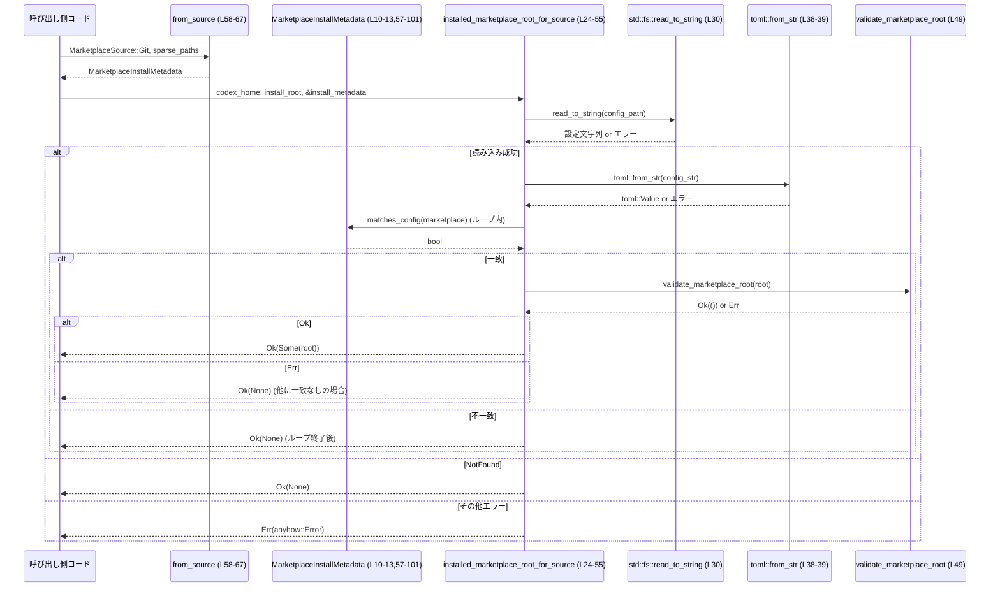

# cli/src/marketplace_cmd/metadata.rs

## 0. ざっくり一言

ユーザーの `config.toml` に書かれたマーケットプレイス設定と、インストール済みマーケットプレイスのメタデータを突き合わせて、**「このソースのマーケットプレイスがどこにインストールされているか」**を特定するヘルパーモジュールです（Git ソース専用）。`metadata.rs:L10-22,L24-55`

---

## 1. このモジュールの役割

### 1.1 概要

- このモジュールは **マーケットプレイスのインストール情報とユーザー設定ファイルを一致させる** 問題を扱います。
- 呼び出し側から渡される `MarketplaceSource`（例: Git リポジトリ URL）とスパースチェックアウト情報から、`MarketplaceInstallMetadata` を構成し、`config.toml` の `"marketplaces"` セクションと比較して、対応するインストールディレクトリ（あれば）を返します。`metadata.rs:L10-13,L24-55,L57-101`
- エラー処理には `anyhow::Result` と `Context` を用い、ファイル読み込み／TOML パース／ディレクトリ検証の失敗を詳細な文脈付きで上位に伝播します。`metadata.rs:L2-3,L29-40,L49-50`

### 1.2 アーキテクチャ内での位置づけ

このファイルは CLI 側（`marketplace_cmd` モジュール）に属し、以下のコンポーネントと連携します。

- 親モジュールの `MarketplaceSource` 型（Git ソース情報）`metadata.rs:L1,L58-60`
- 設定ファイルパス定数 `CONFIG_TOML_FILE`（`codex_config` クレート）`metadata.rs:L4,L29`
- マーケットプレイスルートの妥当性検証関数 `validate_marketplace_root`（`codex_core::plugins`）`metadata.rs:L5,L49`
- 外部クレート `toml` による設定ファイルパース `metadata.rs:L38-41,L103-115`
- 標準ライブラリのファイル I/O・パス操作 `metadata.rs:L6-8,L29-30,L48-49,L103-115`

```mermaid
graph TD
    subgraph CLI "cli::marketplace_cmd"
        A["metadata.rs<br/>installed_marketplace_root_for_source (L24-55)"]
        B["MarketplaceInstallMetadata<br/>(L10-13,57-101)"]
        C["MarketplaceSource (super)<br/>(L1,L58-60)"]
    end

    D["codex_config::CONFIG_TOML_FILE<br/>(L4,L29)"]
    E["codex_core::plugins::validate_marketplace_root<br/>(L5,L49)"]
    F["toml::Value / toml::from_str<br/>(L38-41,L103-115)"]
    G["std::fs::read_to_string<br/>(L30)"]
    H["ユーザーの config.toml"]

    C --> B
    B --> A
    D --> A
    H --> G
    G --> A
    A --> F
    A --> E
```

### 1.3 設計上のポイント

- **責務の分離**  
  - インストールメタデータ保持用の構造体：`MarketplaceInstallMetadata` `metadata.rs:L10-13`
  - 実際のルックアップ処理：`installed_marketplace_root_for_source` `metadata.rs:L24-55`
  - 設定値との比較ロジック：`MarketplaceInstallMetadata::matches_config` と `config_sparse_paths` `metadata.rs:L93-100,L103-115`
- **状態管理**  
  - `MarketplaceInstallMetadata` はイミュータブルな値オブジェクトで、内部に `InstalledMarketplaceSource`（現状 Git のみ）を保持します。`metadata.rs:L10-22`
  - いずれも `#[derive(Debug, Clone, PartialEq, Eq)]` により比較・複製・デバッグ出力が容易になっています。`metadata.rs:L10-13,L15-22`
- **エラーハンドリング方針**  
  - 戻り値に `anyhow::Result` を用い、`?` 演算子と `Context` でエラーに説明文を付与して上位に返します。`metadata.rs:L2-3,L34-39`
  - 「設定ファイルが存在しない場合」はエラーではなく「マーケットプレイス情報なし」とみなし `Ok(None)` を返します。`metadata.rs:L32,L54`
- **並行性**  
  - このチャンクには `async` やスレッド関連のコード（`std::thread`, `tokio` など）は現れません。すべて同期的にファイルを読み込む設計です。
- **ソースの種類の拡張に備えた構造**  
  - 内部 enum `InstalledMarketplaceSource::Git { .. }` により、将来別種のソース（例: ローカルディレクトリ）を追加しやすい構造になっていますが、現時点では Git のみです。`metadata.rs:L15-22`

---

## 2. 主要な機能一覧

- インストール済みマーケットプレイスルートの特定: ユーザー `config.toml` とインストールメタデータを照合し、インストールディレクトリを返す。`metadata.rs:L24-55`
- インストールメタデータの構築: `MarketplaceSource` とスパースパスから `MarketplaceInstallMetadata` を生成する。`metadata.rs:L57-67`
- コンフィグとの一致判定: `source_type` / `source` / `ref` / `sparse_paths` を使って、設定の marketplace エントリが特定メタデータと一致するか判定する。`metadata.rs:L93-100,L103-115`
- Git ソース情報の参照: コンフィグとの突き合わせ用に、ソース種別・URL・ref 名・スパースパスを取得するアクセサ群。`metadata.rs:L69-91`
- コンフィグ中の `sparse_paths` 配列の読み出し: TOML 値から `Vec<String>` へ変換する。`metadata.rs:L103-115`
- 設定ファイル読み込みエラーの伝播テスト: read エラーがラップされて上位に返ることを検証する単体テスト。`metadata.rs:L124-149`

---

## 3. 公開 API と詳細解説

### 3.1 型一覧（構造体・列挙体など）

| 名前 | 種別 | 役割 / 用途 | 定義 |
|------|------|-------------|------|
| `MarketplaceInstallMetadata` | 構造体 | インストールされたマーケットプレイスのソース情報を保持し、設定との比較に用いる。 `source` フィールドのみを持つ。 | `metadata.rs:L10-13` |
| `InstalledMarketplaceSource` | enum | 内部専用。インストール元マーケットプレイスの具体的なソース表現（現状 Git のみ）。 | `metadata.rs:L15-22` |
| `InstalledMarketplaceSource::Git` | enum バリアント | Git リポジトリ URL、任意の ref 名、`sparse_paths` のリストを保持する。 | `metadata.rs:L17-21` |
| `MarketplaceSource` | enum（親モジュール） | 呼び出し側から渡されるマーケットプレイスソース。少なくとも `Git { url: String, ref_name: Option<String> }` バリアントを持つことが、このファイルの `match` から分かります。 | 宣言はこのチャンクには現れませんが、利用箇所は `metadata.rs:L1,L58-60,L130-133` |

### 3.1.1 コンポーネントインベントリー（関数・メソッド）

| 名前 | 種別 | 役割 | 定義 |
|------|------|------|------|
| `installed_marketplace_root_for_source` | 関数 | `config.toml` とインストールメタデータからインストールディレクトリを特定するメイン関数 | `metadata.rs:L24-55` |
| `MarketplaceInstallMetadata::from_source` | 関連関数 | `MarketplaceSource` とスパースパスから `MarketplaceInstallMetadata` を構築する | `metadata.rs:L58-67` |
| `MarketplaceInstallMetadata::config_source_type` | メソッド | コンフィグに書かれる `source_type` 文字列（現状 `"git"`）を返す | `metadata.rs:L69-73` |
| `MarketplaceInstallMetadata::config_source` | メソッド | コンフィグに書かれる `source` 文字列（Git URL）を返す | `metadata.rs:L75-79` |
| `MarketplaceInstallMetadata::ref_name` | メソッド | オプションの ref 名を `Option<&str>` で返す | `metadata.rs:L81-85` |
| `MarketplaceInstallMetadata::sparse_paths` | メソッド | スパースパス一覧を `&[String]` で返す | `metadata.rs:L87-91` |
| `MarketplaceInstallMetadata::matches_config` | メソッド | TOML の 1 marketplace エントリが自身と一致するか判定する | `metadata.rs:L93-100` |
| `config_sparse_paths` | 関数 | TOML から `sparse_paths` 配列を `Vec<String>` に変換する | `metadata.rs:L103-115` |
| `installed_marketplace_root_for_source_propagates_config_read_errors` | テスト関数 | 設定読み込みエラーが `anyhow::Error` として伝播することを検証する | `metadata.rs:L124-149` |

---

### 3.2 関数詳細（重要なもの）

#### `installed_marketplace_root_for_source(codex_home: &Path, install_root: &Path, install_metadata: &MarketplaceInstallMetadata) -> Result<Option<PathBuf>>` (`metadata.rs:L24-55`)

**概要**

- ユーザーの `config.toml` を読み込み、`"marketplaces"` テーブルの各エントリを `install_metadata` と照合し、一致するマーケットプレイスのインストールルートディレクトリを返します。
- 設定ファイルが存在しない場合や、一致するエントリが存在しない／ルートが不正な場合は `Ok(None)` を返します。`metadata.rs:L32,L40-42,L54`
- 読み込みエラーや TOML パースエラーなどは `anyhow::Error` として `Err` を返します。`metadata.rs:L34-39`

**引数**

| 引数名 | 型 | 説明 |
|--------|----|------|
| `codex_home` | `&Path` | ユーザーの Codex ホームディレクトリ。設定ファイルパス `codex_home / CONFIG_TOML_FILE` のベースになります。`metadata.rs:L24-29` |
| `install_root` | `&Path` | マーケットプレイスがインストールされるルートディレクトリ。個々のマーケットプレイス名を join して実ディレクトリを構成します。`metadata.rs:L26,L48` |
| `install_metadata` | `&MarketplaceInstallMetadata` | 呼び出し側が指定するマーケットプレイスソース情報（Git URL, ref, sparse_paths）を保持するメタデータ。設定の marketplace エントリとの比較に使用されます。`metadata.rs:L27,L44-46` |

**戻り値**

- `Result<Option<PathBuf>>` (`anyhow::Result` の別名)  
  - `Ok(Some(root))`: 一致する marketplace エントリが見つかり、そのディレクトリが `validate_marketplace_root` によって有効と判定された場合のルートパス。`metadata.rs:L48-51`
  - `Ok(None)`: 設定ファイルが存在しない、`"marketplaces"` テーブルがない、一致するエントリがない、または一致してもルートが不正（`validate_marketplace_root` が `Err` を返す）な場合。`metadata.rs:L32,L40-42,L54`
  - `Err(anyhow::Error)`: 設定ファイル読み込みエラー（NotFound 以外）、TOML パースエラーなど。`metadata.rs:L34-39`

**内部処理の流れ（アルゴリズム）**

1. `config_path = codex_home.join(CONFIG_TOML_FILE)` で設定ファイルパスを構築します。`metadata.rs:L29`
2. `std::fs::read_to_string(&config_path)` で設定ファイルを読み込み、`match` で結果を分岐します。`metadata.rs:L30-37`
   - `Ok(config)`: 読み込んだ文字列を `config` に格納。
   - `Err(err)` かつ `err.kind() == ErrorKind::NotFound`: 設定ファイルが存在しないので `Ok(None)` を返して終了。`metadata.rs:L32`
   - その他の `Err(err)`: `with_context` で `"failed to read user config <path>"` を付けて `Err` として返却。`metadata.rs:L34-36`
3. `toml::from_str(&config)` で TOML を `toml::Value` にパースし、失敗時には `"failed to parse user config <path>"` 文脈付きで `Err` を返します。`metadata.rs:L38-39`
4. `config.get("marketplaces").and_then(Value::as_table)` で `"marketplaces"` テーブルを取得し、存在しない場合は `Ok(None)` を返します。`metadata.rs:L40-42`
5. 各 `(marketplace_name, marketplace)` エントリについてループします。`metadata.rs:L44-52`
   - `install_metadata.matches_config(marketplace)` が `false` なら `continue`。`metadata.rs:L45-46`
   - 一致したら `root = install_root.join(marketplace_name)` で候補ディレクトリを構成。`metadata.rs:L48`
   - `validate_marketplace_root(&root)` が `Ok(())` のときのみ `Ok(Some(root))` を返します。`metadata.rs:L49-51`
6. ループを抜けた後も見つからなければ `Ok(None)` を返します。`metadata.rs:L54`

**Examples（使用例）**

以下は、呼び出し元からこの関数を使ってインストール済みマーケットプレイスのルートを取得する例です（同一モジュール内を想定）。

```rust
use std::path::{Path, PathBuf};                         // パス型をインポート
use anyhow::Result;                                     // anyhow::Result をインポート

// MarketplaceSource は親モジュールで定義されている想定
fn find_installed_marketplace(
    codex_home: &Path,                                  // Codex ホームディレクトリ
    install_root: &Path,                                // マーケットプレイスのインストールルート
    source: &MarketplaceSource,                         // 探したいマーケットプレイスのソース
) -> Result<Option<PathBuf>> {                          // 見つかれば Some(PathBuf)、なければ None
    // スパースパスなしでメタデータを構築
    let metadata = MarketplaceInstallMetadata::from_source(source, &[]); // metadata.rs:L58-67

    // ルートディレクトリを検索
    let root = installed_marketplace_root_for_source(
        codex_home,
        install_root,
        &metadata,
    )?;                                                 // エラーならここで早期リターン

    Ok(root)                                            // 結果をそのまま返す
}
```

**Errors / Panics**

- **エラー条件**（`Err` を返す）:
  - `std::fs::read_to_string` が `ErrorKind::NotFound` 以外のエラーを返した場合  
    ⇒ `"failed to read user config <path>"` の文脈付きで `Err`。`metadata.rs:L30-37`
  - `toml::from_str` による TOML パースが失敗した場合  
    ⇒ `"failed to parse user config <path>"` の文脈付きで `Err`。`metadata.rs:L38-39`
- **パニック**:
  - この関数内に `unwrap` や `expect` はなく、標準ライブラリ／`toml`／`anyhow` の通常の使用のみのため、通常の環境ではパニックは発生しません。パニックの可能性があるかどうかは呼び出し先（`validate_marketplace_root` など）の実装次第ですが、このチャンクからは分かりません。

**Edge cases（エッジケース）**

- 設定ファイルが存在しない (`ErrorKind::NotFound`)  
  ⇒ ただちに `Ok(None)` を返し、インストール済みマーケットプレイスがないと見なします。`metadata.rs:L32`
- 設定ファイルがディレクトリである、もしくは読み取り不能（パーミッションエラーなど）  
  ⇒ `Err`（`failed to read user config ...`）を返します。テストでは「ファイルのかわりにディレクトリがある」ケースでこれを検証しています。`metadata.rs:L34-36,L124-149`
- TOML の `"marketplaces"` セクションが存在しない／テーブルでない  
  ⇒ `Ok(None)` を返します。`metadata.rs:L40-42`
- `"marketplaces"` テーブルはあるが、`install_metadata` と一致するエントリが 1 つもない  
  ⇒ ループを最後まで回って `Ok(None)`。`metadata.rs:L44-46,L54`
- 一致するエントリはあるが、その `root` が `validate_marketplace_root` で不正と判定される  
  ⇒ そのエントリはスキップされ、他に一致がなければ `Ok(None)`（`validate_marketplace_root` の `Err` はこの関数では無視しており、`is_ok()` 判定のみ）。`metadata.rs:L48-51`

**使用上の注意点**

- **前提条件**
  - `codex_home` と `install_root` は実際のファイルシステム上のパスであることが期待されています。存在しないパスを渡してもコンパイルエラーにはなりませんが、`validate_marketplace_root` が失敗する可能性が高くなります。`metadata.rs:L29,L48-49`
- **エラーの扱い**
  - 「設定ファイルがない」ケースはエラー扱いではなく `Ok(None)` なので、「設定がない＝インストールされていない」という前提で呼び出し側のロジックを組む必要があります。
  - `Err` を無視して `unwrap` するのではなく、`?` や `match` で適切に扱うことが推奨されます（テストコードは `unwrap_err` で意図的にエラーを検査しています）。`metadata.rs:L136-141`
- **セキュリティ／パス構築**
  - `root = install_root.join(marketplace_name)` により、TOML のキーである `marketplace_name` に `../` などが含まれている場合、`install_root` の外を指すパスも構築可能です。`metadata.rs:L44-49`  
    そのような値が外部入力から制御されうるか、`validate_marketplace_root` がそれを防ぐかどうかはこのチャンクからは分かりません。
- **並行性**
  - ファイル読み込みとパースを同期的に行うため、頻繁に呼ぶと I/O がボトルネックになる可能性があります。非同期ランタイムやキャッシュを使う設計かどうかは、このファイル単独からは分かりません。

---

#### `MarketplaceInstallMetadata::from_source(source: &MarketplaceSource, sparse_paths: &[String]) -> Self` (`metadata.rs:L58-67`)

**概要**

- 呼び出し側が持つ `MarketplaceSource` とスパースパスのスライスから、内部表現 `InstalledMarketplaceSource` を構築し、それをラップした `MarketplaceInstallMetadata` インスタンスを返します。
- 現在は Git ソースだけを扱い、URL・ref 名・スパースパスをコピーします。`metadata.rs:L59-64`

**引数**

| 引数名 | 型 | 説明 |
|--------|----|------|
| `source` | `&MarketplaceSource` | インストール元を表すソース情報。少なくとも `MarketplaceSource::Git { url, ref_name }` バリアントを持ちます。`metadata.rs:L58-60` |
| `sparse_paths` | `&[String]` | Git スパースチェックアウト用パス一覧。インストール対象部分を限定するために使用されると考えられますが、具体的な意味はこのチャンクからは分かりません。`metadata.rs:L58,L63` |

**戻り値**

- `Self`（`MarketplaceInstallMetadata`）  
  - 内部フィールド `source` に `InstalledMarketplaceSource::Git { url, ref_name, sparse_paths }` を格納した新しいインスタンス。`metadata.rs:L60-67`

**内部処理の流れ**

1. `match source { MarketplaceSource::Git { url, ref_name } => ... }` により、Git バリアントから URL と ref 名を取り出します。`metadata.rs:L59-60`
2. 取り出した `url` と `ref_name` を `clone` し、`sparse_paths.to_vec()` でスパースパスをコピーして `InstalledMarketplaceSource::Git` を構築します。`metadata.rs:L61-64`
3. その enum 値を `source` フィールドに詰めて `MarketplaceInstallMetadata { source }` を返します。`metadata.rs:L66-67`

**Examples（使用例）**

```rust
// MarketplaceSource::Git から MarketplaceInstallMetadata を作る例
fn build_metadata_from_git(source_url: &str) -> MarketplaceInstallMetadata {
    let src = MarketplaceSource::Git {                // Git ソースを構築（親モジュールの型）
        url: source_url.to_string(),                 // URL を String に変換
        ref_name: Some("main".to_string()),          // 任意の ref 名を指定
    };

    let sparse: Vec<String> = vec![
        "plugins/".to_string(),                      // チェックアウトしたいサブディレクトリ
        "templates/".to_string(),
    ];

    MarketplaceInstallMetadata::from_source(&src, &sparse)  // メタデータを構築
}
```

**Errors / Panics**

- この関数は `Result` を返さず、内部処理はすべてコピー／クローンのみのため、通常はエラーもパニックも発生しません。
- `MarketplaceSource` に Git 以外のバリアントが存在する場合、`match` が非網羅的になりコンパイルエラーになるため、現状は Git 専用であることがコンパイル時に保証されます。`metadata.rs:L59-60`

**Edge cases**

- `sparse_paths` が空スライスの場合  
  ⇒ `sparse_paths: Vec<String>` は空ベクタになりますが、これは `matches_config` と `config_sparse_paths` の比較において「スパースパス未指定」として扱われます。`metadata.rs:L63,L93-100,L103-115`
- `ref_name` が `None` の場合  
  ⇒ `ref_name: None` がそのまま保持され、設定ファイル側の `ref` キーも `None` と一致させる必要があります。`metadata.rs:L60,L81-84,L93-99`

**使用上の注意点**

- `source` と `sparse_paths` は後に `matches_config` で設定ファイルと比較されるため、「インストール時に使用したもの」と一致している必要があります。一致しない場合、このメタデータからインストールルートを特定できません。`metadata.rs:L93-100`
- `clone` によるコピーが発生するため、大量の長い文字列を持つ場合はコストがありますが、このファイル内にパフォーマンス最適化は行われていません。

---

#### `MarketplaceInstallMetadata::matches_config(&self, marketplace: &toml::Value) -> bool` (`metadata.rs:L93-100`)

**概要**

- 1 つの marketplace 設定エントリ（`toml::Value`）が、この `MarketplaceInstallMetadata` と同じソース情報を持つかどうかを判定します。
- `source_type`, `source`, `ref`, `sparse_paths` の 4 つの項目をすべて比較し、一致したときのみ `true` を返します。`metadata.rs:L93-100`

**引数**

| 引数名 | 型 | 説明 |
|--------|----|------|
| `marketplace` | `&toml::Value` | `"marketplaces"` テーブルの 1 エントリ。テーブルであることが期待されていますが、実際の型チェックは `get` と `as_*` に任されています。`metadata.rs:L93-99` |

**戻り値**

- `bool`  
  - `true`: すべての項目が `self` と一致する。  
  - `false`: いずれか 1 項目でも異なる／期待した型でない（`as_str` などが `None` を返す）場合。

**内部処理の流れ**

条件式は 1 行にまとまっていますが、論理的には次の 4 つの AND 条件です。`metadata.rs:L93-100`

1. `marketplace.get("source_type").and_then(Value::as_str) == Some(self.config_source_type())`
   - TOML の `"source_type"` が `"git"` かどうかを確認。`metadata.rs:L93-96`
2. `marketplace.get("source").and_then(Value::as_str) == Some(self.config_source().as_str())`
   - TOML の `"source"` が `config_source()`（Git URL）と一致するか確認。`metadata.rs:L96-97`
3. `marketplace.get("ref").and_then(Value::as_str) == self.ref_name()`
   - TOML の `"ref"` が `ref_name()`（`Option<&str>`）と一致するか確認。`metadata.rs:L97-98`
4. `config_sparse_paths(marketplace) == self.sparse_paths()`
   - TOML の `"sparse_paths"` 配列（`Vec<String>`）と、`self.sparse_paths()`（`&[String]`）が同じ内容か比較。`metadata.rs:L98-100`

**Examples（使用例）**

以下は `matches_config` を直接用いて、TOML の marketplace エントリとの一致を検査する簡単な例です。

```rust
use toml::Value;                                        // toml::Value をインポート

fn is_same_marketplace(
    metadata: &MarketplaceInstallMetadata,              // インストールメタデータ
    entry: &Value,                                      // TOML の marketplace エントリ
) -> bool {
    metadata.matches_config(entry)                      // 一致すれば true, そうでなければ false
}
```

**Errors / Panics**

- 型が期待通りでない（例: `"source_type"` が文字列でない）場合でも、`get` や `as_str` は `None` を返すだけであり、パニックにはなりません。
- `config_sparse_paths` も `unwrap_or_default()` により、存在しない／型が違う場合は空ベクタにフォールバックするため、パニックは発生しません。`metadata.rs:L103-115`
- よって、このメソッド自体にはパニック経路はありません。

**Edge cases**

- `"ref"` キーが存在しない場合  
  ⇒ `get("ref").and_then(as_str)` が `None` となり、`self.ref_name()` が `None` のときのみ一致します。`metadata.rs:L97-98`
- `"sparse_paths"` キーが存在しない／配列でない場合  
  ⇒ `config_sparse_paths` は空ベクタを返すため、`self.sparse_paths()` も空であれば一致となります。`metadata.rs:L103-115`
- `"source_type"` / `"source"` のいずれかが欠落している場合  
  ⇒ `as_str` が `None` を返すため、`Some(...)` との比較で `false` になり、不一致になります。`metadata.rs:L93-97`

**使用上の注意点**

- 比較は **完全一致**（順序も含む）です。`sparse_paths` の順序が異なるだけでも不一致となります。`metadata.rs:L98-100,L103-115`
- `"source_type"` や `"source"` などのキー名は文字列リテラルでハードコードされており、コンフィグフォーマットを変更する場合はこのメソッドも併せて変更する必要があります。

---

#### `config_sparse_paths(marketplace: &toml::Value) -> Vec<String>` (`metadata.rs:L103-115`)

**概要**

- TOML の marketplace エントリから `"sparse_paths"` 配列を取り出し、文字列 `Vec<String>` に変換して返すヘルパー関数です。
- キーが存在しない／配列でない／配列要素が文字列でない場合は、それらを無視して空ベクタを返します。`metadata.rs:L103-115`

**引数**

| 引数名 | 型 | 説明 |
|--------|----|------|
| `marketplace` | `&toml::Value` | marketplace 設定エントリ。テーブル形式を想定していますが、実際には汎用の `toml::Value` として扱われます。`metadata.rs:L103-115` |

**戻り値**

- `Vec<String>`  
  - `"sparse_paths"` キーがあり、文字列配列であれば、その各要素を `String` に変換したベクタ。
  - それ以外（キーなし／配列でない／非文字列要素）はすべてスキップ・デフォルト化され、結果は空ベクタになります。`metadata.rs:L103-115`

**内部処理の流れ**

1. `marketplace.get("sparse_paths")` で `"sparse_paths"` キーの値を取得。`metadata.rs:L105`
2. `and_then(Value::as_array)` で配列かどうかをチェック。配列でなければ `None`。`metadata.rs:L106`
3. `.map(|paths| { ... }).unwrap_or_default()` で、配列がある場合のみ以下のマッピングを行い、なければ `Vec::default()`（空ベクタ）を返します。`metadata.rs:L107-115`
4. 配列要素に対して:
   - `.iter()` で走査  
   - `.filter_map(Value::as_str)` で文字列要素だけを抽出し  
   - `.map(str::to_string)` で `String` に変換して `collect()` します。`metadata.rs:L108-113`

**Examples（使用例）**

```rust
use toml::toml;                                         // toml! マクロを利用する想定

fn read_sparse_paths_from_toml() {
    // 簡単な TOML 値を構築
    let value = toml! {
        sparse_paths = ["plugins/", "templates/"]       // 配列の各要素は文字列
    };

    let paths = config_sparse_paths(&value);            // Vec<String> に変換
    assert_eq!(paths, vec!["plugins/".to_string(), "templates/".to_string()]);
}
```

**Errors / Panics**

- 存在しない／型が異なる場合なども、`unwrap_or_default()` により空ベクタにフォールバックするため、エラーもパニックも発生しません。`metadata.rs:L104-115`

**Edge cases**

- `"sparse_paths"` が存在しない  
  ⇒ 空ベクタを返す。`metadata.rs:L104-115`
- `"sparse_paths"` が配列だが、要素に整数やテーブルが含まれる  
  ⇒ `as_str` で `None` となる要素は `filter_map` によって無視され、文字列要素だけのベクタとなります。`metadata.rs:L108-112`
- `"sparse_paths"` キーがあるが、値が配列でない（例: 単一文字列）  
  ⇒ `as_array` が `None` となり、空ベクタを返します。`metadata.rs:L105-107`

**使用上の注意点**

- 順序は維持されます。`matches_config` で `self.sparse_paths()` と比較するとき、順序が違うと不一致になります。`metadata.rs:L98-100`
- 不正な型の要素は静かに無視されるため、ユーザーの設定ミスを検知したい場合は別途バリデーションが必要です（この関数は「エラーにしない」方針です）。

---

### 3.3 その他の関数・メソッド

| 関数名 | 役割（1 行） | 定義 |
|--------|--------------|------|
| `MarketplaceInstallMetadata::config_source_type(&self) -> &'static str` | 内部ソース種別に対応するコンフィグ値（現状 `"git"` 固定）を返す。`InstalledMarketplaceSource` のバリアントに応じて分岐。 | `metadata.rs:L69-73` |
| `MarketplaceInstallMetadata::config_source(&self) -> String` | コンフィグの `"source"` キーと照合するためのソース文字列（Git URL）を返す。 | `metadata.rs:L75-79` |
| `MarketplaceInstallMetadata::ref_name(&self) -> Option<&str>` | Git の ref 名（ブランチ名やタグ名）を `Option<&str>` で返す。 | `metadata.rs:L81-85` |
| `MarketplaceInstallMetadata::sparse_paths(&self) -> &[String]` | Git ソースのスパースパス一覧へのスライス参照を返す。 | `metadata.rs:L87-91` |
| テスト `installed_marketplace_root_for_source_propagates_config_read_errors` | 設定パスが **ディレクトリ** の場合に読み込みエラーが発生し、そのメッセージが `"failed to read user config ..."` になることを検証。 | `metadata.rs:L124-149` |

---

## 4. データフロー

ここでは、典型的なシナリオ「Git ソースを指定して、インストール済みマーケットプレイスのルートを探す」際のデータフローを示します。

1. 呼び出し側は `MarketplaceSource::Git { url, ref_name }` とスパースパスから `MarketplaceInstallMetadata::from_source` を呼び出し、メタデータを構築します。`metadata.rs:L58-67`
2. `installed_marketplace_root_for_source` に `codex_home`, `install_root`, `&install_metadata` を渡して呼び出します。`metadata.rs:L24-28`
3. 関数内で `config.toml` を読み込み・パースし、`"marketplaces"` テーブルの各エントリについて `matches_config` で一致判定します。`metadata.rs:L29-42,L44-46,L93-100`
4. 一致したエントリについて `install_root.join(marketplace_name)` でパスを組み立て、`validate_marketplace_root` でディレクトリが有効か検証します。`metadata.rs:L44-51`
5. 有効と判定された最初のディレクトリが `Some(root)` として返されます。`metadata.rs:L49-51`



---

## 5. 使い方（How to Use）

### 5.1 基本的な使用方法

以下は、呼び出し側 CLI コードからこのモジュールを利用して、指定した Git ソースのインストールディレクトリを取得する典型的なフローです。

```rust
use std::path::{Path, PathBuf};                         // パス用型
use anyhow::Result;                                     // エラー型

fn resolve_marketplace_root(
    codex_home: &Path,                                  // Codex ホームディレクトリ
    install_root: &Path,                                // インストールルート
) -> Result<Option<PathBuf>> {                          // 見つかれば Some, 見つからなければ None
    // 1. ソース情報を用意する（Git の URL と ref）
    let source = MarketplaceSource::Git {               // 親モジュールの enum（このチャンクには定義なし）
        url: "https://github.com/owner/repo.git".into(),
        ref_name: Some("main".into()),
    };

    // 2. スパースパスを指定してメタデータを構築
    let sparse_paths = vec!["plugins/".to_string()];    // 例: plugins ディレクトリのみ
    let metadata = MarketplaceInstallMetadata::from_source(
        &source,
        &sparse_paths,
    );                                                  // metadata.rs:L58-67

    // 3. インストール済みマーケットプレイスのルートを取得
    let root = installed_marketplace_root_for_source(
        codex_home,
        install_root,
        &metadata,
    )?;                                                 // metadata.rs:L24-55

    Ok(root)
}
```

### 5.2 よくある使用パターン

1. **スパースパスなしの通常インストール**

```rust
// スパースパスを空にして、完全チェックアウトされたマーケットプレイスを探す
let metadata = MarketplaceInstallMetadata::from_source(&source, &[]);     // sparse_paths なし
let root_opt = installed_marketplace_root_for_source(
    codex_home,
    install_root,
    &metadata,
)?;
```

この場合、設定ファイル側の `"sparse_paths"` が存在しない／空であるエントリとだけ一致します。`metadata.rs:L93-100,L103-115`

1. **特定ブランチ／タグとスパースパスの組み合わせ**

```rust
// 特定の ref（例: "stable" ブランチ）とスパースパスを指定
let source = MarketplaceSource::Git {
    url: "https://github.com/owner/repo.git".into(),
    ref_name: Some("stable".into()),
};

let sparse_paths = vec!["extensions/".to_string()];
let metadata = MarketplaceInstallMetadata::from_source(&source, &sparse_paths);

if let Some(root) = installed_marketplace_root_for_source(codex_home, install_root, &metadata)? {
    println!("Installed marketplace at {}", root.display());
}
```

この場合、`url`, `ref`, `sparse_paths` のすべてが一致するエントリだけが対象になります。`metadata.rs:L93-100`

### 5.3 よくある間違い

```rust
// 間違い例: インストール時と異なる sparse_paths を指定している
let wrong_sparse = vec!["plugins/".to_string()];
let metadata = MarketplaceInstallMetadata::from_source(&source, &wrong_sparse);

// コンフィグ側は sparse_paths = ["extensions/"] だとすると、一致しない
let root = installed_marketplace_root_for_source(codex_home, install_root, &metadata)?;
// root は None になってしまう可能性が高い
```

```rust
// 正しい例: インストール時と同じ sparse_paths を指定する
let correct_sparse = vec!["extensions/".to_string()];   // 実際にインストールしたときの設定に合わせる
let metadata = MarketplaceInstallMetadata::from_source(&source, &correct_sparse);

let root = installed_marketplace_root_for_source(codex_home, install_root, &metadata)?;
// root は Some(PathBuf) になることが期待される
```

また、エラー処理を無視することも誤用になりがちです。

```rust
// 間違い例: エラーを無視して unwrap してしまう
let root = installed_marketplace_root_for_source(codex_home, install_root, &metadata).unwrap();
// 読み取りエラーやパースエラーがあるとパニックする

// 正しい例: ? 演算子で呼び出し元に伝播させる
let root = installed_marketplace_root_for_source(codex_home, install_root, &metadata)?;
// 呼び出し元で Result を適切に処理できる
```

### 5.4 使用上の注意点（まとめ）

- 設定ファイルが存在しない場合は `Err` ではなく `Ok(None)` になります（インストールされていないと同扱い）。`metadata.rs:L32,L54`
- 設定ファイルの形式が想定と異なっても、ほとんどの場合は「一致しない」と扱われて `None` が返るだけであり、エラーにはなりません。  
  エラーになるのはファイル読み込みの問題と TOML パースエラーのみです。`metadata.rs:L34-39`
- `installed_marketplace_root_for_source` はファイル I/O を行うため、頻繁に呼び出す場合はキャッシュなどを検討する必要がありますが、そのような仕組みはこのファイルには含まれていません。
- 並行実行（複数スレッドからの同時呼び出し）を禁止するコードはありませんが、同じ設定ファイルを同時に読み書きする他プロセスとの競合がどう扱われるかは、このファイルからは分かりません。

---

## 6. 変更の仕方（How to Modify）

### 6.1 新しい機能を追加する場合

**例: Git 以外のソース種別を追加したい場合**

このチャンクの構造から、新しいソース種別を追加する場合のおおまかな変更箇所は次の通りです。

1. `InstalledMarketplaceSource` に新しいバリアントを追加する。`metadata.rs:L15-22`
2. `MarketplaceInstallMetadata::from_source` で、その新バリアントに対応する `match` 分岐を追加する。`metadata.rs:L58-65`
3. `config_source_type` / `config_source` / `ref_name` / `sparse_paths` が新バリアントにも対応するように `match` を拡張する。`metadata.rs:L69-91`
4. `matches_config` で新しいソース種別に必要なフィールドをどのように比較するかを設計し、`config_sparse_paths` なども必要に応じて拡張する。`metadata.rs:L93-100,L103-115`

### 6.2 既存の機能を変更する場合

- **設定フォーマットを変更する場合**
  - `"marketplaces"` の位置やキー名を変更する場合、少なくとも `installed_marketplace_root_for_source` の `config.get("marketplaces")` 部分と、`matches_config` のキー名を合わせて変更する必要があります。`metadata.rs:L40-41,L93-99`
- **`sparse_paths` の扱いを変更する場合**
  - 未指定時の扱い（現在は空ベクタと比較）は `config_sparse_paths` と `matches_config` の両方に影響します。`metadata.rs:L93-100,L103-115`
- **影響範囲の確認方法**
  - `MarketplaceInstallMetadata` のフィールド構造やメソッドのシグネチャを変えると、このファイル外（親モジュールや他の CLI コマンド）に影響する可能性があります。`pub(super)` なので同モジュール内に限定されますが、利用箇所を IDE や検索で確認することが推奨されます。
- **テストの更新**
  - 設定読み込みエラー時のメッセージフォーマットを変更した場合は、テスト `installed_marketplace_root_for_source_propagates_config_read_errors` の期待値文字列も合わせて更新する必要があります。`metadata.rs:L124-149`

---

## 7. 関連ファイル

| パス / モジュール | 役割 / 関係 |
|-------------------|------------|
| 親モジュール (`super`) | `MarketplaceSource` 型を定義しており、`from_source` などで利用されます。Git バリアント（`Git { url, ref_name }`）が存在することがこのファイルから分かります。`metadata.rs:L1,L58-60,L130-133` |
| `codex_config::CONFIG_TOML_FILE` | ユーザー設定ファイル `config.toml` のファイル名（またはパスの末尾）を表す定数で、`codex_home` と結合して実際の設定ファイルパスを構築します。`metadata.rs:L4,L29,L126` |
| `codex_core::plugins::validate_marketplace_root` | インストール済みマーケットプレイスディレクトリが有効かどうかを検証する関数で、`installed_marketplace_root_for_source` が候補パスに対して呼び出します。`metadata.rs:L5,L49` |
| `toml` クレート | 設定ファイルのパースに使用されます。`toml::Value` にパースした後、`get` / `as_table` / `as_str` / `as_array` を通じて設定値を読み出します。`metadata.rs:L38-41,L93-100,L103-115` |
| テスト用クレート `tempfile` | 一時ディレクトリを作成するために使用され、設定パスがディレクトリであるケースのエラーパスを検証します。`metadata.rs:L121,L125-127` |
| テスト用クレート `pretty_assertions` | `assert_eq!` の出力を見やすくするために使用されていますが、ロジックには影響しません。`metadata.rs:L120,L143-145` |

このチャンクには、`MarketplaceSource` や `validate_marketplace_root` の具体的な定義は現れません。そのため、それらがどのような追加の制約や副作用（例: ログ出力やパニック）を持つかは、このファイル単独からは判断できません。
