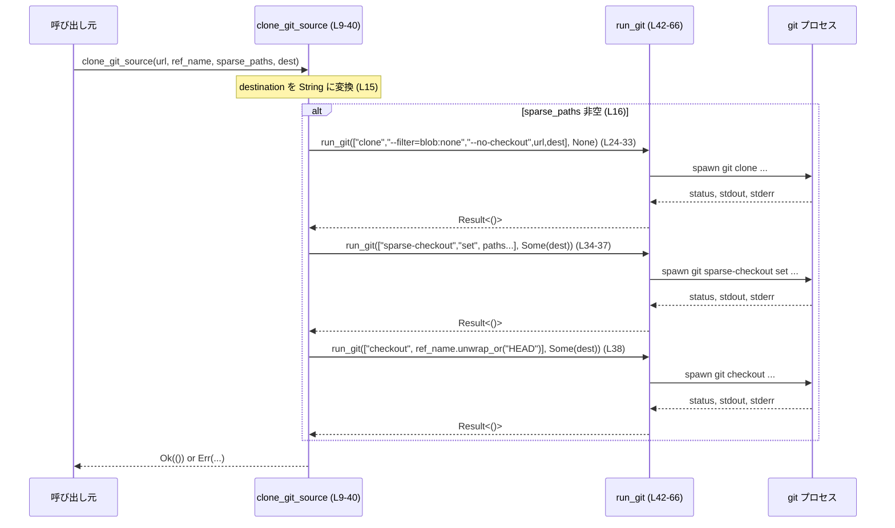

## cli/src/marketplace_cmd/ops.rs

---

## 0. ざっくり一言

Marketplace 用の Git リポジトリをクローンし、ステージングディレクトリから最終的なインストール先に入れ替えるための、小さなユーティリティ関数群をまとめたモジュールです（ops.rs:L9-40, L68-84）。

---

## 1. このモジュールの役割

### 1.1 概要

このモジュールは **マーケットプレイス用アセットの取得と配置** を行うために存在し、次の機能を提供します。

- Git リポジトリのクローン（通常クローン + sparse-checkout 対応）（ops.rs:L9-40）
- Git コマンド実行の共通ラッパー（エラー・メッセージ組み立て）（ops.rs:L42-66）
- ステージングディレクトリから最終インストール先への置き換え（ops.rs:L68-80）
- インストールルートからステージングディレクトリパスの生成（ops.rs:L82-84）

### 1.2 アーキテクチャ内での位置づけ

このファイル内のみで完結する依存関係を図示します。親モジュールや外部呼び出し元は、このチャンクからは分かりません。

```mermaid
graph TD
  subgraph "marketplace_cmd::ops (ops.rs)"
    clone["clone_git_source (L9-40)"]
    run["run_git (L42-66)"]
    replace["replace_marketplace_root (L68-80)"]
    staging["marketplace_staging_root (L82-84)"]
    test_fn["tests::replace_marketplace_root_rejects_existing_destination (L93-117)"]
  end

  clone --> run
  replace -->|"fs::rename"| FS[/"ファイルシステム"/]
  run -->|"Command::new(\"git\")"| GitCLI["git コマンド"]
  test_fn --> replace
```

- `clone_git_source` は Git 操作用のヘルパー `run_git` を通じてのみ Git を呼び出します（ops.rs:L17-19, L24-38）。
- `replace_marketplace_root` は標準ライブラリ `fs` に直接依存します（ops.rs:L68-80）。
- テストは `replace_marketplace_root` のエラーパスを検証します（ops.rs:L93-117）。

### 1.3 設計上のポイント

- **責務分割**  
  - Git 実行部分を `run_git` に切り出し、`clone_git_source` から共通化しています（ops.rs:L42-66）。
  - ファイルシステム上のディレクトリ操作は `replace_marketplace_root` に集約されています（ops.rs:L68-80）。

- **状態を持たない構造**  
  - すべての関数は `fn` であり構造体やグローバル状態を持ちません。純粋な入出力（パスや引数）に基づく処理になっています。

- **エラーハンドリングの方針**  
  - 戻り値に `anyhow::Result` を用い、`?` 演算子と `bail!` マクロでエラーを早期リターンします（ops.rs:L17, L33, L37-38, L52, L59-65, L70-71, L73-77, L79）。
  - `run_git` では `with_context` を使い、プロセス起動失敗時に実行コマンド文字列を含む文脈情報を追加します（ops.rs:L50-52）。
  - Git コマンドが失敗した場合、終了コードと stdout/stderr を含む詳細なエラーメッセージを返します（ops.rs:L57-65）。

- **並行性の前提**  
  - すべての処理は同期的で、`Command::output()` で子プロセスの完了までブロックします（ops.rs:L50-52）。
  - マルチスレッドや async/await は使用していません。並行実行を行う場合は呼び出し側で制御する前提です。

---

## 2. 主要な機能一覧（コンポーネントインベントリ）

このチャンクに現れる関数・テストの一覧です。

| 名前 | 種別 | 公開範囲 | 行 | 役割 / 用途 |
|------|------|----------|----|-------------|
| `clone_git_source` | 関数 | `pub(super)` | ops.rs:L9-40 | Git リポジトリを指定 URL からクローンし、必要に応じて sparse-checkout と ref チェックアウトを行う |
| `run_git` | 関数 | private | ops.rs:L42-66 | `git` コマンドをラップし、エラー時に詳細なメッセージを構築して返す |
| `replace_marketplace_root` | 関数 | `pub(super)` | ops.rs:L68-80 | ステージングディレクトリをインストール先へ `rename` し、既存ディレクトリがある場合はエラーとする |
| `marketplace_staging_root` | 関数 | `pub(super)` | ops.rs:L82-84 | インストールルート以下の `.staging` ディレクトリパスを生成する |
| `tests::replace_marketplace_root_rejects_existing_destination` | テスト関数 | test-only | ops.rs:L93-117 | 既存のインストール先がある場合に `replace_marketplace_root` がエラーを返し、両ディレクトリの内容が保持されることを検証 |

---

## 3. 公開 API と詳細解説

### 3.1 型一覧（構造体・列挙体など）

このファイル内で新しく定義される構造体・列挙体はありません。標準ライブラリの `Path` / `PathBuf` と `anyhow::Result` を主に利用しています（ops.rs:L2, L5-6）。

### 3.2 関数詳細

#### `clone_git_source(url: &str, ref_name: Option<&str>, sparse_paths: &[String], destination: &Path) -> Result<()>` （ops.rs:L9-40）

**概要**

- 指定された Git リポジトリ `url` を `destination` にクローンする関数です。
- `sparse_paths` が空かどうかで、通常クローンと sparse-checkout 付きクローンを切り替えます（ops.rs:L16, L24-38）。
- `ref_name` が与えられていれば、クローン後にその ref をチェックアウトします（ops.rs:L18-20, L38）。

**引数**

| 引数名 | 型 | 説明 |
|--------|----|------|
| `url` | `&str` | クローン対象の Git リポジトリ URL（例: `https://...`）（ops.rs:L10） |
| `ref_name` | `Option<&str>` | チェックアウトするブランチ名・タグ名など。`None` の場合はデフォルト（HEAD）に任せる（ops.rs:L11, L18-20, L38） |
| `sparse_paths` | `&[String]` | sparse-checkout で取得するパス一覧。空なら通常クローン（ops.rs:L12, L16, L34-35） |
| `destination` | `&Path` | クローン先ディレクトリパス（ops.rs:L13） |

**戻り値**

- `Result<()>` (`anyhow::Result`)  
  - 成功時は `Ok(())`。  
  - 失敗時は `run_git` やファイルシステムからのエラーをラップした `anyhow::Error` を返します。

**内部処理の流れ**

1. `destination: &Path` を UTF-8 の `String` に変換し、ローカル変数として保持します（ops.rs:L15）。  
   - `to_string_lossy` を使うため、非 UTF-8 のパスは代替文字で置き換えられます。
2. `sparse_paths` が空の場合（通常クローン）（ops.rs:L16-22）:
   - `git clone {url} {destination}` を `run_git` 経由で実行（ops.rs:L17）。
   - `ref_name` が `Some` であれば、クローン先ディレクトリをカレントにして `git checkout {ref}` を実行（ops.rs:L18-20）。
3. `sparse_paths` が空でない場合（sparse-checkout）（ops.rs:L24-39）:
   - `git clone --filter=blob:none --no-checkout {url} {destination}` を実行（ops.rs:L24-33）。
   - `["sparse-checkout", "set", ...sparse_paths]` を組み立て、クローン先をカレントにして `git sparse-checkout set ...` を実行（ops.rs:L34-37）。
   - 最後に `git checkout {ref_name.unwrap_or("HEAD")}` を実行してワーキングツリーを反映（ops.rs:L38）。

**Examples（使用例）**

```rust
use std::path::Path;
use cli::marketplace_cmd::ops::clone_git_source; // 実際のパスは親モジュール構成に依存（このチャンクからは不明）

fn install_marketplace() -> anyhow::Result<()> {
    let url = "https://example.com/marketplace.git";               // リポジトリ URL
    let dest = Path::new("/opt/mytool/marketplace");               // インストール先
    // 通常クローンで main ブランチをチェックアウト
    clone_git_source(url, Some("main"), &[], dest)?;               // sparse_paths を空にすると通常クローン
    Ok(())
}
```

sparse-checkout 版:

```rust
fn install_marketplace_sparse() -> anyhow::Result<()> {
    let url = "https://example.com/marketplace.git";
    let dest = std::path::Path::new("/opt/mytool/marketplace");
    let sparse_paths = vec!["plugins".to_string(), "index.json".to_string()];

    // HEAD をチェックアウトしつつ、指定パスのみ sparse-checkout
    clone_git_source(url, None, &sparse_paths, dest)?;
    Ok(())
}
```

**Errors / Panics**

- `clone_git_source` 自身は panic を起こすコードを持たず、エラーはすべて `Result` で返します。
- `run_git` からのエラー:
  - Git プロセスの起動失敗（実行ファイルが見つからない、権限不足など）の場合、  
    `"failed to run git {args...}"` というコンテキスト付きエラーになります（ops.rs:L50-52）。
  - Git の終了ステータスが非 0 の場合、  
    `"git {args...} failed with status {status} ..."` というエラーになります（ops.rs:L59-65）。
- `ref_name.unwrap_or("HEAD")` による panic の可能性はありません（`unwrap_or` は `None` でも panic しません）（ops.rs:L38）。

**Edge cases（エッジケース）**

- `sparse_paths` が空のとき:
  - 通常クローンとなり、sparse-checkout 関連のコマンドは実行されません（ops.rs:L16-22）。
- `ref_name` が `None` のとき:
  - 通常クローンでは `git clone` がデフォルトブランチをチェックアウトするため追加処理なし（ops.rs:L18-20 の `if let` に入らない）。
  - sparse-checkout では `git checkout HEAD` が実行されます（ops.rs:L38）。
- `destination` に非 UTF-8 文字が含まれるとき:
  - `to_string_lossy` により代替文字に置き換えられ、Git に渡すパス文字列が実際のパスと一致しない可能性があります（ops.rs:L15）。  
    この挙動はコードから読み取れる事実であり、意図かどうかは本チャンクからは分かりません。
- `sparse_paths` 内の文字列にスペースなどが含まれても、`Command` は引数を配列で受け取るためシェルインジェクションにはなりません（ops.rs:L24-31, L34-35）。

**使用上の注意点**

- Git バイナリ `git` が PATH 上に存在することが前提です（ops.rs:L42-43）。
- 環境変数 `GIT_TERMINAL_PROMPT` を `0` に設定して実行するため（ops.rs:L45）、認証情報がないリポジトリへのアクセスは **対話プロンプトなしで失敗** します。CI 等の非対話環境向きの挙動です。
- 処理は同期的であり、各 Git コマンドが終了するまで呼び出し元スレッドはブロックされます（ops.rs:L50-52）。
- 既存の `destination` の有無についてはこの関数では検査せず、Git 側の挙動に任せています（ops.rs:L17, L24-31）。  
  事前にディレクトリを作成／削除したい場合は呼び出し側で制御する必要があります。

---

#### `run_git(args: &[&str], cwd: Option<&Path>) -> Result<()>` （ops.rs:L42-66）

**概要**

- `git` コマンドをサブプロセスとして起動し、終了ステータスに応じて `Result<()>` を返すヘルパー関数です。
- 実行失敗時には stdout / stderr を含む詳細なエラーメッセージを構築します（ops.rs:L57-65）。

**引数**

| 引数名 | 型 | 説明 |
|--------|----|------|
| `args` | `&[&str]` | `git` コマンドに渡す引数列（例: `&["clone", url, dest]`）（ops.rs:L42, L44） |
| `cwd`  | `Option<&Path>` | サブプロセスのカレントディレクトリ。`None` の場合は親プロセスと同じ（ops.rs:L42, L46-48） |

**戻り値**

- `Result<()>`  
  - 成功時は `Ok(())`。  
  - 失敗時は `anyhow::Error`（起動失敗またはステータス非 0）を返します。

**内部処理の流れ**

1. `Command::new("git")` で `git` プロセスを生成します（ops.rs:L42-43）。
2. 引数を設定し（ops.rs:L44）、環境変数 `GIT_TERMINAL_PROMPT=0` を追加します（ops.rs:L45）。
3. `cwd` が指定されていれば `current_dir` を設定します（ops.rs:L46-48）。
4. `command.output()` を呼び出し、プロセスを実行して終了を待ちます（ops.rs:L50-52）。  
   - 起動失敗時には `with_context` 付きでエラーを返します。
5. 終了ステータスが成功であれば `Ok(())` を返します（ops.rs:L53-55）。
6. 失敗の場合:
   - stdout / stderr を UTF-8（代替文字あり）に変換し（ops.rs:L57-58）、  
   - ステータス・stdout・stderr を含むメッセージで `bail!` します（ops.rs:L59-65）。

**Examples（使用例）**

```rust
fn fetch_remote() -> anyhow::Result<()> {
    use std::path::Path;
    // git fetch origin をカレントディレクトリで実行
    super::run_git(&["fetch", "origin"], Some(Path::new(".")))?;
    Ok(())
}
```

**Errors / Panics**

- `Command::new("git").output()` がエラーを返した場合
  - 例: `git` が見つからない / 実行権限がない。
  - `"failed to run git {args...}"` というメッセージ付きで `Err` を返します（ops.rs:L50-52）。
- Git の終了ステータスが非 0 の場合
  - stdout/stderr を含む詳細なメッセージで `Err` を返します（ops.rs:L57-65）。
- `String::from_utf8_lossy` を使っているため、stdout/stderr が非 UTF-8 でも panic せず、代替文字で置き換えられます（ops.rs:L57-58）。

**Edge cases（エッジケース）**

- `args` に空配列を渡した場合でも、`git` はサブコマンドなしの起動を試み、結果は Git の仕様に依存します（ops.rs:L44）。  
  この挙動の善し悪しはコードからは判断できません。
- `cwd` が存在しないディレクトリの場合、`current_dir` 設定時か `output()` 実行時にエラーとなり、`Err` が返ります（ops.rs:L46-48, L50-52）。
- stdout/stderr が非常に大きい場合、メモリを多く消費しますが、明示的な制限はありません（ops.rs:L57-65）。

**使用上の注意点**

- この関数は **汎用的な Git ラッパー** として利用できますが、`Command` と同様に OS リソース（プロセス）を使用します。  
  高頻度呼び出しではプロセス生成コストに注意が必要です。
- シェル経由ではなく `Command` で直接実行しているため、引数にシェルインジェクションの危険は基本的にありません（ops.rs:L42-45）。
- 子プロセス終了までブロックするため、UI スレッドやイベントループから直接多回数呼ぶとレスポンス低下につながる可能性があります。

---

#### `replace_marketplace_root(staged_root: &Path, destination: &Path) -> Result<()>` （ops.rs:L68-80）

**概要**

- ステージングディレクトリ `staged_root` を最終インストール先 `destination` へ移動 (`fs::rename`) する関数です（ops.rs:L79）。
- 事前に `destination` の親ディレクトリを作成し、`destination` 自体が既に存在する場合はエラーとします（ops.rs:L68-77）。

**引数**

| 引数名 | 型 | 説明 |
|--------|----|------|
| `staged_root` | `&Path` | 事前に準備されたステージングディレクトリ（ops.rs:L68） |
| `destination` | `&Path` | 最終インストール先ディレクトリ（ops.rs:L68） |

**戻り値**

- `Result<()>`  
  - 成功時は `Ok(())`。  
  - エラー時は `fs::create_dir_all` や `fs::rename`、または `bail!` によるエラーを返します。

**内部処理の流れ**

1. `destination.parent()` を取得し、存在する場合はそのディレクトリを `fs::create_dir_all` で作成します（ops.rs:L69-71）。
2. `destination.exists()` をチェックし、既に存在する場合は  
   `"marketplace destination already exists: {destination}"` というメッセージで `bail!` します（ops.rs:L72-77）。
3. `fs::rename(staged_root, destination)` でステージングディレクトリをインストール先に移動し、その結果を `anyhow::Result` に変換して返します（ops.rs:L79）。

**Examples（使用例）**

```rust
use std::path::Path;
use cli::marketplace_cmd::ops::{marketplace_staging_root, replace_marketplace_root};

fn finalize_install(install_root: &Path) -> anyhow::Result<()> {
    let staged_root = marketplace_staging_root(install_root);     // /path/to/root/.staging
    let destination = install_root.join("marketplace");           // 最終インストール先
    replace_marketplace_root(&staged_root, &destination)?;        // .staging -> marketplace にリネーム
    Ok(())
}
```

**Errors / Panics**

- `destination.parent()` が存在し、`create_dir_all` が失敗した場合（権限不足、パス不正など）、そのまま `Err` を返します（ops.rs:L69-71）。
- `destination` が既に存在している場合、`bail!` により `"marketplace destination already exists: ..."` というエラーになります（ops.rs:L72-77）。
- `fs::rename` が失敗した場合（パスが存在しない、別デバイス間など）、`io::Error` が `anyhow::Error` に変換されて返ります（ops.rs:L79）。
- panic を直接起こすコードは含まれていません。

**Edge cases（エッジケース）**

- `destination` の親ディレクトリが存在しない場合でも、自動的に作成されます（ops.rs:L69-71）。
- `destination` が既に存在する場合、**ステージングと宛先の内容は変更されません**。  
  テストで以下が確認されています（ops.rs:L93-117）:
  - エラー発生後も `staged_root/marker.txt` の内容が `"staged"` のままである（ops.rs:L110-112）。
  - `destination/marker.txt` の内容も `"installed"` のままである（ops.rs:L113-116）。
- `staged_root` が存在しない場合や、`staged_root` と `destination` が別ボリュームの場合は、`fs::rename` がエラーを返します（ops.rs:L79）。

**使用上の注意点**

- 既存インストールの上書きは行わない設計になっています。上書きを許容したい場合は、この関数の呼び出し前に既存ディレクトリを削除するなどの処理が必要です（ops.rs:L72-77）。
- `fs::rename` は多くの OS で **アトミックな移動** になりますが、ボリュームをまたぐときに失敗することがあります。この場合はコピー+削除など別実装が必要になります。
- `destination.exists()` チェックと `fs::rename` の間には他プロセスとの競合（TOCTOU）があり得ます（ops.rs:L72-79）。  
  競合が起きた場合、`fs::rename` が OS エラーを返しますが、「既存ディレクトリです」というメッセージにはなりません。

---

#### `marketplace_staging_root(install_root: &Path) -> PathBuf` （ops.rs:L82-84）

**概要**

- 与えられたインストールルート直下の `.staging` ディレクトリパスを構築するユーティリティ関数です。

**引数**

| 引数名 | 型 | 説明 |
|--------|----|------|
| `install_root` | `&Path` | マーケットプレイスのインストールルートディレクトリ（ops.rs:L82） |

**戻り値**

- `PathBuf`  
  - `install_root.join(".staging")` の結果を返します（ops.rs:L83）。

**内部処理**

- `install_root.join(".staging")` を一行で返すのみの単純な処理です（ops.rs:L83）。

**Examples（使用例）**

```rust
use std::path::Path;
use cli::marketplace_cmd::ops::marketplace_staging_root;

fn prepare_staging() {
    let root = Path::new("/opt/mytool");                          // インストールルート
    let staged = marketplace_staging_root(root);                  // /opt/mytool/.staging
    std::fs::create_dir_all(&staged).unwrap();
}
```

**Errors / Panics**

- ファイルシステムアクセスは行わず、パス結合のみなので、この関数内でエラーや panic は発生しません。

**Edge cases / 使用上の注意点**

- `install_root` が相対パスであれば、返される `PathBuf` も相対パスになります（ops.rs:L83）。
- `.staging` の命名はこの関数にハードコードされているため、ディレクトリ名の変更はこの関数を修正する必要があります。

---

### 3.3 その他の関数

テスト専用の関数が 1 つ定義されています。

| 関数名 | 役割（1 行） | 行 |
|--------|--------------|----|
| `tests::replace_marketplace_root_rejects_existing_destination` | `replace_marketplace_root` が既存宛先に対してエラーを返し、ディレクトリ内容を変更しないことを検証する | ops.rs:L93-117 |

---

## 4. データフロー

### 4.1 代表シナリオ: sparse-checkout 付きクローン

`sparse_paths` が空でないケースの処理フローを示します（ops.rs:L24-39）。



要点:

- 呼び出し元からは `clone_git_source` を 1 回呼び出すだけで、複数の Git コマンド実行が隠蔽されています。
- `run_git` 内で Git の stdout/stderr が収集され、失敗時に一つのエラーメッセージとして返されます（ops.rs:L57-65）。
- すべての処理は同期的であり、各 Git コマンドが終了してから次の処理に進みます（ops.rs:L50-52）。

---

## 5. 使い方（How to Use）

### 5.1 基本的な使用方法

マーケットプレイスをインストールする典型的なフロー（ステージング → クローン → 本番配置）の例です。

```rust
use std::path::Path;
use anyhow::Result;

// 実際のモジュールパスは親モジュール構成に依存（ここでは仮のパス名）
use cli::marketplace_cmd::ops::{
    clone_git_source,
    marketplace_staging_root,
    replace_marketplace_root,
};

fn install_marketplace(install_root: &Path, url: &str) -> Result<()> {
    // 1. ステージングディレクトリを求める
    let staged_root = marketplace_staging_root(install_root);    // ops.rs:L82-83

    // 2. ステージングディレクトリにクローンする（通常クローン）
    clone_git_source(url, None, &[], &staged_root)?;             // ops.rs:L9-22

    // 3. ステージングを最終インストール先に移動する
    let dest = install_root.join("marketplace");
    replace_marketplace_root(&staged_root, &dest)?;              // ops.rs:L68-80

    Ok(())
}
```

### 5.2 よくある使用パターン

1. **特定ブランチ・タグのクローン**

```rust
fn install_from_branch(root: &Path) -> anyhow::Result<()> {
    let staged = marketplace_staging_root(root);
    clone_git_source(
        "https://example.com/marketplace.git",
        Some("release-2024-09"), // 特定タグ・ブランチ
        &[],
        &staged,
    )?;
    replace_marketplace_root(&staged, &root.join("marketplace"))?;
    Ok(())
}
```

1. **特定ディレクトリのみの sparse-checkout**

```rust
fn install_partial(root: &Path) -> anyhow::Result<()> {
    let staged = marketplace_staging_root(root);
    let sparse_paths = vec!["plugins/core".to_string(), "index.json".to_string()];
    clone_git_source(
        "https://example.com/marketplace.git",
        None,                // デフォルトの HEAD
        &sparse_paths,       // 必要なパスだけ取得
        &staged,
    )?;
    replace_marketplace_root(&staged, &root.join("marketplace"))?;
    Ok(())
}
```

### 5.3 よくある間違い

**誤り例: 既に存在するインストール先に対して `replace_marketplace_root` を呼ぶ**

```rust
// 誤り: destination が既に存在する
let staged_root = marketplace_staging_root(root);
let dest = root.join("marketplace");
std::fs::create_dir_all(&dest)?;          // ここで既存ディレクトリを作ってしまう
replace_marketplace_root(&staged_root, &dest)?; // => エラーになる（ops.rs:L72-77）
```

**正しい例: 既に存在するディレクトリを削除してから呼ぶ**

```rust
use std::fs;

let staged_root = marketplace_staging_root(root);
let dest = root.join("marketplace");

if dest.exists() {
    fs::remove_dir_all(&dest)?;           // 既存インストールを削除
}

replace_marketplace_root(&staged_root, &dest)?; // 正常に rename される
```

### 5.4 使用上の注意点（まとめ）

- **Git 依存**  
  - `git` コマンドがインストールされ、PATH に含まれている必要があります（ops.rs:L42-43）。
- **非対話実行**  
  - `GIT_TERMINAL_PROMPT=0` により、パスワードや 2FA の入力を要求するプロンプトは表示されません（ops.rs:L45）。  
    認証情報は事前に設定されている必要があります。
- **同期的・ブロッキング**  
  - 各 Git コマンドは完了までスレッドをブロックします（ops.rs:L50-52）。  
    UI スレッドなどで呼ぶ場合は注意が必要です。
- **ファイルシステムの前提**  
  - `replace_marketplace_root` は rename を前提としており、ボリュームが同一であることが望ましいです（ops.rs:L79）。
- **競合状態**  
  - 他プロセスが同じ `destination` を同時に操作すると、存在チェックと rename の間で競合する可能性があります（ops.rs:L72-79）。

---

## 6. 変更の仕方（How to Modify）

### 6.1 新しい機能を追加する場合

例: クローン時に追加の Git オプション（`--depth=1` など）を付与したい場合。

1. **`clone_git_source` の呼び出し引数設計**
   - 新しいオプションを呼び出し元から渡すか、固定で付けるかを決めます（ops.rs:L9-14）。
2. **`run_git` 呼び出し箇所の修正**
   - 必要なサブコマンドの引数にオプションを追加します（ops.rs:L17, L24-31, L37-38）。
3. **テストの追加**
   - 既存のテストと同様に `tempfile::TempDir` などを使い、挙動を検証するテストを `mod tests` 内に追加します（ops.rs:L86-117）。

### 6.2 既存の機能を変更する場合

- **`replace_marketplace_root` の挙動変更**
  - 既存ディレクトリを許可したい場合は、`destination.exists()` チェックと `bail!` 部分を確認・修正します（ops.rs:L72-77）。
  - 既存テスト `replace_marketplace_root_rejects_existing_destination` が前提としている挙動なので、変更時はテストも更新する必要があります（ops.rs:L93-117）。
- **エラーメッセージの変更**
  - `bail!` のメッセージはテストで部分一致が検証されているため（ops.rs:L104-107）、変更するとテストが失敗する点に注意します。
- **エラー詳細の粒度変更**
  - `run_git` の stdout/stderr をログに出さず短いメッセージにしたい場合は、`String::from_utf8_lossy` と `bail!` の部分を編集します（ops.rs:L57-65）。

---

## 7. 関連ファイル

このチャンクから直接分かる関連は次の通りです。

| パス / クレート | 役割 / 関係 |
|-----------------|------------|
| `cli/src/marketplace_cmd/ops.rs` | 本レポート対象ファイル |
| （不明） | このモジュールを呼び出す親モジュール・CLI エントリポイントは、このチャンクには現れません |
| `pretty_assertions` クレート | テストで `assert_eq!` の差分表示を改善するために使用（ops.rs:L89） |
| `tempfile` クレート | テスト用の一時ディレクトリ作成に使用（ops.rs:L90, L94） |

---

### Bugs / Security の観点（コードから読み取れる範囲）

- **非 UTF-8 パスの扱い**  
  - `destination.to_string_lossy()` により、非 UTF-8 を含むパスは代替文字に置き換えられます（ops.rs:L15）。  
    その結果、実際のファイルパスと Git に渡るパス文字列が一致しない可能性があります。
- **シェルインジェクション耐性**  
  - `Command::new("git")` と `command.args(args)` を使っており、シェルを経由しないため、引数をそのまま渡してもシェルインジェクションは発生しにくい構造です（ops.rs:L42-45）。
- **情報漏洩リスク**  
  - Git コマンドが失敗した際、stdout/stderr の内容をそのままエラーメッセージに含めています（ops.rs:L57-65）。  
    ログやユーザー表示の扱いによっては、リモート URL や認証関連メッセージが露出する可能性があります。どこまで外部に出すかは利用側で制御する必要があります（このファイルからは利用方法は不明です）。

上記はいずれもコードから読み取れる挙動の説明であり、実際に問題となるかどうかはシステム全体の要件と運用方針によります。
