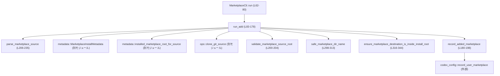

# cli/src/marketplace_cmd.rs

## 0. ざっくり一言

リモートのマーケットプレイス Git リポジトリを `codex` のローカルキャッシュ（`CODEX_HOME`）に追加・記録するための CLI サブコマンド `marketplace add` を実装するモジュールです（`MarketplaceCli` が公開エントリポイントです）(marketplace_cmd.rs:L21-28, L62-80)。

---

## 1. このモジュールの役割

### 1.1 概要

- このモジュールは、ユーザーが指定したマーケットプレイスの **Git リポジトリ URL / GitHub owner/repo 省略記法** などを解釈し、ローカルにクローン・検証・インストールして、ユーザー設定に登録する処理を提供します (L36-52, L83-178, L206-235)。
- CLI 引数のパース（`clap`）、Git ソースの正規化とバリデーション、安全なディレクトリ名の生成、インストール先パスの安全確認、設定ファイルへの書き込みまでを 1 本のフローとしてまとめています (L21-28, L83-178, L298-344, L180-198)。

### 1.2 アーキテクチャ内での位置づけ

- エントリポイントは `MarketplaceCli::run` で、`clap` によりサブコマンドとオプションを解釈し、`MarketplaceSubcommand::Add` の場合に `run_add` を呼び出します (L21-34, L62-80)。
- `run_add` は以下の外部コンポーネントに依存します (L83-178):
  - `codex_core::config::find_codex_home` で `CODEX_HOME` を決定 (L92)。
  - `codex_core::plugins::marketplace_install_root` でインストールルートを決定 (L93)。
  - `metadata` モジュールでインストールメタデータの生成・既存インストール探索 (L100-106)。
  - `ops` モジュールで Git クローンやディレクトリ置き換えなどのファイル操作 (L122-141, L159-160)。
  - `codex_core::plugins::validate_marketplace_root` / `validate_plugin_segment` によるマーケットプレイス内容・名前の検証 (L107-112, L200-203)。
  - `codex_config::record_user_marketplace` によるユーザー設定 `config.toml` への反映 (L180-198)。

代表的な依存関係を Mermaid 図で示します。



### 1.3 設計上のポイント

- **責務分割** (L21-60, L83-204)
  - CLI 引数の解釈は `MarketplaceCli` / `AddMarketplaceArgs` / `MarketplaceSubcommand` に集中。
  - Git URL 解析・正規化・バリデーションは `parse_marketplace_source` 以下のユーティリティ群に分離 (L206-296)。
  - ディレクトリ名生成とインストール先ディレクトリ安全性チェックは専用関数に分離 (`safe_marketplace_dir_name`, `ensure_marketplace_destination_is_inside_install_root`) (L298-344)。
- **エラーハンドリング方針** (L3, L71-73, L83-178, L180-204, L346-351)
  - `anyhow::Result` + `bail!` + `Context` を用いて、失敗時にメッセージと文脈を付与。
  - ユーザー向けのエラーは、メッセージ文字列で条件ごとに明示（空入力 / ローカルパス禁止 / フォーマット不正など） (L210-235, L218-222, L234)。
- **安全性**
  - ローカルパスや `file://` URL をマーケットプレイスソースとして受け付けない (L218-222, L234, L482-503)。
  - インストール先ディレクトリ名は、許可された文字のみを通し、それ以外を `-` に置き換え、`.` のみの名前や `..` を禁止してディレクトリトラバーサルを防止 (L298-313)。
  - インストール先の親ディレクトリを `canonicalize` し、インストールルート配下であることを確認 (L316-343)。
  - 予約マーケットプレイス名（`OPENAI_CURATED_MARKETPLACE_NAME`）は追加禁止 (L145-150)。
- **並行性**
  - 公開 API の `run` / `run_add` は `async fn` ですが、中身は同期 I/O (`std::fs`) を呼び出しています (L62-80, L83-178)。
  - 共有ミュータブル状態を持たないため、単一 CLI 実行としてはデータ競合はありませんが、同一マーケットプレイスを複数プロセスから同時に追加しようとすると競合しうる（排他制御はこのモジュール内にはありません）(L153-160)。

---

## 2. 主要な機能一覧

このモジュールが提供する主な機能は次のとおりです。

- CLI エントリポイント `MarketplaceCli::run`: `marketplace add` サブコマンドの起動 (L21-34, L62-80)
- マーケットプレイス追加フロー `run_add`:
  - ソース文字列の解析・バリデーション（`parse_marketplace_source`）(L83-91, L206-235)
  - Git ソースのクローン（`ops::clone_git_source`）とステージング (L122-141)
  - マーケットプレイスルートと名前の検証（`validate_marketplace_source_root`）(L143-145, L200-203)
  - インストールディレクトリ名の生成と安全性チェック（`safe_marketplace_dir_name`, `ensure_marketplace_destination_is_inside_install_root`）(L151-158, L298-344)
  - 既存インストール有無の確認と差分メッセージ (L100-120)
  - ユーザー設定 `config.toml` への登録（`record_added_marketplace`）(L113-117, L161-169, L180-198)
- マーケットプレイスソース文字列の解析・正規化:
  - GitHub 省略記法 / HTTP(S) Git URL / SSH Git URL の判定 (L206-235, L273-279, L281-289)
  - `@ref` / `#ref` による Git ref の抽出と `--ref` オプションによる上書き (L206-217, L237-253)
- 時刻処理:
  - 現在時刻から UTC の RFC3339 形式（`YYYY-MM-DDTHH:MM:SSZ`）文字列を生成 (`utc_timestamp_now`, `format_utc_timestamp`, `civil_from_days`) (L346-377, L521-530)

---

## 3. 公開 API と詳細解説

### 3.1 型一覧（構造体・列挙体など）

| 名前 | 種別 | 公開範囲 | 役割 / 用途 | 定義行 |
|------|------|----------|-------------|--------|
| `MarketplaceCli` | 構造体 | `pub` | CLI 全体のエントリポイント。設定オーバーライドとサブコマンドを保持し、`run` メソッドで実行 (L21-28, L62-80) | L21-28 |
| `MarketplaceSubcommand` | 列挙体 | crate 内 | `marketplace` コマンドのサブコマンド定義。現在は `Add` のみ (L30-34) | L30-34 |
| `AddMarketplaceArgs` | 構造体 | crate 内 | `marketplace add` の引数定義：`source`, `--ref`, `--sparse` (L36-52) | L36-52 |
| `MarketplaceSource` | 列挙体 | `pub(super)` | 解釈済みマーケットプレイスソース。現状は Git URL + ref のみ (L54-60, L379-390) | L54-60 |
| `metadata` | モジュール | 非公開 | インストールメタデータの生成・既存インストール探索等（詳細はこのチャンクには現れません）(L18) | L18 |
| `ops` | モジュール | 非公開 | Git クローン・ディレクトリ置換などのファイル操作（詳細はこのチャンクには現れません）(L19) | L19 |

### 3.2 関数詳細（主要 7 件）

#### `MarketplaceCli::run(self) -> Result<()>`

**概要**

- CLI からマーケットプレイスサブコマンドを実行する公開エントリポイントです (L62-80)。
- 設定オーバーライドを検証した上で、指定されたサブコマンド（現状 `Add` のみ）を実行します。

**引数**

| 引数名 | 型 | 説明 |
|--------|----|------|
| `self` | `MarketplaceCli` | clap によってパースされた CLI 全体の引数構造体 (L21-28) |

**戻り値**

- `Result<()>` (`anyhow::Result`)  
  成功時は `Ok(())`、エラー時は `anyhow::Error` を返します。

**内部処理の流れ**

1. `MarketplaceCli { config_overrides, subcommand } = self` でフィールドを分解 (L64-67)。
2. `config_overrides.parse_overrides()` を呼び、オーバーライドを検証し、エラーを `anyhow::Error::msg` でラップ (L71-73)。
3. `match subcommand` でサブコマンドを分岐し、`MarketplaceSubcommand::Add(args)` の場合に `run_add(args).await?` を呼び出し (L75-77)。
4. サブコマンド完了後、`Ok(())` を返す (L79)。

**Examples（使用例）**

```rust
use clap::Parser;

#[tokio::main]
async fn main() -> anyhow::Result<()> {
    // コマンドライン引数から MarketplaceCli を構築
    let cli = MarketplaceCli::parse(); // clap::Parser 由来 (L21-24)

    // サブコマンドを実行
    cli.run().await
}
```

**Errors / Panics**

- `parse_overrides` が失敗した場合、エラーを返します (L71-73)。
- サブコマンド `run_add` 内で発生した任意のエラーが `?` でそのまま伝播します (L75-77)。
- このメソッド自身は `panic!` を呼びません。

**Edge cases（エッジケース）**

- サブコマンドが `Add` 以外の場合の挙動は、現状のコードにはありません（enum に他のバリアントがないため）(L30-34, L75-77)。

**使用上の注意点**

- `async fn` なので、Tokio などの async ランタイム内で `await` する必要があります。
- 実行により `CODEX_HOME` 配下のファイルが作成・更新されるため、権限のあるユーザーで実行する前提になります (L92-99, L122-128, L159-167)。

---

#### `run_add(args: AddMarketplaceArgs) -> Result<()>`

**概要**

- `marketplace add` サブコマンドのコア処理です (L83-178)。
- ソース文字列の解析、Git クローン、マーケットプレイス検証、安全なインストール、設定への登録を行います。

**引数**

| 引数名 | 型 | 説明 |
|--------|----|------|
| `args` | `AddMarketplaceArgs` | CLI から受け取ったソース、`--ref`、`--sparse` オプション (L83-88, L36-52) |

**戻り値**

- `Result<()>` (`anyhow::Result`)  
  成功時は `Ok(())`、エラー時は適切なメッセージ付きの `anyhow::Error` を返します。

**内部処理の流れ（アルゴリズム）**

1. 構造体分解で `source`, `ref_name`, `sparse_paths` を取り出す (L84-88)。
2. `parse_marketplace_source(&source, ref_name)` でソース文字列を解析し、`MarketplaceSource::Git { url, ref_name }` に変換 (L90)。
3. `find_codex_home()` で `CODEX_HOME` を解決し、失敗時に `"failed to resolve CODEX_HOME"` コンテキストを付与 (L92)。
4. `marketplace_install_root` を取得し、`fs::create_dir_all` でインストールルートを作成 (L93-99)。
5. `MarketplaceInstallMetadata::from_source` を生成し、既に同一ソースからインストール済みかを `installed_marketplace_root_for_source` で確認 (L100-106)。
   - 既存があれば `validate_marketplace_root` で検証し (L107-112)、`record_added_marketplace` を呼んでユーザー設定を更新し、既存パスを表示して終了 (L113-120)。
6. 新規インストールの場合:
   - ステージングルートを作成 (`ops::marketplace_staging_root` + `create_dir_all`) (L122-128)。
   - `tempfile::Builder` で一時ディレクトリを作成し、そのパスを `staged_root` に取得 (L129-138)。
   - `ops::clone_git_source(url, ref_name.as_deref(), &sparse_paths, &staged_root)` で Git ソースをクローン (L140-141)。
   - `validate_marketplace_source_root(&staged_root)` でマーケットプレイスとして妥当か検証 (L143-145)。
   - 名前が `OPENAI_CURATED_MARKETPLACE_NAME` ならエラー (予約名) (L145-150)。
   - `safe_marketplace_dir_name` で安全なディレクトリ名を生成し、`install_root.join` で最終インストール先を決定 (L151)。
   - `ensure_marketplace_destination_is_inside_install_root` でインストール先がルート配下であることを確認 (L152)。
   - インストール先が既に存在する場合（異なるソースから）はエラー (L153-158)。
   - `ops::replace_marketplace_root(&staged_root, &destination)` でステージング内容をインストール先に移動 (L159-160)。
   - `record_added_marketplace` がエラーになった場合は、`fs::rename(&destination, &staged_root)` でロールバックを試みる (L161-168)。
7. 成功時には新規追加されたマーケットプレイス名とインストールパスを `println!` で表示して `Ok(())` (L171-177)。

**Examples（使用例）**

CLI からの利用イメージ:

```text
codex marketplace add owner/repo@main --sparse plugins/foo --sparse skills/bar
```

Rust コードから直接呼び出す場合（テストや内部利用を想定）:

```rust
use cli::marketplace_cmd::{AddMarketplaceArgs}; // 実際のモジュールパスはこのチャンクからは不明

#[tokio::test]
async fn add_marketplace_example() -> anyhow::Result<()> {
    let args = AddMarketplaceArgs {
        source: "owner/repo".to_string(),
        ref_name: Some("main".to_string()),
        sparse_paths: vec!["plugins/foo".into()],
    };

    run_add(args).await?; // L83-178

    Ok(())
}
```

**Errors / Panics**

- ソースが空、ローカルパス、解釈不能なフォーマットの場合、`parse_marketplace_source` 経由でエラー (L210-235)。
- `CODEX_HOME` 解決、ディレクトリ作成、Git クローン、検証、インストール先置き換え、設定ファイル更新など、それぞれの失敗時に `Context` 付き `anyhow::Error` を返します (L92-99, L122-137, L143-145, L159-167, L180-198)。
- `bail!` マクロにより早期リターンするが、`panic!` は使用していません (L145-150, L153-158)。
- ロールバックの `fs::rename` も失敗した場合は、両方のエラー内容を含んだメッセージで `bail!` します (L161-167)。

**Edge cases（エッジケース）**

- 同一ソースから既にインストール済みの場合：
  - 再クローンせず、既存インストールを検証・再登録してメッセージを出力して終了 (L100-120)。
- 異なるソースから同名マーケットプレイスが既に存在する場合：
  - `"already added from a different source"` としてエラー (L153-158)。
- 予約名マーケットプレイス（`OPENAI_CURATED_MARKETPLACE_NAME`）を追加しようとした場合：
  - 予約済みである旨のエラー (L145-150)。
- 設定ファイル更新のみが失敗した場合：
  - インストール済み内容をステージングディレクトリへロールバックしようとし、両方の結果をメッセージに含める (L161-169)。

**使用上の注意点**

- 実行はネットワークアクセス（Git クローン）とファイルシステム操作を伴うため、失敗時のエラーメッセージを見て原因（ネットワーク・権限・パスなど）を判別する必要があります。
- 並行に複数プロセスで同一マーケットプレイスを追加しようとした場合、`exists()` チェックとインストール処理の間にレースが起きうる点に注意が必要です (L153-160)。

---

#### `parse_marketplace_source(source: &str, explicit_ref: Option<String>) -> Result<MarketplaceSource>`

**概要**

- ユーザーが指定したソース文字列（例: `owner/repo@main`, `https://...git#v1`, `ssh://git@github.com/...`）を解析し、標準化された `MarketplaceSource::Git` に変換します (L206-235)。

**引数**

| 引数名 | 型 | 説明 |
|--------|----|------|
| `source` | `&str` | ユーザー入力のマーケットプレイスソース文字列 (L206-212) |
| `explicit_ref` | `Option<String>` | `--ref` オプションなど明示的に指定された Git ref。存在する場合はソース文字列内の `@ref` / `#ref` を上書きする (L206-217) |

**戻り値**

- 成功時: `Ok(MarketplaceSource::Git { url, ref_name })`  
  - `url`: 正規化された Git URL (`normalize_git_url` を適用) (L224-227, L255-261)  
  - `ref_name`: 明示的 ref またはソース内の ref、どちらもなければ `None` (L215-217)
- 失敗時: フォーマットエラーなどを表す `anyhow::Error`。

**内部処理の流れ**

1. `source.trim()` で両端の空白を削除 (L210)。
2. 空文字列であれば `"marketplace source must not be empty"` でエラー (L211-213)。
3. `split_source_ref(source)` でソースから `base_source`（ref 部分除去）と `parsed_ref` を取り出す (L215, L237-248)。
4. `explicit_ref.or(parsed_ref)` で明示 ref を優先して合成 (L216-217)。
5. `looks_like_local_path(&base_source)` でローカルパス（`./`、`../`、`/`、`~/`、`.`、`..`）と判定された場合は `"local marketplace sources are not supported yet"` でエラー (L218-222, L264-271, L496-503)。
6. `is_ssh_git_url` または `is_git_url` が真なら、`normalize_git_url` で URL を正規化し `MarketplaceSource::Git` を返す (L224-227, L273-279, L255-261)。
7. `looks_like_github_shorthand`（`owner/repo` の 2 セグメント）なら、`https://github.com/{base_source}.git` に変換して `MarketplaceSource::Git` を返す (L229-232, L281-289)。
8. 上記いずれにも当てはまらない場合は `"invalid marketplace source format: {source}"` としてエラー (L234)。

**Examples（使用例）**

テストコードからの例 (L398-422, L439-479, L507-517):

```rust
assert_eq!(
    parse_marketplace_source("owner/repo@main", None).unwrap(),
    MarketplaceSource::Git {
        url: "https://github.com/owner/repo.git".to_string(),
        ref_name: Some("main".to_string()),
    }
);

assert_eq!(
    parse_marketplace_source(
        "https://example.com/team/repo.git#v1",
        None,
    ).unwrap(),
    MarketplaceSource::Git {
        url: "https://example.com/team/repo.git".to_string(),
        ref_name: Some("v1".to_string()),
    }
);

assert_eq!(
    parse_marketplace_source(
        "owner/repo@main",
        Some("release".to_string()), // 明示的 ref がソース内の @main を上書き
    ).unwrap(),
    MarketplaceSource::Git {
        url: "https://github.com/owner/repo.git".to_string(),
        ref_name: Some("release".to_string()),
    }
);
```

**Errors / Panics**

- 空文字列の場合: `"marketplace source must not be empty"` (L211-213)。
- ローカルパスとみなされた場合: `"local marketplace sources are not supported yet; ..."` (L218-222)。
- 上記以外の未知の形式: `"invalid marketplace source format: {source}"` (L234, L482-492)。
- この関数は `panic!` を使用していません。

**Edge cases（エッジケース）**

- `file:///...` のような `file://` URL は `is_git_url` にマッチしないため、最終的に `"invalid marketplace source format"` でエラーになります。テスト `file_url_source_is_rejected` で確認済みです (L482-493)。
- `ssh://git@github.com/...` や `git@github.com:owner/repo.git` は `is_ssh_git_url` によって Git URL と解釈されます (L273-275, L507-517)。
- `owner/repo` のような 2 セグメントの文字列は、両方が `is_github_shorthand_segment` を満たす場合にのみ認識され、3 つ以上のセグメントは拒否されます (L281-289)。

**使用上の注意点**

- この関数はローカルディレクトリからのマーケットプレイス追加を意図的に拒否しています。将来ローカルソースをサポートする場合はここに拡張が必要です (L218-222)。
- `explicit_ref` を渡すとソース文字列内の ref を上書きするため、ユーザーが `SOURCE` と `--ref` を同時指定した場合は `--ref` が優先される契約になっています (L215-217, L424-437)。

---

#### `record_added_marketplace(codex_home: &Path, marketplace_name: &str, install_metadata: &metadata::MarketplaceInstallMetadata) -> Result<()>`

**概要**

- インストール済みマーケットプレイスの情報を `MarketplaceConfigUpdate` として組み立て、`record_user_marketplace` 経由でユーザー設定 (`config.toml`) に記録します (L180-198)。

**引数**

| 引数名 | 型 | 説明 |
|--------|----|------|
| `codex_home` | `&Path` | `CODEX_HOME` ディレクトリへのパス (L180-182, L92) |
| `marketplace_name` | `&str` | マーケットプレイスの論理名（`validate_marketplace_root`/`validate_plugin_segment` 済み）(L180-183, L200-203) |
| `install_metadata` | `&MarketplaceInstallMetadata` | ソース URL、ref、sparse パスなどインストールに関するメタ情報 (L183, L100-101) |

**戻り値**

- 成功時は `Ok(())`、失敗時は `record_user_marketplace` 由来のエラーにメッセージを付加した `anyhow::Error`。

**内部処理の流れ**

1. `install_metadata.config_source()` で設定用のソース文字列を取得 (L185)。
2. `utc_timestamp_now()` で現在 UTC 時刻の文字列表現を生成 (L186, L346-351)。
3. `MarketplaceConfigUpdate` 構造体を組み立て (L187-193)。
4. `record_user_marketplace(codex_home, marketplace_name, &update)` を呼び、失敗時に `"failed to add marketplace`{marketplace_name}`to user config.toml"` というコンテキストを付加 (L194-196)。
5. `Ok(())` を返す (L197-198)。

**Examples（使用例）**

`run_add` 内からの使用 (L161-169):

```rust
record_added_marketplace(&codex_home, &marketplace_name, &install_metadata)?;
```

**Errors / Panics**

- `utc_timestamp_now()` が `SystemTime` エラーを返した場合（システム時計が Unix epoch より前）にエラー (L346-351)。
- `record_user_marketplace` が失敗した場合、そのエラーにメッセージを付加して返します (L194-196)。
- `panic!` は使用していません。

**Edge cases（エッジケース）**

- `install_metadata` の内容が異常な場合（ソースや ref が期待形式でないなど）の挙動は、このモジュールからは分かりません。`MarketplaceConfigUpdate` に詰めて外部関数に委譲されています (L187-193)。

**使用上の注意点**

- この関数が失敗した場合、`run_add` 側ではインストール済みディレクトリをロールバックしようとします (L161-169)。設定とファイルシステムを常に整合させる前提のため、この関数の戻り値は必ずチェックする必要があります。

---

#### `validate_marketplace_source_root(root: &Path) -> Result<String>`

**概要**

- クローンしたマーケットプレイスディレクトリのルートを検証し、妥当なマーケットプレイス名を返します (L200-204)。

**引数**

| 引数名 | 型 | 説明 |
|--------|----|------|
| `root` | `&Path` | クローン済みマーケットプレイスのルートディレクトリ (L200) |

**戻り値**

- 成功時は検証済みマーケットプレイス名 `String`。
- 失敗時は `validate_marketplace_root` / `validate_plugin_segment` 由来のエラーに `anyhow::Error` 変換を適用したエラー。

**内部処理の流れ**

1. `validate_marketplace_root(root)` によってマーケットプレイス構造と名前を検証 (L201)。
2. 取得した `marketplace_name` を `validate_plugin_segment(&marketplace_name, "marketplace name")` に通し、名前のセグメント制約を確認 (L202)。
3. 成功すれば `marketplace_name` を返す (L203)。

**Errors / Panics**

- `validate_marketplace_root` が失敗した場合。
- `validate_plugin_segment` が失敗した場合、`anyhow::Error::msg` でエラーに変換されます (L202)。
- `panic!` は使用していません。

**使用上の注意点**

- `run_add` 内で `OPENAI_CURATED_MARKETPLACE_NAME` のチェックの前に呼ばれるため、予約名かどうかの判定はここでは行いません (L143-150)。

---

#### `safe_marketplace_dir_name(marketplace_name: &str) -> Result<String>`

**概要**

- 任意のマーケットプレイス名から、ファイルシステム上で安全に使えるディレクトリ名を生成します (L298-313)。
- 許可されていない文字を `-` に置き換え、先頭・末尾の `.` を除去し、空や `..` など危険な名前を排除します。

**引数**

| 引数名 | 型 | 説明 |
|--------|----|------|
| `marketplace_name` | `&str` | 検証済みマーケットプレイス名 (L298-313, L200-203) |

**戻り値**

- 成功時: 安全なディレクトリ名 `String`。
- 失敗時: 危険と判定された場合に `bail!` によりエラー。

**内部処理の流れ**

1. `marketplace_name.chars().map(...)` で各文字を走査し、ASCII 英数字または `-` / `_` / `.` の場合はそのまま、それ以外は `'-'` に変換 (L299-307)。
2. `collect::<String>()` で変換後文字列を生成 (L308)。
3. `trim_matches('.')` で先頭と末尾の `.` を除去 (L309)。
4. 結果が空文字または `".."` の場合は `"cannot be used as an install directory"` メッセージでエラー (L310-312)。
5. それ以外は生成された文字列を返す (L313)。

**Examples（使用例）**

```rust
assert_eq!(
    safe_marketplace_dir_name("my.marketplace/v1").unwrap(),
    "my.marketplace-v1"   // '/' が '-' に変換される
);

// 先頭・末尾の '.' は削除される
assert_eq!(
    safe_marketplace_dir_name(".hidden.").unwrap(),
    "hidden"
);
```

*(上記例はコードから導かれる挙動であり、このファイルには直接のテストはありませんが、ロジックから推測できるものです (L298-309)。)*

**Errors / Panics**

- すべての文字が `.` で構成されるなど、トリム後に空または `".."` になる場合、`bail!` でエラー (L310-312)。
- `panic!` は使用していません。

**Edge cases（エッジケース）**

- `marketplace_name` が `".."` の場合、トリム後も `".."` のままなのでエラー (L310-312)。
- `"."` の場合、トリムで空になり、エラー (L309-312)。
- 非 ASCII 文字（例: 日本語、絵文字など）はすべて `'-'` に置き換えられます (L301-307)。

**使用上の注意点**

- 既に `validate_plugin_segment` を通過した名前が前提ですが、ファイルシステムの観点で追加の安全性を確保するための二重防御になっています (L200-203, L298-313)。
- 生成される名前はオリジナルから変換されるため、ユーザーが見て直感的でない名前になる可能性があります（ただし、このモジュール内ではディレクトリ名をユーザーへ表示しています (L171-175)）。

---

#### `ensure_marketplace_destination_is_inside_install_root(install_root: &Path, destination: &Path) -> Result<()>`

**概要**

- インストール先 `destination` の親ディレクトリが、マーケットプレイスインストールルート `install_root` の配下にあることを確認します (L316-344)。
- ディレクトリトラバーサルや誤ったルートへのインストールを防ぐための安全チェックです。

**引数**

| 引数名 | 型 | 説明 |
|--------|----|------|
| `install_root` | `&Path` | マーケットプレイスインストールルート (L316, L93) |
| `destination` | `&Path` | インストール先ディレクトリのパス (L317, L151) |

**戻り値**

- 成功時は `Ok(())`、失敗時は説明メッセージ付きの `anyhow::Error`。

**内部処理の流れ**

1. `install_root.canonicalize()` を行い、実際のファイルシステム上の絶対パスを取得。失敗時には `"failed to resolve marketplace install root"` と文脈を付けてエラー (L320-325)。
2. `destination.parent()` を取得し、`None` の場合は `"marketplace destination has no parent"` でエラー (L326-328)。
3. 親ディレクトリを `canonicalize()` し、失敗時に `"failed to resolve marketplace destination parent"` を付加 (L329-335)。
4. `!destination_parent.starts_with(&install_root)` の場合、`"destination ... is outside install root ..."` というメッセージでエラー (L336-341)。
5. 問題なければ `Ok(())` を返す (L343)。

**Examples（使用例）**

`run_add` 内で、インストール先を生成した後に必ず呼ばれます (L151-152)。

```rust
let destination = install_root.join(safe_marketplace_dir_name(&marketplace_name)?);
ensure_marketplace_destination_is_inside_install_root(&install_root, &destination)?;
```

**Errors / Panics**

- `install_root` または `destination` の親ディレクトリが存在しない、あるいは権限エラーなどで `canonicalize` に失敗した場合 (L320-325, L329-335)。
- `destination` に親ディレクトリがない（ルートなど）の場合に `"has no parent"` エラー (L326-328)。
- `destination_parent` が `install_root` で始まらない場合、インストールルート外への書き込みと判断してエラー (L336-341)。
- `panic!` は使用していません。

**Edge cases（エッジケース）**

- `install_root` や親ディレクトリがシンボリックリンクである場合でも、`canonicalize` により実パスに解決した上で比較されるため、リンクを跨いだトラバーサルをある程度防止できます (L320-335)。
- ただし、この関数は「親ディレクトリ」がインストールルート配下かを確認しており、`destination` 自体がシンボリックリンクとして悪用されないことは、別の箇所で対処されています（`destination.exists()` チェックで先に拒否 (L153-158)）。

**使用上の注意点**

- `destination` の生成ロジック（`install_root.join(...)`）を変更する場合は、この関数のチェックが想定通りに働くかを再検証する必要があります (L151-152, L316-344)。

---

#### `utc_timestamp_now() -> Result<String>`

※内部で `format_utc_timestamp` / `civil_from_days` を利用するため、まとめて説明します (L346-377)。

**概要**

- 現在時刻を取得し、**UTC の RFC3339 形式**（`YYYY-MM-DDTHH:MM:SSZ`）文字列として返します (L346-351, L353-361)。
- 依存ライブラリを増やさず、自前の整数演算で日付を計算しています。

**引数**

- 引数なし。

**戻り値**

- 成功時: 現在時刻の UTC 表現 `String`。
- 失敗時: システム時計が Unix epoch より前などの場合の `anyhow::Error`。

**内部処理の流れ**

1. `SystemTime::now().duration_since(UNIX_EPOCH)` で現在時刻から epoch までの `Duration` を取得 (L347-349)。
2. エラーの場合（時計が epoch より前）は `"system clock is before Unix epoch"` というコンテキストでエラー (L347-349)。
3. `duration.as_secs() as i64` を `format_utc_timestamp` に渡し、日付文字列を生成 (L350-351, L353-361)。
4. `format_utc_timestamp` は:
   - 1 日の秒数 `SECONDS_PER_DAY = 86_400` で日数と日内秒数を求め (L354-356)。
   - `civil_from_days` で日数から年・月・日を求め (L357, L364-376)。
   - 時・分・秒を計算し、フォーマット文字列で `YYYY-MM-DDTHH:MM:SSZ` を組み立てる (L358-361)。
5. `civil_from_days` は、グレゴリオ暦の整数変換アルゴリズム（閏年を考慮）で日数から年月日を求めています (L364-376)。

**Examples（使用例）**

テストで形式が検証されています (L521-530):

```rust
assert_eq!(
    format_utc_timestamp(0),
    "1970-01-01T00:00:00Z"
);
assert_eq!(
    format_utc_timestamp(1_775_779_200),
    "2026-04-10T00:00:00Z"
);
```

**Errors / Panics**

- `utc_timestamp_now`:
  - システム時計が Unix epoch より前だと `duration_since` が `Err` を返し、そのまま `anyhow::Error` に変換されます (L347-349)。
- `format_utc_timestamp` / `civil_from_days` は `panic!` もエラーも返さない純粋計算関数です (L353-377)。

**Edge cases（エッジケース）**

- 負の `seconds_since_epoch`（Unix epoch より前）は、`civil_from_days` が考慮しています（`days_since_epoch + 719_468` と `era` 計算による (L365-371)）。ただし、このケースは `utc_timestamp_now` からは発生しません。
- 非常に大きな将来時刻（`as_secs()` が `i64` の範囲を超える）は `as` キャストによってオーバーフローする可能性がありますが、現実的な時刻では問題になりません (L350)。

**使用上の注意点**

- 時刻表現は常に UTC `Z` 付きであり、タイムゾーン変換は行いません (L361)。
- 外部クレート（`chrono` など）ではなく手書きのロジックであるため、仕様やバグの有無を確認した上で再利用・変更を行う必要があります (L364-376, L521-530)。

---

#### `MarketplaceSource::display(&self) -> String`

**概要**

- `MarketplaceSource` をユーザー向け表示用の文字列に変換します (L379-390)。
- ref がある場合は `url#ref` 形式、ない場合は `url` のみです。

**引数**

- `&self`: `MarketplaceSource`。

**戻り値**

- 表示用文字列 `String`。

**内部処理**

- `match` で `Self::Git { url, ref_name }` をパターンマッチし、`Some(ref_name)` の場合は `format!("{url}#{ref_name}")`、`None` の場合は `url.clone()` を返します (L381-387)。

**使用上の注意点**

- `run_add` 内でエラーメッセージや情報メッセージに利用されているため、表示フォーマットを変更すると CLI の出力も変わります (L115-117, L143-149, L171-174)。

---

### 3.3 その他の関数

補助的な関数の一覧です。

| 関数名 | 役割（1 行） | 定義行 |
|--------|--------------|--------|
| `split_source_ref(&str) -> (String, Option<String>)` | `SOURCE#ref` または `SOURCE@ref` 形式から base と ref を分離 (L237-248) | L237-248 |
| `non_empty_ref(&str) -> Option<String>` | ref 部分を `trim` し、空でなければ `Some` を返す (L250-253) | L250-253 |
| `normalize_git_url(&str) -> String` | Git URL の末尾 `/` を削除し、GitHub https URL なら `.git` を付与 (L255-261) | L255-261 |
| `looks_like_local_path(&str) -> bool` | `./`, `../`, `/`, `~/`, `.`, `..` をローカルパスと判定 (L264-271) | L264-271 |
| `is_ssh_git_url(&str) -> bool` | `ssh://` または `git@...:` 形式を SSH Git URL と判定 (L273-275) | L273-275 |
| `is_git_url(&str) -> bool` | `http://` または `https://` プレフィックスを持つかを判定 (L277-279) | L277-279 |
| `looks_like_github_shorthand(&str) -> bool` | `owner/repo` の 2 セグメントであり、それぞれ `is_github_shorthand_segment` を満たすかを判定 (L281-289) | L281-289 |
| `is_github_shorthand_segment(&str) -> bool` | 空でなく、ASCII 英数字または `-` / `_` / `.` のみで構成されているかを判定 (L291-296) | L291-296 |
| `civil_from_days(i64) -> (i64, i64, i64)` | 日数から (年, 月, 日) を計算する内部ユーティリティ (L364-376) | L364-376 |

---

## 4. データフロー

### 4.1 `marketplace add` 実行時のフロー

ユーザーが CLI からマーケットプレイスを追加する典型的なフローを示します。

```mermaid
sequenceDiagram
    participant U as ユーザー
    participant CLI as MarketplaceCli::run (L62-80)
    participant ADD as run_add (L83-178)
    participant PAR as parse_marketplace_source (L206-235)
    participant META as metadata::* (別モジュール)
    participant OPS as ops::* (別モジュール)
    participant VAL as validate_marketplace_source_root (L200-204)
    participant REC as record_added_marketplace (L180-198)
    participant CFG as record_user_marketplace(外部)

    U->>CLI: codex marketplace add SOURCE [--ref REF] [--sparse PATH...]
    CLI->>ADD: run_add(args)
    ADD->>PAR: parse_marketplace_source(source, ref_name)
    PAR-->>ADD: MarketplaceSource::Git { url, ref_name }

    ADD->>ADD: find_codex_home(), marketplace_install_root()
    ADD->>META: MarketplaceInstallMetadata::from_source()
    ADD->>META: installed_marketplace_root_for_source()
    META-->>ADD: Option<existing_root>

    alt 既存インストールあり
        ADD->>VAL: validate_marketplace_root(existing_root)
        VAL-->>ADD: marketplace_name
        ADD->>REC: record_added_marketplace()
        REC->>CFG: record_user_marketplace(...)
        CFG-->>REC: Result
        REC-->>ADD: Result
        ADD-->>CLI: Ok(())
        CLI-->>U: 既に追加済みメッセージ
    else 新規インストール
        ADD->>OPS: marketplace_staging_root()
        ADD->>OPS: clone_git_source(url, ref, sparse_paths, staged_root)
        ADD->>VAL: validate_marketplace_source_root(staged_root)
        VAL-->>ADD: marketplace_name
        ADD->>ADD: safe_marketplace_dir_name(), ensure_marketplace_destination_is_inside_install_root()
        ADD->>OPS: replace_marketplace_root(staged_root, destination)
        ADD->>REC: record_added_marketplace()
        REC->>CFG: record_user_marketplace(...)
        CFG-->>REC: Result
        REC-->>ADD: Result
        ADD-->>CLI: Ok(())
        CLI-->>U: 追加完了メッセージ
    end
```

要点:

- 既に同一ソースからインストール済みの場合はクローンやインストールは行わず、検証と設定更新のみが行われます (L100-120)。
- 新規インストール時は、一時ディレクトリにクローンして検証した後、安全性チェック済みのインストールディレクトリへ移動し、最後に設定更新を行います (L122-173)。

---

## 5. 使い方（How to Use）

### 5.1 基本的な使用方法

このモジュールは CLI 用であり、通常はコマンドラインから利用されます。

**コマンドライン例**

```text
# GitHub の owner/repo を main ブランチで追加
codex marketplace add owner/repo@main

# 明示的な ref 指定で追加（SOURCE 内の ref を上書き）
codex marketplace add owner/repo --ref release

# sparse-checkout を指定してクローンする
codex marketplace add owner/repo --sparse plugins/foo --sparse skills/bar
```

**プログラムからの利用例**

```rust
use clap::Parser;

#[tokio::main]
async fn main() -> anyhow::Result<()> {
    // 他の CLI サブコマンドと同様に MarketplaceCli をパース
    let cli = MarketplaceCli::parse();  // L21-24

    // marketplace サブコマンドを実行
    cli.run().await                     // L62-80
}
```

### 5.2 よくある使用パターン

1. **GitHub 省略記法での追加**

```text
codex marketplace add owner/repo
```

- `parse_marketplace_source` により `https://github.com/owner/repo.git` として解釈されます (L229-232, L398-407, L439-455)。

1. **HTTPS Git URL の直接指定**

```text
codex marketplace add https://gitlab.com/owner/repo
```

- `is_git_url` により Git URL として扱われ、そのまま `MarketplaceSource::Git { url, None }` になります (L224-227, L470-479)。

1. **SSH Git URL の利用**

```text
codex marketplace add ssh://git@github.com/owner/repo.git#main
```

- `is_ssh_git_url` にマッチし、`#main` が ref として切り出されます (L224-227, L273-275, L507-517)。

1. **複数 `--sparse` オプション**

```text
codex marketplace add \
  --sparse plugins/foo \
  --sparse skills/bar \
  owner/repo
```

- `AddMarketplaceArgs` の `ArgAction::Append` により `sparse_paths` に複数格納されることがテストで確認されています (L45-51, L533-561)。

### 5.3 よくある間違い

1. **ローカルパスソースの指定**

```text
codex marketplace add ./marketplace
```

- `looks_like_local_path` によりローカルパスと判定され、  
  `"local marketplace sources are not supported yet; ..."` というエラーになります (L218-222, L264-271, L496-503)。

1. **`file://` URL の利用**

```text
codex marketplace add file:///tmp/marketplace.git
```

- `is_git_url` は `http`/`https` プレフィックスのみを受け付けるため、`file://` は `"invalid marketplace source format"` で拒否されます (L277-279, L234, L482-493)。

1. **予約マーケットプレイス名の利用**

- クローンしたマーケットプレイスの名前が `OPENAI_CURATED_MARKETPLACE_NAME` に一致する場合、  
  `"marketplace`{OPENAI_CURATED_MARKETPLACE_NAME}`is reserved and cannot be added ..."` としてエラーになります (L145-150)。

### 5.4 使用上の注意点（まとめ）

- **環境依存**
  - `CODEX_HOME` が正しく設定されている必要があります。`find_codex_home` に失敗すると `"failed to resolve CODEX_HOME"` エラーになります (L92)。
- **パスとセキュリティ**
  - ローカルパス、`file://` などはサポートされておらず、リモート Git ソースのみ受け付ける設計です (L218-222, L234)。
  - インストール先ディレクトリは `safe_marketplace_dir_name` と `ensure_marketplace_destination_is_inside_install_root` によって安全性が検証されます (L151-152, L298-344)。
- **並行実行**
  - このモジュールはファイルロックを行わないため、同じマーケットプレイス名を同時に追加しようとすると競合が起きる可能性があります (L153-160)。
- **ログ / 観測性**
  - 成功時の情報は `println!` で標準出力に出され、エラー時の詳細は `anyhow::Error` によるメッセージに依存します (L114-119, L171-175)。構造化ログやログレベル制御はこのモジュールにはありません。

---

## 6. 変更の仕方（How to Modify）

### 6.1 新しい機能を追加する場合

1. **新しいサブコマンドを追加**

   - `MarketplaceSubcommand` に新しいバリアントを追加します (L30-34)。
   - `MarketplaceCli::run` の `match subcommand` にそのバリアントをハンドリングする分岐を追加し、新しい処理関数（`run_xxx`）を定義します (L75-77, L83-178)。

2. **対応するソース形式を増やす**

   - 例: `git+ssh://` など新しいスキームをサポートしたい場合:
     - `is_git_url` / `is_ssh_git_url` / `looks_like_github_shorthand` の条件を拡張 (L273-279, L281-289)。
     - 必要なら `parse_marketplace_source` 内の分岐に新しいブロックを追加 (L224-232)。
   - 変更後は `#[cfg(test)] mod tests` に新しいテストケースを追加して挙動を固めます (L393-561)。

3. **インストールメタデータを拡張**

   - `metadata::MarketplaceInstallMetadata` が持つ情報や `MarketplaceConfigUpdate` のフィールドを増やしたい場合:
     - このモジュールでは `MarketplaceInstallMetadata::from_source` と各ゲッターだけを利用しているため (L100-101, L185-193)、それらのインターフェースを保ちつつ拡張するのが安全です。

### 6.2 既存の機能を変更する場合

- **parse の契約変更**
  - `parse_marketplace_source` のエラーメッセージやサポート形式を変更すると、テスト（特にエラーメッセージに依存するもの）が壊れる可能性があります (L398-422, L482-503)。
  - 既存の CLI ユーザーがエラーメッセージに依存している場合もあるため、互換性に注意が必要です。

- **インストール先パスロジックの変更**
  - `safe_marketplace_dir_name` または `ensure_marketplace_destination_is_inside_install_root` の挙動を変えると、既存インストールとの整合性やセキュリティ特性に影響します (L298-344)。
  - ディレクトリトラバーサル対策が維持されているかを必ず確認する必要があります。

- **ロールバック挙動の変更**
  - `run_add` のロールバックロジックは、設定更新が失敗した場合にインストールを巻き戻す前提です (L161-169)。
  - ファイルシステム操作やステージングディレクトリの扱いを変える場合は、この前提が崩れないように `ops::replace_marketplace_root` と `fs::rename` の挙動を含めて検証が必要です。

- **性能面の補足**
  - 現状、Git クローンやディレクトリ操作はすべて同期的に行われます (L122-141, L159-160)。CLI ツールであれば問題になりにくいですが、大量のマーケットプレイス追加をスクリプトから一括で行う場合は I/O コストが支配的になります。
  - 非同期 I/O への変更は、`ops` モジュール側も含めた大きな変更になるため、慎重な設計が必要です。

---

## 7. 関連ファイル

このモジュールと密接に関係するモジュール・外部 API は次のとおりです。

| パス / モジュール名 | 役割 / 関係 |
|---------------------|------------|
| `mod metadata` | マーケットプレイスのインストールメタデータ管理と既存インストール探索を提供します。`MarketplaceInstallMetadata::from_source` と `installed_marketplace_root_for_source` をこのモジュールから利用しています (L18, L100-106)。ファイルパスはこのチャンクからは不明です。 |
| `mod ops` | Git クローン (`clone_git_source`)、ステージングディレクトリ決定 (`marketplace_staging_root`)、インストールディレクトリへの置換 (`replace_marketplace_root`) など I/O 操作を提供します (L19, L122-137, L140-141, L159-160)。 |
| `codex_core::config::find_codex_home` | `CODEX_HOME` の解決に用いられます。マーケットプレイスと設定ファイルのルートとなるディレクトリです (L7, L92)。 |
| `codex_core::plugins::marketplace_install_root` | マーケットプレイスのインストールルートディレクトリを決定します (L9, L93)。 |
| `codex_core::plugins::validate_marketplace_root` | インストール済みマーケットプレイスディレクトリの検証および名前取得に用いられます (L10, L107-112, L200-201)。 |
| `codex_core::plugins::validate_plugin_segment` | マーケットプレイス名などのセグメントが許容文字で構成されているかを検証します (L11, L200-203)。 |
| `codex_config::record_user_marketplace` | ユーザー設定ファイル (`config.toml`) にマーケットプレイス情報を追記・更新する外部 API です (L5-6, L194-196)。 |
| `codex_utils_cli::CliConfigOverrides` | CLI から設定オーバーライドを受け取る構造体。`MarketplaceCli` のフィールドとして利用されます (L12, L21-27, L71-73)。 |

---

### Bugs / Security に関する補足（このモジュールから読み取れる範囲）

- **既知の安全対策**
  - ローカルパス / `file://` の拒否、インストールルートの canonicalize + `starts_with` チェックにより、基本的なディレクトリトラバーサルは防止されています (L218-222, L234, L264-271, L316-341)。
  - インストール先が既に存在する場合はエラーにし、既存のファイル・シンボリックリンクを上書きしない設計です (L153-158)。

- **潜在的な懸念点（コードから読み取れる範囲での指摘）**
  - インストールディレクトリの存在チェック (`destination.exists()`) と `replace_marketplace_root` の間にロックはなく、別プロセスが介在した場合のレースコンディションはこのモジュール単体では防止されていません (L151-160)。
  - `utc_timestamp_now` の `as_secs() as i64` キャストは理論上オーバーフローの可能性がありますが、現実的な時刻範囲では問題にならないと考えられます (L350)。

これらは、このファイルに現れているコードから読み取れる範囲での事実であり、他モジュールの実装やシステム全体の設計については、このチャンクからは分かりません。
