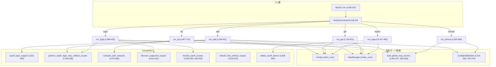
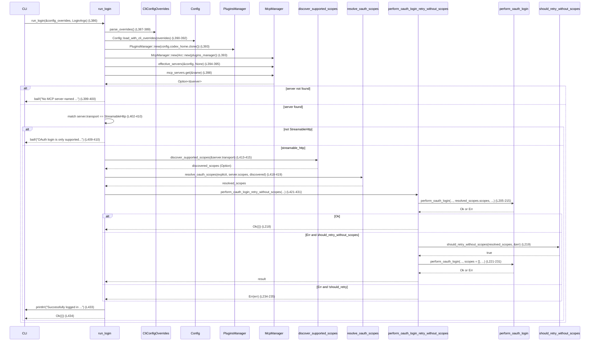

`cli/src/mcp_cmd.rs` モジュール解説レポート
---

## 0. ざっくり一言

MCP サーバーの CLI サブコマンド (`list`, `get`, `add`, `remove`, `login`, `logout`) を実装し、設定ファイルと OAuth 認証状態を操作・表示するモジュールです（`cli/src/mcp_cmd.rs` 全体）。

---

## 1. このモジュールの役割

### 1.1 概要

- このモジュールは **MCP サーバーの設定と OAuth 認証状態を CLI から管理する** ために存在し、以下の機能を提供します。
  - 設定済み MCP サーバーの一覧・詳細表示（JSON / 人間向けテキスト）  
  - MCP サーバーランチャー設定の追加・削除  
  - HTTP MCP サーバーに対する OAuth ログイン / ログアウト処理（トークンの保存・削除）

### 1.2 アーキテクチャ内での位置づけ

- 入力: clap による CLI 引数（`McpCli`, `McpSubcommand`, 各 `*Args` 構造体）  
- 設定・サーバー情報: `codex_core::config::Config`, `McpManager`, `load_global_mcp_servers` 経由  
- OAuth 関連: `codex_mcp`（スコープ解決等）、`codex_rmcp_client`（実際のログイン / トークン削除）  
- 出力: 標準出力に JSON / テキスト、設定ファイルの更新

主要依存関係を示します。



### 1.3 設計上のポイント

- サブコマンド分離  
  - `McpCli` + `McpSubcommand` でサブコマンドを enum としてまとめ、実装は `run_*` 関数群に分離（L158-187, L467-875）。
- 非同期処理  
  - 設定読込や OAuth 処理はすべて `async fn` で記述し、上位の `McpCli::run` から `await` で呼び出しています（L158-187）。
- エラー処理  
  - 外部公開 API 的には `anyhow::Result<()>` を返却し、`?` と `.context(...)`, `bail!`, `anyhow!` を組み合わせてメッセージ付きエラーを生成します（例: L243-245, L399-400, L459-462）。
- 名前・入力のバリデーション  
  - MCP サーバー名は `validate_server_name` で ASCII 英数字・`-`・`_` のみを許可（L892-902）。  
  - `parse_env_pair` で環境変数ペア `KEY=VALUE` フォーマットを検査（L877-890）。
- セキュリティ配慮  
  - HTTP ヘッダーの値は `run_get` で `*****` マスキング（L838-847）。  
  - `env_http_headers` ではヘッダー名と環境変数名のみ出力し、実際の値を出力しません（L851-863）。  
  - OAuth トークンの削除処理は `delete_oauth_tokens` に委譲し、結果のみ表示（L458-462）。
- 後方互換の OAuth 挙動  
  - `perform_oauth_login_retry_without_scopes` により、スコープ付きログインが失敗した場合に一度だけスコープなしで再試行します（L190-236）。

---

## 2. 主要な機能一覧

- MCP CLI エントリーポイント: `McpCli::run` — サブコマンドを実行（L158-187）
- MCP サーバー追加: `run_add` — `codex mcp add` の処理と、自動 OAuth ログイン（L238-351）
- MCP サーバー削除: `run_remove` — `codex mcp remove` の処理（L353-384）
- OAuth ログイン: `run_login` — `codex mcp login` の処理（スコープ解決 + ログイン実行）（L386-435）
- OAuth ログアウト: `run_logout` — `codex mcp logout` の処理（トークン削除）（L437-465）
- MCP サーバー一覧表示: `run_list` — `codex mcp list` で JSON or テキスト一覧（L467-714）
- MCP サーバー詳細表示: `run_get` — `codex mcp get` で 1 サーバーの詳細（L716-875）
- OAuth リトライ制御: `perform_oauth_login_retry_without_scopes` — スコープ付きログイン失敗時のリトライ制御（L190-236）
- 補助パーサ: `parse_env_pair` — `KEY=VALUE` 形式の環境変数指定をパース（L877-890）
- 名前バリデーション: `validate_server_name` — MCP サーバー名の形式検査（L892-902）
- 状態フォーマッタ: `format_mcp_status` — `enabled`/`disabled` 状態文字列の生成（L905-912）

---

## 3. 公開 API と詳細解説

### 3.1 型一覧（構造体・列挙体など）

| 名前 | 種別 | 役割 / 用途 | 定義位置 |
|------|------|-------------|----------|
| `McpCli` | 構造体 | `codex mcp` サブコマンド群のルート CLI 型。設定オーバーライドとサブコマンドを保持し、`run` で実行します。 | `cli/src/mcp_cmd.rs:L37-44` |
| `McpSubcommand` | enum | `list` / `get` / `add` / `remove` / `login` / `logout` の各サブコマンドを表現します。 | `cli/src/mcp_cmd.rs:L46-54` |
| `ListArgs` | 構造体 | `list` サブコマンドの引数（JSON 出力フラグ）を保持します。 | `cli/src/mcp_cmd.rs:L56-61` |
| `GetArgs` | 構造体 | `get` サブコマンドの引数（サーバー名と JSON フラグ）を保持します。 | `cli/src/mcp_cmd.rs:L63-71` |
| `AddArgs` | 構造体 | `add` サブコマンドの引数（サーバー名・トランスポート設定）を保持します。 | `cli/src/mcp_cmd.rs:L73-81` |
| `AddMcpTransportArgs` | 構造体 | `add` 時のトランスポート指定（stdio or streamable_http）をまとめるラッパ。clap の ArgGroup で `command` / `url` 排他的指定を表現します。 | `cli/src/mcp_cmd.rs:L83-98` |
| `AddMcpStdioArgs` | 構造体 | stdio MCP サーバーの起動コマンドと起動時環境変数を表します。 | `cli/src/mcp_cmd.rs:L100-118` |
| `AddMcpStreamableHttpArgs` | 構造体 | HTTP MCP サーバーの URL と、Bearer トークンを格納した環境変数名を表します。 | `cli/src/mcp_cmd.rs:L120-134` |
| `RemoveArgs` | 構造体 | `remove` サブコマンドの引数（サーバー名）を保持します。 | `cli/src/mcp_cmd.rs:L136-140` |
| `LoginArgs` | 構造体 | `login` サブコマンドの引数（サーバー名・スコープ一覧）を保持します。 | `cli/src/mcp_cmd.rs:L142-150` |
| `LogoutArgs` | 構造体 | `logout` サブコマンドの引数（サーバー名）を保持します。 | `cli/src/mcp_cmd.rs:L152-156` |

### 3.2 関数詳細（主要 7 件）

#### `impl McpCli { pub async fn run(self) -> Result<()> }`

**概要**

- `clap` で構築された `McpCli` インスタンスからサブコマンドを取り出し、対応する `run_*` 関数を非同期に実行するエントリーポイントです（L158-187）。

**引数**

| 引数名 | 型 | 説明 |
|--------|----|------|
| `self` | `McpCli` | CLI からパースされた引数一式（設定オーバーライドとサブコマンド）。 |

**戻り値**

- `Result<()>` (`anyhow::Result<()>`) — いずれかのサブコマンド実行中に発生したエラーをそのまま返します。全て成功すれば `Ok(())`（L186-187）。

**内部処理の流れ**

1. `self` を分解し、`config_overrides` と `subcommand` を取り出す（L160-163）。
2. `match subcommand` でパターンマッチし、各バリアントごとに対応する関数を `await` する（L165-183）。
   - 例: `McpSubcommand::List(args)` → `run_list(&config_overrides, args).await?;`（L166-168）。
3. すべての処理が成功した後 `Ok(())` を返す（L186-187）。

**Examples（使用例）**

`main.rs` 側からの想定利用例です（簡略化、実コードでは `clap::Parser` 派生を使用）。

```rust
use clap::Parser;

#[tokio::main]
async fn main() -> anyhow::Result<()> {
    // コマンドライン引数から McpCli を構築
    let cli = McpCli::parse();          // cli/src/mcp_cmd.rs の McpCli (L37-44)

    // 対応するサブコマンドを実行
    cli.run().await
}
```

**Errors / Panics**

- `run_*` 系関数が返す `Err` をそのまま伝播します。例:
  - 設定ファイルの読込失敗（`Config::load_with_cli_overrides` 内、L243-245 など）。
  - 不正なサーバー名（`validate_server_name`, L892-902）。
  - 存在しないサーバー名を指定した場合の `bail!`（L399-400, 727-728 など）。
- `panic!` を直接呼ぶコードはこの関数内にはありません。

**Edge cases（エッジケース）**

- サブコマンドが 1 つも選ばれていない状態は `clap` が許容しない前提のため、本関数には「サブコマンドなし」の分岐はありません。

**使用上の注意点**

- この関数自体は非同期関数のため、`tokio` などのランタイム上で `await` する必要があります。
- `McpCli` は通常 `clap::Parser` から生成される想定です（L37 の derive 属性）。

---

#### `async fn run_add(config_overrides: &CliConfigOverrides, add_args: AddArgs) -> Result<()>`

**概要**

- `codex mcp add` サブコマンドのコアロジックです。  
  MCP サーバー設定を `~/.codex/config.toml` に追加し、可能であれば自動的に OAuth ログインまで実行します（L238-351）。

**引数**

| 引数名 | 型 | 説明 |
|--------|----|------|
| `config_overrides` | `&CliConfigOverrides` | CLI で渡された設定オーバーライド（実際には値を読み込むだけで、この関数では書き換えない）（L238-245）。 |
| `add_args` | `AddArgs` | 追加する MCP サーバーの名前とトランスポート指定（L247-250）。 |

**戻り値**

- `Result<()>` — 追加処理・設定ファイル書き込み・OAuth ログインのいずれかで失敗すると `Err` を返します。

**内部処理の流れ**

1. 設定オーバーライドのバリデーション:  
   `config_overrides.parse_overrides()` でオーバーライドを読み取り、`Config::load_with_cli_overrides` を通じて設定をロード（L240-245）。
2. 引数展開 & サーバー名の検証:  
   `AddArgs { name, transport_args } = add_args;`（L247-250）  
   `validate_server_name(&name)?;` で名前形式を検証（L252-252）。
3. `codex_home` と既存サーバー設定のロード（L254-257）。
4. トランスポート設定の構築（L259-296）:
   - `stdio` が指定されている場合:
     - `command` ベクタから先頭要素をバイナリ、それ以降を引数として分離（L263-267）。
     - `env` を `HashMap` に変換し、`McpServerTransportConfig::Stdio` を生成（L269-280）。
   - `streamable_http` が指定されている場合:
     - `McpServerTransportConfig::StreamableHttp` を構築し、`http_headers` 等は `None` で初期化（L283-294）。
   - それ以外（両方/どちらも指定されていない）なら `bail!`（L295-295）。
5. `McpServerConfig` を組み立てて `servers` に挿入（L298-312）。
6. `ConfigEditsBuilder` で設定ファイルに書き戻し（L314-318）。
7. 成功メッセージを出力（L320-320）。
8. 追加したトランスポートの OAuth サポート確認（L322-348）:
   - `oauth_login_support(&transport).await` でサポート状況を取得。
   - `Supported` の場合:
     - `resolve_oauth_scopes` でスコープを解決し（L325-329）、
     - `perform_oauth_login_retry_without_scopes` でログイン試行（L330-341）。
   - `Unknown(_)` の場合は、手動ログインコマンドの案内を出力（L345-347）。
9. すべて成功すれば `Ok(())`（L350-350）。

**Examples（使用例）**

CLI から:

```bash
# stdio MCP サーバーを追加
codex mcp add my-tool -- my-server-binary --flag1 value1

# HTTP MCP サーバーを追加
codex mcp add my-http-tool --url https://example.com/mcp
```

プログラムから直接呼び出す簡易例:

```rust
let overrides = CliConfigOverrides::default(); // 仮
let args = AddArgs {
    name: "my-tool".to_string(),
    transport_args: AddMcpTransportArgs {
        stdio: Some(AddMcpStdioArgs {
            command: vec!["my-binary".into()],
            env: vec![],
        }),
        streamable_http: None,
    },
};

run_add(&overrides, args).await?;
```

**Errors / Panics**

- 設定ロード失敗: `Config::load_with_cli_overrides` が `Err` を返す（L243-245）。
- 不正なサーバー名: `validate_server_name` で `bail!`（L252, 892-902）。
- `--command`/`--url` の指定不整合: `AddMcpTransportArgs { .. } => bail!(...)`（L295）。
- コマンド未指定: `command` ベクタが空の場合、`ok_or_else(|| anyhow!("command is required"))?;`（L263-267）。
- 設定ファイル書き込み失敗: `ConfigEditsBuilder::apply().await` がエラーの場合（L314-318）。
- OAuth ログインの失敗: `perform_oauth_login_retry_without_scopes` 内での `Err` がそのまま伝播（L330-341）。

**Edge cases（エッジケース）**

- `stdio.env` が空の場合、`env` フィールドは `None` になる（L269-273）。
- streamable_http で `bearer_token_env_var` が `None` の場合も許可（L283-293）。
- OAuth サポート `Unknown` の場合はログインは実行されず、ユーザーへの案内だけが出力されます（L345-347）。

**使用上の注意点**

- `AddMcpTransportArgs` の clap 設定により、`--url` か `-- <COMMAND>...` のどちらか一方だけを指定する想定です（L83-91）。
- `stdout`/`stderr` の扱いなど、実際の MCP サーバーとのプロトコル互換性はこの関数では検証していません。  
- OAuth 自動ログインに失敗した後もサーバーエントリは追加されたままです。ログインだけ後で `codex mcp login` で再実行できる設計です（L345-347）。

---

#### `async fn perform_oauth_login_retry_without_scopes(...) -> Result<()>`

**概要**

- OAuth プロバイダがスコープ付きのログイン要求を拒否した場合に、**一度だけスコープなしで再試行** するラッパ関数です（L190-236）。

**引数（抜粋）**

| 引数名 | 型 | 説明 |
|--------|----|------|
| `name` | `&str` | MCP サーバー名（ログイン対象サーバー）（L195）。 |
| `url` | `&str` | OAuth エンドポイント URL（L196）。 |
| `store_mode` | `OAuthCredentialsStoreMode` | OAuth 資格情報の保存モード（L197）。 |
| `http_headers` | `Option<HashMap<String, String>>` | 追加 HTTP ヘッダー（L198）。 |
| `env_http_headers` | `Option<HashMap<String, String>>` | 環境変数由来の HTTP ヘッダー指定（L199）。 |
| `resolved_scopes` | `&ResolvedMcpOAuthScopes` | 既に解決済みのスコープ情報（L200-201）。 |
| `oauth_resource` | `Option<&str>` | リソースパラメータ（あれば）（L201）。 |
| `callback_port` | `Option<u16>` | ローカルコールバックポート（L202）。 |
| `callback_url` | `Option<&str>` | コールバック URL（L203）。 |

**戻り値**

- `Result<()>` — いずれのログイン試行も失敗した場合 `Err` を返します。

**内部処理の流れ**

1. `perform_oauth_login` を、`resolved_scopes.scopes` をスコープとして 1 回実行（L205-215）。
2. 結果に応じて分岐（L218-235）:
   - `Ok(())` の場合: そのまま `Ok(())`（L218）。
   - `Err(err)` かつ `should_retry_without_scopes(resolved_scopes, &err)` が `true` の場合（L219）:
     - メッセージを表示（L220）。
     - スコープ引数を `&[]` にして `perform_oauth_login` を再度実行（L221-231）。
   - それ以外の `Err` の場合: エラーをそのまま返す（L234-235）。

**Examples（使用例）**

この関数はモジュール内で `run_add` および `run_login` から呼び出されています（L330-341, 421-431）。

**Errors / Panics**

- 1 回目・2 回目の `perform_oauth_login` が返す `Err` をそのまま返します（L205-215, L221-233）。
- `panic!` を発生させるコードはありません。

**Edge cases**

- `resolved_scopes.scopes` が空の場合、最初のログインはすでにスコープなしで実行されるため、`should_retry_without_scopes` の条件次第では再試行しない可能性があります（`should_retry_without_scopes` の中身はこのチャンクでは不明）。
- `http_headers` と `env_http_headers` は `clone` した値と、所有権を移動する値の両方を利用しています（L209-210, L225-226）。  
  1 回目の呼び出しには `clone` を渡し、2 回目には元の `Option<HashMap<_, _>>` を渡すようになっています。

**使用上の注意点**

- `should_retry_without_scopes` の判定ロジックは `ResolvedMcpOAuthScopes` とエラー内容に依存するため、再試行が行われる条件は外部実装次第です（L219-220）。
- スコープなしでの再試行はセキュリティ要件として緩和される可能性があるため、サーバー側がそれをどう扱うかに注意が必要です（コードからはサーバー側の挙動は不明）。

---

#### `async fn run_login(config_overrides: &CliConfigOverrides, login_args: LoginArgs) -> Result<()>`

**概要**

- `codex mcp login <NAME> [--scopes scope1,scope2,...]` を実装する関数です。  
  有効な MCP サーバー設定を取得し、スコープを解決した上で OAuth ログイン処理を実行します（L386-435）。

**引数**

| 引数名 | 型 | 説明 |
|--------|----|------|
| `config_overrides` | `&CliConfigOverrides` | 設定オーバーライド。`Config` のロードに使用します（L387-393）。 |
| `login_args` | `LoginArgs` | サーバー名とスコープ指定（L396-400）。 |

**戻り値**

- `Result<()>` — 設定取得やログインに失敗した場合 `Err`。

**内部処理の流れ**

1. 設定オーバーライドから `Config` をロード（L387-392）。
2. `McpManager::new` と `effective_servers` で有効なサーバー一覧を取得（L393-395）。
3. `LoginArgs` から `name` と `scopes` を取り出し（L396-396）、対象サーバーを `mcp_servers.get(&name)` で検索（L398-400）。
   - 存在しなければ `bail!("No MCP server named '{name}' found.")`（L398-400）。
4. 対象サーバーが HTTP (`StreamableHttp`) であることを確認し、`url`, `http_headers`, `env_http_headers` を抽出（L402-410）。
   - それ以外の transport の場合は `bail!("OAuth login is only supported for streamable HTTP servers.")`（L409-410）。
5. スコープ決定（L412-419）:
   - 明示スコープ: `scopes` ベクタが非空なら `Some(scopes)` として `explicit_scopes` に（L412）。
   - 自動検出: `explicit_scopes` も `server.scopes` も `None` のときに `discover_supported_scopes` で検出（L413-417）。
   - `resolve_oauth_scopes` で最終的なスコープ集合を決定（L418-419）。
6. `perform_oauth_login_retry_without_scopes` を呼び出し、OAuth ログインを実行（L421-431）。
7. 成功メッセージを出力し `Ok(())` を返す（L433-434）。

**Examples（使用例）**

CLI から:

```bash
# サーバー my-http-tool に対してスコープ自動検出付きでログイン
codex mcp login my-http-tool

# 明示スコープを指定してログイン
codex mcp login my-http-tool --scopes "profile,email"
```

**Errors / Panics**

- 設定ロード・McpManager 初期化時のエラー（L387-393）。
- 不明なサーバー名: `bail!("No MCP server named '{name}' found.")`（L398-400）。
- 非 HTTP サーバーでログインを試みた場合: `bail!("OAuth login is only supported for streamable HTTP servers.")`（L402-410）。
- スコープ検出 (`discover_supported_scopes`) や OAuth ログイン (`perform_oauth_login_retry_without_scopes`) の失敗時はそのまま `Err` が返されます（L413-417, 421-431）。

**Edge cases**

- 明示スコープ指定がある場合、`discover_supported_scopes` は呼ばれません（L412-417）。
- サーバー設定に `server.scopes` がある場合、明示スコープがなければそれが優先される形で `resolve_oauth_scopes` に渡されます（L418-419）。
- `discover_supported_scopes` の戻り値が `None` の場合でも `resolve_oauth_scopes` の内部ロジックに従ってスコープが決定されます（詳細はこのチャンクには現れません）。

**使用上の注意点**

- `run_login` は、`run_add` で自動ログインに失敗したあとに、明示的にログインを行う用途も想定されています（`run_add` のメッセージ L345-347）。
- `StreamableHttp` 以外のサーバーに対してはログインできません。stdio サーバーでの OAuth は想定されていません（L402-410）。

---

#### `async fn run_logout(config_overrides: &CliConfigOverrides, logout_args: LogoutArgs) -> Result<()>`

**概要**

- `codex mcp logout <NAME>` を実装し、保存されている OAuth トークンを削除する処理です（L437-465）。

**引数**

| 引数名 | 型 | 説明 |
|--------|----|------|
| `config_overrides` | `&CliConfigOverrides` | 設定オーバーライド。`Config` のロードに使用（L438-443）。 |
| `logout_args` | `LogoutArgs` | ログアウト対象のサーバー名（L447-451）。 |

**戻り値**

- `Result<()>` — 成功時は `Ok(())`。トークン削除失敗時は `Err`。

**内部処理の流れ**

1. 設定オーバーライドから `Config` をロード（L438-443）。
2. `McpManager` から `mcp_servers` を取得（L444-445）。
3. 対象サーバーを取得。存在しない場合、`anyhow!("No MCP server named '{name}' found in configuration.")` で `Err` を生成（L449-451）。
4. サーバーの transport が `StreamableHttp` であることを確認し、`url` を抽出（L453-455）。
   - それ以外の場合は `bail!("OAuth logout is only supported for streamable_http transports.")`（L455）。
5. `delete_oauth_tokens(&name, &url, config.mcp_oauth_credentials_store_mode)` を呼び出し、結果に応じてメッセージ出力（L458-461）。
   - `Ok(true)` → 「Removed OAuth credentials for ...」。
   - `Ok(false)` → 「No OAuth credentials stored for ...」。
   - `Err(err)` → `anyhow!("failed to delete OAuth credentials: {err}")` として `Err` を返す（L461）。

**Examples（使用例）**

```bash
# HTTP MCP サーバー my-http-tool のトークンを削除
codex mcp logout my-http-tool
```

**Errors / Panics**

- 不明なサーバー名: `anyhow!("No MCP server named '{name}' found in configuration.")`（L449-451）。
- 非 HTTP サーバーでログアウトを試みた場合: `bail!("OAuth logout is only supported for streamable_http transports.")`（L453-456）。
- `delete_oauth_tokens` の失敗: `anyhow!("failed to delete OAuth credentials: {err}")` としてラップされます（L458-462）。

**Edge cases**

- トークンが保存されていない場合は `Ok(false)` が返り、ユーザーには「No OAuth credentials stored for '{name}'」と表示されます（L460-461）。
- `delete_oauth_tokens` 自体の動作（どこに保存されているか、どのようなフォーマットか）はこのチャンクからは分かりません。

**使用上の注意点**

- `run_logout` は設定ファイルの内容を変更しません。あくまで認証トークンの保存領域のみ操作します（L458-462）。
- `StreamableHttp` 以外のサーバーには適用できません（L453-456）。

---

#### `async fn run_list(config_overrides: &CliConfigOverrides, list_args: ListArgs) -> Result<()>`

**概要**

- `codex mcp list [--json]` の実装です。  
  MCP サーバー一覧を取得し、JSON または整形テキストの一覧を標準出力に表示します（L467-714）。

**引数**

| 引数名 | 型 | 説明 |
|--------|----|------|
| `config_overrides` | `&CliConfigOverrides` | 設定オーバーライド（L468-473）。 |
| `list_args` | `ListArgs` | JSON 出力フラグ `json: bool`（L56-61, 482）。 |

**戻り値**

- `Result<()>` — 一覧の取得やシリアライズに失敗した場合 `Err`。

**内部処理の流れ**

1. 設定ロードと `McpManager` 初期化（L468-475）。
2. 有効な MCP サーバー (`mcp_servers`) を取得し、`entries` にソート済みペアとして格納（L477-478）。
3. `compute_auth_statuses` で OAuth 認証状態一覧を計算（L479-480）。
4. `list_args.json` が `true` の場合（L482-539）:
   - 各サーバーごとに:
     - transport を JSON オブジェクトに変換（`stdio` / `streamable_http` 分岐、L490-519）。
     - `auth_status` を `auth_statuses` から取得し、JSON に含める（L486-489, 521-533）。
   - `serde_json::to_string_pretty` で整形し、出力（L536-537）。
5. JSON でない場合（L541 以降）:
   - サーバーが 0 件なら案内文を表示（L541-543）。
   - `stdio_rows` / `http_rows` に分けて行を構築（L546-605）。
   - `stdio_rows` が非空なら列幅を計算し、ヘッダー + 各行を整形表示（L609-662）。
   - 両方にエントリがある場合、空行で区切る（L664-666）。
   - `http_rows` が非空なら同様にヘッダー + 各行を表示（L668-711）。
6. 最後に `Ok(())`（L713-713）。

**Examples（使用例）**

```bash
# テキスト一覧
codex mcp list

# JSON 出力
codex mcp list --json
```

**Errors / Panics**

- 設定ロード・サーバー列挙・JSON シリアライズでエラーが起きる場合に `Err` を返します（L468-480, 536-537）。
- `panic!` は使用していません。

**Edge cases**

- サーバー 0 件時: 「No MCP servers configured yet. Try `codex mcp add my-tool -- my-command`.」と案内して終了（L541-543）。
- `env` や `cwd` が未設定/空の場合は `"-"` 表示になります（L563-569）。
- 認証状態が `auth_statuses` に存在しない場合は `McpAuthStatus::Unsupported` をデフォルトとします（L486-489, 570-574, 591-595）。

**使用上の注意点**

- テキストモードの出力は列幅計算により整形されますが、非等幅フォント環境では若干ずれる可能性があります（L609-641, 669-694）。
- JSON 出力はスクリプトからのパース向けに安定構造を提供しますが、フィールド追加などの後方互換性はコードからは保証されていません。

---

#### `async fn run_get(config_overrides: &CliConfigOverrides, get_args: GetArgs) -> Result<()>`

**概要**

- `codex mcp get <NAME> [--json]` の実装です。  
  指定された MCP サーバーの設定を JSON あるいは人間向けテキストとして表示します（L716-875）。

**引数**

| 引数名 | 型 | 説明 |
|--------|----|------|
| `config_overrides` | `&CliConfigOverrides` | 設定オーバーライド（L717-723）。 |
| `get_args` | `GetArgs` | サーバー名と JSON フラグ（L726-727, L63-71）。 |

**戻り値**

- `Result<()>` — サーバーが存在しない・設定ロード失敗などで `Err`。

**内部処理の流れ**

1. 設定ロードと `McpManager` 初期化（L717-724）。
2. `mcp_servers.get(&get_args.name)` で対象サーバーを取得。なければ `bail!`（L726-728）。
3. `get_args.json` が `true` の場合（L730-775）:
   - transport を JSON オブジェクトに変換（L731-758）。
   - サーバーのその他属性（enabled, disabled_reason, enabled_tools など）を含む JSON を生成し、プレティプリントで出力（L759-773）。
4. JSON でない場合（L777 以降）:
   - サーバーが disabled の場合: 理由付き/なしで `"<name> (disabled: <reason>)"` を表示して終了（L777-783）。
   - enabled の場合:
     - 名前・enabled 状態を表示（L786-787）。
     - `enabled_tools` / `disabled_tools` が `Some` のときだけ一覧を表示。`None` は表示しない（L788-802）。
     - transport ごとの詳細:
       - `stdio`: コマンド、引数、cwd、環境変数を表示（L803-826）。
       - `streamable_http`: URL、Bearer トークン環境変数名、HTTP ヘッダー（値は `*****` マスク）、`env_http_headers`（ヘッダー名=環境変数名）を表示（L828-863）。
     - `startup_timeout_sec` / `tool_timeout_sec` があれば秒数を f64 として表示（L866-871）。
     - 最後に削除コマンドの案内 `remove: codex mcp remove <name>` を表示（L872-872）。
5. 最後に `Ok(())`（L874-874）。

**Examples（使用例）**

```bash
# テキスト表示
codex mcp get my-tool

# JSON 表示
codex mcp get my-tool --json
```

**Errors / Panics**

- 不明なサーバー名: `bail!("No MCP server named '{name}' found.", name = get_args.name);`（L726-728）。
- JSON シリアライズに失敗した場合 `Err`（L759-773）。

**Edge cases**

- disabled かつ `disabled_reason` が `None` の場合でも `(disabled)` だけ表示されます（L777-783）。
- `enabled_tools` / `disabled_tools` が `Some([])`（空リスト）の場合は `"[]"` と表示されますが、`None` のときは行自体が出力されません（L788-802）。
- HTTP ヘッダー値は `*****` にマスクされるため、機密情報がコンソールに出ないようになっています（L838-847）。

**使用上の注意点**

- JSON 出力はテンプレートとして設定のバックアップ・復元に利用できますが、`McpServerConfig` と完全一致する形式ではない可能性があります（例: timeout は秒数 f64 に変換されています、L766-771）。
- `env_http_headers` ではヘッダー名と環境変数名だけが表示されるため、値は別途環境変数を参照する必要があります（L851-863）。

---

#### `async fn run_remove(config_overrides: &CliConfigOverrides, remove_args: RemoveArgs) -> Result<()>`

**概要**

- `codex mcp remove <NAME>` を実装し、グローバル MCP サーバー設定から指定されたエントリを削除します（L353-384）。

**簡易説明**

- 設定オーバーライドの検証 → サーバー名バリデーション → `load_global_mcp_servers` でロード → `servers.remove(&name)` → 必要なら `ConfigEditsBuilder` で書き戻し → 結果メッセージ出力という流れです（L353-383）。
- サーバー名が見つからない場合でもエラーにはせず、「No MCP server named '{name}' found.」と表示して `Ok(())` を返します（L377-381）。

（詳細なテンプレート展開は割愛し、「その他の関数」で扱う想定でしたが、ユーザーの関心が高い場合は追加説明可能です。）

---

### 3.3 その他の関数

| 関数名 | 役割（1 行） | 定義位置 |
|--------|--------------|----------|
| `run_remove` | グローバル MCP サーバー設定から指定名のエントリを削除し、あれば設定ファイルを更新します。 | `cli/src/mcp_cmd.rs:L353-384` |
| `parse_env_pair` | 文字列 `KEY=VALUE` を `(String, String)` にパースし、形式違反時にはエラーメッセージ文字列を返します。clap の `value_parser` として利用されます。 | `cli/src/mcp_cmd.rs:L877-890` |
| `validate_server_name` | サーバー名が空でなく、ASCII 英数字と `-` / `_` のみから成ることを検証します。違反時は `bail!` で `Err` を返します。 | `cli/src/mcp_cmd.rs:L892-902` |
| `format_mcp_status` | `McpServerConfig` の `enabled` / `disabled_reason` から `"enabled"` や `"disabled: <reason>"` といった状態文字列を生成します。 | `cli/src/mcp_cmd.rs:L905-912` |

---

## 4. データフロー

ここでは代表的な 2 つのフローを示します。

### 4.1 `codex mcp list` のデータフロー（`run_list` L467-714）

`run_list` での処理の流れをシーケンス図にします。

```mermaid
sequenceDiagram
    %% run_list (L467-714)
    participant CLI as CLI呼び出し
    participant RL as run_list
    participant CO as CliConfigOverrides
    participant CFG as Config
    participant PM as PluginsManager
    participant MM as McpManager
    participant CS as compute_auth_statuses

    CLI->>RL: run_list(&config_overrides, list_args)
    RL->>CO: parse_overrides() (L468-471)
    CO-->>RL: overrides or Err
    RL->>CFG: Config::load_with_cli_overrides(overrides) (L471-473)
    CFG-->>RL: config
    RL->>PM: PluginsManager::new(config.codex_home.clone()) (L474)
    PM-->>RL: plugins_manager
    RL->>MM: McpManager::new(Arc::new(plugins_manager)) (L474)
    MM-->>RL: mcp_manager
    RL->>MM: effective_servers(&config, None) (L475)
    MM-->>RL: mcp_servers
    RL->>RL: entries = mcp_servers.iter().collect() (L477)
    RL->>RL: sort entries by name (L478)
    RL->>CS: compute_auth_statuses(mcp_servers.iter(), store_mode) (L479-480)
    CS-->>RL: auth_statuses

    alt list_args.json == true
        RL->>RL: build json_entries Vec<serde_json::Value> (L483-535)
        RL->>RL: serde_json::to_string_pretty(json_entries) (L536)
        RL->>CLI: println!(output) (L537)
    else
        RL->>RL: if entries.is_empty() { println!(案内); return } (L541-544)
        RL->>RL: build stdio_rows / http_rows (L546-605)
        RL->>CLI: print stdio table if any (L609-662)
        RL->>CLI: print http table if any (L668-711)
    end

    RL-->>CLI: Ok(()) (L713)
```

### 4.2 `codex mcp login` のデータフロー（`run_login` & `perform_oauth_login_retry_without_scopes`）



---

## 5. 使い方（How to Use）

### 5.1 基本的な使用方法

典型的には、別のファイルの `main` から `McpCli` を利用して CLI を構築します。

```rust
use clap::Parser;                     // clap derive を利用
use cli::mcp_cmd::McpCli;            // このモジュールの McpCli (パスはプロジェクト構成に依存)

#[tokio::main]
async fn main() -> anyhow::Result<()> {
    // コマンドライン引数をパースして McpCli を構築 (L37-44)
    let cli = McpCli::parse();

    // 対応するサブコマンドを実行 (L158-187)
    cli.run().await
}
```

CLI としての主なコマンド例:

```bash
# サーバー追加（stdio）
codex mcp add my-tool -- my-binary --arg1 value

# サーバー追加（HTTP）
codex mcp add my-http --url https://example.com/mcp

# 一覧表示
codex mcp list
codex mcp list --json

# 詳細表示
codex mcp get my-tool
codex mcp get my-tool --json

# OAuth ログイン / ログアウト
codex mcp login my-http --scopes "scope1,scope2"
codex mcp logout my-http

# サーバー削除
codex mcp remove my-tool
```

### 5.2 よくある使用パターン

- **設定だけ先に追加し、あとでログイン**  
  - `run_add` が OAuth サポート `Unknown` と判断した場合、`codex mcp login <NAME>` を手動で実行するのが自然です（L345-347, L386-435）。
- **JSON モードで機械処理**  
  - `list --json` と `get --json` を組み合わせて、外部ツールから MCP 設定を検査・編集する際に使うことが想定されます（L482-539, L730-775）。

### 5.3 よくある間違い

```rust
// 間違い例: validate_server_name を通さずに任意の名前で設定を挿入する
// （このモジュール外から直接 Config を書き換えるなど）
let name = "invalid name with spaces";
// ここで ConfigEditsBuilder を直接使って追加してしまうと、
// CLI のほかの箇所で期待される名前制約と不整合が生じる可能性があります。

// 正しい例: run_add 経由で追加し、validate_server_name を通す
let args = AddArgs {
    name: "valid_name-123".into(),
    transport_args: /* ... */,
};
run_add(&overrides, args).await?;
```

```bash
# 間違い例: stdio サーバーに対して login しようとする
codex mcp add my-stdio -- my-binary
codex mcp login my-stdio     # → "OAuth login is only supported for streamable HTTP servers." (L409-410)

# 正しい例: HTTP サーバーに対してのみ login を実行
codex mcp add my-http --url https://example.com/mcp
codex mcp login my-http
```

### 5.4 使用上の注意点（まとめ）

- サーバー名は `validate_server_name` の制約（非空 & ASCII 英数字 + `-` / `_`）を満たす必要があります（L892-902）。
- OAuth ログイン/ログアウトは `StreamableHttp` トランスポートにのみ対応しています（L402-410, 453-456）。
- HTTP ヘッダー値やトークンは一部マスクされて表示されるため、デバッグ時に実際の値を確認したい場合は、別手段で環境変数・設定ファイルを確認する必要があります（L838-847, 851-863）。
- 設定ファイルの I/O は非同期で行われるため、`tokio` 等のランタイム内でこれらの関数を呼び出す必要があります（`async fn` であるすべての `run_*` 関数）。

---

## 6. 変更の仕方（How to Modify）

### 6.1 新しい機能を追加する場合（例: 新サブコマンド）

1. `McpSubcommand` に新しいバリアントと対応する `Args` 構造体を追加します（L46-54 付近）。
2. `McpCli::run` の `match` に新しいバリアントの分岐を追加し、新しい `run_*` 関数を呼び出します（L165-183）。
3. 新 `run_*` 関数では、既存のパターン（`run_list` / `run_get` 等）に倣って:
   - 設定ロード (`Config::load_with_cli_overrides`)  
   - `McpManager` 初期化 (`PluginsManager::new`, `McpManager::new`)  
   - 必要な処理とエラー伝播（`?`, `.context(...)`, `bail!`）  
   を行うと一貫性を保ちやすくなります。

### 6.2 既存の機能を変更する場合の注意点

- **前提条件・契約の確認**
  - `validate_server_name` の仕様を変えると、既存の設定ファイルに保存されている名前との整合性に影響します（L892-902）。
  - OAuth 関連の関数 (`perform_oauth_login_retry_without_scopes`, `run_login`, `run_logout`) は、`StreamableHttp` 以外を拒否するという前提で他コードが依存している可能性があります（L402-410, 453-456）。
- **エラー文言の変更**
  - `bail!` / `anyhow!` のメッセージは CLI ユーザーに直接表示されます。変更するとスクリプトによるエラー文字列依存ロジックに影響する可能性があります（例: L399-400, 409-410）。
- **I/O やパフォーマンス**
  - `run_list` は `mcp_servers.iter()` 全体に対して `compute_auth_statuses` を呼びます（L479-480）。サーバー数が増えた場合のパフォーマンスはこの関数に依存します（このチャンクには中身はありません）。
- **テキストフォーマット**
  - `run_list` のテーブル整形ロジックは列幅計算を前提としているため、列追加・削除時には幅配列 `widths` のサイズやインデックスを忘れずに更新する必要があります（L609-641, 669-694）。

---

## 7. 関連ファイル

| パス / モジュール | 役割 / 関係 |
|-------------------|------------|
| `codex_core::config::Config` | CLI 設定をロードする中心的な設定型。`run_add`, `run_list`, `run_get`, `run_login`, `run_logout` で利用されています（例: L243-245, L471-473, L390-392）。 |
| `codex_core::config::edit::ConfigEditsBuilder` | MCP サーバー設定の追加・削除後に、`~/.codex/config.toml` 等へ変更を書き戻すために使用されます（L314-318, L370-374）。 |
| `codex_core::config::{find_codex_home, load_global_mcp_servers}` | Codex ホームディレクトリとグローバルな MCP サーバー設定のロードに使用。`run_add`, `run_remove` で利用されます（L254-257, L362-365）。 |
| `codex_core::McpManager` | 有効 MCP サーバーの集約と解決を行う管理器。`run_list`, `run_get`, `run_login`, `run_logout` で利用されます（L393-395, L474-475, L723-725）。 |
| `codex_core::plugins::PluginsManager` | `McpManager` 構築時に必要なプラグイン管理を担う型です（L393-394, L474-474, L723-723）。 |
| `codex_mcp::{oauth_login_support, resolve_oauth_scopes, discover_supported_scopes, compute_auth_statuses, should_retry_without_scopes, ResolvedMcpOAuthScopes, McpOAuthLoginSupport}` | MCP と OAuth に関するユーティリティ・設定型群。スコープ解決、OAuth サポート検出、認証状態計算、リトライ判定などを提供します（L17-23, L322-348, L418-419, L479-480, L219-220）。 |
| `codex_rmcp_client::{perform_oauth_login, delete_oauth_tokens}` | 実際の OAuth ログイン処理およびトークン削除処理を提供するクライアント API です（L25-26, L205-215, L221-231, L458-462）。 |
| `codex_utils_cli::{CliConfigOverrides, format_env_display}` | CLI 設定のオーバーライド機構と、環境変数の表示フォーマッタです。`format_env_display` は `.env` 表示時に利用されます（L27-28, L563-564, L825-826）。 |
| `codex_config::types::{McpServerConfig, McpServerTransportConfig}` | MCP サーバー設定本体とトランスポート設定の型。`run_add`, `run_list`, `run_get`, `format_mcp_status` 等で使用されています（L9-10, L259-296, L490-519, L731-758, L905-912）。 |

---

## 付記: バグ・セキュリティ・テスト・性能に関する観察（このチャンクから読み取れる範囲）

- **セキュリティ**
  - HTTP ヘッダー値は `run_get` で `*****` にマスクされており（L838-847）、コンソールに資格情報がそのまま出ないよう配慮されています。
  - `env_http_headers` では値ではなく環境変数名を表示することで、値の漏洩を避けています（L851-863）。
  - OAuth ログイン時にスコープなし再試行を行う点は、サーバー側の設定によっては意図しない権限でログインできる可能性もありますが、サーバー側の挙動はこのチャンクからは不明です（L219-231）。
- **契約 / エッジケース**
  - サーバー名のフォーマット制約（L892-902）、`AddMcpTransportArgs` の「exactly one of --command or --url」制約（L295）は、このファイルにおける外部契約の一部とみなせます。
- **テスト**
  - このファイル内にはテストコード（`#[test]` や `mod tests`）は存在しません。このため挙動の検証は他の場所のテストに依存していると推測されますが、どこでテストされているかはこのチャンクには現れません。
- **性能**
  - `run_list` ではサーバー数に比例して `compute_auth_statuses` と出力整形処理が走りますが、いずれも `for` ループベースで、特別な最適化や非同期並列化はされていません（L477-605）。  
    サーバー数が非常に多い場合のスケーラビリティは `compute_auth_statuses` の実装次第です（このチャンクには未掲載）。

以上が `cli/src/mcp_cmd.rs` の公開 API およびコアロジックの解説です。
