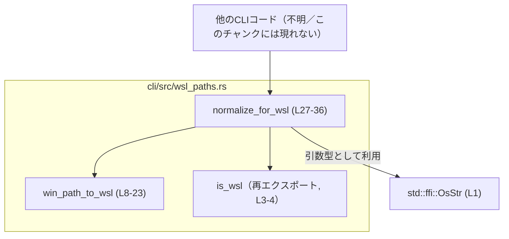
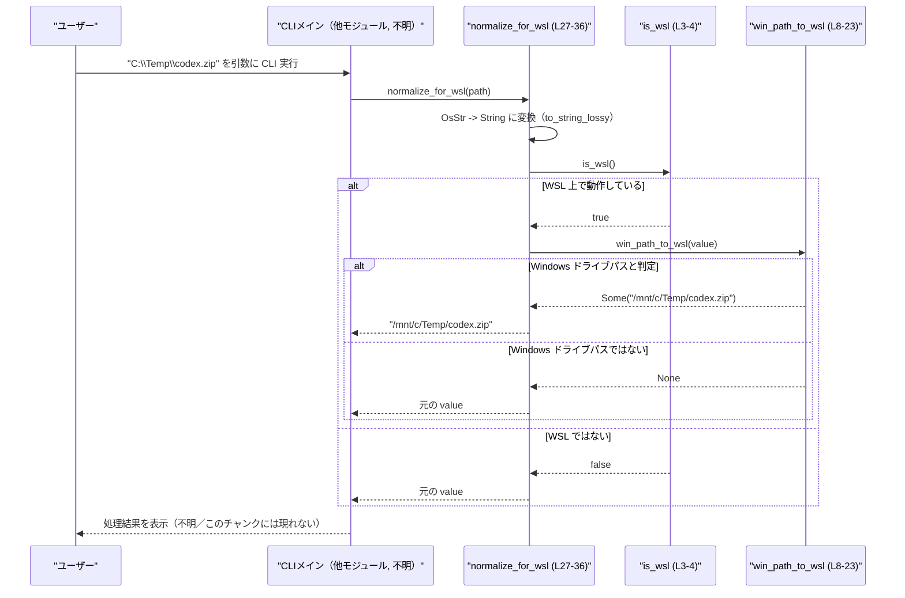

# cli/src/wsl_paths.rs

## 0. ざっくり一言

Windows 形式の絶対パス（`C:\foo\bar` / `C:/foo/bar`）を WSL の `/mnt/<drive>/...` 形式に変換し、WSL 上でのパス正規化を行う小さなユーティリティモジュールです（`cli/src/wsl_paths.rs:L6-7, L25-36`）。

---

## 1. このモジュールの役割

### 1.1 概要

- このモジュールは **WSL 上でのパス取り扱いの差異** を吸収するために存在し、以下の機能を提供します。
  - 現在プロセスが WSL 上で動作しているかどうかの判定（外部関数の再エクスポート）（`cli/src/wsl_paths.rs:L3-4`）
  - Windows ドライブパス（例: `C:\Temp\foo`）を WSL の `/mnt/<drive>/...` パスへ変換（`cli/src/wsl_paths.rs:L6-23`）
  - 「WSL なら Windows パスを `/mnt/...` に変換し、それ以外はそのまま返す」正規化関数（`cli/src/wsl_paths.rs:L25-36`）

### 1.2 アーキテクチャ内での位置づけ

このモジュール自身は stateless なユーティリティで、他の CLI コードから呼び出されることが想定されます。外部には `codex_utils_path::is_wsl` に依存し、標準ライブラリの `OsStr` を利用します（`cli/src/wsl_paths.rs:L1, L3-4, L27-28`）。

依存関係の概略を Mermaid 図で示します。



※ 他の CLI モジュールからの具体的な呼び出し箇所は、このチャンクには現れません。

### 1.3 設計上のポイント

- **状態を持たない純粋関数のみ**  
  すべての関数は入力文字列にだけ依存し、グローバル状態を変更しません（`cli/src/wsl_paths.rs:L8-23, L27-36`）。
- **環境判定は外部関数に委譲**  
  「WSL 上かどうか」の判定は `codex_utils_path::is_wsl` に委ね、このモジュールはその再エクスポートだけを提供します（`cli/src/wsl_paths.rs:L3-4`）。
- **ジェネリックなパス受け取り**  
  `normalize_for_wsl` は `AsRef<OsStr>` を受け取り、`&str`, `Path`, `OsString` など様々なパス表現を扱えるようにしています（`cli/src/wsl_paths.rs:L27`）。
- **エラーは `Option` で表現**  
  `win_path_to_wsl` は「Windows ドライブパスに見えない」場合を `None` で明示的に表現し、パニックを起こさない方針になっています（`cli/src/wsl_paths.rs:L10-15`）。
- **スレッドセーフ**  
  共有可変状態や I/O を行わず、純粋な文字列処理だけなので、並行呼び出しに対しても問題はありません。

---

## 2. 主要な機能一覧

- `is_wsl`: 現在のプロセスが WSL 上で動作しているかどうかを返す関数の再エクスポート（`cli/src/wsl_paths.rs:L3-4`）
- `win_path_to_wsl`: Windows ドライブパスを WSL の `/mnt/<drive>/...` パスに変換する（`cli/src/wsl_paths.rs:L6-23`）
- `normalize_for_wsl`: 「WSL なら Windows パスを `/mnt/...` に変換し、そうでなければ元の文字列を返す」正規化処理（`cli/src/wsl_paths.rs:L25-36`）

---

## 3. 公開 API と詳細解説

### 3.1 コンポーネント一覧（関数インベントリー）

このモジュールは独自の構造体・列挙体は定義しておらず、関数のみを提供します。

| 名前 | 種別 | 公開 | 行番号 | 役割 / 用途 |
|------|------|------|--------|-------------|
| `is_wsl` | 関数（再エクスポート） | 公開 | `cli/src/wsl_paths.rs:L3-4` | 現在プロセスが WSL 上で動作しているかを返す外部関数を再エクスポートする |
| `win_path_to_wsl` | 関数 | 公開 | `cli/src/wsl_paths.rs:L6-23` | Windows ドライブパスを WSL の `/mnt/<drive>/...` に変換する |
| `normalize_for_wsl` | 関数（ジェネリック） | 公開 | `cli/src/wsl_paths.rs:L25-36` | WSL 環境であれば Windows パスを `/mnt/...` にマッピングし、そうでなければそのまま返す |
| `tests::win_to_wsl_basic` | テスト関数 | 非公開 | `cli/src/wsl_paths.rs:L42-53` | `win_path_to_wsl` の基本的な変換結果と非 Windows パスで `None` になることを検証する |
| `tests::normalize_is_noop_on_unix_paths` | テスト関数 | 非公開 | `cli/src/wsl_paths.rs:L55-57` | UNIX 風パスを渡したときに `normalize_for_wsl` が変更を加えないことを検証する |

以下では、主要な公開関数 2 つを詳しく解説します。

---

### 3.2 関数詳細

#### `win_path_to_wsl(path: &str) -> Option<String>`

**概要**

Windows のドライブ付き絶対パス（`C:\foo\bar` または `C:/foo/bar`）を、WSL のマウントパス `/mnt/<drive>/foo/bar` に変換します（`cli/src/wsl_paths.rs:L6-7, L17-22`）。  
入力が「ドライブレター + コロン + 区切り記号」の形式に見えない場合は `None` を返します（`cli/src/wsl_paths.rs:L10-15`）。

**引数**

| 引数名 | 型 | 説明 |
|--------|----|------|
| `path` | `&str` | 変換対象のパス文字列。Windows ドライブパスであることが期待されます。 |

**戻り値**

- `Option<String>`  
  - `Some(mapped)` : `/mnt/<drive>/...` 形式に変換された WSL パス（`cli/src/wsl_paths.rs:L19-22`）
  - `None` : `path` が Windows ドライブパスの形式に見えない場合（`cli/src/wsl_paths.rs:L10-15`）

**内部処理の流れ（アルゴリズム）**

1. `path` をバイト列として取得します（`cli/src/wsl_paths.rs:L9`）。
2. 次の条件を満たさない場合は早期に `None` を返します（`cli/src/wsl_paths.rs:L10-15`）。
   - 長さが 3 以上であること（`bytes.len() < 3` で否定）
   - 2 文字目が `:` であること（`bytes[1] != b':'`）
   - 3 文字目が `\` または `/` であること（`!(bytes[2] == b'\\' || bytes[2] == b'/')`）
   - 1 文字目が英字（ASCII アルファベット）であること（`!bytes[0].is_ascii_alphabetic()`）
3. 条件を満たしたら、ドライブレターを小文字化して取得します（`cli/src/wsl_paths.rs:L17`）。
4. `path` の 4 文字目以降を「パスの残り部分」として切り出し（`path[3..]`）、`'\'` を `'/'` に置き換えます（`cli/src/wsl_paths.rs:L18`）。
5. 残り部分（`tail`）が空文字列なら、ドライブのルートを表す `/mnt/<drive>` を返します（`cli/src/wsl_paths.rs:L19-21`）。
6. 残り部分がある場合は `/mnt/<drive>/<tail>` という文字列を組み立てて返します（`cli/src/wsl_paths.rs:L22`）。

**Examples（使用例）**

基本的な変換例です。テスト `win_to_wsl_basic` と同等の入力を使用しています（`cli/src/wsl_paths.rs:L42-51`）。

```rust
// Windows 形式のパスを WSL 形式に変換する例
fn example_win_path_to_wsl() {                                        // デモ用の関数定義
    let p1 = r"C:\Temp\codex.zip";                                   // Windows バックスラッシュ形式の絶対パス
    let mapped1 = win_path_to_wsl(p1).unwrap();                      // Option から変換結果を取り出す（失敗しない前提）

    assert_eq!(mapped1, "/mnt/c/Temp/codex.zip");                    // 期待される WSL パスと比較

    let p2 = "D:/Work/codex.tgz";                                    // スラッシュ区切りの Windows パス
    let mapped2 = win_path_to_wsl(p2).unwrap();                      // こちらも Some を期待

    assert_eq!(mapped2, "/mnt/d/Work/codex.tgz");                    // ドライブ文字が小文字化されていることを確認

    let not_win = "/home/user/codex";                                // Windows ドライブパスではない文字列
    assert!(win_path_to_wsl(not_win).is_none());                     // Windows パスに見えないので None になる
}
```

**Errors / Panics**

- パニック条件  
  - 添字アクセスは `bytes.len() < 3` を先にチェックした上で `bytes[1]`, `bytes[2]` を参照しているため（`cli/src/wsl_paths.rs:L10-15`）、このコードに限れば範囲外アクセスによるパニックは生じません。
  - `path[3..]` によるスライスも、先頭 3 バイトが必ず ASCII（ドライブレター + `:` + 区切り記号）であることをチェックしてから実行しているため（`cli/src/wsl_paths.rs:L10-14, L18`）、UTF-8 の境界を壊すことはありません。
- エラー値  
  - エラー状態はすべて `None` で表現されます。`Err` 型は返しません。

**Edge cases（エッジケース）**

- `path` が短すぎる（長さ < 3）  
  → `None` を返します（`cli/src/wsl_paths.rs:L10-15`）。
- `path` の 2 文字目が `:` でない（例: `"C/"`, `"C\"`）  
  → `None` を返します（`cli/src/wsl_paths.rs:L11, L15`）。
- `path` の 3 文字目が `\` または `/` でない（例: `"C:Temp"`）  
  → `None` を返します（`cli/src/wsl_paths.rs:L12, L15`）。
- 先頭文字が英字でない（例: `"1:\foo"`）  
  → `None` を返します（`cli/src/wsl_paths.rs:L13, L15`）。
- ドライブ直下のパス（例: `"C:\"`, `"C:/"`）  
  → 残り部分 `tail` が空になるので `/mnt/c` を返します（`cli/src/wsl_paths.rs:L18-21`）。
- バックスラッシュ混在パス（例: `"C:\\Temp\\foo"`）  
  → `tail` 内の `\` はすべて `/` に置き換えられます（`cli/src/wsl_paths.rs:L18`）。

**使用上の注意点**

- この関数は **純粋に文字列パターンだけ** を見て Windows パスかどうかを判定します。実際にファイルやディレクトリが存在するかは確認しません。
- UNC パス（例: `\\server\share\file`）やドライブレターを含まないパス（例: `"Temp\file"`）はサポートされておらず、`None` になります。
- セキュリティ上の観点からも、この関数は単にパスを変換するだけであり、権限チェックやパスの正規化（`..` の解決など）は行いません。そのような処理が必要な場合は別途行う必要があります。

---

#### `normalize_for_wsl<P: AsRef<OsStr>>(path: P) -> String`

**概要**

引数のパスを文字列化したうえで、  

- 現在が WSL 上 **でない場合**: そのまま文字列として返す  
- WSL 上 **であり**、かつ Windows ドライブパスに見える場合: `/mnt/<drive>/...` 形式に変換して返す  
- WSL 上 **だが** Windows ドライブパスに見えない場合: そのまま返す  

という振る舞いをします（`cli/src/wsl_paths.rs:L25-36`）。

**引数**

| 引数名 | 型 | 説明 |
|--------|----|------|
| `path` | `P: AsRef<OsStr>` | パスを表す値。`&str`, `Path`, `OsString` など `OsStr` への参照に変換できるものを渡せます（`cli/src/wsl_paths.rs:L27-28`）。 |

**戻り値**

- `String`  
  - 非 WSL 環境では、`path` を UTF-8 文字列化したものをそのまま返します（`cli/src/wsl_paths.rs:L28-31`）。
  - WSL 環境では、`win_path_to_wsl` で変換できれば変換後のパスを、できなければ元の文字列を返します（`cli/src/wsl_paths.rs:L32-35`）。

**内部処理の流れ（アルゴリズム）**

1. `path.as_ref().to_string_lossy().to_string()` により、`OsStr` を UTF-8 文字列に変換します（`cli/src/wsl_paths.rs:L28`）。  
   - 非 UTF-8 な部分がある場合、それらは `to_string_lossy` により Unicode の置換文字（`�`）などに変換されます。
2. `is_wsl()` を呼び出し、WSL 上で動作しているかどうかを判定します（`cli/src/wsl_paths.rs:L29`）。
   - `false` の場合、そのまま `value` を返して終了します（`cli/src/wsl_paths.rs:L29-31`）。
3. `true` の場合、`win_path_to_wsl(&value)` を呼び出して Windows ドライブパスかどうかを判定・変換します（`cli/src/wsl_paths.rs:L32`）。
4. 変換結果が `Some(mapped)` なら、その `mapped` を返します（`cli/src/wsl_paths.rs:L32-33`）。
5. `None`（Windows ドライブパスではない）なら、元の `value` を返します（`cli/src/wsl_paths.rs:L34-35`）。

**Examples（使用例）**

CLI の引数として受け取ったパスを正規化する典型的な例です。

```rust
use std::path::PathBuf;                                         // PathBuf 型を使うためのインポート

fn example_normalize_for_wsl() {                                // デモ用の関数定義
    let raw_path = PathBuf::from(r"C:\Temp\codex.zip");         // Windows 形式のパスを PathBuf として作成

    let normalized = normalize_for_wsl(&raw_path);              // WSL なら /mnt/c/... に変換し、それ以外ではそのまま文字列化

    // WSL 上では "/mnt/c/Temp/codex.zip" になることが期待される
    // WSL 以外（通常の Windows / Unix）では "C:\Temp\codex.zip" のような文字列がそのまま返る
    println!("normalized path = {}", normalized);               // 正規化結果を表示
}
```

UNIX 風パス（`/home/...`）に対しては、テストで「noop（無変更）」であることが確認されています（`cli/src/wsl_paths.rs:L55-57`）。

```rust
fn example_unix_path_noop() {                                   // デモ用の関数定義
    let unix_path = "/home/u/x";                                // UNIX 風パスの文字列

    let normalized = normalize_for_wsl(unix_path);              // Windows 形式ではないので、そのまま返ってくる

    assert_eq!(normalized, "/home/u/x");                        // テスト同様、変更されていないことを確認
}
```

**Errors / Panics**

- パニックを起こしうるような明示的な `unwrap` やインデックスアクセスはありません（`cli/src/wsl_paths.rs:L27-36`）。
- `to_string_lossy` は非 UTF-8 文字を置換しますが、パニックにはなりません。

**Edge cases（エッジケース）**

- 非 UTF-8 なパス  
  - `OsStr` に非 UTF-8 部分を含む場合、`to_string_lossy()` により一部が置換されます（`cli/src/wsl_paths.rs:L28`）。  
    → 返り値の `String` は OS の内部表現と完全には一致しない可能性があります。
- WSL 以外の環境  
  - 常に「文字列化しただけの `value`」を返します（`cli/src/wsl_paths.rs:L29-31`）。  
    Windows 上であっても WSL でなければ変換は行いません。
- WSL 上で、すでに UNIX 風のパス（例: `/home/user/file`）を渡した場合  
  - `win_path_to_wsl` が `None` を返すため、そのまま返却されます（`cli/src/wsl_paths.rs:L32-35`）。
- WSL 上で、Windows ドライブパスではないがコロンなどを含む特殊なパス  
  - 先頭 3 文字のパターンが Windows ドライブパスの条件を満たさない限り、変換されず、そのまま返ります。

**使用上の注意点**

- この関数は「**WSL 上かどうか**」に強く依存します。WSL 以外の環境では、Windows パスであっても一切変換されません（`cli/src/wsl_paths.rs:L29-31`）。
- 非 UTF-8 パスの場合、返り値の `String` は OS のパスと完全には一致しない可能性があります。非 UTF-8 を厳密に扱う必要がある場合は、`OsStr` / `Path` ベースの API を直接使うことが必要です。
- セキュリティ観点では、この関数は単にパス文字列を変換するだけで、パスの正規化（`..` の除去）や権限チェックは行いません。そのため、結果のパスをそのまま信頼するのではなく、必要であれば別途検証する必要があります。
- 並行性については、内部に共有状態や I/O がないため、複数スレッドから同時に呼び出しても問題はありません。

---

### 3.3 その他の関数

| 関数名 | 役割（1 行） | 備考 |
|--------|--------------|------|
| `is_wsl` | 「現在のプロセスが WSL 上で動作しているか」を返す関数を再エクスポートする（`cli/src/wsl_paths.rs:L3-4`） | 実装は `codex_utils_path` クレート側にあり、このチャンクからは詳細不明 |
| `tests::win_to_wsl_basic` | `win_path_to_wsl` の代表的な変換結果と負例（非 Windows パス）の挙動を検証する（`cli/src/wsl_paths.rs:L42-53`） | テスト専用 |
| `tests::normalize_is_noop_on_unix_paths` | UNIX 風パスが `normalize_for_wsl` によって変更されないことを検証する（`cli/src/wsl_paths.rs:L55-57`） | テスト専用 |

---

## 4. データフロー

代表的なシナリオとして、「CLI が引数として Windows 形式のパスを受け取り、WSL 上で `/mnt/...` パスに変換して利用する」ケースのデータフローを示します。



このように、`normalize_for_wsl` がエントリーポイントとなり、WSL 判定 (`is_wsl`) とパス変換 (`win_path_to_wsl`) を逐次呼び出す構造になっています（`cli/src/wsl_paths.rs:L27-36`）。

---

## 5. 使い方（How to Use）

### 5.1 基本的な使用方法

CLI の引数として受け取ったパスを、WSL 環境に合わせて正規化する基本的なフローです。

```rust
use std::env;                                             // コマンドライン引数取得のため
use std::path::PathBuf;                                   // パス表現に PathBuf を利用
use cli::wsl_paths::normalize_for_wsl;                    // このモジュールの関数をインポート（実際のパスは仮）

fn main() {                                               // エントリーポイント
    let arg = env::args().nth(1).expect("path required"); // 1 つ目の引数を取得（なければ終了）

    let path = PathBuf::from(arg);                        // 引数文字列を PathBuf に変換
    let normalized = normalize_for_wsl(&path);            // 必要に応じて /mnt/... 形式に変換

    println!("using path: {}", normalized);               // 実際の処理に使うパスとして表示
}
```

- WSL 上で Windows パスが渡された場合のみ `/mnt/...` へ変換され、それ以外は元のパス文字列が使われます（`cli/src/wsl_paths.rs:L27-36`）。

### 5.2 よくある使用パターン

1. **Windows パスから直接 `/mnt/...` を取得したい場合**

```rust
fn open_with_wsl_mount(path: &str) {                      // Windows パスを受け取る関数
    if let Some(wsl_path) = win_path_to_wsl(path) {       // 変換に成功した場合のみ
        println!("WSL path = {}", wsl_path);              // /mnt/... 形式のパスを利用
    } else {
        println!("not a Windows drive path: {}", path);   // Windows ドライブパスではなかった場合
    }
}
```

1. **`Path` / `OsString` を扱うコードで環境依存の変換を統一的に行う**

```rust
use std::ffi::OsString;                                   // OsString 型を利用するためのインポート

fn example_with_osstring(os_path: OsString) {             // OsString を受け取る関数
    let normalized = normalize_for_wsl(&os_path);         // AsRef<OsStr> を満たすため & を付けて渡す
    println!("normalized = {}", normalized);              // どの OS でも同じ API で扱える
}
```

### 5.3 よくある間違い

```rust
// 間違い例: WSL 以外の環境でも Windows パスが /mnt/... に変換されると期待している
fn wrong_assumption(path: &str) {
    let normalized = normalize_for_wsl(path);             // Windows 上では変換されない
    // ここで normalized が必ず /mnt/... になると仮定すると誤り
}

// 正しい例: 変換結果の形式に依存せず、あくまで「使えるパス」として扱う
fn correct_usage(path: &str) {
    let normalized = normalize_for_wsl(path);             // WSL なら /mnt/...、そうでなければ元の形式
    // normalized をそのままファイル API に渡すなど、「どんな形式でも OS が解釈できる」前提で扱う
}
```

```rust
// 間違い例: UNIX パスに win_path_to_wsl を直接適用してしまう
fn wrong_win_to_wsl() {
    let unix_path = "/home/user/file";                    // WSL では普通の UNIX パス
    let mapped = win_path_to_wsl(unix_path);              // None になる

    // mapped.unwrap() のようにするとパニックになる可能性がある
}

// 正しい例: None を扱う前提で使用する
fn correct_win_to_wsl() {
    let unix_path = "/home/user/file";
    if let Some(mapped) = win_path_to_wsl(unix_path) {    // Some の場合だけ処理する
        println!("mapped = {}", mapped);
    } else {
        println!("not a Windows drive path");             // 想定通り変換対象外
    }
}
```

### 5.4 使用上の注意点（まとめ）

- `normalize_for_wsl` は **WSL 以外では単なる文字列化関数** として振る舞い、Windows パスの変換は行いません（`cli/src/wsl_paths.rs:L29-31`）。
- `win_path_to_wsl` は **ドライブレター + `:` + 区切り記号** という最初の 3 文字だけを見て判定しており、UNC パスや相対パスは変換されません（`cli/src/wsl_paths.rs:L10-15`）。
- 非 UTF-8 を含むパスに対して `normalize_for_wsl` を使うと、`to_string_lossy` による置換が入るため、厳密なバイト列を維持したいケースには適しません（`cli/src/wsl_paths.rs:L28`）。
- パフォーマンス面では、どちらの関数も文字列のコピーと置換のみで、I/O は行いません。非常に軽量ですが、頻繁に呼び出すとその分だけ `String` のアロケーションが増える点には留意が必要です。

---

## 6. 変更の仕方（How to Modify）

### 6.1 新しい機能を追加する場合

例として「UNC パス（`\\server\share\file`）も WSL パスにマッピングしたい」など、新しいパス種別への対応を追加する場合の入り口は次の通りです。

1. **変換ロジックの追加先**
   - Windows 専用のパス変換は `win_path_to_wsl` に集約されているため（`cli/src/wsl_paths.rs:L8-23`）、同関数にロジックを追加するか、新しい補助関数を定義してそこから呼び出すのが自然です。
2. **環境判定を伴う機能追加**
   - 「WSL のときだけ特殊な扱いをする」機能は、`normalize_for_wsl` の中で `is_wsl()` 判定の後に追加するのが一貫した場所になります（`cli/src/wsl_paths.rs:L29-35`）。
3. **テストの追加**
   - 既存のテストモジュール `tests` に、追加した変換ロジックを検証するテストを同様のパターンで追加すると、挙動の確認がしやすくなります（`cli/src/wsl_paths.rs:L38-57`）。

### 6.2 既存の機能を変更する場合

- **インターフェースの契約を確認する**
  - `win_path_to_wsl` は「Windows ドライブパスでないとき `None` を返す」ことが契約になっており（`cli/src/wsl_paths.rs:L10-15`）、これを変えると既存の呼び出し側に影響します。
  - `normalize_for_wsl` は「WSL 以外では単に文字列化して返す」ことを前提にテストが書かれているため（`cli/src/wsl_paths.rs:L55-57`）、この前提を変えるとテストおよび呼び出し側の期待が崩れます。
- **安全性の確認**
  - `win_path_to_wsl` 内のバイトアクセスやスライス位置（`cli/src/wsl_paths.rs:L10-18`）は、条件チェックとの関係でパニックしないように組まれています。条件式を変更する場合は、インデックスアクセスより前に十分な長さチェックが残っているか確認する必要があります。
- **関連テストの更新**
  - `win_to_wsl_basic` と `normalize_is_noop_on_unix_paths` は、それぞれの関数の典型的な挙動を固定しています（`cli/src/wsl_paths.rs:L42-53, L55-57`）。仕様を変更する場合は、これらのテストを新しい仕様に合わせて更新する必要があります。

---

## 7. 関連ファイル

このモジュールと密接に関係する外部コンポーネントは、コード上次のように読み取れます。

| パス / シンボル | 役割 / 関係 |
|-----------------|-------------|
| `codex_utils_path::is_wsl` | 「現在プロセスが WSL 上で動作しているか」を判定する関数。ここでは再エクスポートされており（`cli/src/wsl_paths.rs:L3-4`）、`normalize_for_wsl` 内で使用されます。実装ファイルのパスは、このチャンクには現れません。 |
| `std::ffi::OsStr` | OS 依存の文字列型。`normalize_for_wsl` のジェネリック引数 `P: AsRef<OsStr>` により、様々なパス型からの変換に利用されています（`cli/src/wsl_paths.rs:L1, L27-28`）。 |
| 他の CLI モジュール | `normalize_for_wsl` や `win_path_to_wsl` を呼び出す側ですが、このチャンクには具体的なファイル名・モジュール名は現れておらず、不明です。 |

---

### Bugs / Security に関する補足

- **既知のバグ**  
  - このチャンク内のコードから明確なバグは読み取れません。インデックスアクセスは長さチェックと整合しており（`cli/src/wsl_paths.rs:L10-15`）、テストも基本ケースをカバーしています（`cli/src/wsl_paths.rs:L42-53`）。
- **セキュリティ上の考慮事項**
  - パスの正規化と権限チェックは別問題です。このモジュールは単にパス形式を変換するだけで、`..` の解決やルート制限などは行いません。
  - `normalize_for_wsl` の `to_string_lossy` によって非 UTF-8 部分が変換されるため、ログに出力する用途には適しますが、「パス文字列をそのままセキュリティ判断に用いる」ような用途には注意が必要です（`cli/src/wsl_paths.rs:L28`）。

これらを踏まえると、このモジュールは「WSL/Windows/Unix 間のパス表現の差異を吸収するための薄いアダプタ」として、安全かつ単純な構造になっていると解釈できます。
