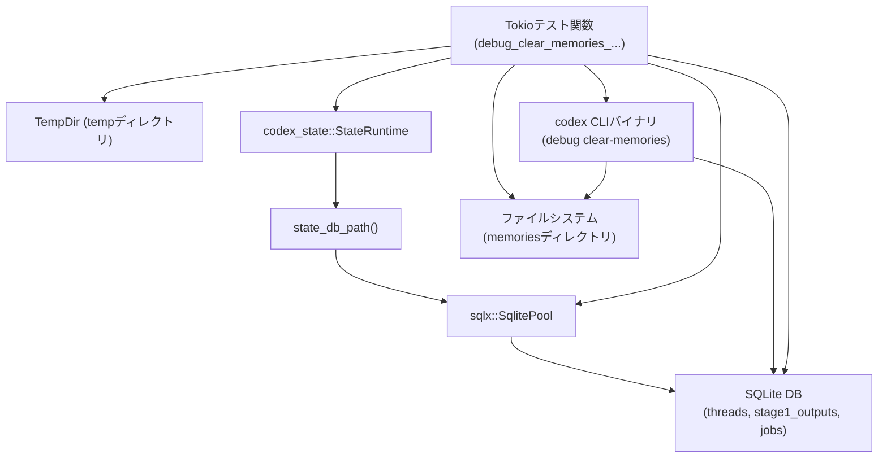
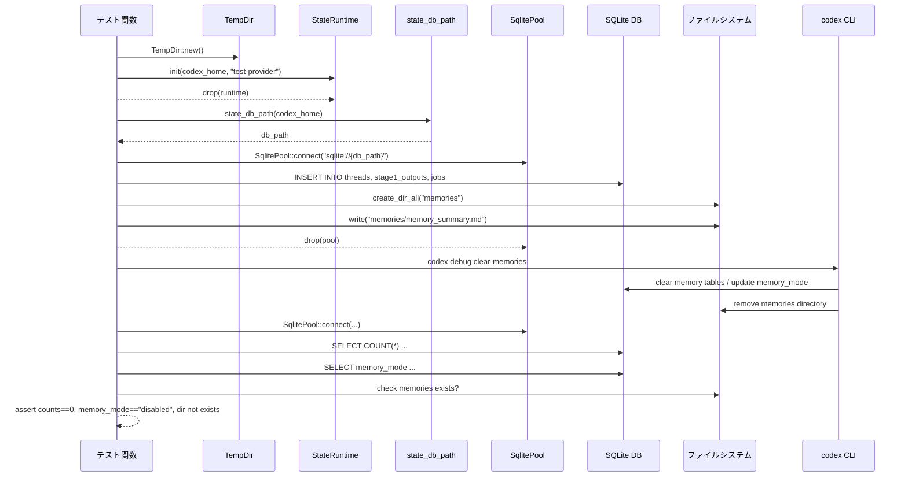

# cli/tests/debug_clear_memories.rs コード解説

## 0. ざっくり一言

`codex` CLI のサブコマンド `debug clear-memories` が、状態データベースとメモリ用ディレクトリを正しく初期化・削除することを検証する **非同期統合テスト**です（`#[tokio::test]`）。  
実際の SQLite DB と一時ディレクトリを使い、CLI バイナリを起動して振る舞いを確認します。

---

## 1. このモジュールの役割

### 1.1 概要

- このテストモジュールは、`debug clear-memories` サブコマンドが以下を行うことを確認します（`debug_clear_memories_resets_state_and_removes_memory_dir` 関数、`cli/tests/debug_clear_memories.rs:L16-136`）。
  - メモリ関連の DB テーブル（`stage1_outputs` と特定の `jobs` レコード）をクリアする。
  - `threads` テーブルの対象スレッドの `memory_mode` を `"enabled"` から `"disabled"` に変更する。
  - ワークスペース内の `memories` ディレクトリを削除する。
- テストでは、`StateRuntime::init` により DB スキーマを作成し、`sqlx` で直接 INSERT を行って「メモリが存在する状態」を再現します（`L18-25, L27-103`）。

### 1.2 アーキテクチャ内での位置づけ

このファイルは CLI バイナリや状態管理クレートと連携する「外側からの統合テスト」という位置づけです。

- 依存関係の概要:
  - `StateRuntime` / `state_db_path`（`codex_state` クレート）を使って、実際と同じ DB を初期化し、そのパスを取得（`L18-25`）。
  - `SqlitePool`（`sqlx`）で DB に接続し、生 SQL でテスト用データを挿入（`L25-78, L80-103`）。
  - `assert_cmd::Command` + `codex_utils_cargo_bin::cargo_bin` でビルド済み `codex` バイナリを起動（`L10-13, L110-114`）。
  - ファイルシステム（`std::fs`）で `memories` ディレクトリとファイルを作成し、削除を検証（`L105-107, L134`）。

Mermaid 図で表すと次のようになります。



### 1.3 設計上のポイント

- **一時ディレクトリの利用**  
  `TempDir::new()` で毎回新しい作業ディレクトリを作成し（`L18`）、`CODEX_HOME` として CLI に渡すことで、テストの独立性と副作用の隔離を確保しています（`L10-13, L110-114`）。
- **実 DB と CLI を使う統合テスト**  
  `StateRuntime::init` により実際の DB スキーマを作成し（`L19-21`）、`codex` バイナリを実行して結果を検証するため、実運用に近い経路をテストしています。
- **直接 SQL を使った状態セットアップ**  
  `sqlx::query` で `threads`, `stage1_outputs`, `jobs` に対して INSERT を行い（`L27-78, L80-103`）、必要な状態をピンポイントに再現しています。
- **リソース解放の明示**  
  - `drop(runtime)` により `StateRuntime` のライフタイムを明示的に終了（`L21`）。
  - CLI 実行前に `drop(pool)` で DB コネクションプールを解放し（`L108`）、DB ロックやリソース競合を避けています。
- **非同期テスト（Tokio）**  
  `#[tokio::test]` + `async fn` によって非同期 API（`StateRuntime::init`, `SqlitePool::connect`, `sqlx::*::execute` など）を自然な形で利用しています（`L16-17`）。
- **エラー伝播**  
  関数の戻り値を `anyhow::Result<()>` とし、`?` 演算子でエラーを逐次伝播させ、どのステップで失敗してもテスト全体が即座に失敗する構造になっています（`L17, L18-21, L25, L57-58, L77-78, L102-103, L105-107, L110, L116-119, L123-126, L129-132`）。

---

## 2. 主要な機能一覧

- `codex_command`: 指定した `CODEX_HOME` を環境変数に設定した `codex` CLI 実行用コマンドを生成します（`L10-14`）。
- `debug_clear_memories_resets_state_and_removes_memory_dir`:  
  1. 状態 DB とメモリディレクトリに「メモリあり」の状態を作る  
  2. `codex debug clear-memories` を実行  
  3. DB とファイルシステムがクリーンアップされたことを検証  
  という一連のシナリオをテストします（`L16-136`）。

### コンポーネント一覧（このファイルで定義される要素）

| 名前 | 種別 | 定義位置 | 説明 |
|------|------|----------|------|
| `codex_command` | 関数 | `cli/tests/debug_clear_memories.rs:L10-14` | `codex` バイナリを対象とする `assert_cmd::Command` を生成し、`CODEX_HOME` を設定するヘルパーです。 |
| `debug_clear_memories_resets_state_and_removes_memory_dir` | 非同期テスト関数 | `cli/tests/debug_clear_memories.rs:L16-136` | `debug clear-memories` サブコマンドのメモリ関連クリーンアップ動作を検証する Tokio テストです。 |

このファイルでは新しい構造体・列挙体などの型は定義されていません。

---

## 3. 公開 API と詳細解説

### 3.1 型一覧（構造体・列挙体など）

このファイル内では、新しい公開型（構造体・列挙体・型エイリアスなど）は定義されていません。  
テスト内で使用されている主な外部型は次の通りです（いずれも他のクレートからのインポートであり、このファイル自体の公開 API ではありません）。

| 名前 | 種別 | 役割 / 用途 | 出現位置 |
|------|------|-------------|----------|
| `TempDir` | 構造体 (`tempfile` クレート) | 一時ディレクトリを自動削除付きで管理する | `L18` |
| `StateRuntime` | 構造体 (`codex_state`) | 状態 DB の初期化などを行うランタイム | `L19-21` |
| `SqlitePool` | 構造体 (`sqlx`) | SQLite データベースへの接続プール | `L25, L116` |
| `assert_cmd::Command` | 構造体 (`assert_cmd`) | 外部コマンドをテスト用に実行・検証する | `L10-13, L110-114` |

### 3.2 関数詳細

#### `codex_command(codex_home: &Path) -> Result<assert_cmd::Command>`

**概要**

`codex` バイナリを起動するための `assert_cmd::Command` を生成し、その実行環境に `CODEX_HOME` 環境変数を設定するヘルパー関数です（`cli/tests/debug_clear_memories.rs:L10-14`）。

**引数**

| 引数名 | 型 | 説明 |
|--------|----|------|
| `codex_home` | `&Path` | `CODEX_HOME` として CLI に与えるディレクトリパス。一時ディレクトリなどを想定しています。 |

**戻り値**

- `Result<assert_cmd::Command>` (`anyhow::Result` エイリアス):
  - `Ok(Command)` の場合: `codex` バイナリの実行準備が整った `Command`。
  - `Err(anyhow::Error)` の場合: `codex_utils_cargo_bin::cargo_bin("codex")` の呼び出しなどが失敗したことを示します。

**内部処理の流れ**

1. `codex_utils_cargo_bin::cargo_bin("codex")` でテスト対象の `codex` バイナリのパスを取得します（`L11`）。
2. そのパスを元に `assert_cmd::Command::new(...)` でコマンドを生成します（`L11`）。
3. 生成したコマンドに対して `env("CODEX_HOME", codex_home)` を設定します（`L12`）。
4. `Ok(cmd)` として `Result` で包んで返します（`L13`）。

**Examples（使用例）**

この関数を使って CLI サブコマンドをテストする典型例です（このファイルのパターンを簡略化したものです）。

```rust
use tempfile::TempDir;
use anyhow::Result;

#[tokio::test]
async fn run_some_codex_command() -> Result<()> {
    // 一時ディレクトリを用意し、CODEX_HOMEとして利用する
    let codex_home = TempDir::new()?;

    // コマンドを生成し、引数を設定
    let mut cmd = codex_command(codex_home.path())?;
    cmd.args(["help"])
        .assert()               // コマンドを実行
        .success();             // 正常終了を検証

    Ok(())
}
```

**Errors / Panics**

- `codex_utils_cargo_bin::cargo_bin("codex")` がエラーを返した場合、`?` により `Err(anyhow::Error)` が返されます（`L11`）。
  - 例えば、`codex` バイナリがビルドされていない場合などが考えられますが、これはこのチャンクからは断定できません。
- この関数内には `panic!` を直接発生させるコードはありません。

**Edge cases（エッジケース）**

- `codex_home` が実在しないパスであっても、この関数内では検証されません。
  - その場合の挙動は `codex` バイナリ側の実装に依存します（このチャンクには現れません）。
- 環境変数 `CODEX_HOME` は上書きされるため、呼び出し元で同じプロセス内に別の値を設定していた場合、その値はこのコマンドには反映されません。

**使用上の注意点**

- この関数は `anyhow::Result` を返すため、テスト関数側で `?` を使って簡潔にエラーハンドリングできます。
- `CODEX_HOME` に指定するディレクトリの中身や存在有無は、この関数では保証しません。テスト前に必要な初期化（ディレクトリ作成など）を済ませておく前提です。

---

#### `debug_clear_memories_resets_state_and_removes_memory_dir() -> Result<()>`

※ 実際のシグネチャは `#[tokio::test] async fn ...` ですが、呼び出し側からは非同期テストとして扱われます（`cli/tests/debug_clear_memories.rs:L16-17`）。

**概要**

`debug clear-memories` サブコマンドが、メモリ関連の DB 状態と `memories` ディレクトリをクリーンアップし、スレッドの `memory_mode` を `"disabled"` に変更することを検証する非同期テストです（`L16-136`）。

**引数**

- テスト関数のため、外部から渡される引数はありません。

**戻り値**

- `Result<()>` (`anyhow::Result<()>`):
  - `Ok(())`: テストの全ステップが成功し、すべてのアサーションが通過したことを示します。
  - `Err(anyhow::Error)`: セットアップや DB 操作など任意のステップでエラーが発生したことを示し、その時点でテストは失敗します。

**内部処理の流れ（アルゴリズム）**

1. **作業ディレクトリと StateRuntime の初期化**（`L18-21`）
   - `TempDir::new()` で一時ディレクトリ `codex_home` を作成。
   - `StateRuntime::init` を呼び出し、`codex_home` をルートディレクトリとする状態ランタイムを初期化。
   - すぐに `drop(runtime)` し、ランタイムを明示的に破棄。

2. **DB 接続とテストデータ挿入（threads）**（`L23-58`）
   - `state_db_path(codex_home.path())` で状態 DB のファイルパスを取得（`L24`）。
   - `SqlitePool::connect` で SQLite に接続（`L25`）。
   - `sqlx::query` を用い、`threads` テーブルに 1 レコードを挿入（`L27-58`）。
     - `id` として固定 UUID 文字列 `thread_id` を使用（`L23`）。
     - `rollout_path`, `cwd` などに `codex_home` 内のパスをバインド（`L55-56`）。
     - `memory_mode` 列に `'enabled'` をセット（`L51` 付近の SQL）。

3. **DB 接続とテストデータ挿入（stage1_outputs）**（`L60-78`）
   - 同じ `SqlitePool` を用いて、`stage1_outputs` テーブルに `thread_id` を紐づけたレコードを挿入（`L60-78`）。

4. **DB 接続とテストデータ挿入（jobs）**（`L80-103`）
   - `jobs` テーブルに 2 つの `kind` を持つレコードを挿入（`L80-103`）。
     - `'memory_stage1'`（`job_key` に `thread_id` をバインド）。
     - `'memory_consolidate_global'`（`job_key` は `'global'` 固定）。
   - いずれも `status = 'completed'`, `retry_remaining = 3` などの値を持ちます（`L96-98` の SQL）。

5. **メモリディレクトリの作成**（`L105-107`）
   - `memory_root = codex_home.path().join("memories")` としてルートパスを決定（`L105`）。
   - `std::fs::create_dir_all(&memory_root)` で `memories` ディレクトリを作成。
   - `memory_root.join("memory_summary.md")` に `"stale memory"` という内容のファイルを書き込む（`L107`）。
   - `drop(pool)` で DB 接続プールを解放（`L108`）。

6. **CLI コマンド `debug clear-memories` の実行と標準出力の検証**（`L110-114`）
   - `codex_command(codex_home.path())?` を使って `cmd` を生成（`L110`）。
   - `.args(["debug", "clear-memories"])` でサブコマンドを指定（`L111`）。
   - `.assert().success().stdout(contains("Cleared memory state"))` により:
     - 正常終了（終了コード 0）であること。
     - 標準出力に `"Cleared memory state"` が含まれること。
     を検証（`L111-114`）。

7. **後検証: DB 状態の確認**（`L116-133`）
   - 新たに `SqlitePool::connect` で DB に再接続（`L116`）。
   - `SELECT COUNT(*) FROM stage1_outputs` でレコード数を取得し、`0` であることを `assert_eq!` で検証（`L117-120`）。
   - `SELECT COUNT(*) FROM jobs WHERE kind = 'memory_stage1' OR kind = 'memory_consolidate_global'` の結果も `0` であることを検証（`L122-127`）。
   - `SELECT memory_mode FROM threads WHERE id = ?` で該当スレッドの `memory_mode` を取得し、`"disabled"` と一致することを検証（`L129-133`）。

8. **後検証: ファイルシステムの確認**（`L133-134`）
   - `assert!(!memory_root.exists());` により `memories` ディレクトリが存在しないことを検証。

9. **テスト終了**（`L136`）
   - `Ok(())` を返し、テストを成功として終了。

**Examples（使用例）**

この関数自体はテストランナーから自動的に実行されるため、ユーザーコードから呼び出す想定ではありません。  
同様の統合テストを書くときのパターンは次のようになります。

```rust
use anyhow::Result;
use tempfile::TempDir;
use sqlx::SqlitePool;
use codex_state::{StateRuntime, state_db_path};

#[tokio::test]
async fn my_cli_command_behaves_as_expected() -> Result<()> {
    // 1. 作業ディレクトリとDBスキーマの初期化
    let codex_home = TempDir::new()?;
    let runtime = StateRuntime::init(codex_home.path().to_path_buf(), "test-provider".to_string()).await?;
    drop(runtime);

    // 2. DBに直接テストデータを挿入
    let db_path = state_db_path(codex_home.path());
    let pool = SqlitePool::connect(&format!("sqlite://{}", db_path.display())).await?;
    // ... sqlx::query(...).execute(&pool).await? で状態をセットアップ ...

    // 3. CLIコマンド実行
    drop(pool); // 必要に応じてDB接続を解放
    let mut cmd = codex_command(codex_home.path())?;
    cmd.args(["some", "subcommand"])
        .assert()
        .success();

    // 4. DBやファイルを再検証
    let pool = SqlitePool::connect(&format!("sqlite://{}", db_path.display())).await?;
    // ... SELECTで検証 ...

    Ok(())
}
```

**Errors / Panics**

- `?` により、以下のようなステップで発生したエラーはそのまま `Err(anyhow::Error)` としてテストを失敗させます。
  - 一時ディレクトリ作成（`TempDir::new`、`L18`）。
  - `StateRuntime::init` による状態ランタイム初期化（`L19-21`）。
  - SQLite への接続（`SqlitePool::connect`、`L25, L116`）。
  - `sqlx::query` / `query_scalar` の実行（`L57-58, L77-78, L102-103, L118-119, L125-126, L131-132`）。
  - ディレクトリ・ファイル操作（`create_dir_all`, `write`、`L105-107`）。
  - `codex_command` 内でのバイナリ取得（`L110`）。
- `assert_eq!` / `assert!` が失敗すると `panic!` が発生し、テストは失敗します（`L120, L127, L133-134`）。

**Edge cases（エッジケース）**

- DB スキーマが変更され、テーブル名やカラムが変わった場合は、テスト内の生 SQL が失敗します（`L27-51, L60-73, L82-98`）。
- `debug clear-memories` の仕様変更により、出力メッセージが `"Cleared memory state"` から変わった場合、標準出力の検証が失敗します（`L111-114`）。
- CLI 側が `memories` ディレクトリの削除戦略を変更した場合（例えば空ディレクトリだけ削除するなど）、`assert!(!memory_root.exists())` が失敗する可能性があります（`L134`）。

**使用上の注意点**

- 非同期テストのため、`#[tokio::test]` 属性を付けることが前提です。Tokio ランタイムが提供されない環境では実行できません（`L16-17`）。
- DB コネクションプール `pool` を CLI 実行前に `drop` している点が重要です（`L108`）。これにより DB ファイルへのロックが確実に解放され、CLI 側が DB にアクセスできるようになります。
- このテストは「仕様の契約」を明示的に定義しています：
  - `stage1_outputs` と特定種別の `jobs` レコードは全削除されること。
  - `threads.memory_mode` は `"disabled"` にされること。
  - `memories` ディレクトリは削除されること。
  これらを前提として他のコードやテストを書く場合は、仕様変更時にここも更新する必要があります。

### 3.3 その他の関数

このファイルには、その他の補助的なトップレベル関数は存在しません。

---

## 4. データフロー

このテストにおける代表的な処理シナリオは「メモリ状態をセットアップ → CLI でクリア → DB と FS を再確認」という流れです。

### データフローの概要

1. **セットアップ段階**
   - 一時ディレクトリ上に DB と `memories` ディレクトリを作成し、DB にメモリ関連レコードを挿入します（`L18-21, L23-78, L80-107`）。
2. **操作段階**
   - `codex debug clear-memories` を実行し、CLI に DB とファイルシステムのクリーンアップを行わせます（`L110-114`）。
3. **検証段階**
   - 再び DB に接続し、レコード数と `memory_mode`、および `memories` ディレクトリの存在を検証します（`L116-134`）。

これを sequence diagram で表します。



---

## 5. 使い方（How to Use）

このファイルはテストコードですが、**CLI の統合テストの書き方**や、**状態 DB とファイルシステムを組み合わせた検証方法**の参考になります。

### 5.1 基本的な使用方法

`codex_command` を利用して CLI のサブコマンドをテストする基本フローは次の通りです。

```rust
use anyhow::Result;
use tempfile::TempDir;
use sqlx::SqlitePool;
use codex_state::{StateRuntime, state_db_path};

#[tokio::test]
async fn test_some_subcommand() -> Result<()> {
    // 1. 一時CODEX_HOMEの用意
    let codex_home = TempDir::new()?;

    // 2. 状態DBの初期化
    let runtime =
        StateRuntime::init(codex_home.path().to_path_buf(), "test-provider".to_string()).await?;
    drop(runtime);

    // 3. 必要に応じてDBやファイルに初期状態をセットアップ
    let db_path = state_db_path(codex_home.path());
    let pool = SqlitePool::connect(&format!("sqlite://{}", db_path.display())).await?;
    // ... ここでsqlx::query(...)などを使ってINSERTする ...
    drop(pool);

    // 4. CLIサブコマンドの実行
    let mut cmd = codex_command(codex_home.path())?;
    cmd.args(["debug", "some-subcommand"])
        .assert()
        .success();

    // 5. 結果の検証（DB・ファイルなど）
    let pool = SqlitePool::connect(&format!("sqlite://{}", db_path.display())).await?;
    // ... SELECTなどで検証 ...

    Ok(())
}
```

### 5.2 よくある使用パターン

- **状態 DB の契約テスト**  
  `debug_clear_memories_resets_state_and_removes_memory_dir` のように、DB へ直接 INSERT してから CLI を実行し、期待するレコード数・フィールド値を検証するパターンです（`L27-78, L80-103, L117-120, L122-127, L129-133`）。

- **ファイルシステムとの一貫性検証**  
  `memories` ディレクトリを明示的に作成し、CLI 実行後に存在チェックを行うことで、DB だけでなく FS 上の状態も含めた契約をテストしています（`L105-107, L134`）。

### 5.3 よくある間違い

このテストコードから読み取れる注意点です。

```rust
// 間違い例: DB接続を解放せずにCLIを実行してしまう
let pool = SqlitePool::connect(&format!("sqlite://{}", db_path.display())).await?;
// ... INSERT などを実行 ...
let mut cmd = codex_command(codex_home.path())?;
cmd.args(["debug", "clear-memories"])
    .assert()
    .success(); // ← DBがロックされていると、ここで失敗する可能性がある
```

```rust
// 正しい例: テストコードが行っているように、CLI実行前にdropする
let pool = SqlitePool::connect(&format!("sqlite://{}", db_path.display())).await?;
// ... INSERT などを実行 ...
drop(pool); // cli/tests/debug_clear_memories.rs:L108 と同様
let mut cmd = codex_command(codex_home.path())?;
cmd.args(["debug", "clear-memories"])
    .assert()
    .success();
```

このように `drop(pool)` を行っているのは、DB ファイルへのロックや接続競合を避ける意図があると解釈できます（`cli/tests/debug_clear_memories.rs:L108`）。

### 5.4 使用上の注意点（まとめ）

- **非同期コンテキストが必須**  
  `StateRuntime::init` や `SqlitePool::connect` は `async` 関数であるため、テストは `#[tokio::test]` などの非同期ランタイム上で実行する必要があります（`L16-21, L25, L60, L80, L116`）。
- **DB スキーマに強く依存**  
  INSERT / SELECT に生 SQL を使っているため、DB スキーマ変更時にはテストも更新が必要です（`L27-51, L60-73, L82-98, L117-118, L122-123, L129`）。
- **標準出力メッセージの仕様が固定**  
  `"Cleared memory state"` という文字列を前提としているため、ユーザー向けメッセージの変更もテストに影響します（`L111-114`）。
- **ファイルシステムの前提**  
  `memories` ディレクトリが完全に削除されることを前提としたアサーションになっています（`L105-107, L134`）。

---

## 6. 変更の仕方（How to Modify）

### 6.1 新しい機能を追加する場合

`debug clear-memories` に新しいクリーンアップ対象（追加のテーブルやファイル）が増えた場合、テスト拡張の流れは次のようになります。

1. **セットアップの追加**
   - 新しいテーブル・カラムに対応する `INSERT` を `sqlx::query` で追加します。  
     例: `stage2_outputs` をクリアする仕様になった場合は、`stage1_outputs` と同様に INSERT を追加する、という形です。
2. **検証の追加**
   - CLI 実行後の検証として、該当テーブルの `COUNT(*)` やカラムの値を確認するクエリを追加します（`L117-120, L122-127, L129-133` のパターンと同様）。
3. **ファイル系の変更**
   - 新たなファイルやディレクトリがクリーンアップ対象になった場合は、`memories` と同じように事前に作成し、`assert!` で削除されていることを検証します（`L105-107, L134`）。

### 6.2 既存の機能を変更する場合

- **CLI 出力メッセージを変更する場合**
  - `stdout(contains("Cleared memory state"))` の期待値を新しいメッセージに合わせて変更します（`L111-114`）。
- **メモリモードの扱いを変更する場合**
  - `threads.memory_mode` の期待値 `"disabled"` を変更する必要があります（`L129-133`）。
  - 仕様として「どの状態がメモリ無効」を意味するのかを明確に反映させます。
- **DB スキーマを変更する場合**
  - テーブル名の変更 → INSERT / SELECT 文の FROM / INTO 部分を更新（`L27-51, L60-73, L82-98, L117-118, L122-123, L129`）。
  - カラム追加 → INSERT 文のカラム列と VALUES 部分の数を合わせる必要があります。
- 変更後は、CLI 実行経路とこのテストの両方で仕様が整合しているかを確認します。

---

## 7. 関連ファイル

このテストと密接に関係するモジュール・クレートは、コードから次のように読み取れます。

| パス / モジュール | 役割 / 関係 |
|-------------------|------------|
| `codex_state::StateRuntime` | 状態 DB の初期化などを行うランタイム。テスト開始時に DB スキーマをセットアップするために使用されています（`L19-21`）。 |
| `codex_state::state_db_path` | 指定した CODEX_HOME から状態 DB のファイルパスを決定する関数。テストで SQLite に接続するためのパスを取得しています（`L24`）。 |
| `sqlx::SqlitePool` | SQLite データベースへの接続プール。テストで DB に対する INSERT / SELECT を行うために利用されています（`L25, L60, L80, L116`）。 |
| `assert_cmd::Command` & `codex_utils_cargo_bin::cargo_bin` | `codex` CLI バイナリをテストプロセスから起動し、終了コードや標準出力を検証するために使用されています（`L10-13, L110-114`）。 |
| `tempfile::TempDir` | テストごとに独立した作業ディレクトリ (`CODEX_HOME`) を提供し、テスト終了時に自動削除されます（`L18`）。 |

これらのファイルやクレートの具体的な実装は、このチャンクには現れませんが、テストの前提条件として重要な役割を持っています。
