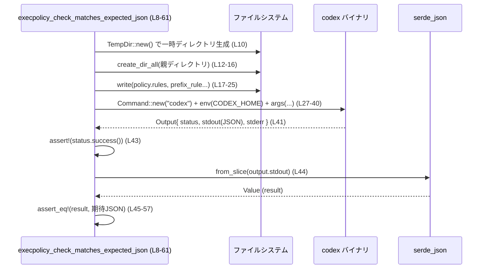

# cli/tests/execpolicy.rs コード解説

## 0. ざっくり一言

`codex` CLI のサブコマンド `execpolicy check` が出力する JSON が想定どおりかどうかを、実際にバイナリを起動する形で検証する統合テストを集めたファイルです（根拠: `execpolicy.rs:L8-61`, `L63-119`）。

---

## 1. このモジュールの役割

### 1.1 概要

- このモジュールは、`codex execpolicy check` が
  - ポリシールールファイルを正しく評価し、
  - 決定（`decision`）とマッチしたルール (`matchedRules`) を JSON で出力する  
 ことを検証します（根拠: `execpolicy.rs:L27-41`, `L45-58`, `L84-98`, `L102-116`）。
- 特に、`justification`（理由）フィールドが存在する場合に JSON に含まれること、および存在しない場合は含まれないことを確認しています（根拠: `execpolicy.rs:L20-23`, `L47-57`, `L76-80`, `L104-115`）。

### 1.2 アーキテクチャ内での位置づけ

このファイルは CLI テスト層に属し、実際の `codex` バイナリをサブプロセスとして起動して振る舞いを確認する「ブラックボックス的な」統合テストです。

- 依存関係（このチャンクから分かる範囲）

  - `codex` バイナリ  
    - `codex_utils_cargo_bin::cargo_bin("codex")` でパスを取得し、`assert_cmd::Command` 経由で起動しています（根拠: `execpolicy.rs:L3`, `L27-41`, `L84-98`）。
  - 一時ディレクトリ  
    - `tempfile::TempDir` を用いて一時的な `CODEX_HOME` ディレクトリを作り、その配下に `rules/policy.rules` を生成します（根拠: `execpolicy.rs:L6`, `L10-18`, `L66-75`）。
  - 標準ライブラリ I/O  
    - `std::fs::create_dir_all` と `std::fs::write` でルールファイルを作成します（根拠: `execpolicy.rs:L12-18`, `L68-75`）。
  - JSON 処理  
    - `serde_json::from_slice` によって CLI の標準出力を JSON としてパースし、`serde_json::json!` マクロで期待値を構築します（根拠: `execpolicy.rs:L5`, `L44-57`, `L101-115`）。

```mermaid
flowchart TD
    subgraph Tests["execpolicy.rs テスト群 (L8-119)"]
        T1["execpolicy_check_matches_expected_json"]
        T2["execpolicy_check_includes_justification_when_present"]
    end

    FS["ファイルシステム\n(std::fs, TempDir)"]
    Codex["codex バイナリ\n(codex_utils_cargo_bin)"]
    JSON["serde_json"]

    T1 --> FS
    T2 --> FS
    T1 -->|Command::new + output()| Codex
    T2 -->|Command::new + output()| Codex
    Codex -->|stdout(JSON)| T1
    Codex -->|stdout(JSON)| T2
    T1 --> JSON
    T2 --> JSON
```

※ `codex` バイナリ内部の実装ファイルのパスは、このチャンクには現れません。

### 1.3 設計上のポイント

- **統合テストスタイル**  
  - ライブラリ関数への直接呼び出しではなく、実バイナリをサブプロセスとして起動して検証する構造になっています（根拠: `execpolicy.rs:L27-41`, `L84-98`）。
- **一時ディレクトリによる隔離**  
  - 各テストで `TempDir::new()` を使い、`CODEX_HOME` をテスト専用の場所に向けることで、他のテストや実環境と設定が衝突しないようにしています（根拠: `execpolicy.rs:L10`, `L66`, `L28`, `L85`）。
- **JSON 形状がそのまま仕様になるテスト**  
  - 期待される JSON を `serde_json::json!` で明示的に記述し、`assert_eq!` で比較することで、CLI の出力スキーマをテストコードがそのまま仕様として表現しています（根拠: `execpolicy.rs:L45-57`, `L102-115`）。
- **エラー処理**  
  - テスト関数は `Result<(), Box<dyn std::error::Error>>` を返し、`?` 演算子で I/O・プロセス起動・JSON パースのエラーをそのままテストの失敗として伝播します（根拠: `execpolicy.rs:L9`, `L64`, `L10`, `L17-18`, `L27-28`, `L41-44`, `L66`, `L73-75`, `L84-86`, `L98`, `L101`）。
  - 一部の前提条件（パスの親ディレクトリの存在、UTF-8 変換の成功）は `expect` による `panic` で扱っています（根拠: `execpolicy.rs:L14-15`, `L34-35`, `L70-71`, `L91-92`）。
- **並行実行に対する安全性**  
  - 共有状態を持たず、各テストが自身の `TempDir` を使うため、Rust のテストハーネスがデフォルトでテストを並行実行してもディスク上の状態が衝突しない構造になっています（根拠: `execpolicy.rs:L10`, `L66`）。

---

## 2. 主要な機能一覧

このファイルに定義されているテスト関数の役割は次のとおりです。

- `execpolicy_check_matches_expected_json`:  
  `justification` を含まない `prefix_rule` を定義したポリシーファイルに対して、`codex execpolicy check` の JSON 出力が期待された構造（`decision` と `matchedRules`／`prefixRuleMatch`）になることを検証するテストです（根拠: `execpolicy.rs:L8-25`, `L27-58`）。
- `execpolicy_check_includes_justification_when_present`:  
  `justification` を含む `prefix_rule` を定義した場合に、同内容の文字列が JSON 出力内の `justification` フィールドとして反映されることを検証するテストです（根拠: `execpolicy.rs:L63-82`, `L84-116`）。

### 2.1 コンポーネント一覧（関数・主要要素）

| 名前 | 種別 | 定義位置 | 説明 |
|------|------|----------|------|
| `execpolicy_check_matches_expected_json` | テスト関数 | `execpolicy.rs:L8-61` | `codex execpolicy check` の基本的な JSON 出力（`decision = "forbidden"` と、`matchedPrefix = ["git","push"]` を持つ `prefixRuleMatch`）を検証します。 |
| `execpolicy_check_includes_justification_when_present` | テスト関数 | `execpolicy.rs:L63-119` | ルールに `justification` を定義すると、出力 JSON に同名フィールドが追加されることを検証します。 |
| `TempDir` | 型（外部クレート） | 使用: `execpolicy.rs:L6`, `L10`, `L66` | 一時ディレクトリを管理し、テスト専用の `CODEX_HOME` を提供します。 |
| `Command` | 型（外部クレート `assert_cmd`） | 使用: `execpolicy.rs:L3`, `L27`, `L84` | `codex` バイナリをサブプロセスとして起動し、標準出力と終了ステータスを取得します。 |
| `serde_json::Value` | 型（外部クレート） | 使用: `execpolicy.rs:L44`, `L101` | CLI 出力を JSON としてパースする際の動的型です。 |

---

## 3. 公開 API と詳細解説

このファイルはテスト用モジュールであり、外部から利用される公開関数や型は定義していません（すべて `#[test]` 関数のみ）（根拠: `execpolicy.rs:L8`, `L63`）。  
ここでは「テストが暗黙に規定している CLI の契約」と「テスト関数そのものの構造」を説明します。

### 3.1 型一覧（このモジュールで重要な型）

| 名前 | 種別 | 役割 / 用途 | 利用位置 |
|------|------|-------------|----------|
| `tempfile::TempDir` | 構造体 | 一時ディレクトリを作成し、スコープ終了時に自動削除する。`CODEX_HOME` のルートとして利用。 | `execpolicy.rs:L6`, `L10`, `L66` |
| `assert_cmd::Command` | 構造体 | テストから外部コマンドを起動するためのラッパ。`codex` バイナリ起動に使用。 | `execpolicy.rs:L3`, `L27`, `L84` |
| `serde_json::Value` | 列挙体（動的 JSON 値） | 標準出力を JSON としてパースする際の型。 | `execpolicy.rs:L44`, `L101` |
| `Box<dyn std::error::Error>` | トレイトオブジェクト | テスト関数の汎用エラー型。`?` で発生しうる I/O や JSON パースのエラーをまとめる。 | `execpolicy.rs:L9`, `L64` |

### 3.2 関数詳細

#### `execpolicy_check_matches_expected_json() -> Result<(), Box<dyn std::error::Error>>`

**概要**

- `justification` を含まない `prefix_rule` を設定した `policy.rules` に対して、`codex execpolicy check` の出力 JSON が、期待される構造・値と完全一致することを検証するテストです（根拠: `execpolicy.rs:L17-23`, `L27-41`, `L45-57`）。

**引数**

- 引数はありません。Rust のテストハーネスから自動で呼び出されます（根拠: `execpolicy.rs:L8`）。

**戻り値**

- `Result<(), Box<dyn std::error::Error>>`  
  - `Ok(())`: テストが成功した場合。  
  - `Err(e)`: テスト内部で I/O・プロセス実行・JSON パースなどでエラーが発生した場合。テストランナーはこれをテスト失敗として扱います（根拠: `execpolicy.rs:L9`, `L10`, `L17-18`, `L27-28`, `L41-44`, `L44`）。

**内部処理の流れ（アルゴリズム）**

1. **一時ディレクトリとポリシーファイルパスの準備**  
   - `TempDir::new()?` で一時ディレクトリを作り、そのパスを `codex_home` に保持します（根拠: `execpolicy.rs:L10`）。
   - `codex_home.path().join("rules").join("policy.rules")` で `rules/policy.rules` へのパスを生成し、`policy_path` に保存します（根拠: `execpolicy.rs:L11`）。
2. **ディレクトリの作成**  
   - `policy_path.parent().expect(... )` でディレクトリパスを取得し、`fs::create_dir_all(...)` により必要なディレクトリを作成します（根拠: `execpolicy.rs:L12-16`）。
3. **ルールファイルの作成**  
   - `fs::write(&policy_path, r#"...` で、`prefix_rule` を定義したポリシーファイルを作成します（根拠: `execpolicy.rs:L17-25`）。
4. **`codex` バイナリを起動**  
   - `codex_utils_cargo_bin::cargo_bin("codex")?` で `codex` バイナリへのパスを取得し、`Command::new(...)` に渡します（根拠: `execpolicy.rs:L27`）。
   - `.env("CODEX_HOME", codex_home.path())` により、環境変数 `CODEX_HOME` を一時ディレクトリに設定します（根拠: `execpolicy.rs:L28`）。
   - `.args([...])` で `execpolicy`, `check`, `--rules`, `<policy_path>`, `git`, `push`, `origin`, `main` を引数として指定します（根拠: `execpolicy.rs:L29-40`）。
   - `.output()?` でコマンドを実行し、終了まで待機しつつ標準出力／標準エラー／終了ステータスを含む `Output` を取得します（根拠: `execpolicy.rs:L41`）。
5. **終了ステータスと JSON の検証**  
   - `assert!(output.status.success());` で終了ステータスが成功（一般にコード 0）であることを確認します（根拠: `execpolicy.rs:L43`）。
   - `serde_json::from_slice(&output.stdout)?` で標準出力を JSON としてパースし、`serde_json::Value` として `result` に格納します（根拠: `execpolicy.rs:L44`）。
   - `assert_eq!(result, json!({ ... }))` で、期待する JSON 構造と完全一致することを確認します（根拠: `execpolicy.rs:L45-57`）。
6. **正常終了**  
   - `Ok(())` を返し、テスト成功を表します（根拠: `execpolicy.rs:L60`）。

**Examples（使用例）**

このテストは通常 `cargo test` によって自動実行されます。個別に実行する場合の例です。

```bash
# ファイル全体のテストを実行
cargo test --test execpolicy

# 特定のテスト関数のみを実行
cargo test --test execpolicy execpolicy_check_matches_expected_json
```

**Errors / Panics**

- `Err` になる条件（`?` による伝播）
  - 一時ディレクトリの作成に失敗した場合（`TempDir::new()?`）（根拠: `execpolicy.rs:L10`）。
  - ディレクトリ作成（`fs::create_dir_all`）やファイル書き込み（`fs::write`）で I/O エラーが発生した場合（根拠: `execpolicy.rs:L12-18`）。
  - `codex` バイナリのパス解決に失敗した場合（`cargo_bin("codex")?`）（根拠: `execpolicy.rs:L27`）。
  - `Command::output()` 実行時に OS レベルのエラーが発生した場合（根拠: `execpolicy.rs:L41`）。
  - 標準出力が有効な JSON でなく、`serde_json::from_slice` が失敗した場合（根拠: `execpolicy.rs:L44`）。
- `panic` になる条件
  - `policy_path.parent()` が `None` を返した場合（`expect("policy path should have a parent")`）（根拠: `execpolicy.rs:L14-15`）。  
    実際には `join("rules").join("policy.rules")` しているため、通常は `Some` です。
  - `policy_path.to_str()` が `None` を返した場合（`expect("policy path should be valid UTF-8")`）（根拠: `execpolicy.rs:L34-35`）。  
    一部の OS で非 UTF-8 パスが割り当てられた場合に起こりえます。

**Edge cases（エッジケース）**

- ルールファイルの内容が無効な場合  
  - このテストでは扱っていません。`prefix_rule` の構文エラー時の挙動は不明です（このチャンクには現れません）。
- コマンド引数がパターンにマッチしない場合  
  - 本テストでは `["git", "push", "origin", "main"]` という引数に対して `pattern = ["git", "push"]` が指定されており、`matchedPrefix` に `["git", "push"]` が入ることのみを確認しています（根拠: `execpolicy.rs:L21-22`, `L36-39`, `L52-53`）。  
  - マッチしない場合の `decision` や `matchedRules` の扱いは、このファイルからは分かりません。
- `codex` が非ゼロ終了する場合  
  - `assert!(output.status.success())` により、この場合はテストが即座に失敗します（根拠: `execpolicy.rs:L43`）。CLI 側のエラー出力内容などは、このテストでは検証していません。

**使用上の注意点**

- テストは実際に `codex` バイナリを起動するため、起動できない場合（ビルド未完了、PATH 問題など）はエラーになります。  
  バイナリの検出は `codex_utils_cargo_bin::cargo_bin` に依存しており、その実装はこのチャンクには現れません。
- テストの並行実行を前提とするため、共有ディレクトリやグローバル状態を使わず、`TempDir` を必ず利用する構造になっています。新しいテストを追加するときも同様のパターンを踏襲することが望ましいです（根拠: `execpolicy.rs:L10`, `L66`）。
- 統合テストであるため、ユニットテストと比べて実行時間は長くなりやすいです。大量に追加する場合はテスト時間への影響にも留意が必要です。

---

#### `execpolicy_check_includes_justification_when_present() -> Result<(), Box<dyn std::error::Error>>`

**概要**

- ルール側で `justification = "..."` を指定したとき、`codex execpolicy check` の JSON 出力に `justification` フィールドが含まれ、その内容がルールに記述した文字列と一致することを検証するテストです（根拠: `execpolicy.rs:L73-80`, `L84-98`, `L104-115`）。

**引数**

- 引数はありません。Rust のテストハーネスから自動で呼び出されます（根拠: `execpolicy.rs:L63-65`）。

**戻り値**

- `Result<(), Box<dyn std::error::Error>>`  
  - `Ok(())`: テスト成功。  
  - `Err(e)`: I/O・プロセス実行・JSON パースのいずれかでエラーが発生した場合。

**内部処理の流れ（アルゴリズム）**

1. **一時ディレクトリとポリシーファイルパスの準備**  
   - `TempDir::new()?` で一時ディレクトリを作成し、`policy.rules` のパスを構築します（根拠: `execpolicy.rs:L66-67`）。
2. **ディレクトリ作成とルールファイル書き込み**  
   - `create_dir_all` でディレクトリを作成し（根拠: `execpolicy.rs:L68-72`）、`fs::write` で `justification` 付きの `prefix_rule` を書き込みます（根拠: `execpolicy.rs:L73-82`）。
3. **`codex` バイナリの起動**  
   - 最初のテストと同様の方法で `codex` バイナリを起動し、`execpolicy check --rules <path> git push origin main` を実行します（根拠: `execpolicy.rs:L84-97`）。
4. **終了ステータスと JSON の検証**  
   - `assert!(output.status.success())` で成功終了を確認し（根拠: `execpolicy.rs:L100`）、標準出力を `serde_json::from_slice` でパースします（根拠: `execpolicy.rs:L101`）。
   - `assert_eq!(result, json!({ ... }))` で、`decision`, `matchedRules`, `matchedPrefix`, `decision` に加え、`justification` が期待通りであることを検証します（根拠: `execpolicy.rs:L102-115`）。
5. **正常終了**  
   - `Ok(())` を返します（根拠: `execpolicy.rs:L118`）。

**Examples（使用例）**

```bash
# ファイル内の「justification」関連テストのみを実行
cargo test --test execpolicy execpolicy_check_includes_justification_when_present
```

**Errors / Panics**

- `Err` となる条件は、前述の `execpolicy_check_matches_expected_json` とほぼ同一で、ルール内容と JSON 期待値が異なる点のみが違いです（根拠: `execpolicy.rs:L66-75`, `L84-86`, `L98`, `L101`）。
- `panic` 条件も同様に、`policy_path.parent()` と `policy_path.to_str()` に対する `expect` によるものです（根拠: `execpolicy.rs:L70-71`, `L91-92`）。

**Edge cases（エッジケース）**

- `justification` をルールに複数定義した場合や、空文字列にした場合の挙動は、このテストからは分かりません（このチャンクには現れません）。
- ルールに `justification` がない場合との違いは、2 つのテスト間の比較からのみ分かります。  
  - 1つ目のテストでは JSON に `justification` フィールドが存在せず（根拠: `execpolicy.rs:L47-57`）、  
  - 本テストでは `justification: "pushing is blocked in this repo"` が含まれます（根拠: `execpolicy.rs:L79`, `L108-112`）。  
  これにより、「ルールに `justification` がある場合のみ JSON に出る」ことがテストされていると解釈できます。

**使用上の注意点**

- このテストは `justification` の存在時のみを対象としており、「存在しない場合にフィールドが出ない」ことも合わせて確認したい場合は、1つ目のテストの結果とセットで見る必要があります。
- 新しく `justification` の形式（例えばローカライズされたメッセージ）を変える場合は、このテストの期待 JSON も更新する必要があります。

---

### 3.3 その他の関数

- このファイルには補助関数やラッパー関数は定義されていません。`#[test]` の 2 関数のみです（根拠: `execpolicy.rs:L8-61`, `L63-119`）。

---

## 4. データフロー

ここでは、`execpolicy_check_matches_expected_json (L8-61)` を例に、データの流れを整理します。

1. テスト開始と同時に、一時ディレクトリ (`TempDir`) が作成され、そのパスが `CODEX_HOME` として環境変数に設定されます（根拠: `execpolicy.rs:L10`, `L28`）。
2. 一時ディレクトリ内に `rules/policy.rules` が作成され、`prefix_rule` を記述したテキストが書き込まれます（根拠: `execpolicy.rs:L11-18`）。
3. テストは `assert_cmd::Command` を使って `codex` バイナリを起動し、`execpolicy check --rules <policy_path> git push origin main` を引数として渡します（根拠: `execpolicy.rs:L27-40`）。
4. `codex` は標準出力に JSON を書き出し、正常終了します。テスト側は `Command::output()` によって `Output` 構造体としてこれを受け取ります（根拠: `execpolicy.rs:L41-43`）。
5. テストは `output.stdout` を `serde_json::from_slice` でパースし、`serde_json::Value` を得ます（根拠: `execpolicy.rs:L44`）。
6. 最後に、その JSON 値と `json!({...})` で構築した期待 JSON を `assert_eq!` で比較し、一致すればテスト成功、不一致であれば失敗となります（根拠: `execpolicy.rs:L45-57`）。



2つ目のテストも同様のフローですが、ルールファイルに `justification` を追加している点だけが異なります（根拠: `execpolicy.rs:L76-80`, `L104-115`）。

---

## 5. 使い方（How to Use）

このファイルはテスト用であり、通常のアプリケーションコードから直接呼び出すことはありません。ここでは「テストの実行方法」と「同様のテストを追加する際のパターン」を説明します。

### 5.1 基本的な使用方法（テストの実行）

一般的な実行方法は次のとおりです。

```bash
# プロジェクト全体のテストを実行
cargo test

# このファイルに含まれるテストだけを実行
cargo test --test execpolicy

# 個別のテスト関数のみを実行
cargo test --test execpolicy execpolicy_check_matches_expected_json
cargo test --test execpolicy execpolicy_check_includes_justification_when_present
```

### 5.2 よくある使用パターン（類似テストの追加）

このファイルの各テストは、次の「ひな型」に沿っています。

```rust
#[test]
fn new_execpolicy_behavior_test() -> Result<(), Box<dyn std::error::Error>> {
    // 1. 一時ディレクトリとポリシーファイルパスの用意
    let codex_home = TempDir::new()?;                                     // 一時HOME
    let policy_path = codex_home.path().join("rules").join("policy.rules"); // rules/policy.rules
    fs::create_dir_all(
        policy_path.parent().expect("policy path should have a parent"),   // 親ディレクトリを作成
    )?;

    // 2. ルールファイルへの書き込み（検証したいルール内容に変更）
    fs::write(
        &policy_path,
        r#"
prefix_rule(
    pattern = ["git", "commit"],
    decision = "allowed",
)
"#,
    )?;

    // 3. codex execpolicy check の実行
    let output = Command::new(codex_utils_cargo_bin::cargo_bin("codex")?)  // codex バイナリ
        .env("CODEX_HOME", codex_home.path())                              // 一時HOMEを設定
        .args([
            "execpolicy", "check", "--rules",
            policy_path.to_str().expect("policy path should be valid UTF-8"),
            "git", "commit", "-m", "test",
        ])
        .output()?;                                                        // 実行して結果取得

    assert!(output.status.success());                                      // 正常終了を確認

    // 4. JSON の検証
    let result: serde_json::Value = serde_json::from_slice(&output.stdout)?;
    assert_eq!(
        result,
        json!({
            // 検証したい期待JSONをここに記述
        })
    );

    Ok(())
}
```

※ 上記は、このファイルのテスト構造を説明するための例です。`decision = "allowed"` といった具体的な挙動が実際に存在するかどうかは、このチャンクだけからは分かりません。

### 5.3 よくある間違い（起こりうる誤用）

このファイルのパターンから想定される、同様のテストを追加する際の注意点です。

```rust
// 間違い例: CODEX_HOME を設定せずに実行してしまう
let output = Command::new(codex_utils_cargo_bin::cargo_bin("codex")?)
    // .env("CODEX_HOME", codex_home.path())  // ← これを忘れると、実環境の HOME を見に行く可能性がある
    .args([/* ... */])
    .output()?;

// 正しい例: テスト専用の HOME を必ず設定する
let output = Command::new(codex_utils_cargo_bin::cargo_bin("codex")?)
    .env("CODEX_HOME", codex_home.path())
    .args([/* ... */])
    .output()?;
```

- `CODEX_HOME` を設定しないと、CLI が実行環境の設定を参照してしまい、再現性のないテストになる可能性があります（このファイルでは常に設定しています: `execpolicy.rs:L28`, `L85`）。
- `policy_path.to_str().expect(...)` の部分を `unwrap()` などに変更すると、エラーメッセージが不明瞭になる場合があります。現行コードは `expect` で理由を明示しています（根拠: `execpolicy.rs:L34-35`, `L91-92`）。

### 5.4 使用上の注意点（まとめ）

- **環境依存性**  
  - テストはファイルシステムと外部バイナリ（`codex`）に依存します。CI やローカル環境で `codex` が正しくビルドされていることが前提です。
- **並行実行との相性**  
  - 各テストが独自の `TempDir` を利用しているため、並行実行してもディスク上の衝突は起こりにくい設計になっています。
- **出力スキーマの固定化**  
  - `assert_eq!(result, json!({ ... }))` によって JSON 形状を厳密にチェックしているため、CLI の出力フォーマットを変更すると、このファイルの期待値も必ず更新が必要になります。

---

## 6. 変更の仕方（How to Modify）

### 6.1 新しい機能を追加する場合（テスト観点）

`execpolicy` サブコマンドに新しい振る舞い・フィールドを追加したい場合、このファイルに対応するテストを追加するのが自然です。

1. **追加したい機能を決める**
   - 例: 新しいルール種別、`decision` の新しい値、マッチ結果の詳細情報など。  
     （具体的な機能の種類は、このチャンクには現れません。）
2. **ルールファイルの内容を設計**
   - 既存テストの `prefix_rule(...)` 部分を参考に、新しい構文やパラメータを記述します（根拠: `execpolicy.rs:L20-23`, `L76-80`）。
3. **期待される JSON 出力を決める**
   - 現行の JSON 構造（`decision`, `matchedRules`, `prefixRuleMatch`, `matchedPrefix`, `justification`）を踏まえて、追加フィールドや値を `json!` マクロ内に記述します（根拠: `execpolicy.rs:L47-57`, `L104-115`）。
4. **新しい `#[test]` 関数を追加**
   - 5.2 のパターンに従ってテストを実装し、`cargo test --test execpolicy` で実行・確認します。

### 6.2 既存の機能を変更する場合（CLI の仕様変更）

CLI の出力形式や意味を変更する場合、このテストファイルが守っている「契約」を把握することが重要です。

- **契約のポイント（このファイルから読み取れる範囲）**
  - トップレベルに `decision` フィールドが存在し、値 `"forbidden"` を取りうる（根拠: `execpolicy.rs:L48`, `L105`）。
  - `matchedRules` は配列であり、少なくとも 1 要素が含まれる（根拠: `execpolicy.rs:L49-56`, `L106-113`）。
  - 各要素は `prefixRuleMatch` オブジェクトを持ち、その中に
    - `matchedPrefix`: 実際にマッチしたコマンド引数の配列（ここでは `["git","push"]`）  
    - `decision`: ルールの決定（ここでは `"forbidden"`）  
    が含まれる（根拠: `execpolicy.rs:L51-54`, `L108-111`）。
  - ルールに `justification` がある場合のみ、`prefixRuleMatch` 内に `justification` フィールドが存在する（根拠: `execpolicy.rs:L79`, `L108-112`）。

- **変更時の注意点**
  - 上記いずれかの構造を変更すると、このテストは失敗します。  
    仕様として変更が妥当な場合は、テストの期待 JSON も合わせて更新する必要があります。
  - 出力にフィールドを追加するだけの場合でも、「完全一致」を検証しているため、テスト側にも新フィールドを追加しなければならない点に注意します。
  - `decision` の値の取りうる範囲を拡張／変更する場合、`"forbidden"` 以外のケースをカバーするテストの追加も検討すると、仕様の明示性が高まります。

---

## 7. 関連ファイル

このチャンクから直接参照されている、または強く関連すると推測できる要素をまとめます。

| パス / 要素 | 役割 / 関係 |
|------------|------------|
| `codex` バイナリ（ビルド成果物、正確なパスは不明） | `codex_utils_cargo_bin::cargo_bin("codex")` によりパス取得され、`assert_cmd::Command` から起動される CLI 本体です（根拠: `execpolicy.rs:L27`, `L84`）。`execpolicy check` サブコマンドの挙動が本テストの対象です。 |
| `codex_utils_cargo_bin` クレート（ファイルパス不明） | テストから `cargo_bin("codex")` を呼び出すために使用されるユーティリティクレートです（根拠: `execpolicy.rs:L27`, `L84`）。実装ファイルの場所はこのチャンクには現れません。 |
| `tempfile` クレート | 一時ディレクトリ `TempDir` を提供し、テスト専用の `CODEX_HOME` 環境を構成します（根拠: `execpolicy.rs:L6`, `L10`, `L66`）。 |
| `assert_cmd` クレート | テストから外部コマンドを簡潔に実行するためのラッパを提供します（根拠: `execpolicy.rs:L3`, `L27`, `L84`）。 |
| `serde_json` クレート | CLI の標準出力を JSON としてパースし、期待値の構築にも使用されます（根拠: `execpolicy.rs:L5`, `L44`, `L45-57`, `L101`, `L102-115`）。 |

このファイル自体（`cli/tests/execpolicy.rs`）は、CLI の `execpolicy` サブコマンドの挙動を検証する統合テストとして位置付けられており、CLI 実装本体やルールエンジン実装のファイルパスは、このチャンクには現れていません。
