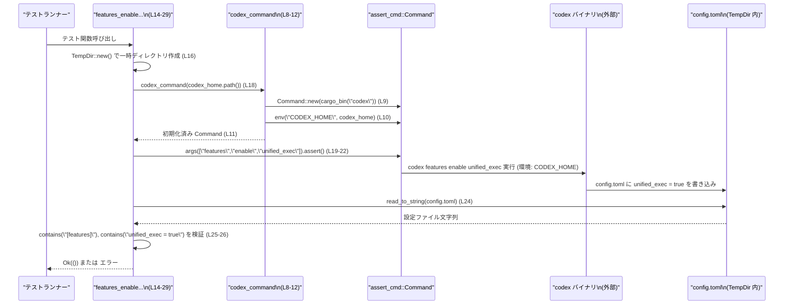

# cli/tests/features.rs コード解説

## 0. ざっくり一言

- `codex` CLI の `features` サブコマンド（有効化・無効化・一覧表示・警告表示）の挙動を、実行ファイルレベルで検証する統合テスト群です（features.rs:L14-90）。
- 一時ディレクトリと環境変数 `CODEX_HOME` を使い、実際の `config.toml` への書き込みと標準出力／標準エラーの内容を確認します（features.rs:L8-11, L16, L33, L50, L65）。

---

## 1. このモジュールの役割

### 1.1 概要

- このモジュールは **`codex` CLI の features 機能が仕様通りに動くかどうか** を検証するために存在し、次の振る舞いをテストします。
  - `features enable/disable` が `config.toml` の feature フラグを書き換えること（features.rs:L14-29, L31-46）。
  - 開発中フラグを有効化したときに警告を標準エラーに出すこと（features.rs:L48-61）。
  - `features list` の出力行が feature 名でアルファベット順にソートされていること（features.rs:L63-90）。

### 1.2 アーキテクチャ内での位置づけ

このファイルはテストコードであり、外部の `codex` バイナリとファイルシステムに依存します。

```mermaid
flowchart LR
  subgraph "features.rs (L8-90)"
    H["codex_command (L8-12)"]
    T1["enable/disable テスト\n(L14-29, L31-46)"]
    T2["開発中 feature 警告テスト\n(L48-61)"]
    T3["features list 並び順テスト\n(L63-90)"]
  end

  T1 --> H
  T2 --> H
  T3 --> H

  H --> C["assert_cmd::Command"]
  C --> B["codex バイナリ\n(外部, cargo_bin(\"codex\"))\n(features.rs:L9)"]

  B --> FS["config.toml\n(TempDir 内)\n(features.rs:L24, L41)"]
  B --> OUT["stdout/stderr\n(features.rs:L19-22, L36-39, L53-57, L69-74)"]

  T1 --> FS
  T1 --> OUT
  T2 --> OUT
  T3 --> OUT
```

- テストは `codex_utils_cargo_bin::cargo_bin("codex")` でバイナリパスを取得し（features.rs:L9）、`assert_cmd::Command` に渡してサブプロセスとして実行します。
- 子プロセスに対して環境変数 `CODEX_HOME` を設定し、一時ディレクトリ以下の `config.toml` を書き換えさせます（features.rs:L8-11, L16, L33, L50, L65）。
- 実行結果は `assert_cmd` のアサーション API と `std::fs::read_to_string` で検証されます（features.rs:L19-22, L24-26, L36-39, L41-43, L53-57, L68-75, L77-88）。

### 1.3 設計上のポイント

- **共通ヘルパ関数によるコマンド構築**
  - `codex_command` で `CODEX_HOME` 環境変数が設定された `assert_cmd::Command` を生成し、全テストで再利用しています（features.rs:L8-12）。
- **テストごとの環境隔離**
  - 各テストは `TempDir::new()` により独立した一時ディレクトリを使用し、`config.toml` への書き込みが他のテストと干渉しないようになっています（features.rs:L16, L33, L50, L65）。
- **エラー処理**
  - すべてのテスト関数は `anyhow::Result<()>` を返し、`?` 演算子でファイル I/O やコマンド生成のエラーをテストの失敗として伝播させています（features.rs:L3, L15, L32, L49, L64, L24, L41, L75）。
- **非同期テスト**
  - `#[tokio::test]` により各テストは非同期関数として定義されていますが、内部では現時点で `await` は使用されておらず、同期的な処理のみを行っています（features.rs:L14, L31, L48, L63）。

---

## 2. 主要な機能一覧（コンポーネントインベントリー）

このファイル内で定義される関数コンポーネントの一覧です。

| 名称 | 種類 | 説明 | 行範囲 |
|------|------|------|--------|
| `codex_command` | ヘルパ関数 | `CODEX_HOME` を設定した `assert_cmd::Command` を生成する | features.rs:L8-12 |
| `features_enable_writes_feature_flag_to_config` | 非同期テスト | `features enable unified_exec` が `config.toml` に `unified_exec = true` を書き込むことを検証 | features.rs:L14-29 |
| `features_disable_writes_feature_flag_to_config` | 非同期テスト | `features disable shell_tool` が `config.toml` に `shell_tool = false` を書き込むことを検証 | features.rs:L31-46 |
| `features_enable_under_development_feature_prints_warning` | 非同期テスト | 開発中 feature `runtime_metrics` を有効化すると警告が標準エラーに出ることを検証 | features.rs:L48-61 |
| `features_list_is_sorted_alphabetically_by_feature_name` | 非同期テスト | `features list` 出力が feature 名でアルファベット順にソートされていることを検証 | features.rs:L63-90 |

---

## 3. 公開 API と詳細解説

### 3.1 型一覧（構造体・列挙体など）

このファイル内で新たに定義される構造体・列挙体はありません。

- 外部型として `TempDir`（`tempfile` クレート）、`assert_cmd::Command`、`anyhow::Result` などを利用しています（features.rs:L3, L5, L6, L8, L15）。

### 3.2 関数詳細

#### `codex_command(codex_home: &Path) -> Result<assert_cmd::Command>`

**概要**

- `codex` バイナリを実行するための `assert_cmd::Command` を生成し、環境変数 `CODEX_HOME` に指定されたパスを設定して返します（features.rs:L8-11）。

**引数**

| 引数名 | 型 | 説明 |
|--------|----|------|
| `codex_home` | `&Path` | `CODEX_HOME` 環境変数として子プロセスに渡すディレクトリパス（features.rs:L8） |

**戻り値**

- `Result<assert_cmd::Command>`  
  `codex_utils_cargo_bin::cargo_bin("codex")` の結果に応じて、成功時には初期化済みの `assert_cmd::Command` を `Ok` で返し、失敗時にはそのエラーを `Err` として返します（features.rs:L8-11）。

**内部処理の流れ**

1. `codex_utils_cargo_bin::cargo_bin("codex")?` を実行し、`codex` バイナリのパスを取得します（features.rs:L9）。
2. 取得したパスを元に `assert_cmd::Command::new(...)` でコマンドオブジェクトを生成します（features.rs:L9）。
3. 生成したコマンドに対して `env("CODEX_HOME", codex_home)` で環境変数を設定します（features.rs:L10）。
4. 初期化済みの `cmd` を `Ok(cmd)` として返します（features.rs:L11）。

**Examples（使用例）**

新しいテストから `codex` CLI を呼び出すときのパターンです。

```rust
#[tokio::test]
async fn example_use_codex_command() -> anyhow::Result<()> {
    let codex_home = tempfile::TempDir::new()?;                 // 一時ディレクトリを作成
    let mut cmd = codex_command(codex_home.path())?;            // CODEX_HOME 設定済み Command を取得
    cmd.args(["features", "list"])                              // サブコマンドを指定
        .assert()
        .success();                                             // 正常終了を確認
    Ok(())
}
```

**Errors / Panics**

- `codex_utils_cargo_bin::cargo_bin("codex")` がエラーを返した場合（例: `codex` バイナリがビルドされていない）、そのエラーをそのまま `Err` として返します（features.rs:L9）。
- 関数内部では panic は発生しません（assert などは使用していません）。

**Edge cases（エッジケース）**

- `codex_home` が存在しないディレクトリを指している場合でも、ここでは存在チェックを行わず、そのまま環境変数に設定します（features.rs:L10）。
  - 実際にどのような挙動になるかは `codex` バイナリ側の実装に依存し、このチャンクからは分かりません。
- `codex_home` に非 UTF-8 パスが含まれるケースでも `Path` として扱われ、`Command.env` は `OsStr` ベースで設定するため、ここでは UTF-8 変換は行っていません。

**使用上の注意点**

- この関数はプロセスを実行せず `Command` を返すだけなので、必ず呼び出し側で `.assert()` や `.output()` などを呼んで実際に実行する必要があります（features.rs:L18-22, L35-39, L52-57, L68-73）。
- テストごとに異なる `TempDir` の `path()` を渡すことで、設定ファイル書き込みの競合を避けています（features.rs:L16, L33, L50, L65）。

---

#### `features_enable_writes_feature_flag_to_config() -> Result<()>`

**概要**

- `codex features enable unified_exec` を実行し、標準出力に有効化メッセージが出力され、かつ `config.toml` に `[features]` セクションと `unified_exec = true` が書き込まれることを検証します（features.rs:L14-29）。

**引数**

- なし（テスト関数であり、外部から値は受け取りません）。

**戻り値**

- `Result<()>`  
  一時ディレクトリの作成やファイル読み込み、UTF-8 変換などが成功すれば `Ok(())` を返し、失敗した場合は `Err` でテストを失敗させます（features.rs:L15-16, L24, L28）。

**内部処理の流れ**

1. `TempDir::new()?` で一時ディレクトリを生成します（features.rs:L16）。
2. `codex_command(codex_home.path())?` で `CODEX_HOME` をそのパスに設定したコマンドを取得します（features.rs:L18）。
3. `.args(["features", "enable", "unified_exec"])` でサブコマンドと引数を指定し（features.rs:L19）、`.assert().success()` で正常終了を期待し、`.stdout(contains(...))` で標準出力に特定メッセージが含まれることを確認します（features.rs:L20-22）。
4. `std::fs::read_to_string(codex_home.path().join("config.toml"))?` で `config.toml` を読み込み、`config.contains("[features]")` と `config.contains("unified_exec = true")` を `assert!` で確認します（features.rs:L24-26）。
5. すべて成功したら `Ok(())` で返します（features.rs:L28）。

**Examples（使用例）**

このテスト自身が「feature を有効化した結果をファイルで検証する」パターンの例です。新しい feature フラグを追加する場合も、同様のテストを追加できます。

```rust
#[tokio::test]
async fn features_enable_new_feature_writes_flag() -> anyhow::Result<()> {
    let codex_home = tempfile::TempDir::new()?;
    let mut cmd = codex_command(codex_home.path())?;
    cmd.args(["features", "enable", "new_feature"])
        .assert()
        .success();
    let config = std::fs::read_to_string(codex_home.path().join("config.toml"))?;
    assert!(config.contains("[features]"));
    assert!(config.contains("new_feature = true"));
    Ok(())
}
```

**Errors / Panics**

- `TempDir::new` が失敗すると `?` 経由で `Err` が返り、テスト全体が失敗します（features.rs:L16）。
- `codex_command` の内部で `codex` バイナリの取得が失敗した場合も `Err` が返ります（features.rs:L18）。
- `config.toml` が存在しない、または読み込めない場合 `read_to_string` がエラーとなり、`Err` でテストが失敗します（features.rs:L24）。
- `assert!` が失敗すると panic し、テストは失敗します（features.rs:L25-26）。

**Edge cases（エッジケース）**

- `config.toml` に `[features]` セクションが重複して存在する場合や、`unified_exec` 行が複数回現れる場合でも、このテストは単に `contains` 判定を行うだけであり、そのようなケースは区別しません（features.rs:L25-26）。
- 標準出力メッセージは完全一致ではなく `contains` で部分一致を見ていますが、メッセージ文字列自体は完全な固定文を期待しています（features.rs:L22）。

**使用上の注意点**

- メッセージ文言や `config.toml` のフォーマットを変更する場合、このテストも同時に更新しないと失敗する可能性があります。
- 並列実行されても、各テストが独立した `TempDir` を使用するため、`config.toml` ファイルの競合は起きにくい構造になっています（features.rs:L16）。

---

#### `features_disable_writes_feature_flag_to_config() -> Result<()>`

**概要**

- `codex features disable shell_tool` の実行により、標準出力に無効化メッセージが出力され、`config.toml` に `shell_tool = false` が書き込まれることを検証します（features.rs:L31-46）。

**内部処理の流れ**

1. `TempDir::new()?` で一時ディレクトリを作成（features.rs:L33）。
2. `codex_command` で `CODEX_HOME` を設定したコマンドを取得（features.rs:L35）。
3. `.args(["features", "disable", "shell_tool"])` を指定し、`.assert().success()` と `.stdout(contains(...))` で標準出力メッセージと終了ステータスを検証（features.rs:L36-39）。
4. `config.toml` を読み込み、`[features]` と `shell_tool = false` を `assert!` で確認（features.rs:L41-43）。
5. `Ok(())` を返す（features.rs:L45）。

**Errors / Panics**

- エラー・panic の扱いは enable テストと同様です（features.rs:L33, L35, L41-43）。

**Edge cases**

- `shell_tool` がもともと `true` か `false` かは問わず、最終的に `shell_tool = false` が含まれていればテストは成功します（features.rs:L41-43）。
- ファイル内に余分な空白やコメントがあっても `contains` が真であれば問題ありません。

**使用上の注意点**

- 「無効化」を意味する振る舞いとして `shell_tool = false` を期待しているため、もし今後 tri-state や削除など別の表現に変える場合、このテストの仕様も合わせて更新する必要があります。

---

#### `features_enable_under_development_feature_prints_warning() -> Result<()>`

**概要**

- `codex features enable runtime_metrics` を実行したときに、コマンド自体は成功しつつ、標準エラーに「開発中 feature が有効になった」という警告メッセージが出力されることを検証します（features.rs:L48-61）。

**内部処理の流れ**

1. `TempDir::new()?` で一時ディレクトリを作成（features.rs:L50）。
2. `codex_command` で `CODEX_HOME` を設定したコマンドを取得（features.rs:L52）。
3. `.args(["features", "enable", "runtime_metrics"])` を指定し、`.assert().success()` で成功終了を確認（features.rs:L53-55）。
4. `.stderr(contains("Under-development features enabled: runtime_metrics."))` で標準エラー出力の警告メッセージを確認（features.rs:L56-57）。
5. `Ok(())` を返す（features.rs:L60）。

**Errors / Panics**

- 一時ディレクトリ作成・コマンド生成の失敗は `Err` として伝播します（features.rs:L50, L52）。
- `stderr` に期待する文字列が含まれない場合、`assert_cmd` 内部でアサーションが失敗し、テストが失敗します（features.rs:L56-57）。

**Edge cases**

- このテストは `config.toml` を読み取っておらず、開発中 feature が設定にどのように記録されるかについては検証していません（features.rs:L48-61）。
- 警告メッセージは完全一致ではなく `contains` 判定のため、前後に他の文言が付加されてもテストは通りますが、文言のコア部分は固定文字列を期待しています（features.rs:L56-57）。

**使用上の注意点**

- 開発中 feature の名称や警告メッセージフォーマットを変更する場合、このテストの期待文字列も同期して変更する必要があります。

---

#### `features_list_is_sorted_alphabetically_by_feature_name() -> Result<()>`

**概要**

- `codex features list` の標準出力をパースし、各行の **feature 名カラム** がアルファベット順にソートされていることを検証します（features.rs:L63-90）。

**内部処理の流れ（アルゴリズム）**

1. `TempDir::new()?` で一時ディレクトリを作成（features.rs:L65）。
2. `codex_command` で `CODEX_HOME` を設定したコマンドを取得（features.rs:L67）。
3. `.args(["features", "list"]).assert().success().get_output().stdout.clone()` で `features list` の標準出力のバイト列を取得します（features.rs:L68-74）。
4. `String::from_utf8(output)?` で UTF-8 文字列に変換します（features.rs:L75）。
5. `stdout.lines()` で行ごとのイテレータを得て、各行について次を実行します（features.rs:L77-83）:
   - `line.split_once("  ")` で `"  "`（スペース 2 つ）を区切りとして最初のカラムと残りに分割。
   - 成功した場合、前半を `name` として取り出し、`name.trim_end().to_string()` で末尾の空白を取り除いて `String` に変換。
   - `split_once` が `None` を返した場合は `expect("feature list output should contain aligned columns")` で panic させます。
6. こうして得られた `actual_names` ベクタをコピーして `expected_names` を作り、`expected_names.sort()` でソート（features.rs:L85-86）。
7. `assert_eq!(actual_names, expected_names)` で、元の順序がソート済みかどうかを検証します（features.rs:L88）。

**Examples（使用例）**

`features list` の出力整形仕様を変えた場合、このテストのパース部分を次のように調整できます。

```rust
// 例: カンマ区切り形式になった場合のパース例
let actual_names = stdout
    .lines()
    .map(|line| {
        line.split(',')
            .next()
            .unwrap_or("")
            .trim_end()
            .to_string()
    })
    .collect::<Vec<_>>();
```

**Errors / Panics**

- 標準出力が UTF-8 でない場合、`String::from_utf8` がエラーを返し、テストは `Err` で失敗します（features.rs:L75）。
- 各行に `"  "`（スペース 2 つ）が含まれない場合、`split_once` が `None` を返し、`expect(...)` により panic します（features.rs:L80-82）。
- `expected_names.sort()` 後に `assert_eq!` が失敗すると panic し、テスト失敗になります（features.rs:L85-88）。

**Edge cases（エッジケース）**

- 空行が標準出力に含まれる場合、その行にも `"  "` が含まれていないと `expect` で panic します（features.rs:L77-83）。
- 同名の feature が複数行に出力されると、ソート結果と元の結果が一致するため、テストはその重複を検出しません（features.rs:L85-88）。
- `features list` の出力にヘッダ行やフッタ行が混在する場合でも、それらが `"  "` 区切りの形式であればテスト対象として扱われます。

**使用上の注意点**

- 出力フォーマットに強く依存しており、「名前カラムと説明カラムの間にスペース 2 つで揃えた列」があるという前提で組まれています（features.rs:L80-82）。
- より堅牢にするには、`features list --format json` のような機械可読フォーマットがあればそれを用いる設計も考えられますが、このファイルからはその有無は分かりません。

---

### 3.3 その他の関数

- このファイルには、上記以外の補助関数や単純なラッパー関数は定義されていません。

---

## 4. データフロー

`features enable unified_exec` テストを例に、データと制御の流れを示します。

### 処理の要点

- テストランナーが `features_enable_writes_feature_flag_to_config` を呼び出し、一時ディレクトリを作成した上で `codex` をサブプロセスとして起動します（features.rs:L14-19）。
- サブプロセスは `CODEX_HOME` 環境変数を参照して `config.toml` を書き込み、その内容をテストが読み出して検証します（features.rs:L10, L19-22, L24-26）。



- 他のテストも同様に `codex_command` を通じてコマンドを構築し、標準出力／標準エラーや `config.toml` を観測対象としています（features.rs:L31-46, L48-61, L63-90）。

---

## 5. 使い方（How to Use）

このファイル自体はテストですが、`codex` CLI に対する統合テストの書き方の雛形として利用できます。

### 5.1 基本的な使用方法

新しい features 関連コマンドのテストを追加する場合の基本フローです。

```rust
#[tokio::test]
async fn my_new_feature_test() -> anyhow::Result<()> {
    // 一時ディレクトリを用意（テストごとに独立した環境） (L16, L33, L50, L65 と同様)
    let codex_home = tempfile::TempDir::new()?;

    // CODEX_HOME を設定した Command を作成 (L18, L35, L52, L67 と同様)
    let mut cmd = codex_command(codex_home.path())?;

    // 実行したいサブコマンドと引数を設定
    cmd.args(["features", "my-subcommand"])
        .assert()
        .success(); // 正常終了を確認

    // 必要に応じて stdout/stderr や config.toml を検証
    // 例: ファイル出力を検証
    let config = std::fs::read_to_string(codex_home.path().join("config.toml"))?;
    assert!(config.contains("some_expected_content"));

    Ok(())
}
```

### 5.2 よくある使用パターン

1. **設定ファイルの書き込みを検証するパターン**

   `enable` / `disable` テストと同様に、ファイル内容を文字列として読み込んで `contains` で確認します（features.rs:L24-26, L41-43）。

   ```rust
   let config = std::fs::read_to_string(codex_home.path().join("config.toml"))?;
   assert!(config.contains("feature_x = true"));
   ```

2. **警告やエラーメッセージを検証するパターン**

   `stderr(contains(...))` を用いて標準エラーを検証します（features.rs:L53-57）。

   ```rust
   cmd.args(["features", "enable", "unstable_feature"])
       .assert()
       .success()
       .stderr(contains("Under-development features enabled: unstable_feature."));
   ```

3. **出力のソートや整形を検証するパターン**

   標準出力のバイト列を取得し、UTF-8 文字列に変換してからロジックで検証します（features.rs:L68-75, L77-88）。

   ```rust
   let output = cmd.args(["features", "list"])
       .assert()
       .success()
       .get_output()
       .stdout
       .clone();
   let stdout = String::from_utf8(output)?;
   // stdout.lines() で行単位に処理
   ```

### 5.3 よくある間違い

```rust
// 誤り例: CODEX_HOME を設定せずに実行してしまう
let mut cmd = assert_cmd::Command::new("codex");
cmd.args(["features", "enable", "unified_exec"])
    .assert()
    .success();

// 正しい例: codex_command を通じて CODEX_HOME を設定
let codex_home = tempfile::TempDir::new()?;
let mut cmd = codex_command(codex_home.path())?;
cmd.args(["features", "enable", "unified_exec"])
    .assert()
    .success();
```

- 上記の誤り例では、`codex` がユーザの実際の設定ディレクトリを操作してしまう可能性がありますが、`codex_command` を使えば一時ディレクトリ以下の `config.toml` のみに影響を限定できます（features.rs:L8-11）。

```rust
// 誤り例: features list の出力形式を考慮しない単純な split
for line in stdout.lines() {
    let cols: Vec<_> = line.split(' ').collect();
    // 可変な空白数に弱く、列揃えの情報を失う

// 正しい例: このファイルで使われている「スペース2つ」で分割する前提を反映
for line in stdout.lines() {
    let (name, _rest) = line
        .split_once("  ")
        .expect("feature list output should contain aligned columns");
}
```

- 出力形式に依存するテストを書く場合は、このファイルのように前提を明示するメッセージを `expect` に書いておくと、フォーマット変更時に原因を特定しやすくなります（features.rs:L80-82）。

### 5.4 使用上の注意点（まとめ・安全性/エラー/並行性）

- **安全性（Bugs/Security 観点）**
  - `TempDir::new()` により OS の一時ディレクトリ配下にテスト専用ディレクトリを作成し、そこにのみ `config.toml` を生成させる設計であるため、通常はユーザ本来の設定ファイルを破壊するリスクを避けています（features.rs:L16, L33, L50, L65）。
  - `CODEX_HOME` を明示的に設定しているため、`codex` バイナリがこの環境変数を尊重する設計である限り、テストの作用範囲は限定されます（features.rs:L8-11）。
- **エラー処理**
  - すべてのテストが `anyhow::Result<()>` を返しており、`?` で早期リターンするため、ファイル I/O などの失敗は即座にテスト失敗として表面化します（features.rs:L15, L32, L49, L64, L24, L41, L75）。
  - 出力フォーマットの前提が破れた場合には、`expect` のメッセージにより原因が比較的明確に表示されます（features.rs:L80-82）。
- **並行性（Concurrency）**
  - 各テストは独立した `TempDir` と子プロセスを使用し、グローバル状態を共有していません（features.rs:L16, L33, L50, L65）。そのため、テストハーネスがテストを並列実行してもファイルパスの衝突は起こりにくい構造です。
  - 環境変数 `CODEX_HOME` は各子プロセスに対してのみ設定され、親プロセスや他のテストプロセスに影響を与えません（`Command.env` を使用、features.rs:L10）。
- **パフォーマンス**
  - 実バイナリを起動する統合テストであるため、単体テストに比べて実行コストが高くなりますが、テスト数は 4 件であり、このファイル単体のスケーラビリティ上の問題は小さいと考えられます。

---

## 6. 変更の仕方（How to Modify）

### 6.1 新しい機能を追加する場合

`features` サブコマンドに新しい機能を追加し、その挙動をテストしたい場合の一般的な手順です。

1. **振る舞いの種類を決める**
   - 設定ファイルを書き換えるのか、標準出力/標準エラーのメッセージを出すのか、あるいはその両方かを整理します。
2. **テスト雛形の選択**
   - 設定変更であれば `features_enable_writes_feature_flag_to_config` / `features_disable_writes_feature_flag_to_config`（features.rs:L14-29, L31-46）。
   - 警告メッセージであれば `features_enable_under_development_feature_prints_warning`（features.rs:L48-61）。
   - 出力整形や順序の検証であれば `features_list_is_sorted_alphabetically_by_feature_name`（features.rs:L63-90）。
3. **新しいテスト関数の追加**
   - 上記いずれかをコピーし、`args([...])` や `contains(...)` の期待値、`config` の検証条件を目的に応じて変更します。
4. **一時ディレクトリと `codex_command` の利用を維持**
   - どのテストでも `TempDir::new()?` と `codex_command(codex_home.path())?` のパターンを保ち、環境を分離します（features.rs:L16, L18, L33, L35, L50, L52, L65, L67）。

### 6.2 既存の機能を変更する場合

`codex` の出力フォーマットや feature の扱いを変更する際に、このテストファイルを安全に更新するための観点です。

- **影響範囲の確認**
  - 出力メッセージ文言を変更する場合:
    - `.stdout(contains(...))` / `.stderr(contains(...))` の文字列リテラルを検索し、すべての該当箇所を更新します（features.rs:L22, L39, L56-57）。
  - `config.toml` の構造を変更する場合:
    - `config.contains("[features]")` および具体的なキー行の `contains` を見直します（features.rs:L25-26, L42-43）。
  - `features list` の出力形式を変更する場合:
    - `"  "` 区切りやソート前提に依存している部分を重点的に修正します（features.rs:L77-83, L85-88）。
- **前提条件・契約の維持**
  - このテストは、「`features enable/disable` は成功終了コードを返す」「`features list` は UTF-8 のテキストを出力する」という契約を仮定しています（features.rs:L19-22, L36-39, L55, L68-75）。
  - これらの契約を変える場合は、CLI の仕様書とテストコードをあわせて更新する必要があります。
- **関連テストの再確認**
  - 機能追加・変更に伴い、エラーケース（無効な feature 名、権限不足など）のテストが不足していないかを別途検討すると、回帰防止に有用です。このファイルには現在、成功系のみが含まれています（features.rs:L14-90）。

---

## 7. 関連ファイル

このモジュールと密接に関係するが、このチャンクには定義が現れないコンポーネントを含めて整理します。

| パス / コンポーネント | 役割 / 関係 |
|-----------------------|------------|
| `cli/tests/features.rs` | 本ファイル。`codex` CLI の `features` サブコマンドの統合テストを提供します。 |
| `codex` バイナリ実装（ソースパス不明） | `codex_utils_cargo_bin::cargo_bin("codex")` で呼び出される実行ファイル。`features` サブコマンドの実装を含みますが、このチャンクにはソースファイルは現れません（features.rs:L9）。 |
| `codex_utils_cargo_bin` クレート（詳細パス不明） | `cargo_bin("codex")` を提供し、テストから `codex` 実行ファイルへのパス解決を行います（features.rs:L9）。 |
| `config.toml`（実ファイル、TempDir 内に生成） | `codex` バイナリの実行によって作成・更新される設定ファイル。テストはこのファイルの内容を検証対象としています（features.rs:L24, L41）。 |

このチャンク内には、`codex` 本体や設定ファイルの読み書きロジックの実装ファイルは現れないため、それらの内部仕様や型構造については不明です。
