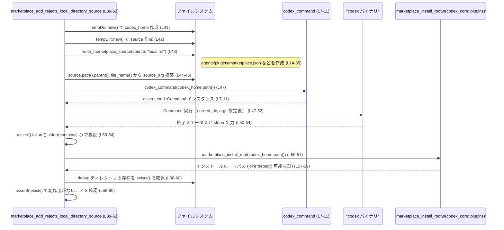

# cli/tests/marketplace_add.rs

## 0. ざっくり一言

CLI サブコマンド `codex marketplace add` に対して、「ローカルディレクトリをマーケットプレイスソースとして渡した場合は拒否されること」を検証する非同期テストと、そのための補助関数を定義しているファイルです（cli/tests/marketplace_add.rs:L7-37, L39-62）。

---

## 1. このモジュールの役割

### 1.1 概要

- このモジュールは、Codex CLI のマーケットプレイス機能に対して「ローカルディレクトリをソースにすることは許可されていない」という仕様をテストで保証するために存在しています（cli/tests/marketplace_add.rs:L39-62）。
- テスト対象の CLI バイナリを起動するためのコマンド生成ユーティリティ（`codex_command`）と、ローカルマーケットプレイス構造を一時ディレクトリ上に作るユーティリティ（`write_marketplace_source`）を提供します（cli/tests/marketplace_add.rs:L7-11, L13-37）。
- 非同期テスト（`#[tokio::test]`）として書かれており、Tokio ランタイム上で CLI プロセスを実行します（cli/tests/marketplace_add.rs:L39-40）。

### 1.2 アーキテクチャ内での位置づけ

このテストモジュールが、外部コンポーネントとどう関係しているかを簡略化した依存関係図です。

```mermaid
graph TD
    T["marketplace_add_rejects_local_directory_source (L39-62)"]
    T --> C["codex_command (L7-11)"]
    T --> W["write_marketplace_source (L13-37)"]
    T --> MIR["marketplace_install_root\n(codex_core::plugins)"]
    T --> TD["TempDir\n(tempfile)"]
    C --> AC["assert_cmd::Command\n(assert_cmd)"]
    C --> CBin["codex_utils_cargo_bin::cargo_bin(\"codex\")"]
    T --> Pred["predicates::str::contains"]
```

- テスト本体 `marketplace_add_rejects_local_directory_source` が中心で、`TempDir` を用いて一時ディレクトリを作り、`write_marketplace_source` でそこにマーケットプレイス定義ファイルを生成します（cli/tests/marketplace_add.rs:L41-43）。
- CLI 実行は `codex_command` で `assert_cmd::Command` を構築して行い、その標準エラー出力を `predicates::str::contains` で検証します（cli/tests/marketplace_add.rs:L7-11, L47-54）。
- CLI 実行後、`codex_core::plugins::marketplace_install_root` によりインストールディレクトリを取得し、「debug」マーケットプレイスがインストールされていないことを確認します（cli/tests/marketplace_add.rs:L56-60）。

### 1.3 設計上のポイント

- **責務分割**  
  - CLI コマンド構築（`codex_command`）とテストデータ生成（`write_marketplace_source`）を別関数に切り出し、テスト本体の見通しを良くしています（cli/tests/marketplace_add.rs:L7-11, L13-37）。
- **エラーハンドリング**  
  - すべての関数は `anyhow::Result` を返し、`?` 演算子で I/O や外部呼び出し失敗を伝播させる構造になっています（cli/tests/marketplace_add.rs:L7, L13, L40）。
- **非同期実行**  
  - テストは `#[tokio::test]` でマークされており、Tokio ランタイム上の非同期コンテキストで実行されます（cli/tests/marketplace_add.rs:L39-40）。本テストの中身自体は同期 API しか呼んでいませんが、CLI の内部実装が非同期である前提と整合しています。
- **安全性・検証観点**  
  - CLI が「ローカルディレクトリベースのマーケットプレイスソース」を拒否し、かつ副作用として何もインストールしないこと（`debug` ディレクトリが作られない）を検証することで、仕様上の安全性（意図しないローカルコードの読み込み防止）をテストしています（cli/tests/marketplace_add.rs:L52-54, L56-60）。
- **潜在的なパニック箇所**  
  - `source.path().parent().unwrap()` および `file_name().unwrap()` で `unwrap` を使用しており、`parent()` または `file_name()` が `None` を返した場合はパニックになります（cli/tests/marketplace_add.rs:L44-45）。`TempDir` のパス構造を前提とした書き方になっています。

---

## 2. 主要な機能一覧（コンポーネントインベントリー）

### 2.1 関数・テスト一覧

このファイル内で定義されている関数とテストの一覧です。

| 種別 | 名前 | 役割 / 概要 | 所在 (行範囲) |
|------|------|------------|----------------|
| 関数 | `codex_command` | `CODEX_HOME` 環境変数を設定した `assert_cmd::Command` を構築し、Codex CLI バイナリ呼び出しの土台を作るユーティリティです。 | cli/tests/marketplace_add.rs:L7-11 |
| 関数 | `write_marketplace_source` | 指定ディレクトリ以下にマーケットプレイス設定とサンプルプラグイン構造、およびマーカーとなるテキストファイルを生成するユーティリティです。 | cli/tests/marketplace_add.rs:L13-37 |
| テスト（非同期関数） | `marketplace_add_rejects_local_directory_source` | ローカルディレクトリをソースとして `codex marketplace add` が実行されたとき、エラー終了し、適切なメッセージを出し、かつマーケットプレイスがインストールされないことを検証する非同期テストです。 | cli/tests/marketplace_add.rs:L39-62 |

### 2.2 主な外部依存コンポーネント

このファイルから見える範囲で利用されている外部コンポーネントです。

| 名前 | 種別 | 定義元 | 用途 / 関係 | 使用行 |
|------|------|--------|-------------|--------|
| `Result` | 型エイリアス | `anyhow` クレート | エラーを内包した戻り値として使用。具体的なエラー型は `anyhow` 由来で、このファイル内では詳細不明です。 | cli/tests/marketplace_add.rs:L1, L7, L13, L40 |
| `marketplace_install_root` | 関数 | `codex_core::plugins` | マーケットプレイスのインストールルートパスを取得する関数と解釈できます。戻り値の具体的型は不明ですが、`join` と `exists` が呼べるパス型です。 | cli/tests/marketplace_add.rs:L2, L56-60 |
| `contains` | 関数 / プレディケート生成 | `predicates::str` | 標準エラー出力に特定の文字列が含まれているかどうかを検査するプレディケートを生成します。 | cli/tests/marketplace_add.rs:L3, L52-54 |
| `Path` | 構造体 | `std::path` | ファイルパスを借用として扱うために使用しています。 | cli/tests/marketplace_add.rs:L4, L7, L13 |
| `TempDir` | 構造体 | `tempfile` クレート | 一時ディレクトリを表す型と考えられ、テスト用に隔離された作業ディレクトリを用意するために使われます。詳細な挙動はこのファイルからは不明です。 | cli/tests/marketplace_add.rs:L5, L41-42 |
| `assert_cmd::Command` | 構造体 | `assert_cmd` クレート | 外部コマンド（この場合は Codex CLI）をテストから起動し、終了ステータスや出力を検証するためのラッパーです。 | cli/tests/marketplace_add.rs:L7-11, L47-52 |
| `codex_utils_cargo_bin::cargo_bin` | 関数 | 別クレート（パスから推測） | `"codex"` という名前のテスト対象バイナリのパスを解決する関数と推測されますが、挙動詳細はこのファイルからは不明です。 | cli/tests/marketplace_add.rs:L8 |

---

## 3. 公開 API と詳細解説

### 3.1 型一覧（構造体・列挙体など）

このファイル内で新たに定義されている型（構造体・列挙体など）はありません（cli/tests/marketplace_add.rs 全体）。  
以下は、このテストで特に重要な外部型の整理です。

| 名前 | 種別 | 定義元 | 役割 / 用途 | 使用行 |
|------|------|--------|-------------|--------|
| `&Path` | 参照 | `std::path::Path` | ファイルシステム上のパスを借用参照として受け渡すために使用しています。`codex_home` や `source` のような一時ディレクトリのパスを表します。 | cli/tests/marketplace_add.rs:L7, L13 |
| `TempDir` | 構造体 | `tempfile` | 一時ディレクトリのハンドルを表す型です。`path()` メソッドでディレクトリパスへの参照を取得しています。詳細なライフサイクル管理はこのファイルからは不明です。 | cli/tests/marketplace_add.rs:L41-42 |
| `assert_cmd::Command` | 構造体 | `assert_cmd` | 外部プログラム起動と結果アサーションを行うためのコマンドビルダです。ここでは Codex CLI を起動するために使用しています。 | cli/tests/marketplace_add.rs:L7-11, L47-52 |

### 3.2 関数詳細

#### `codex_command(codex_home: &Path) -> Result<assert_cmd::Command>`

**概要**

指定された `codex_home` ディレクトリを `CODEX_HOME` 環境変数として設定した状態の `assert_cmd::Command` を生成し、Codex CLI バイナリを呼び出すための土台を構築する関数です（cli/tests/marketplace_add.rs:L7-11）。

**引数**

| 引数名 | 型 | 説明 |
|--------|----|------|
| `codex_home` | `&Path` | Codex がホームディレクトリとして利用するパス。テスト側で `TempDir` により用意した隔離ディレクトリのパスを渡しています（cli/tests/marketplace_add.rs:L7, L41）。 |

**戻り値**

- `Result<assert_cmd::Command>`  
  - 成功時は、`codex` バイナリを起動するよう初期化された `assert_cmd::Command` を返します（cli/tests/marketplace_add.rs:L8-10）。
  - 失敗時は `anyhow` 由来のエラーを含む `Err` を返します。具体的なエラー型内部はこのファイルからは不明です（cli/tests/marketplace_add.rs:L1, L8）。

**内部処理の流れ**

1. `codex_utils_cargo_bin::cargo_bin("codex")` を呼び出し、`codex` という名前のバイナリのパスを取得しようとします（cli/tests/marketplace_add.rs:L8）。
2. そのパスを引数に `assert_cmd::Command::new(...)` を呼び出し、外部コマンドオブジェクトを生成します（cli/tests/marketplace_add.rs:L8）。
3. 生成したコマンドに対して `.env("CODEX_HOME", codex_home)` を設定し、Codex CLI 実行時に `CODEX_HOME` 環境変数が指定されたディレクトリを指すようにします（cli/tests/marketplace_add.rs:L9）。
4. 最後に `Ok(cmd)` でコマンドを `Result` で包んで返します（cli/tests/marketplace_add.rs:L10）。

**Examples（使用例）**

この関数はテスト内で次のように使われています（cli/tests/marketplace_add.rs:L47-49）。

```rust
// 一時ディレクトリとして codex_home を生成する                          // Codex のホームディレクトリ用 TempDir を作成
let codex_home = TempDir::new()?;                                          // エラー時は ? でテストごと失敗

// codex_home.path() を渡して codex CLI コマンドを構築する               // TempDir から Path を取得してコマンド生成
codex_command(codex_home.path())?                                          // CODEX_HOME 環境変数が設定された Command を取得
    .current_dir(source_parent)                                            // カレントディレクトリをテスト用ソースの親に設定
    .args(["marketplace", "add", source_arg.as_str()])                     // `marketplace add ./<dir>` 引数を設定
    .assert()                                                              // コマンドを実行し、アサーションビルダを取得
    .failure();                                                            // 失敗終了（非 0 終了コード）であることを検証
```

**Errors / Panics**

- `codex_utils_cargo_bin::cargo_bin("codex")` がエラーを返した場合、`?` により `codex_command` から `Err` が返されます（cli/tests/marketplace_add.rs:L8）。  
  エラー内容はこのファイルからは不明ですが、通常はバイナリが見つからないなどの状況が想定されます。
- この関数内で明示的な `panic!` や `unwrap` は使用されていません（cli/tests/marketplace_add.rs:L7-11）。

**Edge cases（エッジケース）**

- `codex_home` が存在しないパスであっても、ここでは単に環境変数に設定するだけなので、この関数自体は成功します（cli/tests/marketplace_add.rs:L9）。存在チェックは行っていません。
- `codex_home` に不正な文字を含むパスが渡された場合の挙動は、`assert_cmd` および OS の環境変数処理に依存し、このファイルからは不明です。

**使用上の注意点**

- `codex_home` は Codex CLI が期待するディレクトリ構造を持つ必要があります。そうでない場合、CLI 本体の中でエラーが発生する可能性がありますが、この関数はそれを検査しません。
- テストを並列実行する場合でも、各テストで別々の `TempDir` を渡すことで、`CODEX_HOME` が衝突しないようにする前提になっています（cli/tests/marketplace_add.rs:L41）。

---

#### `write_marketplace_source(source: &Path, marker: &str) -> Result<()>`

**概要**

`source` で指定されたディレクトリ以下に、マーケットプレイス設定ファイル（`marketplace.json`）、サンプルプラグインのメタデータファイル（`plugin.json`）、および任意の内容を持つマーカー用テキストファイル（`marker.txt`）を生成します（cli/tests/marketplace_add.rs:L13-37）。  
Codex CLI にとって「ローカルマーケットプレイスソース」となるディレクトリ構造を整える役割を持ちます。

**引数**

| 引数名 | 型 | 説明 |
|--------|----|------|
| `source` | `&Path` | マーケットプレイスソースのルートディレクトリのパス。`TempDir` から取得したパスが渡されています（cli/tests/marketplace_add.rs:L13, L42-43）。 |
| `marker` | `&str` | `plugins/sample/marker.txt` に書き込まれるテキスト。テストでは `"local ref"` が渡され、ローカル参照であることを示すマーカーとして使われています（cli/tests/marketplace_add.rs:L13, L43）。 |

**戻り値**

- `Result<()>`  
  - すべてのディレクトリ作成とファイル書き込みが成功すれば `Ok(())` を返します（cli/tests/marketplace_add.rs:L36）。
  - 途中の I/O 操作でエラーが発生した場合は `Err` を返し、その時点で処理を中断します（cli/tests/marketplace_add.rs:L14-16, L30-35）。

**内部処理の流れ**

1. `source/.agents/plugins` ディレクトリを `create_dir_all` で作成します（cli/tests/marketplace_add.rs:L14）。
2. `source/plugins/sample/.codex-plugin` ディレクトリを `create_dir_all` で作成します（cli/tests/marketplace_add.rs:L15）。
3. `.agents/plugins/marketplace.json` に、次のような JSON を書き込みます（cli/tests/marketplace_add.rs:L16-30）。
   - `"name": "debug"`（マーケットプレイス名）
   - `"plugins"` 配列に `"sample"` プラグインが 1 つ定義され、その `"source"` が `"local"` かつ `"path": "./plugins/sample"` として指定されています（cli/tests/marketplace_add.rs:L18-27）。
4. `plugins/sample/.codex-plugin/plugin.json` に `{"name":"sample"}` という JSON を書き込みます（cli/tests/marketplace_add.rs:L31-34）。
5. `plugins/sample/marker.txt` に、`marker` 引数で渡された文字列を書き込みます（cli/tests/marketplace_add.rs:L35）。
6. 最後に `Ok(())` を返して処理を終了します（cli/tests/marketplace_add.rs:L36）。

**Examples（使用例）**

テスト内での実際の呼び出しは以下の通りです（cli/tests/marketplace_add.rs:L42-43）。

```rust
// マーケットプレイスソース用の一時ディレクトリを作成する               // ローカルソース配置用 TempDir
let source = TempDir::new()?;                                             // エラー時はテスト全体が失敗

// "local ref" というマーカーを含んだマーケットプレイス構造を作る       // ローカルディレクトリ参照であることを示すマーカー
write_marketplace_source(source.path(), "local ref")?;                    // 失敗時は ? でテストから早期リターン
```

**Errors / Panics**

- `create_dir_all` や `write` が失敗した場合（パーミッションエラー、ディスクフルなど）、それぞれ `?` により `Err` が関数から返されます（cli/tests/marketplace_add.rs:L14-16, L30-35）。
- 関数内部で `unwrap` や明示的な `panic!` は使用していません（cli/tests/marketplace_add.rs:L13-37）。

**Edge cases（エッジケース）**

- `source` が存在しない親ディレクトリを指している場合でも、`create_dir_all` は必要に応じてディレクトリを作成するため、この関数は成功する可能性があります（cli/tests/marketplace_add.rs:L14-15）。
- `marker` が空文字列の場合でも `marker.txt` は作成され、空ファイルになります（cli/tests/marketplace_add.rs:L35）。
- 既に同名ファイル・ディレクトリが存在する場合の挙動は OS と `std::fs` の仕様に依存しますが、この関数としては上書きや成功/失敗の詳細を制御していません（cli/tests/marketplace_add.rs:L14-16, L30-35）。

**使用上の注意点**

- `source` ディレクトリ配下の既存ファイルがある場合、それらが上書きされる可能性があります。特に `.agents/plugins/marketplace.json` や `plugins/sample/.codex-plugin/plugin.json` は無条件に書き込みを行っています（cli/tests/marketplace_add.rs:L16-35）。
- テスト専用のユーティリティとして設計されているため、本番コードから直接利用することは想定されていないと解釈できます（関数が `pub` ではない、tests ディレクトリにある、などの文脈からの推測です）。

---

#### `marketplace_add_rejects_local_directory_source() -> Result<()>` （`#[tokio::test]`）

**概要**

Codex CLI の `marketplace add` サブコマンドにローカルディレクトリを渡した際に、

1. コマンドが失敗ステータスで終了すること、
2. エラーメッセージに「ローカルマーケットプレイスソースはまだサポートされない」旨が含まれること、
3. `debug` というマーケットプレイスがインストールされていないこと、

を検証する非同期テストです（cli/tests/marketplace_add.rs:L39-62）。

**引数**

- なし。

**戻り値**

- `Result<()>`  
  - テストが正常に完了した場合は `Ok(())` を返します（cli/tests/marketplace_add.rs:L62）。
  - テスト内で使用している I/O 操作や一時ディレクトリ生成、CLI 起動の準備などでエラーが起きた場合は `Err` が返り、テストが失敗扱いになります（cli/tests/marketplace_add.rs:L41-43, L47）。

**内部処理の流れ（アルゴリズム）**

1. `codex_home` 用の一時ディレクトリを生成します（cli/tests/marketplace_add.rs:L41）。
2. マーケットプレイスソース用の一時ディレクトリ `source` を生成します（cli/tests/marketplace_add.rs:L42）。
3. `write_marketplace_source(source.path(), "local ref")` を呼び出し、ローカルディレクトリソースを表すマーケットプレイス構造を作成します（cli/tests/marketplace_add.rs:L43）。
4. `source` の親ディレクトリを取り出し（`source_parent`）、その子ディレクトリ名のみを相対パスとして扱えるように `source_arg`（例: `"./tmp1234"`）を組み立てます（cli/tests/marketplace_add.rs:L44-45）。
5. `codex_command(codex_home.path())?` で Codex CLI 実行用のコマンドを取得し、以下を設定して実行・検証します（cli/tests/marketplace_add.rs:L47-52）。
   - `.current_dir(source_parent)` でカレントディレクトリを `source` の親に設定。
   - `.args(["marketplace", "add", source_arg.as_str()])` で CLI 引数を設定。
   - `.assert().failure()` で、プロセスが失敗ステータスで終了することを検証。
   - `.stderr(contains("local marketplace sources are not supported yet; ..."))` で、標準エラー出力に特定のエラーメッセージが含まれることを検証。
6. CLI 実行後、`marketplace_install_root(codex_home.path()).join("debug").exists()` を評価し、`debug` というマーケットプレイスがインストールされていない（`exists() == false`）ことを `assert!` で確認します（cli/tests/marketplace_add.rs:L56-60）。
7. 最後に `Ok(())` を返してテストを終了します（cli/tests/marketplace_add.rs:L62）。

**Examples（使用例）**

この関数自体が `#[tokio::test]` でマークされたエントリポイントであり、`cargo test` などで直接実行されます。類似のテストを書く場合の雛形例を示します。

```rust
#[tokio::test]                                                    // Tokio ランタイム上で動く非同期テストであることを示す
async fn another_marketplace_test() -> Result<()> {               // anyhow::Result<()> を返すテスト関数
    let codex_home = TempDir::new()?;                             // Codex ホーム用の一時ディレクトリ
    let source = TempDir::new()?;                                 // マーケットプレイスソース用の一時ディレクトリ

    write_marketplace_source(source.path(), "some marker")?;      // 必要に応じてマーケットプレイス構造を用意

    let source_parent = source.path().parent().unwrap();          // 親ディレクトリを取得（TempDir のパスを前提）
    let source_arg = format!("./{}",                              // `./<dirname>` 形式の相対パスを作成
        source.path().file_name().unwrap().to_string_lossy()
    );

    codex_command(codex_home.path())?                             // Codex CLI コマンドを構築
        .current_dir(source_parent)                               // カレントディレクトリを設定
        .args(["marketplace", "add", source_arg.as_str()])        // 引数を設定
        .assert()
        .failure();                                               // 好きな条件で .success() などに変えることも可能

    Ok(())                                                        // テスト成功
}
```

**Errors / Panics**

- `TempDir::new()` が失敗した場合、`?` によりテスト関数から `Err` が返され、テストは失敗します（cli/tests/marketplace_add.rs:L41-42）。
- `write_marketplace_source` 内部のファイル操作が失敗した場合も同様にテストは早期に失敗します（cli/tests/marketplace_add.rs:L43）。
- `source.path().parent().unwrap()` は、`parent()` が `None` を返した場合にパニックします（cli/tests/marketplace_add.rs:L44）。
- `source.path().file_name().unwrap()` も同様に、`file_name()` が `None` の場合にパニックします（cli/tests/marketplace_add.rs:L45）。
- `assert!(!marketplace_install_root(...).join("debug").exists())` が `false` の場合、すなわち `debug` ディレクトリが存在していた場合にパニックし、テスト失敗となります（cli/tests/marketplace_add.rs:L56-60）。

**Edge cases（エッジケース）**

- CLI 側が仕様変更によりローカルディレクトリをサポートするようになった場合、このテストは `.failure()` やエラーメッセージの検査で失敗するようになります（cli/tests/marketplace_add.rs:L50-54）。
- CLI がエラー時にも `debug` ディレクトリだけは作成するような実装に変わった場合、後半の `assert!` によりテストが失敗します（cli/tests/marketplace_add.rs:L56-60）。
- エラーメッセージは部分一致で検証しているため、文言が一部変わるとテストが壊れる可能性があります（cli/tests/marketplace_add.rs:L52-54）。

**使用上の注意点**

- `unwrap` に依存しているため、`TempDir` のパス構造（親が存在し、ファイル名部分があること）を前提としたテストになっています。異なるパス生成ロジックに差し替える場合は、この前提を再検討する必要があります（cli/tests/marketplace_add.rs:L44-45）。
- このテストは CLI プロセスを実際に起動するため、実行時間は純粋なユニットテストより長くなる可能性があります。大量の類似テストを追加する場合、全体のテスト時間への影響に注意が必要です。
- 非同期テストですが、現状はテスト内で `.await` を呼んでいません。非同期 API を使うように拡張する際は、エラーハンドリングと `.await` の位置に注意する必要があります（cli/tests/marketplace_add.rs:L39-40）。

---

### 3.3 その他の関数

このファイル内には、上記 3 つ以外に関数定義はありません（cli/tests/marketplace_add.rs 全体）。

---

## 4. データフロー

### 4.1 処理シナリオの概要

代表的なシナリオは、非同期テスト `marketplace_add_rejects_local_directory_source` が、

1. 一時ディレクトリ群を用意し、
2. ローカルマーケットプレイス構造を生成し、
3. Codex CLI の `marketplace add` サブコマンドを実行し、
4. エラーメッセージとファイルシステムの状態を検証する、

という流れです（cli/tests/marketplace_add.rs:L41-60）。

### 4.2 シーケンス図



この図から分かるように、

- データ（パス）は `TempDir` → `write_marketplace_source` → CLI プロセス、および `marketplace_install_root` との間で受け渡されています（cli/tests/marketplace_add.rs:L41-45, L56-59）。
- エラー検証は `assert_cmd` のチェーン API と `predicates::str::contains` によって、プロセスの終了ステータスと標準エラー出力に対して行われています（cli/tests/marketplace_add.rs:L50-54）。

---

## 5. 使い方（How to Use）

このモジュールはテストコードであるため、「使い方」は主に「同様の CLI テストを書くときのパターン」という意味になります。

### 5.1 基本的な使用方法

1. `TempDir` でホームディレクトリや入力ディレクトリを準備する（cli/tests/marketplace_add.rs:L41-42）。
2. 必要であれば `write_marketplace_source` のようなユーティリティでディレクトリ構造や設定ファイルを構築する（cli/tests/marketplace_add.rs:L43）。
3. `codex_command` で CLI コマンドを構築し、`assert_cmd` の API で結果を検証する（cli/tests/marketplace_add.rs:L47-52）。
4. ファイルシステムの状態も検証する場合は、`marketplace_install_root` のような関数を使って期待されるパスを導き、`exists()` などで確認する（cli/tests/marketplace_add.rs:L56-60）。

### 5.2 よくある使用パターン

1. **失敗系の検証（本ファイルでのパターン）**

   - `.assert().failure()` で終了コードが非 0 であることを確認し、`.stderr(contains(...))` でエラーメッセージを部分一致で検証する（cli/tests/marketplace_add.rs:L50-54）。

2. **成功系の検証（応用パターン）**

   - 同様の構造で `.assert().success()` や `.stdout(contains("..."))` を用いれば、正常終了および標準出力の検証も行えます。これは本ファイルには現れませんが、`assert_cmd` の一般的な使い方に基づく応用です（このファイルには `.success()` の使用は現れません）。

3. **副作用の検証**

   - CLI 実行後にファイルシステムの状態をチェックすることで、仕様通りにディレクトリやファイルが作成・非作成であるかを検証できます。本テストでは `debug` ディレクトリの非存在を確認しています（cli/tests/marketplace_add.rs:L56-60）。

### 5.3 よくある間違い

```rust
// 間違い例: CODEX_HOME を設定せずに CLI を起動してしまう
// これではテスト用の隔離されたホームディレクトリが使われず、
// 実際のユーザー環境に依存した不安定なテストになりえます。
let mut cmd = assert_cmd::Command::new("codex");                // CODEX_HOME 未設定
cmd.args(["marketplace", "add", "./source"]).assert().failure();

// 正しい例: codex_command を通して CODEX_HOME を設定する
let codex_home = TempDir::new()?;                               // テスト専用のホームディレクトリ
codex_command(codex_home.path())?                               // CODEX_HOME を設定したコマンドを取得
    .args(["marketplace", "add", "./source"])                   // テスト対象の引数を設定
    .assert()
    .failure();                                                 // 結果を検証
```

上記のように、テスト環境を隔離するために `codex_command` を経由して CLI を起動することが重要です（cli/tests/marketplace_add.rs:L7-11, L41-47）。

### 5.4 使用上の注意点（まとめ）

- **テスト環境の隔離**  
  - `TempDir` を用いてホームディレクトリや入力ディレクトリを毎回新規に作成し、テスト間でファイルシステム状態が干渉しないようにしています（cli/tests/marketplace_add.rs:L41-42）。
- **エラー検証の粒度**  
  - エラーメッセージを文字列で検証しているため、メッセージの変更に対してテストが敏感です。仕様として文字列を固定したい場合には有効ですが、変更頻度が高い場合は別の検証方法（例: 終了コードや構造化エラー）も検討が必要です（cli/tests/marketplace_add.rs:L52-54）。
- **非同期テストと並行実行**  
  - `#[tokio::test]` により非同期コンテキストで動作するため、他の非同期テストと並行で実行される可能性があります。その場合も一時ディレクトリと環境変数設定によって、グローバル状態の衝突を最小限にしています（cli/tests/marketplace_add.rs:L39-41）。

---

## 6. 変更の仕方（How to Modify）

### 6.1 新しい機能を追加する場合（新たな CLI 振る舞いのテスト追加）

1. **テストケースの追加場所**  
   - 同じファイル内に新しい `#[tokio::test]` 関数として追加するのが自然です（cli/tests/marketplace_add.rs:L39-62 を参考）。
2. **必要なユーティリティの再利用**  
   - Codex CLI を使う場合は `codex_command` を、マーケットプレイス関連のディレクトリ構造が必要な場合は `write_marketplace_source` を再利用できます（cli/tests/marketplace_add.rs:L7-11, L13-37）。
3. **データフローの設計**  
   - 新しいテストでも、`TempDir` による隔離、CLI 実行、出力検証、副作用検証という流れを踏襲すると、一貫したテストになります（cli/tests/marketplace_add.rs:L41-60）。

### 6.2 既存の機能を変更する場合（仕様変更への追従）

- **CLI 仕様変更（ローカルソースを許可するようにするなど）**

  - 変更対象:
    - `.failure()` を `.success()` などに変更して期待する終了ステータスに合わせる必要があります（cli/tests/marketplace_add.rs:L50-51）。
    - エラーメッセージ検証（`stderr(contains(...))`）は不要になるか、別のメッセージに差し替える必要があります（cli/tests/marketplace_add.rs:L52-54）。
    - `debug` ディレクトリの存在検証は、仕様に応じて「存在すること」を検証する方向に変更するか、別の副作用を検証する必要があります（cli/tests/marketplace_add.rs:L56-60）。

- **マーケットプレイス構造の変更**

  - `write_marketplace_source` 内の JSON 構造やパスが変わった場合、CLI 側との整合性を保つためにこの関数も更新する必要があります（cli/tests/marketplace_add.rs:L18-29, L31-35）。
  - 変更後は、CLI が正しくその構造を読み取れるかどうかをテストで再確認する必要があります。

- **契約（前提条件）の確認**

  - `source.path().parent()` や `file_name()` に対して `unwrap` を使っているため、`TempDir` のパス構造を変える（別の型を導入するなど）場合は、これらが常に `Some` を返すことを保証するか、安全なエラーハンドリングに書き換える必要があります（cli/tests/marketplace_add.rs:L44-45）。

---

## 7. 関連ファイル

このモジュールと密接に関係すると考えられるコンポーネントを整理します。実際のファイルパスはこのチャンクからは分からないため、モジュールパスレベルでの記述に留めます。

| パス / モジュール | 役割 / 関係 |
|-------------------|------------|
| `codex_core::plugins::marketplace_install_root` | Codex のマーケットプレイスインストールルートディレクトリを返す関数。`debug` マーケットプレイスのインストール有無を確認するために使用されています（cli/tests/marketplace_add.rs:L2, L56-60）。 |
| `codex_utils_cargo_bin::cargo_bin` | テストで使用する `codex` バイナリのパスを解決するヘルパー関数と解釈できます。CLI 実行のために `codex_command` から呼び出されています（cli/tests/marketplace_add.rs:L8）。 |
| `assert_cmd` クレート | CLI バイナリをテストから起動し、終了ステータスや出力をアサートするためのユーティリティを提供します。`assert_cmd::Command` が `codex_command` とテスト本体から利用されています（cli/tests/marketplace_add.rs:L7-11, L47-52）。 |
| `tempfile` クレート (`TempDir`) | テスト用の一時ディレクトリを作成・管理するために利用されています。Codex ホームやマーケットプレイスソースの隔離に使われています（cli/tests/marketplace_add.rs:L5, L41-42）。 |
| `predicates::str` モジュール | 文字列に対する述語（プレディケート）を提供し、標準エラー出力に特定のメッセージが含まれているかの検証に利用されています（cli/tests/marketplace_add.rs:L3, L52-54）。 |

このファイルは CLI とファイルシステムの振る舞いを結合的にテストする統合テストの位置づけにあり、上記のコンポーネントと組み合わせて Codex のマーケットプレイス機能の仕様を保証する役割を持っています。
