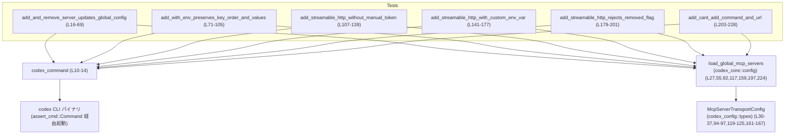
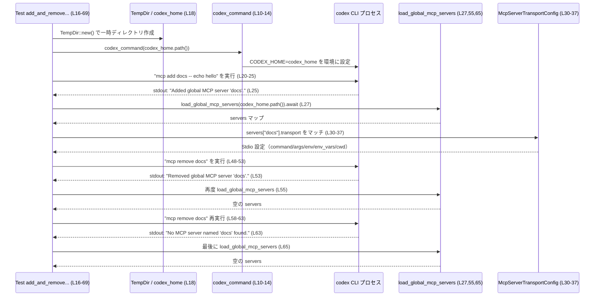

# cli/tests/mcp_add_remove.rs コード解説

## 0. ざっくり一言

`codex` CLI の `mcp add` / `mcp remove` サブコマンドが、グローバル MCP サーバ設定を正しく読み書きできているかを検証する非同期テスト群です。  
Stdio ベースの MCP サーバと Streamable HTTP ベースの MCP サーバの挙動や、削除済みフラグや不正な引数組み合わせに対するエラーハンドリングを確認しています。

---

## 1. このモジュールの役割

### 1.1 概要

このテストモジュールは、`codex` CLI が提供する MCP サーバ管理機能のうち、次の点を検証します。

- `mcp add` 実行時に、グローバル MCP サーバ設定が正しく追加・更新されること  
  （Stdio / Streamable HTTP それぞれの transport 設定を検証）  
- `mcp remove` 実行時に、対象サーバが設定から削除されること、および存在しないサーバ名も安全に扱うこと  
- HTTP 用の古い/削除済みフラグ (`--with-bearer-token`) や、`--url` と `--command` の混在といった不正な組み合わせがエラーとして扱われ、設定を汚さないこと

これらはすべて、`TempDir` で用意した一時ディレクトリを `CODEX_HOME` に指定し、その配下の「グローバル MCP サーバ設定」を `load_global_mcp_servers` で読み取ることで検証しています（例: `codex_home` と `load_global_mcp_servers` の組み合わせは `cli/tests/mcp_add_remove.rs:L18-28` など）。

### 1.2 アーキテクチャ内での位置づけ

このモジュールは CLI のブラックボックステストです。`codex` バイナリを実際に起動し、その副作用として更新される「グローバル MCP サーバ設定」を別モジュール経由で読み出して、期待値と比較します。

主な依存関係を Mermaids 図で示します（ノード名に行範囲を含めています）。



- 各テスト関数は `codex_command` を通じて CLI プロセスを起動し (`cli/tests/mcp_add_remove.rs:L20-25` など)、  
- その後 `load_global_mcp_servers` で設定を読み出し (`L27, L55, L92, L117, L159, L197, L224`)、  
- その中の `McpServerTransportConfig` のバリアントやフィールド値を検証しています (`L30-37, L94-97, L119-125, L161-167`)。

### 1.3 設計上のポイント

コードから読み取れる設計上の特徴を挙げます。

- **完全なブラックボックス検証**  
  - CLI の挙動は `assert_cmd::Command` 経由で外部プロセスとして起動し検証しています (`L10-13, L20-25` など)。
  - 設定の読み取りにはアプリケーション本体側の `load_global_mcp_servers` を利用しており、CLI とコアロジックの連携を同時に検証しています。

- **テストごとの独立した環境**  
  - 各テストは `TempDir::new()?` で一時ディレクトリを作成し、それを `CODEX_HOME` として使用します (`L18, L73, L109, L143, L181, L205`)。  
  - これによりテスト間で設定ファイルが共有されず、並行実行時の干渉を避けています。

- **非同期テストとエラー伝播**  
  - すべてのテストは `#[tokio::test]` + `async fn` で記述され、内部で `load_global_mcp_servers(...).await?` を利用します (`L16-17, L27, L55, L92, L117, L159, L197, L224`)。
  - 戻り値は `anyhow::Result<()>` で、`?` 演算子により IO エラーなどが直ちにテスト失敗として伝播します。

- **ユーザー向け契約の明示**  
  - CLI メッセージの一部（成功時・失敗時の stdout/stderr 文言）を文字列として検証し、ユーザー向け UI の契約もテストしています (`L25, L53, L63, L195, L222`)。

---

## 2. 主要な機能一覧（コンポーネントインベントリー付き）

このモジュールが提供する「機能」（ここではテストケースと補助関数）と、その行範囲を一覧します。

### 2.1 関数・テスト一覧

| 名前 | 種別 | 役割 / 機能 | 行範囲（根拠） |
|------|------|-------------|----------------|
| `codex_command` | 補助関数 | `codex` バイナリに対する `assert_cmd::Command` を生成し、`CODEX_HOME` を設定 | `cli/tests/mcp_add_remove.rs:L10-14` |
| `add_and_remove_server_updates_global_config` | `#[tokio::test]` | Stdio 型 MCP サーバ `docs` の追加・削除と、再削除時の挙動、設定反映を検証 | `L16-69` |
| `add_with_env_preserves_key_order_and_values` | `#[tokio::test]` | `--env` オプションで渡した環境変数の順序と値が保存されることを検証 | `L71-105` |
| `add_streamable_http_without_manual_token` | `#[tokio::test]` | HTTP ストリーム MCP サーバ追加時、トークン関連設定や資格情報ファイルが自動生成されないことを検証 | `L107-139` |
| `add_streamable_http_with_custom_env_var` | `#[tokio::test]` | HTTP ストリーム MCP サーバ追加時、`--bearer-token-env-var` で指定した環境変数名が保存されることを検証 | `L141-177` |
| `add_streamable_http_rejects_removed_flag` | `#[tokio::test]` | 廃止済みフラグ `--with-bearer-token` を指定した場合に CLI がエラー終了し、設定が更新されないことを検証 | `L179-201` |
| `add_cant_add_command_and_url` | `#[tokio::test]` | `--url` と `--command` を同時に指定した場合に CLI がエラー終了し、設定が更新されないことを検証 | `L203-228` |

### 2.2 外部コンポーネント参照一覧

| コンポーネント | 種別 | 用途 | 参照行（根拠） |
|----------------|------|------|----------------|
| `McpServerTransportConfig` | 列挙体（外部 crate） | MCP サーバの transport 設定（`Stdio` / `StreamableHttp`）の検証に使用 | `L4, L30-37, L94-97, L119-125, L161-167` |
| `load_global_mcp_servers` | 非同期関数（外部 crate） | `CODEX_HOME` 配下の「グローバル MCP サーバ設定」を読み込む | `L5, L27, L55, L92, L117, L159, L197, L224` |
| `TempDir` | 構造体（`tempfile`） | テスト毎に独立した `codex_home` ディレクトリを用意 | `L8, L18, L73, L109, L143, L181, L205` |
| `assert_cmd::Command` | 構造体（`assert_cmd`） | `codex` CLI プロセスを起動し、ステータス・出力を検証 | `L10-13, L20-25, L48-53, L58-63, L75-90, L111-115, L145-157, L183-195, L207-222` |
| `predicates::str::contains` | 関数/述語 | CLI の stdout / stderr に特定の部分文字列が含まれるかを検証 | `L6, L25, L53, L63, L195, L222` |

---

## 3. 公開 API と詳細解説

このファイル自体はテストモジュールであり、外部に公開される API はありません。ただし、CLI とコア設定ロジックとの契約を定義するという意味で、テスト関数は重要な「仕様ドキュメント」となります。

### 3.1 型一覧（構造体・列挙体など）

このモジュール内で定義された型はありませんが、テストの中心となる外部型を整理します。

| 名前 | 種別 | 定義元（モジュールパス） | 役割 / 用途 | 参照行 |
|------|------|--------------------------|-------------|--------|
| `McpServerTransportConfig` | 列挙体 | `codex_config::types` | MCP サーバの接続方法を表す設定。`Stdio` と `StreamableHttp` バリアントがテストから確認できます。 | `L4, L30-37, L94-97, L119-125, L161-167` |
| `TempDir` | 構造体 | `tempfile` | 一時ディレクトリを管理し、`codex_home` として使用。スコープ終了時に自動削除されます。 | `L8, L18, L73, L109, L143, L181, L205` |
| `assert_cmd::Command` | 構造体 | `assert_cmd` | 外部コマンド（ここでは `codex`）を起動し、終了コードや標準出力/エラーをアサートするために使用します。 | `L10-13, L20-25, L48-53, L58-63, L75-90, L111-115, L145-157, L183-195, L207-222` |

※ `McpServerTransportConfig` の内部実装（フィールドの具体的な型など）はこのチャンクには現れませんが、パターンマッチから以下がわかります。

- `Stdio { command, args, env, env_vars, cwd }` というフィールドを持ち、`env` と `cwd` は `Option` 型であることが `is_none()` から分かります (`L31-42`)。
- `StreamableHttp { url, bearer_token_env_var, http_headers, env_http_headers }` というフィールドを持ち、後3つが `Option` 型であることが `is_none()` や `as_deref()` から分かります (`L120-129, L162-171`)。

### 3.2 関数詳細（7 件）

#### `codex_command(codex_home: &Path) -> Result<assert_cmd::Command>`

**定義位置**: `cli/tests/mcp_add_remove.rs:L10-14`

**概要**

`CODEX_HOME` 環境変数を指定した状態で `codex` バイナリを実行するための `assert_cmd::Command` を生成するヘルパー関数です。

**引数**

| 引数名 | 型 | 説明 |
|--------|----|------|
| `codex_home` | `&Path` | テスト用に使用する `CODEX_HOME` のディレクトリパス (`TempDir::path()` の戻り値) |

**戻り値**

- `Result<assert_cmd::Command>` (`anyhow::Result` 型のエイリアス)  
  - `Ok(command)` の場合: `codex` バイナリを実行するために構成済みの `assert_cmd::Command`。  
  - `Err(e)` の場合: `codex_utils_cargo_bin::cargo_bin("codex")` が失敗した場合などのエラー (`L11`)。

**内部処理の流れ**

1. `codex_utils_cargo_bin::cargo_bin("codex")?` を呼び出し、テストビルドされた `codex` バイナリのパスを取得します (`L11`)。  
2. `assert_cmd::Command::new(...)` でコマンドオブジェクトを生成します (`L11`)。  
3. `.env("CODEX_HOME", codex_home)` により、環境変数 `CODEX_HOME` を一時ディレクトリに設定します (`L12`)。  
4. 生成したコマンドを `Ok(cmd)` で呼び出し元に返します (`L13`)。

**Examples（使用例）**

この関数はすべてのテスト関数で同様に使用されています。例えば `add_and_remove_server_updates_global_config` 内では次のように使われます (`L18-23`)。

```rust
let codex_home = TempDir::new()?;                         // 一時ディレクトリを作成
let mut add_cmd = codex_command(codex_home.path())?;      // CODEX_HOME 環境付きのコマンドを生成
add_cmd
    .args(["mcp", "add", "docs", "--", "echo", "hello"])  // mcp add サブコマンドと引数を指定
    .assert()
    .success();
```

**Errors / Panics**

- `codex_utils_cargo_bin::cargo_bin("codex")` がバイナリを見つけられない場合、`?` によって `Err` が返され、テストが失敗します (`L11`)。
- この関数自身では `panic!` は使用していません。

**Edge cases（エッジケース）**

- `codex_home` が存在しないパスであっても、ここではチェックされません。実際に CLI が設定を読み書きするまで有効性は検証されません。
- `codex_home` のパス内容による分岐はなく、あくまで環境変数を設定するだけです。

**使用上の注意点**

- `assert_cmd::Command` はミュータブルに扱う必要があるため、戻り値は `let mut cmd` として受け取っています（テスト中でも同様のスタイルになっています (`L20, L48, L58, L75, L111, L145, L183, L207`)）。
- この関数はテスト専用であり、本番コードから呼び出す設計にはなっていません。

---

#### `add_and_remove_server_updates_global_config() -> Result<()>`

**定義位置**: `cli/tests/mcp_add_remove.rs:L16-69`

**概要**

Stdio ベースの MCP サーバ `docs` を `mcp add` で追加し、その設定内容を検証した後、`mcp remove` で削除し、再削除時の挙動を含めてグローバル設定の更新を確認するテストです。

**引数**

- （引数なし）— テスト関数であり、外部から値を受け取りません。

**戻り値**

- `Result<()>` (`anyhow::Result`)  
  - 正常完了時は `Ok(())` を返し、テストは成功となります (`L68`)。  
  - `TempDir::new` や `codex_command`、`load_global_mcp_servers` でエラーが発生した場合は `Err` として伝播し、テストが失敗します（`?` 使用: `L18, L20, L27, L55, L65`）。

**内部処理の流れ**

1. 一時ディレクトリ `codex_home` を作成 (`L18`)。  
2. `codex_command` を使って `mcp add docs -- echo hello` を実行 (`L20-25`)。  
   - 実行成功（終了コード 0）と stdout メッセージ `"Added global MCP server 'docs'.`" を確認 (`L23-25`)。
3. `load_global_mcp_servers(codex_home.path()).await?` で現在の MCP サーバ設定を読み込み (`L27`)。  
4. `servers.len() == 1` を検証し (`L28`)、キー `"docs"` の設定を取得 (`L29`)。  
5. `docs.transport` が `McpServerTransportConfig::Stdio { ... }` であることを確認し、中身を検証 (`L30-43`)。  
   - `command == "echo"` (`L38`)  
   - `args == ["hello"]` (`L39`)  
   - `env.is_none()`, `env_vars.is_empty()`, `cwd.is_none()` (`L40-42`)  
6. `docs.enabled` が `true` であることを確認 (`L46`)。  
7. 次に `mcp remove docs` を実行し、成功と `"Removed global MCP server 'docs'.`" の stdout を確認 (`L48-53`)。  
8. 設定を再読み込みして `servers.is_empty()` を検証 (`L55-56`)。  
9. 再度 `mcp remove docs` を実行し、成功と `"No MCP server named 'docs' found."` の stdout を確認 (`L58-63`)。  
10. 最後に再度設定を読み込み、`servers.is_empty()` を確認 (`L65-66`)。

**Examples（使用例）**

このテスト自体が「Stdio 型 MCP サーバの追加・削除」の代表例です。  
同様のパターンで他の Stdio ベース MCP サーバを追加するときは、`"docs"` や `"echo"`, `"hello"` の部分を変更すればよいことが分かります。

**Errors / Panics**

- `servers.get("docs")` が `None` の場合、`expect("server should exist")` により `panic!` します (`L29`)。  
  これは「`mcp add docs` 後には必ず存在する」という契約の検証です。
- `match` 文では、`transport` が `Stdio` 以外のバリアントであれば `panic!("unexpected transport: {other:?}")` となります (`L44`)。

**Edge cases（エッジケース）**

- **同名サーバの多重登録**: このテストでは 1 回だけ追加しているため、既存 `docs` がある状態で再度 `mcp add docs` した場合の挙動は分かりません（このチャンクには現れません）。  
- **存在しないサーバの削除**: `mcp remove docs` を 2 回目に実行すると `"No MCP server named 'docs' found."` と表示され、成功ステータス（`success()`）であることが検証されています (`L58-63`)。  
  → 存在しないサーバ名に対してもエラー終了にはならない契約であると読み取れます。

**使用上の注意点**

- CLI 側で Stdio transport のバリアント名やフィールド構造を変更した場合、このテストは直接影響を受けます（`McpServerTransportConfig::Stdio` へのパターンマッチ: `L31-37`）。
- ユーザーに提示するメッセージ文言（`"Added global MCP server 'docs'.`" など）もテストが依存しているため、変更する場合はテストの期待値も合わせて更新する必要があります (`L25, L53, L63`)。

---

#### `add_with_env_preserves_key_order_and_values() -> Result<()>`

**定義位置**: `cli/tests/mcp_add_remove.rs:L71-105`

**概要**

`mcp add` の `--env` オプションで指定した環境変数が、指定順序と値を保ったまま `McpServerTransportConfig::Stdio` の `env` に保存されることを検証するテストです。

**内部処理の流れ（要点）**

1. 一時 `codex_home` を作成 (`L73`)。  
2. `mcp add envy --env FOO=bar --env ALPHA=beta -- python server.py` を実行し、成功を確認 (`L75-90`)。  
3. 設定を読み込み、キー `"envy"` を取得 (`L92-93`)。  
4. `envy.transport` から `McpServerTransportConfig::Stdio { env: Some(env), .. }` を取り出す (`L94-97`)。  
5. `env.len() == 2` を確認し (`L99`)、`env.get("FOO") == Some("bar")`, `env.get("ALPHA") == Some("beta")` を検証 (`L100-101`)。  
6. `envy.enabled` が `true` であることを確認 (`L102`)。

**契約・エッジケース**

- `env` が `Some` であり、かつキー `"FOO"`, `"ALPHA"` が存在することが契約になっています (`L94-101`)。
- **順序**については実装型が `IndexMap` なのか `HashMap` なのか、このチャンクからは分かりませんが、テストは `len` と `get` のみを使い、順序そのものには直接依存していません。  
  → 「キー順序を保つ」というコメント的ニュアンスはテスト名から読み取れますが、コード上は値と存在の確認に留まっています。

**使用上の注意点**

- `env` を `None` にする実行パス（`--env` を指定しない追加）はこのテストではカバーされていません。
- `FOO=bar` 形式で渡した文字列のパース方法はこのチャンクには現れず、別のコードに委ねられています。

---

#### `add_streamable_http_without_manual_token() -> Result<()>`

**定義位置**: `cli/tests/mcp_add_remove.rs:L107-139`

**概要**

Streamable HTTP スタイルの MCP サーバ `github` を、トークン関連オプションを指定せずに追加した際の設定と副作用を検証するテストです。

**内部処理の流れ（要点）**

1. 一時 `codex_home` を作成 (`L109`)。  
2. `mcp add github --url https://example.com/mcp` を実行し、成功を確認 (`L111-115`)。  
3. `load_global_mcp_servers` で設定を読み込み、キー `"github"` を取得 (`L117-118`)。  
4. `github.transport` が `McpServerTransportConfig::StreamableHttp { .. }` であることを確認し、フィールドを検証 (`L119-125`)。  
   - `url == "https://example.com/mcp"` (`L126`)  
   - `bearer_token_env_var.is_none()` (`L127`)  
   - `http_headers.is_none()`, `env_http_headers.is_none()` (`L128-129`)  
5. `github.enabled` が `true` であることを確認 (`L133`)。  
6. `codex_home` 直下に `.credentials.json`, `.env` というファイルが存在しないことを確認 (`L135-136`)。

**契約・エッジケース**

- `--url` のみを与えた場合、トークン用の環境変数設定は自動的には作られない契約になっています (`bearer_token_env_var.is_none()`, `L127`)。
- 同時に、資格情報ファイルや `.env` ファイルも自動生成されないことが明示されています (`L135-136`)。  
  → CLI が何らかの「ウィザード的挙動」で認証情報ファイルを作ることは少なくともこのパスではない、という仕様がテストされています。

**使用上の注意点**

- 将来、HTTP サーバ追加時に自動で `.credentials.json` を生成する仕様に変更する場合、このテストは必ず更新が必要になります。
- `url` のフォーマット検証（不正 URL など）はこのテストでは扱っていません。

---

#### `add_streamable_http_with_custom_env_var() -> Result<()>`

**定義位置**: `cli/tests/mcp_add_remove.rs:L141-177`

**概要**

`mcp add` で HTTP MCP サーバを追加する際、`--bearer-token-env-var GITHUB_TOKEN` を指定すると、その環境変数名が `McpServerTransportConfig::StreamableHttp` の `bearer_token_env_var` に保存されることを検証するテストです。

**内部処理の流れ（要点）**

1. 一時 `codex_home` を作成 (`L143`)。  
2. `mcp add issues --url https://example.com/issues --bearer-token-env-var GITHUB_TOKEN` を実行し、成功を確認 (`L145-157`)。  
3. 設定を読み込み、キー `"issues"` を取得 (`L159-160`)。  
4. `issues.transport` が `StreamableHttp` であることを確認し、フィールドを検証 (`L161-167`)。  
   - `url == "https://example.com/issues"` (`L168`)  
   - `bearer_token_env_var.as_deref() == Some("GITHUB_TOKEN")` (`L169`)  
   - `http_headers.is_none()`, `env_http_headers.is_none()` (`L170-171`)  
5. `issues.enabled` が `true` であることを確認 (`L175`)。

**契約・エッジケース**

- `bearer_token_env_var` は `Option<String>` のような型であり、指定があれば `Some("環境変数名")` になることが契約としてテストされています (`L169`)。
- HTTP ヘッダー関連のオプションが与えられていない場合、それらは `None` になることも契約に含まれます (`L170-171`)。

**使用上の注意点**

- CLI 側で `--bearer-token-env-var` のオプション名を変更する場合、このテストは必ず修正が必要です。
- 実際の環境変数の中身（トークン値）の扱いはこのテストでは検証されておらず、「名前だけ保存する」ことを確認しています。

---

#### `add_streamable_http_rejects_removed_flag() -> Result<()>`

**定義位置**: `cli/tests/mcp_add_remove.rs:L179-201`

**概要**

Streamable HTTP サーバ追加時に、廃止されたフラグ `--with-bearer-token` を指定すると CLI が失敗し、設定が生成されないことを検証するテストです。

**内部処理の流れ（要点）**

1. 一時 `codex_home` を作成 (`L181`)。  
2. `mcp add github --url https://example.com/mcp --with-bearer-token` を実行 (`L183-192`)。  
3. `assert().failure()` により、プロセスが非ゼロ終了コードで終了したことを確認 (`L193-194`)。  
4. `stderr(contains("--with-bearer-token"))` によってエラー出力に `--with-bearer-token` が含まれることを確認 (`L195`)。  
5. 設定を読み込み、`servers.is_empty()` を確認 (`L197-198`)。

**契約・エッジケース**

- `--with-bearer-token` はサポートされないフラグであり、指定すると CLI は失敗する契約です。
- 失敗しても設定ファイルは生成・更新されず、グローバル MCP サーバ設定は空のままであることが保証されています (`L197-198`)。

**使用上の注意点**

- 古いドキュメントなどで `--with-bearer-token` が紹介されていた場合、このテストがその非推奨化／削除を担保しています。
- テストはエラーメッセージ全体ではなく部分文字列 `--with-bearer-token` の存在に依存しているため、将来エラー文言を変更する場合も、この一部分を残せばテストは通ります。

---

#### `add_cant_add_command_and_url() -> Result<()>`

**定義位置**: `cli/tests/mcp_add_remove.rs:L203-228`

**概要**

`mcp add` の引数で `--url` と `--command` を同時指定した場合、CLI がエラー終了し、設定が作られないことを検証するテストです。

**内部処理の流れ（要点）**

1. 一時 `codex_home` を作成 (`L205`)。  
2. `mcp add github --url https://example.com/mcp --command -- echo hello` を実行 (`L207-219`)。  
3. `assert().failure()` により非ゼロ終了コードで終了したことを確認 (`L220-221`)。  
4. `stderr(contains("unexpected argument '--command' found"))` により、エラー出力に CLI パーサからのエラーメッセージが含まれていることを確認 (`L222`)。  
5. `load_global_mcp_servers` で設定を読み込み、`servers.is_empty()` を検証 (`L224-225`)。

**契約・エッジケース**

- `--url` と `--command` は相互排他的なオプションであり、同時指定するとパーサエラーになる契約が明示されています。
- エラー終了時には設定が一切生成されないことが保証されています (`L225`)。

**使用上の注意点**

- CLI のパーサ実装やエラーメッセージを変更する場合、このテストが影響を受けます。特に `"unexpected argument '--command' found"` という文字列に依存しています (`L222`)。
- 他の相互排他的なオプションの組み合わせが追加される場合、このテストを雛形として新しいテストを追加できます。

---

### 3.3 その他の関数

このモジュールには上記 1 つの補助関数と 6 つのテスト関数のみが定義されており、その他の補助的な関数は存在しません（`cli/tests/mcp_add_remove.rs` 全体を確認した範囲）。

---

## 4. データフロー

ここでは、`add_and_remove_server_updates_global_config` テストを例に、CLI と設定読み書きのデータフローを整理します。

### 4.1 処理の要点

1. テストは `TempDir` を使って一時 `codex_home` を作成し、`CODEX_HOME` 環境変数として CLI に渡します (`L18, L20-22`)。
2. CLI (`codex`) は `mcp add` や `mcp remove` コマンドに応じて、`CODEX_HOME` 配下の「グローバル MCP サーバ設定」を更新します（具体的な保存形式はこのチャンクには現れません）。
3. テストは `load_global_mcp_servers(codex_home.path()).await?` でその設定を読み出し、マップの内容（キー、`McpServerTransportConfig`、`enabled` フラグ）を検証します (`L27-46, L55-56, L65-66`)。

### 4.2 シーケンス図



この図から、テストが「CLI → 設定ファイル → 読み出し API」という経路を通して機能を検証していることがわかります。

---

## 5. 使い方（How to Use）

このモジュールはテスト用ですが、「`codex` CLI の MCP 管理機能をどう利用し、どう検証するか」の参考になります。

### 5.1 基本的な使用方法（テストパターン）

新しい MCP 関連機能をテストする場合の基本パターンは次の通りです。

```rust
use anyhow::Result;
use tempfile::TempDir;
use codex_core::config::load_global_mcp_servers;

// 新しいテストの雛形
#[tokio::test]
async fn my_mcp_scenario() -> Result<()> {
    let codex_home = TempDir::new()?;                           // 一時 CODEX_HOME を用意

    let mut cmd = codex_command(codex_home.path())?;            // CODEX_HOME を設定したコマンド
    cmd.args(["mcp", "add", "myserver", "--", "echo", "hi"])    // 任意の mcp サブコマンドと引数
        .assert()
        .success();                                             // 成功終了を確認

    let servers = load_global_mcp_servers(codex_home.path())    // グローバル MCP 設定を読み込み
        .await?;
    let myserver = servers.get("myserver")
        .expect("server should exist");                         // 期待するサーバが存在すること

    // ここで myserver.transport や enabled フラグを検証する
    // ...

    Ok(())
}
```

このように、

1. 一時ディレクトリを `CODEX_HOME` として設定  
2. `codex` CLI を実行  
3. `load_global_mcp_servers` で設定を確認  

という三段構えが基本的なテストフローです。

### 5.2 よくある使用パターン

- **Stdio ベース MCP サーバのテスト**  
  - `add_and_remove_server_updates_global_config` (`L16-69`) および `add_with_env_preserves_key_order_and_values` (`L71-105`) が代表例です。  
  - `McpServerTransportConfig::Stdio` バリアントをパターンマッチし、`command`, `args`, `env`, `cwd` などを検証します。

- **HTTP ベース MCP サーバのテスト**  
  - `add_streamable_http_without_manual_token` (`L107-139`) と `add_streamable_http_with_custom_env_var` (`L141-177`) が、URL とベアラートークン用環境変数名の検証パターンを示しています。  
  - 同様に `StreamableHttp` バリアントをマッチしてフィールドを検証します。

- **エラー系シナリオのテスト**  
  - `add_streamable_http_rejects_removed_flag` (`L179-201`) や `add_cant_add_command_and_url` (`L203-228`) は、`failure()` アサーションと `stderr(contains(...))` を組み合わせたエラー検証パターンです。

### 5.3 よくある間違いと正しい例

```rust
// よくない例: CODEX_HOME を設定せずに CLI を起動してしまう
// これでは開発者の本物の設定ディレクトリを汚す可能性があります。
let mut cmd = assert_cmd::Command::new("codex");
cmd.args(["mcp", "add", "docs", "--", "echo", "hello"])
   .assert()
   .success();

// 正しい例: codex_command を通じて、一時 CODEX_HOME を設定する
let codex_home = TempDir::new()?;
let mut cmd = codex_command(codex_home.path())?;
cmd.args(["mcp", "add", "docs", "--", "echo", "hello"])
   .assert()
   .success();
```

**根拠**: テストでは常に `codex_command` を使用して `CODEX_HOME` を設定しており (`L20, L48, L58, L75, L111, L145, L183, L207`)、開発者の実環境を汚さないようになっています。

### 5.4 使用上の注意点（まとめ）

- **環境の分離**  
  - 必ず `TempDir` を用いて `CODEX_HOME` を分離すること（`L18, L73, L109, L143, L181, L205`）。  
- **非同期コンテキスト**  
  - `load_global_mcp_servers` は `async` 関数であり、テストは `#[tokio::test]` で実行する必要があります (`L16, L71, L107, L141, L179, L203`)。
- **メッセージ依存**  
  - エラーメッセージや成功メッセージのテキストに依存した `contains(...)` アサーションが多用されているため、UI テキストの変更には注意が必要です (`L25, L53, L63, L195, L222`)。
- **パニックの扱い**  
  - `expect("server should exist")` や `panic!("unexpected transport: {other:?}")` は仕様違反を検出するためのものであり、CLI のエラーではなくテスト失敗として扱われます (`L29, L44, L96, L131, L173`)。

---

## 6. 変更の仕方（How to Modify）

### 6.1 新しい機能を追加する場合（新しいテストケース）

新しい MCP 関連機能やフラグを追加した場合、以下の手順でテストを拡張するのが自然です。

1. **テストファイルの選定**  
   - `mcp` サブコマンドに関する機能であれば、このファイル `cli/tests/mcp_add_remove.rs` に新しい `#[tokio::test]` を追加するのが一貫した構造になります。

2. **環境セットアップ**  
   - 既存テストと同様に `TempDir::new()?` で一時 `codex_home` を作成し (`L18 など`)、`codex_command` を使って CLI を起動します (`L20, L75, L111, L145, L183, L207`)。

3. **CLI 実行とアサーション**  
   - `assert_cmd::Command` に対して新しいサブコマンドやオプションを渡し、`.success()` または `.failure()` で終了コードを検証します。  
   - 必要に応じて `stdout(contains(...))` や `stderr(contains(...))` でメッセージ内容を検証します。

4. **設定の検証**  
   - `load_global_mcp_servers(codex_home.path()).await?` で設定を読み込み (`L27, L92, L117, L159, L197, L224`)、  
   - `McpServerTransportConfig` の新しいバリアントやフィールドがある場合は、既存のパターンマッチ例 (`L30-37, L119-125, L161-167`) を参考に検証します。

### 6.2 既存の機能を変更する場合

CLI の仕様変更や設定スキーマ変更を行う場合の注意点です。

- **影響範囲の確認**  
  - Stdio transport 関連を変更する場合: `add_and_remove_server_updates_global_config` と `add_with_env_preserves_key_order_and_values` を確認 (`L16-69, L71-105`)。  
  - HTTP transport 関連を変更する場合: `add_streamable_http_without_manual_token` と `add_streamable_http_with_custom_env_var`、およびエラー系 2 テストを確認 (`L107-177, L179-228`)。

- **契約の維持か変更か**  
  - 存在しない MCP サーバ削除時に成功コードを返すかどうか（現在は成功で `"No MCP server named 'docs' found."` を表示）という契約を変更する場合は、`add_and_remove_server_updates_global_config` の該当部分を更新する必要があります (`L58-63`)。  
  - `--with-bearer-token` のような削除済みフラグを再導入する場合も、`add_streamable_http_rejects_removed_flag` を対応させる必要があります (`L183-195`)。

- **テストでの前提条件**  
  - テストは `servers` をマップとして扱い、`is_empty()`, `len()`, `get()` に依存しています (`L27-29, L55-56, L65-66, L92-93, L117-118, L159-160, L197-198, L224-225`)。  
  - これらのメソッドを持たない新しい型に変更する場合は、テスト側のアクセス方法も合わせて修正する必要があります。

---

## 7. 関連ファイル

このテストモジュールと密接に関連するモジュール/コンポーネントをまとめます。ファイルパスはこのチャンクには現れないため、モジュールパスで記載します。

| パス / モジュール | 役割 / 関係 |
|-------------------|------------|
| `codex_core::config::load_global_mcp_servers` | グローバル MCP サーバ設定を読み込む非同期関数。`CODEX_HOME` に応じた設定状態をテストから検証するために使用されています (`L5, L27, L55, L92, L117, L159, L197, L224`)。 |
| `codex_config::types::McpServerTransportConfig` | MCP サーバの transport 設定を表す列挙体。Stdio / Streamable HTTP のバリアントを通して CLI と設定スキーマの整合性を検証しています (`L4, L30-37, L94-97, L119-125, L161-167`)。 |
| `codex_utils_cargo_bin::cargo_bin` | テスト用にビルドされた `codex` バイナリのパスを取得するヘルパー。`codex_command` から利用されています (`L11`)。 |
| `assert_cmd` crate | 外部コマンド実行とアサーションを提供するテスト用ユーティリティ。CLI テスト全体の基盤になっています (`L10-13, L20-25, L48-53, L58-63, L75-90, L111-115, L145-157, L183-195, L207-222`)。 |
| `tempfile::TempDir` | テスト毎に独立した `CODEX_HOME` ディレクトリを提供し、設定の副作用を隔離するために使用されています (`L8, L18, L73, L109, L143, L181, L205`)。 |

このチャンクからは、`load_global_mcp_servers` や `McpServerTransportConfig` の具体的な実装ファイルパスや内部構造までは分かりません。そのため、より詳細な挙動はそれぞれのモジュール側のコードを参照する必要があります。
