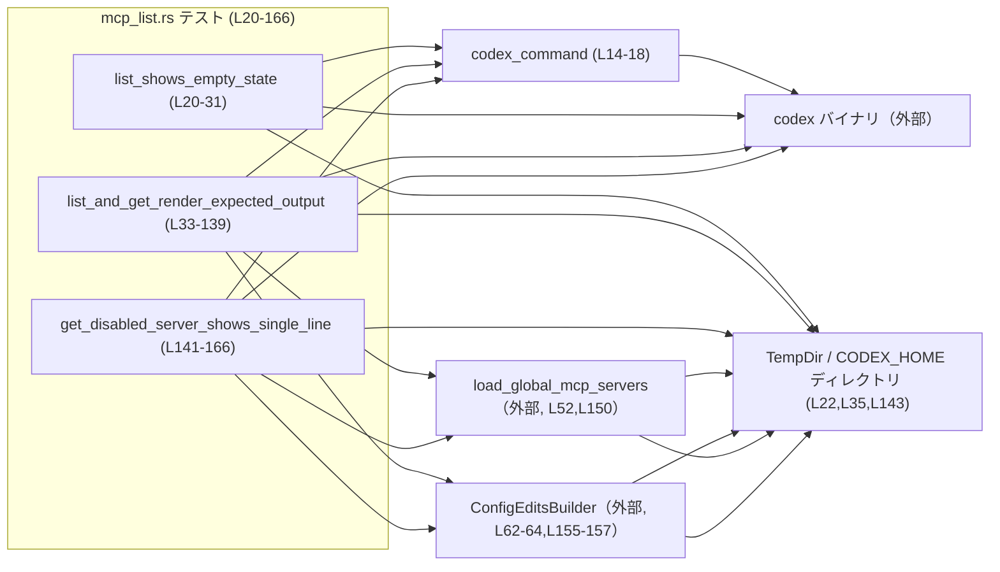
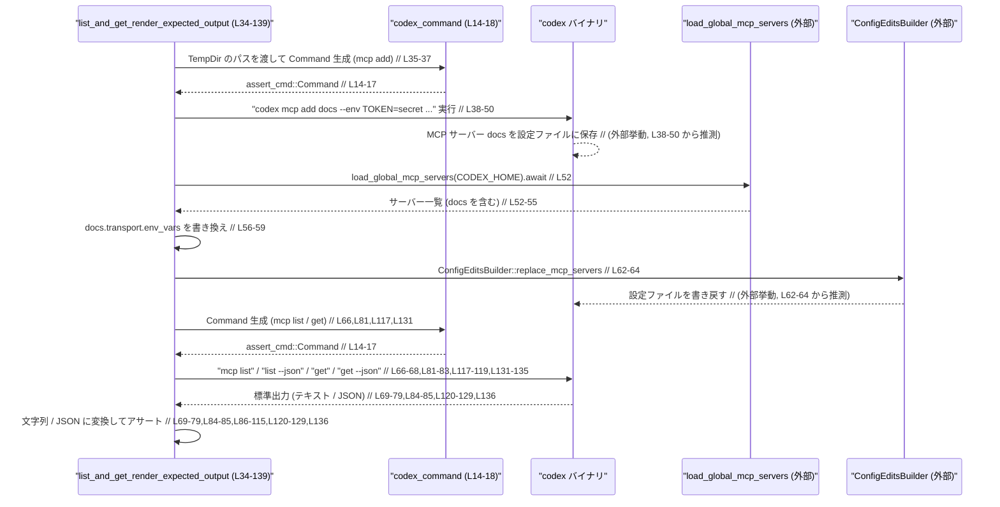

# cli/tests/mcp_list.rs コード解説

## 0. ざっくり一言

`codex` CLI の `mcp list` / `mcp get` サブコマンドについて、

- MCP サーバーが存在しない場合
- 標準的な Stdio サーバーが 1 件ある場合
- 無効化（disabled）されたサーバーが 1 件ある場合

の出力内容を検証する統合テスト群です（根拠: `cli/tests/mcp_list.rs:L20-31,L33-139,L141-166`）。

---

## 1. このモジュールの役割

### 1.1 概要

このモジュールは、`codex` CLI の MCP サーバー管理機能に対して次を確認します。

- `codex mcp list` の空状態メッセージ（「No MCP servers configured yet.」）の表示（`L20-31`）。
- `codex mcp add` で追加された MCP サーバーが、`list` / `list --json` / `get` / `get --json` で期待どおりに表示されること（`L34-139`）。
- 無効化された MCP サーバーが `get` で 1 行表示 `"docs (disabled)"` になること（`L141-166`）。

### 1.2 アーキテクチャ内での位置づけ

このファイルは、実際の `codex` バイナリをサブプロセスとして起動し、設定ディレクトリを `TempDir` で隔離したうえで、設定読み書きロジック（`load_global_mcp_servers`, `ConfigEditsBuilder`）と CLI 出力をまとめて検証する「黒箱寄りの統合テスト」です（`L14-18,L22,L35,L37-50,L52-65,L81-83,L117-136,L145-148,L150-157`）。

依存関係の概要を次の Mermaid 図に示します。



### 1.3 設計上のポイント

- **統合テスト指向**  
  - `assert_cmd::Command` と `codex_utils_cargo_bin::cargo_bin("codex")` を用いて、実際の `codex` バイナリを起動しています（`L14-16,L24-25,L37-50,L66-68,L81-83,L117-119,L131-136,L145-148,L159-160`）。
- **設定の隔離と再利用**  
  - 各テストで `TempDir` を生成し、それを `CODEX_HOME` として設定することで、テストごとに独立した設定ディレクトリを使用しています（`L22,L35,L143`）。
- **設定の直接操作**  
  - `codex mcp add` 実行後、`load_global_mcp_servers` で設定を読み込み、`ConfigEditsBuilder::replace_mcp_servers` で `env_vars` や `enabled` を直接編集してから保存しています（`L52-65,L150-157`）。
- **エラーハンドリング**  
  - すべてのテスト関数は `anyhow::Result<()>` を返し、`?` 演算子で I/O や JSON パースのエラーをそのままテスト失敗として伝播させています（`L21,L34,L141`）。
  - アサーションには `assert!` / `assert_eq!` / `expect` を用いており、条件不一致時は panic します（`L26-28,L52-60,L70-79,L86-115,L120-129,L136,L153,L163`）。
- **非同期処理**  
  - 設定読み込み `load_global_mcp_servers` が async API であるため、`#[tokio::test]` を付けた非同期テストで `.await` して利用しています（`L33-34,L52,L81-83,L117-119,L141-142,L150,L159-160`）。
  - 一方で設定の保存は `apply_blocking()` という同期メソッドを呼んでおり、非同期コンテキスト内でブロッキング I/O を行う構造になっています（`L62-64,L155-157`）。

---

## 2. 主要な機能・コンポーネント一覧

### 2.1 このファイルで定義されている関数（インベントリー）

| 名前 | 種別 | 説明 | 戻り値 | 非同期 | 定義位置 |
|------|------|------|--------|--------|----------|
| `codex_command` | ヘルパー関数 | `CODEX_HOME` を設定した `assert_cmd::Command` を生成 | `Result<assert_cmd::Command>` | いいえ | `cli/tests/mcp_list.rs:L14-18` |
| `list_shows_empty_state` | テスト関数 (`#[test]`) | MCP サーバー未設定時の `codex mcp list` のメッセージを検証 | `Result<()>` | いいえ | `cli/tests/mcp_list.rs:L20-31` |
| `list_and_get_render_expected_output` | テスト関数 (`#[tokio::test]`) | MCP サーバー追加後の `list` / `list --json` / `get` / `get --json` の出力内容を包括的に検証 | `Result<()>` | はい | `cli/tests/mcp_list.rs:L33-139` |
| `get_disabled_server_shows_single_line` | テスト関数 (`#[tokio::test]`) | 無効化された MCP サーバーの `get` 出力が 1 行 `"docs (disabled)"` になることを検証 | `Result<()>` | はい | `cli/tests/mcp_list.rs:L141-166` |

### 2.2 外部コンポーネント（主なもの）

| コンポーネント | 種別 | 役割 / 用途 | 使用箇所（根拠） |
|----------------|------|-------------|-------------------|
| `assert_cmd::Command` | 構造体 | 外部コマンド（ここでは `codex` バイナリ）の起動と検証 | `codex_command` および各テストの `.args()`, `.output()`, `.assert()` で使用（`L14-17,L24-25,L37-50,L66-68,L81-83,L117-119,L131-136,L145-148,L159-160`） |
| `TempDir` | 構造体 | 一時ディレクトリを生成し、各テストの `CODEX_HOME` として使用 | 各テストで `TempDir::new()?` を呼び出し（`L22,L35,L143`） |
| `load_global_mcp_servers` | 関数（外部） | `CODEX_HOME` 配下の MCP サーバー設定一覧を非同期に読み込む | `list_and_get_render_expected_output`, `get_disabled_server_shows_single_line` で使用（`L52,L150`） |
| `ConfigEditsBuilder` | 構造体（外部） | MCP サーバー一覧の編集結果を設定ファイルへ書き戻す | `list_and_get_render_expected_output`, `get_disabled_server_shows_single_line` で使用（`L62-64,L155-157`） |
| `McpServerTransportConfig` | enum（外部） | MCP サーバーのトランスポート種別と設定（ここでは Stdio）を表現 | `docs_entry.transport` の `match` で `Stdio { env_vars, .. }` として使用（`L4,L56-60`） |
| `serde_json::Value` (`JsonValue`) | 型エイリアス | `--json` 出力のパース結果を保持 | `list_and_get_render_expected_output` の JSON 検証で使用（`L10,L84-85,L86-115`） |
| `predicates::str::contains` / `PredicateBooleanExt` | トレイト / 関数 | コマンド出力に特定の文字列が含まれるかの述語合成 | `get_json_cmd` の `.stdout(contains(...).and(contains(...)))` で使用（`L7-8,L131-136`） |

---

## 3. 公開 API と詳細解説

このファイルはテスト用モジュールであり、外部クレートから再利用される API は定義していません。ただし、テストを書く際の共通ヘルパーとして `codex_command` が事実上の API になっています（`L14-18`）。

### 3.1 型一覧（このファイル内で新規定義される型）

このファイル内で新しく定義されている構造体・列挙体・型エイリアスはありません。  
型エイリアス `JsonValue` は `serde_json::Value` への別名です（`L10`）。

---

### 3.2 関数詳細

#### `codex_command(codex_home: &Path) -> Result<assert_cmd::Command>`

**概要**

`codex` バイナリを起動するための `assert_cmd::Command` を生成し、環境変数 `CODEX_HOME` に指定されたディレクトリを設定するヘルパー関数です（`L14-18`）。

**引数**

| 引数名 | 型 | 説明 |
|--------|----|------|
| `codex_home` | `&Path` | `codex` が設定ファイルなどを読むためのホームディレクトリとして使うパス。テストでは `TempDir` のパスを渡しています（`L22,L35,L37,L52,L62,L66,L81,L117,L131,L143,L150,L155,L159`）。 |

**戻り値**

- `Result<assert_cmd::Command>`（`anyhow::Result`）  
  - 成功時: `codex` バイナリを実行するための `assert_cmd::Command`。
  - 失敗時: `codex_utils_cargo_bin::cargo_bin("codex")` によるバイナリ検索失敗などのエラーを含みます（`L15`）。

**内部処理の流れ**

1. `codex_utils_cargo_bin::cargo_bin("codex")` で `codex` バイナリのパスを取得し、`assert_cmd::Command::new` でコマンドオブジェクトを作成します（`L15`）。
2. 環境変数 `CODEX_HOME` に `codex_home` を紐付けます（`L16`）。
3. `Ok(cmd)` でラップして返却します（`L17`）。

**Examples（使用例）**

新しいテストから任意のサブコマンドを実行する基本パターンです。

```rust
use anyhow::Result;                         // anyhow の Result を使う            // エラー伝播に anyhow::Result を使用
use tempfile::TempDir;                      // 一時ディレクトリを生成する        // テストごとに独立したディレクトリを作る
// 他に必要な use は mcp_list.rs を参照

#[test]
fn run_custom_subcommand() -> Result<()> {  // 通常の同期テスト関数               // テスト関数は Result<()> を返す
    let codex_home = TempDir::new()?;      // 一時ディレクトリを作成           // CODEX_HOME 相当のディレクトリ
    let mut cmd = codex_command(codex_home.path())?; // ヘルパーで Command を作る // CODEX_HOME が環境変数として設定される

    let output = cmd                        // コマンドに引数を追加して実行      // 実行するサブコマンドを指定
        .args(["mcp", "list"])             // ここでは "mcp list" を実行       // サブコマンド引数
        .output()?;                        // プロセスを実行し Output を取得   // エラー時は ? でテスト失敗

    assert!(output.status.success());      // 終了ステータスが成功であること   // 終了コードを検証
    Ok(())                                 // テスト成功                        // 明示的に Ok(()) を返す
}
```

**Errors / Panics**

- `codex_utils_cargo_bin::cargo_bin("codex")` がバイナリパス取得に失敗した場合、`?` により `Err` が返却されます（`L15`）。
- 環境変数設定 `cmd.env("CODEX_HOME", codex_home)` そのものはパニックしない設計が一般的ですが、このファイルからは実装詳細は分かりません。

**Edge cases（エッジケース）**

- `codex_home` が存在しないパスであっても、この関数自体はエラーにしません。実際の影響は `codex` バイナリ側の実装に依存し、このファイルからは不明です。
- `CODEX_HOME` が既に設定されているプロセス環境であっても、この関数は上書きします（`L16`）。

**使用上の注意点**

- このファイルのテストはすべて、`TempDir` を用いて毎回異なる `CODEX_HOME` を指定しています（`L22,L35,L143`）。同じディレクトリを共有すると、テスト間で設定が干渉する可能性があります。
- `codex_command` は `Command` の生成と環境変数設定のみを行い、`spawn` や `status` の呼び出しは呼び出し側に委ねています。

---

#### `list_shows_empty_state() -> Result<()>`

**概要**

MCP サーバーが 1 つも登録されていない状態で `codex mcp list` を実行したときに、標準出力に `"No MCP servers configured yet."` というメッセージが含まれることを検証する同期テストです（`L20-31`）。

**引数**

- なし。

**戻り値**

- `Result<()>`  
  - 途中の I/O や UTF-8 変換が失敗した場合は `Err` になり、テストは失敗します（`L22,L25,L27`）。

**内部処理の流れ**

1. `TempDir::new()?` で一時ディレクトリを作成し、`codex_home` とする（`L22`）。
2. `codex_command(codex_home.path())?` で `CODEX_HOME` が設定された `Command` を準備する（`L24`）。
3. `cmd.args(["mcp", "list"]).output()?` で `codex mcp list` を実行し、`Output` を取得する（`L25`）。
4. `output.status.success()` が `true` であることを `assert!` で確認する（`L26`）。
5. `String::from_utf8(output.stdout)?` で標準出力を UTF-8 文字列に変換する（`L27`）。
6. 変換した文字列に `"No MCP servers configured yet."` が含まれることを `assert!(stdout.contains(...))` で検証する（`L28`）。

**Errors / Panics**

- `TempDir::new()` / `.output()` / `String::from_utf8` がエラーを返すと、`?` によりテストが `Err` で終了します（`L22,L25,L27`）。
- `assert!(output.status.success())` や `assert!(stdout.contains(...))` が失敗すると panic します（`L26,L28`）。

**Edge cases**

- `codex` バイナリが UTF-8 以外のエンコーディングで出力した場合、`String::from_utf8` がエラーになりテストが失敗します（`L27`）。
- メッセージ文言の変更（例: 文末のピリオドの有無）はテスト失敗につながります。テストは文字列部分一致に依存しています（`L28`）。

**使用上の注意点**

- 「空状態」を保証するために、新しい `TempDir` を使用している点が重要です（`L22`）。既存の設定ディレクトリを使うと、意図せず MCP サーバーが存在してしまう可能性があります。

---

#### `list_and_get_render_expected_output() -> Result<()>`

**概要**

1 件の MCP サーバー `docs` を追加した状態で、

- 人間向けの `codex mcp list` 出力
- 機械向けの `codex mcp list --json` 出力
- 人間向けの `codex mcp get docs` 出力
- 機械向けの `codex mcp get docs --json` 出力

が期待どおりであることを総合的に検証する非同期テストです（`L33-139`）。

**引数**

- なし。

**戻り値**

- `Result<()>`（`anyhow::Result`）  
  - 内部で行うプロセス実行、設定の読み書き、JSON パースなどの失敗を `Err` として伝播します（`L35,L37-50,L52,L62-64,L66-68,L81-83,L84-85,L117-119,L131-136`）。

**内部処理の流れ（アルゴリズム）**

1. **設定ディレクトリの準備**  
   - `TempDir::new()?` で `codex_home` を作成（`L35`）。

2. **MCP サーバーの追加 (CLI 経由)**  
   - `codex_command` で `add` 用 `Command` を作成（`L37`）。
   - 引数 `["mcp", "add", "docs", "--env", "TOKEN=secret", "--", "docs-server", "--port", "4000"]` を付与し（`L38-47`）、`.assert().success()` でコマンドが成功終了することを確認（`L49-50`）。

3. **設定ファイルの読み込みと書き換え**  
   - `load_global_mcp_servers(codex_home.path()).await?` で MCP サーバー一覧を取得し、可変参照 `servers` として保持（`L52`）。
   - `servers.get_mut("docs")` で `docs` エントリへの可変参照を取得し、存在しない場合は `expect` で panic（`L53-55`）。
   - `match` で `docs_entry.transport` が `McpServerTransportConfig::Stdio { env_vars, .. }` であることを前提とし、`env_vars` を `["APP_TOKEN", "WORKSPACE_ID"]` に置き換え（`L56-59`）。他のバリアントであれば `panic!("unexpected transport: {other:?}")` となる（`L60`）。
   - `ConfigEditsBuilder::new(codex_home.path())` から `replace_mcp_servers(&servers).apply_blocking()?` と呼び出し、書き換えた設定を保存（`L62-64`）。

4. **`codex mcp list`（人間向け）の検証**  
   - `codex_command` で `list` 用 `Command` を作成し（`L66`）、`["mcp", "list"]` を実行して `Output` を取得（`L67-68`）。
   - 終了ステータスが成功であることを確認（`L68`）。
   - 標準出力を UTF-8 文字列に変換し（`L69`）、次の文字列が含まれることを確認:
     - `"Name"`, `"docs"`, `"docs-server"`（`L70-72`）
     - `"TOKEN=*****"`, `"APP_TOKEN=*****"`, `"WORKSPACE_ID=*****"`（`L73-75`）
     - `"Status"`, `"Auth"`, `"enabled"`, `"Unsupported"`（`L76-79`）

5. **`codex mcp list --json`（機械向け）の検証**  
   - `["mcp", "list", "--json"]` でコマンドを実行し（`L81-83`）、成功ステータスを確認（`L83`）。
   - 標準出力を UTF-8 文字列に変換し（`L84`）、`serde_json::from_str` で `JsonValue` にパース（`L85`）。
   - `assert_eq!` と `json!` マクロを用いて、1 件のみを含む配列であり、その要素が期待するオブジェクトと完全一致することを検証（`L86-115`）。  
     ここで、`"env": { "TOKEN": "secret" }` のように JSON には元のシークレット値がそのまま含まれることも確認しています（`L100-102`）。

6. **`codex mcp get docs`（人間向け）の検証**  
   - `["mcp", "get", "docs"]` を実行し（`L117-119`）、成功ステータスを確認（`L119`）。
   - 標準出力を文字列に変換し、次の文字列が含まれることを確認（`L120-129`）:
     - `"docs"`, `"transport: stdio"`, `"command: docs-server"`, `"args: --port 4000"`（`L121-124`）
     - `"env: TOKEN=*****"`, `"APP_TOKEN=*****"`, `"WORKSPACE_ID=*****"`（`L125-127`）
     - `"enabled: true"`, `"remove: codex mcp remove docs"`（`L128-129`）

7. **`codex mcp get docs --json`（機械向け）の検証**  
   - `["mcp", "get", "docs", "--json"]` を実行し、`.assert().success()` で成功を確認（`L131-135`）。
   - `.stdout(contains("\"name\": \"docs\"").and(contains("\"enabled\": true")))` で JSON 出力に `"name": "docs"` および `"enabled": true` が含まれることを述語として検証（`L131-136`）。

**Errors / Panics**

- I/O・JSON パース・TempDir 作成などで発生したエラーは `?` により `Err` としてテストを失敗させます（`L35,L37-50,L52,L62-64,L66-68,L81-85,L117-119`）。
- MCP 設定が期待どおりでない場合の panic:
  - `servers.get_mut("docs").expect("docs server should exist after add")` の `expect`（`L53-55`）。
  - `docs_entry.transport` が `McpServerTransportConfig::Stdio` 以外だった場合の `panic!("unexpected transport: {other:?}")`（`L56-60`）。
- 出力内容が期待どおりでない場合は `assert!` / `assert_eq!` により panic します（`L68-79,L86-115,L120-129,L136`）。

**セキュリティ上の意味合い（観察結果）**

- 人間向け出力では `TOKEN=*****`, `APP_TOKEN=*****` のようにシークレット値がマスクされる仕様を検証しています（`L73-75,L125-127`）。
- JSON 出力 (`--json`) では、`"env": { "TOKEN": "secret" }` のようにプレーンなシークレット値が含まれることを 期待仕様として検証しています（`L100-102`）。  
  このため、JSON 出力はログなどで扱う際に機密情報として取り扱う必要があります。

**Edge cases**

- テストでは MCP サーバーを 1 件（`docs`）だけ登録しており、複数件登録時の並び順や出力フォーマットはカバーしていません（`L38-47,L88-113`）。
- トランスポートが Stdio 以外（例: WebSocket 等）の場合は `panic!("unexpected transport")` になるため、このテストは「`docs` サーバーは Stdio である」という前提に依存しています（`L56-60`）。
- `apply_blocking()` は同期メソッドであり、非同期テスト内で呼び出しています（`L62-64`）。大量の I/O を伴う場合は tokio スレッドをブロックする可能性がありますが、このファイルだけから具体的な負荷は分かりません。

**使用上の注意点**

- テストは CLI 出力の文言や JSON キーの名称・大文字小文字まで固定値で比較しているため、ユーザー向け文言を変更する際はテストの更新が必要になります（`L70-79,L86-115,L120-129,L136`）。
- MCP 設定にフィールド（例: `startup_timeout_sec`, `tool_timeout_sec`, `auth_status`）を追加・変更する場合、本テストの JSON 期待値（`json!([...])` 部分）も対応させる必要があります（`L89-113`）。

---

#### `get_disabled_server_shows_single_line() -> Result<()>`

**概要**

`docs` サーバーを追加した後に `enabled` フラグを `false` に変更し、`codex mcp get docs` が `docs (disabled)` という 1 行の出力になることを検証する非同期テストです（`L141-166`）。

**引数**

- なし。

**戻り値**

- `Result<()>`  
  - 設定読み書きやコマンド実行のエラーを伝播します（`L143,L145-148,L150,L155-157,L159-160`）。

**内部処理の流れ**

1. `TempDir::new()?` で `codex_home` を作成（`L143`）。
2. `codex_command` から `add` 用 `Command` を取得し、`["mcp", "add", "docs", "--", "docs-server"]` を実行して MCP サーバー `docs` を追加（`L145-148`）。
3. `load_global_mcp_servers(codex_home.path()).await?` で設定を読み込み（`L150`）、`servers.get_mut("docs").expect(...)` で `docs` エントリへの可変参照を取得（`L151-153`）。
4. `docs.enabled = false;` で `enabled` フラグを `false` に変更（`L154`）。
5. `ConfigEditsBuilder::new(codex_home.path())` から `replace_mcp_servers(&servers).apply_blocking()?` で設定を保存（`L155-157`）。
6. `codex mcp get docs` を実行し（`L159-160`）、成功ステータスを確認（`L161`）。
7. 標準出力を文字列化し（`L162`）、`stdout.trim_end()` が `"docs (disabled)"` と完全一致することを `assert_eq!` で確認（`L163`）。

**Errors / Panics**

- 設定に `docs` が存在しない場合は `expect("docs server should exist after add")` で panic します（`L151-153`）。
- `stdout` に余分な文字（例: 追加の説明文）が含まれると `trim_end()` で取り除かれない限り `assert_eq!` が失敗し panic します（`L162-163`）。

**Edge cases**

- 出力の末尾に改行があることを前提に `trim_end()` を呼んでいます。改行が無い場合でも比較結果は同じになりますが、先頭や中間に余分な空白が挿入された場合はテストが失敗します（`L163`）。
- 無効化されたサーバーに対して JSON 出力 (`codex mcp get docs --json`) がどうなるかはこのテストではカバーしていません。

**使用上の注意点**

- `enabled` フラグの意味（無効なサーバーは `get` で簡略表示される仕様）をこのテストが前提としているため、仕様変更時にはテストの更新が必要です（`L154,L163`）。

---

### 3.3 その他の関数

このファイルには上記以外のユーザー定義関数はありません。

---

## 4. データフロー

ここでは、最も処理の流れが複雑な `list_and_get_render_expected_output` を例に、データと呼び出しの流れを説明します（`L34-139`）。

1. テスト開始時に `TempDir` で空の設定ディレクトリ (`CODEX_HOME`) を用意します（`L35`）。
2. `codex mcp add ...` を実行し、`codex` バイナリが `CODEX_HOME` 配下の設定ファイルに MCP サーバー `docs` を追加します（`L37-50`）。
3. テストコード側で `load_global_mcp_servers` を用いて設定ファイルを読み込み、`docs` サーバーの `transport.env_vars` を書き換えます（`L52-60`）。
4. `ConfigEditsBuilder::replace_mcp_servers(...).apply_blocking()` により、変更済みの設定を再度設定ファイルへ書き戻します（`L62-64`）。
5. その後 `codex mcp list` / `list --json` / `get docs` / `get docs --json` を実行し、`codex` バイナリが設定ファイルを読み込んだうえで標準出力に情報を出力します（`L66-79,L81-83,L117-129,L131-136`）。
6. テストコードはその標準出力を文字列または JSON として解釈し、期待値と比較します（`L69-79,L84-85,L86-115,L120-129,L136`）。

この流れをシーケンス図で示します。



> 注: `B` が設定ファイルをどのように読み書きしているかの詳細は、このチャンクには現れません。図中の「設定ファイルに保存」等は、コマンドの用途とテスト内容からの推測であり、内部実装は不明です。

---

## 5. 使い方（How to Use）

このファイル自体はテストモジュールですが、`codex_command` の使い方とテストパターンは、他の CLI サブコマンドをテストする際の参考になります。

### 5.1 基本的な使用方法

新たな CLI サブコマンドのテストを書く場合の典型的な流れは次のとおりです。

1. `TempDir` で `CODEX_HOME` を隔離する。
2. `codex_command` で `Command` を生成する。
3. `.args([...]).output()?` または `.assert()` でコマンドを実行する。
4. `stdout` / `stderr` を文字列や JSON として検証する。

例:

```rust
use anyhow::Result;                             // anyhow::Result を使用                   // エラーを ? で伝播
use tempfile::TempDir;                          // 一時ディレクトリを利用                  // テストごとに独立した環境
// mcp_list.rs と同じモジュール内にいる前提で codex_command が利用可能

#[test]
fn example_cli_test() -> Result<()> {           // 同期テスト                               // tokio を使わない例
    let codex_home = TempDir::new()?;          // CODEX_HOME 用ディレクトリ               // ここに設定が保存される
    let mut cmd = codex_command(codex_home.path())?; // 環境変数付きの Command を生成      // codex バイナリの起動準備

    let output = cmd                            // サブコマンドを指定して実行             // ここでは "codex mcp list"
        .args(["mcp", "list"])                 // 引数配列                                // &str のスライス
        .output()?;                            // プロセスを実行し Output を取得         // I/O エラー時は Err

    assert!(output.status.success());          // 成功終了を確認                         // 終了コードのチェック
    let stdout = String::from_utf8(output.stdout)?; // stdout を UTF-8 文字列に変換      // エンコーディングチェック
    assert!(stdout.contains("Name"));          // 何らかの期待文字列を検証               // テーブルヘッダなど

    Ok(())                                     // テスト成功                              // 明示的に Ok を返す
}
```

### 5.2 よくある使用パターン

- **人間向け出力と JSON 出力の両方を検証する**  
  - このファイルでは `list` / `get` の両方に対し、テキストと JSON を別々に検証しています（`L66-79,L81-83,L84-85,L86-115,L117-129,L131-136`）。
  - 同じサブコマンドでも出力形式ごとに仕様が異なる場合（例: シークレットのマスク有無）は、テストも分けると分かりやすくなります。

- **設定を CLI とコードの両方から操作するパターン**  
  - まず CLI (`codex mcp add`) で初期設定を作り、詳細パラメータ（`env_vars` や `enabled`）をコード側で直接書き換えてから保存する、というパターンを採用しています（`L37-50,L52-60,L62-64,L145-148,L150-157`）。

### 5.3 よくある間違い（想定されるもの）

このファイルの構造から、以下のような誤用が起こりやすいと考えられます。

- **`CODEX_HOME` を設定し忘れる**  
  - 本ファイルでは必ず `codex_command` の中で `CODEX_HOME` を設定しています（`L14-18`）。  
    直接 `assert_cmd::Command::new("codex")` を呼び出してしまうと、テスト環境と異なる設定ディレクトリを参照してしまう可能性があります。

- **同じ `TempDir` を複数のテストで共有する**  
  - 各テストが `TempDir::new()?` を独立して呼び出していることから（`L22,L35,L143`）、設定ファイルの状態を共有するとテスト同士が干渉しうることが示唆されます。

- **非同期テストで `.await` を付け忘れる**  
  - `load_global_mcp_servers(...).await?` の呼び出しが必須です（`L52,L150`）。`.await` を付け忘れるとコンパイルエラーとなります。

### 5.4 使用上の注意点（まとめ）

- テストは CLI 出力の文字列に強く依存しているため、ユーザー向けメッセージの微修正（例: 大文字小文字や語尾の変更）でもテストが失敗します（`L28,L70-79,L120-129,L163`）。
- JSON 出力に含まれるシークレット値はマスクされないことを前提に検証しているため（`L100-102`）、運用時には JSON 出力の取り扱いに注意が必要です。
- 非同期テスト内で `apply_blocking()` を使っているため（`L62-64,L155-157`）、大量の I/O を行うような拡張を行う場合は tokio ランタイムのブロッキングに注意する必要があります。

---

## 6. 変更の仕方（How to Modify）

### 6.1 新しい機能を追加する場合（例: 新しいフィールドを JSON に追加）

1. **CLI 側の実装変更**  
   - MCP サーバーのメタデータ（例: 新しいタイムアウト設定）を追加し、`list --json` / `get --json` 出力に反映させます。  
   - 具体的な実装箇所はこのチャンクには現れませんが、本テストが JSON 出力の完全一致を検証している点を考慮する必要があります（`L86-115`）。

2. **テストでの設定編集箇所の更新**  
   - 新しいフィールドが MCP サーバー設定型に追加された場合、`load_global_mcp_servers` で取得したデータ構造に対し、必要に応じて初期値や変更を行う処理を加えます（`L52-60,L150-154`）。

3. **JSON 期待値の更新**  
   - `json!([...])` で定義している期待 JSON に新しいフィールドを追加し、CLI 出力と一致するようにします（`L88-113`）。

4. **追加仕様用のテスト関数を作成**  
   - 既存のパターン（`list_and_get_render_expected_output`）を参考に、必要なサブコマンドや条件に対応したテストを追加します（`L34-139`）。

### 6.2 既存の機能を変更する場合（例: メッセージ文言変更）

- **影響範囲の確認**  
  - `"No MCP servers configured yet."` や `"Unsupported"` のような文字列に変更を加える場合、それを検証している `assert!(stdout.contains(...))` / `assert_eq!` を検索し、すべて更新する必要があります（`L28,L70-79,L163`）。
- **契約の確認**  
  - 「人間向け出力ではシークレットをマスクし、JSON 出力ではマスクしない」という仕様は、このファイルのテストによって暗黙の契約として固定されています（`L73-75,L100-102,L125-127`）。
  - この契約を変更する場合、テストの期待も合わせて見直す必要があります。
- **テストの実行と確認**  
  - 変更後は、このファイルのテストがすべて通ることを確認します。失敗した場合は、CLI 実装とテストのどちらが期待仕様かを明確にし、片方または両方を調整します。

---

## 7. 関連ファイル・モジュール

このファイルから参照されている関連モジュール（パスはクレート内モジュールパス）と役割は次のとおりです。

| パス / モジュール名 | 役割 / 関係 | 根拠 |
|---------------------|------------|------|
| `codex_config::types::McpServerTransportConfig` | MCP サーバーのトランスポート種別を表す enum。ここでは `Stdio` バリアントを前提として `env_vars` を編集している。 | `cli/tests/mcp_list.rs:L4,L56-60` |
| `codex_core::config::edit::ConfigEditsBuilder` | MCP サーバー一覧を編集し、`CODEX_HOME` 配下の設定ファイルに書き戻すためのビルダー。`replace_mcp_servers` と `apply_blocking` を使用。 | `cli/tests/mcp_list.rs:L5,L62-64,L155-157` |
| `codex_core::config::load_global_mcp_servers` | `CODEX_HOME` を基準に MCP サーバー設定を読み込む async 関数。テストでは `docs` サーバーの存在を前提に利用。 | `cli/tests/mcp_list.rs:L6,L52-55,L150-153` |
| `codex_utils_cargo_bin::cargo_bin` | `codex` バイナリのパスを解決するヘルパー。`codex_command` 内で使用。 | `cli/tests/mcp_list.rs:L15` |
| `assert_cmd` クレート | 外部コマンドを実行し、終了ステータスや出力を検証するために使用。 | `cli/tests/mcp_list.rs:L14-17,L24-25,L37-50,L66-68,L81-83,L117-119,L131-136,L145-148,L159-160` |
| `predicates` クレート | コマンド出力に対する述語（`contains`）とその合成（`and`）を提供。`get --json` の出力部分検証に利用。 | `cli/tests/mcp_list.rs:L7-8,L131-136` |
| `serde_json` クレート | JSON 出力を `Value` にパースし、`json!` マクロで期待値を構築。`list --json` の検証に利用。 | `cli/tests/mcp_list.rs:L10-11,L84-85,L86-115` |
| `tempfile::TempDir` | テストごとに独立した設定ディレクトリ (`CODEX_HOME`) を提供。 | `cli/tests/mcp_list.rs:L12,L22,L35,L143` |

> 補足: `codex` バイナリ自体の実装ファイル（例: `src/main.rs` や `src/cli/mcp.rs` 等）の場所は、このチャンクには現れないため不明です。

---

以上が `cli/tests/mcp_list.rs` の構造とデータフロー、および Rust 特有の安全性・エラーハンドリング・非同期性の観点を含めた解説です。
