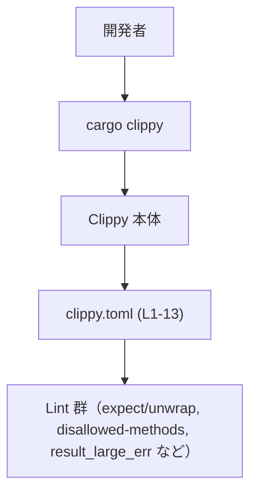
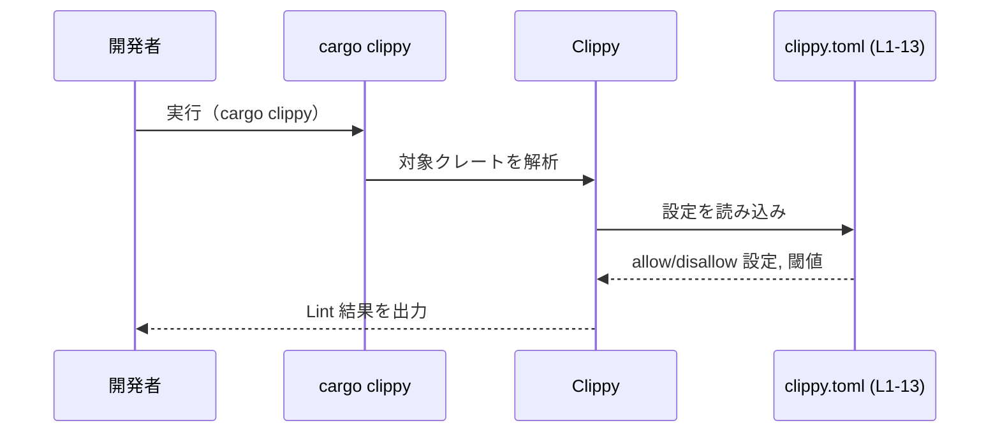

# clippy.toml コード解説

## 0. ざっくり一言

- Rust のリンタである Clippy の挙動を制御する設定ファイルです。  
  テストコード内での `expect` / `unwrap` の扱い、特定の `ratatui` の色関連メソッドの禁止、および `result_large_err` 系の lint に対するエラー型サイズの閾値を定義しています。（根拠: `clippy.toml:L1-8, L11-13`）

---

## 1. このモジュールの役割

### 1.1 概要

- このファイルは Clippy のプロジェクトローカル設定を記述し、以下のような lint の挙動を調整します。（根拠: `clippy.toml:L1-3, L11-13`）
  - テスト内の `expect` / `unwrap` を許可する（`allow-expect-in-tests`, `allow-unwrap-in-tests`）。  
    （根拠: `clippy.toml:L1-2`）
  - UI ライブラリ `ratatui` の特定の色指定メソッドを禁止する（`disallowed-methods`）。  
    （根拠: `clippy.toml:L3-8`）
  - `result_large_err` lint の「大きすぎるエラー型」を判定する閾値 `large-error-threshold` を 256 に引き上げる。  
    （根拠: `clippy.toml:L11-13`）

### 1.2 アーキテクチャ内での位置づけ

- このファイル自体は Rust コードではなく、ツール（Clippy）用の設定ファイルです。
- 一般的な利用フローとしては、`cargo clippy` 実行時に Clippy 本体がこの `clippy.toml` を読み取り、各 lint の挙動を変化させます。



※ `Config` ノードが、このチャンクで与えられた `clippy.toml` 本体を表します。

### 1.3 設計上のポイント

- **テストコードに対する lint 緩和**  
  - `allow-expect-in-tests = true` と `allow-unwrap-in-tests = true` により、テストコードでは `expect` / `unwrap` 使用を許容する方針になっています。（根拠: `clippy.toml:L1-2`）
- **UI のカラーポリシーの明示**  
  - `disallowed-methods` で `ratatui::style::Color::Rgb` / `Indexed` や `Stylize::white` / `black` / `yellow` を禁止し、理由文で「ANSI カラー推奨」「白・黒・黄色のハードコード回避」といったスタイルガイドを記述しています。（根拠: `clippy.toml:L3-8`）
- **大きなエラー型の許容範囲の拡大**  
  - コメントで「よりリッチなエラーバリアントを許容するために閾値を上げる」と説明されています。（根拠: `clippy.toml:L11-12`）
- **状態や並行性は持たない**  
  - TOML 設定ファイルであり、状態管理やスレッド同期などのコードは含まれません。（根拠: `clippy.toml:L1-13`）

---

## 2. 主要な機能一覧（設定項目の一覧）

このファイルが提供する主要な設定機能を列挙します。

- `allow-expect-in-tests`: テストコード内での `expect` 使用を許可する。（根拠: `clippy.toml:L1`）
- `allow-unwrap-in-tests`: テストコード内での `unwrap` 使用を許可する。（根拠: `clippy.toml:L2`）
- `disallowed-methods`: 使用を禁止するメソッドのリストと、その理由を定義する。（根拠: `clippy.toml:L3-8`）
- `large-error-threshold`: `result_large_err` lint が「大きすぎる」とみなすエラー型サイズの閾値を 256 に設定する。（根拠: `clippy.toml:L11-13`）

---

## 3. 公開 API と詳細解説

### 3.1 型一覧（構造体・列挙体など）

- このファイルには Rust の型定義（構造体・列挙体など）は存在しません。（根拠: `clippy.toml:L1-13`）
- 代わりに、Clippy の挙動を変える「設定項目」をコンポーネントとして一覧化します。

| 設定名 | 種別 | 役割 / 用途 | 根拠 |
|--------|------|------------|------|
| `allow-expect-in-tests` | bool | テストコードでの `expect` 呼び出しに対する lint を抑制する設定 | `clippy.toml:L1` |
| `allow-unwrap-in-tests` | bool | テストコードでの `unwrap` 呼び出しに対する lint を抑制する設定 | `clippy.toml:L2` |
| `disallowed-methods` | 配列（テーブル） | 使用を禁止するメソッドと、その理由を列挙する設定 | `clippy.toml:L3-8` |
| `large-error-threshold` | 数値 | `result_large_err` 相当の lint が「大きすぎるエラー型」と判定する閾値 | `clippy.toml:L11-13` |

`disallowed-methods` の各要素は以下のようなフィールドを持ちます。（根拠: `clippy.toml:L4-8`）

| フィールド名 | 型 | 説明 | 根拠 |
|--------------|----|------|------|
| `path` | 文字列 | 禁止対象メソッドの完全修飾パス | `clippy.toml:L4-8` |
| `reason` | 文字列 | 禁止する理由やスタイルガイド上の説明 | `clippy.toml:L4-8` |

### 3.2 関数詳細（最大 7 件）

- 本ファイルは設定のみを記述しており、Rust の関数やメソッドは定義されていません。（根拠: `clippy.toml:L1-13`）
- したがって、このセクションで詳細解説すべき「関数」は存在しません。

### 3.3 その他の関数

- 補助関数やラッパー関数も定義されていません。（根拠: `clippy.toml:L1-13`）

---

## 4. データフロー

ここでは、「`cargo clippy` 実行時に、この設定がどのように適用されるか」の流れを概念的に示します。

1. 開発者がプロジェクトルートで `cargo clippy` を実行する。
2. Clippy が対象クレートと同じディレクトリにある `clippy.toml` を読み込む。
3. 読み込んだ設定に基づき、各 lint（`disallowed-methods` や `result_large_err` など）の挙動を調整する。
4. 調整された lint の結果がコンソールに表示される。



※ この図の `Config` は、このチャンクで与えられた `clippy.toml (L1-13)` を指します。

---

## 5. 使い方（How to Use）

### 5.1 基本的な使用方法

- プロジェクトルート（`Cargo.toml` と同じ階層）にこの `clippy.toml` を置くことで、`cargo clippy` 実行時に自動的に設定が適用されます。

設定の基本構造は次のようになります。

```toml
# テストでの expect/unwrap を許可する                  # テストコードでの lint 緩和
allow-expect-in-tests = true                            # clippy.toml:L1
allow-unwrap-in-tests = true                            # clippy.toml:L2

# 使用を禁止するメソッドと理由を列挙する               # UI スタイルガイドの強制
disallowed-methods = [                                  # clippy.toml:L3
    { path = "ratatui::style::Color::Rgb", reason = "Use ANSI colors, which work better in various terminal themes." },
    { path = "ratatui::style::Color::Indexed", reason = "Use ANSI colors, which work better in various terminal themes." },
    { path = "ratatui::style::Stylize::white", reason = "Avoid hardcoding white; prefer default fg or dim/bold. Exception: Disable this rule if rendering over a hardcoded ANSI background." },
    { path = "ratatui::style::Stylize::black", reason = "Avoid hardcoding black; prefer default fg or dim/bold. Exception: Disable this rule if rendering over a hardcoded ANSI background." },
    { path = "ratatui::style::Stylize::yellow", reason = "Avoid yellow; prefer other colors in `tui/styles.md`." },
]

# result_large_err 用のエラーサイズ閾値を拡大          # clippy.toml:L11-13
large-error-threshold = 256
```

### 5.2 よくある使用パターン

1. **テストでは緩く、実コードでは厳しく lint する**

   - `allow-expect-in-tests = true` / `allow-unwrap-in-tests = true` により、テストのみ例外とし、本番コードでは `expect` / `unwrap` の使用を抑制する運用がしやすくなります。（根拠: `clippy.toml:L1-2`）

2. **UI スタイルガイドを lint で強制する**

   - `disallowed-methods` に UI フレームワーク（ここでは `ratatui`）の色指定メソッドを列挙することで、レビューに頼らず、lint でスタイルガイドを機械的にチェックできます。（根拠: `clippy.toml:L3-8`）

3. **リッチなエラー型を許容する**

   - エラー型がバリアントを多く持つ場合でも、`large-error-threshold = 256` とすることで `result_large_err` の警告を抑え、情報量を優先することができます。（根拠: `clippy.toml:L11-13`）

### 5.3 よくある間違い

※ このファイル単体から直接は読み取れませんが、TOML および Clippy 設定の一般的な注意点として整理します。

- **配列やテーブルでのカンマ漏れ**

  ```toml
  # 誤り例（最後の要素にカンマがないため、構文エラーになる可能性）
  disallowed-methods = [
      { path = "ratatui::style::Color::Rgb", reason = "..." }
      { path = "ratatui::style::Color::Indexed", reason = "..." }
  ]
  ```

  ```toml
  # 正しい例
  disallowed-methods = [
      { path = "ratatui::style::Color::Rgb", reason = "..." },
      { path = "ratatui::style::Color::Indexed", reason = "..." },
  ]
  ```

- **`disallowed-methods` の `path` を誤って書く**

  - 完全修飾パス（例: `ratatui::style::Stylize::white`）を正しく記述しないと、意図したメソッドが禁止されず、lint が効かないことがあります。（根拠: パスが完全修飾形で書かれていること: `clippy.toml:L4-8`）

### 5.4 使用上の注意点（まとめ）

- この設定は Clippy の警告内容に影響を与えるだけであり、コンパイル結果や実行時の安全性・並行性そのものを直接変更するものではありません。（根拠: 設定ファイルのみであること: `clippy.toml:L1-13`）
- `allow-expect-in-tests` / `allow-unwrap-in-tests` を有効にすると、テストコードでのパニックを引き起こしうる箇所が見逃される可能性があります。テスト戦略とのバランスが必要です。（根拠: テスト関連の設定名: `clippy.toml:L1-2`）
- `disallowed-methods` による禁止設定はビルドエラーではなく lint 警告として現れるため、CI で `cargo clippy -- -D warnings` などを用いて警告をエラー扱いにしない限り、強制力は限定的です。（一般的な Clippy の挙動に基づく説明）

---

## 6. 変更の仕方（How to Modify）

### 6.1 新しい機能を追加する場合

このファイルにおける「機能追加」は、新たな設定項目や禁止メソッドを追加することを意味します。

- **別のメソッドを禁止したい場合**
  1. `disallowed-methods` 配列に新しいエントリを追加する。（根拠: 既存エントリの形式: `clippy.toml:L4-8`）
  2. `path` に完全修飾メソッドパスを、`reason` にスタイルガイド上の理由を記述する。

  ```toml
  disallowed-methods = [
      { path = "ratatui::style::Color::Rgb", reason = "..." },
      # 新しい禁止メソッド
      { path = "ratatui::widgets::Block::border_style", reason = "Use a predefined style from tui/styles.md." },
  ]
  ```

- **別の Clippy 設定を追加したい場合**
  - Clippy がサポートする他の設定キー（`msrv` など）を追加することができますが、このファイルには現れていないため、具体的なキー一覧はここからは分かりません。（「このチャンクには現れない」）

### 6.2 既存の機能を変更する場合

- **テストでの `expect` / `unwrap` の扱いを変更する**

  - 例: テストでも `unwrap` を禁止したい場合は、次のように変更します。

    ```toml
    allow-expect-in-tests = true   # expect は許可
    allow-unwrap-in-tests = false  # unwrap は禁止
    ```

- **カラーポリシーの緩和・強化**

  - `disallowed-methods` の各要素を削除・追加・変更することで、UI カラーに関するスタイルガイドを変えることができます。（根拠: `clippy.toml:L3-8`）

- **エラー型の許容サイズの見直し**

  - `large-error-threshold` の数値を小さくすると、より厳しく `result_large_err` lint を適用できます。大きくするとリッチなエラー型を許容する方向になります。（根拠: `clippy.toml:L11-13`）

変更時の注意点:

- TOML 構文エラーがあると Clippy が設定を正しく読み込めない可能性があります。
- CI や開発ルールで Clippy の警告をどの程度重視するかによって、これらの設定の「実効力」が変わります。

---

## 7. 関連ファイル

このチャンクから直接参照できる、または文面から推測される関連ファイルは以下の通りです。

| パス / 名称 | 役割 / 関係 | 根拠 |
|-------------|------------|------|
| `clippy.toml`（本ファイル） | Clippy のローカル設定ファイル | `clippy.toml:L1-13` |
| `tui/styles.md` | `disallowed-methods` の理由文中で参照されているスタイルガイド的なドキュメント。実体や場所はこのチャンクからは不明。 | `clippy.toml:L8` |
| `Cargo.toml` | 一般的に同じディレクトリに存在し、この `clippy.toml` が適用される対象クレートを定義するが、本チャンクには現れない。 | 「このチャンクには現れない」 |

- テストコードや `ratatui` を用いた UI コードなど、実際に Clippy の lint 対象となる Rust ファイル群は、このチャンクには現れません。
