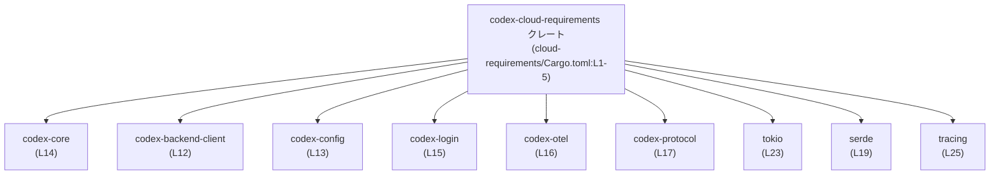
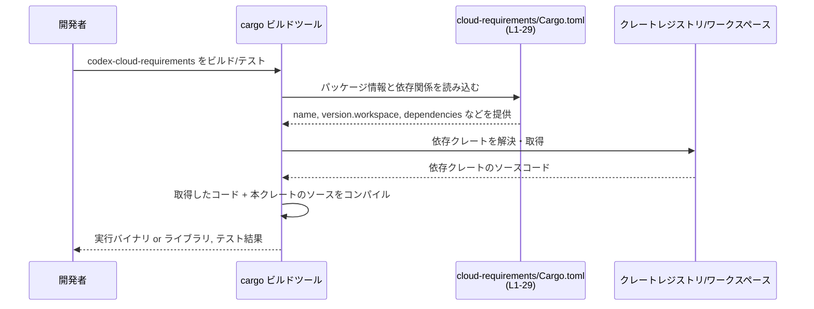

# cloud-requirements/Cargo.toml コード解説

## 0. ざっくり一言

`cloud-requirements/Cargo.toml` は、Rust クレート `codex-cloud-requirements` の **パッケージ情報と依存クレート構成** を定義するマニフェストファイルです（`cloud-requirements/Cargo.toml:L1-5,8-29`）。  
このファイル自体には関数や構造体などの実装コードは含まれていません。

---

## 1. このモジュールの役割

### 1.1 概要

- Rust のビルドツール `cargo` が参照する **マニフェスト** であり、次を定義します。
  - パッケージ名とワークスペース共通の版・edition・ライセンス（`L1-5`）
  - ワークスペース共通の Lint 設定の利用（`L6-7`）
  - 本番コードで利用する依存クレート（`[dependencies]` セクション, `L8-25`）
  - テスト・開発時のみ利用する依存クレート（`[dev-dependencies]` セクション, `L26-29`）
- このファイルからは **公開 API やコアロジックの中身は一切読み取れません**。

### 1.2 アーキテクチャ内での位置づけ

このファイルからは、「`codex-cloud-requirements` クレートがどのクレートに依存しているか」だけが分かります。

主な依存関係（最大 10 ノードに絞り込み）を図示します。



- 中央のノード `codex-cloud-requirements` は、このディレクトリのクレートです（`L1-5`）。
- 周囲のノードは、このクレートから **直接依存** しているクレートです（`L12-17,19,23,25`）。
- これら依存クレート内部の構造や、どのように呼び出しているかは、このファイルからは分かりません。

### 1.3 設計上のポイント（このファイルから分かる範囲）

- **ワークスペース共通設定の活用**  
  - `version.workspace = true` / `edition.workspace = true` / `license.workspace = true` で、版・edition・ライセンスをワークスペース側に一元化しています（`L3-5`）。
  - `[lints] workspace = true` により、Lint（コンパイラ警告ルール）もワークスペース共通設定を利用します（`L6-7`）。
- **非同期・並行処理基盤の利用前提**  
  - `tokio`（非同期ランタイム, `L23`）と `async-trait`（非同期関数を含むトレイト定義用, `L9`）に依存しています。
  - これにより、このクレート内の実装は **Tokio ベースの非同期 / 並行処理** を前提としている可能性が高いですが、具体的な API 利用はこのファイルからは不明です。
- **シリアライズ／設定ファイル系**  
  - `serde` / `serde_json` / `toml` / `chrono`（`L11,19-20,24`）により、構造体⇔JSON/TOML⇔日時 などの変換を行う前提になっています。
- **暗号・認証系**  
  - `hmac` / `sha2` / `base64`（`L10,18,21`）により、HMAC や SHA-2 ハッシュ、Base64 エンコードなどの暗号処理を行う前提になっています。
- **エラーと観測性**  
  - `thiserror` により、カスタムエラー型を実装する構成（`L22`）。
  - `tracing` と `codex-otel` により、ログ／トレース／計測などの観測性を高める構成（`L16,25`）。
- **Codex 内部クレートとの連携**  
  - `codex-core`, `codex-config`, `codex-backend-client`, `codex-login`, `codex-protocol` など、同一プロジェクト内と思われるクレートに依存しています（`L12-15,17`）。  
    これらがどのような公開 API を提供しているか、また本クレートがそれをどう使っているかは、このファイルからは分かりません。

---

## 2. 主要な機能一覧（このファイルから推定できるレベル）

この Cargo.toml には **関数やメソッドの定義がなく**、実装の詳細は不明です。  
以下は「依存クレートが提供する機能」として、このクレートが **利用する前提になっている機能領域** を列挙したものです。

- 非同期処理・並行実行基盤の利用  
  - `tokio`（`L23`）、`async-trait`（`L9`）により、非同期関数・タスク・同期プリミティブ（ミューテックスなど）を使った並行処理が可能です。
- 設定・シリアライズ関連  
  - `serde`, `serde_json`, `toml`（`L19-20,24`）により、構造体と JSON / TOML の相互変換が可能です。
  - `chrono` + `serde`（`L11,19`）により、日時型のシリアライズ・デシリアライズが可能です。
- 認証・ハッシュ関連  
  - `hmac` / `sha2` / `base64`（`L10,18,21`）で、HMAC-SHA2 などのメッセージ認証コードやハッシュ計算、バイナリデータの Base64 表現が扱えます。
- エラー処理  
  - `thiserror`（`L22`）により、エラー型を `Result<T, E>` の `E` として定義しやすくなっています。
- ログ・トレーシング・テレメトリ  
  - `tracing` / `codex-otel`（`L16,25`）により、構造化ログや分散トレーシングとの連携が可能です。
- Codex プロジェクト内部との連携  
  - `codex-core`, `codex-config`, `codex-backend-client`, `codex-login`, `codex-protocol`（`L12-15,17`）が、プロジェクト内のドメインロジック・設定・バックエンド連携に関する API を提供していると推測されますが、具体的なメソッド名や型は **このファイルには現れません**。

---

## 3. 公開 API と詳細解説

### 3.1 コンポーネント一覧（クレート & 依存クレートインベントリー）

このファイルに **型定義や関数定義は一切含まれていない** ため、ここではコンポーネントを「クレート単位」で一覧化します。

| 名称 | 種別 | 役割 / 用途（一般的な説明） | 根拠 |
|------|------|-----------------------------|------|
| `codex-cloud-requirements` | クレート（パッケージ） | クラウド要件に関する機能をまとめたクレートであると考えられますが、API 内容はこのファイルからは不明です。 | `cloud-requirements/Cargo.toml:L1-5` |
| `async-trait` | 通常依存 | Rust で `async fn` を含むトレイトを定義するための補助クレートです。 | `cloud-requirements/Cargo.toml:L9` |
| `base64` | 通常依存 | Base64 エンコード／デコード機能を提供します。 | `L10` |
| `chrono`（`features = ["serde"]`） | 通常依存 | 日時・期間などの時間関連型を提供し、`serde` 連携によりシリアライズ／デシリアライズも可能です。 | `L11` |
| `codex-backend-client` | 通常依存（プロジェクト内クレート） | バックエンドと通信するためのクライアント機能を提供していると推測されますが、詳細 API は不明です。 | `L12` |
| `codex-config` | 通常依存（プロジェクト内クレート） | 設定読み込み・保持などの機能を持つと推測されますが、詳細は不明です。 | `L13` |
| `codex-core` | 通常依存（プロジェクト内クレート） | プロジェクトのコアドメインロジックを提供していると推測されますが、詳細は不明です。 | `L14` |
| `codex-login` | 通常依存（プロジェクト内クレート） | 認証・ログイン関連の機能を持つと推測されますが、詳細は不明です。 | `L15` |
| `codex-otel` | 通常依存（プロジェクト内クレート） | OpenTelemetry 連携やトレーシング設定を提供するクレートと推測されます。 | `L16` |
| `codex-protocol` | 通常依存（プロジェクト内クレート） | プロジェクト内で用いる通信プロトコル／メッセージ定義を扱うと推測されます。 | `L17` |
| `hmac` | 通常依存 | HMAC（鍵付きハッシュ）アルゴリズムの実装を提供します。 | `L18` |
| `serde`（`features = ["derive"]`） | 通常依存 | 構造体や列挙体のシリアライズ／デシリアライズを行うためのフレームワークで、`derive` 機能により自動実装が可能です。 | `L19` |
| `serde_json` | 通常依存 | JSON とのシリアライズ／デシリアライズを提供します。 | `L20` |
| `sha2` | 通常依存 | SHA-2 系ハッシュ関数の実装を提供します。 | `L21` |
| `thiserror` | 通常依存 | カスタムエラー型を簡潔に定義するためのマクロを提供します。 | `L22` |
| `tokio`（`features = ["fs","sync","time"]`） | 通常依存 | 非同期ランタイム。ファイル I/O (`fs`), 同期プリミティブ (`sync`), 時刻操作 (`time`) の機能が有効化されています。 | `L23` |
| `toml` | 通常依存 | TOML 形式のパース／生成を行います。 | `L24` |
| `tracing` | 通常依存 | 構造化ログおよびトレーシングのためのフレームワークです。 | `L25` |
| `pretty_assertions` | 開発依存 | テスト時に読みやすい差分を表示するアサーション補助クレートです。 | `L27` |
| `tempfile` | 開発依存 | 一時ファイル／一時ディレクトリの安全な生成を行います。テストでよく使われます。 | `L28` |
| `tokio`（`features = ["macros","rt","test-util","time"]`） | 開発依存 | テスト用の Tokio。マクロ（`#[tokio::test]` 等）やテストユーティリティが有効化されています。 | `L29` |

> 注記: 上記の「役割 / 用途」は、各クレートの一般的な機能説明であり、**`codex-cloud-requirements` クレートがどの機能をどのように使っているかは、このファイルからは分かりません**。

### 3.2 関数詳細

このファイルは **Cargo の設定ファイル** であり、Rust の関数・メソッド・構造体などのコードは含まれていないため、  
関数ごとの詳細解説（引数・戻り値・内部処理・エラー条件など）は **このチャンクでは記述できません**。

- 実際の公開 API（`pub fn` / `pub struct` など）は、おそらく `cloud-requirements/src/lib.rs` や `src/main.rs` 等に定義されていますが、これらのファイルは **このチャンクには現れません**。

### 3.3 その他の関数

- 該当なし（このファイルには関数定義が存在しません）。

---

## 4. データフロー

このファイル自体は **実行時のデータを処理しません**。  
ここでは、「Cargo.toml (L1-29) がビルド時にどのように使われるか」という観点でのデータ／制御フローを示します。



- この図は、**ビルド・テスト時の流れ** を示しています。
- ランタイムにおける `codex-cloud-requirements` 内部のデータフロー（どの関数がどの依存クレートの API を呼び出すか）は、実装コードがないため **不明** です。

---

## 5. 使い方（How to Use）

### 5.1 基本的な使用方法（この Cargo.toml の役割）

このファイルの主な「使い方」は、**依存クレートや共通設定を管理すること** です。

- `codex-cloud-requirements` クレートのビルド時に、`cargo` はこのファイルを読み、依存クレートを解決します（`L1-5,8-29`）。
- ワークスペース構成の場合、他のクレートから `codex-cloud-requirements` を利用する際には、別クレートの `Cargo.toml` で次のように指定することが一般的です（構成は推測です）。

```toml
# 別クレート側の Cargo.toml の一例（推測）
[dependencies]
codex-cloud-requirements = { workspace = true }
```

> 注記: `workspace = true` という指定方法が実際に使われているかは、このチャンクでは確認できませんが、  
> 本ファイルの他依存（`codex-core` など）が同様に `workspace = true` で管理されていることから（`L12-15,17`）、  
> 同様のパターンが用いられる可能性があります。

### 5.2 よくある使用パターン（設定変更の例）

このファイルを編集する際の典型的なパターンを、コード例として示します。

1. **Tokio 機能の追加**

```toml
[dependencies]
# 現状（ファイルに書かれている内容）             # cloud-requirements/Cargo.toml:L23
tokio = { workspace = true, features = ["fs", "sync", "time"] }

# 例: ネットワーク I/O も使いたくなった場合（例示）
# tokio = { workspace = true, features = ["fs", "sync", "time", "net"] }
```

- 実際に `net` 機能などを必要とするかは、実装コード次第であり、このチャンクからは分かりません。

1. **新しいシリアライズ形式を追加する**

```toml
[dependencies]
serde = { workspace = true, features = ["derive"] }  # L19
serde_json = { workspace = true }                    # L20
toml = { workspace = true }                          # L24

# 例: YAML 対応を追加したい場合（例示）
# serde_yaml = "0.9"
```

- `serde_yaml` のようなクレートを追加することで、別のシリアライズ形式も扱えるようになりますが、  
  実際に必要かどうかはドメイン要件と既存コード次第です。

### 5.3 よくある間違い（推測されるポイント）

このファイルから推測できる、「起こりやすい設定ミス」をいくつか挙げます。

```toml
[dependencies]
tokio = { workspace = true, features = ["fs", "sync", "time"] }  # 本体用 L23

[dev-dependencies]
tokio = { workspace = true, features = ["macros", "rt", "test-util", "time"] }  # テスト用 L29
```

- **間違い例（推測）**  
  - テストコードで `#[tokio::test]` を使いたいが、`dev-dependencies` の `tokio` に `macros` を付け忘れる。
  - ライブラリ側でも `#[tokio::main]` などのマクロを使う必要があるのに、通常依存側の `tokio` に `macros` を追加していない。
- **正しい例（例示）**

```toml
[dependencies]
tokio = { workspace = true, features = ["fs", "sync", "time", "macros"] }

[dev-dependencies]
tokio = { workspace = true, features = ["macros", "rt", "test-util", "time"] }
```

> 実際に `macros` を本体側で有効化すべきかどうかは、このクレートの実装によります。  
> このチャンクには実装がないため、必要性は判断できません。

### 5.4 使用上の注意点（まとめ）

- **ワークスペース設定との整合性**  
  - `version.workspace = true` 等を使用しているため（`L3-5`）、ワークスペース側の設定を変更すると、このクレートにも影響します。
- **非同期ランタイムの一貫性**  
  - `tokio` を利用しているため（`L23,29`）、ワークスペース全体で複数の非同期ランタイムを混在させる場合は注意が必要です（一般論）。
- **暗号ライブラリのバージョン管理**  
  - `hmac`, `sha2`, `base64` などはセキュリティに関わるため（`L10,18,21`）、アップデートの際には変更履歴や脆弱性情報を確認する必要があります。
- **依存クレートの機能フラグ（features）**  
  - `chrono` や `serde`, `tokio` など、一部のクレートには `features` が指定されています（`L11,19,23`）。  
    これを変更するとビルド結果やランタイム挙動が変わるため、実装コードを確認しながら調整する必要があります。

---

## 6. 変更の仕方（How to Modify）

### 6.1 新しい機能を追加する場合（このファイル観点）

新しい機能を追加する際、**新たな依存クレートが必要になる場合** の手順は次のようになります。

1. 必要な機能を提供するクレートを選定する。  
   （例: HTTP クライアントが必要であれば `reqwest` など。ここでは一般論であり、このプロジェクト固有ではありません）
2. `[dependencies]` セクション（`L8-25`）に新しい依存を追加する。

```toml
[dependencies]
# 既存
serde = { workspace = true, features = ["derive"] }
# 追加（例示）
# reqwest = { version = "0.12", features = ["json"] }
```

1. 実装側コード（このチャンクには存在しないファイル）で、そのクレートの API を利用する。
2. ビルド・テストを実行し、既存機能との干渉がないか確認する。

### 6.2 既存の機能を変更する場合（依存更新を例に）

既存の機能変更に伴い、依存クレートや features を変更する際の注意点です。

- **影響範囲の確認**
  - 例えば `tokio` の feature を変更する場合（`L23,29`）、  
    - ランタイムの初期化方法  
    - 使用している I/O 機能（fs/net など）  
    - テストの実行方法  
    に影響する可能性があります。  
    ただし、どの API を使っているかはこのファイルからは分からないため、実装ファイル側を確認する必要があります。
- **契約（前提条件）の保持**
  - `thiserror` を利用したエラー型（`L22`）、`serde` を利用したシリアライズ形式（`L19-20,24`）などを変更する場合、  
    他クレートや外部とのインターフェースが変わるかどうかを確認する必要があります。
- **テストコードとの整合**
  - `dev-dependencies` の `tokio` や `tempfile` など（`L27-29`）を変更すると、  
    既存テストの前提（例: 一時ファイルの扱い、非同期テストの書き方）が変わる可能性があります。

---

## 7. 関連ファイル

このチャンクでは `cloud-requirements/Cargo.toml` のみが与えられているため、  
**実際のソースコードファイルや他の設定ファイルのパスは不明** です。

一般的には、次のようなファイルが存在することが多いですが、あくまで一般論であり、このリポジトリに実在するかは分かりません。

| パス（推測を含む） | 役割 / 関係 |
|--------------------|------------|
| `cloud-requirements/src/lib.rs` または `src/main.rs`（推測） | `codex-cloud-requirements` クレートの実装コードや公開 API を定義するファイルであると考えられますが、このチャンクには現れません。 |
| ワークスペースルートの `Cargo.toml`（推測） | `version.workspace = true` などのワークスペース共通設定を定義していると考えられますが、このチャンクにはパス情報はありません。 |

> まとめると、**公開 API やコアロジック、言語固有の安全性・エラー処理・並行性の詳細は、この Cargo.toml だけからは評価できません**。  
> それらを把握するには、実際の Rust ソースコード（`src/` 以下）を確認する必要があります。
