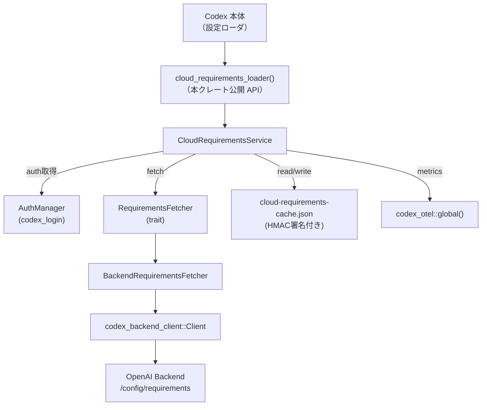
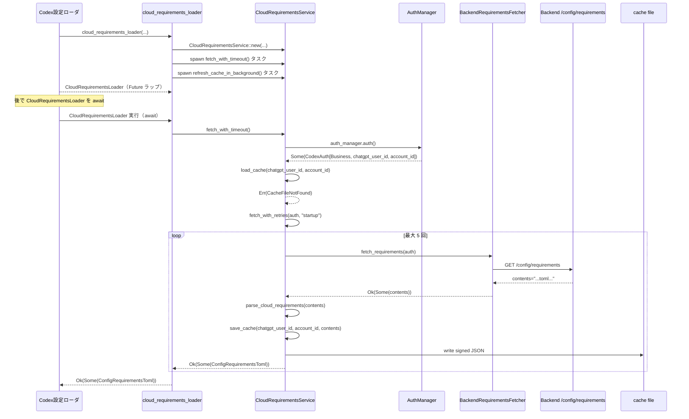

# cloud-requirements/src/lib.rs

## 0. ざっくり一言

ChatGPT Business / Enterprise 向けの「クラウド管理 requirements.toml」をバックエンドから取得し、HMAC 署名付きキャッシュに保存・再利用しつつ、取得に失敗した場合は「安全側に倒して」設定ロード自体を失敗させるためのモジュールです。  
（根拠: `cloud-requirements/src/lib.rs:L1-1963`）

---

## 1. このモジュールの役割

### 1.1 概要

- このモジュールは **クラウド側で管理される Codex 設定 (requirements.toml)** を取得し、ローカル設定ロードと統合するために存在します。
- 対象は ChatGPT Business / Enterprise（`PlanType::Business` 相当の `is_business_like()` および `PlanType::Enterprise`）のアカウントに限定されます。  
  → それ以外のプランや非 ChatGPT 認証ではクラウド requirements を一切使わず、常に `Ok(None)` を返します。  
- ネットワークエラー・認証エラー・パースエラーなどで requirements を取得できない場合、**対象プランでは「fail closed」**（設定ロードを失敗として扱う）挙動になります。  
- HMAC 署名付き JSON キャッシュを `cloud-requirements-cache.json` として保存し、署名・ユーザー ID・アカウント ID・TTL を検証した上でのみ利用します。  
（根拠: プラン判定と fail-closed ロジック `fetch`, `fetch_with_retries`, エラーメッセージ定数 `CLOUD_REQUIREMENTS_*`; `cloud-requirements/src/lib.rs:L1-1963`）

### 1.2 アーキテクチャ内での位置づけ

クラウド requirements ロードの位置づけを簡易図にすると次のようになります。



- Codex 本体（`codex_core::config_loader::CloudRequirementsLoader`）から見た公開窓口は `cloud_requirements_loader` / `cloud_requirements_loader_for_storage` の 2 関数です。
- 実際の取得・キャッシュ処理は `CloudRequirementsService` に集約されており、HTTP 呼び出し部分は `RequirementsFetcher` トレイト経由で切り離されています。
- `BackendRequirementsFetcher` はデフォルトの実装として、`codex_backend_client::Client` を用いて `/config/requirements` エンドポイントから TOML 文字列を取得します。
- キャッシュは HMAC（`HmacSha256`）で署名され、ユーザー ID / アカウント ID / 有効期限が一致しないと利用されません。  
（根拠: 構造体・トレイト定義と `cloud_requirements_loader` 実装; `cloud-requirements/src/lib.rs:L1-1963`）

### 1.3 設計上のポイント

- **責務分割**
  - ネットワーク取得を `RequirementsFetcher` トレイトで抽象化し、本番では `BackendRequirementsFetcher`、テストではモック fetcher を利用できる構造です。
  - 認可・プラン判定・リトライ・キャッシュ I/O を `CloudRequirementsService` に集約しています。
- **fail-closed ポリシー**
  - 対象プランのユーザーでクラウド requirements が取得できない場合、`CloudRequirementsLoadError` を返して設定ロード全体を失敗にします。  
    （例: `Timeout`, `RequestFailed`, `Auth`, `Parse` エラーコード）  
- **安全なキャッシュ**
  - キャッシュファイルは JSON で、`signed_payload` と `signature` の 2 フィールドを持ちます。
  - 署名は固定シークレットキーによる HMAC-SHA256 で、読み込み時に署名検証・ユーザー ID / アカウント ID 一致・有効期限チェックをすべて通った場合のみ利用されます。
- **非同期・並行性**
  - 起動時の一度きりのフェッチ（`fetch_with_timeout`）と、バックグラウンドでの定期リフレッシュ（`refresh_cache_in_background`）の 2 系統があります。
  - リフレッシュタスクは `OnceLock<Mutex<Option<JoinHandle<()>>>>` でグローバルに 1 つに制限され、新しいローダ生成時には古いタスクを `abort()` して置き換えます。
- **エラーと観測性**
  - 各フェッチ試行ごとに `codex.cloud_requirements.fetch_attempt`、最終結果に `codex.cloud_requirements.fetch_final`、ロード全体には `codex.cloud_requirements.load` のメトリクスを送信します。
  - トレースログで成功/失敗・リトライ・キャッシュ状態を詳細に出力します。  
（根拠: `CloudRequirementsService` と周辺関数、定数定義; `cloud-requirements/src/lib.rs:L1-1963`）

---

## 2. 主要な機能一覧

本ファイルが提供する主な機能です（本番コードのみ）。

- クラウド requirements ローダ生成:
  - `cloud_requirements_loader`: 既存の `AuthManager` を利用して `CloudRequirementsLoader` を構築。
  - `cloud_requirements_loader_for_storage`: `AuthManager::shared` を用いてストレージ連携前提のローダを構築。
- クラウド requirements 取得サービス:
  - `CloudRequirementsService::fetch_with_timeout`: 起動時にタイムアウト付きで requirements を取得。
  - `CloudRequirementsService::fetch`: プラン判定・キャッシュ利用・フェッチ処理の統合。
  - `CloudRequirementsService::fetch_with_retries`: リトライや認証リフレッシュを含むフェッチ本体。
  - `CloudRequirementsService::refresh_cache_in_background`: バックグラウンドで定期的にキャッシュを更新。
  - `CloudRequirementsService::refresh_cache`: 単発のキャッシュリフレッシュ。
- キャッシュ管理:
  - `CloudRequirementsService::load_cache`: HMAC 検証付きキャッシュ読み込み。
  - `CloudRequirementsService::save_cache`: 署名付きキャッシュ書き込み。
  - `CloudRequirementsCacheSignedPayload::requirements`: キャッシュ内 TOML テキストのパース。
- TOML パース:
  - `parse_cloud_requirements`: 空・空相当の TOML を `None` として扱うパーサ。
- メトリクス/ユーティリティ:
  - `emit_fetch_attempt_metric`, `emit_fetch_final_metric`, `emit_load_metric`, `emit_metric`, `status_code_tag`。
  - HMAC 関連: `sign_cache_payload`, `verify_cache_signature`, `verify_cache_signature_with_key`, `cache_payload_bytes`。
  - 認証情報抽出: `auth_identity`。
- テスト用コンポーネント:
  - `StaticFetcher`, `PendingFetcher`, `SequenceFetcher`, `TokenFetcher`, `UnauthorizedFetcher` などのテスト専用 `RequirementsFetcher` 実装。  
（根拠: 関数・構造体定義; `cloud-requirements/src/lib.rs:L1-1963`）

---

## 3. 公開 API と詳細解説

### 3.1 型一覧（構造体・列挙体など）

本番コードで主要な型の一覧です。

| 名前 | 種別 | 公開範囲 | 役割 / 用途 | 定義位置 |
|------|------|----------|-------------|----------|
| `RetryableFailureKind` | enum | private | リトライ可能な失敗の種別（クライアント初期化／HTTP リクエスト＋ステータスコード） | `cloud-requirements/src/lib.rs:L1-1963` |
| `FetchAttemptError` | enum | private | 1 回のフェッチ試行の結果エラー（リトライ可能 or Unauthorized） | 同上 |
| `CacheLoadStatus` | enum + `Error` | private | キャッシュ読み込みのステータス（ファイルなし・署名不正・ID 不一致・有効期限切れなど） | 同上 |
| `CloudRequirementsError` | enum + `Error` | private | キャッシュ書き込み失敗を表す内部エラー | 同上 |
| `CloudRequirementsCacheFile` | struct | private | JSON キャッシュファイルのルート（署名付きペイロード＋署名文字列） | 同上 |
| `CloudRequirementsCacheSignedPayload` | struct | private | 署名対象のペイロード。発行時刻・期限・ユーザー/アカウント ID・TOML 文字列を含む | 同上 |
| `RequirementsFetcher` | trait（async） | private | `CodexAuth` を受け取り、クラウド requirements TOML を取得する抽象インターフェース | 同上 |
| `BackendRequirementsFetcher` | struct | private | `codex_backend_client::Client` を用いる本番 HTTP 実装 | 同上 |
| `CloudRequirementsService` | struct | private | 認証・プラン判定・キャッシュ・リトライを統合したサービス | 同上 |
| `HmacSha256` | type alias | private | `Hmac<Sha256>` の別名。キャッシュ署名に利用 | 同上 |

※ すべて crate 内 private であり、外部に公開される型は `CloudRequirementsLoader`（他 crate）と関数戻り値を介して使われます。

### 3.2 関数詳細（主要 7 件）

#### `pub fn cloud_requirements_loader(auth_manager: Arc<AuthManager>, chatgpt_base_url: String, codex_home: PathBuf) -> CloudRequirementsLoader`

**概要**

- 既存の `AuthManager` を利用して、クラウド requirements を読み込む `CloudRequirementsLoader` を構築する公開 API です。
- 起動時の一度きりのフェッチと、その後のバックグラウンド更新タスクを起動します。  
（根拠: 関数定義・実装; `cloud-requirements/src/lib.rs:L1-1963`）

**引数**

| 引数名 | 型 | 説明 |
|--------|----|------|
| `auth_manager` | `Arc<AuthManager>` | 認証情報の取得・更新（トークンリフレッシュ）を担うマネージャ。共有参照として渡されます。 |
| `chatgpt_base_url` | `String` | バックエンドのベース URL。`BackendRequirementsFetcher` が `Client::from_auth` に渡します。 |
| `codex_home` | `PathBuf` | キャッシュファイル置き場となる Codex ホームディレクトリパス。 |

**戻り値**

- `CloudRequirementsLoader`（`codex_core::config_loader` の型）  
  - 内部的には `CloudRequirementsService::fetch_with_timeout` を実行する Future をラップします。
  - 具体的なメソッド（例: `.load().await`）は他 crate 側の API になります。  

**内部処理の流れ**

1. `CloudRequirementsService::new` でサービスインスタンスを生成。
2. `service.fetch_with_timeout().await` を実行するタスクを `tokio::spawn` し、JoinHandle を取得。
3. `refresh_service.refresh_cache_in_background().await` を実行する別タスクを `tokio::spawn`。
4. グローバルな `refresher_task_slot()`（`OnceLock<Mutex<Option<JoinHandle<()>>>>`）に新しいリフレッシュタスクを登録し、既存タスクがあれば `abort()`。
5. `CloudRequirementsLoader::new(async move { ... })` で、起動時フェッチタスクの結果を待つ Future を作成。
   - Join が失敗した場合（スレッドパニックなど）は `CloudRequirementsLoadErrorCode::Internal` としてラップ。  

**Examples（使用例）**

`CloudRequirementsLoader` の具体的な API はこのファイルからは分かりませんが、概念的には次のような利用になります。

```rust
use std::sync::Arc;
use std::path::PathBuf;
use codex_login::AuthManager;
use codex_config::types::AuthCredentialsStoreMode;
use cloud_requirements::cloud_requirements_loader;

fn build_cloud_loader() -> codex_core::config_loader::CloudRequirementsLoader {
    // AuthManager はアプリ側で共有しているものを使う
    let codex_home = PathBuf::from("/path/to/codex-home");
    let auth_manager = AuthManager::shared(
        codex_home.clone(),
        /*enable_codex_api_key_env*/ false,
        AuthCredentialsStoreMode::File,
    );

    let chatgpt_base_url = "https://chatgpt.com".to_string();

    // CloudRequirementsLoader を構築
    cloud_requirements_loader(Arc::clone(&auth_manager), chatgpt_base_url, codex_home)
}
```

**Errors / Panics**

- 関数自体は `Result` を返さず panic もしませんが、返却される `CloudRequirementsLoader` を実行した際に:
  - 起動時フェッチが `Timeout` / `RequestFailed` / `Auth` / `Parse` / `Internal` などの `CloudRequirementsLoadError` を返しうる設計です。
- `refresher_task_slot().lock()` で `Mutex` が poison されていた場合でも、`unwrap_or_else` でログを出しつつ `into_inner()` して継続します。  

**Edge cases（エッジケース）**

- 複数回呼び出された場合:
  - グローバルリフレッシュタスクは最後に作られたもののみが有効で、以前のものは `abort()` されます。
  - 起動時フェッチ用タスクはそれぞれの `CloudRequirementsLoader` に紐づくため、呼び出し側の利用方法に依存します。
- `chatgpt_base_url` が不正な場合:
  - `BackendClient::from_auth` などで失敗した結果として `CloudRequirementsLoadErrorCode::RequestFailed` などが返る可能性があります。  

**使用上の注意点**

- 内部で `tokio::spawn` を利用するため、**Tokio ランタイム上で呼び出すこと** が前提です。
- `AuthManager` と `codex_home` は、他のローダと同じものを共有することで、一貫した認証・キャッシュ動作を前提としています。

---

#### `pub fn cloud_requirements_loader_for_storage(codex_home: PathBuf, enable_codex_api_key_env: bool, credentials_store_mode: AuthCredentialsStoreMode, chatgpt_base_url: String) -> CloudRequirementsLoader`

**概要**

- `AuthManager::shared` のパラメータ（ストレージ連携・API キー環境変数の扱いなど）を受け取り、そのまま `cloud_requirements_loader` を呼び出すヘルパ関数です。  
（根拠: 関数定義; `cloud-requirements/src/lib.rs:L1-1963`）

**引数**

| 引数名 | 型 | 説明 |
|--------|----|------|
| `codex_home` | `PathBuf` | 認証情報・キャッシュファイルのベースディレクトリ。 |
| `enable_codex_api_key_env` | `bool` | API キー環境変数利用を有効にするかどうか。`AuthManager::shared` にそのまま渡されます。 |
| `credentials_store_mode` | `AuthCredentialsStoreMode` | 認証情報保存モード（ファイル・キーチェーンなど）。 |
| `chatgpt_base_url` | `String` | バックエンドのベース URL。 |

**戻り値**

- `CloudRequirementsLoader`。内部的には `AuthManager::shared` で作成した `AuthManager` を用いた `cloud_requirements_loader` の結果です。

**内部処理の流れ**

1. `AuthManager::shared(codex_home.clone(), enable_codex_api_key_env, credentials_store_mode)` で共有 `AuthManager` を取得。
2. `cloud_requirements_loader(auth_manager, chatgpt_base_url, codex_home)` を呼んで、その戻り値をそのまま返します。

**Examples（使用例）**

```rust
use codex_config::types::AuthCredentialsStoreMode;
use cloud_requirements::cloud_requirements_loader_for_storage;
use std::path::PathBuf;

fn build_loader_for_cli() -> codex_core::config_loader::CloudRequirementsLoader {
    let codex_home = PathBuf::from("/path/to/codex-home");
    cloud_requirements_loader_for_storage(
        codex_home,
        /*enable_codex_api_key_env*/ true,
        AuthCredentialsStoreMode::File,
        "https://chatgpt.com".to_string(),
    )
}
```

**Errors / Panics・Edge cases・使用上の注意点**

- `cloud_requirements_loader` と同じ注意点がそのまま当てはまります。
- `enable_codex_api_key_env` や `credentials_store_mode` によって `AuthManager` の挙動が変わるため、CLI や環境設定の仕様と合わせて設定する必要があります。

---

#### `impl CloudRequirementsService::fetch_with_timeout(&self) -> Result<Option<ConfigRequirementsToml>, CloudRequirementsLoadError>`

**概要**

- 起動時のクラウド requirements ロードを、全体タイムアウト付きで実行する関数です。
- 成功時は `Some(ConfigRequirementsToml)` または `None`（クラウド requirements 無し）を返し、タイムアウト・内部エラーの際は `CloudRequirementsLoadError` を返します。  
（根拠: メソッド実装; `cloud-requirements/src/lib.rs:L1-1963`）

**引数**

- `&self`: `CloudRequirementsService` インスタンス。

**戻り値**

- `Ok(Some(ConfigRequirementsToml))`: 正常にクラウド requirements を取得できた場合。
- `Ok(None)`: 対象プランだがクラウド requirements が存在しない、あるいは非対象プラン／認証なしの場合。
- `Err(CloudRequirementsLoadError)`: タイムアウト・フェッチ失敗など。  

**内部処理の流れ**

1. OpenTelemetry のタイマー `codex.cloud_requirements.fetch.duration_ms` を開始。
2. `tokio::time::timeout(self.timeout, self.fetch())` で `fetch()` をタイムアウト付き実行。
3. `timeout` が `Err` の場合:
   - ログにタイムアウトメッセージを出力。
   - `emit_load_metric("startup", "error")` を送信。
   - `CloudRequirementsLoadError::new(Timeout, None, ...)` を返す。
4. `timeout` が `Ok(fetch_result)` の場合:
   - `fetch_result` が `Err` なら `emit_load_metric("startup", "error")` を出してそのまま返す。
   - `Ok(result)` なら内容（`Some` or `None`）に応じてログを出し、`emit_load_metric("startup", "success")` を送信。
5. 最後に `Ok(result)` を返す。

**Examples（使用例）**

テストコードと同様に、サービスを直接使う例です（crate 内からの利用を想定）。

```rust
use std::sync::Arc;
use std::path::PathBuf;

async fn example(service: CloudRequirementsService) -> Result<(), CloudRequirementsLoadError> {
    match service.fetch_with_timeout().await? {
        Some(requirements) => {
            // requirements.toml に従って処理を分岐するなど
            println!("Loaded requirements: {:?}", requirements);
        }
        None => {
            // クラウド requirements が無い場合の扱い
            println!("No cloud requirements for this account");
        }
    }
    Ok(())
}
```

**Errors / Panics**

- タイムアウト時: `CloudRequirementsLoadErrorCode::Timeout`。
- 内部で呼ばれる `fetch()` が返したエラー（`RequestFailed`, `Auth`, `Parse` 等）をそのまま返します。
- panic は使用している API 上ほぼ発生しない設計です（`timeout` と `Result` ベースで処理）。  

**Edge cases**

- `self.fetch()` がすぐに `Ok(None)` を返した場合でもタイムアウトにはならず、成功扱いです。
- 非対象プラン or 認証情報なしの場合も `fetch()` が `Ok(None)` を返すため、ここでは成功として扱われます。

**使用上の注意点**

- `self.timeout` はコンストラクタで渡された値（デフォルトは 15 秒）であり、長すぎると起動遅延、短すぎるとタイムアウト頻発の原因になります。

---

#### `impl CloudRequirementsService::fetch(&self) -> Result<Option<ConfigRequirementsToml>, CloudRequirementsLoadError>`

**概要**

- プラン判定・キャッシュ読み込み・バックエンドフェッチを統合したメインメソッドです。
- 非対象プランや認証なしの場合は `Ok(None)` を返し、対象プランの場合はキャッシュまたはリモートから requirements を取得します。  
（根拠: メソッド実装; `cloud-requirements/src/lib.rs:L1-1963`）

**引数**

- `&self`

**戻り値**

- `Ok(Some(ConfigRequirementsToml))`: 対象プランで有効な requirements が取得できた。
- `Ok(None)`: 非対象プラン・認証なし・クラウド requirements が存在しない。
- `Err(CloudRequirementsLoadError)`: 対象プランで取得に失敗した（fail-closed）。

**内部処理の流れ**

1. `auth_manager.auth().await` で `CodexAuth` を取得。`None` なら `Ok(None)`。
2. `auth.account_plan_type()` でプラン種別を取得。`None` なら `Ok(None)`。
3. `auth.is_chatgpt_auth()` が `false` か、`!(plan_type.is_business_like() || matches!(plan_type, PlanType::Enterprise))` の場合、`Ok(None)`。
4. `(chatgpt_user_id, account_id) = auth_identity(&auth)` で ID を抽出。
5. `load_cache(chatgpt_user_id.as_deref(), account_id.as_deref()).await` を実行。
   - `Ok(signed_payload)` の場合、ログを出して `signed_payload.requirements()` を `Ok()` で返す。
   - `Err(status)` の場合、`log_cache_load_status(&status)` して無視し、次のステップへ。
6. `fetch_with_retries(auth, "startup").await` を呼び出し、その結果を返す。

**安全性・fail-closed 挙動**

- 対象プランかつ ChatGPT 認証でない限りフェッチしないため、誤って個人利用ユーザーの設定をクラウド側で強制することはありません。
- 対象プランでフェッチが失敗した場合は `CloudRequirementsLoadError` を返し、上位の設定ローダが fail-closed できます。  
（テスト: `fetch_cloud_requirements_stops_after_max_retries` 等）

**Edge cases**

- キャッシュが壊れている／署名不正／期限切れ／ID 不一致:
  - `load_cache` から `Err(CacheLoadStatus::...)` が返り、ログを出して無視し、バックエンドから再取得します。
- `CloudRequirementsCacheSignedPayload.contents` が `None` の場合:
  - `requirements()` が `None` を返し、クラウド requirements 無し扱いになります。

**使用上の注意点**

- このメソッドは単体でタイムアウトをかけていません。タイムアウト付きが必要な場合は `fetch_with_timeout` 側で呼ぶ設計です。

---

#### `impl CloudRequirementsService::fetch_with_retries(&self, mut auth: CodexAuth, trigger: &'static str) -> Result<Option<ConfigRequirementsToml>, CloudRequirementsLoadError>`

**概要**

- 実際の HTTP フェッチ処理とリトライ・認証リフレッシュ（トークン更新）・エラー分類を行うコアロジックです。
- 失敗時には適切な `CloudRequirementsLoadErrorCode`（`RequestFailed`, `Auth`, `Parse` 等）を返して fail-closed を実現します。  
（根拠: メソッド実装; `cloud-requirements/src/lib.rs:L1-1963`）

**引数**

| 引数名 | 型 | 説明 |
|--------|----|------|
| `auth` | `CodexAuth`（所有） | 現在の認証状態。認証リフレッシュ後はこの値が更新されます。 |
| `trigger` | `&'static str` | メトリクス用タグ（`"startup"` または `"refresh"` 想定）。 |

**戻り値**

- `Ok(Some(ConfigRequirementsToml))` / `Ok(None)`：フェッチ成功。
- `Err(CloudRequirementsLoadError)`：リトライしきれない・認証回復不能・パース失敗など。

**内部処理の流れ（要約）**

1. `attempt = 1`、`last_status_code = None`、`auth_recovery = auth_manager.unauthorized_recovery()` を初期化。
2. `while attempt <= CLOUD_REQUIREMENTS_MAX_ATTEMPTS` ループ:
   1. `self.fetcher.fetch_requirements(&auth).await` を呼び出し。
   2. 結果に応じて分岐:
      - `Ok(contents)`:
        - `emit_fetch_attempt_metric(trigger, attempt, "success", None)`。
      - `Err(FetchAttemptError::Retryable(status))`:
        - ステータスコード記録、メトリクス送信。
        - `attempt < MAX` ならバックオフ（`backoff(attempt as u64)`）してリトライ。
        - `attempt == MAX` ならループを抜けて後続エラー処理へ。
      - `Err(FetchAttemptError::Unauthorized {..})`:
        - `auth_recovery.has_next()` が true なら `auth_recovery.next().await` でトークンリフレッシュを試行。
          - 成功時: `auth_manager.auth().await` で新しい `CodexAuth` を取得し、`auth` を更新してループ継続。
          - `RefreshTokenError::Permanent`:
            - ユーザー向けメッセージ（`failed.message`）で `CloudRequirementsLoadError::new(Auth, status_code, failed.message)` を返す。
          - `RefreshTokenError::Transient`:
            - バックオフ付きでリトライ（attempt 増加）。
        - `auth_recovery.has_next()` が false の場合:
          - 汎用メッセージ `CLOUD_REQUIREMENTS_AUTH_RECOVERY_FAILED_MESSAGE` で `CloudRequirementsLoadError::new(Auth, status_code, ...)` を返す。
   3. `Ok(contents)` が得られた場合:
      - `contents.as_deref()` を `parse_cloud_requirements` に渡してパース。
        - パース成功: `requirements` が `Option<ConfigRequirementsToml>`。
        - パース失敗: `CloudRequirementsLoadError::new(Parse, None, format_cloud_requirements_parse_failed_message(contents, &err))` を返す（再試行しない）。
      - `auth_identity(&auth)` で ID を取得し、`save_cache` でキャッシュ保存（失敗してもログのみ）。
      - `emit_fetch_final_metric(trigger, "success", "none", attempt, None)` を送信。
      - `Ok(requirements)` を返して終了。
3. ループが終了（全試行失敗）した場合:
   - `emit_fetch_final_metric(trigger, "error", "request_retry_exhausted", MAX_ATTEMPTS, last_status_code)`。
   - `CloudRequirementsLoadError::new(RequestFailed, last_status_code, CLOUD_REQUIREMENTS_LOAD_FAILED_MESSAGE)` で fail-closed。

**Errors / Panics**

- リトライ可能失敗で上限到達: `CloudRequirementsLoadErrorCode::RequestFailed`。
- 認証回復不能: `CloudRequirementsLoadErrorCode::Auth`。
- TOML パース失敗: `CloudRequirementsLoadErrorCode::Parse`。
- panic を引き起こすような `unwrap` は使用しておらず、すべて `Result` ベースで処理しています。

**Edge cases**

- `contents == None`（レスポンスに contents が無い）:
  - ログ上は「none」として扱われ、`Ok(None)` が返ります（メトリクス上も成功扱い）。
- パースエラー時:
  - **再試行しない** ことがテストで確認されています（`fetch_cloud_requirements_parse_error_does_not_retry`）。
  - メッセージにはフィールド名・不正値・`unknown variant` など TOML エラー詳細が含まれます。
- 認証リフレッシュでユーザーが既に別アカウントにログインし直している場合:
  - ユーザー向けの明示的なエラーメッセージ（テスト `fetch_cloud_requirements_surfaces_auth_recovery_message`）を返します。

**使用上の注意点**

- `trigger` 文字列はメトリクスに出るため、新しい呼び出しパスを追加する際は値設計に注意が必要です。
- `save_cache` はエラーを無視して警告ログのみ出すため、ディスク書き込み失敗はフェッチ結果には影響しませんが、パフォーマンスや整合性に影響する可能性があります。

---

#### `impl CloudRequirementsService::load_cache(&self, chatgpt_user_id: Option<&str>, account_id: Option<&str>) -> Result<CloudRequirementsCacheSignedPayload, CacheLoadStatus>`

**概要**

- HMAC 署名付きクラウド requirements キャッシュを読み込み、署名検証・ID 照合・有効期限チェックに成功した場合のみペイロードを返します。
- 失敗時は `CacheLoadStatus` を返し、呼び出し側 (`fetch`) でログ出力後にバックエンドフェッチにフォールバックします。  
（根拠: メソッド実装; `cloud-requirements/src/lib.rs:L1-1963`）

**引数**

| 引数名 | 型 | 説明 |
|--------|----|------|
| `chatgpt_user_id` | `Option<&str>` | 現在の認証から得られた ChatGPT ユーザー ID。 |
| `account_id` | `Option<&str>` | 現在の認証から得られたアカウント ID。 |

**戻り値**

- `Ok(CloudRequirementsCacheSignedPayload)`：署名・ID・期限がすべて有効なキャッシュ。
- `Err(CacheLoadStatus)`：以下のいずれかの理由でキャッシュを使用しない場合。

**内部処理と代表的な `CacheLoadStatus`**

1. 認証 ID 不完全:
   - `(Some(chatgpt_user_id), Some(account_id))` でなければ `AuthIdentityIncomplete`。
2. ファイル読み込み:
   - `fs::read(&self.cache_path).await`。
   - `NotFound` → `CacheFileNotFound`。
   - その他の I/O エラー → `CacheReadFailed(err.to_string())`。
3. JSON デコード:
   - 失敗 → `CacheParseFailed(err.to_string())`。
4. ペイロード再シリアライズ:
   - 失敗 → `CacheParseFailed("failed to serialize cache payload")`。
5. HMAC 検証:
   - `verify_cache_signature(&payload_bytes, &cache_file.signature)` が false → `CacheSignatureInvalid`。
6. キャッシュ内 ID チェック:
   - `chatgpt_user_id` / `account_id` のどちらかが `None` → `CacheIdentityIncomplete`。
   - 値が現在の ID と異なる → `CacheIdentityMismatch`。
7. 有効期限:
   - `expires_at <= Utc::now()` → `CacheExpired`。
8. 上記をすべて通過した場合に `Ok(signed_payload)` を返す。

**Edge cases**

- 認証 ID が不完全（`chatgpt_user_id == None` など）の場合:
  - キャッシュは **読み込まれず** に `AuthIdentityIncomplete` となり、バックエンドフェッチにフォールバックします。
  - ただし `save_cache` 側では ID が `None` のまま書き込まれるケースもあり、次回のロード時にも使用されません（テストで確認）。

**使用上の注意点**

- `CacheFileNotFound` の場合は `log_cache_load_status` 側でログ出力を抑制しており、存在しないこと自体は通常の状態とみなしています。
- 外部ツールがキャッシュファイルを手動編集・改竄しても HMAC 検証を通らなければ `CacheSignatureInvalid` となり、利用されません。

---

#### `fn parse_cloud_requirements(contents: &str) -> Result<Option<ConfigRequirementsToml>, toml::de::Error>`

**概要**

- バックエンドから受け取った TOML 文字列を `ConfigRequirementsToml` にパースする関数です。
- 空文字列・空白のみ・コメントのみ・中身が空の `ConfigRequirementsToml` などは `Ok(None)` として扱います。  
（根拠: 関数実装とテスト群; `cloud-requirements/src/lib.rs:L1-1963`）

**引数**

| 引数名 | 型 | 説明 |
|--------|----|------|
| `contents` | `&str` | クラウドから取得した requirements.toml の内容。 |

**戻り値**

- `Ok(Some(ConfigRequirementsToml))`: 有効な TOML で、`is_empty() == false` の場合。
- `Ok(None)`: 下記のいずれか。
  - `contents.trim().is_empty()`（空・空白のみ）。
  - TOML としては有効だが、`ConfigRequirementsToml::is_empty()` が true の場合（例えばコメントのみ）。
- `Err(toml::de::Error)`: TOML として構文エラーの場合。

**内部処理**

1. `contents.trim().is_empty()` なら `Ok(None)`。
2. `toml::from_str(contents)` で `ConfigRequirementsToml` にパース（エラーならそのまま `Err`）。
3. `requirements.is_empty()`:
   - true → `Ok(None)`。
   - false → `Ok(Some(requirements))`。

**Examples（使用例）**

```rust
use codex_core::config_loader::ConfigRequirementsToml;

fn example() -> Result<(), toml::de::Error> {
    let contents = r#"
        allowed_approval_policies = ["never"]
    "#;

    match parse_cloud_requirements(contents)? {
        Some(reqs) => {
            assert_eq!(
                reqs.allowed_approval_policies.unwrap()[0],
                codex_protocol::protocol::AskForApproval::Never
            );
        }
        None => {
            // requirements が空扱い
        }
    }
    Ok(())
}
```

**Errors / Panics**

- TOML 構文エラーの場合は `toml::de::Error` を返します。
- panic は発生しません。

**Edge cases**

- `"   "` のような空白のみ → `Ok(None)`（テスト `fetch_cloud_requirements_handles_empty_contents`）。
- コメントのみ → `Ok(None)`（テスト `fetch_cloud_requirements_ignores_empty_requirements`）。
- 値が不正な enum バリアント（例: `"definitely-not-valid"`）の場合:
  - `Err` を返し、上位の `fetch_with_retries` で `CloudRequirementsLoadErrorCode::Parse` に変換されます。
  - エラーメッセージにはフィールド名・不正値・`unknown variant` などが含まれます。

**使用上の注意点**

- パースエラーを上位で catch してリトライしないことが仕様です。エラーは「設定が壊れている」ことを示し、ユーザーへのメッセージに反映されます。

---

### 3.3 その他の関数・メソッド（本番）

主な補助関数を一覧で示します。

| 関数/メソッド名 | 役割（1 行） | 定義位置 |
|----------------|--------------|----------|
| `refresher_task_slot()` | グローバルなリフレッシュタスク格納用 `Mutex<Option<JoinHandle>>` を `OnceLock` で初期化して返す | `cloud-requirements/src/lib.rs:L1-1963` |
| `CloudRequirementsCacheSignedPayload::requirements()` | キャッシュ内 `contents` を `parse_cloud_requirements` でパースして `Option<ConfigRequirementsToml>` に変換 | 同上 |
| `sign_cache_payload` | キャッシュペイロードを HMAC-SHA256 + Base64 で署名して `String` を返す | 同上 |
| `verify_cache_signature_with_key` | 指定キーで HMAC 検証を行う低レベル関数 | 同上 |
| `verify_cache_signature` | 読み取り用キー群 `CLOUD_REQUIREMENTS_CACHE_READ_HMAC_KEYS` のいずれかで署名検証を行う | 同上 |
| `auth_identity` | `CodexAuth` から ChatGPT ユーザー ID とアカウント ID を抽出 | 同上 |
| `cache_payload_bytes` | `CloudRequirementsCacheSignedPayload` を JSON にシリアライズして `Vec<u8>` として返す | 同上 |
| `CloudRequirementsService::new` | サービスのコンストラクタ。`cache_path` やタイムアウトを設定 | 同上 |
| `CloudRequirementsService::refresh_cache_in_background` | 一定間隔で `refresh_cache` を呼び出し続けるループ（auth/プラン条件を満たさなくなると停止） | 同上 |
| `CloudRequirementsService::refresh_cache` | 対象プランのときに `fetch_with_retries(..., "refresh")` を呼び、成功/失敗をメトリクスに送信 | 同上 |
| `CloudRequirementsService::log_cache_load_status` | `CacheLoadStatus` に応じて warn/info レベルでログ出力 | 同上 |
| `CloudRequirementsService::save_cache` | 署名付き JSON キャッシュファイルを作成し、ディスクに書き込む | 同上 |
| `format_cloud_requirements_parse_failed_message` | パースエラー用ユーザー向けメッセージ（ベース文言 + `toml::de::Error` 詳細）を生成 | 同上 |
| `emit_fetch_attempt_metric` / `emit_fetch_final_metric` / `emit_load_metric` | フェッチ試行・最終結果・ロード状態のメトリクスを送信するヘルパ | 同上 |
| `status_code_tag` | `Option<u16>` を `"none"` または数値文字列に変換 | 同上 |
| `emit_metric` | `codex_otel::global()` からカウンタを取得し、タグ付きインクリメントを行う共通関数 | 同上 |

---

## 4. データフロー

### 4.1 典型シナリオ: 起動時フェッチ（キャッシュヒットなし）

クラウド requirements を初めて取得する（キャッシュが存在しない） Business プランユーザーのシナリオです。



- この後、バックグラウンドの `refresh_cache_in_background` が一定間隔で同様のフロー (`trigger = "refresh"`) を繰り返し、キャッシュを更新します。
- 次回以降の `fetch()` 呼び出しでは `load_cache` が成功し、ネットワークアクセスなしで `CloudRequirementsCacheSignedPayload::requirements()` のみで返るパスが使われます。  
（根拠: `fetch`, `fetch_with_timeout`, `fetch_with_retries`, `refresh_cache_in_background`, `BackendRequirementsFetcher`; `cloud-requirements/src/lib.rs:L1-1963`）

---

## 5. 使い方（How to Use）

### 5.1 基本的な使用方法

外部から利用する際は、公開関数 `cloud_requirements_loader` または `cloud_requirements_loader_for_storage` を通じて `CloudRequirementsLoader` を取得します。

```rust
use cloud_requirements::cloud_requirements_loader_for_storage;
use codex_config::types::AuthCredentialsStoreMode;
use std::path::PathBuf;

// Codex 全体の設定初期化処理の一部という想定
fn init_cloud_requirements_loader() -> codex_core::config_loader::CloudRequirementsLoader {
    let codex_home = PathBuf::from("/path/to/codex-home");

    // AuthManager を内部で構築しつつ CloudRequirementsLoader を作成
    cloud_requirements_loader_for_storage(
        codex_home,
        /*enable_codex_api_key_env*/ true,
        AuthCredentialsStoreMode::File,
        "https://chatgpt.com".to_string(),
    )
}

// その後、返ってきた CloudRequirementsLoader を
// codex_core 側の設定ローダに組み込む想定です。
```

- 実際の `CloudRequirementsLoader` の使い方（どのメソッドを呼ぶか）は、このファイルだけからは分かりませんが、「他の設定ローダと同様に Codex 本体に渡して使う」想定です。  

### 5.2 よくある使用パターン

- **Codex CLI / デスクトップアプリ起動時**
  - 起動時に `CloudRequirementsLoader` を構築し、他の設定ソース（ローカル requirements.toml など）と統合してワークスペース管理設定をロード。
  - 対象プランユーザーに対しては、クラウド設定が読み込めなければ起動を fail-closed させる。
- **テストでのカスタマイズ**
  - `CloudRequirementsService` と `StaticFetcher` / `SequenceFetcher` などのテスト fetcher を使い、特定のレスポンスパターン（成功・エラー・リトライ等）を再現するテストを書いています（`mod tests` 参照）。

### 5.3 よくある間違いと注意点

```rust
// 間違い例: 非対象プランでもクラウド requirements が必ず読み込まれると期待する
let loader = cloud_requirements_loader_for_storage(...);
// loader の結果が None でも「クラウドに設定がない」だけかもしれない

// 正しい理解:
 // - ChatGPT Business / Enterprise 以外のプランでは常に None
 // - Business / Enterprise でも contents が None or 空 TOML の場合は None
 // - 対象プランでネットワーク/認証エラーが起きた場合は Err で fail-closed
```

- **キャッシュファイルを手動で編集する**
  - HMAC 署名が合わない場合はキャッシュは無視され、常にバックエンドへフェッチされます。
  - ユーザー ID / アカウント ID が異なる場合も同様です。
- **Tokio ランタイム外での利用**
  - 内部で `tokio::spawn`, `tokio::fs`, `tokio::time::timeout` などを使っているため、必ず Tokio ランタイム内で呼び出す必要があります。

### 5.4 使用上の注意点（まとめ）

- **前提条件**
  - ChatGPT 認証＋ Business / Enterprise（`is_business_like()` or `PlanType::Enterprise`）でのみクラウド requirements が適用されます。
  - 認証情報がない／プランが対象外の場合はクラウド requirements は一切使用されません。
- **fail-closed ポリシー**
  - 対象プランでクラウド requirements の取得に失敗した場合、`CloudRequirementsLoadError` を返して設定ロードを失敗させる挙動です。
- **キャッシュの安全性**
  - キャッシュは HMAC 署名・ユーザー ID/アカウント ID バインド・期限付きであり、他ユーザーへの漏洩や手動改竄を防ぐ設計になっています。
- **パフォーマンス**
  - キャッシュが有効な場合はディスク読み込みと TOML パースのみで済むため、起動時のパフォーマンス向上が期待できます。
  - バックグラウンド更新は 5 分間隔で行われ（定数 `CLOUD_REQUIREMENTS_CACHE_REFRESH_INTERVAL`）、エラー時も fail-closed にならず、次回起動まで既存キャッシュを保持します。

---

## 6. 変更の仕方（How to Modify）

### 6.1 新しい機能を追加する場合

- **新しいフェッチ方法を追加したい場合（例: 別のバックエンドを使う）**
  1. `RequirementsFetcher` トレイト実装を新しく定義する（本ファイル内か別ファイルかはプロジェクト方針による）。
  2. `cloud_requirements_loader` 内の `BackendRequirementsFetcher::new` の代わりに、新しい fetcher を差し込むか、設定値に応じて切り替える。
- **キャッシュペイロードに新しいフィールドを追加したい場合**
  1. `CloudRequirementsCacheSignedPayload` にフィールドを追加し、`serde` のフィールド名と後方互換性に注意する。
  2. 署名対象は `signed_payload` 全体なので、新フィールド追加により旧キャッシュとの互換性がどうなるか検討する（署名が変わるため旧キャッシュは無効扱いになる可能性）。
- **メトリクス項目の追加**
  1. 既存の `emit_*_metric` 関数にタグや新しいメトリクス名を追加する。
  2. `codex_otel::global()` 側でのメトリクス設定も合わせて変更する必要があります（このファイルからは詳細不明）。

### 6.2 既存の機能を変更する場合

- **タイムアウト・リトライ回数を変更したい**
  - `CLOUD_REQUIREMENTS_TIMEOUT`（15 秒）、`CLOUD_REQUIREMENTS_MAX_ATTEMPTS`（5 回）の定数を変更します。
  - 変更に伴い、テスト（特に `start_paused` を使った時間に依存するもの）も再確認する必要があります。
- **fail-closed ポリシーを緩和・強化したい**
  - `fetch_with_retries` の最終エラー (`RequestFailed` など) の扱いを変える必要があります。
  - 例えば、最後に成功したキャッシュを許容するかどうか、どのエラー種別なら fallback を許すかなど、仕様変更が必要です。
- **認証回復（トークンリフレッシュ）の条件を変えたい**
  - `auth_manager.unauthorized_recovery()` を利用している箇所、および `RefreshTokenError::{Permanent, Transient}` の扱いを見直します。
  - ユーザー向けエラーメッセージ（定数・テストで期待されている文字列）も合わせて更新する必要があります。

---

## 7. 関連ファイル・依存コンポーネント

このモジュールと密接に関係する他 crate / 型を列挙します（パスはコードから読み取れる範囲）。

| パス / 型 | 役割 / 関係 |
|----------|------------|
| `codex_core::config_loader::CloudRequirementsLoader` | 本モジュールの公開関数が返すローダ型。実際の設定ロードインターフェースを提供する。 |
| `codex_core::config_loader::ConfigRequirementsToml` | クラウド / ローカル共通の requirements TOML 表現。`parse_cloud_requirements` で生成される。 |
| `codex_core::config_loader::CloudRequirementsLoadError` / `CloudRequirementsLoadErrorCode` | クラウド requirements ロード処理のエラー型とエラーコード。fail-closed 挙動の鍵。 |
| `codex_backend_client::Client` | `BackendRequirementsFetcher` が利用するバックエンド HTTP クライアント。`get_config_requirements_file()` を提供。 |
| `codex_login::AuthManager` / `CodexAuth` / `RefreshTokenError` | 認証情報の管理およびトークンリフレッシュを担う。`CloudRequirementsService` が利用。 |
| `codex_protocol::account::PlanType` | アカウント種別（Business / Enterprise / Pro 等）を表す型。クラウド requirements 適用対象かどうかの判定に利用。 |
| `codex_config::types::AuthCredentialsStoreMode` | 認証情報の保存方式を指定する設定値。`cloud_requirements_loader_for_storage` で使用。 |
| `codex_otel` | OpenTelemetry ベースのメトリクスとタイマーを提供。フェッチ試行・結果・ロード所要時間を記録する。 |

テストコード（`mod tests`）はこのファイル内に含まれており、多数のユニットテストで以下を確認しています（概要）：

- プランごとの適用/非適用条件。
- requirements TOML のパースとエッジケース（空・コメントのみ・不正 TOML / 不正 enum）。
- タイムアウト・リトライ回数・`None` 結果の扱い。
- 認証リフレッシュ成功・失敗・メッセージ内容。
- キャッシュの書き込み・署名検証・ID 不整合・期限切れ・改竄時の挙動。
- バックグラウンド更新でキャッシュ内容が更新されること。  

（根拠: `mod tests` 内の各テスト関数; `cloud-requirements/src/lib.rs:L1-1963`）

---

以上が `cloud-requirements/src/lib.rs` の構造と振る舞いの概要です。この情報をもとに、クラウド設定ロードの安全な利用や仕様変更を検討しやすくなると考えられます。
