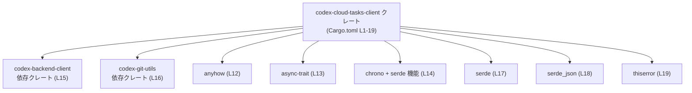
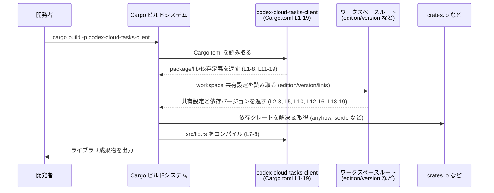

# cloud-tasks-client/Cargo.toml

## 0. ざっくり一言

`cloud-tasks-client/Cargo.toml` は、`codex-cloud-tasks-client` というライブラリクレートの **パッケージ情報・ライブラリターゲット・依存クレート** を定義する Cargo 設定ファイルです（Cargo.toml:L1-19）。

---

## 1. このモジュールの役割

### 1.1 概要

- このファイルは、`codex-cloud-tasks-client` クレートの **ビルド設定** を定義します（Cargo.toml:L1-5）。
- ライブラリターゲット名とエントリポイント `src/lib.rs` を指定します（Cargo.toml:L6-8）。
- エディション・ライセンス・バージョン・lint 設定および依存クレートのバージョンを、ワークスペース共通設定から取得します（Cargo.toml:L2-3, L5, L10, L12-16, L18-19）。
- 実際の公開 API やコアロジックは `src/lib.rs` 以降にあり、このチャンクには現れません（Cargo.toml:L7-8）。

### 1.2 アーキテクチャ内での位置づけ

このクレートはワークスペースの一部として定義され、他のワークスペースクレートや外部クレートに依存しています。



- クレート名は `codex-cloud-tasks-client`（パッケージ名、Cargo.toml:L4）。
- ライブラリターゲット名は `codex_cloud_tasks_client` で、エントリポイントは `src/lib.rs` です（Cargo.toml:L6-8）。
- `codex-backend-client`、`codex-git-utils` などの内部クレート、および `anyhow`、`async-trait`、`chrono`、`serde`、`serde_json`、`thiserror` といった外部クレートに依存しています（Cargo.toml:L12-19）。

### 1.3 設計上のポイント

コードから読み取れる設計上の特徴は次のとおりです。

- **ワークスペース指向の設定共有**  
  - エディション・ライセンス・バージョン・lint 設定はすべて `workspace = true` によってワークスペースのルート定義に委ねられています（Cargo.toml:L2-3, L5, L10, L12-16, L18-19）。
- **ライブラリクレートとしての構成**  
  - `[lib]` セクションのみで、バイナリターゲット（`[[bin]]`）は定義されていません（Cargo.toml:L6-8）。このクレートはライブラリとして利用される前提です。
- **非同期・エラー処理関連の依存クレート**  
  - `async-trait`（非同期メソッドを trait で扱うためのマクロ）と `anyhow` / `thiserror`（エラー型・エラーラッピング）に依存しており、非同期処理とエラー処理のための基盤を利用していることが推測できますが、実際の使い方はこのチャンクからは分かりません（Cargo.toml:L12-13, L19）。
- **シリアライゼーション関連の依存クレート**  
  - `serde`（derive 機能付き）、`serde_json`、`chrono`（`serde` 機能付き）に依存し、日時や構造体のシリアライズ/デシリアライズを利用する可能性がありますが、具体的な型や API はこのファイルには現れません（Cargo.toml:L14, L17-18）。

---

## 2. 主要な機能一覧（ビルド設定レベル）

このファイル自体は実行時ロジックを持たず、ビルド設定のみを提供します。その観点での「機能」は次のように整理できます。

- パッケージ定義: `codex-cloud-tasks-client` クレートの基本情報を定義する（Cargo.toml:L1-5）。
- ライブラリターゲット定義: `codex_cloud_tasks_client` ライブラリと `src/lib.rs` の対応を定義する（Cargo.toml:L6-8）。
- ワークスペース共通設定の利用: エディション・ライセンス・バージョン・lint・依存バージョンをワークスペースルートから継承する（Cargo.toml:L2-3, L5, L10, L12-16, L18-19）。
- 依存関係の宣言: 非同期処理・エラー処理・シリアライズ・日時処理などに関わる外部/内部クレートの依存を定義する（Cargo.toml:L11-19）。

### コンポーネントインベントリー（このチャンク）

| コンポーネント | 種別 | 説明 | 根拠 |
|---------------|------|------|------|
| `codex-cloud-tasks-client` | パッケージ（クレート） | ワークスペース内のライブラリパッケージ名 | `Cargo.toml:L1-5` |
| `codex_cloud_tasks_client` | ライブラリターゲット | エントリポイント `src/lib.rs` を持つライブラリ名 | `Cargo.toml:L6-8` |
| `src/lib.rs` | ライブラリエントリポイント | 実際の公開 API / コアロジックが定義される Rust ファイル | `Cargo.toml:L7-8` |
| `anyhow` | 依存クレート | 汎用エラー型などを提供するクレート | `Cargo.toml:L12` |
| `async-trait` | 依存クレート | 非同期関数を trait に書くためのマクロを提供 | `Cargo.toml:L13` |
| `chrono`（`serde` 機能） | 依存クレート | 日時処理と `serde` 連携を提供 | `Cargo.toml:L14` |
| `codex-backend-client` | 依存クレート（ワークスペース内と推定） | バックエンドとの通信などに関わると推測されるが詳細不明 | `Cargo.toml:L15` |
| `codex-git-utils` | 依存クレート（ワークスペース内と推定） | Git 操作のユーティリティと推測されるが詳細不明 | `Cargo.toml:L16` |
| `serde`（`derive` 機能） | 依存クレート | シリアライズ/デシリアライズ用 derive マクロを提供 | `Cargo.toml:L17` |
| `serde_json` | 依存クレート | JSON 形式のシリアライズ/デシリアライズを提供 | `Cargo.toml:L18` |
| `thiserror` | 依存クレート | エラー型定義のための derive マクロを提供 | `Cargo.toml:L19` |

※ `codex-backend-client` / `codex-git-utils` の役割は名前から推測していますが、具体的な API や責務はこのチャンクには現れません。

---

## 3. 公開 API と詳細解説

### 3.1 型一覧（構造体・列挙体など）

このファイルには Rust コードは含まれておらず、型定義は一切記述されていません。

| 名前 | 種別 | 役割 / 用途 |
|------|------|-------------|
| (なし) | - | このファイルには型定義がありません |

- 実際の公開構造体・列挙体・モジュールは `src/lib.rs` 以降に定義されているはずですが、このチャンクには現れないため特定できません（Cargo.toml:L7-8）。

### 3.2 関数詳細（最大 7 件）

- `Cargo.toml` は設定ファイルであり、関数定義は存在しません（Cargo.toml:L1-19）。
- よって、このチャンク単体から **公開 API 関数やコアロジックの挙動を説明することはできません**。
- エラー処理・非同期処理・並行性に関する詳細も、Rust コードがないため不明です。依存クレートの存在から「利用している可能性」は推測できますが、どのように利用しているかはコードを見なければ判断できません。

### 3.3 その他の関数

- 補助関数やラッパー関数も、このファイルには存在しません（Cargo.toml:L1-19）。

---

## 4. データフロー

このチャンクにはランタイムの処理フローは登場しないため、**ビルド時に Cargo がこのファイルをどのように利用するか** という観点でデータフローを示します。

### ビルド時の処理シーケンス



要点:

- パッケージ・ライブラリ・依存情報はすべてこのファイルから読み取られます（Cargo.toml:L1-8, L11-19）。
- 実際のコンパイル対象となる Rust コードは `src/lib.rs` であり、その中のモジュール構成とデータフローが、このチャンクからは見えません（Cargo.toml:L7-8）。

---

## 5. 使い方（How to Use）

### 5.1 基本的な使用方法（他クレートからの利用）

このクレートはライブラリとして定義されているため、他のクレートから次のように依存関係を追加して利用します。

#### 例: 同一リポジトリ内の別クレートから使う場合（パス依存）

```toml
# 別クレートの Cargo.toml の一例

[dependencies]
codex-cloud-tasks-client = { path = "../cloud-tasks-client" }  # パスはプロジェクト構成に依存
```

```rust
// 別クレート側の Rust コード例
// 実際にどのシンボルが公開されているかは src/lib.rs を見ないと分かりません。

use codex_cloud_tasks_client; // クレート名は Cargo.toml の [lib].name に対応 (L6)

// ここで codex_cloud_tasks_client::... として公開 API を呼び出すことになるが、
// 具体的な関数や構造体はこのチャンクからは不明です。
```

- `use` するクレート名（`codex_cloud_tasks_client`）は `[lib].name` に対応します（Cargo.toml:L6）。
- 実際に呼び出せる関数・型は `src/lib.rs` 以降のコードに依存し、このチャンクには現れません。

### 5.2 よくある使用パターン（設定レベル）

この Cargo.toml に現れている利用パターンは次のように整理できます。

- **ワークスペース内での一貫したバージョン管理**  
  - 依存クレートのバージョンをすべて `workspace = true` によって集中管理しているため（`serde` 以外、Cargo.toml:L12-16, L18-19）、ワークスペース内の複数クレートでバージョンを揃える構成になっています。
- **シリアライズと非同期処理を前提としたライブラリ**（推測レベル）  
  - `async-trait` と `serde` / `serde_json` / `chrono` を同時に依存に持つことから、非同期 API と JSON/日時を含むデータ構造を扱うライブラリである可能性がありますが、コードがないため断定はできません。

### 5.3 よくある間違い（設定観点）

このファイルに関連して発生しうる誤りの例を、設定レベルで挙げます。

```toml
# 間違い例: [lib].name と use するクレート名の不一致
[lib]
name = "codex_cloud_tasks_client"  # Cargo.toml:L6

# Rust 側
// use codex-cloud-tasks-client;  // ハイフンを含む名前は使えない
```

```rust
// 正しい例: [lib].name と一致するクレート名を use する
use codex_cloud_tasks_client;  // [lib].name に対応 (L6)
```

```toml
# 間違い例: path の変更に伴い Cargo.toml を更新しない
[lib]
name = "codex_cloud_tasks_client"
path = "src/lib.rs"  # 実際のファイルを別ディレクトリに移した場合に未更新 (L7-8)
```

- `path` に指定したファイルが存在しない場合、ビルド時にエラーになります（Cargo.toml:L7-8）。
- クレート名（`[lib].name`）と Rust コード側の `use` 句を一致させる必要があります。

### 5.4 使用上の注意点（まとめ）

- **公開 API / 安全性 / 並行性の詳細はコード側を見る必要がある**  
  - このファイルからは、Rust の所有権モデル・スレッド安全性・エラーの戻し方（`Result` / `anyhow::Error` など）・非同期ランタイム（`tokio` など）の有無は判断できません。
- **ワークスペース依存**  
  - `edition.workspace = true` などの設定は、ワークスペースルートの設定が正しく定義されていることを前提とします（Cargo.toml:L2-3, L5, L10, L12-16, L18-19）。
- **依存追加時の注意**  
  - 新しい依存クレートを追加する場合、ワークスペースの方針に従い `workspace = true` を使うか、個別に `version` を書くかを統一したほうが管理しやすいですが、そのポリシー自体はこのチャンクからは分かりません。

---

## 6. 変更の仕方（How to Modify）

### 6.1 新しい機能を追加する場合（このファイルに関する変更）

新しい機能を Rust コード側に追加する際、このファイルに変更が必要になる代表的なケースは次のとおりです。

1. **新しい外部クレートを使う必要が出た場合**
   - `[dependencies]` セクションに依存を追記します（Cargo.toml:L11-19）。
   - ワークスペース全体でバージョンを統一したい場合は、ワークスペースルート側にバージョンを定義し、ここでは `workspace = true` を指定する運用が想定されますが、実際のルールはこのチャンクからは分かりません。

2. **ライブラリのエントリポイントを変更する場合**
   - `src/lib.rs` 以外のファイルをエントリポイントにしたい場合、`[lib].path` を変更します（Cargo.toml:L7-8）。

3. **クレート名を変更する場合**
   - パッケージ名とライブラリ名を変更する場合、`[package].name` と `[lib].name` を揃える必要があります（Cargo.toml:L4, L6）。
   - 他クレートからの `use` / `Cargo.toml` の依存設定も合わせて変更する必要があります（このチャンクには使用箇所は現れません）。

### 6.2 既存の機能を変更する場合（設定観点）

既存の機能（Rust コード側）を変更するにあたり、このファイルで注意すべきポイントは次のとおりです。

- **依存クレートの削除・バージョン変更**
  - コードから完全に使われなくなった依存クレートを削除する場合は `[dependencies]` からエントリを削除します（Cargo.toml:L11-19）。
  - ただし、ワークスペース内の他クレートがまだ同じ依存を使っている可能性があり、ワークスペースルートの設定との整合性を確認する必要があります。
- **Contracts / Edge Cases（設定レベル）**
  - `[lib].path` で指定するファイルは常に存在し、コンパイル可能である必要があります（Cargo.toml:L7-8）。
  - ワークスペースに参加している前提で `edition.workspace = true` などを使っているため、単体プロジェクトとして切り出す場合は、`edition = "2021"` のように個別指定に変更する必要があります（Cargo.toml:L2-3, L5）。

---

## 7. 関連ファイル

このファイルと密接に関係するファイル・コンポーネントを整理します。

| パス / 名称 | 役割 / 関係 |
|------------|------------|
| `cloud-tasks-client/src/lib.rs` | この Cargo.toml の `[lib].path` で指定されたライブラリエントリポイントです（Cargo.toml:L7-8）。実際の公開 API・コアロジックはここから始まります。 |
| ワークスペースルートの `Cargo.toml` | `edition.workspace = true`、`license.workspace = true`、`version.workspace = true`、`[lints].workspace = true`、および依存クレートのバージョンを定義していると考えられますが、具体的な内容・パスはこのチャンクからは分かりません（Cargo.toml:L2-3, L5, L10, L12-16, L18-19）。 |
| 依存クレート `codex-backend-client` の Cargo.toml | 同一ワークスペース内の依存クレートと推測されますが、実際のパスや内容はこのチャンクには現れません（Cargo.toml:L15）。 |
| 依存クレート `codex-git-utils` の Cargo.toml | 同一ワークスペース内の依存クレートと推測されますが、実際のパスや内容はこのチャンクには現れません（Cargo.toml:L16）。 |

---

### Bugs / Security / 安全性・エラー・並行性について

- **Bugs**  
  - このファイル単体から具体的なバグ（ロジックエラー）を特定することはできません。
  - 設定上の典型的な問題としては、`[lib].path` が存在しない、ワークスペース設定と矛盾した依存バージョン設定などがあります（Cargo.toml:L7-8, L12-16, L18-19）。

- **Security**  
  - 依存クレートのバージョンがワークスペース側でどう定義されているか、このチャンクからは見えないため、既知の脆弱性の有無は判断できません。
  - 依存クレートとして挙がっているものは一般的なユーティリティクレートであり、このファイルから特定のセキュリティリスクは読み取れません。

- **言語固有の安全性 / エラー / 並行性**  
  - Rust の所有権・借用・スレッド安全性の扱い、エラーを `Result` で返すか `anyhow::Error` を使うか、どの非同期ランタイムを利用しているか（`tokio` など）は、このチャンクには一切現れません。
  - `anyhow` / `thiserror` / `async-trait` に依存していることから、**エラーを型安全に扱いつつ非同期 trait を利用する設計** である可能性はありますが、実装を見ないと確定できません。

---

このチャンクでは公開 API やコアロジックは一切現れておらず、主に「クレートとしての位置づけ」「依存関係」「ワークスペース設定」が把握できる段階です。実際の関数・型・データフロー・エッジケースなどを把握するには、`cloud-tasks-client/src/lib.rs` 以降のコードが必要となります。
