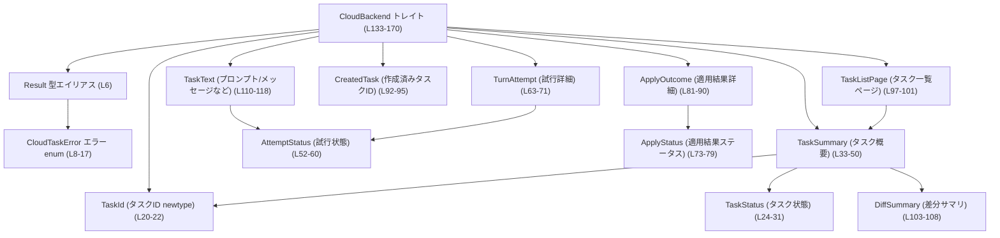
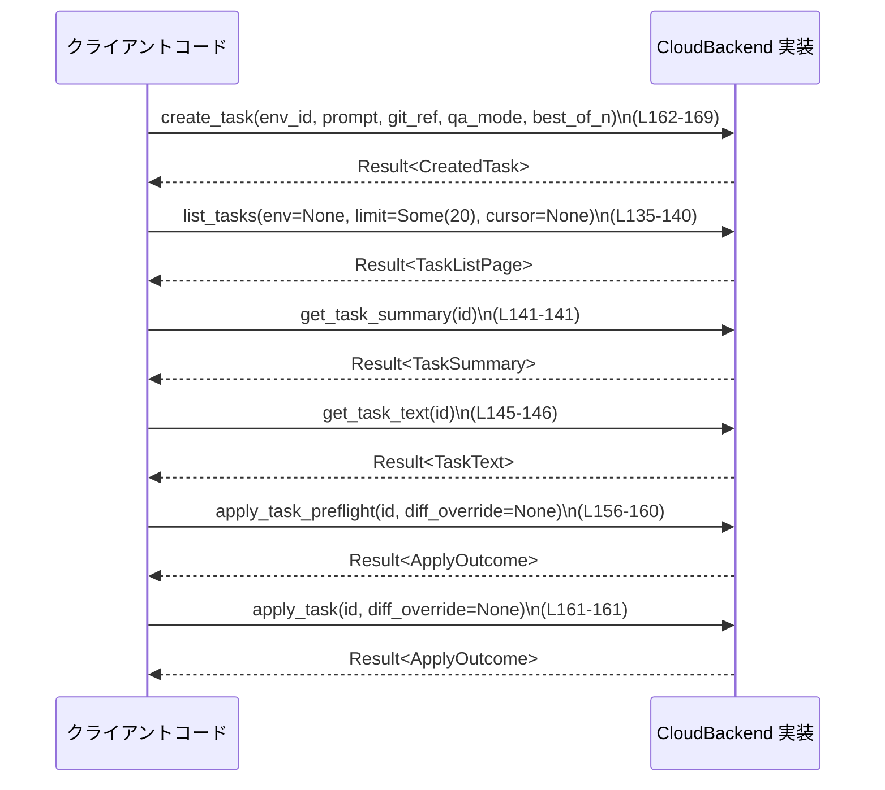

# cloud-tasks-client/src/api.rs コード解説

## 0. ざっくり一言

このファイルは、**「クラウドタスク」バックエンドとのやり取りを抽象化するためのドメインモデル（ID・ステータス・差分サマリなど）と、非同期バックエンドトレイト `CloudBackend` の公開API**を定義しています。

---

## 1. このモジュールの役割

### 1.1 概要

- このモジュールは、タスク管理システムのクライアント側が使う **共通データ型** と **バックエンドとの通信インターフェース（トレイト）** を提供します。
- 実際のHTTP通信やI/Oはここには含まれず、`CloudBackend` を実装する別モジュール側に委ねられます（このチャンクには実装は現れません）。
- すべてのAPIは `Result<T>` 型（`CloudTaskError` を持つ）で統一され、エラー処理を一元化しています（`Result` 型エイリアス: L6、`CloudTaskError`: L8-17）。

### 1.2 アーキテクチャ内での位置づけ

このファイル内部の型同士の依存関係と、`CloudBackend` の位置づけを図示します（あくまでこのファイル内に現れる関係のみ）。



他ファイル（HTTPクライアント実装など）との関係は、このチャンクには現れないため不明です。

### 1.3 設計上のポイント（コードから読み取れる事実）

- **エラー処理の一元化**  
  - `pub type Result<T> = std::result::Result<T, CloudTaskError>;` により、モジュール内の非同期メソッドの戻り値がすべて `CloudTaskError` に統一されています（`Result`: L6, `CloudTaskError`: L8-17）。
- **非同期＋並行利用を想定したトレイト**  
  - `CloudBackend` は `Send + Sync` を要求し（L133-134）、全メソッドが `async fn` & `&self` なので、**スレッド間で共有され、複数の非同期タスクから同時に呼び出される利用形態**を想定した設計です（実際の排他制御などは実装側依存）。
- **シリアライズ前提のドメインモデル**  
  - `TaskId`, `TaskStatus`, `TaskSummary`, `ApplyStatus`, `ApplyOutcome`, `CreatedTask`, `DiffSummary` は `Serialize` / `Deserialize` を実装しています（L20-21, L24-25, L33, L73-74, L81, L92, L103）。  
  - `serde` の属性（`transparent`, `rename_all`, `default`）が付与され、JSONなど外部表現との互換性を意識した設計になっています。
- **状態・試行のモデリング**  
  - タスクの状態 (`TaskStatus`: L24-31) と、アシスタントの試行状態 (`AttemptStatus`: L52-60, `TurnAttempt`: L63-71, `TaskText`: L110-118) を別々にモデリングしています。
- **差分適用の成否を詳細に表現**  
  - `ApplyStatus` と `ApplyOutcome` により、パッチ適用の成功 / 部分成功 / エラー、およびスキップパス・コンフリクトパスを表現しています（L73-79, L81-90）。

---

## 2. 主要な機能一覧

このモジュールが提供する主な機能（公開API）は次の通りです。

- タスク関連IDとステータスの型定義  
  - `TaskId`, `TaskStatus`, `AttemptStatus`, `ApplyStatus` など。
- タスクの概要・一覧・テキスト・試行情報のモデリング  
  - `TaskSummary`, `TaskListPage`, `TaskText`, `TurnAttempt`。
- 差分と適用結果のモデリング  
  - `DiffSummary`, `ApplyOutcome`。
- タスク作成の結果型  
  - `CreatedTask`。
- 非同期バックエンドインターフェース  
  - `CloudBackend` トレイト（タスク一覧取得、詳細取得、メッセージ取得、差分取得、試行一覧、プレフライト適用、本適用、タスク作成）。
- エラー型と統一 `Result` 型  
  - `CloudTaskError` と `Result<T>` エイリアス。

---

## 3. 公開 API と詳細解説

### 3.1 型一覧（構造体・列挙体・トレイト・型エイリアス）

#### 型エイリアス・トレイト

| 名前 | 種別 | 役割 / 用途 | 定義位置 |
|------|------|-------------|----------|
| `Result<T>` | 型エイリアス | 戻り値を `std::result::Result<T, CloudTaskError>` に統一するためのエイリアスです。エラー型は常に `CloudTaskError` になります。 | `cloud-tasks-client/src/api.rs:L6` |
| `CloudBackend` | トレイト | 実際のバックエンド（HTTP API など）実装が従うべき非同期インターフェースです。すべてのメソッドが `async fn` で、`Send + Sync` 制約があります。 | `cloud-tasks-client/src/api.rs:L133-170` |

#### データ型（エラー、ID、ステータス等）

| 名前 | 種別 | 役割 / 用途 | 定義位置 |
|------|------|-------------|----------|
| `CloudTaskError` | enum | クラウドタスククライアントで発生しうるエラーを表します。`Unimplemented`, `Http`, `Io`, `Msg` の4種のバリアントがあります。 | `cloud-tasks-client/src/api.rs:L8-17` |
| `TaskId` | struct (newtype) | タスク識別子を `String` のラッパーとして表現します。`#[serde(transparent)]` によりシリアライズ時は生の文字列として扱われます。 | `cloud-tasks-client/src/api.rs:L20-22` |
| `TaskStatus` | enum | タスクの状態を表します。`Pending`, `Ready`, `Applied`, `Error`。シリアライズ時は `kebab-case`（例: `"pending"`）になります。 | `cloud-tasks-client/src/api.rs:L24-31` |
| `AttemptStatus` | enum | アシスタントの試行状態を表します。`Pending`, `InProgress`, `Completed`, `Failed`, `Cancelled`, `Unknown`。`Default` 実装では `Unknown` になります。 | `cloud-tasks-client/src/api.rs:L52-60` |
| `ApplyStatus` | enum | パッチ適用結果の高レベルな状態を表します。`Success`, `Partial`, `Error`。シリアライズ時は小文字（`"success"` など）です。 | `cloud-tasks-client/src/api.rs:L73-79` |

#### データ型（タスク／結果オブジェクト）

| 名前 | 種別 | 役割 / 用途 | 定義位置 |
|------|------|-------------|----------|
| `TaskSummary` | struct | タスクの一覧や詳細ビューで使われる概要情報を保持します。ID、タイトル、`TaskStatus`、更新時刻、環境情報、`DiffSummary`、レビューかどうか、試行回数などを含みます。 | `cloud-tasks-client/src/api.rs:L33-50` |
| `TurnAttempt` | struct | 特定のアシスタントターンの試行（best-of-N の個々の候補）を表します。ターンID、試行順位、作成時刻、`AttemptStatus`、差分テキスト、メッセージ列を持ちます。 | `cloud-tasks-client/src/api.rs:L63-71` |
| `ApplyOutcome` | struct | タスク適用（またはプレフライト）の結果を詳細に表します。適用されたかどうか、`ApplyStatus`、メッセージ、スキップされたパス、コンフリクトがあったパスを含みます。 | `cloud-tasks-client/src/api.rs:L81-90` |
| `CreatedTask` | struct | 新規タスク作成時に返されるタスクIDを保持します。 | `cloud-tasks-client/src/api.rs:L92-95` |
| `TaskListPage` | struct | タスク一覧ページを表します。`Vec<TaskSummary>` とページネーション用カーソルを含みます。 | `cloud-tasks-client/src/api.rs:L97-101` |
| `DiffSummary` | struct | 差分のサマリ情報（変更ファイル数・追加行数・削除行数）を保持します。`Default` 実装あり。 | `cloud-tasks-client/src/api.rs:L103-108` |
| `TaskText` | struct | タスクに紐づくプロンプト、メッセージ群、ターンID、兄弟ターンID、試行順位、`AttemptStatus` を保持します。`Default` は手書き実装です。 | `cloud-tasks-client/src/api.rs:L110-118` |

#### 実装・メソッド

| 名前 | 種別 | 役割 / 用途 | 定義位置 |
|------|------|-------------|----------|
| `impl Default for TaskText` | trait impl | `TaskText::default()` を定義します。プロンプト・メッセージ・ID群・試行順位が空／`None`、`attempt_status` が `AttemptStatus::Unknown` になります。 | `cloud-tasks-client/src/api.rs:L120-130` |

### 3.1 補足: コンポーネントインベントリー（メソッド一覧）

`CloudBackend` トレイトが公開するメソッドの一覧です。

| メソッド名 | シグネチャ（概要） | 役割 / 用途 | 定義位置 |
|------------|--------------------|-------------|----------|
| `list_tasks` | `async fn list_tasks(&self, env: Option<&str>, limit: Option<i64>, cursor: Option<&str>) -> Result<TaskListPage>` | タスク一覧のページを取得します。フィルタとして環境ID・件数・カーソルを受け取ります。 | `cloud-tasks-client/src/api.rs:L135-140` |
| `get_task_summary` | `async fn get_task_summary(&self, id: TaskId) -> Result<TaskSummary>` | 単一タスクの概要情報を取得します。 | `cloud-tasks-client/src/api.rs:L141-141` |
| `get_task_diff` | `async fn get_task_diff(&self, id: TaskId) -> Result<Option<String>>` | タスクに対応する差分テキストを取得します。見つからない場合は `Ok(None)` になる可能性があります。 | `cloud-tasks-client/src/api.rs:L142-142` |
| `get_task_messages` | `async fn get_task_messages(&self, id: TaskId) -> Result<Vec<String>>` | 差分ではなくアシスタントのメッセージ群のみを取得します（コメント L143）。 | `cloud-tasks-client/src/api.rs:L143-144` |
| `get_task_text` | `async fn get_task_text(&self, id: TaskId) -> Result<TaskText>` | プロンプトとアシスタントメッセージを含むテキスト情報を取得します（コメント L145）。 | `cloud-tasks-client/src/api.rs:L145-146` |
| `list_sibling_attempts` | `async fn list_sibling_attempts(&self, task: TaskId, turn_id: String) -> Result<Vec<TurnAttempt>>` | 指定ターンの sibling attempts（best-of-N の他候補）を取得します（コメント L147）。 | `cloud-tasks-client/src/api.rs:L148-152` |
| `apply_task_preflight` | `async fn apply_task_preflight(&self, id: TaskId, diff_override: Option<String>) -> Result<ApplyOutcome>` | 実際には適用せず、パッチがクリーンに適用できるかを検証するプレフライトを実行します（コメント L153-155）。 | `cloud-tasks-client/src/api.rs:L156-160` |
| `apply_task` | `async fn apply_task(&self, id: TaskId, diff_override: Option<String>) -> Result<ApplyOutcome>` | 実際にタスクの差分を適用します（コメントはありませんが名前と戻り値から分かります）。 | `cloud-tasks-client/src/api.rs:L161-161` |
| `create_task` | `async fn create_task(&self, env_id: &str, prompt: &str, git_ref: &str, qa_mode: bool, best_of_n: usize) -> Result<CreatedTask>` | 新しいタスクを作成します。環境ID、プロンプト、Git参照、QAモード、best-of-N 値を引数に取ります。 | `cloud-tasks-client/src/api.rs:L162-169` |

---

### 3.2 関数詳細（7件）

ここでは重要度の高い7メソッドについて詳しく説明します。  
※ いずれも `CloudBackend` トレイトの一部であり、このファイルでは**実装は定義されていない**ため、内部処理については「不明」と明示します。

#### `list_tasks(&self, env: Option<&str>, limit: Option<i64>, cursor: Option<&str>) -> Result<TaskListPage>`

**概要**

- タスク一覧のページを取得するためのメソッドです（名前と戻り値から読み取れます）。
- 環境ID、最大件数、ページネーションのカーソルをオプション引数として受け取ります（L135-140）。

**引数**

| 引数名 | 型 | 説明 |
|--------|----|------|
| `env` | `Option<&str>` | 環境ID（例: backend environment）を指定するためのオプション引数です。`None` の場合の挙動は、このファイルからは分かりません。 |
| `limit` | `Option<i64>` | 取得するタスク数の上限を指定します。`None` の場合のデフォルト件数は不明です。 |
| `cursor` | `Option<&str>` | ページネーション用カーソルです。前回の `TaskListPage::cursor` を渡す想定と考えられますが、詳細な意味はコードからは断定できません。 |

**戻り値**

- `Result<TaskListPage>`  
  - 正常時は `TaskListPage`（タスクのベクタと次ページ用カーソル）を返します（L97-101）。
  - エラー時は `CloudTaskError` を返します（L6, L8-17）。

**内部処理の流れ**

- このトレイトには実装が存在しないため、内部処理は不明です。
- 一般的には HTTP API 呼び出しやDBクエリなどが想定されますが、このチャンクからは確定できません。

**Examples（使用例）**

```rust
use crate::api::{CloudBackend, Result}; // このファイルが crate::api として公開されている前提の例

// 非同期コンテキスト内での使用例
async fn list_first_page<B: CloudBackend>(backend: &B) -> Result<()> {
    // 環境・limit・cursor を指定せずに一覧取得
    let page = backend
        .list_tasks(None, None, None)
        .await?; // ? 演算子で CloudTaskError をそのまま伝播

    for task in page.tasks {
        // TaskSummary のフィールドを参照（L33-50）
        println!("[{}] {}", task.id.0, task.title);
    }

    Ok(())
}
```

**Errors / Panics**

- 戻り値が `Result<TaskListPage>` のため、`Err(CloudTaskError)` が返される可能性があります。
- `CloudTaskError` のバリアントは `Unimplemented`, `Http`, `Io`, `Msg` の4種類です（L8-17）。
- どの状況でどのバリアントが使われるかは、このファイルには記述がなく不明です。
- パニック条件は明示されておらず、このメソッド単体からは読み取れません。

**Edge cases（エッジケース）**

- `env == None` の場合: 挙動は不明（全環境のタスクを返すのか、デフォルト環境のみかなど、このチャンクには情報がありません）。
- `limit == Some(0)` の場合: このファイルには特別な扱いは記述されていません。
- `cursor == None` の場合: 最初のページを返すかどうかは不明です。

**使用上の注意点**

- 非同期メソッドのため、**必ず `.await` を付けて呼び出す必要**があります。
- `env` などの `&str` 引数は、メソッド呼び出し中のみ有効な参照である必要があり、呼び出し元の文字列データはその期間中に破棄されていてはいけません（Rust の借用規則によりコンパイル時に保証されます）。
- `CloudBackend: Send + Sync` なので、複数タスクから同時に `list_tasks` を呼ぶことができますが、内部のスレッド安全性は実装側に依存します。

---

#### `get_task_summary(&self, id: TaskId) -> Result<TaskSummary>`

**概要**

- 指定した `TaskId` に対応する `TaskSummary` を取得します（L141）。

**引数**

| 引数名 | 型 | 説明 |
|--------|----|------|
| `id` | `TaskId` | 取得したいタスクの識別子です（L20-22）。所有権ごと渡します。 |

**戻り値**

- `Result<TaskSummary>`  
  - `TaskSummary` はタスクのタイトル、状態、更新時刻、環境情報、差分サマリ、レビューかどうか、試行回数を含みます（L33-50）。

**内部処理の流れ**

- 実装がないため不明です。

**Examples**

```rust
use crate::api::{CloudBackend, TaskId, Result};

async fn show_task_summary<B: CloudBackend>(backend: &B, id: TaskId) -> Result<()> {
    let summary = backend.get_task_summary(id).await?; // ここで id の所有権は move される

    println!("title: {}", summary.title);
    println!("status: {:?}", summary.status);
    println!("files changed: {}", summary.summary.files_changed);

    Ok(())
}
```

**Errors / Panics**

- `Err(CloudTaskError)` が返る可能性があります（L6, L8-17）。
- 不存在IDや権限エラーなどに対してどう振る舞うかは、このチャンクには現れません（`Err` なのか、別のフィールドで表現するのか不明）。

**Edge cases**

- 無効な `TaskId`（例えば空文字列）の扱いは、このファイルからは不明です。

**使用上の注意点**

- `TaskId` は `String` の newtype であり、単なる文字列と混同しないことで API の取り違えを防いでいます（L20-22）。
- 所有権を渡すため、呼び出し後は元の `TaskId` 変数は使えません（Rust の所有権ルールによる）。

---

#### `get_task_diff(&self, id: TaskId) -> Result<Option<String>>`

**概要**

- 指定タスクの差分（例: パッチ形式のテキスト）を取得します（L142）。
- 差分が存在しない場合は `Ok(None)` を返すことが想定されますが、明示的なコメントはありません。

**引数**

| 引数名 | 型 | 説明 |
|--------|----|------|
| `id` | `TaskId` | 差分を取得したいタスクのIDです。 |

**戻り値**

- `Result<Option<String>>`  
  - `Ok(Some(diff))`: 差分が存在する場合にテキストを返すと考えられます。  
  - `Ok(None)`: 差分が存在しない（または生成されていない）場合の表現が想定されますが、このチャンクには明記されていません。
  - `Err(CloudTaskError)`: 通信エラーなど。

**内部処理**

- 実装はこのファイルには存在せず、不明です。

**Examples**

```rust
use crate::api::{CloudBackend, TaskId, Result};

async fn print_diff<B: CloudBackend>(backend: &B, id: TaskId) -> Result<()> {
    match backend.get_task_diff(id).await? {
        Some(diff) => {
            println!("Diff:\n{}", diff);
        }
        None => {
            println!("No diff available for this task.");
        }
    }
    Ok(())
}
```

**Errors / Panics**

- `CloudTaskError` が返る可能性があります。

**Edge cases**

- 差分が非常に大きい場合の扱い（分割取得など）はこのファイルからは読み取れません。
- `None` を返す条件は不明ですが、`TaskStatus` が `Applied` や `Error` の場合の挙動などは、このチャンクには現れません。

**使用上の注意点**

- 差分テキストの形式（`git diff` 準拠かなど）は不明なため、適用側のパーサは外部仕様に依存します。

---

#### `get_task_text(&self, id: TaskId) -> Result<TaskText>`

**概要**

- コメントによれば、「作成プロンプトとアシスタントメッセージ」（creating prompt and assistant messages）を返します（L145-146）。
- `TaskText` はプロンプト、メッセージ、ターンID群、試行順位、`AttemptStatus` を含みます（L110-118）。

**引数**

| 引数名 | 型 | 説明 |
|--------|----|------|
| `id` | `TaskId` | テキスト情報を取得したいタスクのID。 |

**戻り値**

- `Result<TaskText>`  
  - `TaskText` の各フィールドがどの条件で `None` / 空ベクタになるかは、このファイルには明記されていません。
  - `TaskText::default()` の内容は L120-130 の通りで、すべて空／`None`／`AttemptStatus::Unknown` です。

**内部処理**

- 不明（トレイト定義のみ）。

**Examples**

```rust
use crate::api::{CloudBackend, TaskId, Result};

async fn inspect_task_text<B: CloudBackend>(backend: &B, id: TaskId) -> Result<()> {
    let text = backend.get_task_text(id).await?;

    if let Some(prompt) = &text.prompt {
        println!("# Prompt\n{}", prompt);
    }

    println!("# Assistant messages");
    for (i, msg) in text.messages.iter().enumerate() {
        println!("[{}] {}", i, msg);
    }

    println!("Attempt status: {:?}", text.attempt_status);
    Ok(())
}
```

**Errors / Panics**

- `CloudTaskError` が返る可能性があります。

**Edge cases**

- プロンプトだけが存在しメッセージが空のケース、逆にメッセージだけがあるケースなどの条件は不明です。
- `TaskText::default()` が返されることは通常想定されておらず（コメントはない）、実際にそうなるかどうかも不明です。

**使用上の注意点**

- UI 表示などに使う場合、各フィールドの `Option` / 空配列を適切に扱う必要があります。
- `AttemptStatus` が `Unknown` の場合がありうるため、状態表示で「不明」などの扱いを用意する必要があります（L52-60, L120-129）。

---

#### `apply_task_preflight(&self, id: TaskId, diff_override: Option<String>) -> Result<ApplyOutcome>`

**概要**

- コメントにある通り、「パッチがクリーンに適用できるかを検証する dry-run（プレフライト）」を実行します（L153-155, L156-160）。
- 作業ツリー（working tree）を変更しないことが仕様として明記されています（L154）。
- `diff_override` を指定すると、タスクから再取得する代わりに引数の差分テキストを用いて検証を行うと書かれています（L155）。

**引数**

| 引数名 | 型 | 説明 |
|--------|----|------|
| `id` | `TaskId` | 対象とするタスクのID。 |
| `diff_override` | `Option<String>` | 上書き用の差分テキスト。`Some(diff)` の場合、タスクのデフォルト差分ではなく、この文字列を使うことがコメントで示されています。`None` の場合の挙動（再取得するか）はコメントに記述されていますが、具体的な実装は不明です。 |

**戻り値**

- `Result<ApplyOutcome>`  
  - `ApplyOutcome`（L81-90）は、適用されたかどうか（`applied`）、`ApplyStatus`、メッセージ、スキップパス、コンフリクトパスを含みます。
  - プレフライトであるため、通常 `applied` は `false` になることが想定されますが、このファイルからは断定できません。

**内部処理**

- 実装はこのファイルにはないため、実際にどのような差分適用エンジンを使うかなどは不明です。

**Examples**

```rust
use crate::api::{CloudBackend, TaskId, Result};

async fn check_applicability<B: CloudBackend>(
    backend: &B,
    id: TaskId,
    alt_diff: Option<String>,
) -> Result<()> {
    let outcome = backend
        .apply_task_preflight(id, alt_diff)
        .await?;

    println!("status: {:?}", outcome.status);
    if !outcome.skipped_paths.is_empty() {
        println!("Skipped:");
        for p in &outcome.skipped_paths {
            println!("  {}", p);
        }
    }
    if !outcome.conflict_paths.is_empty() {
        println!("Conflicts:");
        for p in &outcome.conflict_paths {
            println!("  {}", p);
        }
    }

    Ok(())
}
```

**Errors / Panics**

- `CloudTaskError` が返される可能性があります。
- コメントに「Never modifies the working tree.」とあるため（L154）、実装がそれを破る場合は仕様違反になりますが、ここからだけでは検証できません。

**Edge cases**

- `diff_override == None` の場合: タスク詳細から差分を再取得して検証する旨がコメントに書かれています（L155）が、失敗時の挙動は不明です。
- `diff_override == Some("")` など空差分の扱いは不明です。
- ファイルのコンフリクトや一部適用可能な場合に、`skipped_paths` と `conflict_paths` がどのように埋められるかは、このチャンクには現れません。

**使用上の注意点**

- 実際の適用前に必ずプレフライトを行うことで、失敗時に作業ツリーが汚れないことが期待されますが、これは呼び出し側の運用ポリシーに依存します。
- プレフライトの結果だけでなく、`ApplyOutcome::message` に含まれる文字列をユーザーに表示することが想定されます。

---

#### `apply_task(&self, id: TaskId, diff_override: Option<String>) -> Result<ApplyOutcome>`

**概要**

- タスクの差分を実際に適用するメソッドです（L161）。
- 引数は `apply_task_preflight` と同じです。

**引数**

| 引数名 | 型 | 説明 |
|--------|----|------|
| `id` | `TaskId` | 適用対象となるタスクのID。 |
| `diff_override` | `Option<String>` | プレフライトと同様、差分テキストの上書き用。`None` 時の挙動は実装依存で、このファイルからは不明です。 |

**戻り値**

- `Result<ApplyOutcome>`  
  - 実際の適用結果（成功／部分成功／エラー、スキップ・コンフリクトパスなど）を表します。

**内部処理**

- 不明ですが、少なくとも作業ツリーを変更しうることが、プレフライトとの差から推測されます。ただしコード上にコメントはありません。

**Examples**

```rust
use crate::api::{CloudBackend, TaskId, Result};

async fn apply_task_with_check<B: CloudBackend>(backend: &B, id: TaskId) -> Result<()> {
    // まずプレフライト
    let pre = backend
        .apply_task_preflight(id.clone(), None)
        .await?; // TaskId が Clone かどうかは未定義なので、ここは例示的なコードです

    // 実際のコードでは TaskId の clone 可否に応じて設計する必要があります（Clone derive はこのファイルには付いていません）

    // ここではプレフライトをスキップせず、結果を見てから apply すると考えられます

    // 本適用
    let outcome = backend.apply_task(id, None).await?;
    println!("Applied: {}", outcome.applied);
    println!("Status: {:?}", outcome.status);
    Ok(())
}
```

> 注: `TaskId` は `Clone` を derive していないため（L20-22）、上記の `id.clone()` は実際にはコンパイルエラーになります。この例は「プレフライトと本適用で同じIDを使いまわしたい場合、所有権設計をどう考えるか」という観点を示すためのものです。実際には `id` を再構築するか、別のスコープで扱う必要があります。

**Errors / Panics**

- `CloudTaskError` が返る可能性があります。

**Edge cases**

- ファイルのコンフリクト、部分適用（`ApplyStatus::Partial`）などのケースで、`ApplyOutcome` のフィールドがどのように埋まるかは不明です。

**使用上の注意点**

- 実際の適用は破壊的操作（ファイル変更）になる可能性が高いため、呼び出し側でバックアップやプレフライト実行などの運用上の対策を取る必要があります。
- 非同期I/Oを伴う可能性があるため、多数のタスクを同時に適用する場合はリソース（CPU・ディスク）への負荷を考慮する必要がありますが、ここから具体的なコストは読み取れません。

---

#### `create_task(&self, env_id: &str, prompt: &str, git_ref: &str, qa_mode: bool, best_of_n: usize) -> Result<CreatedTask>`

**概要**

- 新しいタスクを作成するメソッドです（L162-169）。
- 環境ID、プロンプト、Git参照、QAモードフラグ、best-of-N の値を指定します。

**引数**

| 引数名 | 型 | 説明 |
|--------|----|------|
| `env_id` | `&str` | タスクを作成するバックエンド環境IDです。フォーマットは不明です。 |
| `prompt` | `&str` | タスクのプロンプト（指示文）です。 |
| `git_ref` | `&str` | タスク作成時の Git リビジョンなどを表す参照文字列と考えられますが、詳細は不明です。 |
| `qa_mode` | `bool` | QA（品質保証）モードかどうかを示すフラグです。具体的な意味はこのファイルからは読み取れません。 |
| `best_of_n` | `usize` | アシスタントの試行数（best-of-N）を表す値です。`TaskSummary::attempt_total` と関連していると考えられますが、このチャンクには明示されていません。 |

**戻り値**

- `Result<CreatedTask>`  
  - `CreatedTask` は新しい `TaskId` を1つ持つだけの構造体です（L92-95）。

**内部処理**

- 実装はこのファイルにはないため、タスク作成の仕組み（HTTP POST など）は不明です。

**Examples**

```rust
use crate::api::{CloudBackend, Result};

async fn create_simple_task<B: CloudBackend>(backend: &B) -> Result<()> {
    let created = backend
        .create_task(
            "env-default",               // env_id
            "Refactor the logging code", // prompt
            "main",                      // git_ref
            false,                       // qa_mode
            3,                           // best_of_n
        )
        .await?;

    println!("Created task id: {}", created.id.0);
    Ok(())
}
```

**Errors / Panics**

- `CloudTaskError` が返る可能性があります。
- 無効な `env_id` や `git_ref` を渡した場合の挙動（エラー型・メッセージ）は不明です。

**Edge cases**

- `best_of_n == 0` の扱いは不明です（エラー扱いになるか、1に切り上げるかなど）。
- 長すぎるプロンプトや非UTF-8文字列（Rustの`&str`は常にUTF-8なので後者はコンパイル時に排除されています）に対する制限は、外部仕様に依存します。

**使用上の注意点**

- `env_id`, `prompt`, `git_ref` はすべて `&str` であり、呼び出し中にのみ有効な借用である必要があります。Rust の型システムにより安全性は保証されます。
- `create_task` が呼ばれた結果としてバックエンド側にリソースが作成されるため、リトライ戦略（再送時の重複作成など）については実装と外部API仕様を確認する必要があります。

---

### 3.3 その他の関数

ここでは詳細解説を行わなかったメソッドや関連関数を一覧にします。

| 関数名 | 役割（1 行） | 定義位置 |
|--------|--------------|----------|
| `get_task_messages` | 差分ではなく、タスクに紐づくアシスタントメッセージ群のみを返すメソッドです（コメント L143 を参照）。 | `cloud-tasks-client/src/api.rs:L143-144` |
| `list_sibling_attempts` | 指定ターンの sibling attempts（best-of-N の他候補）を `Vec<TurnAttempt>` として返します（コメント L147）。 | `cloud-tasks-client/src/api.rs:L148-152` |
| `TaskText::default`（`impl Default`） | プロンプト・メッセージ・ID群のない「空」の `TaskText` を返します。`attempt_status` は `AttemptStatus::Unknown` です（L120-129）。 | `cloud-tasks-client/src/api.rs:L120-130` |

---

## 4. データフロー

ここでは、**クライアントがタスクを作成し、それを一覧・詳細・適用まで扱う一連の呼び出しフロー**を例として示します。  
これは型とメソッド名から構成した典型例であり、実際のアプリケーションロジックはこのファイルのみからは確定できません。

### シーケンス図: タスク作成から適用まで



**要点**

- クライアントは `CloudBackend` を実装したオブジェクト（HTTP クライアントなど）に対して、非同期メソッドを順に呼び出します。
- すべてのメソッドは `Result<...>` を返すため、各ステップで `?` 演算子などによりエラー伝播ができます（L6, L8-17）。
- `CloudBackend: Send + Sync` により、上記のような一連の操作を複数タスクから並行して行うことも可能です（実際のスレッド安全性は実装側に依存）。

---

## 5. 使い方（How to Use）

### 5.1 基本的な使用方法

ここでは、このモジュールを利用する典型的なコードフロー（タスク一覧取得と詳細表示）を示します。

```rust
use std::sync::Arc;

use crate::api::{
    CloudBackend, Result, TaskId,
    TaskStatus,
};

// 何らかの CloudBackend 実装。実装はこのファイルには存在しません。
struct MyBackend { /* ... */ }

// MyBackend が CloudBackend を実装していると仮定
#[async_trait::async_trait]
impl CloudBackend for MyBackend {
    // list_tasks などをここで実装する（このチャンクには実装が現れません）
    /* ... */
}

#[tokio::main] // 例として tokio ランタイムを使用
async fn main() -> Result<()> {
    // CloudBackend は Send + Sync なので、Arc<dyn CloudBackend> で共有するのが自然です。
    let backend: Arc<dyn CloudBackend> = Arc::new(MyBackend { /* ... */ });

    // タスク一覧取得
    let page = backend
        .list_tasks(None, Some(20), None)
        .await?; // Result<T> エイリアスにより CloudTaskError を返す

    for task in &page.tasks {
        println!(
            "[{}] {} ({:?})",
            task.id.0,      // TaskId newtype の中身の String（L20-22）
            task.title,
            task.status,     // TaskStatus (L24-31)
        );
    }

    // 先頭のタスクの詳細を取得
    if let Some(first) = page.tasks.first() {
        let summary = backend
            .get_task_summary(TaskId(first.id.0.clone()))
            .await?;

        println!("Updated at: {}", summary.updated_at);
    }

    Ok(())
}
```

**ポイント**

- 非同期ランタイム（ここでは tokio）はこのファイルには現れませんが、`async fn` を実行するには何らかのランタイムが必須です。
- `CloudBackend` はトレイトオブジェクトとして扱えるように設計されています（`dyn CloudBackend`）。`Send + Sync` 制約があるため、多くの場合 `Arc<dyn CloudBackend>` で共有されます。

### 5.2 よくある使用パターン

1. **差分を取得して別ツールで適用する**

```rust
use crate::api::{CloudBackend, TaskId, Result};

async fn export_diff<B: CloudBackend>(backend: &B, id: TaskId) -> Result<()> {
    if let Some(diff) = backend.get_task_diff(id).await? {
        // 別のパッチ適用ツールに渡すなど
        std::fs::write("patch.diff", diff)
            .map_err(|e| crate::api::CloudTaskError::Io(e.to_string()))?;
    }
    Ok(())
}
```

1. **best-of-N の sibling attempts を列挙する**

```rust
use crate::api::{CloudBackend, TaskId, Result};

async fn list_attempts<B: CloudBackend>(
    backend: &B,
    task_id: TaskId,
    turn_id: String,
) -> Result<()> {
    let attempts = backend
        .list_sibling_attempts(task_id, turn_id)
        .await?;

    for a in attempts {
        println!(
            "turn {} placement {:?} status {:?}",
            a.turn_id, a.attempt_placement, a.status
        );
    }
    Ok(())
}
```

### 5.3 よくある間違い（想定されるもの）

このファイルと Rust の特性から、起こりそうな誤用例を挙げます。

```rust
// 間違い例: async メソッドを .await せずに使おうとする
// let page = backend.list_tasks(None, None, None); // コンパイルエラー: Future を返す

// 正しい例:
let page = backend.list_tasks(None, None, None).await?;
```

```rust
// 間違い例: CloudBackend をスレッド間で安全でない形で共有しようとする
// let backend = MyBackend { /* ... */ };
// std::thread::spawn(move || {
//     // &backend を別スレッドで利用 -> コンパイルエラーの可能性
// });

// 正しい例: Send + Sync な実装を Arc で共有
use std::sync::Arc;
let backend: Arc<dyn CloudBackend> = Arc::new(MyBackend { /* ... */ });
let backend2 = backend.clone();
tokio::spawn(async move {
    let _ = backend2.list_tasks(None, None, None).await;
});
```

### 5.4 使用上の注意点（まとめ）

- **非同期ランタイム依存**  
  - すべてのメソッドは `async` であるため、tokio などのランタイム内で `.await` する必要があります。
- **エラー処理**  
  - すべて `Result<T>` を返すため、`?` 演算子などで `CloudTaskError` をハンドリングまたは伝播する設計が必要です。
- **並行性**  
  - `CloudBackend: Send + Sync` なので、スレッド間共有が可能ですが、内部状態を持つ実装では `Mutex` などで保護する必要があります（このファイルには具体的な実装はありません）。
- **シリアライズとの整合性**  
  - serde の属性（`rename_all`, `transparent`, `default`）により外部表現が決まるため、バックエンド側と JSON スキーマを合わせる必要があります。

---

## 6. 変更の仕方（How to Modify）

### 6.1 新しい機能を追加する場合

例: 新しいフィルタ条件を `list_tasks` に追加したい場合。

1. **トレイト変更**
   - `CloudBackend::list_tasks` のシグネチャに新しい引数を追加します（例: `status: Option<TaskStatus>`）。  
     - 変更箇所: `cloud-tasks-client/src/api.rs:L135-140` 付近。
2. **ドメイン型の利用**
   - 既存の `TaskStatus` など、ファイル内の型を使うことで API の一貫性を保てます（L24-31）。
3. **実装側の対応**
   - `CloudBackend` を実装しているすべての型に対して、新しいメソッドシグネチャに合わせた修正が必要になります（このチャンクには実装が現れないため、どのファイルかは不明）。
4. **呼び出し側の修正**
   - 既存の呼び出しコードも新引数を渡すように変更する必要があります。

### 6.2 既存の機能を変更する場合

例: `TaskSummary` に新しいフィールドを追加する場合。

- **影響範囲の確認**
  - `TaskSummary` は `Serialize` / `Deserialize` を derive しているため（L33）、シリアライズ／デシリアライズに影響します。
  - バックエンドAPIからのレスポンス、およびそれを使うUIやロジックすべてを確認する必要があります。
- **契約（前提条件・返り値の意味）の確認**
  - たとえば `ApplyOutcome::applied` の意味を変更する場合、`apply_task_preflight` と `apply_task` 両方の仕様に影響します（L81-90, L156-161）。
- **テスト・使用箇所の再確認**
  - このファイルにはテストコードは含まれていません（テストは別ファイルにある可能性がありますが、このチャンクには現れません）。
  - API の変更に伴い、呼び出しコードのコンパイルエラーやテストの失敗を手がかりに影響箇所を洗い出すのが実務的です。

---

## 7. 関連ファイル

このモジュールと密接に関係すると考えられるが、このチャンクには現れないファイルについては「不明」とします。

| パス | 役割 / 関係 |
|------|------------|
| `src/api.rs`（本ファイル） | タスククライアントの公開ドメイン型と `CloudBackend` トレイト定義を提供します。 |
| （不明） | `CloudBackend` の具体的な実装（HTTP クライアントやローカル実装など）はこのチャンクには現れません。 |
| （不明） | この API を呼び出す CLI や GUI、テストコードなどもこのチャンクには現れません。 |

---

### Bugs / Security / Edge Cases / Tests / Performance について

- **Bugs（見える範囲）**
  - このファイルには実際のロジック実装がないため、明確なバグは読み取れません。
  - 例示コード中の `TaskId::clone()` などは、`TaskId` が `Clone` を derive していない点から実際にはコンパイルエラーになります（L20-22）。これはあくまで説明上の擬似コードであり、実コードでは所有権設計を調整する必要があります。
- **Security**
  - 入力バリデーションや権限チェックなどはこのファイルには存在せず、セキュリティ上の考慮点は主に `CloudBackend` 実装側にあります。
  - ここで定義されるのは型とトレイトのみであり、直接外部入力を処理するコードはありません。
- **Contracts / Edge Cases**
  - コメントで仕様が明記されているのは主に `apply_task_preflight` の「作業ツリーを変更しない」といった点です（L153-155）。
  - `Option` 型の引数・戻り値が多く、`None` の意味はバックエンド仕様に依存します（このチャンクからは詳細不明）。
- **Tests**
  - このファイルにはテストコードは含まれていません。
- **Performance / Scalability**
  - ここにあるのは型定義とトレイト定義のみであり、パフォーマンス特性は実装側に依存します。このチャンクから具体的なボトルネックを読み取ることはできません。
