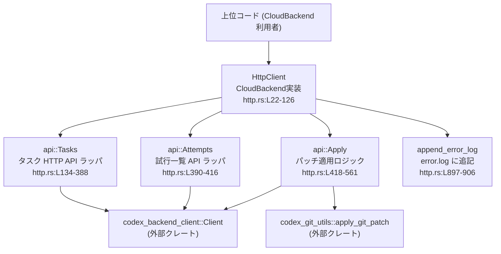
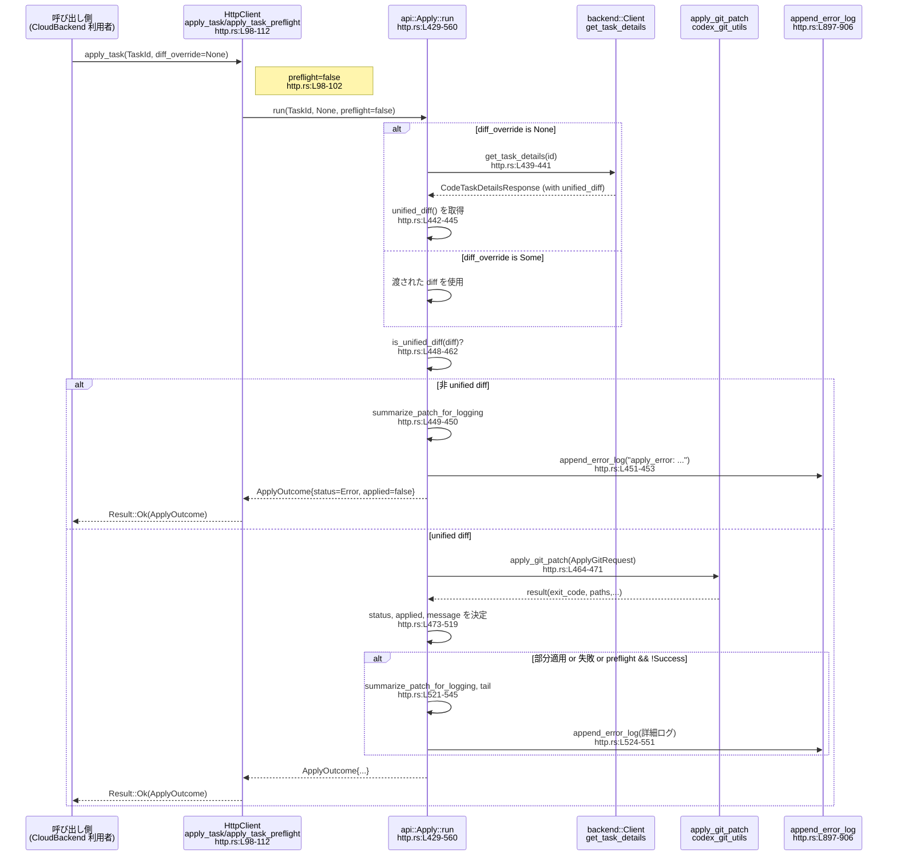

# cloud-tasks-client/src/http.rs

## 0. ざっくり一言

`HttpClient` が `CloudBackend` トレイトを HTTP バックエンド（`codex_backend_client`）に接続する実装であり、  
タスク一覧・詳細取得、メッセージ抽出、新規タスク作成、および Git パッチの適用／プリフライトを行うモジュールです。

---

## 1. このモジュールの役割

### 1.1 概要

- このモジュールは **クラウド上のタスク管理 API を叩くクライアント** として機能し、`CloudBackend` トレイトを実装します。  
- HTTP レスポンスの JSON から `TaskSummary` や `TaskText` 等の **ドメイン型への変換ロジック** を持ちます。  
- タスクに紐づく diff をローカルに適用するために、`codex_git_utils::apply_git_patch` を使った **Git パッチ適用／プリフライト** 機能も提供します。  
- エラーや適用結果の概要を `error.log` に書き出し、**簡易なロギング** も行います。

### 1.2 アーキテクチャ内での位置づけ

`HttpClient` は上位コードから `CloudBackend` として使われ、内部で `codex_backend_client::Client` および `codex_git_utils` に委譲します。



### 1.3 設計上のポイント

- **責務分割**  
  - `HttpClient` は公開 API としての入口のみを持ち、実際の HTTP 呼び出しとレスポンス処理は `mod api` 内の `Tasks` / `Attempts` / `Apply` に委譲しています（`http.rs:L50-60`, `L134-137`, `L390-392`, `L418-420`）。
- **非同期処理**  
  - `CloudBackend` のメソッドは `async_trait` を用いた非同期実装であり、全て `async fn` です（`http.rs:L63-125`）。  
  - 内部では `codex_backend_client::Client` の `async` メソッドを `.await` しています（例: `Tasks::list`, `http.rs:L147-158`）。
- **エラーハンドリング方針**
  - HTTP などの外部エラーは `CloudTaskError::Http`、パッチ適用プロセス起動失敗は `CloudTaskError::Io` としてラップしています（例: `http.rs:L155-158`, `L471-471`）。  
  - JSON パースやレスポンス構造の欠落も `CloudTaskError::Http` に変換し、メッセージに `content-type` や `body` を含めます（`Tasks::summary`, `http.rs:L188-199`）。
- **ロギング**
  - `append_error_log` を通じて `error.log` にメッセージを書き出します（`http.rs:L166-175`, `L362-376`, `L451-453`, `L524-551`）。
- **パッチ適用**
  - diff フォーマット検証（`is_unified_diff`）、ログ用サマリ生成（`summarize_patch_for_logging`）、stdout/stderr の tail 抽出（`tail`）など、Git パッチ適用まわりをこのモジュール内で完結させています（`http.rs:L850-894`）。

---

## 2. 主要な機能一覧

- タスク一覧取得: 環境・件数・カーソル指定でタスク一覧と次カーソルを取得します。  
- タスク概要取得: 単一タスクのステータスや diff 概要などを `TaskSummary` にマッピングします。  
- タスク diff 取得: タスクに紐づく unified diff 文字列を取得します。  
- タスクメッセージ取得: アシスタントのテキストメッセージをレスポンスから抽出します。  
- TaskText 取得: プロンプト・アシスタントメッセージ・ターン情報を `TaskText` として取得します。  
- 兄弟ターン（attempt）一覧: 同一ターンの別候補（sibling attempts）一覧を取得し、並び替えます。  
- タスク作成: プロンプト・環境・ブランチ・QAモード・best_of_n などから新規タスクを作成します。  
- パッチ適用／プリフライト: タスクの diff をローカル Git リポジトリに適用または検証し、結果を `ApplyOutcome` で返します。

### 2.1 コンポーネントインベントリ（型・関数一覧）

主要な型・関数と行範囲の一覧です。

#### 構造体

| 名前 | 種別 | 行範囲 | 役割 / 用途 |
|------|------|--------|-------------|
| `HttpClient` | 構造体 | `http.rs:L22-26` | `CloudBackend` を HTTP 実装するクライアント。`base_url` と `backend::Client` を保持。 |
| `api::Tasks<'a>` | 構造体 | `http.rs:L134-137` | タスク関連 HTTP API のラッパ。`HttpClient` から借用する形で使われる。 |
| `api::Attempts<'a>` | 構造体 | `http.rs:L390-392` | sibling turns（試行）関連 API のラッパ。 |
| `api::Apply<'a>` | 構造体 | `http.rs:L418-420` | diff 取得と Git パッチ適用ロジックをまとめたラッパ。 |

#### 公開／主要メソッド・関数（抜粋）

| 名前 | 種別 | 行範囲 | 役割（1 行） |
|------|------|--------|--------------|
| `HttpClient::new` | 関数 | `http.rs:L29-33` | `base_url` から `backend::Client` を生成し、`HttpClient` を初期化する。 |
| `HttpClient::with_bearer_token` | 関数 | `http.rs:L35-38` | Bearer トークン付きの `backend::Client` を設定するビルダ。 |
| `HttpClient::with_user_agent` | 関数 | `http.rs:L40-42` | User-Agent を設定するビルダ。 |
| `HttpClient::with_chatgpt_account_id` | 関数 | `http.rs:L45-47` | ChatGPT アカウント ID を設定するビルダ。 |
| `CloudBackend::list_tasks`(impl) | 関数 | `http.rs:L65-72` | タスク一覧を取得（`Tasks::list` へ委譲）。 |
| `CloudBackend::get_task_summary` | 関数 | `http.rs:L74-76` | タスク概要 `TaskSummary` を取得。 |
| `CloudBackend::get_task_diff` | 関数 | `http.rs:L78-80` | タスクの diff を取得。 |
| `CloudBackend::get_task_messages` | 関数 | `http.rs:L82-84` | アシスタントメッセージ一覧を取得。 |
| `CloudBackend::get_task_text` | 関数 | `http.rs:L86-88` | `TaskText`（プロンプト・メッセージ・ターン情報）を取得。 |
| `CloudBackend::list_sibling_attempts` | 関数 | `http.rs:L90-96` | sibling attempts を一覧取得。 |
| `CloudBackend::apply_task` | 関数 | `http.rs:L98-102` | diff をローカルに適用。 |
| `CloudBackend::apply_task_preflight` | 関数 | `http.rs:L104-112` | diff を適用せずにプリフライト検証。 |
| `CloudBackend::create_task` | 関数 | `http.rs:L114-125` | 新規タスクを作成。 |
| `Tasks::list` | 関数 | `http.rs:L147-180` | HTTP でタスク一覧を取得し、`TaskSummary` にマッピング。 |
| `Tasks::summary` | 関数 | `http.rs:L182-249` | タスク詳細 JSON + diff から `TaskSummary` を構築。 |
| `Tasks::diff` | 関数 | `http.rs:L251-261` | タスク詳細から unified diff を抽出。 |
| `Tasks::messages` | 関数 | `http.rs:L263-287` | レスポンスからアシスタントメッセージを多段階で抽出。 |
| `Tasks::task_text` | 関数 | `http.rs:L289-315` | `TaskText` を構築。 |
| `Tasks::create` | 関数 | `http.rs:L318-378` | 新規タスク用の JSON を組み立て、作成 API を呼び出す。 |
| `Attempts::list` | 関数 | `http.rs:L401-415` | sibling turns を取得し、`TurnAttempt` ベクタに変換・ソート。 |
| `Apply::run` | 関数 | `http.rs:L429-560` | diff を取得・フォーマット検証し、`apply_git_patch` を実行して結果を `ApplyOutcome` にする。 |
| `details_path` | 関数 | `http.rs:L563-571` | `base_url` からブラウザ用 Task 詳細 URL を推測。 |
| `extract_assistant_messages_from_body` | 関数 | `http.rs:L573-613` | 生 JSON からアシスタントメッセージのみを抽出。 |
| `turn_attempt_from_map` | 関数 | `http.rs:L616-630` | 1 つの sibling turn 情報を `TurnAttempt` に変換。 |
| `compare_attempts` | 関数 | `http.rs:L633-644` | attempt_placement → created_at → turn_id の順で比較。 |
| `extract_diff_from_turn` | 関数 | `http.rs:L647-672` | turn の `output_items` から diff を抽出。 |
| `extract_assistant_messages_from_turn` | 関数 | `http.rs:L675-695` | turn の `output_items` からテキストメッセージを抽出。 |
| `attempt_status_from_str` | 関数 | `http.rs:L697-704` | 文字列を `AttemptStatus` 列挙にマッピング。 |
| `parse_timestamp_value` | 関数 | `http.rs:L707-713` | JSON の f64 UNIX 時刻を `DateTime<Utc>` に変換。 |
| `map_task_list_item_to_summary` | 関数 | `http.rs:L716-731` | `backend::TaskListItem` を `TaskSummary` にマッピング。 |
| `map_status` | 関数 | `http.rs:L734-761` | status 表示マップから `TaskStatus` を推測。 |
| `parse_updated_at` | 関数 | `http.rs:L763-771` | f64 UNIX 時刻 → `DateTime<Utc>`（なければ `Utc::now()`）。 |
| `env_label_from_status_display` | 関数 | `http.rs:L774-779` | 環境ラベル文字列を取り出す。 |
| `diff_summary_from_diff` | 関数 | `http.rs:L781-806` | diff テキストから変更ファイル・追加／削除行数を集計。 |
| `diff_summary_from_status_display` | 関数 | `http.rs:L809-828` | status_display から diff のサマリを取り出す。 |
| `latest_turn_timestamp` | 関数 | `http.rs:L830-839` | 最新ターンの updated_at / created_at を取得。 |
| `attempt_total_from_status_display` | 関数 | `http.rs:L841-848` | sibling_turn_ids の数 + 1 を試行数とする。 |
| `is_unified_diff` | 関数 | `http.rs:L850-857` | テキストが unified diff とみなせるかを判定。 |
| `tail` | 関数 | `http.rs:L860-865` | 文字列末尾の一部だけを返す（stdout/stderr ログ向け）。 |
| `summarize_patch_for_logging` | 関数 | `http.rs:L868-894` | パッチの種類・行数・文字数と先頭 20 行をログ用にまとめる。 |
| `append_error_log` | 関数 | `http.rs:L897-906` | 現在時刻付きで `error.log` に 1 行追記。 |

---

## 3. 公開 API と詳細解説

### 3.1 型一覧（構造体）

| 名前 | 種別 | 行範囲 | 役割 / 用途 |
|------|------|--------|-------------|
| `HttpClient` | 構造体 | `http.rs:L22-26` | `CloudBackend` トレイトを HTTP 経由で実現するクライアント。`base_url` と内部の `backend::Client` を保持します。 |
| `Tasks<'a>` | 構造体 | `http.rs:L134-137` | `HttpClient` から `base_url` と `backend` を借用し、タスク関連 API をまとめて扱うヘルパ。 |
| `Attempts<'a>` | 構造体 | `http.rs:L390-392` | sibling attempts を取得する API 用のヘルパ。 |
| `Apply<'a>` | 構造体 | `http.rs:L418-420` | diff 取得と Git パッチ適用ロジックを提供するヘルパ。 |

※ `CloudBackend`, `TaskSummary`, `ApplyOutcome` などは crate 内他ファイルで定義されており、このチャンクからは場所は分かりません。

---

### 3.2 関数詳細（重要な 7 件）

#### 1. `HttpClient::new(base_url: impl Into<String>) -> anyhow::Result<Self>`

**概要**

- ベース URL を受け取り、内部で `codex_backend_client::Client` を初期化した `HttpClient` を生成します（`http.rs:L29-33`）。

**引数**

| 引数名 | 型 | 説明 |
|--------|----|------|
| `base_url` | `impl Into<String>` | バックエンド API のベース URL。例: `"https://api.example.com/backend-api"` |

**戻り値**

- `Ok(HttpClient)` か、`backend::Client::new` の失敗に応じた `anyhow::Error` を返します。

**内部処理の流れ**

1. `base_url.into()` で所有権を持つ `String` に変換（`http.rs:L30`）。
2. `backend::Client::new(base_url.clone())` を呼び出し、HTTP クライアントを初期化（`http.rs:L31`）。
3. 成功したら `HttpClient { base_url, backend }` を `Ok` で返却（`http.rs:L32`）。

**Examples（使用例）**

```rust
// HttpClient を初期化する例
use cloud_tasks_client::HttpClient; // 実際のパスは crate 構成によります

fn create_client() -> anyhow::Result<HttpClient> {
    // ベース URL を指定して HttpClient を生成
    let client = HttpClient::new("https://api.example.com/backend-api")?; // ここで backend::Client::new が実行される
    Ok(client) // 成功した HttpClient を返す
}
```

**Errors / Panics**

- `backend::Client::new` がエラーを返した場合、そのエラーが `anyhow::Error` として伝播します（`?` 演算子、`http.rs:L31`）。
- この関数自身は panic を発生させるコード（`unwrap` 等）を含みません。

**Edge cases**

- 無効な URL など、`backend::Client::new` が受け付けない `base_url` を渡した場合はエラーになりますが、その条件はこのファイルからは分かりません。

**使用上の注意点**

- 生成した `HttpClient` は `Clone` 可能です（`#[derive(Clone)]`, `http.rs:L22`）。複数タスクから共有したい場合、`Arc<HttpClient>` に包んで使うことが想定されますが、並行利用の安全性は `backend::Client` の実装に依存し、このチャンクからは分かりません。  

---

#### 2. `impl CloudBackend for HttpClient::list_tasks(...) -> Result<TaskListPage>`

```rust
async fn list_tasks(
    &self,
    env: Option<&str>,
    limit: Option<i64>,
    cursor: Option<&str>,
) -> Result<TaskListPage>  // http.rs:L65-72
```

**概要**

- 環境 ID・取得件数・ページングカーソルを指定してタスク一覧を取得し、`TaskSummary` のリスト + 次カーソルを `TaskListPage` として返します。

**引数**

| 引数名 | 型 | 説明 |
|--------|----|------|
| `env` | `Option<&str>` | 対象環境 ID。`None` ならすべての環境。 |
| `limit` | `Option<i64>` | 最大取得件数。`None` ならバックエンドのデフォルト。 |
| `cursor` | `Option<&str>` | 前回レスポンスで返されたカーソル。ページングのために使用。 |

**戻り値**

- 成功時: `Ok(TaskListPage)`  
  - `tasks: Vec<TaskSummary>` と `cursor: Option<String>` を含みます（`http.rs:L176-179`）。  
- 失敗時: `Err(CloudTaskError)`（`crate::Result` のエイリアス）  

**内部処理の流れ**

1. `self.tasks_api().list(env, limit, cursor).await` を単純に委譲（`http.rs:L71`）。
2. 実処理は `Tasks::list` にあります（`http.rs:L147-180`）。
   - `limit_i32` に変換 (`i32::try_from`) し、変換失敗時は `None` としてバックエンドに渡します（`http.rs:L153`）。
   - `backend.list_tasks` を呼び出し、エラー時は `CloudTaskError::Http("list_tasks failed: ...")` に変換（`http.rs:L155-158`）。
   - 各アイテムを `map_task_list_item_to_summary` で `TaskSummary` に変換（`http.rs:L160-164`, `L716-731`）。
   - リクエスト・レスポンスの主要パラメータを `append_error_log` で `error.log` に書き込み（`http.rs:L166-175`）。

**Examples（使用例）**

```rust
// tokio ランタイム上でタスク一覧を取得する例
use cloud_tasks_client::{HttpClient, CloudBackend, TaskListPage}; // 実際のパスは crate 構成による

#[tokio::main]
async fn main() -> anyhow::Result<()> {
    let client = HttpClient::new("https://api.example.com/backend-api")?; // HttpClient を生成
    let page: TaskListPage = client
        .list_tasks(Some("prod"), Some(50), None) // 環境 "prod" で 50 件取得
        .await?;                                  // Result を ? で展開

    for task in page.tasks {
        println!("task id={} title={}", task.id.0, task.title); // TaskSummary のフィールドを利用
    }

    Ok(())
}
```

**Errors / Panics**

- HTTP 呼び出しエラーなどは `CloudTaskError::Http("list_tasks failed: ...")` として返されます（`http.rs:L155-158`）。
- JSON マッピングは `backend::TaskListItem` → `TaskSummary` なので、この部分で panic するコードは含まれていません。
- ロギングで `append_error_log` を呼びますが、内部でファイルオープンに失敗しても `Result` は無視され、呼び出し元には影響しません（`http.rs:L897-906`）。

**Edge cases**

- `limit` が `i32` の範囲外（非常に大きい/小さい）場合：`i32::try_from` に失敗し、`limit_i32` は `None` になり、バックエンド側のデフォルトにフォールバックします（`http.rs:L153`）。
- バックエンドが空の `items` を返した場合：`tasks` は空ベクタとなり、`cursor` はレスポンスの値そのままです（`http.rs:L160-179`）。

**使用上の注意点**

- ページングする場合、`TaskListPage.cursor` を次回呼び出しの `cursor` に渡す必要があります。
- `append_error_log` により `error.log` に一覧取得の情報が蓄積されるため、長期運用でのファイルサイズ増大に注意が必要です。

---

#### 3. `api::Tasks::summary(&self, id: TaskId) -> Result<TaskSummary>`

**概要**

- タスク詳細 API のレスポンス（JSON と diff）から `TaskSummary` を構築します（`http.rs:L182-249`）。  
- JSON に diff サマリ情報があればそれを使い、なければ unified diff 文字列から行数を計算します。

**引数**

| 引数名 | 型 | 説明 |
|--------|----|------|
| `id` | `TaskId` | 取得対象タスクの ID。内部では `id.0` の文字列を使う。 |

**戻り値**

- `Ok(TaskSummary)` または `Err(CloudTaskError)`。

**内部処理の流れ**

1. `details_with_body(&id.0)` で `(details, body, content-type)` を取得（`http.rs:L184-187`）。  
   - エラーは `CloudTaskError::Http("get_task_details failed: ...")` に変換。
2. `body` を `serde_json::from_str` で `Value` にパース（`http.rs:L188-193`）。  
   - 失敗時は `CloudTaskError::Http("Decode error for {id}: ...; content-type=...; body=...")`。
3. `parsed["task"]` を `task_obj` として取り出し、なければ `"Task metadata missing..."` エラー（`http.rs:L194-199`）。
4. `task_status_display` を `parsed` または `task_obj` から取得し、`HashMap<String, Value>` にコピー（`http.rs:L200-208`）。
5. `map_status` で `TaskStatus` を決定（`http.rs:L209`, `L734-761`）。
6. `diff_summary_from_status_display` で `DiffSummary` を埋める（`http.rs:L210`）。  
   - すべて 0 の場合、`details.unified_diff()` があれば `diff_summary_from_diff` で上書き（`http.rs:L211-217`）。
7. `updated_at` の元となる f64 値を `updated_at` / `created_at` / `latest_turn_timestamp` の優先順で取得（`http.rs:L218-222`）。
8. `environment_id`、`environment_label`、`attempt_total` を status_display や task オブジェクトから取得（`http.rs:L223-228`）。
9. `title`、`is_review` を取得し、デフォルト値を設定（`http.rs:L229-237`）。
10. 以上を `TaskSummary { ... }` に詰めて返却（`http.rs:L238-248`）。

**Examples（使用例）**

```rust
// CloudBackend 経由で TaskSummary を取得する例
async fn show_task_summary<B: CloudBackend>(backend: &B, id: TaskId) -> crate::Result<()> {
    let summary = backend.get_task_summary(id).await?;   // HttpClient なら Tasks::summary が呼ばれる
    println!(
        "id={} title={} status={:?}",
        summary.id.0, summary.title, summary.status
    );
    Ok(())
}
```

**Errors / Panics**

- HTTP での詳細取得エラー → `CloudTaskError::Http("get_task_details failed: ...")`（`http.rs:L184-187`）。
- JSON パースエラー → `CloudTaskError::Http("Decode error for ...; content-type=...; body=...")`（`http.rs:L188-193`）。
- `task` フィールド欠落 → `CloudTaskError::Http("Task metadata missing from details for ...")`（`http.rs:L194-199`）。
- この関数自体には `unwrap` はなく、panic 要因はありません。

**Edge cases**

- `task_status_display` が存在しない場合：
  - `map_status` は `TaskStatus::Pending` を返し（`http.rs:L734-761`）、diff サマリはゼロのままになります。
- diff サマリが存在せず、`details.unified_diff()` も `None` の場合：
  - `DiffSummary` は (0, 0, 0) のままです（`http.rs:L210-217`）。
- `updated_at` も `created_at` も存在せず、latest_turn_timestamp もない場合：
  - `parse_updated_at(None)` により `Utc::now()` を返します（`http.rs:L763-771`）。

**使用上の注意点**

- エラーメッセージに response body 全文が含まれるため、上位でログ出力する際は機密情報が含まれうる点に注意が必要です（`http.rs:L188-193`）。
- `TaskSummary.updated_at` が `Utc::now()` になっているケースは、サーバーがタイムスタンプを返さなかったことを意味します。

---

#### 4. `api::Tasks::create(&self, ...) -> Result<crate::CreatedTask>`

```rust
pub(crate) async fn create(
    &self,
    env_id: &str,
    prompt: &str,
    git_ref: &str,
    qa_mode: bool,
    best_of_n: usize,
) -> Result<crate::CreatedTask>  // http.rs:L318-378
```

**概要**

- 新規タスクを作成するための JSON リクエストを組み立て、`backend.create_task` を呼び出します。  
- 成功・失敗を `error.log` に記録します。

**引数**

| 引数名 | 型 | 説明 |
|--------|----|------|
| `env_id` | `&str` | タスクを作成する環境 ID。 |
| `prompt` | `&str` | ユーザープロンプトのテキスト。 |
| `git_ref` | `&str` | 対象ブランチなどの Git リファレンス。 |
| `qa_mode` | `bool` | QA モードで実行するかどうか。 |
| `best_of_n` | `usize` | モデルからの候補数（2 以上で `metadata.best_of_n` を付与）。 |

**戻り値**

- 成功時: `Ok(CreatedTask { id: TaskId(id) })`（`http.rs:L367-368`）。  
- 失敗時: `Err(CloudTaskError::Http("create_task failed: ..."))`（`http.rs:L376-377`）。

**内部処理の流れ**

1. `input_items` ベクタを作成し、最初の要素としてユーザーメッセージを push（`http.rs:L326-331`）。
2. 環境変数 `CODEX_STARTING_DIFF` を読み、非空文字列なら `pre_apply_patch` アイテムを追加（`http.rs:L333-340`）。
3. `request_body` に `"new_task"` と `"input_items"` を含む JSON オブジェクトを構築（`http.rs:L342-349`）。
4. `best_of_n > 1` なら `metadata.best_of_n` を追加（`http.rs:L351-357`）。
5. `backend.create_task(request_body).await` を呼び出し（`http.rs:L360`）:
   - 成功時:
     - `error.log` に `new_task: created id=... env=... prompt_chars=...` を追記（`http.rs:L362-366`）。
     - `CreatedTask` を生成して `Ok` で返す（`http.rs:L367-368`）。
   - 失敗時:
     - `error.log` に失敗内容を追記（`http.rs:L370-375`）。
     - `CloudTaskError::Http("create_task failed: ...")` を返す（`http.rs:L376-377`）。

**Examples（使用例）**

```rust
// CloudBackend 経由でタスクを作成する例
async fn create_new_task<B: CloudBackend>(
    backend: &B,
    env_id: &str,
    prompt: &str,
) -> crate::Result<TaskId> {
    let created = backend
        .create_task(env_id, prompt, "main", false, 1) // best_of_n = 1
        .await?;                                       // エラーは CloudTaskError として伝播
    Ok(created.id)                                     // 新規タスク ID を返す
}
```

**Errors / Panics**

- `backend.create_task` の失敗が `CloudTaskError::Http` にラップされます（`http.rs:L376-377`）。
- JSON 構築 (`serde_json::json!`) で panic を起こすコードはありません。
- `append_error_log` 内の I/O エラーは握りつぶされ、panic しません（`http.rs:L899-905`）。

**Edge cases**

- `CODEX_STARTING_DIFF` が未設定または空文字列 → pre-apply patch は付与されません（`http.rs:L333-340`）。
- `best_of_n <= 1` → `metadata` は付与されません（`http.rs:L351-357`）。
- `prompt` が非常に長い場合でも、ログには文字数のみが出力され、本文は出ません（`http.rs:L362-366`, `L370-375`）。

**使用上の注意点**

- `CODEX_STARTING_DIFF` を利用すると、ユーザープロンプトとは別に初期 diff がタスクに付加されるため、テスト時と本番時で挙動が変わりうる点に注意が必要です。
- ログファイル `error.log` にタスク作成履歴が溜まるため、運用環境ではローテーションや削除戦略を検討する必要があります。

---

#### 5. `api::Apply::run(&self, task_id, diff_override, preflight) -> Result<ApplyOutcome>`

**概要**

- 指定したタスクの diff を取得し、unified diff 形式か検証した上でローカル Git リポジトリに適用（またはプリフライト）します（`http.rs:L429-560`）。  
- 成功／部分成功／失敗のステータスと詳細メッセージ、スキップ・コンフリクトパスを `ApplyOutcome` にまとめます。

**引数**

| 引数名 | 型 | 説明 |
|--------|----|------|
| `task_id` | `TaskId` | 対象タスクの ID。 |
| `diff_override` | `Option<String>` | `Some` の場合、この diff をそのまま使う。`None` の場合はバックエンドから取得。 |
| `preflight` | `bool` | `true` ならプリフライト（実際には適用しない）。`false` なら実適用。 |

**戻り値**

- `Ok(ApplyOutcome)` または `Err(CloudTaskError)`。  
- `ApplyOutcome` には `applied: bool`, `status: ApplyStatus`, `message: String`, `skipped_paths`, `conflict_paths` が含まれます（構造は他ファイルですが、ここでフィールドを利用しています：`http.rs:L454-461`, `L553-559`）。

**内部処理の流れ**

1. `diff_override` が `Some` ならそれを使い、`None` なら `backend.get_task_details` から diff を取得（`http.rs:L435-446`）。
   - diff がなければ `CloudTaskError::Msg("No diff available for task {id}")` を返して終了。
2. `is_unified_diff(&diff)` で diff フォーマットを検証（`http.rs:L448-462`, `L850-857`）。
   - 非 unified の場合:
     - `summarize_patch_for_logging` でサマリを作成（`http.rs:L449-450`, `L868-894`）。
     - `apply_error: ...` を `append_error_log` に記録（`http.rs:L451-453`）。
     - `ApplyOutcome { applied: false, status: Error, ... }` で即 return（`http.rs:L454-461`）。
3. `ApplyGitRequest` を構築（`http.rs:L464-469`）。
   - `cwd` は `std::env::current_dir().unwrap_or_else(|_| std::env::temp_dir())`。
4. `apply_git_patch(&req)` を呼び出し、`CloudTaskError::Io("git apply failed to run: ...")` にマップ（`http.rs:L470-471`）。
5. 結果 `r` の `exit_code`・`applied_paths`・`conflicted_paths` に応じて `status` を決定（`http.rs:L473-479`）。
6. `applied` フラグは `status == Success && !preflight` の場合のみ `true`（`http.rs:L480`）。
7. `preflight` の真偽と `status` に応じてユーザ向けメッセージ文字列を構築（`http.rs:L482-519`）。
8. `status` が `Partial` or `Error`、または `preflight` かつ `Success` 以外の場合、詳細ログを構築し `append_error_log` に書き出す（`http.rs:L521-551`）。
   - stdout/stderr の末尾 2000 文字、パッチのサマリと全文を含む。
9. 最終的な `ApplyOutcome` を返す（`http.rs:L553-559`）。

**Examples（使用例）**

```rust
// CloudBackend 経由で apply と preflight を行う例
async fn apply_task_if_clean<B: CloudBackend>(
    backend: &B,
    id: TaskId,
) -> crate::Result<()> {
    // まずプリフライト
    let pre = backend.apply_task_preflight(id.clone(), None).await?;
    if pre.status != ApplyStatus::Success {
        println!("Preflight failed: {}", pre.message);
        return Ok(());
    }

    // 実適用
    let out = backend.apply_task(id, None).await?;
    println!(
        "apply status={:?} applied={} msg={}",
        out.status, out.applied, out.message
    );
    Ok(())
}
```

**Errors / Panics**

- diff 取得時の HTTP エラー → `CloudTaskError::Http("get_task_details failed: ...")`（`http.rs:L439-441`）。
- diff 不存在 → `CloudTaskError::Msg("No diff available for task {id}")`（`http.rs:L442-444`）。
- `apply_git_patch` 実行失敗 → `CloudTaskError::Io("git apply failed to run: ...")`（`http.rs:L470-471`）。
- `Apply::run` 内には `unwrap` は無く、panic を直接誘発するコードはありません。

**Edge cases**

- `preflight == true` かつ diff が clean に適用可能（`status == Success`）な場合でも、`applied` は常に `false` です（`http.rs:L480`）。
- `status == Partial` か `Error` の場合、ログにはパッチ全文と stdout/stderr の tail が含まれます（`http.rs:L521-551`）。
- diff が非 unified 形式の場合でも処理自体はエラーにはせず、`ApplyOutcome` を `Error` で返して終了します（`http.rs:L454-461`）。

**使用上の注意点**

- `ApplyOutcome.applied` は **実際にファイルが変更されたかどうか** を示すため、プリフライト結果を見て判断する場合は `applied` ではなく `status` を見る必要があります。
- ログにパッチ全文が保存されるため、秘密情報を含むファイルへの大規模変更を扱う際には `error.log` の管理に注意が必要です。
- `cwd` が取得できない場合は `std::env::temp_dir()` にフォールバックしてパッチ適用を試みます。意図しない場所に適用されないよう、呼び出し元でカレントディレクトリを管理する必要があります。

---

#### 6. `api::Attempts::list(&self, task: TaskId, turn_id: String) -> Result<Vec<TurnAttempt>>`

**概要**

- 指定タスク・ターンに対する sibling turns をバックエンドから取得し、`TurnAttempt` ベクタに変換してソートして返します（`http.rs:L401-415`）。

**引数**

| 引数名 | 型 | 説明 |
|--------|----|------|
| `task` | `TaskId` | 対象タスク ID。 |
| `turn_id` | `String` | 基準となるターン ID。 |

**戻り値**

- 成功時: `Ok(Vec<TurnAttempt>)`。  
- 失敗時: `Err(CloudTaskError::Http("list_sibling_turns failed: ..."))`（`http.rs:L402-406`）。

**内部処理の流れ**

1. `backend.list_sibling_turns(&task.0, &turn_id).await` を呼び出し、エラーは `CloudTaskError::Http` に変換（`http.rs:L402-406`）。
2. `resp.sibling_turns` を `iter().filter_map(turn_attempt_from_map)` で `TurnAttempt` に変換（`http.rs:L408-412`, `L616-630`）。
3. `compare_attempts` でソート（`attempt_placement` → `created_at` → `turn_id` の優先順）（`http.rs:L413`, `L633-644`）。
4. ソート済みベクタを返却（`http.rs:L414-415`）。

**使用上の注意点**

- `turn_attempt_from_map` が `None` を返す要素は静かにスキップされるため、一部不正な sibling turn があっても残りは取得されます（`http.rs:L616-630`）。
- 並び順は UI 表示などに影響する可能性があります。`attempt_placement` が設定されていない場合、作成日時や ID での順序になります。

---

#### 7. `append_error_log(message: &str)`

**概要**

- 現在時刻付きで `error.log` ファイルに 1 行ログを書き込みます（`http.rs:L897-906`）。  
- ファイルが存在しなければ新規作成し、常に append モードで開きます。

**引数**

| 引数名 | 型 | 説明 |
|--------|----|------|
| `message` | `&str` | ログに書き込みたいメッセージ本文。 |

**戻り値**

- 返り値はありません（`()`）。I/O エラーはすべて無視されます。

**内部処理の流れ**

1. `Utc::now().to_rfc3339()` でタイムスタンプ文字列 `ts` を生成（`http.rs:L898`）。
2. `std::fs::OpenOptions::new().create(true).append(true).open("error.log")` でファイルを開く（`http.rs:L899-903`）。
   - `Ok(mut f)` の場合のみ以降を実行。
3. `writeln!(f, "[{ts}] {message}")` で 1 行書き込む（`http.rs:L904-905`）。
   - エラーは `let _ =` で無視。

**使用上の注意点（安全性・並行性・パフォーマンス）**

- **ブロッキング I/O**  
  - 非同期コンテキスト内から呼ばれても `std::fs` を直接使っているため、スレッドをブロックします。呼び出し頻度が高い場合はパフォーマンスに影響する可能性があります。
- **並行性**  
  - ファイルアクセスにアプリケーションレベルのロックはありません。OS レベルの append 動作に依存するため、並行書き込み時の行順序は保証されませんが、通常は途中で混ざることは少ないと考えられます（この挙動は OS 依存であり、このチャンクからは厳密には分かりません）。
- **セキュリティ／情報漏えい**  
  - パッチ全文や HTTP エラー内容など機密性の高い情報を含むメッセージが書かれることがあります（`Tasks::create`, `Apply::run` 等）。`error.log` の保存先・権限設定には注意が必要です。

---

### 3.3 その他の関数（サマリ）

上記以外の関数は、主に JSON マッピング、ステータス決定、diff 解析などの補助的なロジックです。役割はインベントリ表（2.1）を参照してください。

---

## 4. データフロー

ここでは、**タスクの適用フロー** を例に、データがどのように流れるかを示します。

### 4.1 タスク適用フロー（apply_task / apply_task_preflight）

1. 上位コードが `CloudBackend::apply_task(id, diff_override)` を呼び出す（`http.rs:L98-102`）。  
2. `HttpClient` は `self.apply_api().run(id, diff_override, preflight)` に委譲（`http.rs:L98-112`）。  
3. `api::Apply::run` が diff を取得・検証し、`apply_git_patch` を呼び出す（`http.rs:L429-471`）。  
4. 結果から `ApplyOutcome` を構築し、エラーや部分適用の場合は `error.log` に詳細ログを出力（`http.rs:L473-559`）。  



このフローから、以下の点が読み取れます。

- diff が非 unified の場合でも、明示的なエラーとして `Result::Err` ではなく `ApplyOutcome.status = Error` で表現します。  
- 失敗・部分成功・preflight 失敗時には、パッチ全文を含む詳細ログが `error.log` に書かれます。  
- I/O（HTTP・Git コマンド・ファイル書き込み）はすべて非同期 or 外部プロセスですが、`append_error_log` のファイル I/O は同期です。

---

## 5. 使い方（How to Use）

### 5.1 基本的な使用方法

`HttpClient` を使ってタスク一覧を取得し、その中から 1 件をプリフライト → 実適用する典型パターンです。

```rust
// 例: HttpClient を使ってタスクを取得し、パッチを適用する
use cloud_tasks_client::{HttpClient, CloudBackend, ApplyStatus, TaskId}; // パスは crate に依存
// use cloud_tasks_client::Result; // crate 側の Result 型

#[tokio::main]                           // tokio ランタイムで async main を実行
async fn main() -> anyhow::Result<()> {  // anyhow::Result でエラーを集約
    // ベース URL を指定してクライアントを生成
    let client = HttpClient::new("https://api.example.com/backend-api")?; // http.rs:L29-33

    // ここで必要なら bearer token や user agent を設定
    let client = client
        .with_bearer_token("YOUR_TOKEN") // 認証情報を付与
        .with_user_agent("my-app/1.0");  // User-Agent を上書き

    // タスク一覧を取得（prod 環境、最大 20 件）
    let page = client
        .list_tasks(Some("prod"), Some(20), None) // CloudBackend 実装 http.rs:L65-72
        .await?;

    // 1 件もなければ終了
    let Some(first) = page.tasks.first() else {
        println!("No tasks found");
        return Ok(());
    };

    // 先にプリフライト
    let pre = client
        .apply_task_preflight(first.id.clone(), None) // http.rs:L104-112
        .await?;
    if pre.status != ApplyStatus::Success {
        println!("Preflight failed: {}", pre.message);
        return Ok(());
    }

    // 実適用
    let out = client
        .apply_task(first.id.clone(), None)           // http.rs:L98-102
        .await?;
    println!(
        "Apply result: status={:?} applied={} message={}",
        out.status, out.applied, out.message
    );

    Ok(())
}
```

### 5.2 よくある使用パターン

1. **タスク詳細とメッセージの取得**

```rust
// タスク概要・メッセージ・TaskText をまとめて取得する例
async fn inspect_task<B: CloudBackend>(backend: &B, id: TaskId) -> crate::Result<()> {
    let summary = backend.get_task_summary(id.clone()).await?; // http.rs:L74-76
    println!("title={} status={:?}", summary.title, summary.status);

    let messages = backend.get_task_messages(id.clone()).await?; // http.rs:L82-84
    for (i, m) in messages.iter().enumerate() {
        println!("assistant[{}]: {}", i, m);
    }

    let text = backend.get_task_text(id).await?; // http.rs:L86-88
    println!("prompt: {}", text.prompt);
    Ok(())
}
```

1. **best_of_n を使ったタスク作成**

```rust
// best_of_n=3 で複数候補のタスクを作成する例
async fn create_best_of_n<B: CloudBackend>(
    backend: &B,
    env_id: &str,
    prompt: &str,
) -> crate::Result<TaskId> {
    let created = backend
        .create_task(env_id, prompt, "main", true, 3) // qa_mode=true, best_of_n=3
        .await?;
    Ok(created.id)
}
```

### 5.3 よくある間違い

#### 誤用例: プリフライト結果を `applied` で判定してしまう

```rust
// 間違い例: preflight の結果を applied フラグだけで判定している
async fn wrong_preflight<B: CloudBackend>(backend: &B, id: TaskId) -> crate::Result<()> {
    let pre = backend.apply_task_preflight(id, None).await?;
    if pre.applied {
        // preflight では applied は常に false なので、ここには到達しない
        println!("Patch is clean");
    }
    Ok(())
}
```

```rust
// 正しい例: status で判定する
async fn correct_preflight<B: CloudBackend>(backend: &B, id: TaskId) -> crate::Result<()> {
    let pre = backend.apply_task_preflight(id, None).await?;
    if pre.status == ApplyStatus::Success {
        println!("Patch applies cleanly");
    } else {
        println!("Preflight issue: {}", pre.message);
    }
    Ok(())
}
```

#### 誤用例: 認証情報を付け忘れる

```rust
// 間違い例: 認証が必要な環境なのに bearer token を設定していない
async fn list_without_auth() -> anyhow::Result<()> {
    let client = HttpClient::new("https://api.example.com/backend-api")?;
    let _ = client.list_tasks(Some("prod"), None, None).await?; // 認証エラーになる可能性
    Ok(())
}
```

```rust
// 正しい例: bearer token を設定する
async fn list_with_auth() -> anyhow::Result<()> {
    let client = HttpClient::new("https://api.example.com/backend-api")?
        .with_bearer_token("YOUR_TOKEN");
    let _ = client.list_tasks(Some("prod"), None, None).await?;
    Ok(())
}
```

### 5.4 使用上の注意点（まとめ）

- **非同期環境が必須**  
  - すべての `CloudBackend` メソッドは `async fn` であり、tokio などの非同期ランタイム内で `.await` する必要があります（`http.rs:L63-125`）。
- **ログファイルの扱い**  
  - `error.log` にエラーやパッチ内容が書かれるため、ディスク容量と秘匿情報の取り扱いに注意が必要です（`http.rs:L166-175`, `L362-376`, `L451-453`, `L524-551`）。
- **文字列スライスの安全性（`tail`）**  
  - `tail` は `s[s.len() - max..]` でバイトインデックスによるスライスを行っており、マルチバイト文字を含む場合にパニックを起こす可能性があります（`http.rs:L860-865`）。ログ対象の stdout/stderr が純 ASCII 前提なら問題になりにくいですが、国際化された環境では注意が必要です。
- **diff フォーマット**  
  - `Apply::run` は unified diff でない場合でも `Result::Err` にはせず、`ApplyOutcome.status = Error` で返します（`http.rs:L448-462`）。上位で `Result` が `Ok` だからといって適用に成功したとは限りません。

---

## 6. 変更の仕方（How to Modify）

### 6.1 新しい機能を追加する場合

例: 新しいタスク操作（キャンセルなど）を追加したい場合。

1. **バックエンドクライアントの確認**  
   - `codex_backend_client::Client` に対応するメソッドが存在するかを確認します（このチャンクには定義がないため、外部クレートを参照する必要があります）。
2. **`api` モジュールにヘルパを追加**  
   - 既存の `Tasks<'a>` / `Attempts<'a>` / `Apply<'a>` と同様に、関連が強い型の `impl` にメソッドを追加します。  
   - JSON リクエスト／レスポンス処理やエラーメッセージは既存関数（例: `Tasks::create`, `Tasks::summary`）を参考に実装します。
3. **`CloudBackend` トレイトの拡張**  
   - crate 内で `CloudBackend` トレイトを拡張し、新メソッドを追加します（このチャンクにはトレイト定義はありません）。
4. **`HttpClient` での実装**  
   - `impl CloudBackend for HttpClient` に新メソッドを追加し、`api` 内のヘルパに委譲します（`list_tasks` 等と同様に 1 行で委譲する形が揃っています、`http.rs:L65-125`）。

### 6.2 既存の機能を変更する場合

変更の影響範囲を把握しつつ、以下に注意する必要があります。

- **契約（Contract）の維持**
  - `Apply::run`:
    - unified diff でない場合でも `Result::Ok(ApplyOutcome{status=Error,...})` を返すという契約があります（`http.rs:L448-462`）。
    - `preflight` 時は `applied == false` とする挙動を前提にしているコードがある可能性があります（`http.rs:L480`）。
  - `Tasks::summary`:
    - `TaskSummary.updated_at` が存在しない場合に `Utc::now()` を設定する挙動を前提にしているコードがあるかもしれません（`http.rs:L763-771`）。
- **エッジケースの確認**
  - JSON フィールドが欠落している場合のフォールバック（デフォルト title, Pending 状態など）を変えると、UI 側の表示に影響します（`http.rs:L229-237`, `L734-761`）。
- **テストと使用箇所の確認**
  - このファイル内にテストコードは存在しません（`http.rs` 内に `#[cfg(test)]` などはないため）。  
  - 実際のテストは他ファイル・他クレートにあると考えられますが、このチャンクからは位置は特定できません。  
  - 変更後は、`CloudBackend` を利用している層（CLI, UI など）での動作確認が必要です。

---

## 7. 関連ファイル

このモジュールと密接に関係する型・機能は他ファイル／他クレートで定義されています。

| パス / クレート | 役割 / 関係 |
|-----------------|------------|
| `crate::CloudBackend` | このファイルで `HttpClient` が実装しているトレイト。非同期メソッドを定義。定義位置はこのチャンクには現れず不明。 |
| `crate::TaskSummary`, `crate::TaskListPage`, `crate::TaskStatus`, `crate::TaskId`, `crate::ApplyOutcome`, `crate::ApplyStatus`, `crate::AttemptStatus`, `crate::TaskText`, `crate::TurnAttempt`, `crate::DiffSummary` | このモジュールで生成・返却しているドメイン型群。定義は crate 内他ファイルにありますが、パスはこのチャンクからは分かりません。 |
| `codex_backend_client` クレート | `backend::Client` と `backend::TaskListItem`, `CodeTaskDetailsResponseExt` などの HTTP クライアントとレスポンス拡張を提供します（`http.rs:L17-18`, `L155`, `L385`, `L439`, `L402`）。 |
| `codex_git_utils` クレート | `ApplyGitRequest` と `apply_git_patch` を提供し、Git パッチ適用コマンドをラップします（`http.rs:L19-20`, `L464-471`）。 |
| `chrono` クレート | `DateTime<Utc>` 型と現在時刻・UNIX 時刻変換に使用（`http.rs:L14-15`, `L707-713`, `L763-771`, `L898`）。 |
| `serde_json` クレート | HTTP レスポンス JSON のパースとリクエスト JSON の構築に使用（`http.rs:L130`, `L188-193`, `L326-357`, `L573-613`）。 |

---

### 不具合・セキュリティ観点の補足（このチャンクから読み取れる範囲）

- **`tail` の文字列スライスの安全性**  
  - `tail(s, max)` が `s[s.len() - max..]` としてスライスしているため、マルチバイト UTF-8 文字を含む `s` に対して `max` が文字境界に合致しないと panic する可能性があります（`http.rs:L860-865`）。  
  - ログ用途の関数ですが、stdout/stderr に非 ASCII 文字が含まれる環境では考慮が必要です。
- **情報漏えいリスク**  
  - エラーメッセージに HTTP レスポンス Body を丸ごと含めたり（`Tasks::summary`, `Tasks::messages`, `http.rs:L188-193`, `L284-286`）、`error.log` に diff やパッチヘッダが出力されるため（`http.rs:L451-453`, `L524-551`, `L868-894`）、運用環境ではログの取り扱いポリシーが重要です。
- **ブロッキング I/O の使用**  
  - `append_error_log` は同期ファイル I/O を行うため、非同期タスク内で頻繁に呼び出すとスレッドプールのスループットに影響する可能性があります（`http.rs:L897-906`）。
