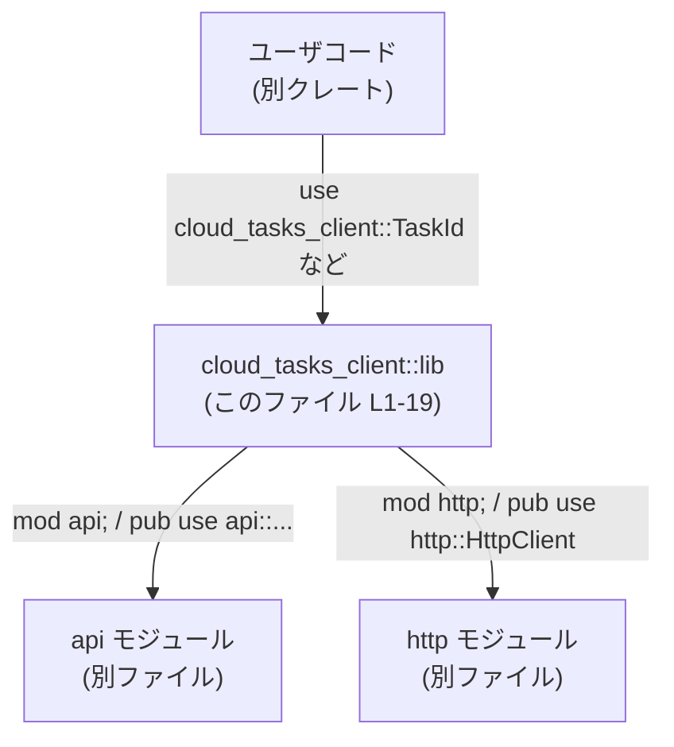

# cloud-tasks-client/src/lib.rs コード解説

## 0. ざっくり一言

`cloud-tasks-client` クレートのルートモジュールであり、内部モジュール `api` と `http` に定義された型・エイリアスなどを外部に公開する「フェイス（窓口）」の役割を持つファイルです（`lib.rs:L1-19`）。

---

## 1. このモジュールの役割

### 1.1 概要

- このモジュールは、下位モジュール `api` および `http` を宣言し、それらからいくつかのアイテムを `pub use` で再エクスポートしています（`lib.rs:L1,L3-16,L18-19`）。
- 利用者は `cloud_tasks_client::TaskId` や `cloud_tasks_client::HttpClient` のように、クレートのルート名前空間から直接アイテムを参照できるようになっています。

### 1.2 アーキテクチャ内での位置づけ

このファイルから読み取れる範囲では、構造は次のようになります。



- `mod api;` と `mod http;` により、同名のモジュールがこのクレート内に存在することが分かります（`lib.rs:L1,L18`）。
- `pub use` 群により、`api` モジュールと `http` モジュールに定義されたアイテムが再エクスポートされていることが分かります（`lib.rs:L3-16,L19`）。

`api` や `http` の中身（HTTP 通信やタスク操作の具体的な処理）はこのチャンクには現れないため、不明です。

### 1.3 設計上のポイント

コードから読み取れる特徴は次のとおりです。

- **ルートにAPIを集約**
  - 多数のアイテムを `pub use api::...` で再エクスポートしており、クレート利用者は `cloud_tasks_client::Xxx` という短いパスでアクセスできます（`lib.rs:L3-16`）。
- **モジュール構造のカプセル化**
  - `api`・`http` モジュール自体の構成や階層は外側からは見えず、ルートモジュールが公開窓口となる構造になっています（`lib.rs:L1,L18`）。
- **エラー型と Result の一元化**
  - `CloudTaskError` および `Result` が `api` から再エクスポートされており（`lib.rs:L7,L10`）、エラー表現と結果型をクレート共通で使うことが意図されていることが分かります（詳細な中身はこのチャンクには現れません）。
- **HTTP クライアントの公開**
  - `http::HttpClient` をそのまま再エクスポートしており（`lib.rs:L19`）、HTTP 関連の機能を提供する中心的な型である可能性がありますが、具体的なメソッドや挙動はこのチャンクからは分かりません。

---

## 2. 主要な機能一覧

この `lib.rs` 自体はロジックを持たず、主に「公開 API の窓口」として振る舞います。

- `api` モジュールの公開
- `http` モジュールの公開
- `api` モジュール内のアイテムの再エクスポート
  - `ApplyOutcome`, `ApplyStatus`, `AttemptStatus`
  - `CloudBackend`, `CloudTaskError`, `CreatedTask`
  - `DiffSummary`, `Result`
  - `TaskId`, `TaskListPage`, `TaskStatus`
  - `TaskSummary`, `TaskText`, `TurnAttempt`
- `http` モジュール内の `HttpClient` の再エクスポート

これらの型やエイリアスの**定義・ロジックはすべて別ファイル**にあり、このチャンクには現れません。

---

## 3. 公開 API と詳細解説

### 3.1 型・コンポーネント一覧

このファイルで「公開されている／参照されている」コンポーネントの一覧です。  
種別（構造体・列挙体・トレイトなど）は、このチャンクからは判別できません。

| 名前 | 種別（このチャンクから判別可能な範囲） | 定義モジュール | lib.rs 上の根拠 | 役割 / 用途（このチャンクから分かる範囲） |
|------|------------------------------------|----------------|-------------------------|----------------------------------------|
| `api` | モジュール | `crate::api` | `lib.rs:L1` | 下位モジュールとして存在することのみが分かる。中身は不明。 |
| `ApplyOutcome` | 不明 | `api` | `lib.rs:L3` | `api::ApplyOutcome` が再エクスポートされていることのみ分かる。詳細不明。 |
| `ApplyStatus` | 不明 | `api` | `lib.rs:L4` | 同上。 |
| `AttemptStatus` | 不明 | `api` | `lib.rs:L5` | 同上。 |
| `CloudBackend` | 不明 | `api` | `lib.rs:L6` | 同上。 |
| `CloudTaskError` | 不明 | `api` | `lib.rs:L7` | クレート共通のエラー型である可能性が高いが、挙動や構造は不明。 |
| `CreatedTask` | 不明 | `api` | `lib.rs:L8` | 同上。 |
| `DiffSummary` | 不明 | `api` | `lib.rs:L9` | 同上。 |
| `Result` | 不明（おそらく型エイリアス） | `api` | `lib.rs:L10` | `api::Result` が再エクスポートされていることのみ分かる。標準の `Result` とは別の定義であると推定されるが、具体的な定義は不明。 |
| `TaskId` | 不明 | `api` | `lib.rs:L11` | 同上。 |
| `TaskListPage` | 不明 | `api` | `lib.rs:L12` | 同上。 |
| `TaskStatus` | 不明 | `api` | `lib.rs:L13` | 同上。 |
| `TaskSummary` | 不明 | `api` | `lib.rs:L14` | 同上。 |
| `TaskText` | 不明 | `api` | `lib.rs:L15` | 同上。 |
| `TurnAttempt` | 不明 | `api` | `lib.rs:L16` | 同上。 |
| `http` | モジュール | `crate::http` | `lib.rs:L18` | 下位モジュールとして存在することのみが分かる。中身は不明。 |
| `HttpClient` | 不明 | `http` | `lib.rs:L19` | `http::HttpClient` が再エクスポートされていることのみ分かる。HTTP 通信を行うコンポーネントである可能性があるが、詳細は不明。 |

> 注: 「不明」と記載している部分は、「このチャンク（`lib.rs`）には型定義やコメントが現れていないため、役割やフィールド、メソッドなどは判断できない」という意味です。

### 3.2 関数詳細（最大 7 件）

このファイル内には**関数定義が 1 つも存在しません**（`lib.rs:L1-19` には関数シグネチャが現れないため）。  
したがって、詳細テンプレートを適用すべき対象関数もありません。

- ロジックやアルゴリズム、エラー処理、並行性の扱いはすべて `api` / `http` モジュール側に存在し、このチャンクには現れません。

### 3.3 その他の関数

- 該当なし（このファイルには補助関数やラッパー関数も定義されていません）。

---

## 4. データフロー

### 4.1 このファイルにおける「フロー」の性質

`lib.rs` には実行時ロジックはなく、**コンパイル時の名前解決と公開範囲の制御**のみが行われています。

- ユーザコードは `cloud_tasks_client::TaskId` のようにルートから型名を参照する（コンパイル時）。
- コンパイラは `lib.rs` の `pub use api::TaskId;` をたどり、実際の定義を `api` モジュール内に見つける（コンパイル時）。
- 同様に、`HttpClient` も `pub use http::HttpClient;` を経由して解決されます。

このコンパイル時の解決フローを sequence diagram で示します。

```mermaid
sequenceDiagram
    participant U as ユーザコード
    participant L as lib.rs (L1-19)
    participant A as api モジュール（別ファイル）
    participant H as http モジュール（別ファイル）

    U->>L: use cloud_tasks_client::TaskId;
    Note right of L: lib.rs に<br/>pub use api::TaskId; (L11)
    L-->>A: TaskId の定義を解決

    U->>L: use cloud_tasks_client::HttpClient;
    Note right of L: lib.rs に<br/>pub use http::HttpClient; (L19)
    L-->>H: HttpClient の定義を解決
```

- 実行時の処理フロー（HTTP リクエストの送信やタスクの更新など）は、このチャンクには現れません。

---

## 5. 使い方（How to Use）

### 5.1 基本的な使用方法

このファイルが提供するのは「クレートルートからの一括インポート」です。  
下位モジュールのパスを意識せず、ルートから直接使用できます。

```rust
// cloud-tasks-client クレートの公開アイテムをルートからインポートする例
use cloud_tasks_client::{                 // クレート名 cloud_tasks_client を指定
    TaskId,                               // api::TaskId を lib.rs 経由で利用
    TaskStatus,                           // api::TaskStatus を lib.rs 経由で利用
    HttpClient,                           // http::HttpClient を lib.rs 経由で利用
    Result,                               // api::Result を lib.rs 経由で利用
};

fn main() {
    // ここで TaskId や HttpClient の具体的な使い方は
    // api モジュール／http モジュールの定義に依存するため、
    // この lib.rs だけからは分かりません。
}
```

- 上記のように `cloud_tasks_client::` 直下に見える名前は、すべて `lib.rs` の `pub use` を通じて公開されています（`lib.rs:L3-16,L19`）。

### 5.2 よくある使用パターン

このファイルだけから読み取れる典型パターンは「ルートからのインポート」のみです。

1. **型やエラー、Result 型をまとめてインポートする**

```rust
use cloud_tasks_client::{                 // ルートから複数のアイテムをインポート
    TaskId,
    TaskStatus,
    TaskSummary,
    CloudTaskError,
    Result,
};

fn example() -> Result<()> {              // クレート固有の Result を利用（lib.rs:L10）
    // ここで TaskId などを利用した処理を記述する
    Ok(())
}
```

> `Result` をインポートすると、`std::result::Result` との名前衝突を避けるため、名前空間の扱いに注意する必要があります（詳細は 5.4 参照）。

1. **HTTP クライアントだけを使う**

```rust
use cloud_tasks_client::HttpClient;       // http::HttpClient をルート経由で利用（lib.rs:L19）

fn build_client() {
    // HttpClient の具体的な生成方法やメソッドは http モジュール側にあり、
    // このチャンクからは分かりません。
}
```

### 5.3 よくある間違い（推定できる範囲）

このファイルから推定できる、起こり得る誤用例と注意点です。

```rust
// （誤用の可能性）標準の Result と cloud_tasks_client の Result を混同
use cloud_tasks_client::Result;

fn f() -> Result<()> {
    // ここで std::io::Result と混ざると型の不一致が発生する可能性がある
    Ok(())
}

// 正しい扱い方の一例: 名前を明示的に使い分ける
use cloud_tasks_client as ctc;           // クレートに別名を付ける
use std::io;

fn g() -> ctc::Result<()> {              // cloud_tasks_client 側の Result を明示
    // io::Result との混同が減る
    Ok(())
}
```

- 上記は名前衝突に関する一般的な注意事項であり、この `lib.rs` 固有のロジックによるものではありません。
- 実際のエラー型・Result 型の定義内容は `api` モジュール側にあり、このチャンクからは分かりません。

### 5.4 使用上の注意点（まとめ）

このファイルの性質（再エクスポート専用）から導ける注意点です。

- **公開 API の入口**
  - ここで `pub use` されている名前が、クレート利用者から見える公式な API 入口になります（`lib.rs:L3-16,L19`）。
- **Result の名前衝突**
  - `cloud_tasks_client::Result` をインポートすると、標準ライブラリの `Result` と名前が一致するため、モジュールパスを明示して区別する方が安全な場合があります。
- **安全性・エラー・並行性の詳細**
  - このファイルにはロジックがなく、スレッド安全性やエラー処理、非同期処理（`async`）に関する情報は一切存在しません。  
    実際の挙動は `api` / `http` モジュールの定義に依存します。
- **内部モジュールへの直接アクセス**
  - `cloud_tasks_client::api::TaskId` のように内部モジュールを直接指定してアクセスすることも Rust の仕様上は可能ですが、この `lib.rs` が `pub use` を提供していることから、通常はルート経由で利用する方が将来的な変更耐性が高くなることが多いです。  
    ただし、作者の意図まではこのチャンクからは断定できません。

---

## 6. 変更の仕方（How to Modify）

### 6.1 新しい機能を追加する場合

`lib.rs` に新しい公開アイテムを追加する際の一般的な手順です。

1. **下位モジュールに定義を追加**
   - 例: `api` モジュールに新たな型 `NewType` を追加する。
   - 実際のコードは `src/api.rs` または `src/api/mod.rs` 側に記述されます（Rust のモジュール規則による一般論であり、このチャンクにはファイル構造は現れていません）。

2. **`lib.rs` で再エクスポート**
   - 追加したアイテムをクレートルートから見えるようにする場合、`lib.rs` に `pub use api::NewType;` を追加します。

```rust
mod api;                                  // 既存（lib.rs:L1）

// 既存の再エクスポート（lib.rs:L3-16）
pub use api::TaskId;

// 新たに追加する行の例
pub use api::NewType;                     // 新しい公開アイテムをルートに追加
```

1. **利用者コードの側**
   - これにより、ユーザコードからは `cloud_tasks_client::NewType` として利用できるようになります。

### 6.2 既存の機能を変更する場合

この `lib.rs` の観点から、変更時に注意すべき点です。

- **`pub use` の削除・リネームは破壊的変更**
  - ここから再エクスポートしているアイテム（例: `TaskId`, `HttpClient`）を削除したり名前を変更すると、それを利用している外部コードがコンパイルエラーになります。
- **内部モジュールの移動**
  - もし `TaskId` の定義を `api` から別モジュールに移動する場合でも、`lib.rs` の `pub use` を適切に書き換えれば、外部 API を維持することができます。
- **エラー・Result 型の変更**
  - `CloudTaskError` や `Result` の型定義を変更する場合、`lib.rs` 自体は `pub use` のままであっても、外部のコードとの互換性に大きな影響が出る可能性があります。  
    影響範囲の確認は `api` モジュール側のコードやテストを見る必要があります（このチャンクには現れません）。

---

## 7. 関連ファイル

このモジュールと密接に関係するファイル・ディレクトリ（Rust のモジュール規則に基づく一般的な対応）です。

| パス（候補） | 役割 / 関係 |
|-------------|------------|
| `src/api.rs` または `src/api/mod.rs` | `mod api;`（`lib.rs:L1`）で宣言されるモジュールに対応するファイル。`ApplyOutcome` や `TaskId` などの定義が存在するはずですが、このチャンクには内容は現れません。 |
| `src/http.rs` または `src/http/mod.rs` | `mod http;`（`lib.rs:L18`）で宣言されるモジュールに対応するファイル。`HttpClient` の定義が存在するはずですが、このチャンクには内容は現れません。 |

> 注意: 上記のパスは Rust の一般的な慣習に基づくものであり、実際のプロジェクト構成（`src/api/mod.rs` vs `src/api.rs` など）は、このチャンクからは特定できません。

---

### このファイルにおける Bugs / Security / Contracts / Edge Cases / Tests / Performance の観点

- **Bugs / Security**
  - このファイルはモジュール宣言と `pub use` のみで構成されており、実行時ロジックを持たないため、このファイル単体からバグやセキュリティホールを特定することはできません。
  - ただし、公開するアイテムの選択はセキュリティ境界に影響し得るため、どの型・関数を再エクスポートするかは設計上重要です（このチャンクでは選択の理由は不明）。

- **Contracts / Edge Cases**
  - このファイル自体の契約は「指定されたアイテムをクレートルートから利用可能にする」ことに尽きます。
  - 実行時のエッジケース（空入力・境界値・異常値など）はすべて下位モジュールの実装に依存し、このチャンクには現れません。

- **Tests**
  - このファイル内にテストコード（`#[cfg(test)] mod tests { ... }` 等）は存在しません（`lib.rs:L1-19` に見当たらないため）。
  - 公開 API の動作は、`api` / `http` モジュール側のテストまたは外部からの結合テストで検証されている可能性がありますが、このチャンクからは不明です。

- **Performance / Scalability / Concurrency**
  - このファイルには実行時処理が一切なく、パフォーマンスやスケーラビリティ、並行性（スレッドセーフティや async/await）の観点で分析できる要素はありません。
  - 実際の HTTP 通信やタスク処理の並行性に関する設計・実装は `http` / `api` モジュールに依存します。
