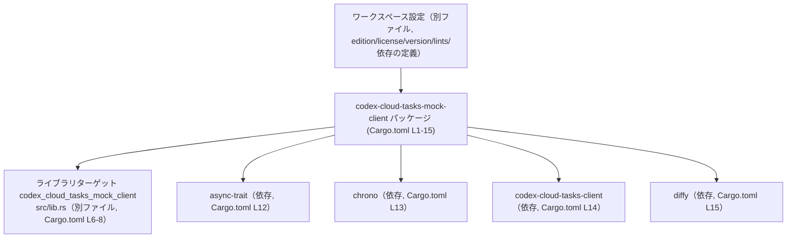
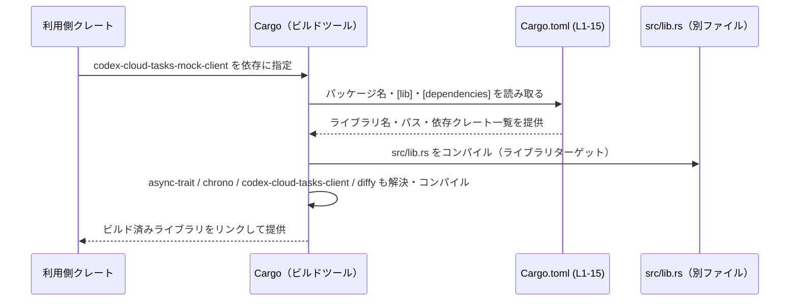

cloud-tasks-mock-client/Cargo.toml コード解説
================================================

## 0. ざっくり一言

- このファイルは、Rust クレート `codex-cloud-tasks-mock-client` の Cargo マニフェストであり、パッケージ情報・ライブラリターゲット・依存関係・ワークスペース共通設定（edition / license / version / lints）を定義しています（根拠: `Cargo.toml:L1-15`）。

---

## 1. このモジュールの役割

### 1.1 概要

- このファイルは **ビルド時のメタ情報を定義する設定ファイル** であり、実行時ロジックや関数本体は含みません。
- 具体的には次を行っています。
  - パッケージ名を `codex-cloud-tasks-mock-client` に設定（`Cargo.toml:L1-5`）。
  - `src/lib.rs` をエントリポイントとするライブラリターゲット `codex_cloud_tasks_mock_client` を宣言（`Cargo.toml:L6-8`）。
  - edition / license / version / lints / 依存クレートを **ワークスペース側から継承** するよう指定（`Cargo.toml:L2-3,L5,L9-10,L12-15`）。

### 1.2 アーキテクチャ内での位置づけ

- このクレートは、Rust **ワークスペースの一員**として設定されています（`.workspace = true` の記述より、根拠: `Cargo.toml:L2-3,L5,L9-10,L12-15`）。
- ライブラリクレートとして `src/lib.rs` を通じて API を公開し、その実装がこのマニフェストで宣言された依存クレートを利用するアーキテクチャになっています（根拠: `Cargo.toml:L6-8,L11-15`）。

依存関係の概略図:



### 1.3 設計上のポイント

- **ワークスペース集中管理**  
  - edition / license / version / lints / 依存クレートのバージョンなどをワークスペース側に一元管理する構成です（`*.workspace = true` の利用, 根拠: `Cargo.toml:L2-3,L5,L9-10,L12-15`）。
- **ライブラリ専用クレート**  
  - `[lib]` セクションのみが定義されており、バイナリターゲット（`[[bin]]`）はありません（根拠: `Cargo.toml:L6-8`）。
- **パッケージ名とライブラリ名の分離**  
  - パッケージ名はハイフン区切り (`codex-cloud-tasks-mock-client`)、ライブラリ名はアンダースコア区切り (`codex_cloud_tasks_mock_client`) となっており、コード中でのクレート名としては後者が使われる構成です（根拠: `Cargo.toml:L4,L7`）。
- **安全性・エラー・並行性に関する情報**  
  - このファイルは設定のみを含み、Rust の関数や並行処理の実装は含まないため、**実行時のエラー処理や並行性の方針はこのチャンクからは分かりません**。それらは `src/lib.rs` などソースコード側で決まります（根拠: `Cargo.toml:L6-8`）。

---

## 2. 主要な機能・コンポーネント一覧

### 2.1 コンポーネントインベントリー

この Cargo.toml が定義する主な構成要素の一覧です。

| コンポーネント名 | 種別 | 説明 | 定義箇所 |
|------------------|------|------|----------|
| `codex-cloud-tasks-mock-client` | パッケージ | クレート全体のパッケージ名。`cargo build -p` などで指定する名前になります。 | `Cargo.toml:L1-5` |
| `codex_cloud_tasks_mock_client` | ライブラリターゲット名 | `extern crate` / `use` で参照されるクレート名。`src/lib.rs` をエントリポイントとします。 | `Cargo.toml:L6-8` |
| `src/lib.rs` | ライブラリルートファイル | ライブラリの公開 API・実装が書かれる Rust ソースファイル（このチャンクには中身は現れません）。 | `Cargo.toml:L8` |
| `edition.workspace = true` | edition 設定 | 使用する Rust edition をワークスペース共通設定から継承します。 | `Cargo.toml:L2` |
| `license.workspace = true` | ライセンス設定 | ライセンス表記をワークスペース側に委ねます。 | `Cargo.toml:L3` |
| `version.workspace = true` | バージョン設定 | パッケージバージョンをワークスペースで集中管理します。 | `Cargo.toml:L5` |
| `[lints] workspace = true` | Lints 設定 | コンパイル時警告などの lint 設定をワークスペース共通設定に従わせます。 | `Cargo.toml:L9-10` |
| `async-trait` | 依存クレート | async 関数を trait に含める際に使われるクレート。バージョンなどはワークスペース側に定義されています。 | `Cargo.toml:L11-12` |
| `chrono` | 依存クレート | 日時処理ライブラリ。バージョンなどはワークスペース側に定義されています。 | `Cargo.toml:L11-13` |
| `codex-cloud-tasks-client` | 依存クレート | このクレートが利用する「cloud-tasks-client」機能を提供するクレート（詳細は別ファイル。ここには現れません）。 | `Cargo.toml:L11-14` |
| `diffy` | 依存クレート | 差分比較などを提供するクレート。バージョンなどはワークスペース側に定義されています。 | `Cargo.toml:L11-15` |

### 2.2 関数・構造体インベントリー

- このファイルは **Cargo の設定ファイル** であり、Rust の関数・構造体・列挙体などのコード定義は含みません（根拠: `Cargo.toml:L1-15`）。
- 関数や構造体に関する情報は、`src/lib.rs` やその他の `.rs` ファイルに存在すると考えられますが、それらはこのチャンクには現れないため、ここでは一覧を作成できません。

---

## 3. 公開 API と詳細解説

### 3.1 型一覧（構造体・列挙体など）

- このファイルには Rust の型定義が存在しないため、**型一覧は該当なし**です（根拠: `Cargo.toml:L1-15`）。
- 公開 API の型は `src/lib.rs` などで定義されますが、その内容はこのチャンクからは分かりません（根拠: `Cargo.toml:L8`）。

### 3.2 関数詳細（最大 7 件）

- このファイルは設定のみを含み、関数定義を含まないため、**詳細解説対象となる関数はありません**（根拠: `Cargo.toml:L1-15`）。
- 実際の公開関数・戻り値・エラー型・並行性の扱いは、ライブラリルート `src/lib.rs` などの Rust ソースコード側で定義されます（根拠: `Cargo.toml:L6-8`）。

### 3.3 その他の関数

- 関数は定義されていないため、この節も該当する項目はありません。

---

## 4. データフロー

このファイルそのものは実行時の処理を持ちませんが、「ビルドと依存解決」という観点でのデータフローを示します。

1. 利用側クレートが `codex-cloud-tasks-mock-client` を依存として指定する。
2. Cargo がこの `Cargo.toml` を読み込み、ライブラリ名・パス・依存クレートを解決する。
3. Cargo が `src/lib.rs` と依存クレート（`async-trait`, `chrono`, `codex-cloud-tasks-client`, `diffy`）をコンパイルする。
4. ビルド済みライブラリが利用側クレートからリンクされる。



- このフローはコンパイル時のものであり、実行時のデータフロー（リクエスト処理など）は `src/lib.rs` 以降の実装に依存し、このチャンクからは分かりません。

---

## 5. 使い方（How to Use）

### 5.1 基本的な使用方法

#### 同一ワークスペース内の別クレートから利用する例

同じワークスペース内の別クレートからこのライブラリを利用する場合の一例です。

```toml
# （別クレート側の Cargo.toml の例）
[dependencies]
codex-cloud-tasks-mock-client = { path = "../cloud-tasks-mock-client" }
```

- `codex-cloud-tasks-mock-client` はパッケージ名であり、`Cargo.toml` に定義されています（根拠: `Cargo.toml:L4`）。
- その結果、Rust コード中ではライブラリ名 `codex_cloud_tasks_mock_client` として参照されます（根拠: `Cargo.toml:L7`）。

```rust
// 別クレート側の src/lib.rs などの例
// use する際はライブラリ名（crate 名）を使う
use codex_cloud_tasks_mock_client::*; // 具体的な API はこのチャンクには現れません
```

### 5.2 よくある使用パターン

- **ライブラリとしての再利用**  
  - 他クレートがこのライブラリを依存に追加し、`codex_cloud_tasks_mock_client` クレートから提供される関数・型を利用する、という使い方が想定されます（パッケージ名とライブラリ名の定義より, 根拠: `Cargo.toml:L4,L7,L8`）。
- **ターゲット限定ビルド・テスト**  
  - ワークスペース全体ではなく、このクレート単体をビルド・テストする場合、次のようなコマンドが利用できます（パッケージ名より, 根拠: `Cargo.toml:L4`）。
    - `cargo build -p codex-cloud-tasks-mock-client`
    - `cargo test -p codex-cloud-tasks-mock-client`

### 5.3 よくある間違い

#### 1. パッケージ名とクレート名の取り違え

```rust
// 誤りの例（パッケージ名をそのままクレート名にしている仮想的な例）
// use codex-cloud-tasks-mock-client::*; // これはコンパイルエラーになる

// 正しい例（[lib] の name に一致するクレート名を使う）
use codex_cloud_tasks_mock_client::*;     // 根拠: Cargo.toml:L7
```

- Cargo では、ハイフンを含むパッケージ名と、コードから参照するクレート名は一致しないことがあります。
- このファイルでは `[lib] name = "codex_cloud_tasks_mock_client"` と明示しているため、コード側ではアンダースコア区切りの名前を使う必要があります（根拠: `Cargo.toml:L6-8`）。

#### 2. ワークスペース依存の未定義

- `async-trait = { workspace = true }` などと記述しているため、**ワークスペースルート側に同名の依存クレートが定義されていない場合、依存解決エラーになります**（根拠: `Cargo.toml:L11-15`）。
- これは Cargo の仕様に基づく一般的なエラー条件であり、このファイルに特有の挙動ではありません。

### 5.4 使用上の注意点（まとめ）

- **クレート名の確認**  
  - コードから `use` する際には `[lib] name` に指定された `codex_cloud_tasks_mock_client` をクレート名として使用する必要があります（根拠: `Cargo.toml:L6-8`）。
- **ワークスペース設定への依存**  
  - edition / license / version / lints / 依存クレートのバージョンはワークスペース側に依存しているため、このファイル単体ではそれらの値は分かりません（根拠: `Cargo.toml:L2-3,L5,L9-10,L12-15`）。
  - ワークスペースの設定を変更すると、このクレートにも影響が及びます。
- **実行時の安全性・エラー・並行性**  
  - このファイルは実行時ロジックを持たないため、スレッド安全性やエラー処理の詳細は **`src/lib.rs` などの実装を確認する必要があります**（根拠: `Cargo.toml:L6-8`）。

---

## 6. 変更の仕方（How to Modify）

### 6.1 新しい機能を追加する場合

新しいコードレベルの機能を追加する場合、通常は `src/lib.rs` などの Rust ファイルに実装を追加しますが、それに伴って外部クレートが必要になる場合、この Cargo.toml を変更することになります。

1. **新しい依存クレートが必要になった場合**
   - `[dependencies]` セクションに追記します（根拠: `Cargo.toml:L11-15`）。
   - ワークスペース全体でバージョンを統一する方針の場合、まずワークスペースルート側で `dependency_name = "x.y.z"` を追加し、ここでは `{ workspace = true }` を指定する形を踏襲していると考えられます（このチャンクから具体的なルート設定は分かりません）。

2. **ライブラリのエントリポイントを増やしたい／変えたい場合**
   - ライブラリが一つだけ定義されているため（`[lib]` のみ, 根拠: `Cargo.toml:L6-8`）、別ターゲットを増やすには `[[bin]]` や `[[example]]` 等のセクションを追加します。
   - 既存ライブラリのパスを変更する場合は `path = "src/lib.rs"` を新しいパスに変更します（根拠: `Cargo.toml:L8`）。

3. **共通設定に依存したまま機能追加する場合**
   - edition / lints などはワークスペースから継承しているため、クレート単体で変えたい場合は `*.workspace = true` をやめて明示的な値を書きます（根拠: `Cargo.toml:L2-3,L5,L9-10`）。

### 6.2 既存の機能を変更する場合

- **パッケージ名やクレート名の変更**
  - パッケージ名を変える場合は `[package] name` を、クレート名（コードからの参照名）を変える場合は `[lib] name` を変更します（根拠: `Cargo.toml:L4,L7`）。
  - これにより、他クレートからの依存指定や `use` パスが変わるため、参照側コードや Cargo.toml も合わせて修正する必要があります。
- **依存クレートの構成変更**
  - 依存クレートを増減・置き換えする場合は `[dependencies]` セクションを編集します（根拠: `Cargo.toml:L11-15`）。
  - ワークスペース側での設定との整合性（バージョン・有無）に注意が必要です。
- **lint 設定の個別化**
  - このクレートだけ lint の方針を変えたい場合、`[lints] workspace = true` をやめて、個別の lint 設定を書く構成に変更できます（根拠: `Cargo.toml:L9-10`）。

---

## 7. 関連ファイル

この Cargo.toml と密接に関係するファイル・設定の一覧です。

| パス / 名称 | 役割 / 関係 |
|------------|------------|
| `cloud-tasks-mock-client/Cargo.toml` | 本レポートの対象ファイル。パッケージ・ライブラリ・依存クレート・ワークスペース継承設定を定義する Cargo マニフェストです（根拠: `Cargo.toml:L1-15`）。 |
| `cloud-tasks-mock-client/src/lib.rs` | ライブラリターゲット `codex_cloud_tasks_mock_client` の実装と公開 API を定義するファイルです。パスは `[lib] path = "src/lib.rs"` から分かります（根拠: `Cargo.toml:L6-8`）。 |
| （名称のみ）ワークスペースルートの Cargo.toml | `edition.workspace = true` や `dependencies.* = { workspace = true }` によって参照される、ワークスペース共通設定を持つ Cargo.toml です。正確なパスはこのチャンクからは分かりませんが、ここで継承される edition / license / version / lints / 依存クレートのバージョンなどを定義しています（根拠: `Cargo.toml:L2-3,L5,L9-10,L12-15`）。 |

- テストコードや追加モジュール (`src/` 配下の他の `.rs` ファイルなど) が存在するかどうかは、このチャンクからは分かりません。
