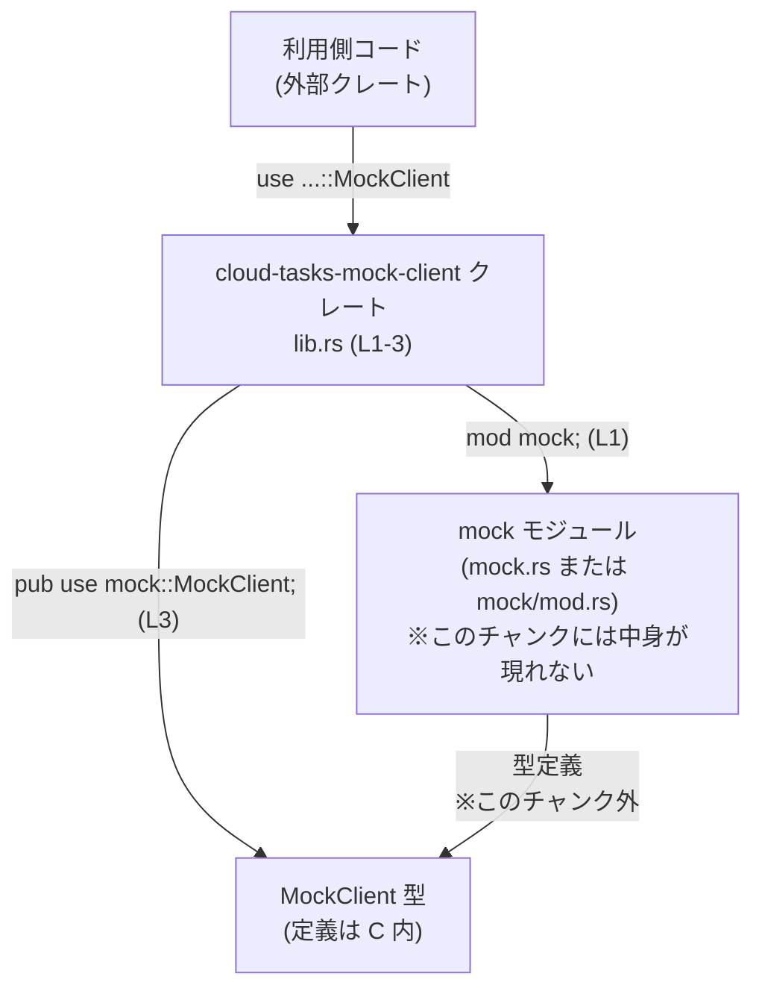

# cloud-tasks-mock-client/src/lib.rs コード解説

## 0. ざっくり一言

- このファイルはクレートのルート（`lib.rs`）として、内部モジュール `mock` に定義されている `MockClient` 型をトップレベルに再公開するためのエントリポイントになっています（`lib.rs:L1-3`）。
- 実行時ロジックや関数はこのファイルにはなく、公開 API の名前付けとモジュール構成のみを定義しています。

---

## 1. このモジュールの役割

### 1.1 概要

- このモジュールは、内部モジュール `mock` で定義された `MockClient` をクレートの外部から直接利用できるようにするために存在します（`lib.rs:L1`, `L3`）。
- 具体的な処理内容やメソッドはすべて `mock` モジュール側にあり、このファイルは公開パスの整形に特化した薄いラッパとなっています。

### 1.2 アーキテクチャ内での位置づけ

このファイルに基づいて分かる範囲の依存関係は次のとおりです。

- クレート外部の利用者コードは `cloud_tasks_mock_client::MockClient`（仮のクレート識別子）として型を参照します。
- `cloud-tasks-mock-client/src/lib.rs` は内部モジュール `mock` を宣言し（`lib.rs:L1`）、その中の `MockClient` を再公開します（`lib.rs:L3`）。
- `MockClient` の本体は `mock` モジュールを定義するファイル（`mock.rs` または `mock/mod.rs`）側に存在します。このチャンクにはその内容は現れません。



### 1.3 設計上のポイント

- **公開 API の単純化**  
  - `mod mock;` により内部モジュールとして実装を分離し（`lib.rs:L1`）、`pub use mock::MockClient;` で公開名を 1 段に揃えています（`lib.rs:L3`）。
- **カプセル化**  
  - `mock` モジュール自体は `pub mod` ではなく単に `mod` として宣言されているため、外部からは `mock` の中身を直接参照できません（`lib.rs:L1`）。  
    外部利用者は常に `MockClient` というトップレベル名だけを使う構造になっています。
- **状態・エラーハンドリング・並行性**  
  - このファイルには関数やメソッド・実行時ロジックが一切ないため、ここでは所有権制御・エラーハンドリング・並行処理に関する挙動は発生しません。  
    これらはすべて `mock` モジュール側の実装に依存します（このチャンクには現れません）。

### 1.4 コンポーネント一覧（このファイル内）

このファイルで確認できるモジュール・公開項目の一覧です。

| 名前        | 種別             | 公開性 | 定義位置       | 説明 |
|-------------|------------------|--------|----------------|------|
| `mock`      | モジュール宣言   | 非公開 | `lib.rs:L1-1`  | `mock` という内部モジュールを宣言します。実体は同一ディレクトリの `mock.rs` または `mock/mod.rs` にあります（このチャンクには中身が現れません）。 |
| `MockClient`| 型の再公開（re-export）| 公開   | `lib.rs:L3-3`  | `mock` モジュール内で定義されている `MockClient` 型をクレートのトップレベルへ再公開します。型の種別や中身はこのチャンクからは分かりません。 |

---

## 2. 主要な機能一覧

このファイル単体が提供する機能は、モジュール構成と公開パスの整理に限定されます。

- `mock` モジュールの宣言: `mock` という内部モジュールの存在をクレートルートで登録します（`lib.rs:L1`）。
- `MockClient` の再公開: `mock` モジュール内の `MockClient` をクレート外から `クレート名::MockClient` で参照できるようにします（`lib.rs:L3`）。

※ `MockClient` が実際に提供する「クライアントとしての機能」（メソッドや振る舞い）は、このチャンクでは一切分かりません。

---

## 3. 公開 API と詳細解説

### 3.1 型一覧（構造体・列挙体など）

このファイルで公開されている主要な型（または型エイリアス／再公開）の一覧です。

| 名前 | 種別 | 役割 / 用途 | 定義位置 |
|------|------|-------------|-----------|
| `MockClient` | 不明（このチャンクには定義が現れない） | このファイルのコードだけからは役割は分かりません。名前からは「何らかのクライアント」をモックする型である可能性が想定されますが、断定はできません。実際の用途・メソッドは `mock` モジュール側の定義を確認する必要があります。 | 再公開: `lib.rs:L3-3` / 元定義: `mock` モジュール内（このチャンクには現れない） |

補足:

- `pub use mock::MockClient;` がコンパイルに成功するためには、`MockClient` は `mock` モジュール内で `pub` として定義されている必要があります（Rust 言語仕様による）。  
  ただし、その具体的な定義（構造体か、列挙体か、型エイリアスかなど）はこのチャンクには含まれていません。

### 3.2 関数詳細

#### このファイル内の関数定義について

- `cloud-tasks-mock-client/src/lib.rs` には関数・メソッド・`impl` ブロックなどの実装コードは存在しません（`lib.rs:L1-3` がすべて）。
- そのため、このセクションで詳述するべき関数はありません。
- `MockClient` に紐づくコンストラクタ関数やメソッド（例: `new`, `enqueue_task` など）が存在する場合、それらは `mock` モジュール側に定義されていると考えられますが、このチャンクには現れないため、内容・シグネチャ・エラー条件などは不明です。

**安全性・エラーハンドリング・並行性に関する補足（lib.rs のみについて）**

- **所有権 / 借用**:  
  - このファイルは型や値を生成したり所有したりしていないため、所有権・借用に関する問題は発生しません。
- **エラーハンドリング**:  
  - 実行時に失敗しうる処理（I/O・パースなど）を行っておらず、`Result` や `Option` を返す関数もないため、エラー制御はここでは存在しません。
- **並行性**:  
  - スレッドの生成や `async`/`await`、共有状態なども一切登場しないため、このファイル単体に並行性に関する挙動はありません。
- これらの性質はすべて `MockClient` の実装側（`mock` モジュール）に依存します。

### 3.3 その他の関数

- このファイルには補助的な関数・メソッド・マクロの定義はありません。
- よって、一覧として挙げるべき関数は存在しません（`lib.rs:L1-3`）。

---

## 4. データフロー

### 4.1 代表的なフローの概要

このファイルには実行時のデータ処理はありませんが、「型がどのように利用側に露出するか」という意味でのフローを整理すると次のようになります。

1. `lib.rs` で `mod mock;` により内部モジュール `mock` を登録します（`lib.rs:L1`）。
2. 同じく `lib.rs` で `pub use mock::MockClient;` により、`mock` モジュール内の `MockClient` をクレートトップレベルに再公開します（`lib.rs:L3`）。
3. 利用側コードは `クレート名::MockClient` を `use` することで、`mock` の存在を意識せずに `MockClient` 型だけを利用できます。

### 4.2 シーケンス図

```mermaid
sequenceDiagram
    participant User as 利用側コード
    participant Crate as cloud-tasks-mock-client\nlib.rs (L1-3)
    participant MockMod as mock モジュール\n(mock.rs / mock/mod.rs)

    User->>Crate: use クレート名::MockClient;
    Note right of Crate: pub use mock::MockClient; (L3)
    Crate-->>User: MockClient 型をスコープに公開
    Crate->>MockMod: mod mock; により\nモジュールを参照 (L1)
    Note over MockMod: MockClient 本体の定義・ロジック\n※このチャンクには現れない
```

- ここで示しているのは「名前解決」の流れであり、実際のビジネスロジックやデータ処理フローは、このチャンクからは一切分かりません。

---

## 5. 使い方（How to Use）

### 5.1 基本的な使用方法

このファイルから分かる「唯一の使い方」は、再公開された `MockClient` 型をクレートのトップレベルから参照することです。

以下は、パッケージ名が `cloud-tasks-mock-client` である一般的なケースを想定した、外部クレートからの利用例です（クレート識別子は通常 `cloud_tasks_mock_client` になりますが、このチャンクには `Cargo.toml` がないため、あくまで慣例に基づく例です）。

```rust
// 外部クレート側のコード例（クレート名は慣例に基づく仮定です）
// cloud-tasks-mock-client を Cargo.toml に依存として追加している前提。
use cloud_tasks_mock_client::MockClient; // lib.rs の pub use (L3) によりトップレベルに公開されている

fn main() {
    // MockClient の具体的な構築方法や利用方法は mock モジュール側の定義に依存し、
    // この lib.rs のチャンクだけからは分かりません。
    // ここでは、型をスコープに持ち込めることだけが確認できます。
    // let client = MockClient::new(...);  // ← こうしたコンストラクタの有無はこのチャンクには現れません
    // 実際のコードは mock.rs 内の API 定義に従います。
}
```

同じクレートの内部コードから `MockClient` を使う場合も、トップレベルの再公開を利用できます。

```rust
// cloud-tasks-mock-client クレート内部の別モジュールからの利用例
use crate::MockClient; // crate ルートの再公開を参照（lib.rs:L3）

fn use_client() {
    // 実際のメソッドやフィールドはこのチャンクにないため不明です。
    // let client = MockClient::new();
    // client.do_something();
}
```

### 5.2 よくある使用パターン

- このチャンクには `MockClient` の具体的なメソッド・フィールド・挙動が一切現れないため、  
  「タスクを追加する」「一覧取得する」などの具体的な利用パターンを提示することはできません。
- 代表的なパターンを知るには、`mock` モジュール内の `MockClient` 定義（このチャンクには現れない）と、可能であればテストコードや README 等を確認する必要があります。

### 5.3 よくある間違い

このファイルから推測できる、パス指定まわりの誤用例と正しい例を示します。

```rust
// 間違い例: 外部クレートから内部モジュールを直接参照しようとする
use cloud_tasks_mock_client::mock::MockClient;
// ↑ lib.rs では `mod mock;` (L1) としているだけで、`pub mod mock;` ではありません。
//    そのため、mock モジュール自体はクレート外からは見えず、この use はコンパイルエラーになります。

// 正しい例: 再公開されているトップレベル経由で参照する
use cloud_tasks_mock_client::MockClient; // lib.rs の `pub use mock::MockClient;` (L3) を通じて公開されている
```

ポイント:

- 外部クレートからは、**内部モジュール名 (`mock`) を直接参照しない** ことが前提になります。
- `MockClient` を利用する際は、常にクレートトップレベルの `MockClient` を経由するのがこの構成の意図です。

### 5.4 使用上の注意点（まとめ）

- **前提条件**  
  - `MockClient` の利用前提（初期化方法・必須の設定など）は `mock` モジュール側の定義を確認する必要があり、このチャンクからは分かりません。
- **パスの取り方**  
  - 外部クレートからは `クレート名::MockClient` として参照し、`クレート名::mock::MockClient` のように内部モジュールを直接参照しない構造になっています（`lib.rs:L1-3`）。
- **安全性 / エラー / 並行性**  
  - lib.rs 自体にはロジックがないため、安全性・エラー・並行性に関する注意点はありません。  
    これらは `MockClient` 実装側に依存するため、そちらのコードを確認する必要があります。
- **将来的な変更耐性**  
  - トップレベルに再公開された `MockClient` を利用しておけば、内部で `mock` モジュールの構成が変わっても、外部コード側の `use クレート名::MockClient;` は影響を受けにくい構造になっています。

---

## 6. 変更の仕方（How to Modify）

### 6.1 新しい機能を追加する場合

このファイルの役割は「公開パスの整理」なので、新しい型や機能を追加したい場合の典型的な変更ポイントは次のとおりです。

1. **内部モジュール側（例: `mock.rs`）に型や関数を追加**  
   - 例: `MockScheduler` という新しいモック型を追加するとします。  
   - その場合、`mock` モジュール内で `pub struct MockScheduler { ... }` のように定義することになります（このチャンクにはそのコードは現れません）。

2. **必要に応じて `lib.rs` で再公開**  
   - 新しい型をクレートのトップレベルからも利用可能にしたい場合は、`lib.rs` に次のような行を追加します。

   ```rust
   mod mock;                          // 既存 (L1)

   pub use mock::MockClient;          // 既存 (L3)
   pub use mock::MockScheduler;       // 追加: 新しい型を再公開
   ```

   - これにより、外部クレートから `cloud_tasks_mock_client::MockScheduler` として参照できるようになります。

3. **依存関係とビルドの確認**
   - 追加した型や関数に対する `pub use` が、実際に `mock` モジュール内の `pub` な定義を指していることを確認します（`pub use` が非公開のシンボルを指すとコンパイルエラーになります）。
   - コンパイルを行い、パスの誤りや可視性の問題がないか確認することが重要です。

### 6.2 既存の機能を変更する場合

`MockClient` の構造や場所を変更したい場合に、このファイルで注意すべき点は次のとおりです。

- **名前変更（リネーム）の場合**
  - もし `mock` モジュール内で `MockClient` という型名を変更した場合（例: `MockCloudTasksClient` に変更）、`lib.rs` の `pub use mock::MockClient;` も一致するように更新する必要があります。
  - 変更例:

    ```rust
    // 変更前
    pub use mock::MockClient;

    // 変更後
    pub use mock::MockCloudTasksClient as MockClient; // 既存の外部 API 名を保ちたい場合の一例
    ```

  - `as` 句を使うことで、内部名を変えつつ外部 API 名（`MockClient`）を維持することも可能です。

- **モジュール構成の変更の場合**
  - `MockClient` の定義を `mock` 以外のモジュールに移動した場合は、`pub use` のパスも合わせて変更する必要があります。
  - 例:

    ```rust
    // 変更前
    mod mock;
    pub use mock::MockClient;

    // 変更後: 例えば client モジュールに移動した場合
    mod client;
    pub use client::MockClient;
    ```

- **影響範囲の確認**
  - `MockClient` を利用している外部クレートや、このクレート内の他モジュールからの `use` パスが壊れていないか、コンパイルエラーと IDE の参照検索で確認することが重要です。
  - 特に、外部に公開している名前（`MockClient`）を変える場合は、**API 破壊** になることに注意が必要です。

---

## 7. 関連ファイル

このファイルと密接に関係するファイル・ディレクトリは次のとおりです。

| パス | 役割 / 関係 |
|------|------------|
| `cloud-tasks-mock-client/src/mock.rs` または `cloud-tasks-mock-client/src/mock/mod.rs` | `mod mock;`（`lib.rs:L1`）が指す内部モジュールの実体です。`MockClient` の本体定義（構造体・メソッド・エラーハンドリング・並行性制御など）はここに存在すると考えられますが、このチャンクにはその内容は現れません。 |
| `cloud-tasks-mock-client/src/lib.rs` | 本レポートの対象ファイルであり、クレートルートとして `mock` モジュールの宣言と `MockClient` の再公開を行います。 |

※ テストコード（例: `tests/` ディレクトリや `mock` モジュール内の `#[cfg(test)]`）の有無は、このチャンクからは確認できません。

---

### まとめ（このファイルに特有の注意点）

- **機能面**: このファイルは実行ロジックを持たず、公開 API の名前付けとモジュール構造の定義に専念しています。
- **安全性・エラー・並行性**: これらの観点に関する実装上の注意点はすべて `MockClient` の中身（`mock` モジュール）側にあり、このチャンクからは判断できません。
- **利用者への影響**: 利用者は `クレート名::MockClient` というシンプルなパスでモッククライアントを利用できるようになっており、内部構造の変更の影響を軽減する設計になっています。
