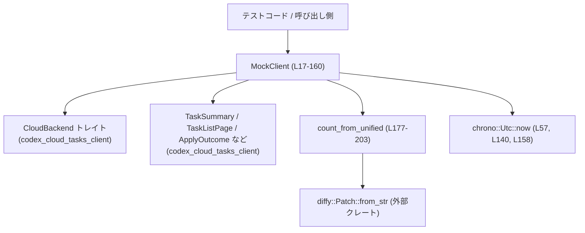
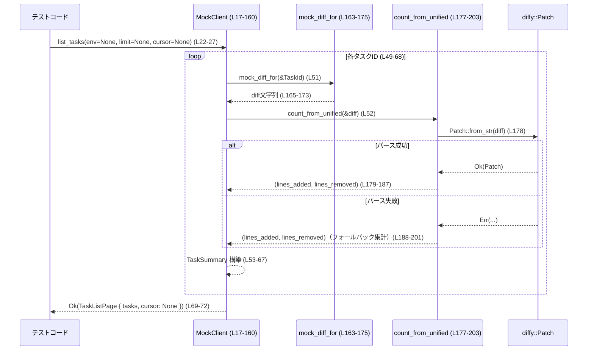

# cloud-tasks-mock-client/src/mock.rs コード解説

## 0. ざっくり一言

`MockClient` は、`CloudBackend` トレイトの **完全にインメモリなモック実装**です。  
固定のタスク一覧・差分(diff)・メッセージを返し、diff の行数集計用ユーティリティ `count_from_unified` も内部に持ちます。

---

## 1. このモジュールの役割

### 1.1 概要

- このモジュールは、`codex_cloud_tasks_client` クレートの `CloudBackend` トレイト実装を **テスト用に差し替えるためのモッククライアント**を提供します（`MockClient`、`mock.rs:L17-21`）。
- 実際のクラウドと通信せずに、決め打ちのタスクや差分・メッセージを返すことで、クライアント側ロジックを安定してテストできるようにします（`mock.rs:L22-160`）。
- さらに、ユニファイド diff 文字列から追加/削除行数を数えるユーティリティ関数 `count_from_unified` を提供します（`mock.rs:L177-203`）。

### 1.2 アーキテクチャ内での位置づけ

このファイルだけから分かる範囲での依存関係を図示します。



- 呼び出し側は `CloudBackend` トレイトを通して `MockClient` を利用すると考えられます（トレイト定義自体はこのチャンクには出てきません）。
- diff の要約情報（追加/削除行数）は `mock_diff_for` → `count_from_unified` → `diffy::Patch` という流れで求められます。

### 1.3 設計上のポイント（コード根拠付き）

- **完全にステートレスなクライアント**
  - `MockClient` はフィールドを持たない構造体で、`Clone` と `Default` を derive しています（`mock.rs:L17-18`）。
  - すべてのメソッドは `&self` を取り、内部状態を書き換えません（`mock.rs:L22-160`）。
- **環境(env)ごとにタスク一覧を変えるが、永続はしない**
  - `list_tasks` は `_env` に応じて異なる固定タスク集合を返しますが（`mock.rs:L29-39`）、`_limit` と `_cursor` は無視されます（`mock.rs:L24-27`）。
  - `create_task` で作ったタスク ID は `list_tasks` や `get_task_summary` には反映されません（`mock.rs:L149-160`）。
- **diff の行数サマリは実際の diff 文字列から計算**
  - `list_tasks` 内で `mock_diff_for` により diff を取得し（`mock.rs:L51, L163-175`）、`count_from_unified` で追加/削除行を数えています（`mock.rs:L52, L177-203`）。
  - これにより `TaskSummary.summary` の `lines_added` / `lines_removed` が実際の diff 内容と整合します（`mock.rs:L53-64`）。
- **エラーの発生箇所が極めて限定的**
  - `CloudBackend` 実装の中で `Err` を返す可能性があるのは、`get_task_summary` のみです（`mock.rs:L75-84`）。
  - それ以外のメソッドは、コード上は常に `Ok(...)` を返します（`mock.rs:L86-160`）。
- **非同期 API だが I/O を行わない**
  - 全メソッドは `async fn` ですが、実装は同期的な計算と文字列生成のみで、外部 I/O を行いません（`mock.rs:L22-160`）。
  - 非同期ランタイムの上で実行されますが、await するのは呼び出す側だけです（`async_trait` によるトレイト実装、`mock.rs:L20-21`）。

---

## 2. 主要な機能一覧

このモジュールが提供する主な機能を列挙します（括弧内は定義位置）。

- モッククライアント本体:
  - `MockClient`: `CloudBackend` のモック実装本体（`mock.rs:L17-21`）
- タスク関連 API（`CloudBackend` 実装）:
  - `list_tasks`: 環境ごとの固定タスク一覧を返す（`mock.rs:L22-73`）
  - `get_task_summary`: タスク ID からサマリを検索する（`mock.rs:L75-84`）
  - `get_task_diff`: タスク ID に応じたモック diff を返す（`mock.rs:L86-88`）
  - `get_task_messages`: 固定のモックメッセージ一覧を返す（`mock.rs:L90-93`）
  - `get_task_text`: プロンプト・メッセージ・ステータスを含む `TaskText` を返す（`mock.rs:L96-105`）
  - `apply_task`: 「適用成功した」とみなすモック結果を返す（`mock.rs:L107-115`）
  - `apply_task_preflight`: 「プレフライト成功・未適用」とみなすモック結果を返す（`mock.rs:L117-129`）
  - `list_sibling_attempts`: 特定タスクの兄弟試行（別のターン）を返す（`mock.rs:L131-147`）
  - `create_task`: ローカルな時刻ベース ID を持つタスクを「作成」したことにする（`mock.rs:L149-160`）
- 内部ユーティリティ:
  - `mock_diff_for`: タスク ID に応じた固定 diff 文字列を返す（`mock.rs:L163-175`）
  - `count_from_unified`: ユニファイド diff から追加行数/削除行数を数える（`mock.rs:L177-203`）

---

## 3. 公開 API と詳細解説

### 3.1 型一覧（構造体）

| 名前 | 種別 | 位置 | 役割 / 用途 |
|------|------|------|-------------|
| `MockClient` | 構造体（フィールドなし） | `mock.rs:L17-18` | `CloudBackend` トレイトのモック実装。状態を持たず、すべてのメソッドが決め打ちのレスポンスを返す。 |

`CloudBackend` トレイトや `TaskSummary` などの型は `codex_cloud_tasks_client` クレートからのインポートであり、このチャンクには定義がありません（`mock.rs:L2-15`）。

---

### 3.2 関数詳細（重要 API / ロジック）

以下では、特に重要と思われる 7 つの関数について詳しく説明します。

---

#### `MockClient::list_tasks(&self, _env: Option<&str>, _limit: Option<i64>, _cursor: Option<&str>) -> Result<TaskListPage>` （`mock.rs:L22-73`）

**概要**

- 環境 ID（`_env`）に応じて、決め打ちのタスク一覧を返します。
- diff 文字列から `lines_added` / `lines_removed` を計算し、`TaskSummary` の `summary` に反映します。

**引数**

| 引数名 | 型 | 説明 |
|--------|----|------|
| `_env` | `Option<&str>` | 環境 ID。`Some("env-A")` や `Some("env-B")` の場合は専用のタスク一覧、それ以外はデフォルトのタスク一覧。 |
| `_limit` | `Option<i64>` | タスク数の上限。モックでは利用されません（無視されます）。 |
| `_cursor` | `Option<&str>` | ページング用カーソル。モックでは利用されません（無視されます）。 |

**戻り値**

- `Result<TaskListPage>`  
  固定の `TaskSummary` のベクタと `cursor: None` を持つ `TaskListPage` を `Ok` で返します（`mock.rs:L69-72`）。  
  この関数内では `Err` は発生しません。

**内部処理の流れ**

1. `_env` に応じて `rows: Vec<(&str, &str, TaskStatus)>` を構築します（`mock.rs:L29-39`）。
   - `env-A` → `T-2000` のみ
   - `env-B` → `T-3000`, `T-3001`
   - その他 / `None` → `T-1000`, `T-1001`, `T-1002`
2. `environment_id` と `environment_label` を決定します（`mock.rs:L41-47`）。
   - ID は `_env` のクローン（`Option<String>`）。
   - ラベルは `"Env A"`, `"Env B"`, その他文字列, `"Global"` のいずれか。
3. `rows` をループし、それぞれについて以下を行います（`mock.rs:L48-68`）。
   - `TaskId(id_str.to_string())` で ID を作成（`mock.rs:L50`）。
   - `mock_diff_for(&id)` で diff 文字列を取得（`mock.rs:L51`）。
   - `count_from_unified(&diff)` で `(lines_added, lines_removed)` を算出（`mock.rs:L52`）。
   - `TaskSummary` を構築し、`out` ベクタに push（`mock.rs:L53-67`）。
     - `summary.files_changed` は常に 1（`mock.rs:L61`）。
     - `attempt_total` は ID が `"T-1000"` のとき `Some(2)`、それ以外は `Some(1)`（`mock.rs:L66`）。
4. 最後に `TaskListPage { tasks: out, cursor: None }` を `Ok` で返します（`mock.rs:L69-72`）。

**Examples（使用例）**

```rust
use cloud_tasks_mock_client::MockClient;
use codex_cloud_tasks_client::CloudBackend;

// 非同期コンテキスト内で使用する例
async fn list_default_tasks() -> codex_cloud_tasks_client::Result<()> {
    let client = MockClient::default(); // MockClient は Default を実装（L17-18）

    // グローバル環境(None)のタスク一覧を取得
    let page = client.list_tasks(None, None, None).await?;
    for task in page.tasks {
        println!("{}: {}", task.id.0, task.title); // TaskId の内部フィールド名はこのチャンクでは不明だが、ここでは .0 を使用している（L83）
    }
    Ok(())
}
```

**Errors / Panics**

- この関数内では `Err` を生成するコードはなく、常に `Ok(TaskListPage)` を返します（`mock.rs:L69-72`）。
- `unwrap` などの明示的な panic を起こす呼び出しもありません（`mock.rs:L22-73`）。
- ただし、内部で呼ばれる `mock_diff_for` や `count_from_unified`、および `diffy::Patch::from_str` がパニックを起こす可能性があるかどうかは、このチャンクからは分かりません（`mock.rs:L51-52, L177-203`）。

**Edge cases（エッジケース）**

- `_env` が `None` の場合
  - デフォルトの 3 タスク (`T-1000`, `T-1001`, `T-1002`) が返ります（`mock.rs:L35-39`）。
- `_env` が `"env-A"` や `"env-B"` の場合
  - それぞれ専用のタスク集合へ切り替わります（`mock.rs:L29-34`）。
- `_env` がその他の文字列（例: `"staging"`）の場合
  - タスクはデフォルトの 3 件ですが、`environment_label` はその文字列自身になります（`mock.rs:L45`）。
- `_limit` や `_cursor` を指定しても、返される集合は一切変わりません（`mock.rs:L24-27, L29-39`）。

**使用上の注意点**

- ページングや件数制限の挙動は一切再現されていないため、本実装を使ったテストでは **「ページングなしで全件返る」** ことを前提にする必要があります。
- `Attempt` の数 (`attempt_total`) は `"T-1000"` だけが 2、それ以外は 1 という特別扱いがあるため、兄弟試行のテストなどでは ID に依存した挙動になる点に注意します（`mock.rs:L66`）。
- 時刻 `updated_at` には `Utc::now()` が使われるため、毎回異なる値になります（`mock.rs:L57`）。厳密な値でのアサーションは避ける方が安全です。

---

#### `MockClient::get_task_summary(&self, id: TaskId) -> Result<TaskSummary>` （`mock.rs:L75-84`）

**概要**

- `list_tasks(None, None, None)` で取得したタスク一覧から、指定された `TaskId` に一致する `TaskSummary` を検索して返します。

**引数**

| 引数名 | 型 | 説明 |
|--------|----|------|
| `id` | `TaskId` | 取得対象タスクの ID。`list_tasks` が返す ID と一致している必要があります。 |

**戻り値**

- 成功時: 指定 ID の `TaskSummary` を `Ok` で返します。
- 失敗時: 見つからない場合は `CloudTaskError::Msg("Task ... not found (mock)")` を `Err` で返します（`mock.rs:L83`）。

**内部処理の流れ**

1. `list_tasks(None, None, None)` を呼び出し、グローバル環境のタスク一覧を取得します（`mock.rs:L76-79`）。
2. 戻り値の `tasks` ベクタに対して `into_iter().find(|t| t.id == id)` を行い、ID が一致するタスクを探します（`mock.rs:L80-82`）。
3. 見つかればその `TaskSummary` を `Ok` で返し、見つからなければ `CloudTaskError::Msg` を生成して `Err` として返します（`mock.rs:L83`）。

**Examples（使用例）**

```rust
async fn show_task_summary(client: &MockClient) -> codex_cloud_tasks_client::Result<()> {
    // まず一覧から ID を一つ取得
    let page = client.list_tasks(None, None, None).await?;
    let first = page.tasks.into_iter().next().expect("at least one task exists");
    let id = first.id;

    // get_task_summary で詳細を取得
    let summary = client.get_task_summary(id.clone()).await?;
    println!("{} status: {:?}", id.0, summary.status);
    Ok(())
}
```

**Errors / Panics**

- `list_tasks` が `Err` を返すことはこの実装ではないため、実質的には「ID 不一致」の場合のみ `Err` になります（`mock.rs:L76-79`）。
- 見つからない場合に `CloudTaskError::Msg` を返す挙動は、メッセージ文字列 `"Task {} not found (mock)"` として固定されています（`mock.rs:L83`）。

**Edge cases（エッジケース）**

- 環境付きタスクとの整合性:
  - `get_task_summary` は **常に `_env: None` で `list_tasks` を呼び出す** ため、`"env-A"` や `"env-B"` 向けのタスク（`T-2000`, `T-3000`, `T-3001`）はここでは取得できません（`mock.rs:L76-79`）。
  - したがって、`list_tasks(Some("env-A"), ...)` で取得した ID をそのまま渡しても、`Task not found (mock)` になります。
- `create_task` との整合性:
  - `create_task` が返す ID は `list_tasks` で使用していないため、同様に `get_task_summary` では見つかりません（`mock.rs:L149-160`）。

**使用上の注意点**

- このモックにおいては、「サマリを取得できるタスク ID」は `list_tasks(None, None, None)` が返す ID に限られます。
- 複数環境や動的に生成されたタスクとの整合性をテストしたい場合は、この制約を理解した上でテストケースを設計する必要があります。

---

#### `MockClient::get_task_diff(&self, id: TaskId) -> Result<Option<String>>` （`mock.rs:L86-88`）

**概要**

- タスク ID に応じた diff 文字列を返します。
- すべての ID に対して `Some(diff)` を返し、「diff がない」というケースはモックでは再現されません。

**引数**

| 引数名 | 型 | 説明 |
|--------|----|------|
| `id` | `TaskId` | diff を取得したいタスクの ID。 |

**戻り値**

- 常に `Ok(Some(mock_diff_for(&id)))` を返します（`mock.rs:L87`）。

**内部処理の流れ**

1. `mock_diff_for(&id)` を呼び出し、ID に応じた diff 文字列を取得します（`mock.rs:L87, L163-175`）。
2. それを `Some(...)` で包み、`Ok` を返します（`mock.rs:L87`）。

**Examples（使用例）**

```rust
async fn print_task_diff(client: &MockClient, id: codex_cloud_tasks_client::TaskId)
    -> codex_cloud_tasks_client::Result<()>
{
    if let Some(diff) = client.get_task_diff(id).await? {
        println!("diff:\n{}", diff);
    }
    Ok(())
}
```

**Errors / Panics**

- このメソッド内では `Err` を返す可能性はありません（`mock.rs:L86-88`）。
- `mock_diff_for` もパニックを起こすコードは含んでいません（`mock.rs:L163-175`）。

**Edge cases**

- `id` が `T-1000` や `T-1001` 以外の場合でも、`mock_diff_for` のデフォルトパターンにより diff が返ります（`mock.rs:L171-172`）。
- 本来 diff が存在しないタスク（例: メタデータのみの変更）を再現したい場合でも、このモックでは `None` を得ることはできません。

**使用上の注意点**

- 実バックエンドとの違いとして、「diff が存在しない/取得できない」ケースをテストするのには使えません。
- Option 型を返しますが、モック実装では常に `Some` なので、「`None` を処理するテスト」を書きたい場合は別のモックやテストヘルパーが必要になります。

---

#### `MockClient::list_sibling_attempts(&self, task: TaskId, _turn_id: String) -> Result<Vec<TurnAttempt>>` （`mock.rs:L131-147`）

**概要**

- 指定タスクに対する「兄弟試行（別ターンの試行）」の一覧を返します。
- `task.id == "T-1000"` のときだけ、1 件の `TurnAttempt` を返し、それ以外は空のベクタです。

**引数**

| 引数名 | 型 | 説明 |
|--------|----|------|
| `task` | `TaskId` | 対象タスクの ID。 |
| `_turn_id` | `String` | 元のターン ID（モックでは使用されません）。 |

**戻り値**

- 成功時: `Vec<TurnAttempt>` を `Ok` で返します。
  - `task == "T-1000"` のときは 1 要素、その他は空ベクタ（`mock.rs:L136-147`）。
- `Err` を返す経路はありません。

**内部処理の流れ**

1. `if task.0 == "T-1000"` で ID を判定（`mock.rs:L136`）。
2. `"T-1000"` の場合:
   - `TurnAttempt` を 1 つ生成し、`Ok(vec![ ... ])` を返します（`mock.rs:L137-144`）。
   - `turn_id`: `"T-1000-attempt-2"`（`mock.rs:L138`）
   - `attempt_placement`: `Some(1)`（`mock.rs:L139`）
   - `created_at`: `Some(Utc::now())`（`mock.rs:L140`）
   - `status`: `AttemptStatus::Completed`（`mock.rs:L141`）
   - `diff`: `Some(mock_diff_for(&task))`（`mock.rs:L142`）
3. それ以外の ID の場合:
   - 空のベクタ `Vec::new()` を `Ok` で返します（`mock.rs:L146`）。

**Examples（使用例）**

```rust
async fn debug_sibling_attempts(client: &MockClient) -> codex_cloud_tasks_client::Result<()> {
    // "T-1000" に対してのみ兄弟試行が返る
    let siblings = client
        .list_sibling_attempts(codex_cloud_tasks_client::TaskId("T-1000".into()), "ignored".into())
        .await?;
    assert_eq!(siblings.len(), 1);

    let others = client
        .list_sibling_attempts(codex_cloud_tasks_client::TaskId("T-1001".into()), "ignored".into())
        .await?;
    assert!(others.is_empty());
    Ok(())
}
```

**Errors / Panics**

- `Err` を返す経路はなく、panic を明示的に起こすコードもありません（`mock.rs:L131-147`）。

**Edge cases**

- `"T-1000"` の「親」試行は `list_tasks` の `attempt_total: Some(2)` で表現されていますが（`mock.rs:L66`）、`list_sibling_attempts` ではそのうち 1 件しか返していません。
- `created_at` は `Utc::now()` なので、呼び出しごとに異なる値になります（`mock.rs:L140`）。

**使用上の注意点**

- 兄弟試行が存在するのは `"T-1000"` のみであり、特定 ID に依存したテストになります。
- `_turn_id` は無視されているため、ターンごとのフィルタリング挙動をテストすることはできません。

---

#### `MockClient::create_task(&self, env_id: &str, prompt: &str, git_ref: &str, qa_mode: bool, best_of_n: usize) -> Result<CreatedTask>` （`mock.rs:L149-160`）

**概要**

- 渡されたパラメータを単に握りつぶし、現在時刻（ミリ秒）から生成したローカルタスク ID を返します。
- 実際のバックエンドにタスクが作成されるわけでも、このモック内に保存されるわけでもありません。

**引数**

| 引数名 | 型 | 説明 |
|--------|----|------|
| `env_id` | `&str` | 環境 ID（未使用）。 |
| `prompt` | `&str` | プロンプトの内容（未使用）。 |
| `git_ref` | `&str` | Git のリビジョンやブランチ（未使用）。 |
| `qa_mode` | `bool` | QA モードフラグ（未使用）。 |
| `best_of_n` | `usize` | 試行回数などのパラメータ（未使用）。 |

**戻り値**

- `Ok(CreatedTask { id: TaskId(id) })` を返します（`mock.rs:L159`）。
- `id` は `"task_local_<timestamp_millis>"` という文字列です（`mock.rs:L158`）。

**内部処理の流れ**

1. すべての引数をタプルにまとめ `_` に束縛し、「未使用だが意図的」であることを明示します（`mock.rs:L157`）。
2. `chrono::Utc::now().timestamp_millis()` で現在時刻のミリ秒を取得し、それを `format!` で組み込んだ ID を生成します（`mock.rs:L158`）。
3. その文字列を `TaskId` に包み、`CreatedTask` として返します（`mock.rs:L159`）。

**Examples（使用例）**

```rust
async fn create_mock_task(client: &MockClient) -> codex_cloud_tasks_client::Result<()> {
    let created = client
        .create_task("env-A", "Do something", "main", false, 1)
        .await?;
    println!("created task id = {}", created.id.0);
    Ok(())
}
```

**Errors / Panics**

- `Err` を返す経路はありません（`mock.rs:L149-160`）。
- `timestamp_millis` や文字列生成での panic（メモリ不足など）は一般論としてあり得ますが、このチャンクからは特別な対策や発生条件は読み取れません。

**Edge cases**

- 極端に短い時間に多数呼び出した場合、ミリ秒単位のタイムスタンプが衝突する可能性がありますが、モック内では ID 重複チェックをしていません（`mock.rs:L158-159`）。
- 生成された ID を `list_tasks` や `get_task_summary` に渡しても、見つからずエラーとなります（`mock.rs:L75-84, L149-160`）。

**使用上の注意点**

- 「タスク作成 → すぐに `list_tasks` や `get_task_summary` で確認」といったフローを本モックだけで再現することはできません。
- `env_id` や `prompt` などの内容によって挙動が変わることはないため、これらのパラメータ依存ロジックをテストしたい場合は別の手段が必要です。

---

#### `mock_diff_for(id: &TaskId) -> String` （`mock.rs:L163-175`）

**概要**

- タスク ID に応じた固定の diff 文字列を返します。
  - `"T-1000"`: `README.md` の内容更新
  - `"T-1001"`: `core/src/lib.rs` の import を 1 行削除
  - その他: `CONTRIBUTING.md` の新規作成

**引数**

| 引数名 | 型 | 説明 |
|--------|----|------|
| `id` | `&TaskId` | diff を生成するタスク ID。内部の文字列 (`id.0`) に応じて分岐します（`mock.rs:L164`）。 |

**戻り値**

- 各ケースごとに定義されたユニファイド diff を表す `String` を返します（`mock.rs:L166, L169, L172`）。

**内部処理の流れ**

1. `match id.0.as_str()` で内部文字列によるパターンマッチを行います（`mock.rs:L164`）。
2. `"T-1000"` の場合
   - `README.md` に 2 行追加・1 行削除する diff を返します（`mock.rs:L165-167`）。
3. `"T-1001"` の場合
   - `core/src/lib.rs` から `use foo;` を削除する diff を返します（`mock.rs:L168-170`）。
4. それ以外の ID の場合
   - `CONTRIBUTING.md` を 3 行分追加する新規ファイルの diff を返します（`mock.rs:L171-173`）。

**Examples（使用例）**

```rust
fn debug_mock_diff() {
    use codex_cloud_tasks_client::TaskId;

    let id = TaskId("T-1000".to_string());
    let diff = mock_diff_for(&id);
    println!("{}", diff);
}
```

**Errors / Panics**

- この関数は単なる文字列リテラルを返すだけであり、`panic!` やエラー生成は行っていません（`mock.rs:L163-175`）。

**Edge cases**

- `"T-1000"` や `"T-1001"` 以外のすべての ID が同じ diff（`CONTRIBUTING.md` 作成）を共有します（`mock.rs:L171-173`）。

**使用上の注意点**

- 実バックエンドの diff 内容に依存したテストではなく、「diff が存在すること」や「追加/削除行数の集計が正しいこと」を確認するのに向いています。
- diff のフォーマットはユニファイド形式であり、`count_from_unified` と `diffy::Patch::from_str` が理解できる形になっています（`mock.rs:L165-173, L177-203`）。

---

#### `count_from_unified(diff: &str) -> (usize, usize)` （`mock.rs:L177-203`）

**概要**

- ユニファイド diff 形式の文字列から、追加行数と削除行数を数えます。
- まず `diffy::Patch::from_str` でパースを試み、失敗した場合はヘッダ行を除いた先頭文字 `'+'` / `'-'` の単純カウントにフォールバックします。

**引数**

| 引数名 | 型 | 説明 |
|--------|----|------|
| `diff` | `&str` | ユニファイド diff 形式のテキスト。 |

**戻り値**

- `(usize, usize)`  
  `(lines_added, lines_deleted)` を表すタプルです（`mock.rs:L183-187, L201`）。

**内部処理の流れ（アルゴリズム）**

1. `diffy::Patch::from_str(diff)` で diff のパースを試みます（`mock.rs:L178`）。
2. パース成功 (`Ok(patch)`) の場合（`mock.rs:L178-187`）:
   - `patch.hunks().iter().flat_map(diffy::Hunk::lines)` で全ハンク中の全行を列挙します（`mock.rs:L179-182`）。
   - `fold((0, 0), |(a, d), l| match l { ... })` で行タイプごとのカウントを行います（`mock.rs:L183-187`）。
     - `diffy::Line::Insert(_)` → `a + 1`
     - `diffy::Line::Delete(_)` → `d + 1`
     - それ以外（コンテキストなど）→ カウント変更なし
3. パース失敗 (`Err(_)`) の場合（`mock.rs:L188-202`）:
   - `let mut a = 0; let mut d = 0;` を初期化（`mock.rs:L189-190`）。
   - `for l in diff.lines()` で各行について:
     - `+++`, `---`, `@@` で始まる行はヘッダとしてスキップ（`mock.rs:L191-193`）。
     - それ以外の行について、`l.as_bytes().first()` で先頭バイトを見ます（`mock.rs:L195`）。
       - `Some(b'+')` → `a += 1`（`mock.rs:L196`）
       - `Some(b'-')` → `d += 1`（`mock.rs:L197`）
       - その他 → 何もしない（`mock.rs:L198`）
   - 最後に `(a, d)` を返します（`mock.rs:L201`）。

**Examples（使用例）**

```rust
fn count_diff_lines_for_task(id: &codex_cloud_tasks_client::TaskId) -> (usize, usize) {
    let diff = mock_diff_for(id);                // モック diff を取得（L163-175）
    count_from_unified(&diff)                    // 追加/削除行数を算出（L177-203）
}
```

**Errors / Panics**

- 戻り値はプレーンなタプルであり、`Result` ではないため、呼び出し側にエラーを伝播することはありません。
- `if let Ok(patch)` により、`Patch::from_str` のエラーはフォールバックで処理され、unwrap などは使用されていません（`mock.rs:L177-188`）。
- パニックを明示的に発生させるコードは含まれていません。

**Edge cases**

- diff が `diffy::Patch` としてパース不能な場合
  - ヘッダ行（`+++`, `---`, `@@`）を除き、`'+'` / `'-'` から始まる行のみをカウントするシンプルなロジックに切り替わります（`mock.rs:L188-201`）。
- diff が空文字列のとき
  - ループが 1 回も回らず `(0, 0)` が返ります（`mock.rs:L191-201`）。
- ユニファイド diff でない独自フォーマットの場合
  - 先頭文字が `'+'` / `'-'` でない行は無視されるため、不正確なカウントになる可能性がありますが、それでも `(a, d)` 自体は必ず返ります。

**使用上の注意点**

- 精度の高いカウントが必要な場合は、`diff` が `diffy::Patch` で確実にパース可能なユニファイド diff 形式であることが前提になります。
- フォールバックロジックは非常に単純であり、コンテキスト行の先頭に `'+'` や `'-'` が含まれている場合などで誤カウントする可能性があります（このチャンク内の diff 文字列ではそのようなケースはありません: `mock.rs:L165-173`）。

---

### 3.3 その他の関数・インベントリー（全体）

#### 構造体・メソッド・関数一覧（根拠付き）

| 名前 | 種別 | 位置 | 役割（1 行） |
|------|------|------|--------------|
| `MockClient` | 構造体 | `mock.rs:L17-18` | `CloudBackend` のモック実装本体。 |
| `impl CloudBackend for MockClient` | impl ブロック | `mock.rs:L20-161` | `CloudBackend` トレイトのすべてのメソッドをモックとして実装。 |
| `MockClient::list_tasks` | 非同期メソッド | `mock.rs:L22-73` | 環境ごとの固定タスク一覧を返す。 |
| `MockClient::get_task_summary` | 非同期メソッド | `mock.rs:L75-84` | グローバル環境のタスク一覧から ID 一致のサマリを返す。 |
| `MockClient::get_task_diff` | 非同期メソッド | `mock.rs:L86-88` | ID に応じたモック diff を `Some` で返す。 |
| `MockClient::get_task_messages` | 非同期メソッド | `mock.rs:L90-93` | 固定のモックメッセージ（1 行）を返す。 |
| `MockClient::get_task_text` | 非同期メソッド | `mock.rs:L96-105` | 固定の `TaskText` を返す（プロンプト・メッセージ・ステータスなど）。 |
| `MockClient::apply_task` | 非同期メソッド | `mock.rs:L107-115` | 「ローカル適用成功」とみなす `ApplyOutcome` を返す。 |
| `MockClient::apply_task_preflight` | 非同期メソッド | `mock.rs:L117-129` | 「プレフライト成功・未適用」とみなす `ApplyOutcome` を返す。 |
| `MockClient::list_sibling_attempts` | 非同期メソッド | `mock.rs:L131-147` | `"T-1000"` に対してのみ 1 つの兄弟試行を返す。 |
| `MockClient::create_task` | 非同期メソッド | `mock.rs:L149-160` | 現在時刻ベースのローカル ID を持つ `CreatedTask` を返す。 |
| `mock_diff_for` | 関数 | `mock.rs:L163-175` | タスク ID に応じた固定 diff を返す。 |
| `count_from_unified` | 関数 | `mock.rs:L177-203` | diff テキストから追加/削除行数をカウントする。 |

---

## 4. データフロー

ここでは代表的なシナリオとして、`list_tasks` がどのように diff のサマリ情報を生成するかを示します。

1. 呼び出し側が `MockClient::list_tasks(None, None, None)` を呼ぶ（`mock.rs:L22-27`）。
2. `list_tasks` が `rows` の各タスク ID について `mock_diff_for` を呼ぶ（`mock.rs:L49-51, L163-175`）。
3. 返ってきた diff 文字列を `count_from_unified` に渡し、追加/削除行数を得る（`mock.rs:L52, L177-203`）。
4. これを `TaskSummary.summary` に埋め込んで返す（`mock.rs:L53-64, L69-72`）。



この図から分かるように、**タスク一覧の各要素は diff のパース結果に依存している**ため、diff の形式や `count_from_unified` の挙動を変更すると、タスクサマリの内容にも影響が及びます。

---

## 5. 使い方（How to Use）

### 5.1 基本的な使用方法

`MockClient` はフィールドのない構造体で、`Default` と `Clone` を持つため、テストコードで容易に生成・複製できます（`mock.rs:L17-18`）。

```rust
use cloud_tasks_mock_client::MockClient;
use codex_cloud_tasks_client::{CloudBackend, Result};

#[tokio::test] // 例として tokio ランタイムを使用
async fn test_list_tasks_with_mock() -> Result<()> {
    let client = MockClient::default(); // 状態を持たないモッククライアント

    // タスク一覧を取得
    let page = client.list_tasks(None, None, None).await?;
    assert!(!page.tasks.is_empty());

    // 1 件目のサマリを詳細取得
    let first_id = page.tasks[0].id.clone();
    let summary = client.get_task_summary(first_id.clone()).await?;
    assert_eq!(summary.id.0, first_id.0);

    // diff とテキストも取得
    let diff = client.get_task_diff(first_id.clone()).await?.unwrap();
    let text = client.get_task_text(first_id).await?;
    println!("diff:\n{}", diff);
    println!("prompt: {:?}", text.prompt);

    Ok(())
}
```

### 5.2 よくある使用パターン

1. **一覧 → サマリ → diff → apply という一連のフロー**

```rust
async fn full_flow(client: &MockClient) -> codex_cloud_tasks_client::Result<()> {
    let page = client.list_tasks(None, None, None).await?;
    let task = &page.tasks[0];

    // サマリと diff を取得
    let summary = client.get_task_summary(task.id.clone()).await?;
    let diff = client.get_task_diff(task.id.clone()).await?.unwrap();

    // プレフライトと適用
    let preflight = client.apply_task_preflight(task.id.clone(), None).await?;
    assert!(!preflight.applied);

    let applied = client.apply_task(task.id.clone(), Some(diff)).await?;
    assert!(applied.applied);

    Ok(())
}
```

1. **兄弟試行（sibling attempts）の確認**

```rust
async fn test_sibling_attempts(client: &MockClient) -> codex_cloud_tasks_client::Result<()> {
    use codex_cloud_tasks_client::TaskId;

    let siblings = client
        .list_sibling_attempts(TaskId("T-1000".into()), "ignored".into())
        .await?;
    assert_eq!(siblings.len(), 1); // "T-1000" のみ特別扱い

    Ok(())
}
```

1. **diff 行数の検証**

```rust
fn test_diff_count_for_T1000() {
    use codex_cloud_tasks_client::TaskId;

    let id = TaskId("T-1000".into());
    let diff = mock_diff_for(&id);
    let (added, deleted) = count_from_unified(&diff);

    assert!(added > 0);
    assert!(deleted > 0);
}
```

### 5.3 よくある間違い

```rust
// 間違い例: 環境付きの ID を get_task_summary に渡してしまう
async fn wrong_usage(client: &MockClient) {
    // env-A 用のタスク一覧を取得
    let page = client.list_tasks(Some("env-A"), None, None).await.unwrap();
    let env_task_id = page.tasks[0].id.clone();

    // ❌ get_task_summary は env=None でしか検索しないため、ここは Err になる
    let _ = client.get_task_summary(env_task_id).await.unwrap();
}

// 正しい例: get_task_summary で使う ID は list_tasks(None, ...) から取得する
async fn correct_usage(client: &MockClient) {
    let page = client.list_tasks(None, None, None).await.unwrap();
    let id = page.tasks[0].id.clone();
    let _summary = client.get_task_summary(id).await.unwrap();
}
```

```rust
// 間違い例: create_task で作った ID を list_tasks で探そうとする
async fn wrong_create_flow(client: &MockClient) {
    let created = client
        .create_task("env-A", "prompt", "main", false, 1)
        .await
        .unwrap();

    // ❌ このモックは create_task の結果を list_tasks に反映しない
    let _ = client.get_task_summary(created.id).await.unwrap();
}
```

### 5.4 使用上の注意点（まとめ）

- **前提条件**
  - すべてのメソッドは非同期であり、`tokio` 等の非同期ランタイム上で `.await` する必要があります（`mock.rs:L20-21`）。
  - `Result` 型や `CloudTaskError` の定義は `codex_cloud_tasks_client` クレート側にあり、このチャンクには現れません（`mock.rs:L2-9`）。
- **環境・タスク ID 関連**
  - `get_task_summary` は環境を考慮せず、`list_tasks(None, ...)` の結果だけを対象とします（`mock.rs:L75-84`）。
  - `create_task` で生成した ID は一覧・サマリ取得メソッドでは利用されません（`mock.rs:L149-160`）。
- **安全性・並行性**
  - `MockClient` はステートレスで、メソッドはすべて `&self` を取り内部状態を変更しないため、複数タスクから同時に利用しても、ロジック上の競合は発生しません（`mock.rs:L17-18, L22-160`）。
  - 返される値に時刻 (`Utc::now()`) が含まれるため、テストは値の「存在」や「フォーマット」を検証するのが適切です（`mock.rs:L57, L140, L158`）。
- **エラー挙動**
  - `Err` を返し得るのは `get_task_summary` のみです（`mock.rs:L83`）。
  - その他のメソッドは正常系しか持たないため、エラー分岐のテストには向きません。

---

## 6. 変更の仕方（How to Modify）

### 6.1 新しい機能を追加する場合

このファイルに新しいモック機能を追加する際の典型的なステップです。

1. **CloudBackend トレイトの確認**
   - 追加したい機能が `CloudBackend` トレイトの新しいメソッドに対応する場合、そのトレイト定義は `codex_cloud_tasks_client` 側にあるため、このチャンクだけでは変更できません。
2. **モック固有のヘルパー関数を追加**
   - diff の生成パターンを増やしたい場合は、`mock_diff_for` に分岐を追加するのが自然です（`mock.rs:L163-175`）。
   - diff 解析ロジックを変えたい場合は、`count_from_unified` を拡張します（`mock.rs:L177-203`）。
3. **タスクのバリエーションを増やす**
   - `list_tasks` の `rows` 定義に新しい ID・タイトル・ステータスを追加します（`mock.rs:L29-39`）。
   - 必要に応じて `attempt_total` のロジックも調整します（`mock.rs:L66`）。
4. **兄弟試行を増やす**
   - `list_sibling_attempts` における ID 判定と `TurnAttempt` の生成ロジックを追加/変更します（`mock.rs:L136-144`）。

### 6.2 既存の機能を変更する場合（契約・バグ・テストの観点）

**契約（Contracts）・エッジケース**

- `list_tasks` / `get_task_summary`
  - 現状の契約: 「`get_task_summary` で取得可能な ID は、`list_tasks(None, ...)` が返すものに限られる」（`mock.rs:L75-84`）。
  - これを変える場合、`get_task_summary` 内で環境や作成済みタスクを考慮する必要があります。
- `create_task`
  - 現状は「ID を返すだけで、他の API とは無関係」という契約です（`mock.rs:L157-160`）。
  - 作成結果を `list_tasks` に反映するよう変えると、既存テストの前提が崩れる可能性があります。
- `count_from_unified`
  - 「必ず (usize, usize) を返す」「パース失敗時もフォールバックする」という契約があります（`mock.rs:L177-203`）。

**潜在的なバグ / セキュリティ上の論点（このチャンクから読み取れる範囲）**

- 環境付き ID と `get_task_summary` の不整合
  - `list_tasks(Some("env-A"), ...)` で得た ID を `get_task_summary` に渡すと常に `Err` になるため、呼び出し側がこれを知らないと「タスクが突然見つからない」ように見えます（`mock.rs:L29-39, L75-84`）。
- `create_task` の ID 一意性
  - ミリ秒精度のタイムスタンプだけをベースにしているため、同じミリ秒内に複数回呼び出した場合に ID が衝突し得ます（`mock.rs:L158-159`）。
  - モック用途であれば通常問題になりませんが、「ユニーク ID を前提としたテスト」では注意が必要です。
- セキュリティ
  - 外部 I/O や機微情報の取り扱いはなく、文字列と時刻のみを扱っているため、このチャンク単体で顕在化するセキュリティリスクは特に見当たりません。

**テスト観点**

- `list_tasks`
  - 環境ごとに返るタスク ID・タイトル・ステータス・`attempt_total` を固定値でアサートできます（`mock.rs:L29-39, L53-67`）。
  - `DiffSummary.lines_added/removed` が `mock_diff_for` と `count_from_unified` の結果と一致することをテストできます。
- `count_from_unified`
  - パース成功パターン（本ファイル内の diff リテラル）と、あえて壊した diff を渡すフォールバックパターンの両方をテストするのが望ましいです（`mock.rs:L178-201`）。
- `list_sibling_attempts`
  - `"T-1000"` とその他の ID で異なる結果になる分岐をテストできます（`mock.rs:L136-147`）。

**性能・スケーラビリティ上の注意（高レベル）**

- モックは小さな固定データしか扱わないため、パフォーマンス上の問題は通常発生しません。
- diff パースは `diffy::Patch::from_str` に依存しますが、ここで扱っている diff リテラルは非常に小さいため負荷は軽微です（`mock.rs:L165-173, L177-180`）。

---

## 7. 関連ファイル

このチャンクから参照されている外部型・モジュールをまとめます。

| パス / クレート | 役割 / 関係 |
|-----------------|------------|
| `codex_cloud_tasks_client` クレート | `CloudBackend`, `TaskId`, `TaskSummary`, `TaskListPage`, `TaskText`, `TurnAttempt`, `ApplyOutcome`, `ApplyStatus`, `AttemptStatus`, `CloudTaskError`, `DiffSummary`, `CreatedTask`, `Result` などの型を提供し、本モジュールの主要なインターフェースとなっています（`mock.rs:L2-15`）。 |
| `chrono` クレート (`Utc`) | 現在時刻の取得に使用されます（`updated_at`, `created_at`, `create_task` の ID 作成など、`mock.rs:L1, L57, L140, L158`）。 |
| `diffy` クレート (`Patch`, `Hunk`, `Line`) | ユニファイド diff のパースと、行ごとの種別（挿入/削除/コンテキスト）判定に使用されます（`mock.rs:L177-187`）。 |

このファイル外のパス（たとえば実際のクラウドバックエンド実装や設定ファイル）は、このチャンクには現れないため不明です。
