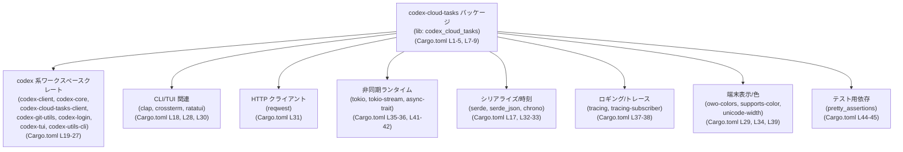
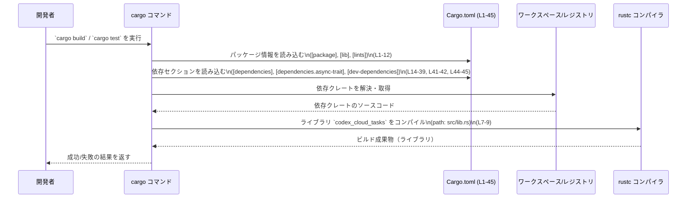

# cloud-tasks/Cargo.toml コード解説

※ 行番号は、このスニペットの先頭行を 1 行目とし、空行やコメントも含めてカウントしています。

---

## 0. ざっくり一言

- `codex-cloud-tasks` パッケージの **ビルド設定と依存関係** を定義する Cargo マニフェストファイルです（`[package]`〜`[dev-dependencies]`、Cargo.toml:L1-45）。
- Rust の関数や構造体などの **実装コードや公開 API は、このファイルには含まれていません**（Cargo.toml:L1-45）。

---

## 1. このモジュールの役割

### 1.1 概要

- このファイルは、`codex-cloud-tasks` パッケージの基本情報（名前・バージョン・エディションなど）をワークスペース共通設定として参照するように定義します（Cargo.toml:L1-5）。
- ライブラリターゲット `codex_cloud_tasks` の存在と、そのエントリポイント `src/lib.rs` を指定します（Cargo.toml:L7-9）。
- 実行時・開発時に利用する多数の依存クレートを宣言し、どの技術スタック（非同期処理、HTTP、TUI など）を使う前提かを示しています（Cargo.toml:L14-39, L41-42, L44-45）。

### 1.2 アーキテクチャ内での位置づけ

このファイルから分かる範囲で、`codex-cloud-tasks` クレートと主な依存関係の配置を示します。



- `codex-cloud-tasks` は **ライブラリクレート** として定義されており（Cargo.toml:L7-9）、他の `codex-*` クレート群と協調する位置づけです（Cargo.toml:L19-27）。
- 非同期処理 (`tokio`, `tokio-stream`, `async-trait`) や HTTP (`reqwest`)、TUI (`ratatui`, `crossterm`, `codex-tui`) などの基盤ライブラリに依存していることから、**非同期・ネットワーク・ターミナル UI を組み合わせた処理を行うライブラリ**である可能性が高いですが、具体的な処理内容はこのチャンクには現れません（Cargo.toml:L18, L26-28, L30-31, L35-36, L41-42）。

### 1.3 設計上のポイント

コードから読み取れる設計上の特徴は、次のとおりです。

- **ワークスペース共通設定の利用**  
  - `edition.workspace = true`、`license.workspace = true`、`version.workspace = true` により、エディション・ライセンス・バージョンはワークスペースのルート設定に委譲されています（Cargo.toml:L2-5）。
  - `lints.workspace = true` により、Lint 設定も共通化されています（Cargo.toml:L11-12）。
- **ライブラリクレートとしての構成**  
  - `[lib]` セクションで `name = "codex_cloud_tasks"`、`path = "src/lib.rs"` が指定されており（Cargo.toml:L7-9）、このクレートは **ライブラリのみ** を提供する構成であることが分かります（バイナリターゲットの定義はこのファイルにはありません）。
- **非同期・エラー処理スタックの採用**  
  - `tokio` と `tokio-stream`、`async-trait` への依存により、非同期処理や非同期トレイトが使われる設計であることが示唆されます（Cargo.toml:L35-36, L41-42）。
  - `anyhow` への依存から、このクレートでエラー集約ライブラリ `anyhow` が利用可能な状態になっています（実際の使用箇所はこのチャンクには現れません）（Cargo.toml:L15）。
- **モッククライアントの扱いに関する TODO**  
  - コメント `# TODO: codex-cloud-tasks-mock-client should be in dev-dependencies.` から、`codex-cloud-tasks-mock-client` を本来は開発用依存に移す意図があることが分かります（Cargo.toml:L21-22）。
  - 現状は通常の `[dependencies]` に含まれているため、**本番ビルドにもモッククライアントがリンクされる可能性がある**点は設計上の注意点です（Cargo.toml:L21-22）。

---

## 2. 主要な機能一覧（このファイルが担う役割）

このファイルは実行時の「機能」ではなく、ビルド設定上の役割を担います。その観点で整理します。

- パッケージメタ情報の定義  
  - パッケージ名 `codex-cloud-tasks` を定義し（Cargo.toml:L4）、バージョン・エディション・ライセンスをワークスペースから継承します（Cargo.toml:L2-5）。
- ライブラリターゲットの定義  
  - `codex_cloud_tasks` というライブラリクレート名と、そのエントリポイント `src/lib.rs` を指定します（Cargo.toml:L7-9）。
- ランタイム依存関係の宣言  
  - `anyhow`, `tokio`, `reqwest`, `ratatui` など、多数のランタイム依存クレートを `[dependencies]` として宣言しています（Cargo.toml:L14-39, L41-42）。
- 開発・テスト用依存の宣言  
  - `[dev-dependencies]` として `pretty_assertions` を追加し、テスト時に利用可能としています（Cargo.toml:L44-45）。

---

## 3. 公開 API と詳細解説

### 3.1 型一覧（構造体・列挙体など）

このファイルには Rust の型定義は含まれていません。そのため、関数・構造体などの **コードレベルの公開 API は、このチャンクからは一切分かりません**（Cargo.toml:L1-45）。

ただし、ライブラリクレートとしてのエントリポイントだけは次のように特定できます。

| 名前                   | 種別           | 役割 / 用途                                                                                     | 根拠                         |
|------------------------|----------------|--------------------------------------------------------------------------------------------------|------------------------------|
| `codex_cloud_tasks`    | ライブラリクレート名 | このクレートを他の Rust コードから `use codex_cloud_tasks::...` の形で参照するためのクレート名 | Cargo.toml:L7                |
| `src/lib.rs`           | ファイルパス   | ライブラリクレート `codex_cloud_tasks` のルートとなる Rust ソースファイル                       | Cargo.toml:L9                |
| （その他の型・関数）   | -              | このファイルには定義されておらず、内容は不明                                                   | Cargo.toml:L1-45            |

### 3.2 関数詳細（最大 7 件）

- **この Cargo.toml 自体には Rust の関数定義が存在しないため、関数詳細テンプレートを適用できる対象はありません**（Cargo.toml:L1-45）。
- 実際の関数やメソッドは `src/lib.rs` などの Rust ソースに定義されていると考えられますが、その内容はこのチャンクには現れません。

### 3.3 その他の関数

- 同上の理由により、補助関数やラッパー関数に関する情報も、このファイルからは分かりません（Cargo.toml:L1-45）。

---

## 4. データフロー

このファイルは実行時の処理フローではなく、**ビルド時に Cargo がどのように情報を読み取るか** に関わります。そのデータフローを示します。

### 4.1 Cargo によるビルド時のフロー



この図から分かるポイント:

- Cargo はまず `[package]` / `[lib]` でパッケージとターゲットを把握します（Cargo.toml:L1-9）。
- 次に、依存関係セクションを読んで、ワークスペースや crates.io から必要なクレートを解決します（Cargo.toml:L14-39, L41-42, L44-45）。
- 最後に、`src/lib.rs`（Cargo.toml:L9）をエントリポイントとして Rust コードをコンパイルします。

---

## 5. 使い方（How to Use）

### 5.1 基本的な使用方法（このクレート側）

このファイルによって、このクレートは **ライブラリとしてビルド可能** になります（Cargo.toml:L7-9）。

別クレートから `codex-cloud-tasks` をローカル依存として利用する最小例は以下のようになります。

```toml
# 他プロジェクトの Cargo.toml 例
[dependencies]
codex-cloud-tasks = { path = "../cloud-tasks" }  # パッケージ名を使用（Cargo.toml:L4）
```

Rust コード側では、クレート名 `codex_cloud_tasks` を用いて参照します（Cargo.toml:L7）。

```rust
// 他プロジェクトの src/main.rs 例
// 明示的な公開 API 名はこのチャンクからは分からないため、ここではクレートのインポートだけを示します。

use codex_cloud_tasks; // クレート名は Cargo.toml の [lib].name に対応（Cargo.toml:L7）

fn main() {
    // 実際にどの関数/型を使えるかは src/lib.rs 側の実装に依存し、
    // このチャンクには現れません。
}
```

### 5.2 よくある使用パターン（推測できる範囲）

具体的な API は不明ですが、依存関係から次のような利用パターンが想定されます（いずれも **実際の API はこのチャンクには現れません**）。

- 非同期処理ベースのライブラリとして `tokio` ランタイム上で使用する（Cargo.toml:L35-36）。
- CLI/TUI アプリケーションから、`clap` や `ratatui` / `crossterm` を通じてこのライブラリを呼び出す（Cargo.toml:L18, L28, L30）。
- HTTP クライアント `reqwest` を通じて何らかのクラウドタスク API とやり取りする処理を内部に持つ可能性がある（Cargo.toml:L31）。

ただし、これらは **依存クレートの一般的な用途に基づく推測** であり、`src/lib.rs` の実装がこのチャンクには現れないため、確定的なことは言えません。

### 5.3 よくある間違い（Cargo.toml 観点）

このファイルを変更・利用する際に起こりうる誤りと、その修正例を示します。

```toml
# 誤り例: モッククライアントを本番依存に残したままにする
[dependencies]
codex-cloud-tasks-mock-client = { workspace = true }  # TODO コメントあり（Cargo.toml:L21-22）

# 望ましい例: モッククライアントを開発依存に移動する
[dev-dependencies]
codex-cloud-tasks-mock-client = { workspace = true }  # 本番ビルドから切り離す
```

- コメントで「dev-dependencies にあるべき」と明記されているにもかかわらず（Cargo.toml:L21）、通常の `[dependencies]` のままでは、本番バイナリにもモックがリンクされる可能性があります（Cargo.toml:L22）。

```toml
# 誤り例: lib.name を変更したのにコード側を修正しない
[lib]
name = "codex_cloud_tasks_v2"   # 例: 名前を変更 (Cargo.toml:L7)

# 正しい運用: コード側のクレート名も合わせて変更
use codex_cloud_tasks_v2;       # 新しいクレート名を使用する
```

- `[lib].name` を変更すると、Rust コードからの参照名も変わるため、依存側の `use` 文や `Cargo.toml` の指定も合わせて修正する必要があります（Cargo.toml:L7）。

### 5.4 使用上の注意点（まとめ）

- **公開 API 不明**  
  - このファイルだけでは、どの関数・型が公開されているかは分かりません。実際の利用には `src/lib.rs` など実装ファイルの確認が必要です（Cargo.toml:L9）。
- **モック依存の扱い**  
  - `codex-cloud-tasks-mock-client` が通常依存に入っている点は、コメントにあるように見直しの余地があります（Cargo.toml:L21-22）。本番でモックを排除したい場合は、開発依存への移動が必要です。
- **非同期・エラー処理スタック**  
  - `tokio`, `tokio-stream`, `async-trait`, `anyhow` などが依存に含まれるため（Cargo.toml:L15, L35-36, L41-42）、このクレートを利用するアプリケーション側も非同期ランタイムの初期化やエラー伝播方針との整合を取る必要がある可能性があります。ただし具体的な契約はこのチャンクには現れません。

---

## 6. 変更の仕方（How to Modify）

### 6.1 新しい機能を追加する場合（Cargo.toml 観点）

新しい機能を追加し、それに伴って依存クレートを増やす場合の基本手順です。

1. **必要な依存クレートの追加**  
   - ランタイムで利用するクレートなら `[dependencies]` に、テスト専用なら `[dev-dependencies]` に追加します（Cargo.toml:L14-39, L44-45）。
2. **ワークスペースとの整合性確認**  
   - すでにワークスペース共通依存として定義されている場合は、`{ workspace = true }` で参照する形に合わせます（既存依存の例: Cargo.toml:L15-39）。
3. **`src/lib.rs` 側での API 追加**  
   - 実際の機能実装や公開 API の追加は `src/lib.rs` やその配下モジュールで行います（パスのみ Cargo.toml:L9 に記載、内容はこのチャンクには現れません）。

### 6.2 既存の機能を変更する場合（契約・注意点）

この Cargo.toml を変更する際の注意点をまとめます。

- **クレート名の変更**  
  - `[lib].name` を変更すると、依存側からの参照名も変わるため、同じワークスペース内の他クレートの `Cargo.toml` や `use` 文も合わせて修正する必要があります（Cargo.toml:L7）。
- **依存クレートの削除・バージョン変更**  
  - `[dependencies]` からクレートを削除またはバージョン変更すると、そのクレートを利用しているコードがコンパイルエラーになる可能性があります（Cargo.toml:L14-39, L41-42）。削除前に `src/lib.rs` 側の使用箇所を確認する必要があります（このチャンクには現れません）。
- **モッククライアントの移動（潜在的なバグ/セキュリティ観点）**  
  - 現状、モッククライアントが本番依存に入っていることは、誤った設定が原因で本番にモックが混入するリスクとなり得ます（Cargo.toml:L21-22）。
  - セキュリティ上、本番環境に不要な依存を含めない方が望ましいケースが多いため、開発依存への移動が検討されています（コメントより）。

---

## 7. 関連ファイル

この Cargo.toml から参照されている、密接に関係するファイルやクレートを整理します。

| パス / クレート名                    | 役割 / 関係                                                                                             | 根拠                             |
|--------------------------------------|----------------------------------------------------------------------------------------------------------|----------------------------------|
| `src/lib.rs`                         | ライブラリクレート `codex_cloud_tasks` のルートファイル。実際の公開 API やコアロジックはここに定義されると考えられますが、内容はこのチャンクには現れません。 | Cargo.toml:L7-9                 |
| `codex-client`                       | 同一ワークスペース内の依存クレート。`codex-cloud-tasks` から呼び出されるクライアント機能を提供する可能性がありますが、詳細は不明です。 | Cargo.toml:L19                  |
| `codex-cloud-tasks-client`           | 同上。クラウドタスク関連のクライアント機能を提供すると推測されますが、実装はこのチャンクには現れません。                          | Cargo.toml:L20                  |
| `codex-cloud-tasks-mock-client`      | モック用クライアントと思われる依存クレート。コメントより、本来は開発依存として扱う意図があります。                               | Cargo.toml:L21-22               |
| `codex-core`                         | コア機能を提供するワークスペース内クレート。`codex-cloud-tasks` から再利用される可能性がありますが、詳細は不明です。             | Cargo.toml:L23                  |
| `codex-git-utils`                    | Git 関連ユーティリティを提供すると思われるクレート。実際の API はこのチャンクには現れません。                                     | Cargo.toml:L24                  |
| `../login` (`codex-login` クレート) | ログイン関連機能を提供するローカルクレート。パスが相対指定されており、同リポジトリ内の別パッケージであることが分かります。       | Cargo.toml:L25                  |
| `codex-tui`                          | TUI 関連の共通機能を提供するクレートと推測されますが、詳細は不明です。                                                               | Cargo.toml:L26                  |
| `pretty_assertions`                  | 開発・テスト用依存。テストにおいて、標準のアサーションより分かりやすい差分表示を行うライブラリとして一般に知られています。       | Cargo.toml:L44-45               |

> 注: 上記の「〜と推測されます」は、クレート名や一般的なライブラリの用途に基づく説明であり、**このチャンク内のコードだけでは実装内容を断定できません**。

---

### このチャンクから分からないこと

最後に、この Cargo.toml **だけでは分からない点** を明示しておきます。

- `src/lib.rs` 内のモジュール構成・関数・構造体・公開 API の具体的な内容（Cargo.toml:L9 にパスのみ記載）。
- エラー処理方針（`anyhow` の具体的な使用方法など）、並行性制御（`tokio` のどの機能をどう使っているか）といった **言語固有の詳細な安全性・エラー・並行性の扱い**。
- クラウドタスクへのリクエスト/レスポンスのデータモデルや、実際のデータフロー（HTTP 経路・キュー処理など）。

これらを把握するには、`src/lib.rs` などの Rust ソースコードを追加で確認する必要があります。
