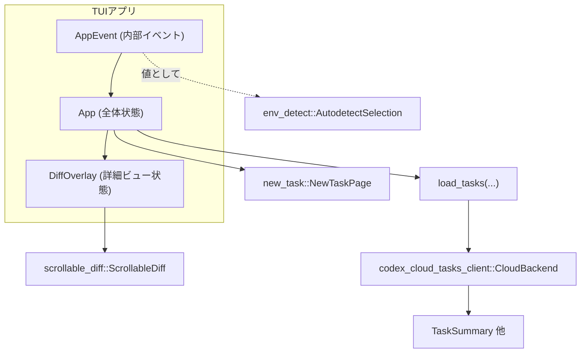
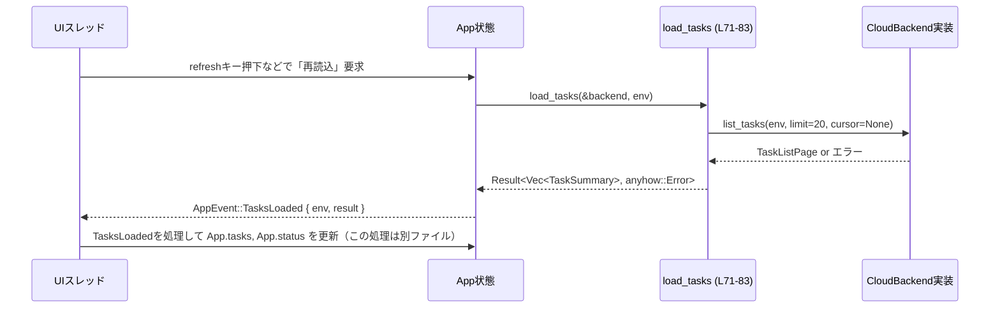

# cloud-tasks/src/app.rs コード解説

> 行番号について: 元コード断片には行番号が含まれていないため、ここではテキスト先頭を1行目とみなした**概算**行番号を `cloud-tasks/src/app.rs:~L開始-終了` 形式で示します。数行のずれがあり得ます。

---

## 0. ざっくり一言

このファイルは、Cloud Tasks TUI の「アプリケーション状態」と「詳細ビュー（差分オーバーレイ）」、およびバックグラウンド処理から UI へ送られる内部イベント `AppEvent` を定義する中核モジュールです。また、バックエンドからタスク一覧を非同期に取得する `load_tasks` 関数を提供します。

---

## 1. このモジュールの役割

### 1.1 概要

- このモジュールは **ターミナル UI 全体の状態管理** と **タスク詳細表示のロジック** を担います。
- Cloud Backend（`CloudBackend` トレイト）とのやりとりのうち、タスク一覧取得部分を `load_tasks` としてカプセル化します。
- バックグラウンドで実行される各種処理から、UI イベントループに送られる **内部イベント型 `AppEvent`** を定義します。

### 1.2 アーキテクチャ内での位置づけ

このファイルで定義される主なコンポーネントと、他モジュールとの関係を簡略化した図です。



- `App` は TUI の中心的な状態コンテナであり、タスク一覧、選択状態、各種モーダルの状態、スピナーの状態などを保持します（`App` 定義: `~L32-69`）。
- `DiffOverlay` は、選択されたタスクの差分やテキスト出力を表示するための詳細ビュー状態です（`~L84-111`）。
- `AppEvent` は、バックグラウンドタスク（タスク一覧ロード、詳細ロード、新規タスク作成、適用処理など）から UI スレッドに結果を伝えるためのイベント型です（`~L187-236`）。
- `load_tasks` は `CloudBackend` を通じてタスク一覧を取得する非同期関数で、5秒のタイムアウトやレビュー専用タスクのフィルタを行います（`~L71-83`）。

### 1.3 設計上のポイント

- **状態集中管理**  
  - `App` に UI 全体の状態を集約し、外部からは `App` とイベント `AppEvent` を介して操作する構造になっています。
- **非同期処理と UI 応答性**  
  - タスク取得は `async fn load_tasks` として切り出されており、`tokio::time::timeout` により長時間ブロックを防いでいます（`~L71-78`）。
  - バックグラウンド処理結果は `AppEvent` を通じて UI に渡されるため、UI イベントループはブロックされにくい設計です（コメント: `~L179-186`）。
- **ビュー状態とデータの分離**  
  - 差分やテキストの生データは `AttemptView` に保持し、実際に画面に表示する内容は `DiffOverlay.sd` (`ScrollableDiff`) に転写する形になっています（`apply_selection_to_fields`: `~L141-176`）。
- **エッジケースに配慮したインデックス操作**  
  - `App::next` / `prev` では空リストチェックや `saturating_sub` を使用し、インデックスの範囲外アクセスを防いでいます（`~L48-61`）。
  - `DiffOverlay::step_attempt` では負数を含む移動量を安全にラップアラウンドするためにモジュロ演算を工夫しています（`~L124-139`）。
- **安全性**  
  - 本ファイルには `unsafe` ブロックは存在せず、すべて安全な Rust 構文で書かれています。
  - エラー処理には `anyhow::Result` と `?` 演算子を用いて、呼び出し元へ明示的に伝播しています（`load_tasks`: `~L71-83`）。

---

## 2. 主要な機能一覧

- タスク一覧状態管理: `App` 構造体によるタスク一覧と選択インデックスの保持。
- 環境フィルタ・モーダル状態管理: `EnvironmentRow`, `EnvModalState`, `BestOfModalState`, `ApplyModalState` など。
- 差分/テキスト詳細ビュー管理: `DiffOverlay` と `AttemptView` による試行ごとの差分・テキスト・プロンプトの表示制御。
- タスク一覧取得: 非同期関数 `load_tasks` による `CloudBackend::list_tasks` 呼び出しと結果フィルタリング。
- 内部イベントモデリング: `AppEvent` によるタスクロード・詳細ロード・試行読み込み・新規タスク作成・適用処理などの結果伝達。
- テスト用フェイクバックエンド: `FakeBackend` による `load_tasks` の振る舞い検証（`tests` モジュール）。

---

## 3. 公開 API と詳細解説

### 3.1 型一覧（構造体・列挙体など）

主要な公開型の一覧です。

| 名前 | 種別 | 役割 / 用途 | 根拠 |
|------|------|-------------|------|
| `EnvironmentRow` | 構造体 | 環境一覧で1行分の情報（id, ラベル, ピン留め状態, リポジトリヒント）を表します。 | `cloud-tasks/src/app.rs:~L6-12` |
| `EnvModalState` | 構造体 | 環境選択モーダルの検索クエリと選択インデックスを保持します。 | `~L14-18` |
| `BestOfModalState` | 構造体 | 「Best-of」設定モーダルの選択インデックス状態。 | `~L20-24` |
| `ApplyResultLevel` | 列挙体 | 適用結果のレベル（成功/部分成功/エラー）を表します。 | `~L26-32` |
| `ApplyModalState` | 構造体 | Apply モーダルでの対象タスク、メッセージ、スキップ/コンフリクトパスなどの状態。 | `~L34-44` |
| `App` | 構造体 | TUI 全体の状態：タスク一覧、選択、モーダル、スピナー、環境情報、新規タスクページ等。 | `~L32-69` |
| `DiffOverlay` | 構造体 | 詳細ビュー用のオーバーレイ状態。選択タスクの diff / text / prompt と試行一覧、ビュー種別を管理。 | `~L84-111` |
| `AttemptView` | 構造体 | 1 回の試行（Attempt）の表示用データ（turn_id, status, diff_lines, text_lines, prompt, diff_raw 等）。 | `~L113-122` |
| `DetailView` | 列挙体 | 詳細ビューの表示モード（Diff または Prompt）を表します。 | `~L178-182` |
| `AppEvent` | 列挙体 | バックグラウンド処理の完了を UI 側へ伝える内部イベント。各種ロード・適用・新規タスク処理の結果を保持。 | `~L187-236` |
| `FakeBackend` | 構造体（tests） | テスト用の `CloudBackend` 実装。環境ごとに異なるタスク一覧を返す。 | `~L243-252` |

### 3.2 関数詳細（重要なもの）

#### `App::new() -> App`

**概要**

`App` の初期状態を構築します。タスク一覧は空、選択は 0、初期ステータスメッセージや各種フラグ・モーダル・キャッシュ状態を設定します（`~L71-91`）。

**引数**

- なし。

**戻り値**

- `App`: 初期化されたアプリ状態。

**内部処理の流れ**

1. `tasks` を空の `Vec<TaskSummary>` として初期化。
2. `selected` を 0、`status` を `"Press r to refresh"` に設定。
3. 各種オプションフィールド（`diff_overlay`, `env_filter`, `env_modal`, `apply_modal`, `best_of_modal`, `new_task` 等）を `None` に設定。
4. 環境リストやフラグ類（`env_loading`, `apply_preflight_inflight`, `apply_inflight`）を初期値に設定。
5. `list_generation` を 0、`in_flight` を空の `HashSet` として初期化。

**Examples（使用例）**

```rust
use cloud_tasks::app::App;

fn main() {
    // アプリケーション状態の初期化
    let mut app = App::new(); // 初期メッセージ: "Press r to refresh"

    // 状態を書き換える前提として、イベントループなどに渡す
    // run_app(app);
}
```

**Errors / Panics**

- エラーや `panic!` を発生させる要素はありません（フィールドはすべて安全なデフォルト値）。

**Edge cases**

- 特になし。すべてのフィールドが明示的に初期化されています。

**使用上の注意点**

- `App` のフィールドは公開されていますが、外部コードから直接フィールドを書き換えると整合性が崩れる可能性があります。可能であれば、将来的にはメソッドを介した更新パターンに統一すると読みやすくなります（この点はコードからは方針不明です）。

---

#### `App::next(&mut self)`

**概要**

タスク一覧の選択インデックスを 1 つ下へ移動します。末尾を超えないようにクランプされます（`~L93-100`）。

**引数**

| 引数名 | 型 | 説明 |
|--------|----|------|
| `&mut self` | `&mut App` | アプリケーション状態の可変参照。 |

**戻り値**

- なし。

**内部処理の流れ**

1. `self.tasks` が空なら何もせず `return`（`~L94-96`）。
2. `self.selected + 1` を計算。
3. `self.tasks.len().saturating_sub(1)`（最大インデックス）と `min` を取ることで、末尾を超えないようにクランプ（`~L97-99`）。

**Examples**

```rust
let mut app = App::new();
app.tasks = vec![task1, task2, task3];
app.selected = 1;
app.next(); // selected は 2 になる
app.next(); // selected は 2 のまま（末尾でクランプ）
```

**Errors / Panics**

- `tasks` が空の場合は早期 return しており、インデックスアクセスはありません。
- `saturating_sub` を使用しているため、`len == 0` の場合でもアンダーフローは発生しません。

**Edge cases**

- タスクが 0 件: 何も変更されません。
- タスクが 1 件: `selected` は常に 0 のままです。
- すでに末尾を指している場合: `selected` は変わりません。

**使用上の注意点**

- `selected` は **インデックス** であり、`tasks` の長さに依存するため、`tasks` の更新時には整合性に注意が必要です（このファイル内では `selected` の補正ロジックは定義されていません）。

---

#### `App::prev(&mut self)`

**概要**

タスク一覧の選択インデックスを 1 つ上へ移動します。0 を下回らないよう制御しています（`~L101-109`）。

**内部処理の流れ**

1. `self.tasks` が空なら何もしない（`~L102-104`）。
2. `self.selected > 0` の場合のみ、`self.selected -= 1` を実行（`~L105-108`）。

**Edge cases**

- 先頭（`selected == 0`）の場合は変化しません。
- タスク 0 件の場合は変化しません。

---

#### `pub async fn load_tasks(backend: &dyn CloudBackend, env: Option<&str>) -> anyhow::Result<Vec<TaskSummary>>`

**概要**

Cloud Backend からタスク一覧を取得し、レビュー専用タスク（`is_review == true`）を除外して返します。処理全体に 5 秒のタイムアウトを設けています（`~L71-83`）。

**引数**

| 引数名 | 型 | 説明 |
|--------|----|------|
| `backend` | `&dyn CloudBackend` | タスク一覧を取得するためのバックエンド実装。`CloudBackend` トレイトオブジェクト。 |
| `env` | `Option<&str>` | 対象の環境 ID。`None` の場合はデフォルト環境。 |

**戻り値**

- `anyhow::Result<Vec<TaskSummary>>`  
  - `Ok(Vec<TaskSummary>)`: レビュー専用タスクを除いたタスク一覧。
  - `Err(anyhow::Error)`: タイムアウト、バックエンドエラーなど。

**内部処理の流れ**

1. `tokio::time::timeout(Duration::from_secs(5), backend.list_tasks(env, Some(20), None))` を呼び出し、結果の `Future` に 5 秒のタイムアウトをかけます（`~L73-78`）。
2. `.await??` で 2 段階の `Result` を `?` 展開します。
   - 1 回目の `?`: タイムアウト (`Elapsed`) を `anyhow::Error` に変換し伝播。
   - 2 回目の `?`: `CloudBackend::Result` 内のエラー（`CloudTaskError` など）を `anyhow::Error` に変換し伝播。
3. 取得した `TaskListPage` から `.tasks` フィールドを取り出し、`Iterator::filter` で `!t.is_review` のものだけを収集（`~L79-82`）。
4. フィルタ済み `Vec<TaskSummary>` を `Ok` で返します。

**Examples（使用例）**

```rust
use codex_cloud_tasks_client::CloudBackend;
use cloud_tasks::app::load_tasks;

async fn refresh_tasks(backend: &dyn CloudBackend, env: Option<&str>) -> anyhow::Result<()> {
    let tasks = load_tasks(backend, env).await?; // タイムアウトやバックエンドエラーは anyhow::Error として伝播
    println!("loaded {} tasks", tasks.len());
    Ok(())
}
```

**Errors / Panics**

- **タイムアウト**  
  - 5 秒以内に `backend.list_tasks` が完了しない場合、`tokio::time::timeout` が `Err(Elapsed)` を返し、それが `anyhow::Error` として呼び出し元に伝播します。
- **バックエンドエラー**  
  - `CloudBackend::list_tasks` の戻り値が `Err(e)` の場合、そのエラーも `?` によって `anyhow::Error` として伝播されます。
- `panic!` の可能性はこの関数内にはありません。

**Edge cases**

- バックエンドが空のタスクリストを返した場合: 空の `Vec` が返ります。
- 20 件以上のタスクが存在する場合: `Some(20)` を指定しているため、**最大 20 件** までしか取得されないことに注意が必要です。
- `env == None` の場合: デフォルト環境のタスク一覧が取得されます（具体的な挙動は `CloudBackend` 実装に依存します）。

**使用上の注意点**

- `load_tasks` 自体は UI 状態を変更しません。呼び出し側で `App.tasks` に代入するなどして適用する必要があります。
- 非同期関数のため、`tokio` などの非同期ランタイム上で `.await` する必要があります。
- 同時に複数の `load_tasks` を走らせることは技術的には可能ですが、UI 側で `refresh_inflight` などのフラグ管理を行う必要があります（`App` フィールド参照: `~L39-68`）。

---

#### `DiffOverlay::new(task_id: TaskId, title: String, attempt_total_hint: Option<usize>) -> DiffOverlay`

**概要**

指定されたタスク ID とタイトルを持つ新しい `DiffOverlay` を構築します。`ScrollableDiff` の内容は空、試行情報も 1 つのデフォルト試行を持つ状態で初期化されます（`~L84-99`）。

**引数**

| 引数名 | 型 | 説明 |
|--------|----|------|
| `task_id` | `TaskId` | 対象タスクの ID。 |
| `title` | `String` | 対象タスクのタイトル。 |
| `attempt_total_hint` | `Option<usize>` | 試行数のヒント（`Some(n)` なら n 回の試行が期待される）。 |

**戻り値**

- `DiffOverlay`: 初期化された詳細ビュー状態。

**内部処理の流れ**

1. `ScrollableDiff::new()` でスクロール可能な表示用ウィジェットを初期化し、`set_content(Vec::new())` で中身を空にします（`~L86-88`）。
2. フィールドを以下の値で初期化:
   - `base_can_apply = false`
   - `diff_lines`, `text_lines` = 空 `Vec`
   - `prompt = None`
   - `attempts = vec![AttemptView::default()]`
   - `selected_attempt = 0`
   - `current_view = DetailView::Prompt`
   - `base_turn_id = None`, `sibling_turn_ids = Vec::new()`
   - `attempt_total_hint` = 引数の値。

**使用上の注意点**

- 新規作成直後は、実際の diff やテキストは `AttemptView` にまだロードされていない状態です。別途 `AttemptsLoaded` / `DetailsMessagesLoaded` などのイベント処理側で `AttemptView` を更新する必要があります（イベント処理コードはこのチャンクには現れません）。

---

#### `DiffOverlay::step_attempt(&mut self, delta: isize) -> bool`

**概要**

現在選択中の試行インデックス `selected_attempt` を、`delta` だけ進めたり戻したりします。試行数が 0 または 1 なら何もせず false を返します（`~L124-139`）。

**引数**

| 引数名 | 型 | 説明 |
|--------|----|------|
| `&mut self` | `&mut DiffOverlay` | オーバーレイ状態への可変参照。 |
| `delta` | `isize` | 移動量。正数で次の試行へ、負数で前の試行へ。 |

**戻り値**

- `bool`:  
  - `true`: 選択試行が変更された。  
  - `false`: 試行数が 0 または 1 で、変更が行われなかった。

**内部処理の流れ**

1. `total = self.attempts.len()` を取得し、`total <= 1` なら `false` を返して終了（`~L125-129`）。
2. `current` を `self.selected_attempt` として取得し、`current + delta` で新しいインデックス候補 `next` を計算（`~L130-132`）。
3. `((next % total_isize) + total_isize) % total_isize` という式で負数や範囲外を補正し、`0..total-1` にラップアラウンド（`~L130-134`）。
4. `self.selected_attempt = next as usize` に更新。
5. `self.apply_selection_to_fields()` を呼び出し、`ScrollableDiff` に新しい試行内容を反映（`~L135-138`）。
6. `true` を返す。

**Examples**

```rust
let mut overlay = DiffOverlay::new(task_id, "title".to_string(), Some(3));
overlay.attempts = vec![
    AttemptView::default(),
    AttemptView::default(),
    AttemptView::default(),
];

overlay.selected_attempt = 0;
overlay.step_attempt(1);  // selected_attempt = 1
overlay.step_attempt(2);  // selected_attempt = 0 (ラップアラウンド)
overlay.step_attempt(-1); // selected_attempt = 2 (負方向のラップ)
```

**Errors / Panics**

- `attempts.len()` が 0 の場合でも、早期 return により `0` での剰余演算は行われません。
- 配列アクセスは `self.attempts.get` などに委ねられているため、範囲外インデックスによる `panic!` は起こりません（`apply_selection_to_fields` 内部参照）。

**Edge cases**

- `attempts.len() == 0` または `1`: 選択は変わらず `false` を返します。
- `delta` が `total` より大きい、または非常に大きい値でも、モジュロ演算により `0..total-1` に正規化されます。
- `delta` が負数でも、`((next % total) + total) % total` パターンにより安全にラップアラウンドします。

**使用上の注意点**

- 試行リストが更新された（例: `AttemptsLoaded` イベントで追加）場合には、`selected_attempt` の整合性に注意する必要があります。`step_attempt` はその前提をチェックしません。

---

#### `DiffOverlay::apply_selection_to_fields(&mut self)`

**概要**

現在選択されている試行 (`current_attempt`) と表示モード (`current_view`) に基づき、`diff_lines`, `text_lines`, `prompt` フィールドおよび `ScrollableDiff` の内容を更新します（`~L141-176`）。

**内部処理の流れ**

1. `self.current_attempt()` で `Option<&AttemptView>` を取得（`~L141-145`）。
2. `Some(attempt)` の場合:
   - `diff_lines`, `text_lines`, `prompt` をクローンしてローカル変数に保持。
3. `None` の場合:
   - `self.diff_lines.clear()`, `self.text_lines.clear()`, `self.prompt = None`。
   - `self.sd.set_content(vec!["<loading attempt>".to_string()])` でローディングメッセージを表示し、早期 return（`~L146-152`）。
4. `self.diff_lines`, `self.text_lines`, `self.prompt` を上記のローカル変数で置き換え（`~L154-158`）。
5. `match self.current_view` でビュー種別によって `ScrollableDiff` の内容を設定:
   - `DetailView::Diff`:
     - `diff_lines` が空なら `"<no diff available>"` を表示、それ以外は `diff_lines` 自体を設定（`~L160-167`）。
   - `DetailView::Prompt`:
     - `text_lines` が空なら `"<no output>"` を表示、それ以外は `text_lines` を設定（`~L168-176`）。

**Examples**

```rust
let mut overlay = DiffOverlay::new(task_id, "title".into(), None);
overlay.attempts[0].diff_lines = vec!["+ changed".into()];
overlay.attempts[0].text_lines = vec!["some output".into()];
overlay.current_view = DetailView::Diff;
overlay.apply_selection_to_fields();
// この時点で overlay.sd には diff_lines が表示されている
```

**Errors / Panics**

- `current_attempt()` は `.get` による安全な参照取得を行うため、範囲外アクセスによる `panic` はありません。
- `ScrollableDiff::set_content` の実装はこのチャンクには現れませんが、ここで渡しているのは `Vec<String>` のみです。

**Edge cases**

- 試行がまだロードされていない場合（`attempts` が空、あるいは `selected_attempt` が範囲外）: `<loading attempt>` が表示されます。
- diff が空: `<no diff available>` が表示されます。
- テキスト出力が空: `<no output>` が表示されます。

**使用上の注意点**

- `set_view` からも常にこのメソッドが呼ばれるため、ビュー切り替えと試行切り替えの両方で `apply_selection_to_fields` を通す設計になっています。
- `AttemptView` 側の `diff_lines` / `text_lines` / `prompt` を更新した後は、このメソッドを呼び直す必要があります。

---

### 3.3 その他の関数・メソッド

補助的な公開メソッドやシンプルなラッパーです。

| 関数名 / メソッド名 | 所属 | 役割（1 行） | 根拠 |
|---------------------|------|--------------|------|
| `AttemptView::has_diff(&self) -> bool` | `AttemptView` | `diff_lines` が空でないかどうかを返します。 | `~L124-126` |
| `AttemptView::has_text(&self) -> bool` | `AttemptView` | `text_lines` か `prompt` のいずれかが存在するかを返します。 | `~L128-132` |
| `DiffOverlay::current_attempt(&self) -> Option<&AttemptView>` | `DiffOverlay` | 現在選択中インデックスの試行を安全に取得します。 | `~L101-103` |
| `DiffOverlay::base_attempt_mut(&mut self) -> &mut AttemptView` | `DiffOverlay` | `attempts[0]` への可変参照を返し、存在しなければデフォルトを挿入します。 | `~L105-111` |
| `DiffOverlay::set_view(&mut self, view: DetailView)` | `DiffOverlay` | 表示モードを変更し、`apply_selection_to_fields` で表示内容を更新します。 | `~L113-118` |
| `DiffOverlay::expected_attempts(&self) -> Option<usize>` | `DiffOverlay` | `attempt_total_hint` か、`attempts.len()` を元に「期待される試行数」を返します。 | `~L120-126` |
| `DiffOverlay::attempt_count(&self) -> usize` | `DiffOverlay` | 実際の `attempts.len()` を返します。 | `~L128-130` |
| `DiffOverlay::attempt_display_total(&self) -> usize` | `DiffOverlay` | 期待数があればそれを、なければ `attempts.len().max(1)` を返します。UI 表示用。 | `~L132-138` |
| `DiffOverlay::current_can_apply(&self) -> bool` | `DiffOverlay` | 現在のビューが `Diff` で、`diff_raw` が空でない場合にのみ `true` を返します。 | `~L139-149` |

---

## 4. データフロー

ここでは、代表的なシナリオとして「タスク一覧をロードして UI に反映する」流れを整理します。

### 4.1 タスク一覧ロードの流れ

- 他モジュール（UI イベントループなど）が `load_tasks` を呼び出し、`CloudBackend` からタスク一覧を取得します。
- `load_tasks` は 5 秒以内に `CloudBackend::list_tasks` が完了しない場合はエラーを返します。
- 呼び出し側は結果を `AppEvent::TasksLoaded` としてラップし、UI イベントループへ渡す想定です（イベント送信コードはこのチャンクには現れません）。



> 注: 最後の `AppEvent::TasksLoaded` 処理ロジックはこのファイルには存在しません。イベント型定義と `load_tasks` のシグネチャから推測される典型的な流れです。

---

## 5. 使い方（How to Use）

### 5.1 基本的な使用方法

最小限のコード例として、`App` を初期化し、バックエンドからタスクをロードして状態に反映するパターンです。

```rust
use codex_cloud_tasks_client::{CloudBackend, TaskSummary};
use cloud_tasks::app::{App, load_tasks};

async fn run<B: CloudBackend + ?Sized>(backend: &B) -> anyhow::Result<()> {
    // App状態の初期化
    let mut app = App::new(); // app.status = "Press r to refresh"

    // タスク一覧をロード
    let tasks: Vec<TaskSummary> = load_tasks(backend, None).await?;
    app.tasks = tasks;
    app.selected = 0;

    // UIループなどに app を渡してレンダリング
    // run_tui(app).await?;

    Ok(())
}
```

### 5.2 DiffOverlay の典型的な使用パターン

`DiffOverlay` を使って、特定タスクの diff を表示する流れの概略です。

```rust
use cloud_tasks::app::{DiffOverlay, AttemptView, DetailView};
use codex_cloud_tasks_client::TaskId;

fn show_diff_example(task_id: TaskId) {
    let mut overlay = DiffOverlay::new(task_id, "Example task".to_string(), Some(1));

    // ベースとなる試行の内容を埋める
    {
        let base = overlay.base_attempt_mut();
        base.diff_lines = vec!["+ changed line".to_string()];
        base.text_lines = vec!["model output".to_string()];
        base.prompt = Some("Original prompt".to_string());
        base.diff_raw = Some("---\n+ changed line".to_string());
    }

    // Diffビューを有効にし、表示内容を反映
    overlay.set_view(DetailView::Diff);

    // overlay.current_can_apply() == true なら「Apply」アクションを有効にできる
    if overlay.current_can_apply() {
        // applyボタンの有効化など
    }
}
```

### 5.3 よくある間違い

```rust
// 間違い例: 試行データを更新したが、表示内容を更新していない
let mut overlay = DiffOverlay::new(task_id, title, None);
overlay.base_attempt_mut().diff_lines = vec!["+ change".into()];
// ここで overlay.sd の内容はまだ旧状態のまま

// 正しい例: データ更新後に apply_selection_to_fields を呼ぶ
let mut overlay = DiffOverlay::new(task_id, title, None);
{
    let base = overlay.base_attempt_mut();
    base.diff_lines = vec!["+ change".into()];
}
overlay.apply_selection_to_fields(); // ScrollableDiff に反映
```

```rust
// 間違い例: load_tasks を同期コンテキストで直接呼ぶ
// let tasks = load_tasks(&backend, None); // コンパイルエラー: async fn の結果は Future

// 正しい例: asyncコンテキストで .await する
#[tokio::main]
async fn main() -> anyhow::Result<()> {
    let backend = make_backend();
    let tasks = load_tasks(&backend, None).await?;
    println!("{} tasks", tasks.len());
    Ok(())
}
```

### 5.4 使用上の注意点（まとめ）

- **非同期処理**
  - `load_tasks` は `async fn` であるため、必ず非同期ランタイム上で `.await` する必要があります。
- **タイムアウト**
  - 5 秒のタイムアウトがハードコードされているため、ネットワークの遅い環境ではタイムアウトが頻発する可能性があります。
- **インデックス管理**
  - `App.selected` や `DiffOverlay.selected_attempt` はいずれも `usize` インデックスです。`tasks` / `attempts` の更新時に範囲外にならないように注意する必要があります。
- **Apply 操作のガード**
  - `DiffOverlay::current_can_apply` は現在ビューが `Diff` かつ `diff_raw` が非空の場合のみ `true` になります。UI から apply アクションを呼ぶ前にこの条件をチェックすることで、誤操作を防止できます。

---

## 6. 変更の仕方（How to Modify）

### 6.1 新しい機能を追加する場合

例: `AppEvent` に新しいバックグラウンド処理の結果イベントを追加する場合。

1. **イベント型の追加**
   - `AppEvent` 列挙体に新しいバリアントを追加します（`~L187-236`）。
2. **背景処理の追加**
   - 該当するバックグラウンドタスクから、新バリアントを生成して UI 側へ送信する処理を追加します（この処理は別ファイル側）。
3. **UI 側のハンドリング**
   - UI イベントループで `AppEvent` の `match` を拡張し、新バリアントを処理して `App` の状態を更新します。

### 6.2 既存の機能を変更する場合

例: `load_tasks` のタイムアウト時間を変更する場合。

- 変更箇所:
  - `Duration::from_secs(5)` を別の値に変更する（`~L73`）。
- 影響範囲:
  - タイムアウト挙動を前提としている（もしあれば）呼び出し側のロジック（リトライやエラーメッセージなど）。
- 注意点:
  - `limit` を変えたい場合は `Some(20)` を変更することになりますが、UI 側がページングや件数表示をどう扱っているかを確認する必要があります。

例: Diff のプレースホルダ表示文言を変更する場合。

- 変更箇所:
  - `"<no diff available>"`, `"<no output>"`, `"<loading attempt>"` の文字列（`~L146-152`, `~L160-176`）。
- 影響範囲:
  - TUI のユーザー体験とテスト（もし文字列に依存したテストがあれば）。

---

## 7. 関連ファイル

このモジュールと密接に関係すると思われるファイル・モジュールです（このチャンクに現れる `use` や型参照に基づきます）。

| パス / モジュール | 役割 / 関係 |
|-------------------|------------|
| `crate::scrollable_diff` | `ScrollableDiff` 型を定義。`DiffOverlay` が詳細ビュー内容の表示に利用します（`~L46, 84-88`）。 |
| `codex_cloud_tasks_client` | `CloudBackend`, `TaskId`, `TaskSummary`, `TaskListPage`, `AttemptStatus`, `TurnAttempt`, `ApplyOutcome`, `CreatedTask`, `CloudTaskError` などのバックエンド関連型を定義。`load_tasks` や `AppEvent`、テストの `FakeBackend` で使用されます。 |
| `crate::new_task::NewTaskPage` | 新規タスク作成画面の状態を定義。`App.new_task` フィールドとして保持されます（`~L54-60`）。 |
| `crate::env_detect::AutodetectSelection` | 環境自動検出の結果型。`AppEvent::EnvironmentAutodetected` で使用されます（`~L194-200`）。 |

---

## テストと契約・エッジケース補足

### テスト: `load_tasks_uses_env_parameter`

- 定義: `tests` モジュール内（`~L241-309`）。
- `FakeBackend` に `by_env: HashMap<Option<String>, Vec<&'static str>>` を持たせ、`env` に応じて異なるタイトルのタスク一覧を返す実装になっています。
- `load_tasks` を `None`, `"env-A"`, `"env-B"` で呼び、それぞれ期待通りの件数とタイトルが返ることを検証しています（`~L311-330`）。
- このテストにより、**`load_tasks` が `env` 引数を正しくバックエンドへ渡していること** が確認できます。

### 契約・エッジケースのまとめ

- `load_tasks` の契約:
  - `env` はそのまま `CloudBackend::list_tasks` に渡される。
  - `limit` は常に `Some(20)`。
  - `is_review == true` のタスクは結果から除外される。
- `App` の選択インデックス:
  - `next` / `prev` は `tasks.is_empty()` の場合は no-op。
  - 範囲外アクセスを避けるガードが入っている。
- `DiffOverlay`:
  - `step_attempt` は 0/1 試行の場合は `false` を返す。
  - 表示内容は `current_view` と `current_attempt` によって完全に決まる。
  - diff/テキストが空のときは意味のあるプレースホルダを表示する。

### セキュリティ・パフォーマンス観点（本ファイルに現れる範囲）

- セキュリティ:
  - 本ファイルは主に UI 状態とデータ表示ロジックであり、外部からの生データを直接パースしたり実行したりするコードは含まれていません。
  - `diff_raw` や `messages` などは表示に使われる前提なので、呼び出し側で必要に応じてサニタイズすることが考えられます（このチャンクではその処理は見えません）。
- パフォーマンス:
  - `load_tasks` にハードコードされた 5 秒タイムアウトは、バックエンド遅延による UI フリーズを防ぐ役割があります。
  - `DiffOverlay::apply_selection_to_fields` は `clone` を多用しているため、非常に大きな diff/text を頻繁に切り替える場合にはコストが増加します。ただし、TUI 上の操作としては許容範囲であることが多いです。

以上が `cloud-tasks/src/app.rs` の公開 API・コアロジック・状態管理・データフローの整理です。このファイルを入口として、UI イベント処理側（別ファイル）で `App` と `AppEvent` を `match` していく構造を把握すると、全体像を理解しやすくなります。
