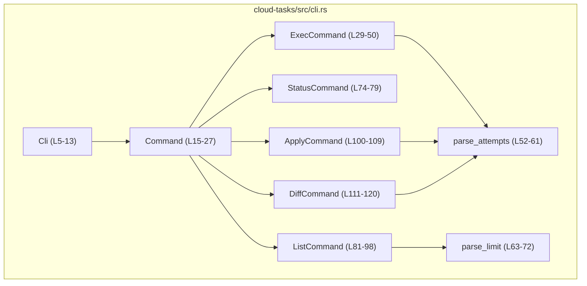
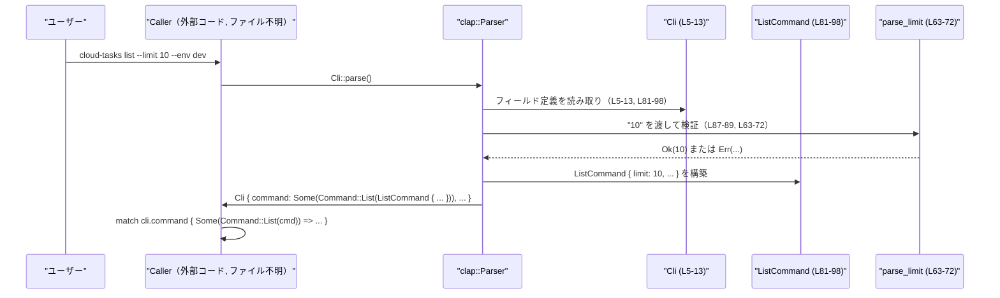

# cloud-tasks/src/cli.rs

## 0. ざっくり一言

Codex Cloud のタスク操作用 CLI の **サブコマンドとオプション定義** を、`clap` を用いて宣言的に記述しているモジュールです（`Cli`, `Command` など）。（cloud-tasks/src/cli.rs:L5-27, L29-120）

---

## 1. このモジュールの役割

### 1.1 概要

- このモジュールは、Codex Cloud タスク向け CLI の **コマンド体系** を定義します。（`Cli` 構造体と `Command` 列挙体）（L5-13, L15-27）
- 各サブコマンド（`Exec`, `Status`, `List`, `Apply`, `Diff`）ごとに、必要な引数・オプションを `clap` の `derive` マクロで宣言します。（L15-27, L29-50, L74-120）
- 数値オプション（試行回数・件数）のバリデーション用に、`parse_attempts` と `parse_limit` という **専用パーサ関数** を提供します。（L52-61, L63-72）

このファイルには、実際に API を呼び出したりタスクを操作する **ビジネスロジックは含まれておらず**、あくまで CLI 引数定義と入力検証を担当しています。

### 1.2 アーキテクチャ内での位置づけ

このモジュールは「CLI 入力 → 内部コマンド表現」への変換を担当する **境界レイヤ** に位置づけられます。



- `Cli` はアプリケーションのエントリポイントから `Cli::parse()`（`clap::Parser` トレイト）経由で利用されることが想定されますが、その呼び出し側コードはこのチャンクには現れません。（L5-7）
- `Cli` の `config_overrides` フィールドは `codex_utils_cli::CliConfigOverrides` 型で、`#[clap(skip)]` により CLI からは直接設定されず、呼び出し側が後から注入する設計になっています。（L7-9）

### 1.3 設計上のポイント

- **責務の分離**
  - CLI 定義と簡単な入力バリデーションのみを担当し、API 呼び出しやタスク処理ロジックは別モジュールに委ねる構造です。（L5-27, L29-120）
- **状態管理**
  - すべての構造体は単なるデータコンテナであり、メソッドや内部状態の更新処理は定義されていません。（L5-13, L29-50, L74-120）
- **エラーハンドリング**
  - 不正な数値入力は `parse_attempts` / `parse_limit` が `Result` で検出し、`Err(String)` として `clap` に伝播します。panic は使用していません。（L52-61, L63-72）
- **安全性・並行性**
  - `unsafe` コードは存在せず、すべて安全な Rust 構文のみで記述されています。
  - 構造体は `Debug` を derive した単純なデータ型であり、共有やスレッド間送信に関する特別な考慮はこのファイルでは行っていません（並行処理は呼び出し側の責務）。（L29, L74, L81, L100, L111）

---

## 2. 主要な機能一覧

このモジュールが提供する主な機能は次のとおりです。

- `Cli`: ルート CLI エントリ。設定上書き情報とサブコマンドを保持します。（L5-13）
- `Command`: `Exec` / `Status` / `List` / `Apply` / `Diff` を表すサブコマンド列挙。（L15-27）
- `ExecCommand`: Codex Cloud に新しいタスクを送信するための引数定義（プロンプト・環境・試行回数・ブランチ）。（L29-50）
- `StatusCommand`: タスク ID に対するステータス表示のための引数定義。（L74-79）
- `ListCommand`: タスク一覧取得のためのフィルタ・ページング・出力形式の引数定義。（L81-98）
- `ApplyCommand`: タスクの差分をローカルに適用するための引数定義（タスク ID と試行番号）。（L100-109）
- `DiffCommand`: タスクの unified diff を表示するための引数定義。（L111-120）
- `parse_attempts`: 試行回数オプションを 1〜4 の整数として検証するパーサ関数。（L52-61）
- `parse_limit`: 一覧取得件数オプションを 1〜20 の整数として検証するパーサ関数。（L63-72）

---

## 3. 公開 API と詳細解説

### 3.1 型一覧（構造体・列挙体など）

| 名前 | 種別 | 行範囲 | 役割 / 用途 | 主なフィールド・バリアント |
|------|------|--------|-------------|----------------------------|
| `Cli` | 構造体 | cloud-tasks/src/cli.rs:L5-13 | ルート CLI エントリ。設定上書きとサブコマンドを保持します。 | `config_overrides: CliConfigOverrides`（CLI からは無視, L7-9）、`command: Option<Command>`（サブコマンド, L11-12） |
| `Command` | 列挙体 | L15-27 | 利用可能なすべてのサブコマンドを表します。 | `Exec(ExecCommand)`、`Status(StatusCommand)`、`List(ListCommand)`、`Apply(ApplyCommand)`、`Diff(DiffCommand)`（L17-26） |
| `ExecCommand` | 構造体 | L29-50 | 新しい Codex Cloud タスク実行サブコマンドの引数群です。 | `query: Option<String>`（プロンプト, L31-33）、`environment: String`（必須 env ID, L35-37）、`attempts: usize`（試行回数, L39-45）、`branch: Option<String>`（ブランチ名, L47-49） |
| `StatusCommand` | 構造体 | L74-79 | 既存タスクのステータス確認サブコマンドの引数です。 | `task_id: String`（対象タスク ID, L76-78） |
| `ListCommand` | 構造体 | L81-98 | タスク一覧取得サブコマンドの引数です。 | `environment: Option<String>`（環境フィルタ, L83-85）、`limit: i64`（最大件数, L87-89）、`cursor: Option<String>`（ページングカーソル, L91-93）、`json: bool`（JSON 出力フラグ, L95-97） |
| `ApplyCommand` | 構造体 | L100-109 | タスクの差分をローカルに適用するサブコマンドの引数です。 | `task_id: String`（対象タスク ID, L102-104）、`attempt: Option<usize>`（適用する試行番号, L106-108） |
| `DiffCommand` | 構造体 | L111-120 | タスクの unified diff を表示するサブコマンドの引数です。 | `task_id: String`（対象タスク ID, L113-115）、`attempt: Option<usize>`（表示する試行番号, L117-119） |

### 3.2 関数詳細（最大 7 件）

このファイルには 2 つのローカル関数があり、いずれも `clap` の `value_parser` として利用されています。（L40-44, L88, L107, L118）

#### `parse_attempts(input: &str) -> Result<usize, String>`（cloud-tasks/src/cli.rs:L52-61）

**概要**

- 文字列 `input` を試行回数として解釈し、1〜4 の範囲にある `usize` に変換する関数です。（L52-60）
- `ExecCommand.attempts`（デフォルト値 1）や、`ApplyCommand` / `DiffCommand` の `attempt` オプションに対して `clap` が利用します。（L40-45, L106-108, L117-119）

**引数**

| 引数名 | 型 | 説明 |
|--------|----|------|
| `input` | `&str` | CLI から渡された試行回数の文字列表現です。（L52） |

**戻り値**

- `Ok(usize)`:
  - `input` が整数としてパース可能で、かつ `1..=4` の範囲内である場合の試行回数。（L53-57）
- `Err(String)`:
  - パースに失敗した場合、または範囲外の値だった場合に、適切な英語メッセージを含む `Err` を返します。（L55, L59）

**内部処理の流れ（アルゴリズム）**

1. `input.parse()` で `usize` への変換を試みます。（L53-55）
2. パースに失敗した場合、メッセージ `"attempts must be an integer between 1 and 4"` を持つ `Err(String)` を返します。（L55）
3. パースに成功した場合、その値が `1..=4` に含まれるかをチェックします。（L56）
4. 範囲内なら `Ok(value)` を返し、範囲外なら `"attempts must be between 1 and 4"` を持つ `Err(String)` を返します。（L56-60）

**Examples（使用例）**

`clap` の外から直接使う場合の簡単な例です。

```rust
// 正常な入力
assert_eq!(parse_attempts("1")?, 1);  // 1〜4 は許可される

// 範囲外
assert!(parse_attempts("0").is_err()); // 0 は 1〜4 の範囲外
assert!(parse_attempts("5").is_err()); // 5 も範囲外

// 数値以外
assert!(parse_attempts("abc").is_err()); // 整数パースに失敗
```

**Errors / Panics**

- **Errors**
  - `input.parse::<usize>()` が失敗した場合（数値以外、極端に大きい数など）、`"attempts must be an integer between 1 and 4"` というメッセージで `Err` を返します。（L53-55）
  - パースは成功したが、値が 1〜4 の範囲外の場合、`"attempts must be between 1 and 4"` というメッセージで `Err` を返します。（L56-60）
- **Panics**
  - この関数には `unwrap` や `expect` は使われておらず、標準ライブラリの `parse` と条件分岐のみを用いるため、正常な Rust 実装環境では panic は発生しません。（L53-60）

**Edge cases（エッジケース）**

- 空文字 `""`: `parse::<usize>()` が失敗し、`Err("attempts must be an integer between 1 and 4")` となります。（L53-55）
- 先頭・末尾に空白を含む文字列（例: `" 2"`）: 標準ライブラリの `parse::<usize>()` では失敗するため、同様に `Err` になります。（L53-55）
- 負の値（例: `"-1"`）:
  - `usize` へのパース時点でエラーとなり、同様のメッセージで `Err` を返します。（L53-55）
- 非常に大きな値（例: `"999999999999999999999"`）:
  - `usize` へのパース時にオーバーフローとして扱われ、`Err` になります。

**使用上の注意点**

- **利用前提**
  - この関数は `clap` の `value_parser` に渡すことを前提としたシグネチャ（`fn(&str) -> Result<T, String>`）になっています。（L41-44）
- **エラーメッセージ**
  - 戻り値の `Err(String)` は CLI ユーザーにそのまま表示される可能性が高いため、メッセージの文言はユーザー向けとして設計されています。
- **範囲の契約**
  - 呼び出し側は「1〜4 以外の値はそもそもここを通過しない」という前提でロジックを組めます。この契約を変更する場合は、下流のロジックも確認する必要があります。

---

#### `parse_limit(input: &str) -> Result<i64, String>`（cloud-tasks/src/cli.rs:L63-72）

**概要**

- 文字列 `input` を一覧取得件数として解釈し、1〜20 の範囲にある `i64` に変換する関数です。（L63-71）
- `ListCommand.limit` フィールドに対して `clap` が利用します。（L87-89）

**引数**

| 引数名 | 型 | 説明 |
|--------|----|------|
| `input` | `&str` | CLI から渡された最大取得件数の文字列表現です。（L63） |

**戻り値**

- `Ok(i64)`:
  - `input` が整数としてパース可能で、かつ `1..=20` の範囲内である場合の件数。（L64-68）
- `Err(String)`:
  - パースに失敗した場合、または範囲外の値だった場合に、エラーメッセージを含む `Err` を返します。（L66, L70）

**内部処理の流れ（アルゴリズム）**

1. `input.parse()` で `i64` への変換を試みます。（L64-66）
2. パースに失敗した場合、メッセージ `"limit must be an integer between 1 and 20"` を持つ `Err(String)` を返します。（L66）
3. パースに成功した場合、その値が `1..=20` に含まれるかをチェックします。（L67）
4. 範囲内なら `Ok(value)` を返し、範囲外なら `"limit must be between 1 and 20"` を持つ `Err(String)` を返します。（L67-71）

**Examples（使用例）**

```rust
// 正常な入力
assert_eq!(parse_limit("1")?, 1);
assert_eq!(parse_limit("20")?, 20);

// 範囲外
assert!(parse_limit("0").is_err());   // 0 は範囲外
assert!(parse_limit("21").is_err());  // 21 も範囲外

// 負数
assert!(parse_limit("-1").is_err());  // パースは成功するが、1..=20 の範囲外

// 数値以外
assert!(parse_limit("many").is_err());
```

**Errors / Panics**

- **Errors**
  - `input.parse::<i64>()` が失敗した場合に `"limit must be an integer between 1 and 20"` の `Err`。（L64-66）
  - パース成功後に範囲外（≤0 または ≥21）の場合 `"limit must be between 1 and 20"` の `Err`。（L67-71）
- **Panics**
  - `parse_attempts` 同様、panic につながるコードは含まれていません。（L64-71）

**Edge cases（エッジケース）**

- デフォルト値 `20`:
  - `ListCommand.limit` は `default_value_t = 20` として宣言されており（L88）、その値もこの関数を通じて検証されます。（20 は許容範囲内です。）
- 負数 `"-5"`:
  - `i64` としてのパースは成功しますが、`1..=20` の範囲外のため `Err("limit must be between 1 and 20")` になります。（L67-71）
- 非 ASCII 数字（例: 全角数字）は `parse::<i64>()` で失敗し、`Err` になります。（L64-66）

**使用上の注意点**

- **契約**
  - 呼び出し側は「常に 1〜20 の整数のみが渡される」と仮定できます。
- **数値型**
  - 戻り値は `i64` ですが、件数としては非負の小さな値のみが許容されているため、負値は関数内で弾かれます。（L67-71）
- **エラーメッセージ**
  - エラーメッセージは CLI ユーザー向けに設計されています。ロギングやエラー分類用に内部コードを付けたい場合は、この関数をラップするか、`clap` 側のエラー処理で対応する必要があります。

---

### 3.3 その他の関数

- このファイルには、上記 2 関数以外の補助関数やラッパー関数は定義されていません。（L52-61, L63-72 以外に `fn` 宣言がない）

---

## 4. データフロー

ここでは代表的なシナリオとして、`list` サブコマンド実行時のデータフローを示します。

1. 呼び出し側コード（例: `main` 関数）が `Cli::parse()` を呼び出します。（`Cli` は `Parser` を derive, L5-6）
2. `clap` はコマンドライン引数を解析し、`Command::List(ListCommand { ... })` を構築します。（L15-27, L81-98）
3. `--limit` が指定されていれば、その値の文字列が `parse_limit` に渡され、1〜20 の範囲チェックが行われます。（L81-89, L63-71）
4. 構築された `Cli` インスタンスが呼び出し側に返され、`match cli.command` によって適切な処理関数が呼ばれます（呼び出し側はこのチャンクには現れません）。



- 図中の `Caller` は、この `Cli` 型を利用する外部コードを抽象的に表したものであり、具体的なファイル名や関数名はこのチャンクからは分かりません。

---

## 5. 使い方（How to Use）

### 5.1 基本的な使用方法

`Cli` を利用する典型的なバイナリクレート側のコード例です（実際のプロジェクト構成はこのチャンクからは分かりません）。

```rust
use clap::Parser;                               // Parser トレイトをインポート
use cloud_tasks::cli::{Cli, Command};           // 仮のモジュールパス（実際のパスはリポジトリ依存）

fn main() -> anyhow::Result<()> {
    // コマンドライン引数をパースして Cli 構造体を取得
    let mut cli = Cli::parse();                 // Cli は #[derive(Parser)]（L5-6）

    // config_overrides は #[clap(skip)] なので、呼び出し側で注入する（例）
    // 実際の生成方法は codex_utils_cli 側の API に依存し、このチャンクからは不明
    // cli.config_overrides = CliConfigOverrides::from_env();

    match cli.command {
        Some(Command::Exec(cmd)) => {
            // ExecCommand { query, environment, attempts, branch } を利用して実処理を呼ぶ
            // 実処理側では、attempts が 1〜4 であることを前提にできる（L39-45, L52-60）
        }
        Some(Command::Status(cmd)) => {
            // StatusCommand.task_id を使ってステータス照会
        }
        Some(Command::List(cmd)) => {
            // ListCommand { environment, limit, cursor, json } を利用して一覧取得
            // limit は 1〜20 の範囲（L87-89, L63-71）
        }
        Some(Command::Apply(cmd)) => {
            // ApplyCommand.task_id と attempt を利用して差分を適用
        }
        Some(Command::Diff(cmd)) => {
            // DiffCommand.task_id と attempt を利用して diff を表示
        }
        None => {
            // サブコマンドが指定されなかった場合の扱いは呼び出し側の設計次第
        }
    }

    Ok(())
}
```

### 5.2 よくある使用パターン

#### 1. 新しいタスクを実行する（Exec）

```bash
cloud-tasks exec --env dev-env "Refactor the foo module"
```

- 対応するフィールド:
  - `environment = "dev-env"`（必須, L35-37）
  - `query = Some("Refactor the foo module".to_string())`（L31-33）
  - `attempts = 1`（デフォルト, L39-45）
  - `branch = None`（L47-49）

#### 2. タスク一覧を JSON で取得する（List）

```bash
cloud-tasks list --env dev-env --limit 10 --json
```

- `environment = Some("dev-env")`（L83-85）
- `limit = 10`（`parse_limit` により 1〜20 の範囲内であることが保証, L87-89, L63-71）
- `cursor = None`（L91-93）
- `json = true`（L95-97）

#### 3. 特定タスクの 2 回目の試行を適用する（Apply）

```bash
cloud-tasks apply TASK123 --attempt 2
```

- `task_id = "TASK123"`（L102-104）
- `attempt = Some(2)`（`parse_attempts` で 1〜4 の範囲チェック, L106-108, L52-60）

### 5.3 よくある間違い

```bash
# 間違い例: Exec で --env を指定していない
cloud-tasks exec "Run something"
# => environment は非オプション（String）かつ default_value もないため、clap が必須引数としてエラーにします（L35-37）。

# 間違い例: limit が範囲外（0）
cloud-tasks list --limit 0
# => parse_limit が "limit must be between 1 and 20" のエラーを返し、clap がエラー表示の上で終了します（L63-71, L87-89）。

# 正しい例
cloud-tasks list --limit 5
```

```rust
// 間違い例: value_parser を変更せずに attempts の許容範囲だけをコメントで「1〜10」と書き換える

// 正しい例: コメントと parse_attempts の両方で範囲を揃える必要があります
// （ビジネスロジックも 1〜10 を前提に見直す必要がある）
```

### 5.4 使用上の注意点（まとめ）

- **前提条件**
  - `ExecCommand.environment` など、`Option` でないフィールドは `clap` により必須引数となります（L35-37, L102-104, L113-115）。
  - 数値オプションは `parse_attempts` / `parse_limit` を経由し、指定された範囲外の値は CLI レベルで拒否されます（L40-45, L87-89, L52-60, L63-71）。
- **スレッド安全性**
  - このモジュール自体は純粋なデータ構造と純粋関数のみから成り、`static` な可変状態や `unsafe` は含まれていません。
  - したがって、生成された `Cli` / `Command` / `*Command` 型は、所有権と借用ルールに従って安全にスレッド間で受け渡しできます（具体的な `Send` / `Sync` 実装は型パラメータに依存しますが、このチャンクには型パラメータはありません）。
- **セキュリティ**
  - `environment`, `task_id`, `cursor` などは自由形式の `String` として受け取ります（L35-37, L76-78, L91-93）。
  - これらを後続処理でコマンドラインなどに埋め込む場合、**シェルインジェクション** 等に対するサニタイズは呼び出し側で行う必要があります。このファイルでは値の構文チェックやサニタイズは行いません。
- **国際化・メッセージ**
  - エラーメッセージは英語の固定文字列であり、多言語対応は考慮されていません（L55, L59, L66, L70）。

---

## 6. 変更の仕方（How to Modify）

### 6.1 新しい機能を追加する場合（新サブコマンド）

新しいサブコマンドを追加する際の典型的なステップは次の通りです。

1. **新しい引数構造体の追加**
   - `StatusCommand` などと同様に、`#[derive(Debug, Args)]` を付与した構造体を定義します。（L74-79, L81-98, L100-109, L111-120 を参考）
2. **`Command` 列挙体へのバリアント追加**
   - `Command` enum に `NewSubcommand(NewSubcommandArgs)` のようなバリアントを追加します。（L15-27）
3. **`Cli` への統合**
   - `Cli` の `command: Option<Command>` フィールドはそのまま利用でき、新しいバリアントも `clap` が自動的に認識します。（L11-12, L15-27）
4. **呼び出し側の分岐追加**
   - `match cli.command` の分岐に新バリアントを追加し、実際の処理ロジックを呼び出します（呼び出し側コードはこのチャンクには現れません）。

数値オプションが必要な場合は、`parse_attempts` / `parse_limit` を再利用するか、範囲が異なる場合は同様のパターンで新しいパーサ関数を追加します（L52-61, L63-72）。

### 6.2 既存の機能を変更する場合

- **許容範囲を変更する（例: attempts を 1〜10 にする）**
  - `parse_attempts` 内の範囲チェック `(1..=4)` を `(1..=10)` などに変更し、エラーメッセージの文言も揃える必要があります。（L56, L59）
  - `ExecCommand` / `ApplyCommand` / `DiffCommand` のドキュメントコメントや外部ドキュメントも更新し、契約の変更が利用者に伝わるようにします。（L39-45, L106-108, L117-119）
- **limit の上限を変更する**
  - 同様に `parse_limit` の `(1..=20)` およびメッセージを変更します。（L67, L70）
  - `ListCommand` のフィールドコメント「1-20」も一致させます。（L87-88）
- **フィールドの必須/任意を変更する**
  - 型を `String` から `Option<String>` に変更すると、その引数は任意になります（逆も同様）。（L35-37, L83-85, L102-104, L113-115）
  - それに応じて下流ロジックの `None` ハンドリングも追加する必要があります。

いずれの変更でも、「このファイルでの契約（値の範囲、必須性）」と、「それを前提にした下流ロジック」の整合性を確認することが重要です。

---

## 7. 関連ファイル

このチャンクから直接参照が分かるのは以下の外部コンポーネントのみです。

| パス / 識別子 | 役割 / 関係 |
|---------------|------------|
| `codex_utils_cli::CliConfigOverrides` | `Cli` 構造体の `config_overrides` フィールドの型です。`#[clap(skip)]` により CLI 引数からは設定されず、呼び出し側が後から注入する設定上書き用コンポーネントと解釈できますが、具体的な API はこのチャンクには現れません。（cloud-tasks/src/cli.rs:L3, L7-9） |
| `clap::Parser`, `clap::Args`, `clap::Subcommand` | CLI のパースとサブコマンド/オプション定義を支える外部クレートです。`Cli` は `Parser` を derive し、各コマンド構造体は `Args` / `Subcommand` を derive しています。（L1-2, L5-6, L15, L29, L74, L81, L100, L111） |

このファイルを実際に利用する `main` 関数やタスク実行ロジックがどのファイルにあるかは、このチャンクだけからは分かりません（「このチャンクには現れない」情報です）。
