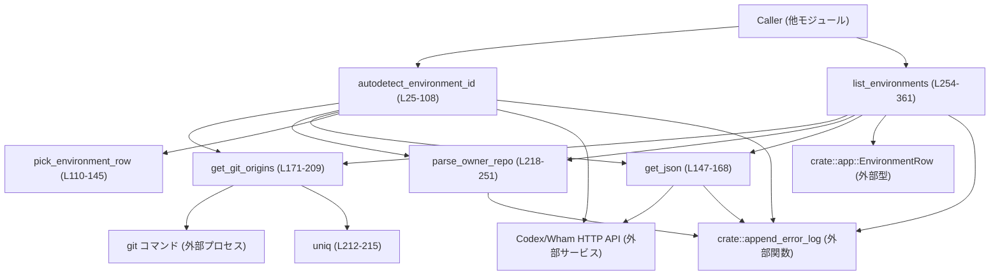
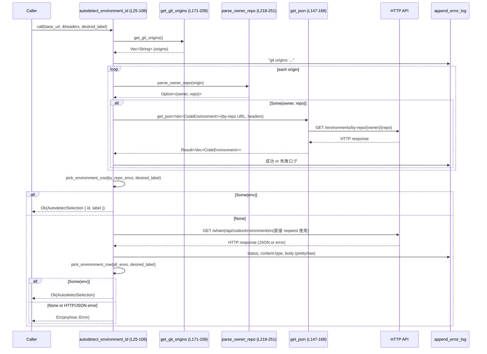
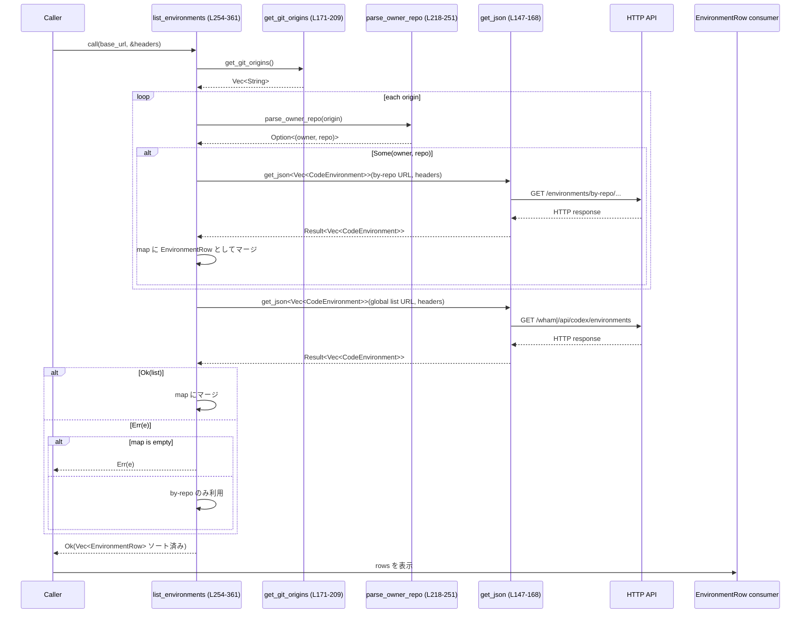

# cloud-tasks/src/env_detect.rs コード解説

## 0. ざっくり一言

Git リポジトリの remote URL から GitHub の owner/repo を推定し、それに紐づく「コード実行環境（Environment）」を API から取得・選択するためのユーティリティモジュールです（自動検出用の 1 件取得と、TUI 向けの一覧生成を提供します）。  
根拠: `autodetect_environment_id` と `list_environments` のコメントと処理内容（cloud-tasks/src/env_detect.rs:L25-108, L254-361）

---

## 1. このモジュールの役割

### 1.1 概要

- このモジュールは **ローカル Git リポジトリの origin URL から GitHub の owner/repo を抽出し、そのリポジトリに紐づく環境一覧を HTTP API から取得・選択する** 機能を提供します。
- 環境 ID の自動決定用関数（1 件返す）と、TUI モーダルで使うための整形済み環境一覧を返す関数が公開 API です。  
  根拠: cloud-tasks/src/env_detect.rs:L25-108, L254-361

### 1.2 アーキテクチャ内での位置づけ

主要コンポーネントと依存関係を示します（このファイルの範囲のみ）。



- `autodetect_environment_id` は Git origins → by-repo API → fallback の順で候補を集め、`pick_environment_row` で 1 つに絞り込みます。  
  根拠: cloud-tasks/src/env_detect.rs:L30-62, L69-107, L110-143
- `list_environments` は類似の by-repo → global の取得を行い、`EnvironmentRow` にマージして返します。  
  根拠: cloud-tasks/src/env_detect.rs:L262-307, L309-343, L345-361
- Git 情報取得は `get_git_origins` 経由で、外部 `git` プロセスを同期実行しています。  
  根拠: cloud-tasks/src/env_detect.rs:L171-209

### 1.3 設計上のポイント

- **責務分割**
  - HTTP JSON 取得処理を `get_json` に切り出し、再利用しています（by-repo や global で共通）。  
    根拠: cloud-tasks/src/env_detect.rs:L147-168, L48-59, L277-305, L315-343
  - 環境選択ロジックを `pick_environment_row` として分離し、自動検出関数から利用しています。  
    根拠: cloud-tasks/src/env_detect.rs:L62-67, L101-106, L110-145
  - Git origin 取得とパース（owner/repo 抽出）を `get_git_origins` / `parse_owner_repo` に分割。  
    根拠: cloud-tasks/src/env_detect.rs:L171-209, L218-251
- **状態管理**
  - すべての関数はステートレスで動作し、必要な情報は引数・ローカル変数・外部関数呼び出しに依存しています。グローバルな可変状態は持ちません。
- **エラーハンドリング**
  - 外部 I/O（HTTP・git コマンド）は `anyhow::Result` で包み、`?` や `anyhow::bail!` で上位へ伝播します。  
    根拠: cloud-tasks/src/env_detect.rs:L25-29, L77-87, L95-107, L147-168, L254-261, L315-343
  - エラー詳細には HTTP ステータスや Content-Type、レスポンスボディを含めて診断しやすくしています。  
    根拠: cloud-tasks/src/env_detect.rs:L80-87, L95-100, L153-161, L162-167
- **ロギング・観測性**
  - 自前の `append_error_log` と `tracing::info` / `tracing::warn` で、API コールやパース結果を詳細にロギングしています。  
    根拠: cloud-tasks/src/env_detect.rs:L32, L47, L50-58, L75, L87, L90-93, L123, L128, L132, L141, L161, L172-189, L191-207, L232-233, L247-248, L279-280, L299-303, L317-318, L333-340
- **並行性**
  - 公開関数は `async fn` ですが、内部で `std::process::Command` を直接呼ぶ同期処理を含みます（`get_git_origins`）。非同期ランタイム上ではその間スレッドをブロックする点に注意が必要です。  
    根拠: cloud-tasks/src/env_detect.rs:L25, L254, L171-209

---

## 2. 主要な機能一覧

- 環境 ID 自動検出: 現在の Git リポジトリに紐づく環境の ID を 1 つ選んで返す（`autodetect_environment_id`）。  
  根拠: cloud-tasks/src/env_detect.rs:L25-108
- 環境一覧の取得と整形: TUI モーダルで使うための `EnvironmentRow` の一覧を取得・マージ・ソートして返す（`list_environments`）。  
  根拠: cloud-tasks/src/env_detect.rs:L254-361
- 環境候補からの 1 件選択ロジック: ラベル／ピン留め／タスク数に基づいて 1 つの環境を選ぶ（`pick_environment_row`）。  
  根拠: cloud-tasks/src/env_detect.rs:L110-145
- 汎用 JSON 取得ユーティリティ: HTTP GET → ステータス/CT/ボディ検査 → JSON デコード（`get_json`）。  
  根拠: cloud-tasks/src/env_detect.rs:L147-168
- Git origins 取得: `git config` / `git remote -v` からリモート URL を抽出・重複除去（`get_git_origins` / `uniq`）。  
  根拠: cloud-tasks/src/env_detect.rs:L171-215
- GitHub owner/repo 抽出: ssh/https/git 形式の GitHub URL から `owner/repo` を解析（`parse_owner_repo`）。  
  根拠: cloud-tasks/src/env_detect.rs:L218-251

---

## 3. 公開 API と詳細解説

### 3.1 型一覧（構造体・列挙体など）

| 名前 | 種別 | 公開 | 行範囲 | 役割 / 用途 |
|------|------|------|--------|-------------|
| `CodeEnvironment` | 構造体 | 非 pub | cloud-tasks/src/env_detect.rs:L8-16 | API から返る環境オブジェクトの内部表現。`id`, `label`, `is_pinned`, `task_count` を保持します。 |
| `AutodetectSelection` | 構造体 | pub | cloud-tasks/src/env_detect.rs:L19-23 | 自動検出された環境の ID とラベル（任意）を返すための小さな DTO（データ転送用オブジェクト）です。|

> `crate::app::EnvironmentRow` はこのファイル外で定義されており、ここでは型名と使用箇所のみ確認できます（詳細なフィールドはこのチャンクには現れません）。  
> 根拠: cloud-tasks/src/env_detect.rs:L259-260, L282-288, L320-326, L345-360

### 3.2 関数詳細（主要 6 件）

#### `autodetect_environment_id(base_url: &str, headers: &HeaderMap, desired_label: Option<String>) -> anyhow::Result<AutodetectSelection>`

**定義位置**: cloud-tasks/src/env_detect.rs:L25-108  

**概要**

- 現在のローカル Git リポジトリから GitHub origin を取得し、それぞれに紐づく環境一覧を by-repo API で取得します（1 段階目）。  
- 取得した環境群から `pick_environment_row` で 1 件選択し、それが見つからなければ全環境一覧 API を呼んで再度選択します（2 段階目）。  
- 最終的に選ばれた環境の ID とラベルを `AutodetectSelection` として返します。

**引数**

| 引数名 | 型 | 説明 |
|--------|----|------|
| `base_url` | `&str` | Codex/Wham バックエンドのベース URL。`/backend-api` を含むかどうかで API パスを切り替えます。根拠: L36-46, L70-74 |
| `headers` | `&HeaderMap` | HTTP リクエストに付与するヘッダ（認証ヘッダなど）。そのまま `reqwest` に渡されます。根拠: L27, L78-79 |
| `desired_label` | `Option<String>` | 優先的に選びたいラベル名（大文字小文字は無視）。指定されていれば `pick_environment_row` 内でマッチを試みます。根拠: L28, L62-66, L101-105, L117-123 |

**戻り値**

- `Ok(AutodetectSelection)`:
  - `id`: 選択された環境の ID。  
  - `label`: 環境のラベル（存在する場合）。  
  根拠: cloud-tasks/src/env_detect.rs:L63-66, L102-105
- `Err(anyhow::Error)`:
  - HTTP エラー・JSON デコードエラー・環境が 1 つも見つからなかった場合など。  
    根拠: L77-87, L95-100, L107

**内部処理の流れ**

1. Git origins を取得  
   - `get_git_origins` を呼び出し、origin URL のリストを得てログに書き出します。  
     根拠: L31-33
2. by-repo API に対するループ  
   - origins を走査し、`parse_owner_repo` で GitHub の `owner`/`repo` へパースできたものだけを対象にします。  
     根拠: L34-36  
   - `base_url` に応じて `/wham/environments/by-repo/...` または `/api/codex/environments/by-repo/...` の URL を構築します。  
     根拠: L36-46  
   - `get_json::<Vec<CodeEnvironment>>` で JSON を取得し、成功時は `by_repo_envs` ベクタへ追加します。失敗時はロギングのみで続行します。  
     根拠: L47-59
3. by-repo 結果からの選択  
   - `pick_environment_row(&by_repo_envs, desired_label.as_deref())` で 1 件選択を試み、成功すれば即座に `AutodetectSelection` を返します。  
     根拠: L62-67
4. 全環境一覧の取得  
   - `base_url` に応じて `/wham/environments` または `/api/codex/environments` の URL を作成します。  
     根拠: L69-74  
   - `build_reqwest_client_with_custom_ca` で HTTP クライアントを生成し、`headers` を付けて GET リクエストを送信します。  
     根拠: L77-79  
   - ステータスと Content-Type を取得し、ボディ文字列を読み出してログに記録します。JSON としてパースできれば pretty print を、できなければ raw をログします。  
     根拠: L80-87, L88-93
5. エラー／JSON デコード  
   - HTTP ステータスが成功でなければ `anyhow::bail!` で `Err` を返します（ボディ内容を含む）。  
     根拠: L95-96  
   - 成功時は `serde_json::from_str::<Vec<CodeEnvironment>>` で全環境一覧にデコードし、失敗時は詳細なメッセージを含めて `Err` を返します。  
     根拠: L98-100
6. 全環境からの選択  
   - 再度 `pick_environment_row` で 1 件選択を試み、成功すれば `Ok(AutodetectSelection)` を返します。  
     根拠: L101-106  
   - それでも見つからなければ `"no environments available"` で `bail!` します。  
     根拠: L107

**Examples（使用例）**

```rust
use reqwest::header::HeaderMap;
use cloud_tasks::env_detect::{autodetect_environment_id, AutodetectSelection}; // モジュールパスは仮

#[tokio::main]
async fn main() -> anyhow::Result<()> {
    let base_url = "https://example.com/backend-api";             // API ベース URL
    let mut headers = HeaderMap::new();                            // ヘッダを準備
    // 認証トークンなどをセット（実際のキー名は API に依存）
    // headers.insert("Authorization", "Bearer ...".parse()?);

    // 「prod」というラベルの環境を優先的に選ぶ
    let selection: AutodetectSelection =
        autodetect_environment_id(base_url, &headers, Some("prod".to_string())).await?;

    println!("Selected environment: {} ({:?})", selection.id, selection.label);
    Ok(())
}
```

**Errors / Panics**

- `Err` になる主な条件:
  - Git origins 取得自体の失敗はこの関数ではエラーにはせず、空 origins として扱います（`get_git_origins` 内で処理）。  
    根拠: cloud-tasks/src/env_detect.rs:L171-209, L31-33
  - by-repo 取得での HTTP/JSON エラーはログのみでスキップし、この関数としては `Err` を返しません。  
    根拠: L48-59
  - 全環境一覧 API 呼び出しで:
    - HTTP ステータスが 2xx 以外 → `GET {list_url} failed: ...` で `Err`。  
      根拠: L95-96  
    - JSON デコード失敗 → `"Decode error for {list_url}: ..."` で `Err`。  
      根拠: L98-100
  - 成功レスポンスだが `pick_environment_row` が 1 件も選べない（全配列が空など） → `"no environments available"` で `Err`。  
    根拠: L107, L114-116
- パニックの可能性:
  - `unwrap_or_default`, `unwrap_or` のみを使用しており、`unwrap()` や `expect()` は使っていないため、ロジック上のパニックはありません。  
    根拠: L84-86, L86-87, L90-91

**Edge cases（エッジケース）**

- Git origins が 1 つも取得できない場合:
  - by-repo ループはスキップされ、最初から全環境一覧 API のフェーズに進みます。  
    根拠: L31-35, L62-68
- `desired_label` が `Some` だがどの環境のラベルとも一致しない場合:
  - `pick_environment_row` がラベルマッチ失敗 → pinned/タスク数などのヒューリスティックにフォールバックします。  
    根拠: L117-126, L127-143
- API が 200 だがボディが空文字列などで JSON にデコードできない場合:
  - `serde_json::from_str::<Vec<CodeEnvironment>>` が失敗し、デコードエラーとして `Err` を返します。  
    根拠: L98-100

**使用上の注意点**

- 非同期関数なので、`tokio` などの非同期ランタイム上で `.await` する必要があります。  
  根拠: L25 (`async fn`)
- 内部で `get_git_origins` が同期的に `git` プロセスを呼びます。大規模リポジトリやネットワークドライブ上ではやや重いことがあり、非同期ランタイムのスレッドをブロックします。  
  根拠: L31, L171-209
- エラー時にはレスポンスボディ全体をエラーメッセージに含めます。ボディに機密情報が含まれる API ではログ出力と組み合わせて情報漏洩リスクになり得るため、ログ設定に注意が必要です。  
  根拠: L95-100

---

#### `list_environments(base_url: &str, headers: &HeaderMap) -> anyhow::Result<Vec<crate::app::EnvironmentRow>>`

**定義位置**: cloud-tasks/src/env_detect.rs:L254-361  

**概要**

- 現在の Git リポジトリに紐づく by-repo 環境一覧と、グローバルな全環境一覧を取得し、`EnvironmentRow` にマージして返す関数です。
- 環境 ID で重複排除しつつ、ピン留めフラグやラベル、リポジトリヒントを統合し、TUI モーダルで利用しやすいようソートして返します。  
  根拠: L254-256, L260-261, L279-288, L315-331, L345-360

**引数**

| 引数名 | 型 | 説明 |
|--------|----|------|
| `base_url` | `&str` | Codex/Wham バックエンドのベース URL。`/backend-api` を含むかどうかで API パスを切り替えます。根拠: L267-276, L310-314 |
| `headers` | `&HeaderMap` | HTTP リクエストに付与するヘッダ。`get_json` にそのまま渡されます。根拠: L258-259, L277-278, L315-316 |

**戻り値**

- `Ok(Vec<EnvironmentRow>)`:
  - 環境ごとに 1 行の `EnvironmentRow` を返します（ID で重複排除後）。  
  - ソート順: pinned 優先 → ラベル（大文字小文字を無視） → ID。  
    根拠: L345-360
- `Err(anyhow::Error)`:
  - by-repo 全体が失敗し、かつ global list の取得も失敗し、1 つも行を作成できなかった場合のみ。  
    根拠: L262-307, L309-343, 特に L334-336

**内部処理の流れ**

1. 空の `HashMap<String, EnvironmentRow>` を作成（キーは環境 ID）。  
   根拠: L259-260
2. by-repo 取得
   - `get_git_origins` → `parse_owner_repo` で origin から owner/repo を抽出。  
     根拠: L262-266  
   - `base_url` に応じて by-repo API URL を構築し、`get_json::<Vec<CodeEnvironment>>` を呼びます。  
     根拠: L266-276, L277  
   - 成功時:
     - `info!` ログに件数を出力。  
       根拠: L279-280  
     - それぞれの `CodeEnvironment` を `EnvironmentRow` に変換し、`map` にマージします。既存エントリがある場合は:
       - `label`: 既存が `None` のときのみ新しいものを反映。  
       - `is_pinned`: 論理和（どちらかが `true` なら `true`）。  
       - `repo_hints`: 既存が `None` のときのみ `owner/repo` をセット。  
       根拠: L281-297
   - 失敗時:
     - `warn!` でログを残し、処理は継続（他の origin や global list に期待）。  
       根拠: L299-303
3. global list 取得
   - `/wham/environments` または `/api/codex/environments` の URL を構築し、`get_json::<Vec<CodeEnvironment>>` を呼びます。  
     根拠: L309-315  
   - 成功時:
     - `info!` で環境数をログ。  
       根拠: L317-318  
     - 各 `CodeEnvironment` を `EnvironmentRow` にマージ（`repo_hints` は `None` をセット）。  
       根拠: L319-326  
     - マージルールは by-repo 部分と同じ（label が空なら埋める・is_pinned は OR）。  
       根拠: L327-331
   - 失敗時:
     - すでに `map` に by-repo の結果がある場合は `warn!` を出して by-repo のみを利用。  
       根拠: L333-341  
     - `map` が空（by-repo も 1 件も取れなかった）場合はそのエラーを `return Err(e)` で返す。  
       根拠: L334-336
4. ソートと返却
   - `map.into_values().collect()` で `Vec<EnvironmentRow>` に変換。  
     根拠: L345-346  
   - 比較関数でソート:
     - `is_pinned`: `true` が先になるように比較。  
       根拠: L347-351  
     - ラベル文字列（小文字化）の辞書順。  
       根拠: L352-355  
     - ID の辞書順。  
       根拠: L356-359  
   - `Ok(rows)` を返す。  
     根拠: L361

**Examples（使用例）**

```rust
use reqwest::header::HeaderMap;
use cloud_tasks::env_detect::list_environments; // モジュールパスは仮
// use cloud_tasks::app::EnvironmentRow;

#[tokio::main]
async fn main() -> anyhow::Result<()> {
    let base_url = "https://example.com/api/codex";   // backend-api でないパターン
    let headers = HeaderMap::new();

    let rows = list_environments(base_url, &headers).await?;

    for row in rows {
        println!(
            "[{}] {} {:?}",
            if row.is_pinned { "*" } else { " " },       // pinned を表示
            row.id,
            row.label,
        );
    }
    Ok(())
}
```

**Errors / Panics**

- `Err` になる条件:
  - by-repo ループでは、HTTP エラーや JSON デコード失敗はすべて `warn!` ログのみでスキップされ、この関数としては `Err` を返しません。  
    根拠: L277-278, L299-303
  - global list 取得に失敗し、かつ `map` が空（by-repo 結果もゼロ）の場合のみ `Err(e)` を返します。  
    根拠: L333-336
- パニックの可能性:
  - 同様に `unwrap` / `expect` は使用しておらず、標準ライブラリの比較や `to_lowercase` によるパニック要因も特にありません。

**Edge cases（エッジケース）**

- by-repo がすべて失敗し、global list は成功:
  - 正常に global list のみから一覧が構成されます。  
    根拠: L277-278, L315-332
- by-repo が一部成功、一部失敗し、global list が失敗:
  - by-repo のみの結果を返しつつ、失敗は `warn!` に記録します。  
    根拠: L279-297, L333-341
- pinned が 1 つも存在しない場合:
  - pinned 比較はすべて `false` となり、ラベル→ID の順でソートされます。  
    根拠: L347-359
- ラベルが `None` または空文字の環境:
  - `unwrap_or("")` により空文字列として比較され、ソート時に先頭側に固まる可能性があります。  
    根拠: L353-355

**使用上の注意点**

- `EnvironmentRow` のフィールド（`repo_hints` など）はこのファイルでは定義されていないため、利用側は `crate::app::EnvironmentRow` の仕様を参照する必要があります。  
  根拠: L282-288, L320-326
- 一覧取得は少なくとも 1 回の global list API 呼び出しと、origin ごとの by-repo 呼び出しを行うため、API 負荷や遅延が気になる場合は呼び出し頻度に注意する必要があります。

---

#### `pick_environment_row(envs: &[CodeEnvironment], desired_label: Option<&str>) -> Option<CodeEnvironment>`

**定義位置**: cloud-tasks/src/env_detect.rs:L110-145  

**概要**

- `CodeEnvironment` のスライスから、1 件の環境を選ぶためのヒューリスティックを実装した関数です。
- ラベル指定・単一要素・ピン留め・タスク数の順で優先度をつけて選択します。

**引数**

| 引数名 | 型 | 説明 |
|--------|----|------|
| `envs` | `&[CodeEnvironment]` | 候補となる環境のスライス。空の場合は何も選べません。|
| `desired_label` | `Option<&str>` | 優先ラベル。指定されていれば最初にこのラベルの完全一致（大文字小文字無視）を探します。|

**戻り値**

- `Some(CodeEnvironment)`:
  - 選択された環境（`CodeEnvironment` を `Clone` して返す）。  
- `None`:
  - `envs` が空の場合のみ。  
    根拠: L114-116

**内部処理の流れ**

1. 空チェック: `envs.is_empty()` なら `None`。  
   根拠: L114-116
2. ラベル一致の試行:
   - `desired_label` が `Some` のとき、`label.to_lowercase()` と `e.label.as_deref().unwrap_or("").to_lowercase()` を比較して一致するものを探し、最初に見つかったものを返します。  
     根拠: L117-125
3. 要素数 1 のショートカット:
   - `envs.len() == 1` のとき、その要素をそのまま返します。  
     根拠: L127-130
4. pinned 環境の選択:
   - `envs.iter().find(|e| e.is_pinned.unwrap_or(false))` で最初の pinned 環境を選びます。  
     根拠: L131-133
5. タスク数 or 先頭要素:
   - `max_by_key(|e| e.task_count.unwrap_or(0))` で最大 `task_count` を持つ環境を探し、該当しなければ `envs.first()` にフォールバックします（実際は非空配列なら `max_by_key` は必ず `Some` です）。  
     根拠: L135-143

**Examples（使用例）**

```rust
// テストコード相当のユースケース例
let envs = vec![
    CodeEnvironment { id: "1".into(), label: Some("dev".into()), is_pinned: None, task_count: Some(5) },
    CodeEnvironment { id: "2".into(), label: Some("prod".into()), is_pinned: Some(true), task_count: Some(100) },
];

let picked = pick_environment_row(&envs, Some("prod"));
assert_eq!(picked.unwrap().id, "2"); // ラベル一致 & pinned
```

**Errors / Panics**

- 戻り値が `Option` なので、パニックは発生しません（`index` も使っていません）。

**Edge cases（エッジケース）**

- `envs` が空: `None`。  
  根拠: L114-116
- `desired_label` が `Some("")` の場合:
  - env の `label` が `None` または空文字のものがあればマッチします（`unwrap_or("")` のため）。  
    根拠: L121-122
- pinned が複数存在する場合:
  - `.find` により、スライス順で最初に見つかった 1 件だけ選択されます。  
    根拠: L131-133
- `task_count` がすべて `None` の場合:
  - すべて 0 として扱われ、最初の要素が選ばれます。  
    根拠: L136-140

**使用上の注意点**

- 戻り値は `CodeEnvironment` のクローンなので、サイズが大きくなる場合は参照を返すように設計変更する余地がありますが、このファイルからは実際のサイズは分かりません。

---

#### `get_json<T: serde::de::DeserializeOwned>(url: &str, headers: &HeaderMap) -> anyhow::Result<T>`

**定義位置**: cloud-tasks/src/env_detect.rs:L147-168  

**概要**

- 指定 URL に対して HTTP GET を行い、レスポンスボディを JSON としてデコードして返す汎用ユーティリティ関数です。

**引数**

| 引数名 | 型 | 説明 |
|--------|----|------|
| `url` | `&str` | 取得対象のフル URL。ログにもそのまま出力されます。|
| `headers` | `&HeaderMap` | リクエストヘッダ。`clone` したものを `reqwest` に渡しています。|

**戻り値**

- `Ok(T)`:
  - JSON ボディを `T` 型にデコードしたもの。  
- `Err(anyhow::Error)`:
  - HTTP ステータスが非成功、または JSON デコード失敗。

**内部処理の流れ**

1. `build_reqwest_client_with_custom_ca` から `reqwest::Client` を構築。  
   根拠: L151
2. `GET url` に `headers.clone()` を付けて送信し、`await` でレスポンスを取得。  
   根拠: L152
3. ステータス、Content-Type、ボディ文字列を取得し、`append_error_log` でログに出力。  
   根拠: L153-161
4. `status.is_success()` が `false` の場合:
   - `anyhow::bail!` で詳細なメッセージを返す（URL, status, Content-Type, body を含む）。  
     根拠: L162-163
5. `serde_json::from_str::<T>(&body)` でデコードに挑戦し、失敗時は同様に詳細メッセージで `Err`。  
   根拠: L165-167

**Examples（使用例）**

```rust
use reqwest::header::HeaderMap;

#[derive(serde::Deserialize)]
struct MyResource { id: String }

async fn fetch_my_resource(url: &str, headers: &HeaderMap) -> anyhow::Result<MyResource> {
    env_detect::get_json::<MyResource>(url, headers).await
}
```

**Errors / Panics**

- HTTP ステータスが 2xx でない場合は必ず `Err` になります。  
- JSON デコード失敗時も `Err`。  
- パニックはありません（`unwrap` 未使用）。

**Edge cases**

- ボディが空で `T` が空オブジェクトを期待している場合など、JSON フォーマットと `T` の定義が合致しないときは即座に `Err` になります。

**使用上の注意点**

- 毎回 `reqwest::Client` を新規作成しているため、高頻度に呼ぶとコネクション確立コストが増えます。キャッシュするか、上位レイヤでクライアントを共有する設計も検討し得ます。

---

#### `get_git_origins() -> Vec<String>`

**定義位置**: cloud-tasks/src/env_detect.rs:L171-209  

**概要**

- ローカル Git リポジトリの remote URL を取得し、重複を除去した一覧を返します。
- 優先順: `git config --get-regexp remote\..*\.url` → （失敗時）`git remote -v`。  
  根拠: L172-175, L190-193

**内部処理の流れ（概要）**

1. `git config --get-regexp 'remote\..*\.url'` の実行を試み、成功かつ終了コード 0 の場合:
   - 標準出力を行ごとに分解し、スペース区切りの 2 列目を URL として収集。  
     根拠: L176-185  
   - `uniq` でソート＆重複削除して返却。  
     根拠: L186-188
2. 上記が失敗した場合は `git remote -v` を実行:
   - 出力の 2 列目（URL）を収集し、同様に `uniq` して返却。  
     根拠: L190-207
3. どちらも失敗または URL が 1 つも取れなければ空ベクタ `Vec::new()` を返す。  
   根拠: L209

**Errors / Panics**

- この関数は `Result` を返さず、失敗時は単に `Vec::new()` を返します。
- `Command::output()` の失敗や非 0 終了コードはすべて「origin を 1 つも見つけられなかった」として扱われます。

**使用上の注意点**

- 非同期ではなく同期 I/O のため、非同期コンテキストでの呼び出しはブロッキングになります。
- Git の実行パスや権限がない環境では常に空リストが返る可能性があります。

---

#### `parse_owner_repo(url: &str) -> Option<(String, String)>`

**定義位置**: cloud-tasks/src/env_detect.rs:L218-251  

**概要**

- GitHub のリモート URL（ssh/https/git など）から `owner` と `repo` を抽出します。
- GitHub 以外のホストは `None` を返します。

**内部処理の流れ（概要）**

1. `url` の前後空白を `trim` で除去し、`ssh://` プレフィックスを削除（ssh プロトコルの正規化）。  
   根拠: L220-223
2. `@github.com:` を含むかどうか検索し、見つかった場合:
   - その位置以降を `owner/repo(.git)` 形式とみなしてパース。`.git` 拡張子は取り除きます。  
     根拠: L225-233
3. 上記に該当しない場合、次のいずれかのプレフィックスを探す: `https://github.com/`, `http://github.com/`, `git://github.com/`, `github.com/`。  
   根拠: L235-241
4. プレフィックス一致時には同様に `owner` と `repo` を抽出し、`.git` を除去して返します。  
   根拠: L242-249
5. いずれにも一致しない場合は `None`。  
   根拠: L251

**使用上の注意点**

- GitHub 固有の URL 形式のみ扱うため、GitLab 等の URL は `None` になります。
- パース成功時には `append_error_log` にパース結果を出力するため、ログに `owner/repo` が現れます。機密性が必要な環境ではログ出力ポリシーを確認する必要があります。  
  根拠: L232-233, L247-248

---

### 3.3 その他の関数

| 関数名 | 行範囲 | 役割（1 行） |
|--------|--------|--------------|
| `uniq(mut v: Vec<String>) -> Vec<String>` | cloud-tasks/src/env_detect.rs:L212-215 | 文字列ベクタをソートし、`dedup` で重複削除して返すユーティリティ |

---

## 4. データフロー

### 4.1 環境 ID 自動検出のフロー（`autodetect_environment_id`）

このシーケンス図は、環境 ID 自動検出時の主要な呼び出し関係とデータの流れを示します。



---

### 4.2 環境一覧取得のフロー（`list_environments`）



---

## 5. 使い方（How to Use）

### 5.1 基本的な使用方法

#### 環境 ID を自動検出して 1 件取得する

```rust
use reqwest::header::HeaderMap;
use cloud_tasks::env_detect::{autodetect_environment_id, AutodetectSelection};

#[tokio::main]
async fn main() -> anyhow::Result<()> {
    let base_url = "https://your-host/backend-api";       // API ベース URL
    let mut headers = HeaderMap::new();
    // 必要に応じて認証ヘッダを追加
    // headers.insert("Authorization", "Bearer ...".parse()?);

    // 可能なら「prod」というラベルの環境を選びたい
    let selection = autodetect_environment_id(base_url, &headers, Some("prod".into())).await?;

    println!("Using env {} ({:?})", selection.id, selection.label);
    Ok(())
}
```

#### TUI 用の環境一覧を取得する

```rust
use reqwest::header::HeaderMap;
use cloud_tasks::env_detect::list_environments;
use cloud_tasks::app::EnvironmentRow; // 実際のパスはプロジェクト構成に依存

#[tokio::main]
async fn main() -> anyhow::Result<()> {
    let base_url = "https://your-host/api/codex"; // backend-api でないパターン
    let headers = HeaderMap::new();

    let rows: Vec<EnvironmentRow> = list_environments(base_url, &headers).await?;

    for row in rows {
        println!(
            "{}\t{:?}\t{:?}",
            row.id,
            row.label,
            row.repo_hints,
        );
    }
    Ok(())
}
```

### 5.2 よくある使用パターン

- **ラベル指定をしない自動検出**  
  - `desired_label` を `None` にすると、ラベルマッチをスキップして pinned/タスク数に基づくヒューリスティックのみで選択します。  
    根拠: cloud-tasks/src/env_detect.rs:L117-126

```rust
let selection = autodetect_environment_id(base_url, &headers, None).await?;
```

- **by-repo を優先しつつ global list をバックアップとして使う**  
  - `list_environments` は by-repo が一部失敗しても global list で補うようになっており、ネットワークの一時的な問題に対して比較的ロバストです。  
    根拠: L277-305, L315-343

### 5.3 よくある間違い

```rust
// 間違い例: 非同期コンテキスト外で .await を使おうとしている
// let selection = autodetect_environment_id(base_url, &headers, None).await;
// ↑ async fn main などの非同期コンテキスト内でのみ await が可能

// 正しい例: tokio ランタイムなどの中で await する
#[tokio::main]
async fn main() -> anyhow::Result<()> {
    let selection = autodetect_environment_id(base_url, &headers, None).await?;
    Ok(())
}
```

```rust
// 間違い例: base_url に /backend-api を二重に含めてしまう
let base_url = "https://host/backend-api/"; // 末尾スラッシュに注意
// 実際の URL: "https://host/backend-api//wham/environments" となる可能性

// 正しい例: base_url の末尾スラッシュを含めない想定で書かれている
let base_url = "https://host/backend-api";
```

### 5.4 使用上の注意点（まとめ）

- **並行性・ブロッキング**
  - `autodetect_environment_id` と `list_environments` は `async fn` ですが、`get_git_origins` を通じて同期的に `git` コマンドを実行します（L171-209）。大量の呼び出しを高頻度で行うと、非同期ランタイムのワーカースレッドをブロックする可能性があります。
- **セキュリティ／ログ**
  - ほぼすべての HTTP レスポンスボディとパースエラーが `append_error_log` や `anyhow::Error` に含まれます（L87, L95-100, L161-167）。ボディに機密情報が含まれる可能性がある場合は、ログの扱いに注意が必要です。
  - `parse_owner_repo` は GitHub の `owner/repo` をログに残すため、リポジトリ名が機密のケースではログ設定を見直す必要があります（L232-233, L247-248）。
- **API 仕様への依存**
  - `/wham/environments` および `/api/codex/environments` のレスポンスが `CodeEnvironment` と互換であることを前提にしています。API 側のスキーマ変更があった場合は、この構造体定義を更新する必要があります（L8-16, L98-100, L165-167）。

---

## 6. 変更の仕方（How to Modify）

### 6.1 新しい機能を追加する場合

例: 「特定の owner/repo を手動指定して環境一覧を取得する」機能を追加する場合

1. **エントリポイントの決定**
   - `autodetect_environment_id` や `list_environments` に似た機能であれば、このファイル内に新しい `async fn` を追加するのが自然です。
2. **既存ユーティリティの再利用**
   - HTTP 取得には `get_json` を利用し（L147-168）、環境選択ロジックが必要であれば `pick_environment_row` を再利用します（L110-145）。
3. **Git 情報が不要な場合**
   - `get_git_origins` / `parse_owner_repo` を使わず、owner/repo を引数で受け取る設計にすると、ブロッキング I/O を避けられます。
4. **戻り値の型**
   - 既存 UI と統合する場合は `AutodetectSelection` や `EnvironmentRow` に合わせると、後続処理が一貫します。

### 6.2 既存の機能を変更する場合

- **環境選択の優先順位を変更する**
  - ラベル優先 / pinned / `task_count` の優先度は `pick_environment_row` にまとまっているため、この関数のみを変更することで周辺への影響範囲を限定できます（L110-145）。
  - 変更前後で `autodetect_environment_id` と `list_environments` の挙動が期待通りか、テストで確認する必要があります。
- **git 依存を減らす・非同期にしたい場合**
  - `get_git_origins` が唯一の `std::process::Command` 利用箇所です（L171-209）。ここをラッパー関数に抽象化し、テスト時にはモックを注入する設計も考えられます。
- **テストに関する補足**
  - このファイル自体にテストコードは含まれていません。このチャンクには現れないため、既存テストの有無は不明です。
  - 追加が望ましいテストシナリオの例（設計上の契約確認用）:
    - `parse_owner_repo` の各種 URL 形式（ssh, https, git, 異常な文字列）に対する挙動。
    - `pick_environment_row` のラベルマッチ／pinned／`task_count` 優先ロジックの確認。
    - `list_environments` の by-repo 失敗＋global 成功／両方成功／global 失敗＋by-repo 一部成功などの組み合わせ。

---

## 7. 関連ファイル

| パス / シンボル | 役割 / 関係 |
|----------------|------------|
| `codex_client::build_reqwest_client_with_custom_ca` | カスタム CA 設定済みの `reqwest::Client` を構築します。`autodetect_environment_id` と `get_json` で使用されています（cloud-tasks/src/env_detect.rs:L77, L151）。このチャンクには実装が現れません。 |
| `crate::append_error_log` | HTTP ステータスやボディ、パース結果、GitHub owner/repo などをログに出力するために使われています（L32, L47, L50-58, L75, L87, L90-93, L123, L128, L132, L141, L161, L232-233, L247-248）。定義位置はこのチャンクには現れません。 |
| `crate::app::EnvironmentRow` | `list_environments` の戻り値として用いる UI 向けの行データ型です（L259-260, L282-288, L320-326, L345-360）。構造体定義の詳細はこのファイル外です。 |
| `tracing::info`, `tracing::warn` | by-repo/global 環境取得の成功・失敗などをロギングするために利用されています（L5-6, L279-280, L299-303, L317-318, L333-341）。 |

このファイルは、環境自動検出と一覧取得の「ハブ」として機能しており、HTTP クライアント構築・ログ機構・UI 表示用の型など、他モジュールとの結合点が集中しています。
