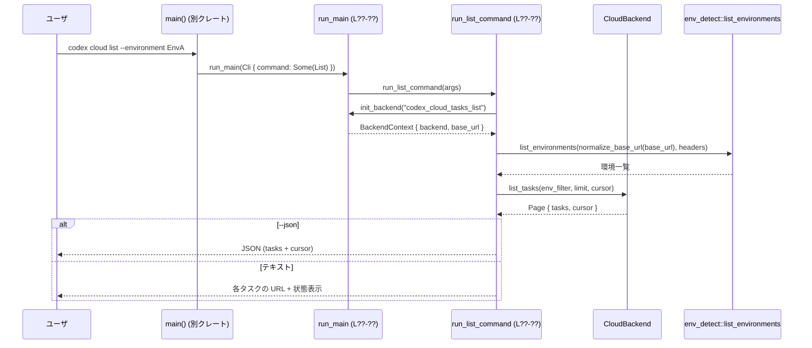
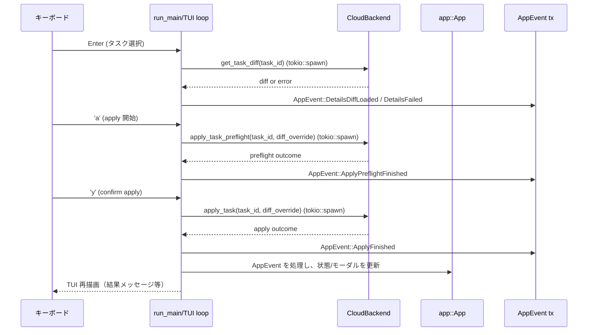

# cloud-tasks/src/lib.rs コード解説

> 注: 提供されたコード断片には実際の行番号が含まれていないため、本レポートでは定義位置を `cloud-tasks/src/lib.rs:L??-??` のように記載し、`??` で「行番号不明」を表します。

---

## 0. ざっくり一言

`cloud-tasks/src/lib.rs` は、`codex cloud` サブコマンドのエントリポイントです。  
CLI サブコマンド（exec/status/list/apply/diff）と、ターミナル UI (TUI) ベースのタスク一覧画面をまとめて実装し、クラウド側の `CloudBackend` と対話します。

---

## 1. このモジュールの役割

### 1.1 概要

- このモジュールは **ChatGPT/Codex のクラウドタスクを CLI / TUI から操作する**ための窓口です。
- HTTP バックエンドとの通信、環境 ID の解決、Git のブランチ名検出、タスクの一覧・詳細・適用（apply）などを提供します。
- 実行形式としては:
  - `codex cloud exec ...` 等の **一発 CLI コマンド**
  - `codex cloud`（引数なし）で起動する **対話的な TUI**
  をまとめてサポートします。

### 1.2 アーキテクチャ内での位置づけ

主な内部モジュールや外部クレートとの関係を簡略化すると、次のようになります。

```mermaid
graph TD
    Lib["lib.rs (run_main 他)"]
    Cli["cli モジュール<br/>CLI 引数定義"]
    App["app モジュール<br/>App/AppEvent/TUI 状態"]
    UI["ui モジュール<br/>TUI 描画"]
    EnvDetect["env_detect モジュール<br/>環境一覧/自動検出"]
    NewTask["new_task モジュール<br/>新規タスク入力ページ"]
    Util["util モジュール<br/>URL/認証/ログ 等"]
    CloudClient["codex_cloud_tasks_client<br/>CloudBackend/HttpClient"]
    MockClient["codex_cloud_tasks_mock_client<br/>(デバッグ用 Mock)"]
    GitUtils["codex_git_utils<br/>current/default branch"]
    Login["codex_login<br/>get_codex_user_agent 等"]
    TUI["codex_tui + ratatui + crossterm"]

    Lib --> Cli
    Lib --> App
    Lib --> UI
    Lib --> EnvDetect
    Lib --> NewTask
    Lib --> Util
    Lib --> CloudClient
    Lib --> MockClient
    Lib --> GitUtils
    Lib --> Login
    Lib --> TUI
```



- CLI 実行時は `main` から `run_main` が呼ばれ、このファイル経由で他モジュールを利用します。
- HTTP 通信や認証は `codex_cloud_tasks_client` / `codex_login` / `util` が担い、`lib.rs` はこれらをまとめてオーケストレーションします。

### 1.3 設計上のポイント

コードから読み取れる特徴を整理します。

- **責務分割**
  - `lib.rs` は「フロントコントローラ」の役割で、CLI/TUI からのフロー制御とバックエンドの初期化を担当します。
  - 詳細な描画や状態管理は `app` / `ui` / `new_task` / `env_detect` / `util` に委譲されています。
- **非同期処理と並行性**
  - すべての I/O は `async` + `tokio` で実装されています（`init_backend`, 各 `run_*_command`, TUI のイベントループからの `tokio::spawn` など）。
  - サーバー通信や重い処理は `tokio::spawn` でバックグラウンドに飛ばし、結果は `UnboundedSender<app::AppEvent>` で TUI スレッドに戻す構造になっています。
- **バックエンド抽象化**
  - `Arc<dyn codex_cloud_tasks_client::CloudBackend>` を使い、HTTP 実装とモック実装を抽象化しています（`BackendContext`）。
  - `CODEX_CLOUD_TASKS_MODE=mock`（デバッグビルド時のみ）でモッククライアントに切り替え可能です。
- **Git 情報の抽象化**
  - `GitInfoProvider` トレイトを導入し、`resolve_git_ref_with_git_info` をテストしやすくしています（テスト内で `StubGitInfo` を実装）。
- **エラーハンドリング**
  - 外部 API とのやり取り・ファイル IO などは `anyhow::Result` を使って早期 return する設計です。
  - 「ログインしていない」「タスクが READY でない」など、一部の条件では `std::process::exit` でプロセスを終了します。

---

## 2. 主要な機能一覧

このモジュールが提供する主な機能は次のとおりです。

- バックエンド初期化:
  - `init_backend` で HTTP クライアント、認証ヘッダ、ベース URL を設定し `CloudBackend` を構築。
- Git リファレンス解決:
  - `resolve_git_ref` / `resolve_git_ref_with_git_info` で、CLI 指定・カレントブランチ・デフォルトブランチから Git リファレンスを決定。
- CLI サブコマンド実装:
  - `run_exec_command`: プロンプトを元にクラウドタスクを新規作成。
  - `run_status_command`: タスクの状態を取得し、人間が読める形式で表示。
  - `run_list_command`: タスク一覧を JSON または人間向け表示で出力。
  - `run_diff_command`: タスクの diff を取得して標準出力に出力。
  - `run_apply_command`: diff をローカルに適用する apply 実行。
- タスク diff と試行管理:
  - `collect_attempt_diffs` / `select_attempt` で、タスクの diff と sibling attempts をまとめて管理。
- TUI（タスク一覧 UI）:
  - `run_main` の引数なしパスで TUI を起動。
  - `app::App` 状態と `app::AppEvent` イベントを中心に、タスク一覧・詳細・apply 操作を行う。
- テキスト整形ユーティリティ:
  - `format_task_status_lines`, `format_task_list_lines` で CLI/TUI 共有のステータス表示を構築。
  - `conversation_lines` でプロンプト + assistant メッセージから会話ログを生成。
  - `pretty_lines_from_error` で HTTP エラーの JSON を解析し、ユーザ向けメッセージに整形。

---

## 3. 公開 API と詳細解説

### 3.1 型一覧（構造体・列挙体・トレイト）

| 名前 | 種別 | 役割 / 用途 | 定義位置 |
|------|------|-------------|----------|
| `Cli` | 構造体（外部モジュール） | `codex cloud` の CLI 引数全体を表す。サブコマンドなども含む。`pub use cli::Cli` で再公開。 | `cli.rs`, 再公開: `cloud-tasks/src/lib.rs:L??-??` |
| `ApplyJob` | 構造体 | apply / preflight 用のジョブ。`task_id` とオプションの `diff_override` を束ねて非同期タスクに渡す。 | `cloud-tasks/src/lib.rs:L??-??` |
| `BackendContext` | 構造体 | `CloudBackend` と `base_url` をまとめて保持するコンテキスト。`init_backend` の戻り値。 | `cloud-tasks/src/lib.rs:L??-??` |
| `GitInfoProvider` | トレイト | Git のデフォルトブランチ・カレントブランチ名を取得する抽象インターフェース。テスト時に差し替え可能。 | `cloud-tasks/src/lib.rs:L??-??` |
| `RealGitInfo` | 構造体 | 実環境用の `GitInfoProvider` 実装。内部で `codex_git_utils::{default_branch_name,current_branch_name}` を呼び出す。 | `cloud-tasks/src/lib.rs:L??-??` |
| `AttemptDiffData` | 構造体（`Clone`, `Debug`） | 各 attempt の diff 情報（並び順のための `placement` / `created_at` と、実際の `diff` テキスト）を保持。 | `cloud-tasks/src/lib.rs:L??-??` |
| `StubGitInfo` | 構造体（テスト用） | テストで使用する `GitInfoProvider` のスタブ実装。任意のブランチ名を返す。 | `cloud-tasks/src/lib.rs`（`#[cfg(test)] mod tests` 内:L??-??） |

> `app::App`, `app::AppEvent`, `app::DiffOverlay` など TUI 状態・イベントの型は `app` モジュール側に定義されており、このファイルからは利用のみ行っています。

### 3.2 関数詳細（重要 API 7 件）

#### `pub async fn run_main(cli: Cli, _codex_linux_sandbox_exe: Option<PathBuf>) -> anyhow::Result<()>`

**概要**

- `codex cloud` サブコマンド全体のエントリポイントです。
- CLI 引数 `cli` にサブコマンドがあれば対応する `run_*_command` を呼び出し、なければ TUI（タスク一覧 UI）を起動します。  
  定義: `cloud-tasks/src/lib.rs:L??-??`

**引数**

| 引数名 | 型 | 説明 |
|--------|----|------|
| `cli` | `Cli` | 解析済みの CLI 引数。サブコマンドやオプションを含む。 |
| `_codex_linux_sandbox_exe` | `Option<PathBuf>` | インターフェース上の引数。現状コード中では未使用（アンダースコア付き）。 |

**戻り値**

- `anyhow::Result<()>`
  - 正常終了時: `Ok(())`
  - エラー時: `Err(anyhow::Error)`（ただし内部で `std::process::exit` を呼び出すケースもあり、その場合は戻りません）

**内部処理の流れ（CLI / TUI 分岐）**

1. `cli.command` を確認し、`Some` の場合は `match` でサブコマンドごとに分岐（`Exec`/`Status`/`List`/`Apply`/`Diff`）。  
   対応する `run_exec_command` などを `await` し、その `Result` をそのまま返します。
2. `cli.command` が `None` の場合:
   - `tracing_subscriber::fmt()` による簡易ログ設定を行います（環境変数の `RUST_LOG` 等を `EnvFilter` で読み取る）。  
     ANSI カラーは `stderr` が TTY のときのみ有効。
   - `init_backend("codex_cloud_tasks_tui")` を呼び出し、TUI 用の `CloudBackend` を構築します。
3. TUI 初期化:
   - `crossterm` を使用して
     - raw モード有効化
     - 代替スクリーン（`EnterAlternateScreen`）への切り替え
     - bracketed paste, keyboard enhancement flags の設定
   - `ratatui::Terminal<CrosstermBackend>` を作成し、画面をクリア。
4. アプリ状態初期化:
   - `let mut app = app::App::new();`
   - 初回タスク読み込み状態（`app.status = "Loading tasks…"` 等）、環境自動検出フラグ、`list_generation` カウンタ等を初期化。
5. 非同期バックグラウンド処理の起動:
   - `tokio::sync::mpsc::unbounded_channel::<app::AppEvent>()` でアプリイベント用チャネル (`tx`, `rx`) を作成。
   - `app::load_tasks` を `tokio::spawn` で実行し、結果を `AppEvent::TasksLoaded` 経由で送信。
   - `env_detect::list_environments`, `env_detect::autodetect_environment_id` を並列に実行し、環境リスト・自動検出結果をイベントで送信。
   - 別チャネル (`frame_tx`, `redraw_tx`) と `tokio::time::sleep_until` を使い、「次の再描画時刻」をスケジューリングする小さなコアレッサを起動。
6. メインイベントループ (`loop { tokio::select! { ... } }`):
   - 3 種類の入力を同時に待ちます。
     - `redraw_rx.recv()`: 描画要求（スピナーやペーストバーストのタイミング）。
     - `rx.recv()`: バックグラウンドからの `AppEvent`（タスク一覧ロード完了、新規タスク送信結果、apply 結果など）。
     - `events.next()`: `crossterm::event::EventStream` 経由のキーボード入力・ペースト・リサイズ等。
   - それぞれに対して
     - `app` の状態を更新
     - 必要なら `needs_redraw = true`
     - `frame_tx` への次回描画時刻の送信
     - 直後に `render_if_needed` で `ui::draw(f, app)` を呼び出して TUI を再描画
   - `'q'` / `Esc` / `Ctrl-C` 等の入力に応じてループを `break exit_code` します（`exit_code` は 0 またはエラーコード）。
7. 後処理:
   - `disable_raw_mode`, `LeaveAlternateScreen`, `DisableBracketedPaste`, `PopKeyboardEnhancementFlags` を呼び出し、ターミナル状態を復元。
   - 最後に `exit_code != 0` であれば `std::process::exit(exit_code)`、そうでなければ `Ok(())` を返します。

**Examples（使用例）**

典型的なバイナリクレートからの呼び出し例です。

```rust
use cloud_tasks::Cli;                         // lib.rs が pub use している Cli をインポート
use clap::Parser;                             // 例: clap で CLI をパースする場合

#[tokio::main]                                // tokio ランタイム上で実行
async fn main() -> anyhow::Result<()> {
    let cli = Cli::parse();                   // CLI 引数をパース
    cloud_tasks::run_main(cli, None).await    // codex cloud エントリを呼び出す
}
```

**Errors / Panics**

- 戻り値として `Err` を返すケース:
  - 内部で呼び出す `run_*_command` が `anyhow::Error` を返した場合。
  - TUI 初期化中の I/O エラー（`enable_raw_mode`, `EnterAlternateScreen`, `Terminal::new` など）。
- それとは別に、内部で `std::process::exit(code)` を呼ぶケースがあります。
  - TUI 終了後、`exit_code` が 0 以外のとき。
  - 各サブコマンド内部で「タスクが READY でない」「apply が失敗した」等の条件のときに exit することがあります。
- panic を行う明示的コード（`unwrap()` 等）はこのファイル内にはありません。

**Edge cases（エッジケース）**

- `run_main` が `tokio` ランタイム外から呼ばれた場合、コンパイルエラーにはなりませんが実行時に `tokio::spawn` 等が動かないため、通常は `#[tokio::main]` などのコンテキストで呼び出す前提です。
- TUI 実行中に SIGINT (Ctrl-C) を押した場合:
  - コンテキスト（モーダルや新規タスクページの有無）に応じて「モーダルを閉じる / 新規タスクをキャンセル / diff overlay を閉じる / プロセス終了」のいずれかになります。

**使用上の注意点**

- `run_main` は **非同期関数** なので、必ず tokio などの非同期ランタイム上で呼び出す必要があります。
- 一部のエラーは `Err` ではなく `std::process::exit` でプロセス終了します。ライブラリとしてではなく「CLI アプリのメイン」として使う前提の設計です。
- TUI 実行中のパニック等で `LeaveAlternateScreen` が呼ばれない場合、ターミナル状態が崩れる可能性があります。呼び出し側でパニックをキャッチする場合は注意が必要です。

---

#### `async fn init_backend(user_agent_suffix: &str) -> anyhow::Result<BackendContext>`

**概要**

- `CloudBackend` の実体（HTTP クライアント or モッククライアント）と `base_url` を初期化し、`BackendContext` として返します。  
  定義: `cloud-tasks/src/lib.rs:L??-??`

**引数**

| 引数名 | 型 | 説明 |
|--------|----|------|
| `user_agent_suffix` | `&str` | User-Agent に付与するサフィックス文字列。用途別に `"codex_cloud_tasks_exec"` などを指定。 |

**戻り値**

- `anyhow::Result<BackendContext>`
  - 成功: `BackendContext { backend: Arc<dyn CloudBackend>, base_url: String }`
  - 失敗: HTTP クライアント生成等の失敗時に `Err(anyhow::Error)`

**内部処理の流れ**

1. **モックモード判定（デバッグビルド時のみ）**
   - `CODEX_CLOUD_TASKS_MODE` 環境変数が `"mock"` / `"MOCK"` の場合、`codex_cloud_tasks_mock_client::MockClient` を `Arc` で包んだ `backend` を返す。
2. **ベース URL 取得**
   - `CODEX_CLOUD_TASKS_BASE_URL` 環境変数を参照し、なければ `"https://chatgpt.com/backend-api"` をデフォルトとして使用。
3. **User-Agent サフィックス設定**
   - `util::set_user_agent_suffix(user_agent_suffix)` を呼び出して、以後の HTTP クライアントに適用される UA に影響させる。
4. **`HttpClient` 構築**
   - `codex_cloud_tasks_client::HttpClient::new(base_url.clone())?` で HTTP クライアントを生成し、`with_user_agent(get_codex_user_agent())` を呼び出し。
   - `base_url` に `"/backend-api"` を含むかどうかで `style` を `"wham"` / `"codex-api"` としてログに書き込む（`append_error_log`）。
5. **認証処理**
   - `util::load_auth_manager().await` から auth manager を読み込み、`auth().await` で認証情報を取得。
   - 認証情報が得られない場合は `eprintln!` でメッセージを表示し、`std::process::exit(1)` で終了。
   - `auth.get_token()` でトークンを取得し、空 or エラーの場合も同様に exit(1)。
   - `http = http.with_bearer_token(token.clone())` で Bearer Token を設定。
   - `auth.get_account_id()` または `util::extract_chatgpt_account_id(&token)` からアカウント ID を取得できれば `with_chatgpt_account_id(acc)` でヘッダを追加し、ログに出力。
6. **結果の返却**
   - `BackendContext { backend: Arc::new(http), base_url }` を `Ok` で返す。

**Examples（使用例）**

```rust
async fn example() -> anyhow::Result<()> {
    // CLI サブコマンド実装などから利用する
    let ctx = init_backend("codex_cloud_tasks_list").await?;
    // ctx.backend を使って CloudBackend メソッドを呼び出す
    let page = codex_cloud_tasks_client::CloudBackend::list_tasks(
        &*ctx.backend,
        None,
        Some(10),
        None,
    ).await?;
    println!("Fetched {} tasks from {}", page.tasks.len(), ctx.base_url);
    Ok(())
}
```

**Errors / Panics**

- `HttpClient::new` が失敗した場合など、`?` で `Err` が返されます。
- 認証情報が取得できない、トークンが空などのケースでは `std::process::exit(1)` が呼ばれます。
- 明示的な panic 呼び出しはありません。

**Edge cases**

- `CODEX_CLOUD_TASKS_MODE` が `mock` であっても、`#[cfg(debug_assertions)]` が付いているため **リリースビルドでは無視** されます。
- `CODEX_CLOUD_TASKS_BASE_URL` に任意の URL を設定できますが、その結果 `task_url` の表示や path style（`wham` vs `codex-api`）が変わるだけで、追加の検証は行っていません。

**使用上の注意点**

- ライブラリとして再利用する場合でも、認証エラー時にプロセスを終了する点に注意が必要です。
- `backend` は `Arc<dyn CloudBackend>` でスレッドセーフに共有されますが、大量の並列リクエストを発行する設計ではないため、負荷制御は呼び出し側で考慮する必要があります。

---

#### `async fn run_list_command(args: crate::cli::ListCommand) -> anyhow::Result<()>`

**概要**

- `codex cloud list` サブコマンドの実装です。
- 指定された環境 ID でタスク一覧を取得し、JSON または人間向けのテキストとして標準出力に表示します。  
  定義: `cloud-tasks/src/lib.rs:L??-??`

**引数**

| 引数名 | 型 | 説明 |
|--------|----|------|
| `args` | `crate::cli::ListCommand` | `--environment`, `--limit`, `--cursor`, `--json` 等を含む list サブコマンド引数。 |

**戻り値**

- `anyhow::Result<()>`  
  - 取得や表示に失敗した場合は `Err` を返します。

**内部処理の流れ**

1. `init_backend("codex_cloud_tasks_list")` で `BackendContext` を構築。
2. `args.environment` が `Some(env)` の場合は `resolve_environment_id(&ctx, &env).await?` を呼び出して **ラベル/ID の曖昧さを解決** し、`env_filter` に確定した ID を設定。
3. `codex_cloud_tasks_client::CloudBackend::list_tasks` を呼び出し、タスク一覧ページ（タスク配列＋`cursor`）を取得。
4. `args.json` に応じて分岐:
   - `true` の場合
     - 各タスクを JSON オブジェクトにマッピングし、`tasks` 配列と `cursor` を含む JSON を `serde_json::to_string_pretty` で整形して出力。
   - `false` の場合
     - `page.tasks` が空なら `"No tasks found."` を出力して終了。
     - そうでなければ `Utc::now()` と `supports_color::on` に基づいて `colorize` を決定し、`format_task_list_lines` で行単位の文字列を生成して出力。
     - `page.cursor` が `Some` の場合は「次ページを取得するための CLI コマンド」を案内として出力（`codex cloud list --cursor='...'`）。

**Examples（使用例）**

```rust
// CLI から: タスクを 20 件まで JSON で取得
// $ codex cloud list --limit=20 --json

// Rust コードから直接呼ぶ場合（テスト等）
async fn example_list() -> anyhow::Result<()> {
    use crate::cli::ListCommand;

    let args = ListCommand {
        environment: None,
        limit: 10,
        cursor: None,
        json: false,
    };
    run_list_command(args).await
}
```

**Errors / Panics**

- `init_backend` や `resolve_environment_id`, `CloudBackend::list_tasks`, `serde_json::to_string_pretty` が失敗した場合、それぞれ `?` で `Err` が返されます。
- `run_list_command` 自体は `std::process::exit` を呼びません（`status` や `apply` と異なり、終了コードは常に 0 になります）。

**Edge cases**

- 指定した環境ラベルが存在しない場合:
  - `resolve_environment_id` が `"environment '{trimmed}' not found; ..."` というエラーを返します。
- 指定したラベルが複数の異なる ID にマッチする場合:
  - `"environment label '{trimmed}' is ambiguous; ..."` でエラーになります。
- `limit` や `cursor` の不正値については、ここでは検証せず `CloudBackend::list_tasks` に委ねています。

**使用上の注意点**

- JSON 出力のスキーマ:
  - `id`, `url`, `title`, `status`, `updated_at`, `environment_id`, `environment_label`, `summary(files_changed / lines_added / lines_removed)`, `is_review`, `attempt_total` が含まれます。パースする側はこの構造に依存できます。
- ページング:
  - `cursor` が存在する場合、後続ページ取得には表示された CLI コマンドをそのまま実行することが想定されています。

---

#### `async fn resolve_environment_id(ctx: &BackendContext, requested: &str) -> anyhow::Result<String>`

**概要**

- ユーザが指定した環境文字列（ID またはラベル）を受け取り、実際に `CloudBackend` に渡すべき **環境 ID** を決定します。  
  定義: `cloud-tasks/src/lib.rs:L??-??`

**引数**

| 引数名 | 型 | 説明 |
|--------|----|------|
| `ctx` | `&BackendContext` | `base_url` を含むバックエンドコンテキスト。 |
| `requested` | `&str` | CLI などでユーザが指定した環境文字列（ID またはラベルのつもり）。 |

**戻り値**

- `anyhow::Result<String>`  
  - 成功: 確定した環境 ID 文字列。
  - 失敗: 入力空、環境なし、見つからない、あいまい、などの条件で `Err`。

**内部処理の流れ**

1. `requested.trim()` を取得し、空なら `anyhow!("environment id must not be empty")` でエラー。
2. `util::normalize_base_url(&ctx.base_url)` でベース URL を正規化。
3. `util::build_chatgpt_headers().await` でヘッダを作成。
4. `env_detect::list_environments(&normalized, &headers).await?` を呼び出し、利用可能な環境一覧（`EnvironmentRow` の配列）を取得。
5. 環境が 1 件もなければ `"no cloud environments are available for this workspace"` でエラー。
6. ID マッチの探索:
   - `environments.iter().find(|row| row.id == trimmed)` が見つかれば、その `row.id` を返す。
7. ラベルマッチの探索:
   - `row.label.as_deref().map(|label| label.eq_ignore_ascii_case(trimmed))` で大文字小文字を無視してマッチする行を列挙。
   - マッチが 0 件: `"environment '{trimmed}' not found; run 'codex cloud' ..."` でエラー。
   - マッチが 1 件: その `id` を返す。
   - マッチが 2 件以上:
     - すべて同じ `id` を指していればその `id` を返す（ラベル重複だが実体が同一）。
     - 異なる `id` が混在していれば `"label ... is ambiguous"` でエラー。

**Examples（使用例）**

```rust
async fn example_resolve(ctx: &BackendContext) -> anyhow::Result<()> {
    // 直接 ID を指定
    let id = resolve_environment_id(ctx, "env-123").await?;
    assert_eq!(id, "env-123");

    // ラベルから解決
    let id2 = resolve_environment_id(ctx, "Production").await?;
    println!("Resolved Production -> {}", id2);
    Ok(())
}
```

**Errors / Panics**

- 環境文字列が空 or 空白のみ: `"environment id must not be empty"`.
- `list_environments` が 0 件を返した場合: `"no cloud environments are available for this workspace"`.
- ID/ラベルの両方でマッチが見つからない場合: `"environment '{trimmed}' not found; ..."`。
- ラベルが複数環境を指しており、それらの `id` が異なる場合: `"label ... is ambiguous; ..."`。
- パニックはありません。

**Edge cases**

- ラベル付き環境と ID 直接指定が混在している場合でも、ID が優先されます。
- ラベル検索時に ASCII 大文字小文字のみ無視します。ロケール依存の大文字小文字変換は行いません。

**使用上の注意点**

- CLI からこの関数を使う場合、エラーメッセージはそのままユーザ向けに表示される前提で分かりやすい文言になっています。
- TUI 側では、別のロジック（`app.env_modal` や `App.environments`）で環境を扱っているため、この関数は主に CLI サブコマンド向けです。

---

#### `fn resolve_query_input(query_arg: Option<String>) -> anyhow::Result<String>`

**概要**

- `codex cloud exec` のクエリ文字列を決定します。
- 引数が与えられていればそれを、`"-"` または未指定の場合は標準入力（stdin）から読み込みます。  
  定義: `cloud-tasks/src/lib.rs:L??-??`

**引数**

| 引数名 | 型 | 説明 |
|--------|----|------|
| `query_arg` | `Option<String>` | CLI から渡されたクエリ文字列。`"-"` の場合は「stdin を強制」の意味。 |

**戻り値**

- `anyhow::Result<String>`  
  - 成功: クエリ文字列。
  - 失敗: 入力が空、stdin 読み込み失敗など。

**内部処理の流れ**

1. `match query_arg`:
   - `Some(q) if q != "-"` の場合はそのまま `Ok(q)`。
   - それ以外（`None` または `Some("-".to_string())`）の場合は stdin から読む。
2. stdin 分岐:
   - `force_stdin = matches!(maybe_dash.as_deref(), Some("-"))`。
   - `std::io::stdin().is_terminal()` かつ `!force_stdin` の場合:
     - 「パイプされていないのに引数もない」と見なし、  
       `"no query provided. Pass one as an argument or pipe it via stdin."` でエラー。
   - `!force_stdin` なら `"Reading query from stdin..."` を `stderr` に出力。
   - `stdin.read_to_string(&mut buffer)` で全文を読み込み、失敗したら `"failed to read query from stdin: {e}"` でエラー。
   - `buffer.trim().is_empty()` の場合 `"no query provided via stdin (received empty input)."` でエラー。
3. 上記を満たす場合、`Ok(buffer)` を返す。

**Examples（使用例）**

```rust
// クエリを直接指定
let q = resolve_query_input(Some("Refactor this function".to_string()))?;

// クエリを標準入力から読み込み（CLI 側で "-" を渡した想定）
let q_stdin = resolve_query_input(Some("-".to_string()))?;
```

**Errors / Panics**

- CLI 引数も stdin も空のとき:
  - `"no query provided. Pass one as an argument or pipe it via stdin."`
- stdin が空白のみの場合:
  - `"no query provided via stdin (received empty input)."`
- stdin 読み込みに失敗した場合:
  - `"failed to read query from stdin: {e}"`

**Edge cases**

- 端末からインタラクティブに実行し、クエリ引数が `None` の場合は **即時エラー** になります（stdin を待たずに終了）。
- `"-"` を渡した場合は `is_terminal()` に関係なく stdin を読み込みます。

**使用上の注意点**

- この関数は **ブロッキングで stdin を読み込む** ため、非同期コンテキスト（tokio）であっても `tokio::task::spawn_blocking` などには包んでいません。CLI コマンド実行時のみ想定している点に注意が必要です。

---

#### `async fn collect_attempt_diffs(backend: &dyn CloudBackend, task_id: &TaskId) -> anyhow::Result<Vec<AttemptDiffData>>`

**概要**

- タスクの diff および sibling attempts の diff をまとめて取得し、ソートされた `AttemptDiffData` のリストとして返します。  
  定義: `cloud-tasks/src/lib.rs:L??-??`

**引数**

| 引数名 | 型 | 説明 |
|--------|----|------|
| `backend` | `&dyn codex_cloud_tasks_client::CloudBackend` | タスク情報を取得するバックエンド。 |
| `task_id` | `&codex_cloud_tasks_client::TaskId` | diff を取得したいタスクの ID。 |

**戻り値**

- `anyhow::Result<Vec<AttemptDiffData>>`
  - 成功: 各 attempt の diff を格納したベクタ。
  - 失敗: HTTP エラーなどで `Err`、または diff が一つもない場合は `Err` で「まだ実行中かも」と伝える。

**内部処理の流れ**

1. `CloudBackend::get_task_text(backend, task_id.clone()).await?` を呼び出し、タスク本文（`text`）を取得。
2. `CloudBackend::get_task_diff(backend, task_id.clone()).await?` でメイン attempt の diff を取得。
   - `Some(diff)` であれば `AttemptDiffData { placement: text.attempt_placement, created_at: None, diff }` を `attempts` ベクタに push。
3. `text.turn_id` が `Some(turn_id)` の場合:
   - `CloudBackend::list_sibling_attempts(backend, task_id.clone(), turn_id).await?` で sibling attempts を取得。
   - 各 sibling について、`sibling.diff` が `Some(diff)` なら `AttemptDiffData { placement: sibling.attempt_placement, created_at: sibling.created_at, diff }` を追加。
4. `attempts.sort_by(cmp_attempt)` で並び替え。
   - `cmp_attempt` は `placement` を優先し、なければ `created_at` で比較し、それもない場合は `Ordering::Equal` とするルール。
5. `attempts.is_empty()` なら
   - `"No diff available for task {}; it may still be running."` というメッセージで `anyhow::bail!`。
6. それ以外の場合は `Ok(attempts)`。

**Examples（使用例）**

```rust
async fn show_first_attempt_diff(
    backend: &dyn codex_cloud_tasks_client::CloudBackend,
    id: &codex_cloud_tasks_client::TaskId,
) -> anyhow::Result<()> {
    let attempts = collect_attempt_diffs(backend, id).await?;
    if let Some(first) = attempts.first() {
        println!("{}", first.diff);
    }
    Ok(())
}
```

**Errors / Panics**

- `get_task_text`, `get_task_diff`, `list_sibling_attempts` が返すエラーはそのまま `Err` となります。
- diff が一つも見つからない場合は明示的にエラーになります（「タスクがまだ実行中」の可能性のメッセージ付き）。
- パニックはありません。

**Edge cases**

- メイン attempt に diff がなく、sibling のみが diff を持つ場合:
  - sibling の diff だけがリストに含まれます。
- `attempt_placement` も `created_at` も `None` の attempt 同士は相互に `Ordering::Equal` となり、元の順序が保たれる（安定ソートの前提はありませんが、多くの場合問題になりません）。

**使用上の注意点**

- `select_attempt` と組み合わせることで CLI から `--attempt` を指定するなどのユースケースに使えます。
- diff がない状態を「正常ケース」として扱いたい場合は、この関数のエラーをそのままユーザに表示するのではなく、上位でメッセージを調整する必要があります。

---

#### `fn select_attempt(attempts: &[AttemptDiffData], attempt: Option<usize>) -> anyhow::Result<&AttemptDiffData>`

**概要**

- `collect_attempt_diffs` で取得した attempt のリストから、1-origin のインデックスで指定された attempt を選択します。  
  定義: `cloud-tasks/src/lib.rs:L??-??`

**引数**

| 引数名 | 型 | 説明 |
|--------|----|------|
| `attempts` | `&[AttemptDiffData]` | 利用可能な attempt のリスト。 |
| `attempt` | `Option<usize>` | 1-origin の attempt 番号。`None` の場合は 1 (= 最初) を意味する。 |

**戻り値**

- `anyhow::Result<&AttemptDiffData>`
  - 成功: 指定された attempt への参照。
  - 失敗: リスト空、範囲外インデックスなど。

**内部処理の流れ**

1. `attempts.is_empty()` なら `"No attempts available"` でエラー。
2. `desired = attempt.unwrap_or(1)`。
3. `idx = desired.checked_sub(1).ok_or_else(|| anyhow!("attempt must be at least 1"))?` で 0 未満チェック。
4. `idx >= attempts.len()` なら `"Attempt {desired} not available; only {} attempt(s) found"` でエラー。
5. `Ok(&attempts[idx])` を返す。

**Examples（使用例）**

```rust
let attempts = collect_attempt_diffs(backend, &task_id).await?;
let selected = select_attempt(&attempts, Some(2))?; // 2 番目の attempt
println!("{}", selected.diff);
```

**Errors / Panics**

- `attempts` が空: `"No attempts available"`.
- `attempt` が 0 や負数を表すような値（usize なので実質 0）: `"attempt must be at least 1"`.
- `attempt` > `attempts.len()`: `"Attempt {desired} not available; only {len} attempt(s) found"`。

**Edge cases**

- `attempt: None` の場合は常に 1 番目（index 0）が選ばれます。
- `attempt = 1` かつ `attempts` が 1 つだけなら必ず成功します（テストで確認されています）。

**使用上の注意点**

- 1-origin なので、ユーザに表示する attempt 番号と整合が取りやすくなっています（CLI `--attempt` 等）。

---

#### `fn spawn_apply(...) -> bool` / `fn spawn_preflight(...) -> bool`

**シグネチャ（簡略）**

```rust
fn spawn_preflight(
    app: &mut app::App,
    backend: &Arc<dyn CloudBackend>,
    tx: &UnboundedSender<app::AppEvent>,
    frame_tx: &UnboundedSender<Instant>,
    title: String,
    job: ApplyJob,
) -> bool

fn spawn_apply(
    app: &mut app::App,
    backend: &Arc<dyn CloudBackend>,
    tx: &UnboundedSender<app::AppEvent>,
    frame_tx: &UnboundedSender<Instant>,
    job: ApplyJob,
) -> bool
```

**概要**

- TUI で diff を apply する際に、実際の HTTP リクエストを **バックグラウンドタスクとして起動** するヘルパーです。
- `spawn_preflight` は `apply_task_preflight` を、`spawn_apply` は `apply_task` を非同期で呼び出し、結果を `AppEvent` として UI に返します。  
  定義: `cloud-tasks/src/lib.rs:L??-??`

**引数**

共通の意味:

| 引数名 | 型 | 説明 |
|--------|----|------|
| `app` | `&mut app::App` | UI の状態。apply の in-flight フラグなどを更新する。 |
| `backend` | `&Arc<dyn CloudBackend>` | サーバー側 apply エンドポイントに接続するバックエンド。 |
| `tx` | `&UnboundedSender<app::AppEvent>` | apply 結果をメイン UI ループに返すためのイベントチャネル。 |
| `frame_tx` | `&UnboundedSender<Instant>` | スピナーなど描画更新のためのフレーム要求チャネル。 |
| `title` (`spawn_preflight`のみ) | `String` | モーダル等に表示するタスクタイトル。 |
| `job` | `ApplyJob` | `task_id` と `diff_override` を含む apply ジョブ。 |

**戻り値**

- `bool`
  - `true`: apply / preflight を新規に開始した。
  - `false`: 既に apply / preflight が走っていて開始できなかった（状態メッセージは `app.status` に設定）。

**内部処理の流れ**

共通部分:

1. 状態チェック:
   - `spawn_preflight`:
     - `app.apply_inflight` が `true` なら `"An apply is already running; ..."`, `false` を返す。
     - `app.apply_preflight_inflight` が `true` なら `"A preflight is already running; ..."`, `false` を返す。
   - `spawn_apply`:
     - `app.apply_inflight` が `true` なら `"An apply is already running; ..."`, `false`。
     - `app.apply_preflight_inflight` が `true` なら `"Finish the current preflight before starting another apply."`, `false`。
2. フラグ更新とフレームスケジューリング:
   - それぞれ `app.apply_preflight_inflight = true` または `app.apply_inflight = true` に設定。
   - `frame_tx.send(Instant::now() + Duration::from_millis(100))` で近い将来の再描画を要求。
3. バックグラウンドタスク起動:
   - `let backend = backend.clone(); let tx = tx.clone();`
   - `tokio::spawn(async move { ... })` で非同期タスクを起動し、`CloudBackend::apply_task_preflight` または `CloudBackend::apply_task` を実行。
   - 結果を `app::AppEvent::{ApplyPreflightFinished, ApplyFinished}` に変換し、`tx.send(event)` で送信（送信失敗は無視）。

`spawn_preflight` 特有:

- 成功時は `level_from_status(outcome.status)` を用いて `app::ApplyResultLevel` にマッピングし、`skipped_paths`・`conflict_paths` をイベントに含めます。
- エラー時は `"Preflight failed: {e}"` のメッセージと `ApplyResultLevel::Error` を返します。

`spawn_apply` 特有:

- 成功時は `result: Ok(outcome)` を、エラー時は `result: Err(format!("{e}"))` を `AppEvent::ApplyFinished` に乗せて返します。

**Examples（使用例）**

TUI の diff overlay から apply を開始する部分（抜粋）:

```rust
if let Some(task) = app.tasks.get(app.selected).cloned() {
    match CloudBackend::get_task_diff(&*backend, task.id.clone()).await {
        Ok(Some(diff)) => {
            let job = ApplyJob { task_id: task.id.clone(), diff_override: Some(diff) };
            if spawn_preflight(&mut app, &backend, &tx, &frame_tx, task.title.clone(), job) {
                // モーダル表示など
            }
        }
        _ => { app.status = "No diff available to apply".to_string(); }
    }
}
```

**Errors / Panics**

- 関数自体は `Result` を返さず、失敗しても `false` を返すのみです。
- `tokio::spawn` 内部で発生した `CloudBackend` のエラーは `ApplyFinished` / `ApplyPreflightFinished` イベントに `Err` として封じ込められます。
- `tx.send(event)` が失敗した場合（UI 側が既に drop 済み）は無視されます。
- panic は書かれていません。

**Edge cases**

- apply / preflight 中にさらに apply を開始しようとした場合:
  - 状態メッセージが `app.status` に設定され、`false` が返ります（新しい apply は開始されません）。
- `job.diff_override` が `None` の場合は、サーバー側が diff を決定する仕様が想定されます（コード上では追加チェックをしていません）。

**使用上の注意点**

- `app` への変更は呼び出しスレッドでのみ行われ、バックグラウンドタスクは `AppEvent` で結果を返すだけなので、Rust の所有権・並行性の観点から **データ競合は避けられる構造** になっています。
- `UnboundedSender` を使っているため、イベントが大量にたまるとメモリを消費し続ける可能性がありますが、UI アプリケーションの性質上、想定されるイベント量は限定的と考えられます（コード上に明示的な制限はありません）。

---

### 3.3 その他の関数（インベントリー）

主要度の低いヘルパー関数・CLI コマンドを一覧します。

| 関数名 | 役割（1 行） | 定義位置 |
|--------|--------------|----------|
| `resolve_git_ref` | CLI 等から使う Git ブランチ名解決の表向き関数。`branch_override` があればそれを、なければカレント→デフォルト→`"main"` の順で返す。 | `cloud-tasks/src/lib.rs:L??-??` |
| `resolve_git_ref_with_git_info` | `GitInfoProvider` を注入可能にしたテスト向けバージョン。`StubGitInfo` と組み合わせてテストされる。 | 同上 |
| `run_exec_command` | `codex cloud exec` 実装。`resolve_query_input` でクエリを取得し、`resolve_environment_id` と `resolve_git_ref` を用いて `create_task` を呼び出す。 | `cloud-tasks/src/lib.rs:L??-??` |
| `parse_task_id` | 生の ID 文字列または URL からタスク ID 部分のみを抽出し `TaskId` を構築。空入力はエラー。 | 同上 |
| `cmp_attempt` | `AttemptDiffData` 同士の比較関数。`placement` → `created_at` の順に比較する。 | 同上 |
| `task_status_label` | `TaskStatus`（Pending/Ready/Applied/Error）を大文字ラベル文字列に変換。 | 同上 |
| `summary_line` | `DiffSummary` から `"+5/-2 • 3 files"` のような概要行を生成。カラー表示にも対応。 | 同上 |
| `format_task_status_lines` | タスク 1 件のステータスとメタ情報を複数行のテキストに整形。`[READY] Title`, `Env • 0s ago`, `+5/-2...` 等。 | 同上 |
| `format_task_list_lines` | 複数タスクを URL + ステータス表示のリストに整形。タスク間を空行で区切る。 | 同上 |
| `run_status_command` | `codex cloud status` 実装。タスクの `TaskSummary` を取得して表示し、`status != READY` なら `exit(1)`。 | 同上 |
| `run_diff_command` | `codex cloud diff` 実装。`collect_attempt_diffs` と `select_attempt` を使って diff を標準出力に出す。 | 同上 |
| `run_apply_command` | `codex cloud apply` 実装。diff を取得して `apply_task` を呼び、成功でない場合 `exit(1)`。 | 同上 |
| `level_from_status` | `ApplyStatus` を UI 用の `app::ApplyResultLevel` にマッピングするヘルパー。 | 同上 |
| `conversation_lines` | `prompt` と `messages` から `"user:"`, `"assistant:"` プレフィックス付きのプレーンテキスト会話ログを生成し、TUI に表示しやすくする。 | 同上 |
| `pretty_lines_from_error` | HTTP エラーメッセージから JSON ボディを抽出し、エラーコードや最新イベント等を人間向けの複数行に整形。 | 同上 |

---

## 4. データフロー

### 4.1 CLI サブコマンド（例: `codex cloud list`）

CLI 経由でタスク一覧を取得する代表的なフローです。



要点:

- 認証・HTTP クライアント構築は `init_backend` に集約されています。
- 環境 ID の解決は `env_detect::list_environments` → `resolve_environment_id` 経由で行われます。
- `CloudBackend` はライブラリクレートに属し、`lib.rs` からは非同期メソッドを呼ぶだけです。

### 4.2 TUI におけるタスク詳細表示 + apply フロー（概要）



要点:

- `tokio::spawn` でバックエンド呼び出しを行い、UI スレッドはブロックしません。
- 結果は `AppEvent` として `rx.recv()` 経由でメインループに戻り、`app::App` が更新されます。
- apply の多重実行は `app.apply_inflight` / `app.apply_preflight_inflight` フラグでガードされています。

---

## 5. 使い方（How to Use）

### 5.1 基本的な使用方法（CLI）

**エグゼキュタブルの main**

```rust
use cloud_tasks::Cli;
use clap::Parser;

#[tokio::main]
async fn main() -> anyhow::Result<()> {
    let cli = Cli::parse();              // clap などを使って CLI 引数をパース
    cloud_tasks::run_main(cli, None).await
}
```

**代表的な CLI コマンド**

- 新規タスク作成:

  ```bash
  # クエリを引数で直接指定
  codex cloud exec "Refactor this file"

  # クエリを stdin から渡す
  git diff | codex cloud exec -
  ```

- タスク一覧:

  ```bash
  codex cloud list                      # すべての環境
  codex cloud list --environment prod   # 環境ラベル/ID を指定
  codex cloud list --json               # JSON 形式で出力
  ```

- タスク状態:

  ```bash
  codex cloud status https://chatgpt.com/codex/tasks/task_i_123456
  # READY でなければ exit code 1
  ```

- diff の取得:

  ```bash
  codex cloud diff task_i_123456
  codex cloud diff task_i_123456 --attempt 2
  ```

- apply の実行:

  ```bash
  codex cloud apply task_i_123456      # 成功でない場合 exit code 1
  ```

### 5.2 基本的な使用方法（TUI）

CLI でサブコマンドを指定せずに実行すると TUI が起動します。

```bash
codex cloud
```

TUI の主な操作（コードから読み取れる範囲）:

- ベースリストビュー:
  - `j` / `Down`: 次のタスクへ。
  - `k` / `Up`: 前のタスクへ。
  - `Enter`: 選択中タスクの詳細 overlay を開き、diff または会話ログを読み込み開始。
  - `a`: 選択中タスクの diff を取得し、preflight + apply モーダルを開く。
  - `o`: 環境選択モーダルを開く（env filter の変更）。
  - `n`: 新規タスク作成ページを開く。
  - `r`: タスク一覧を再読み込み。
  - `q` / `Esc`: TUI を終了。
- diff overlay:
  - `Left` / `Right`: diff とプロンプトの表示切り替え。
  - `Tab` / `[` / `]`: attempt 間の切り替え。
  - `a`: 現在の diff で apply preflight → apply モーダル。
  - `q` / `Esc`: overlay を閉じる。
- 新規タスクページ:
  - テキスト入力フィールド（`codex_tui::ComposerInput`）にクエリを入力。
  - `Ctrl+O` or `^O`: 環境選択モーダルを開く。
  - `Enter`: env が選択されていればタスク作成を送信。
  - `Esc`: 新規タスクページを閉じる。

### 5.3 よくある間違い

コードから想定される誤用パターン:

```rust
// 間違い例: tokio ランタイム外から run_main を呼び出す
fn main() {
    let cli = Cli::parse();
    // コンパイルは通っても実行時に問題が起こりうる
    let _ = cloud_tasks::run_main(cli, None); // await していない
}

// 正しい例: tokio ランタイム + await
#[tokio::main]
async fn main() -> anyhow::Result<()> {
    let cli = Cli::parse();
    cloud_tasks::run_main(cli, None).await
}
```

```bash
# 間違い例: クエリを指定せず、パイプもしていない
$ codex cloud exec
# -> "no query provided. Pass one as an argument or pipe it via stdin."

# 正しい例
$ echo "Refactor this" | codex cloud exec -
```

### 5.4 使用上の注意点（まとめ）

- **非同期ランタイム**
  - すべての外部 API 呼び出しや TUI は tokio を前提としています。`run_main` を同期関数から直接呼ぶことは避ける必要があります。
- **プロセス終了**
  - `init_backend` や `run_status_command`, `run_apply_command`, TUI 後処理などで `std::process::exit` が使われています。ライブラリとしてではなく、CLI エントリとして利用する設計です。
- **認証・セキュリティ**
  - 認証情報がない場合は「ログインしてください」とメッセージを出して即時 `exit(1)` します。トークンやアカウント ID はログには書き出さず、`account_id` のみをログ出力しています。
- **並行性**
  - `Arc<dyn CloudBackend>` と `tokio::spawn` を使い、UI スレッドとは別のタスクで HTTP 呼び出しを実行しています。
  - `app::App` は単一スレッド（メイン TUI ループ）でのみ変更され、バックグラウンドタスクは `AppEvent` 経由で結果を渡すだけなので、データ競合は起こりにくい構造です。
- **ログと観測性**
  - `append_error_log` によって `error.log` ファイル等に詳細なログを残しつつ、ユーザ向けには短いステータスメッセージだけを表示する設計になっています。
  - `tracing_subscriber` によるログは環境変数（例: `RUST_LOG=cloud_tasks=debug`）で制御できます。

---

## 6. 変更の仕方（How to Modify）

### 6.1 新しい機能を追加する場合（例: 新サブコマンド）

1. **CLI 定義の拡張**
   - `cli` モジュールで `Command` enum に新しいバリアント（例: `Command::History(...)`）を追加し、必要な引数構造体を定義します。
2. **サブコマンド実装関数の追加**
   - 本ファイルに `async fn run_history_command(args: crate::cli::HistoryCommand) -> anyhow::Result<()>` のような関数を追加し、`init_backend` と `CloudBackend` の適切なメソッドを呼び出して実装します。
3. **`run_main` の分岐に追加**
   - `run_main` の `match command { ... }` に `Command::History(args) => run_history_command(args).await,` を追加します。
4. **TUI 統合（必要なら）**
   - TUI 側からも新機能を使いたい場合は、`app::AppEvent` と `ui::draw` のロジックに新しいイベント・ステータス表示を追加します。

### 6.2 既存の機能を変更する場合（注意点）

- **影響範囲の確認**
  - `run_*_command` や `format_task_*` の変更は CLI 出力フォーマットに影響します。テストモジュールの該当テスト（`format_task_status_lines_*` 等）と下流のツール（JSON パーサなど）への影響を確認する必要があります。
- **契約（前提条件・返り値の意味）**
  - 例えば `resolve_environment_id` は「空文字列を受け取るとエラー」という契約をもっています。ここを変えると CLI エラーメッセージや TUI の動作が変化する可能性があります。
- **テストの更新**
  - 既存テスト:
    - `resolve_git_ref_with_git_info` の挙動
    - `format_task_status_lines`, `format_task_list_lines`
    - `collect_attempt_diffs`, `select_attempt`, `parse_task_id`
    - `ComposerInput` の描画
  - これらの関数に変更を加えた場合は、テストの期待値も合わせて更新する必要があります。

---

## 7. 関連ファイル

このモジュールと密接に関係するファイル・ディレクトリは次のとおりです。

| パス | 役割 / 関係 |
|------|------------|
| `cloud-tasks/src/cli.rs` | `Cli` 構造体および `Command` enum、各サブコマンド用引数型を定義。`lib.rs` から `pub use` される。 |
| `cloud-tasks/src/app.rs` | TUI 用のアプリケーション状態 `App` やイベント `AppEvent`、diff overlay・環境行など UI ロジックの中核を定義。 |
| `cloud-tasks/src/ui.rs` | `ui::draw` 関数で `ratatui` による画面描画を実装。`run_main` の TUI ループから呼び出される。 |
| `cloud-tasks/src/env_detect.rs` | `list_environments`, `autodetect_environment_id` など、クラウド環境の検出・一覧取得ロジックを提供。 |
| `cloud-tasks/src/new_task.rs` | `NewTaskPage` 型など、新規タスク作成画面の状態と操作を定義。TUI で `n` キー等から利用。 |
| `cloud-tasks/src/scrollable_diff.rs` | diff 表示用のスクロール状態管理 (`ScrollState` 等) を提供し、`app::DiffOverlay` から利用される。 |
| `cloud-tasks/src/util.rs` | `task_url`, `normalize_base_url`, `build_chatgpt_headers`, `load_auth_manager`, `append_error_log`, `set_user_agent_suffix`, `extract_chatgpt_account_id` などのユーティリティ群。 |
| `codex_cloud_tasks_client` クレート | `CloudBackend` トレイトと HTTP 実装 `HttpClient`、`TaskSummary`, `DiffSummary`, `ApplyStatus` 等のドメイン型を提供。 |
| `codex_cloud_tasks_mock_client` クレート | デバッグ用のモック `MockClient` 実装を提供し、`CODEX_CLOUD_TASKS_MODE=mock` で使用される（debug ビルドのみ）。 |
| `codex_git_utils` クレート | `current_branch_name`, `default_branch_name` を提供し、`RealGitInfo` から利用。 |
| `codex_tui` クレート | `ComposerInput` など、TUI 用の入力コンポーネントを提供。新規タスクページ等で利用。 |

---

## 付録: テスト・安全性・セキュリティ観点の補足

- **テスト**
  - Git リファレンス解決 (`resolve_git_ref_with_git_info` + `StubGitInfo`) の各フォールバックパターンが `#[tokio::test]` で検証されています。
  - ステータス表示やタスク一覧表示のフォーマットが `pretty_assertions::assert_eq!` で固定されており、出力仕様を変更する際のリグレッション検知に役立ちます。
  - `collect_attempt_diffs` は `MockClient` を使って sibling attempts を含めて 2 件取得できることをテストしています。
  - `parse_task_id` の URL/生 ID/空文字処理、`select_attempt` の境界チェックなどもカバーされています。
- **安全性（Rust 言語的）**
  - このファイル内に `unsafe` ブロックは存在せず、すべて安全な Rust で記述されています。
  - 並行処理は `Arc` とチャネル（`tokio::sync::mpsc::UnboundedSender`）経由で行われ、共有状態の変更はメイン TUI ループのスレッドに限定されています。
- **セキュリティ**
  - 認証トークンやアカウント ID は HTTP クライアントに設定されますが、ログに書き出すのはアカウント ID のみで、トークン本体は記録していません。
  - タスク ID や URL はユーザ入力からパースされますが、そのまま HTTP パスとして使われるのではなく、`TaskId` 型を通じてバックエンドに渡されるため、パスインジェクション等のリスクは低減されています（最終的な検証はサーバ側に依存します）。
  - 標準出力への表示内容はユーザ入力やサーバレスポンスを含みますが、CLI アプリとしては通常の動作です（シェル環境でのエスケープは利用者側の責任になります）。

このレポートは、提供された `cloud-tasks/src/lib.rs` の内容のみを根拠に作成しており、他ファイルや外部ドキュメントの情報は含んでいません。
