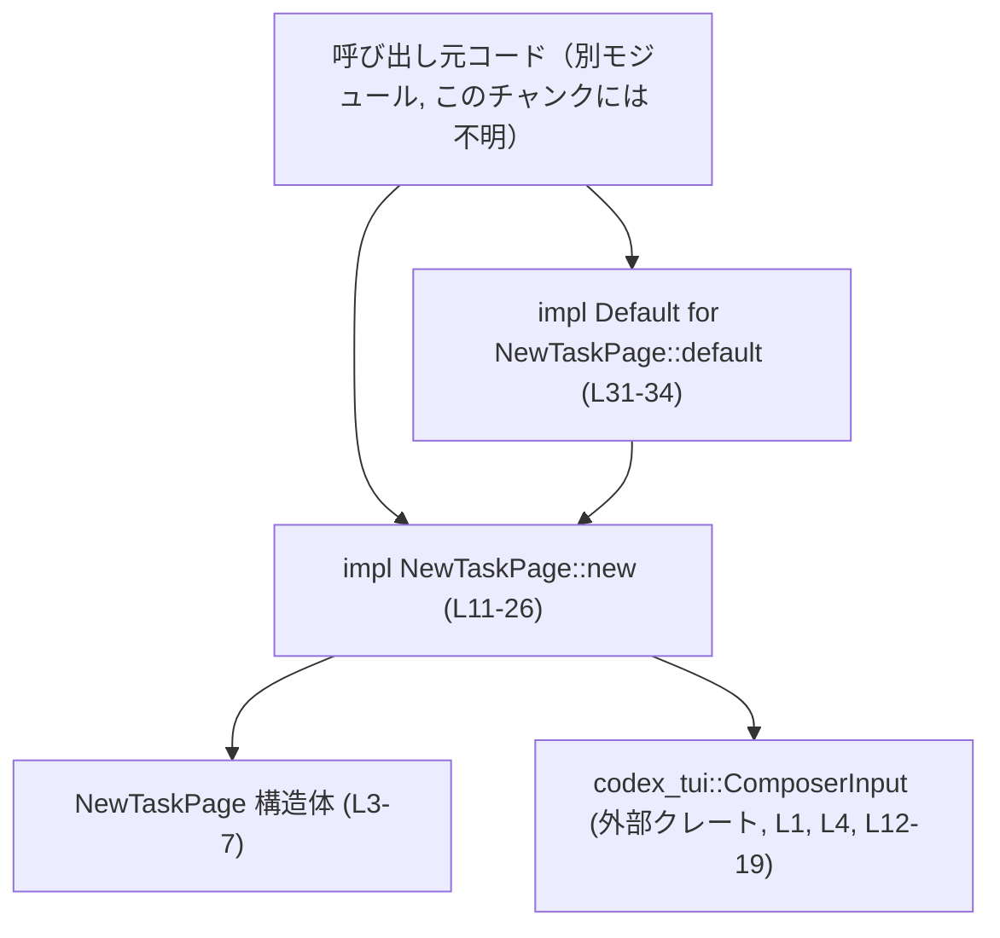
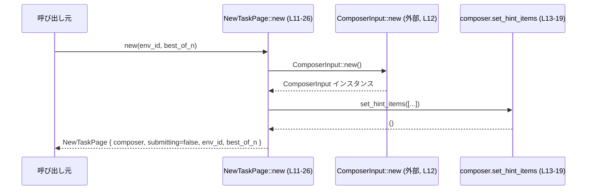
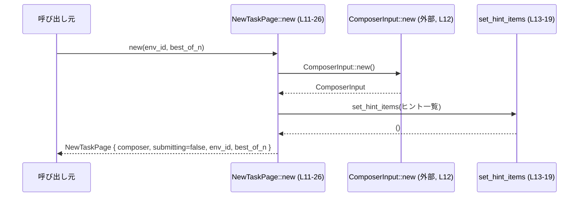

# cloud-tasks/src/new_task.rs

## 0. ざっくり一言

新しいタスク作成画面用の状態オブジェクト `NewTaskPage` を定義し、その初期化ロジックとデフォルト値を提供するモジュールです（new_task.rs:L3-7, L10-26, L31-34）。

---

## 1. このモジュールの役割

### 1.1 概要

- 新規タスク作成ページに必要な状態（入力コンポーザ、送信中フラグ、環境ID、試行回数）を保持する構造体 `NewTaskPage` を定義します（new_task.rs:L3-7）。
- ページの初期化処理として、`codex_tui::ComposerInput` を生成し、キーボードショートカットのヒントを設定するコンストラクタ `new` を提供します（new_task.rs:L11-25）。
- `Default` トレイトを実装し、環境IDなし・試行回数1という標準設定での生成方法を提供します（new_task.rs:L31-34）。

### 1.2 アーキテクチャ内での位置づけ

このファイルから分かる依存関係は以下の通りです。

- `NewTaskPage` → `codex_tui::ComposerInput` へ依存（new_task.rs:L1, L4, L12-19）。
- 呼び出し元コード（アプリケーション側）は `NewTaskPage::new` や `NewTaskPage::default` を通じてページ状態を生成すると考えられますが、実際の呼び出し元はこのチャンクには現れません。



※ 呼び出し元コードの具体的なモジュール名や型はこのチャンクには現れないため「不明」としています。

### 1.3 設計上のポイント

- **ページ状態の集約**  
  1つの構造体 `NewTaskPage` に画面に必要な状態をまとめています（composer・submitting・env_id・best_of_n）（new_task.rs:L3-7）。
- **状態オブジェクト + 外部UIコンポーネント**  
  テキスト入力UIコンポーネント `ComposerInput` を保持し、内部で初期化とヒント設定まで行います（new_task.rs:L4, L11-19, L21）。
- **デフォルト値の明示**  
  `Default` 実装は `env_id = None`、`best_of_n = 1` を固定値として利用します（new_task.rs:L31-34）。
- **Safe Rust / エラー / 並行性**  
  - このファイルには `unsafe` ブロックはなく、すべて Safe Rust で書かれています（new_task.rs:L1-35）。
  - 関数はいずれも `Result` や `Option` を返さず、明示的なエラー処理はありません（new_task.rs:L11-26, L32-34）。
  - スレッド生成や同期プリミティブは登場せず、並行処理は行っていません（new_task.rs 全体）。

---

## 2. 主要な機能一覧

- 新規タスク作成ページ状態の保持: 入力UI、送信中フラグ、環境ID、試行回数を1つの構造体で管理します（new_task.rs:L3-7）。
- 新規ページの初期化: `ComposerInput` を作成し、キーボードショートカットのヒントを設定した上で `NewTaskPage` を生成します（new_task.rs:L11-25）。
- デフォルトページの提供: 環境IDなし（`None`）、試行回数1のページを生成する `Default` 実装を提供します（new_task.rs:L31-34）。

---

## 3. 公開 API と詳細解説

### 3.0 コンポーネント一覧（インベントリー）

| 名前 | 種別 | 定義範囲 | 概要 |
|------|------|----------|------|
| `NewTaskPage` | 構造体 | new_task.rs:L3-7 | 新規タスク作成ページの状態を保持する型 |
| `impl NewTaskPage` | impl ブロック | new_task.rs:L10-29 | `NewTaskPage` のコンストラクタ `new` を提供 |
| `NewTaskPage::new` | 関数（関連関数） | new_task.rs:L11-26 | ページ状態を初期化し、ヒント付きの `ComposerInput` を設定して返す |
| `impl Default for NewTaskPage` | impl ブロック | new_task.rs:L31-35 | `NewTaskPage` のデフォルト生成ロジックを定義 |
| `Default::default`（for `NewTaskPage`） | 関数（トレイト実装） | new_task.rs:L32-34 | `env_id=None, best_of_n=1` を使って `NewTaskPage::new` を呼ぶ |

### 3.1 型一覧（構造体・列挙体など）

| 名前 | 種別 | 役割 / 用途 |
|------|------|-------------|
| `NewTaskPage` | 構造体 | 新規タスク作成ページに必要な状態（入力コンポーネント・フラグ・環境ID・試行回数）を保持する（new_task.rs:L3-7）。 |

`NewTaskPage` のフィールド:

- `composer: ComposerInput` — テキスト入力用の UI コンポーネント（new_task.rs:L4）。
- `submitting: bool` — 現在送信中かどうかを表すフラグ（new_task.rs:L5）。
- `env_id: Option<String>` — 対象とする環境ID（存在しない場合は `None`）（new_task.rs:L6）。
- `best_of_n: usize` — タスクの試行回数などに使われると推測される整数値（new_task.rs:L7）。用途は命名から推測されますが、このチャンクのコードだけでは具体的な意味は断定できません。

### 3.2 関数詳細

#### `NewTaskPage::new(env_id: Option<String>, best_of_n: usize) -> Self`

**概要**

`NewTaskPage` のインスタンスを作成するコンストラクタです。内部で `ComposerInput` を生成し、キーボードショートカットのヒントを設定してから、各フィールドを初期化して返します（new_task.rs:L11-25）。

**引数**

| 引数名 | 型 | 説明 |
|--------|----|------|
| `env_id` | `Option<String>` | 使用する環境ID。指定しない場合は `None` を渡します（new_task.rs:L11, L23）。 |
| `best_of_n` | `usize` | 試行回数などに使われる整数。0 や大きな値もそのまま格納されます（new_task.rs:L11, L24）。この値の妥当性チェックはこの関数内では行っていません。 |

**戻り値**

- `Self`（`NewTaskPage`）  
  初期化済みの `NewTaskPage` インスタンスを返します（new_task.rs:L11, L20-25）。

**内部処理の流れ**

1. `ComposerInput::new()` を呼び出して入力コンポーネントを生成します（new_task.rs:L12）。  
   ※ `ComposerInput` の具体的な実装は `codex_tui` クレート側で定義されており、このチャンクには現れません。
2. `set_hint_items` メソッドでキーボードショートカットのヒント一覧を設定します（new_task.rs:L13-19）。
   - `⏎` → `"send"`（送信）
   - `Shift+⏎` → `"newline"`（改行）
   - `Ctrl+O` → `"env"`（環境切替などと推測されますが、詳細は不明）
   - `Ctrl+N` → `"attempts"`
   - `Ctrl+C` → `"quit"`
3. `Self { ... }` で `NewTaskPage` 構造体を生成し、以下のようにフィールドを設定して返します（new_task.rs:L20-25）。
   - `composer`: 上で作成・設定した `ComposerInput`（new_task.rs:L21）
   - `submitting`: `false`（送信中ではない状態）（new_task.rs:L22）
   - `env_id`: 引数で受け取った値をそのまま代入（所有権が移動）（new_task.rs:L23）
   - `best_of_n`: 引数で受け取った値をそのまま代入（new_task.rs:L24）

**処理フロー図**



**Examples（使用例）**

新規タスクページを特定の環境・試行回数で初期化する例です。

```rust
use cloud_tasks::new_task::NewTaskPage;     // 仮のパス。実際のパスはプロジェクト構成に依存します。
                                           // このチャンクにはモジュール階層は現れないため、ここでは例示のみです。

fn main() {
    // 環境ID "dev" を持ち、3回試行する設定のページを作成する
    let page = NewTaskPage::new(
        Some("dev".to_string()),           // env_id: Some(String)
        3,                                 // best_of_n: 3
    );                                     // new_task.rs:L11-25 に対応する処理が実行される

    // composer はヒント付きで初期化済み
    // 例えば、呼び出し元で page.composer を UI ループに渡して利用することが想定されます。
    // ただし、その具体的な利用方法はこのチャンクには現れません。
}
```

**Errors / Panics**

- この関数自身は `Result` や `Option` を返さず、エラーを表現していません（new_task.rs:L11-26）。
- `ComposerInput::new` や `set_hint_items` が panic する可能性については、このチャンクからは分かりません（new_task.rs:L12-19）。  
  したがって、「この関数が決して panic しない」と断定することはできません。

**Edge cases（エッジケース）**

- `env_id = None`  
  そのまま `env_id: None` として保持されます（new_task.rs:L23）。特別な処理はありません。
- `best_of_n = 0` や非常に大きな値  
  そのまま `best_of_n` フィールドに設定されます（new_task.rs:L24）。  
  この値が妥当かどうかは他のコードとの契約次第であり、このチャンクにはその情報が現れません。
- 空の `String`（`Some("".to_string())`）  
  `Option<String>` として保持するだけで、追加の検証は行っていません（new_task.rs:L6, L23）。

**使用上の注意点**

- `env_id` と `best_of_n` の**妥当性チェックは行われません**（new_task.rs:L11-25）。  
  これらの値に意味的な制約（例: `best_of_n >= 1`）がある場合は、呼び出し側で保証する必要があります。
- `NewTaskPage` は `ComposerInput` を所有しており、`new` を呼ぶたびに新しい `ComposerInput` が作成されます（new_task.rs:L12, L21）。  
  高頻度で生成する場合は、外側での再利用戦略が必要になる可能性がありますが、このチャンクからはパフォーマンス要件は分かりません。
- 並行性に関する情報（`Send`/`Sync` 実装など）はこのファイルには記述されていません。  
  複数スレッドで共有・変更する場合は、`ComposerInput` の性質を `codex_tui` 側のドキュメントで確認する必要があります。

---

#### `impl Default for NewTaskPage { fn default() -> Self }`

**概要**

`NewTaskPage` の `Default` 実装です。`env_id = None`、`best_of_n = 1` を固定値として `NewTaskPage::new` を呼び出し、その結果を返します（new_task.rs:L31-34）。

**引数**

- なし（トレイト `Default` の仕様による）（new_task.rs:L32）。

**戻り値**

- `Self`（`NewTaskPage`）  
  `env_id = None`、`best_of_n = 1` という標準設定の `NewTaskPage` を返します（new_task.rs:L31-34）。

**内部処理の流れ**

1. `Self::new(/*env_id*/ None, /*best_of_n*/ 1)` を呼び出します（new_task.rs:L33）。
2. `NewTaskPage::new` で行われる処理（`ComposerInput` の生成とヒント設定、フィールド初期化）をそのまま利用し、その結果を返します（new_task.rs:L11-25, L33）。

**Examples（使用例）**

標準的な設定でページを作る例です。

```rust
use cloud_tasks::new_task::NewTaskPage;  // 実際のパスはプロジェクト依存。このチャンクには現れません。

fn main() {
    // デフォルト設定の NewTaskPage を生成する
    let page = NewTaskPage::default();   // impl Default for NewTaskPage (L31-34)

    // page.env_id は None
    assert!(page.env_id.is_none());      // new_task.rs:L6, L23, L33 に対応した状態

    // page.best_of_n は 1
    assert_eq!(page.best_of_n, 1);       // new_task.rs:L7, L24, L33 に対応した状態
}
```

**Errors / Panics**

- `default` 自体は単に `Self::new(None, 1)` を呼び出すだけで、独自のエラー処理や panic はありません（new_task.rs:L33）。
- 実際の挙動は `NewTaskPage::new` と同じ制約を持ちます。`new` が panic する状況があれば、この `default` も同様に panic することになります。

**Edge cases（エッジケース）**

- 他に引数がないため、`NewTaskPage::new` とは異なり、呼び出し側が値を誤って渡す余地はありません（new_task.rs:L32-34）。
- デフォルト値（`None`, `1`）がアプリケーションの仕様として妥当かどうかは、このチャンクからは分かりません。

**使用上の注意点**

- 「環境未指定・試行回数1」がアプリケーションにおける自然な初期状態である場合に `default` を使うのが適しています（new_task.rs:L33）。
- デフォルト値を変更したい場合は、この `default` 実装か、呼び出し側の利用方法を見直す必要があります（new_task.rs:L31-34）。

### 3.3 その他の関数

- このファイルには、補助的な自由関数やその他のメソッドは定義されていません（new_task.rs 全体）。

---

## 4. データフロー

ここでは、`NewTaskPage::new` を通じてページ状態が生成される典型的なフローを示します。

1. 呼び出し元が `env_id` と `best_of_n` を決定し、`NewTaskPage::new` を呼びます（new_task.rs:L11）。
2. `NewTaskPage::new` 内で `ComposerInput::new` が呼ばれ、入力コンポーネントが作成されます（new_task.rs:L12）。
3. 作成した `composer` に対し、`set_hint_items` でショートカットのヒントを設定します（new_task.rs:L13-19）。
4. `NewTaskPage` 構造体が生成され、呼び出し元に返されます（new_task.rs:L20-25）。



このフローには、I/O や非同期処理、並行処理は含まれていません（new_task.rs:L11-26）。

---

## 5. 使い方（How to Use）

### 5.1 基本的な使用方法

`NewTaskPage` を初期化し、フィールドを参照・更新する基本的な流れの例です。

```rust
use cloud_tasks::new_task::NewTaskPage;   // 実際のパスはこのチャンクからは不明だが、例として仮定。

fn main() {
    // 環境ID "prod" で、試行回数 5 のページを生成する
    let mut page = NewTaskPage::new(
        Some("prod".to_string()),        // env_id: Some("prod")
        5,                               // best_of_n: 5
    );                                   // new_task.rs:L11-25

    // 送信中フラグは new() 内で false に初期化されている（new_task.rs:L22）
    assert_eq!(page.submitting, false);

    // 何らかの送信処理を開始する前にフラグを変更する（呼び出し側の責務）
    page.submitting = true;             // フィールドは public なので、直接変更可能（new_task.rs:L5）

    // 送信完了後にフラグを戻す、などの操作が想定されます
    page.submitting = false;
}
```

### 5.2 よくある使用パターン

1. **デフォルト状態から開始する**

```rust
let page = NewTaskPage::default();       // env_id=None, best_of_n=1（new_task.rs:L31-34）
// 環境が特に決まっていない「最初の画面」などに適したパターンと考えられます。
```

1. **環境IDのみ指定し、試行回数はデフォルトと同じ 1 にする**

```rust
let page = NewTaskPage::new(
    Some("staging".to_string()),         // env_id は指定
    1,                                   // best_of_n はデフォルトと同じ 1（new_task.rs:L11）
);
```

1. **試行回数を変更したバリエーションを作る**

```rust
let base = NewTaskPage::default();       // env_id=None, best_of_n=1
let mut page = NewTaskPage::new(
    base.env_id.clone(),                 // env_id を再利用（所有権・ライフタイムに注意）
    3,                                   // best_of_n を 3 に変更
);
```

### 5.3 よくある間違い

このファイルの構造から推測される、起こりうる誤用例と正しい例です。

```rust
use cloud_tasks::new_task::NewTaskPage;

// 誤りの可能性がある例: 構造体リテラルを直接使って初期化し、ヒント設定を忘れる
let page = NewTaskPage {
    composer: codex_tui::ComposerInput::new(), // set_hint_items が呼ばれていない
    submitting: false,
    env_id: None,
    best_of_n: 1,
};

// 正しい例: new もしくは default を経由して、ヒント設定を含めた初期化を行う
let page = NewTaskPage::default();      // new_task.rs:L31-34 経由でヒントもセットされる
// または
let page = NewTaskPage::new(None, 1);   // new_task.rs:L11-25
```

※ `NewTaskPage` のフィールドは public なので、上記のような構造体リテラルによる初期化も可能です（new_task.rs:L3-7）。  
ただしその場合、`new` 内で行っている `set_hint_items` の呼び出し（new_task.rs:L13-19）が抜けるため、ヒントが表示されない状態になります。

### 5.4 使用上の注意点（まとめ）

- **コンストラクタ経由の初期化**  
  キーボードショートカットのヒントを確実に設定するためには、`NewTaskPage::new` または `NewTaskPage::default` を利用することが望ましいです（new_task.rs:L13-19, L31-34）。
- **値の妥当性**  
  `best_of_n` や `env_id` のチェックは行われていないため（new_task.rs:L11-25）、アプリケーションの仕様に応じて呼び出し側で制約を守る必要があります。
- **並行性**  
  この型のスレッド安全性は `ComposerInput` に依存します（new_task.rs:L4, L12-19）。複数スレッドから共有する場合は、`codex_tui` のドキュメントを確認し、必要に応じて `Arc<Mutex<_>>` などで保護する必要があります。
- **観測性（ログなど）**  
  このモジュール内ではログ出力やメトリクスは一切行っていません（new_task.rs 全体）。状態の変化を監視したい場合は、呼び出し元でログを追加する必要があります。

---

## 6. 変更の仕方（How to Modify）

### 6.1 新しい機能を追加する場合

例: 送信処理の補助メソッドや入力検証メソッドを追加する場合。

1. **`NewTaskPage` のメソッドとして追加**  
   `impl NewTaskPage` ブロック（new_task.rs:L10-29）にメソッドを追加するのが自然です。
2. **必要であればフィールドを追加**  
   - 追加したい状態がある場合は、`NewTaskPage` 構造体の定義（new_task.rs:L3-7）にフィールドを追加します。
   - その場合、`new` と `default` のどちらにも初期値を追加する必要があります（new_task.rs:L11-25, L31-34）。
3. **`ComposerInput` への操作を増やす**  
   入力UIの挙動を変更したい場合は、`new` 内で `ComposerInput` に対して追加のメソッドを呼び出します（new_task.rs:L12-19）。  
   ただし、`ComposerInput` がどのようなAPIを提供しているかはこのチャンクには現れないため、`codex_tui` のドキュメントを参照する必要があります。

### 6.2 既存の機能を変更する場合

- **`new` の挙動を変える場合**（new_task.rs:L11-25）
  - ヒント一覧を変更・追加・削除する場合、`set_hint_items` に渡しているベクタ（new_task.rs:L13-19）を書き換えます。
  - `submitting` の初期値を変える場合は `submitting: false` の部分を修正します（new_task.rs:L22）。
  - `env_id` や `best_of_n` に対する妥当性チェックを追加する場合は、`Self { ... }` を返す前に条件分岐を挿入します（new_task.rs:L20-25）。
- **デフォルト値を変える場合**（new_task.rs:L31-34）
  - `default` で渡している引数 `None` や `1` を変更します（new_task.rs:L33）。
  - これにより、`NewTaskPage::default()` を利用しているすべての箇所の挙動が変わるため、影響範囲の確認が必要です。
- **契約・エッジケースの注意**
  - `best_of_n` に制約（例: 0禁止）を導入する場合、既存コードが `0` を渡していないか確認する必要があります。  
    このチャンクには呼び出し側が現れないため、プロジェクト全体検索が必要です。
  - 例外的な入力に対し panic ではなく `Result` を返したい場合は、関数シグネチャの変更が必要です（new_task.rs:L11-26, L32-34）。  
    その場合、呼び出し元すべてにエラー処理の追加が必要になります。

---

## 7. 関連ファイル

このチャンクから直接参照されている外部コンポーネントは以下の通りです。

| パス / シンボル | 役割 / 関係 |
|----------------|------------|
| `codex_tui::ComposerInput` | 入力用UIコンポーネント。`NewTaskPage` が `composer` フィールドとして保持し（new_task.rs:L4）、`new` 内で `new` と `set_hint_items` を呼び出しています（new_task.rs:L12-19）。 |

このファイル内からは、同一クレート内の他のモジュールやテストコードへの参照は現れません。そのため、`NewTaskPage` が他にどのように利用されているかは、このチャンクだけでは不明です。

---

### 付記: Bugs / セキュリティ / テスト / 性能 についての簡単な整理

- **明白なバグ・セキュリティ問題**  
  - 未初期化フィールドや `unsafe` の使用、外部入力のパースなどは存在せず（new_task.rs:L1-35）、このチャンクから明確に指摘できるバグやセキュリティ問題は見当たりません。
- **契約・エッジケース**  
  - `best_of_n`・`env_id` の値域・フォーマットに関する契約はこのファイルでは定義されていません（new_task.rs:L11-25）。契約は呼び出し側または別ドキュメントで定義されている可能性があります。
- **テスト**  
  - このファイル内にはテストコード（`#[test]` など）は存在しません（new_task.rs:L1-35）。テストは別ファイルで定義されているか、まだ用意されていない可能性があります。
- **性能・スケール面の注意**  
  - `NewTaskPage::new` は主に `ComposerInput` の生成と小さいベクタの生成・コピーのみを行うため、単体では軽量な処理と考えられますが（new_task.rs:L12-19, L20-25）、生成頻度や `ComposerInput` の内部実装によってはコストが変わる可能性があります。この点は `codex_tui` の実装に依存し、このチャンクだけからは評価できません。
