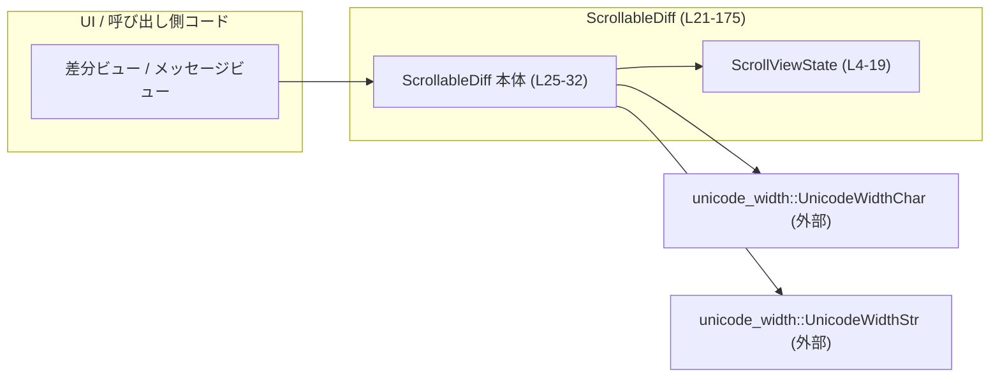

# cloud-tasks/src/scrollable_diff.rs コード解説

## 0. ざっくり一言

- 縦スクロール可能なテキストビュー（主に diff やメッセージ）のために、**行折り返し（ワードラップ）とスクロール位置の状態管理**を行うモジュールです。  
- 元の行（raw）から折り返し済みの行（wrapped）を生成し、スクロール位置とビューポート高さに基づいてスクロールや割合表示を行います。

---

## 1. このモジュールの役割

### 1.1 概要

- このモジュールは、**可変幅文字を含むテキスト**を指定幅で折り返しつつ、スクロール位置を管理する問題を解決します。
- 具体的には次の機能を提供します。
  - 折り返し前のテキスト行の保持と、表示幅に応じた折り返し済み行のキャッシュ
  - スクロール位置・ビューポート高さ・コンテンツ高さをまとめた状態管理
  - スクロール操作（行単位／ページ単位／先頭／末尾）やスクロール率の計算

### 1.2 アーキテクチャ内での位置づけ

このファイル単体では他の自作モジュールとの依存はなく、外部クレート `unicode_width` のみを利用しています（`UnicodeWidthChar`, `UnicodeWidthStr` で文字幅を計算、`scrollable_diff.rs:L1-2`）。

主要な依存関係は次の通りです。



- 呼び出しコードは `ScrollableDiff` のインスタンスを生成し、`set_content` / `set_width` / `set_viewport` などを通じて状態を更新します（`scrollable_diff.rs:L34-63`）。
- `ScrollableDiff` は内部で `ScrollViewState` を保持し、スクロール値を一元管理します（`scrollable_diff.rs:L25-32`）。
- 折り返し処理 `rewrap` の中で、`unicode_width` により文字・文字列の表示幅を取得します（`scrollable_diff.rs:L142, L165`）。

### 1.3 設計上のポイント

- **責務の分割**  
  - `ScrollViewState` は純粋にスクロール・ビューポート・コンテンツの高さを持つ軽量な状態構造体です（`scrollable_diff.rs:L4-10`）。
  - `ScrollableDiff` はテキスト行の保持と折り返し、さらに `ScrollViewState` を組み合わせてスクロール可能ビューを構成します（`scrollable_diff.rs:L25-32`）。
- **状態管理と整合性**  
  - `ScrollViewState::clamp` により、スクロール値が常に `0..=max_scroll` に収まるようにしています（`scrollable_diff.rs:L13-18, L110-112`）。
  - `set_width` / `set_viewport` 呼び出し時に `clamp` を毎回実行することで、ウィンドウ縮小など geometry 変更時も一貫した状態を保ちます（`scrollable_diff.rs:L50-57, L60-62`）。
- **安全性（Rust 的観点）**  
  - このファイルには `unsafe` ブロックは存在せず、すべて安全な Rust のみで実装されています。
  - ベクタへのアクセスは `get`（`raw_line_at`）または `push` と `clear` のみを用いており、境界外アクセスは行っていません（`scrollable_diff.rs:L74-76, L122-122, L127-128, L168-169`）。
- **並行性**  
  - `ScrollableDiff` は `Clone`, `Debug`, `Default` を derive していますが（`scrollable_diff.rs:L25`）、内部に共有可変状態や `Rc` / `RefCell` などの仕組みは持たず、すべての変更操作は `&mut self` メソッド経由で行われます（例: `set_content`, `set_width`, `scroll_by` など、`scrollable_diff.rs:L40-47, L50-57, L79-82`）。
  - 型構成上 `Send` / `Sync` を満たす可能性がありますが、コードから明示的なスレッド間共有は読み取れません。

---

## 2. 主要な機能一覧

- スクロール状態管理: `ScrollViewState` によるスクロール位置とビューポート・コンテンツ高さの保持とクランプ（`scrollable_diff.rs:L4-19`）。
- テキストコンテンツの設定: `ScrollableDiff::set_content` で元テキスト行（raw）の差し替え（`scrollable_diff.rs:L40-47`）。
- 表示幅に応じた折り返し: `ScrollableDiff::set_width` と内部の `rewrap` で、指定幅に基づく折り返し済み行と元行インデックスの生成（`scrollable_diff.rs:L50-57, L114-175`）。
- ビューポート高さ更新: `ScrollableDiff::set_viewport` による表示行数の更新とスクロール位置のクランプ（`scrollable_diff.rs:L60-62`）。
- スクロール操作: `scroll_by` / `page_by` / `scroll_to_top` / `scroll_to_bottom` でスクロール位置を更新（`scrollable_diff.rs:L79-95`）。
- スクロール率の取得: `percent_scrolled` によるスクロール進捗のパーセンテージ取得（`scrollable_diff.rs:L98-107`）。
- 折り返し済みテキストの取得: `wrapped_lines` / `wrapped_src_indices` / `raw_line_at` による描画用データの参照（`scrollable_diff.rs:L66-76`）。

---

## 3. 公開 API と詳細解説

### 3.1 型一覧（構造体・列挙体など）

| 名前 | 種別 | 役割 / 用途 | 定義位置 |
|------|------|-------------|----------|
| `ScrollViewState` | 構造体 | 縦スクロールビューの状態（スクロール位置・ビューポート高さ・コンテンツ高さ）を保持する軽量な状態オブジェクトです。 | `scrollable_diff.rs:L4-10` |
| `ScrollableDiff`  | 構造体 | 元テキスト行と折り返し済み行を保持し、`ScrollViewState` と組み合わせてスクロール可能な差分ビュー／テキストビューを構成します。 | `scrollable_diff.rs:L25-32` |

`ScrollableDiff` のフィールド構成:

| フィールド名 | 型 | 説明 | 定義位置 |
|-------------|----|------|----------|
| `raw` | `Vec<String>` | 折り返し前の元テキスト行のリストです。 | `scrollable_diff.rs:L27` |
| `wrapped` | `Vec<String>` | 指定幅で折り返したテキスト行のリストです。 | `scrollable_diff.rs:L28` |
| `wrapped_src_idx` | `Vec<usize>` | `wrapped` の各要素が、`raw` の何番目の行から来たかを表すインデックスです。`wrapped[i]` の元行のインデックスが `wrapped_src_idx[i]` になります。 | `scrollable_diff.rs:L29` |
| `wrap_cols` | `Option<u16>` | 直近の折り返しに使用した幅（列数）。`None` の場合はまだ折り返しされていない／再折り返しが必要な状態を表します。 | `scrollable_diff.rs:L30` |
| `state` | `ScrollViewState` | 現在のスクロール位置とビューポート高さ、コンテンツ高さを保持します。 | `scrollable_diff.rs:L31` |

---

### 3.2 関数詳細（重要なもの 7 件）

#### `ScrollViewState::clamp(&mut self)`

**概要**

- 現在のスクロール位置 `scroll` が、コンテンツ高さとビューポート高さに基づく最大スクロール量を超えないように調整します（`scrollable_diff.rs:L13-18`）。

**引数**

| 引数名 | 型 | 説明 |
|--------|----|------|
| `&mut self` | `&mut ScrollViewState` | スクロール状態を可変参照で受け取り、内部の `scroll` を更新します。 |

**戻り値**

- なし（`()`）。内部フィールド `scroll` を必要に応じて減少させます。

**内部処理の流れ**

1. `max_scroll = content_h.saturating_sub(viewport_h)` を計算します（`scrollable_diff.rs:L14`）。
2. 現在の `scroll` が `max_scroll` より大きい場合は、`scroll` を `max_scroll` に書き換えます（`scrollable_diff.rs:L15-17`）。
3. `scroll` がすでに範囲内なら何も変更しません。

**Examples（使用例）**

```rust
use cloud_tasks::scrollable_diff::ScrollViewState;

fn main() {
    let mut state = ScrollViewState {
        scroll: 100,     // 現在のスクロール行
        viewport_h: 20,  // 表示できる行数
        content_h: 110,  // コンテンツ全体の行数
    };

    state.clamp();  // scrollable_diff.rs:L13-18 を呼び出す

    // max_scroll = 110 - 20 = 90 なので、scroll は 90 に調整される
    assert_eq!(state.scroll, 90);
}
```

**Errors / Panics**

- パニック条件はありません。算術には `saturating_sub` を用いており、`content_h < viewport_h` の場合でも 0 にサチュレートします。

**Edge cases（エッジケース）**

- `content_h < viewport_h` の場合: `max_scroll` は 0 になり、`scroll` は 0 以下にクランプされます（`scrollable_diff.rs:L14-17`）。
- `content_h == viewport_h` の場合: 同様に `max_scroll` は 0 となり、スクロール位置は必ず 0 になります。
- すでに `scroll <= max_scroll` の場合: 値はそのまま維持されます。

**使用上の注意点**

- `viewport_h` や `content_h` を変更した後には、`ScrollableDiff` 側の `set_width` / `set_viewport` が内部で `clamp` を呼び出すため、通常は利用者が直接 `clamp` を呼ぶ必要はありません（`scrollable_diff.rs:L50-57, L60-62`）。

---

#### `ScrollableDiff::set_content(&mut self, lines: Vec<String>)`

**概要**

- 元テキスト行（raw）を丸ごと差し替え、折り返し結果を無効化して次回の `set_width` で再計算させるための準備を行います（`scrollable_diff.rs:L39-47`）。

**引数**

| 引数名 | 型 | 説明 |
|--------|----|------|
| `&mut self` | `&mut ScrollableDiff` | インスタンスを可変で受け取ります。 |
| `lines` | `Vec<String>` | 新しい元テキスト行の集合です。所有権は `ScrollableDiff` に移動します。 |

**戻り値**

- なし。

**内部処理の流れ**

1. `self.raw` を新しい `lines` で置き換えます（`scrollable_diff.rs:L41`）。
2. 既存の折り返し結果 `wrapped` とインデックス `wrapped_src_idx` をクリアします（`scrollable_diff.rs:L42-43`）。
3. コンテンツ高さ `content_h` を 0 にリセットします（`scrollable_diff.rs:L44`）。
4. 折り返し幅 `wrap_cols` を `None` にして、「再折り返しが必要」な状態をマークします（`scrollable_diff.rs:L45-46`）。

**Examples（使用例）**

```rust
use cloud_tasks::scrollable_diff::ScrollableDiff;

fn main() {
    let mut diff = ScrollableDiff::new();  // scrollable_diff.rs:L35-37

    // 新しいテキスト行を設定
    diff.set_content(vec![
        "line 1".to_string(),
        "line 2".to_string(),
    ]);

    // このタイミングではまだ折り返しは行われていない
    assert_eq!(diff.wrapped_lines().len(), 0);  // scrollable_diff.rs:L66-68

    // 幅を設定すると折り返しが実行される
    diff.set_width(80);  // scrollable_diff.rs:L50-57
    assert!(diff.wrapped_lines().len() >= 2);
}
```

**Errors / Panics**

- パニックの可能性はありません。単純なフィールドの置換とベクタのクリアのみです。

**Edge cases（エッジケース）**

- 空の `lines` を渡した場合: `raw` が空ベクタになり、`wrapped` もクリアされ、`content_h` は 0 になります。`set_width` を呼び出しても折り返し結果は空のままです。
- 非 ASCII やサロゲートペアに相当する文字を含む行を渡しても、ここではまだ幅計算は行わないため影響はありません。

**使用上の注意点**

- **必ず `set_width` を後続で呼ぶ必要**があります。`set_content` の後に `wrapped_lines` を参照しても空のままのため、描画前に幅設定を行う前提になります（`scrollable_diff.rs:L39-47, L50-57`）。

---

#### `ScrollableDiff::set_width(&mut self, width: u16)`

**概要**

- 折り返し幅（列数）を更新し、前回と異なる場合は折り返し結果を再生成した上でスクロール位置をクランプします（`scrollable_diff.rs:L49-57`）。

**引数**

| 引数名 | 型 | 説明 |
|--------|----|------|
| `width` | `u16` | 折り返しに用いる横幅（列数）。0 も許容され、その場合は折り返しを行わず `raw` をそのまま `wrapped` にコピーします（`scrollable_diff.rs:L114-118`）。 |

**戻り値**

- なし。

**内部処理の流れ**

1. すでに `wrap_cols == Some(width)` であれば、何もせずに早期リターンします（同じ幅での再処理を避けるため、`scrollable_diff.rs:L51-52`）。
2. `wrap_cols` を `Some(width)` に更新します（`scrollable_diff.rs:L54`）。
3. 内部関数 `rewrap(width)` を呼び出し、折り返し済み行と `wrapped_src_idx` を再構築します（`scrollable_diff.rs:L55, L114-175`）。
4. 折り返し後に `state.clamp()` を呼び、コンテンツ高さの変化に応じてスクロール位置を範囲内へ調整します（`scrollable_diff.rs:L56-57`）。

**Examples（使用例）**

```rust
use cloud_tasks::scrollable_diff::ScrollableDiff;

fn main() {
    let mut diff = ScrollableDiff::new();

    diff.set_content(vec!["0123456789".to_string()]);
    diff.set_width(5);  // 幅 5 で折り返し

    let wrapped = diff.wrapped_lines();
    // 想定される形: ["01234", "56789"] など
    assert!(wrapped.len() >= 2);

    // 同じ幅で再度呼んでも再計算は行われない（wrap_cols チェックにより）
    diff.set_width(5);
}
```

**Errors / Panics**

- パニック条件はありません。`rewrap` 内でのベクタ操作や `split_at` は、事前に保証されたインデックス範囲内で行われています（`last_soft_idx` が `line.len()` 以下のみで設定されるため、`scrollable_diff.rs:L156-163, L145-146`）。

**Edge cases（エッジケース）**

- `width == 0` の場合: `rewrap` 内の特別処理により、`wrapped` に `raw` のクローンがそのまま入り、実質折り返しなしモードになります（`scrollable_diff.rs:L114-118`）。
- 非 ASCII や全角文字を含む場合: `UnicodeWidthChar::width` / `UnicodeWidthStr::width` により幅が決まるため、端末の表示幅と一致することが期待されます（`scrollable_diff.rs:L142, L165`）。

**使用上の注意点**

- 端末やウィンドウの幅が変化した際には、その都度 `set_width` を呼ぶ前提で設計されています。幅が変わっていない場合には再計算を避ける軽量なチェックが入っています（`scrollable_diff.rs:L51-52`）。
- 大きなコンテンツに対して頻繁に幅を変更すると、`rewrap` が毎回走るため計算コストがかかります（文字ごとに幅計算を行うため）。

---

#### `ScrollableDiff::set_viewport(&mut self, height: u16)`

**概要**

- 表示可能な行数（ビューポート高さ）を更新し、スクロール位置を現在のコンテンツ高さに合わせてクランプします（`scrollable_diff.rs:L59-63`）。

**引数**

| 引数名 | 型 | 説明 |
|--------|----|------|
| `height` | `u16` | ビューポートが一度に表示できる行数です。 |

**戻り値**

- なし。

**内部処理の流れ**

1. `state.viewport_h` に `height` を代入します（`scrollable_diff.rs:L61`）。
2. `state.clamp()` を呼び、現在の `scroll` 値を新しい `viewport_h` と `content_h` に対して調整します（`scrollable_diff.rs:L62`）。

**Examples（使用例）**

```rust
use cloud_tasks::scrollable_diff::ScrollableDiff;

fn main() {
    let mut diff = ScrollableDiff::new();
    diff.set_content((0..100).map(|i| format!("line {}", i)).collect());
    diff.set_width(80);

    diff.state.scroll = 90;  // 手動でスクロール値を設定
    diff.set_viewport(20);   // viewport_h を 20 に変更

    // content_h が 100 の場合、max_scroll = 100 - 20 = 80 となるので
    assert_eq!(diff.state.scroll, 80);
}
```

**Errors / Panics**

- パニック条件はありません。

**Edge cases（エッジケース）**

- `height == 0` の場合: `viewport_h` が 0 になり、`max_scroll = content_h.saturating_sub(0)` となるため、`scroll` は 0..=content_h 範囲にクランプされます。
- `content_h == 0` の場合: `max_scroll` は 0 なので `scroll` は 0 になります。

**使用上の注意点**

- ビューポート高さはスクロール率の計算にも利用されるため（`percent_scrolled`、`scrollable_diff.rs:L98-107`）、正しく設定されていないと進捗表示が `None` になったり、想定と異なる値になる可能性があります。

---

#### `ScrollableDiff::scroll_by(&mut self, delta: i16)`

**概要**

- 現在のスクロール位置を `delta` 行だけ相対的に移動し、`max_scroll` を超えないようにクランプします（`scrollable_diff.rs:L78-82`）。

**引数**

| 引数名 | 型 | 説明 |
|--------|----|------|
| `delta` | `i16` | 正の値で下方向（コンテンツ後半）へスクロール、負の値で上方向（先頭側）へスクロールします。 |

**戻り値**

- なし。

**内部処理の流れ**

1. 現在の `state.scroll` を `i32` にキャストし、`delta` も `i32` にキャストして加算します（`s`）（`scrollable_diff.rs:L80`）。
2. `s.clamp(0, self.max_scroll() as i32)` により、0 から最大スクロール量の範囲に制限します（`scrollable_diff.rs:L81, L110-112`）。
3. クランプ結果を `u16` にキャストして `state.scroll` に書き戻します（`scrollable_diff.rs:L81`）。

**Examples（使用例）**

```rust
use cloud_tasks::scrollable_diff::ScrollableDiff;

fn main() {
    let mut diff = ScrollableDiff::new();
    diff.set_content((0..100).map(|i| format!("line {}", i)).collect());
    diff.set_width(80);
    diff.set_viewport(10);

    diff.scroll_by(5);   // 5 行下にスクロール
    assert_eq!(diff.state.scroll, 5);

    diff.scroll_by(-10); // 10 行上にスクロール（0 未満は 0 にクランプ）
    assert_eq!(diff.state.scroll, 0);
}
```

**Errors / Panics**

- パニック条件はありません。

**Edge cases（エッジケース）**

- `delta` が大きく正の値: `max_scroll` を超える分は切り捨てられ、`state.scroll` は `max_scroll` にクランプされます。
- `delta` が大きく負の値: 最小値は 0 にクランプされます。
- `content_h <= viewport_h` の場合: `max_scroll` は 0 のため、`scroll_by` を呼んでも常に 0 のままです。

**使用上の注意点**

- 実際の描画処理側では、この `scroll` 値を元に `wrapped_lines()` から何行目を表示するかを決める必要があります（そのロジックはこのファイルには含まれていません）。

---

#### `ScrollableDiff::percent_scrolled(&self) -> Option<u8>`

**概要**

- 現在のスクロール位置に基づき、「ビューポートの下端」が全体の高さの何 % まで到達しているかを返します（`scrollable_diff.rs:L97-107`）。
- コンテンツ高さやビューポート高さが未設定または自明な場合は `None` を返します。

**引数**

| 引数名 | 型 | 説明 |
|--------|----|------|
| `&self` | `&ScrollableDiff` | 内部の `state` を参照するだけで、フィールドは変更しません。 |

**戻り値**

- `Option<u8>`  
  - `Some(0..=100)`: スクロール率（%）。四捨五入の整数値。
  - `None`: 計算に必要な情報が不足しているか、スクロール不要な状態。

**内部処理の流れ**

1. `content_h == 0` または `viewport_h == 0` の場合、`None` を返します（`scrollable_diff.rs:L99-101`）。
2. `content_h <= viewport_h` の場合（全体が一画面に収まる場合）も `None` を返します（`scrollable_diff.rs:L102-103`）。
3. 現在のビューポート下端位置 `visible_bottom = scroll + viewport_h` を `f32` として計算します（`scrollable_diff.rs:L105`）。
4. `pct = (visible_bottom / content_h * 100.0).round()` により、パーセンテージを四捨五入して求めます（`scrollable_diff.rs:L106`）。
5. `pct` を `0.0..=100.0` にクランプし、`u8` にキャストして `Some` で返します（`scrollable_diff.rs:L107`）。

**Examples（使用例）**

```rust
use cloud_tasks::scrollable_diff::ScrollableDiff;

fn main() {
    let mut diff = ScrollableDiff::new();
    diff.set_content((0..100).map(|i| format!("line {}", i)).collect());
    diff.set_width(80);
    diff.set_viewport(10);

    diff.state.scroll = 0;
    assert_eq!(diff.percent_scrolled(), Some(10)); // 下端が 10% 付近

    diff.state.scroll = 90;
    assert_eq!(diff.percent_scrolled(), Some(100)); // 末尾まで表示
}
```

**Errors / Panics**

- パニック条件はありません。

**Edge cases（エッジケース）**

- `content_h == 0` または `viewport_h == 0`: `None`。
- `content_h <= viewport_h`: スクロール可能性がないため `None`。
- `scroll + viewport_h > content_h`: `clamp` が適切に呼ばれている前提では起きない設計ですが、万一そうなっても計算結果は 100% にクランプされます（`scrollable_diff.rs:L105-107`）。

**使用上の注意点**

- 進捗バーなどに表示する際は、`None` の場合も UI 上で自然な表示（例: 非表示、0% 扱いなど）になるように扱う必要があります。
- 計算は `ScrollViewState` の値のみを使用するため、呼び出し側が `state` を直接書き換えた場合にもその影響を反映します。

---

#### `ScrollableDiff::rewrap(&mut self, width: u16)`

> 内部ロジックの中核であるため、公開 API ではありませんが詳細を記述します（`fn rewrap` は private, `scrollable_diff.rs:L114-175`）。

**概要**

- 現在の `raw` 行をもとに、指定幅 `width` に従って折り返した行 `wrapped` と、その元行インデックス `wrapped_src_idx` を再生成します（`scrollable_diff.rs:L120-122, L172-174`）。
- タブを 4 スペースに展開し、改行・空行・句読点・空白文字などを考慮して「なるべく単語や文の切れ目で折り返す」処理を行います。

**引数**

| 引数名 | 型 | 説明 |
|--------|----|------|
| `width` | `u16` | 折り返し幅。0 のときは特別扱いで、`raw` のコピーをそのまま `wrapped` にします（`scrollable_diff.rs:L114-118`）。 |

**戻り値**

- なし。`self.wrapped`, `self.wrapped_src_idx`, `self.state.content_h` を更新します。

**内部処理の流れ（簡略版）**

1. `width == 0` の場合:
   - `wrapped = raw.clone()` とし、`content_h` を `wrapped.len()` に設定して終了します（`scrollable_diff.rs:L114-118`）。
2. `width > 0` の場合:
   - `max_cols = width as usize` を計算（`scrollable_diff.rs:L120`）。
   - 空の `out: Vec<String>` と `out_idx: Vec<usize>` を用意（`scrollable_diff.rs:L121-122`）。
   - 各元行 `raw` について以下を行う（`scrollable_diff.rs:L123-171`）:
     1. タブを 4 スペースに置換した文字列に変換（`raw.replace('\t', "    ")`, `scrollable_diff.rs:L125`）。
     2. 空行なら、空文字列を `out` に、対応インデックス `raw_idx` を `out_idx` に追加（`scrollable_diff.rs:L126-130`）。
     3. 非空行は、`line`（現在構築中の行）, `line_cols`（その表示幅）, `last_soft_idx`（直近の折り返し候補位置）を初期化（`scrollable_diff.rs:L131-133`）。
     4. `raw.char_indices()` で各文字 `ch` を走査（`scrollable_diff.rs:L134`）:
        - `ch == '\n'` なら、現在の `line` をアウトプットに追加し、行状態をリセット（`scrollable_diff.rs:L135-140`）。
        - それ以外:
          - `w = UnicodeWidthChar::width(ch).unwrap_or(0)` で `ch` の列幅を取得（`scrollable_diff.rs:L142`）。
          - `line_cols + w > max_cols` の場合、折り返し処理を行う（`scrollable_diff.rs:L143-155`）:
            - `last_soft_idx` が Some なら、その位置で `line` を `split_at` し、前半を出力・後半を現在の `line` として再利用（前後でトリム）し、`last_soft_idx` をリセット（`scrollable_diff.rs:L144-150`）。
            - それ以外で `line` が空でなければ、`line` をそのまま出力してリセット（`scrollable_diff.rs:L151-154`）。
          - 現在の文字が空白または特定の句読点類なら `last_soft_idx = Some(line.len())` として「折り返し候補位置」を記録（`scrollable_diff.rs:L156-163`）。
          - `line.push(ch)` で文字を追加し、`line_cols = UnicodeWidthStr::width(line.as_str())` で現在の行幅を再計算（`scrollable_diff.rs:L164-165`）。
     5. ループ終了後、`line` が空でなければ最後の行として `out` に追加（`scrollable_diff.rs:L167-170`）。
   - すべての元行を処理し終えたら、`self.wrapped = out`, `self.wrapped_src_idx = out_idx`, `self.state.content_h = wrapped.len() as u16` を更新する（`scrollable_diff.rs:L172-174`）。

**Examples（使用例）**

`rewrap` は private のため直接呼び出せませんが、`set_width` から利用されます（`scrollable_diff.rs:L50-57`）。  
上記 `set_width` の例を参照してください。

**Errors / Panics**

- `line.split_at(split)` の `split` は、常に UTF-8 文字境界（`line.len()` など）から得られているため、標準ライブラリの仕様上パニックしません（`scrollable_diff.rs:L145-146, L156-163`）。
- その他の操作も、ベクタの `push` や `clone` のみであり、パニック条件は見当たりません。

**Edge cases（エッジケース）**

- タブ文字: `'\t'` は常に 4 スペース `"    "` に置き換えられます。実際の端末幅との整合性は「タブ幅 4」と仮定した設計です（`scrollable_diff.rs:L125`）。
- 改行文字 `'\n'`: raw 行内に含まれている場合でも、それを境界に行を分割し、折り返しロジックをリセットします（`scrollable_diff.rs:L135-140`）。
- 折り返し候補が一切ない長い単語: `last_soft_idx` が `None` のまま `max_cols` を超えると、現在の `line` 全体をそのまま出力し、新しい行として続行します（`scrollable_diff.rs:L151-154`）。
- 幅計算精度: `UnicodeWidthChar` / `UnicodeWidthStr` に依存するため、「幅 0 と判断される文字」が含まれていた場合、その文字は占有幅 0 として扱われます（`unwrap_or(0)`、`scrollable_diff.rs:L142`）。

**使用上の注意点**

- 文字単位で `UnicodeWidthStr::width` を再計算しているため、長い行に対する折り返しは計算コストが高くなります。
- 折り返しアルゴリズムは「単語境界や句読点でなるべく折り返す」程度の単純なもので、完全な言語固有の改行規則には従っていません（使用している記号は `matches!` の列挙に限定されます、`scrollable_diff.rs:L156-160`）。

---

### 3.3 その他の関数

上記以外の公開メソッドの一覧です。

| 関数名 | シグネチャ | 役割（1 行） | 定義位置 |
|--------|------------|--------------|----------|
| `ScrollableDiff::new` | `pub fn new() -> Self` | `Default` 実装を利用して空の `ScrollableDiff` インスタンスを生成します。 | `scrollable_diff.rs:L35-37` |
| `ScrollableDiff::wrapped_lines` | `pub fn wrapped_lines(&self) -> &[String]` | 最新の折り返し結果（行のスライス）を返します。 | `scrollable_diff.rs:L65-68` |
| `ScrollableDiff::wrapped_src_indices` | `pub fn wrapped_src_indices(&self) -> &[usize]` | 各折り返し行がどの raw 行に対応するかを表すインデックスのスライスを返します。 | `scrollable_diff.rs:L70-72` |
| `ScrollableDiff::raw_line_at` | `pub fn raw_line_at(&self, idx: usize) -> &str` | 指定インデックスの raw 行を取得します。範囲外の場合は空文字列を返します。 | `scrollable_diff.rs:L74-76` |
| `ScrollableDiff::page_by` | `pub fn page_by(&mut self, delta: i16)` | 行単位スクロール `scroll_by` をページ単位移動として再利用するラッパーです。通常 `delta = viewport_h - 1` が想定されています（コメントより）。 | `scrollable_diff.rs:L84-87` |
| `ScrollableDiff::scroll_to_top` | `pub fn scroll_to_top(&mut self)` | スクロール位置を 0（先頭）に移動します。 | `scrollable_diff.rs:L89-91` |
| `ScrollableDiff::scroll_to_bottom` | `pub fn scroll_to_bottom(&mut self)` | スクロール位置を `max_scroll`（末尾）に移動します。 | `scrollable_diff.rs:L93-95` |
| `ScrollableDiff::max_scroll` | `fn max_scroll(&self) -> u16` | `content_h - viewport_h` をサチュレート差分で計算し、最大スクロール量を返します。`scroll_by` や `scroll_to_bottom` から利用されます。 | `scrollable_diff.rs:L110-112` |

---

## 4. データフロー

ここでは、典型的な使用シナリオ（テキストを設定して折り返し、スクロールする）を対象に、`ScrollableDiff` 内のデータフローを示します。

### 処理の概要

1. 呼び出し側が `ScrollableDiff::new` でインスタンスを生成（`scrollable_diff.rs:L35-37`）。
2. `set_content` で raw 行を設定し、折り返し結果を無効化（`scrollable_diff.rs:L40-47`）。
3. `set_width` で表示幅を設定し、`rewrap` で折り返し済み行と `content_h` を構築（`scrollable_diff.rs:L50-57, L114-175`）。
4. `set_viewport` でビューポート高さを設定（`scrollable_diff.rs:L60-62`）。
5. `scroll_by` / `page_by` などで `state.scroll` を更新（`scrollable_diff.rs:L79-87`）。
6. 描画側は `wrapped_lines` と `state.scroll` を組み合わせて、画面に表示する行範囲を決定する（描画ロジック自体はこのファイルには含まれません）。

### シーケンス図

```mermaid
sequenceDiagram
    participant UI as UI コード
    participant SD as ScrollableDiff (L25-175)
    participant SVS as ScrollViewState (L4-19)

    UI->>SD: new() (L35-37)
    activate SD
    SD-->>UI: ScrollableDiff

    UI->>SD: set_content(lines) (L40-47)
    SD->>SD: raw を更新, wrapped クリア\nwrap_cols=None, content_h=0

    UI->>SD: set_width(width) (L50-57)
    alt wrap_cols が異なる
        SD->>SD: rewrap(width) (L114-175)
        SD->>SVS: state.content_h = wrapped.len() (L174)
        SD->>SVS: state.clamp() (L56, L13-18)
    else wrap_cols が同じ
        SD-->>UI: 処理なし
    end

    UI->>SD: set_viewport(height) (L60-62)
    SD->>SVS: viewport_h = height; clamp() (L61-62)

    UI->>SD: scroll_by(delta) (L79-82)
    SD->>SD: max_scroll() (L110-112)
    SD->>SVS: state.scroll を更新 (L81)

    UI->>SD: wrapped_lines() (L66-68)
    SD-->>UI: &[String]
```

---

## 5. 使い方（How to Use）

### 5.1 基本的な使用方法

典型的なフロー（初期化 → コンテンツ設定 → 折り返し → ビューポート設定 → スクロール）は次のようになります。

```rust
use cloud_tasks::scrollable_diff::ScrollableDiff;

fn main() {
    // 1. インスタンスを生成する
    let mut diff = ScrollableDiff::new();                // scrollable_diff.rs:L35-37

    // 2. 元テキスト行を設定する
    let lines = vec![
        "This is a very long line that should be wrapped.".to_string(),
        "第二行目（全角文字を含む）".to_string(),
    ];
    diff.set_content(lines);                             // scrollable_diff.rs:L40-47

    // 3. 折り返し幅（端末の列数など）を設定する
    diff.set_width(40);                                  // scrollable_diff.rs:L50-57

    // 4. ビューポート高さ（表示行数）を設定する
    diff.set_viewport(10);                               // scrollable_diff.rs:L60-62

    // 5. スクロール操作を行う
    diff.scroll_by(3);                                   // scrollable_diff.rs:L79-82

    // 6. 描画時に折り返し済み行とスクロール位置を利用する
    let start = diff.state.scroll as usize;
    let end = (start + diff.state.viewport_h as usize)
        .min(diff.wrapped_lines().len());
    for (i, line) in diff.wrapped_lines()[start..end].iter().enumerate() {
        println!("{:2}: {}", start + i, line);
    }
}
```

### 5.2 よくある使用パターン

1. **ページスクロール（Page Up / Page Down）**

```rust
fn page_down(diff: &mut ScrollableDiff) {
    // viewport_h - 1 行分をスクロール（コメントに「typically viewport_h - 1」とあり）
    let delta = diff.state.viewport_h.saturating_sub(1) as i16;
    diff.page_by(delta);                                // scrollable_diff.rs:L84-87
}

fn page_up(diff: &mut ScrollableDiff) {
    let delta = -(diff.state.viewport_h.saturating_sub(1) as i16);
    diff.page_by(delta);
}
```

1. **先頭／末尾へのジャンプ**

```rust
fn jump_to_top(diff: &mut ScrollableDiff) {
    diff.scroll_to_top();                               // scrollable_diff.rs:L89-91
}

fn jump_to_bottom(diff: &mut ScrollableDiff) {
    diff.scroll_to_bottom();                            // scrollable_diff.rs:L93-95
}
```

1. **スクロール進捗バーの表示**

```rust
fn draw_scrollbar(diff: &ScrollableDiff) {
    if let Some(pct) = diff.percent_scrolled() {        // scrollable_diff.rs:L98-107
        println!("Scroll: {:3}%", pct);
    } else {
        println!("Scroll: n/a");
    }
}
```

### 5.3 よくある間違い

```rust
use cloud_tasks::scrollable_diff::ScrollableDiff;

fn wrong_usage() {
    let mut diff = ScrollableDiff::new();

    diff.set_content(vec!["line".to_string()]);
    // 間違い例: set_width を呼ばずに wrapped_lines を参照している
    let wrapped = diff.wrapped_lines();  // まだ空のまま（content_h も 0）
    assert_eq!(wrapped.len(), 0);
}

fn correct_usage() {
    let mut diff = ScrollableDiff::new();

    diff.set_content(vec!["line".to_string()]);
    diff.set_width(80);                 // 必須: 折り返しと content_h の更新
    let wrapped = diff.wrapped_lines();
    assert!(wrapped.len() >= 1);
}
```

**その他の注意点**

- `state.scroll` を直接書き換えることも可能ですが、その場合は呼び出し側の責任で値を適切に維持する必要があります。`scroll_by` / `scroll_to_*` 経由での更新が安全です。
- **並行性**: すべての更新メソッドは `&mut self` を要求します。通常の Rust コードではコンパイラが同時に複数の可変参照を禁止するため、単一スレッド前提であれば race condition は発生しません。複数スレッドから利用する場合は、`Mutex<ScrollableDiff>` 等で同期する必要があります。

### 5.4 使用上の注意点（まとめ）

- **前提条件**
  - 折り返し結果を利用する前に `set_content` → `set_width` の順で呼び出す必要があります。
  - `percent_scrolled` による進捗表示を行う場合、`set_viewport` で正しい高さを設定しておく必要があります。
- **禁止／非推奨の使い方**
  - `raw` や `wrapped` フィールドに直接アクセスして変更すること（現在は private フィールドなのでできませんが、設計意図としては API 経由での変更が想定されています）。
- **エラー・パニック条件**
  - このファイル内の関数はいずれも `Result` を返さず、パニックする可能性のある `unwrap` なども使用していません。`unwrap_or(0)` を利用している点に注意してください（`scrollable_diff.rs:L142`）。
- **パフォーマンス上の注意**
  - `rewrap` は文字列全体を走査し、文字ごとに `UnicodeWidthStr::width` を呼び出すため、長大なテキストを頻繁に折り返し直すと CPU コストが高くなります（`scrollable_diff.rs:L134-165`）。
- **観測性（ログなど）**
  - ログ出力やメトリクス収集は行っていません。挙動を観測したい場合は、このモジュールの外側でログを追加する必要があります。

---

## 6. 変更の仕方（How to Modify）

### 6.1 新しい機能を追加する場合

1. **スクロール関連の新機能（例: 位置指定スクロール）**
   - 追加場所: `impl ScrollableDiff` ブロック内（`scrollable_diff.rs:L34-108`）。
   - 参考とすべき関数:
     - `scroll_by`（相対スクロール）と `max_scroll`（スクロール範囲）を流用すると、任意位置への絶対スクロールを実装しやすくなります（`scrollable_diff.rs:L79-82, L110-112`）。
2. **折り返しルールの拡張**
   - 追加・変更場所: `rewrap` 内のループと `matches!` の句読点リスト（`scrollable_diff.rs:L134-165`）。
   - 例: 改行候補にしたい文字を増やす場合は、`matches!(ch, ...)` に追加するのが自然です（`scrollable_diff.rs:L156-160`）。
3. **表示モードの追加（折り返しオフなど）**
   - 既に `width == 0` の場合に折り返しを行わないコードパスが存在するため（`scrollable_diff.rs:L114-118`）、これを UI 側の設定と結びつけると「折り返しなしモード」を実現しやすい構造になっています。

### 6.2 既存の機能を変更する場合

- **影響範囲の確認**
  - スクロールロジックを変更する場合は、`ScrollViewState::clamp` と `ScrollableDiff::max_scroll` の挙動が整合しているかを確認する必要があります（`scrollable_diff.rs:L13-18, L110-112`）。
  - 折り返しロジックの変更は、`state.content_h` の値や `percent_scrolled` の結果に影響するため、スクロール関連メソッドとの整合性を意識する必要があります（`scrollable_diff.rs:L172-174, L98-107`）。
- **契約（前提条件・返り値の意味）**
  - `raw_line_at` は範囲外インデックスに対して空文字列 `""` を返します（`unwrap_or("")`、`scrollable_diff.rs:L74-76`）。この挙動に依存している呼び出し側が存在する場合、挙動変更には注意が必要です。
  - `percent_scrolled` が `None` を返す条件（コンテンツが一画面に収まる場合など）を変えると、UI 側の表示ロジックに影響します（`scrollable_diff.rs:L99-103`）。
- **テストについて**
  - このチャンクにはテストコードは現れません。変更時には、別ファイルのテスト（もし存在すれば）や、呼び出し側の動作確認が必要です。
- **潜在的なバグ・安全性の観点**
  - `rewrap` における `split_at` のインデックスは、UTF-8 境界に基づいているため、現状のコード構造ではメモリ安全性の問題は見当たりません（`scrollable_diff.rs:L145-146, L156-163`）。
  - セキュリティ上の敏感な操作（ファイル IO, ネットワーク, コマンド実行など）は行っておらず、入力はテキスト処理にのみ利用されます。

---

## 7. 関連ファイル

このチャンクから直接読み取れる関連は外部クレートのみです。

| パス / クレート | 役割 / 関係 |
|-----------------|------------|
| `unicode_width::UnicodeWidthChar` | 各 Unicode 文字の表示幅（列数）を取得するために利用されます。`rewrap` 内で文字単位の幅計算に使用されています（`scrollable_diff.rs:L1, L142`）。 |
| `unicode_width::UnicodeWidthStr`  | 文字列全体の表示幅を取得するために利用されます。`rewrap` 内で現在の行幅 `line_cols` の計算に使用されています（`scrollable_diff.rs:L2, L165`）。 |

このチャンクには、テストファイルや他モジュール（例: 描画処理モジュール）への明示的な参照は現れません。描画やイベント処理は別モジュール／上位層で実装されていると考えられますが、コードからは詳細は分かりません。
