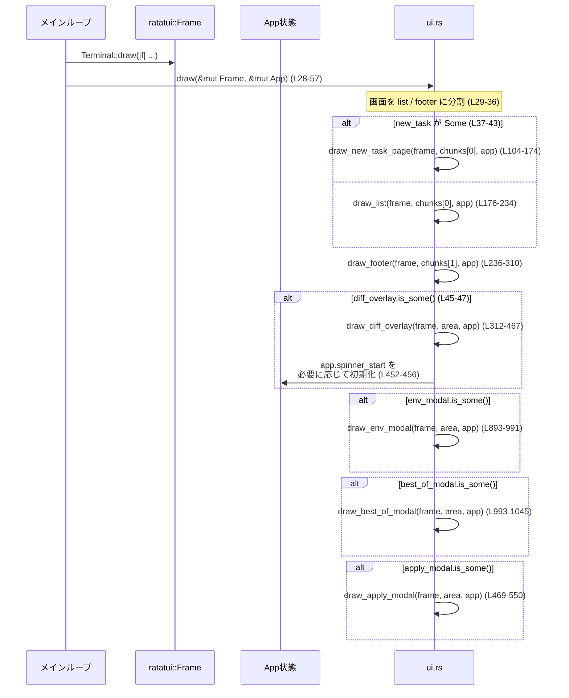

cloud-tasks/src/ui.rs の解説です。

---

## 0. ざっくり一言

Cloud Tasks TUI 全体の画面描画を担当するモジュールで、タスク一覧、新規タスク入力画面、差分ビュー、環境選択モーダルなどの UI を ratatui でレンダリングします（`cloud-tasks/src/ui.rs:L28-57, L176-234, L312-467, L893-1045`）。

---

## 1. このモジュールの役割

### 1.1 概要

- このモジュールは **App 状態をもとに TUI 画面を描画する** ために存在し、次の機能を提供します。
  - メイン画面（タスクリスト＋フッター）の描画（`draw`, `draw_list`, `draw_footer`）
  - 新規タスク入力ページの描画（`draw_new_task_page`）
  - タスク差分／会話詳細オーバーレイの描画（`draw_diff_overlay`）
  - 適用確認モーダル、環境選択モーダル、「best-of」回数選択モーダルの描画（`draw_apply_modal`, `draw_env_modal`, `draw_best_of_modal`）
- いずれも **`&mut Frame` と `&mut App` を受け取る「描画専用の関数」** であり、副作用は画面描画と `spinner_start` の初期化のみです（`cloud-tasks/src/ui.rs:L28-29, L846-855`）。

### 1.2 アーキテクチャ内での位置づけ

このモジュールは、アプリケーション状態 `App` と ratatui の `Frame` の間に位置する「プレゼンテーション層」です。

- 入力: `App`（他モジュールで管理されるアプリ状態）
- 出力: `Frame` 内のウィジェット（ratatui）
- 補助: `crate::scrollable_diff::ScrollableDiff` や `AttemptView` を利用して差分や会話を整形描画します（`cloud-tasks/src/ui.rs:L558-567, L441-444`）。

依存関係を簡略図にすると次のようになります。

```mermaid
flowchart LR
  subgraph AppState["App / 状態 (他モジュール)"]
    A[App<br/>DiffOverlay / EnvModal / BestOfModal<br/>Tasks / Spinner state]
    SD[ScrollableDiff<br/>(crate::scrollable_diff)]
  end

  subgraph UI["ui.rs (このファイル)"]
    D["draw (L28-57)"]
    LST["draw_list (L176-234)"]
    NEW["draw_new_task_page (L104-174)"]
    DIFF["draw_diff_overlay (L312-467)"]
    APPLY["draw_apply_modal (L469-550)"]
    ENV["draw_env_modal (L893-991)"]
    BEST["draw_best_of_modal (L993-1045)"]
  end

  subgraph TUI["ratatui"]
    F[Frame]
    W[Widgets<br/>Block/List/Paragraph...]
  end

  A --> D
  SD --> DIFF
  D --> LST
  D --> NEW
  D --> DIFF
  D --> APPLY
  D --> ENV
  D --> BEST
  D --> F
  UI --> W
```

### 1.3 設計上のポイント

- **責務分割**
  - 画面全体の構成は `draw` が決め、各ビュー／モーダルごとに専用の描画関数を持ちます（`cloud-tasks/src/ui.rs:L28-56`）。
  - オーバーレイ系は共通のジオメトリ／スタイルヘルパー `overlay_outer`, `overlay_block`, `overlay_content` を共有します（`cloud-tasks/src/ui.rs:L71-102`）。
- **状態管理**
  - `App` 内の `Option` フィールド（`new_task`, `diff_overlay`, `env_modal`, `best_of_modal`, `apply_modal`）の有無によって、どのビュー／モーダルを描画するかを切り替えています（`cloud-tasks/src/ui.rs:L37-56, L315-316, L478-479, L907-915, L1025-1026`）。
  - スピナー用には `app.spinner_start: Option<Instant>` を使い、「最初の描画時に Instant を保存し、経過時間から点滅を計算」しています（`cloud-tasks/src/ui.rs:L846-855`）。
- **エラーハンドリング**
  - このモジュール内で `Result` を返す関数はなく、すべて描画専用で `()` を返します。
  - `Option` や `Vec` は `unwrap_or(...)` / `unwrap_or_default(...)` / `is_empty()` などで安全に扱われており、生の `unwrap()` 呼び出しはありません（`cloud-tasks/src/ui.rs:L148-153, L330-333, L478-479, L983-984`）。
- **並行性**
  - 静的変数 `ROUNDED: OnceLock<bool>` を使用し、環境変数 `CODEX_TUI_ROUNDED` を一度だけスレッド安全に読み込んでボーダースタイルを決めています（`cloud-tasks/src/ui.rs:L60-69`）。
  - それ以外のスレッド・非同期操作はこのファイルにはなく、描画は単一スレッドで呼び出される前提と見なせます（コードからしか判断していません）。

---

## 2. 主要な機能一覧

このモジュールが提供する主な機能は次の通りです。

- メイン画面描画:
  - `draw`: App 状態に応じてリスト画面または新規タスク画面を描画し、各種モーダル／オーバーレイも重ねて描画（`cloud-tasks/src/ui.rs:L28-57`）。
- 新規タスクページ:
  - `draw_new_task_page`: 環境・試行回数ラベル付きのヘッダーと、下部に固定されたテキストコンポーザを描画（`cloud-tasks/src/ui.rs:L104-174`）。
- タスク一覧:
  - `draw_list`: タスク要約を複数行の ListItem としてレンダリングし、選択状態と環境フィルタ、スクロールパーセントを描画（`cloud-tasks/src/ui.rs:L176-234`）。
  - `render_task_item`: 各タスクのステータス・環境・差分サマリをスタイル付きで描画（`cloud-tasks/src/ui.rs:L788-844`）。
- フッター:
  - `draw_footer`: キーバインドのヘルプとステータス行、右端のスピナーを描画（`cloud-tasks/src/ui.rs:L236-310`）。
- 差分／会話ビュー:
  - `draw_diff_overlay`: Diff または会話の詳細オーバーレイを描画し、状態バーやスクロール、スピナーを管理（`cloud-tasks/src/ui.rs:L312-467`）。
  - `style_conversation_lines`, `style_diff_line`: 会話ログや unified diff を役割別・行種別にスタイル付け（`cloud-tasks/src/ui.rs:L558-652, L753-785`）。
- モーダル:
  - `draw_apply_modal`: 適用確認モーダル（preflight/apply 状態やコンフリクト一覧）を描画（`cloud-tasks/src/ui.rs:L469-550`）。
  - `draw_env_modal`: 環境選択＆検索モーダル（フィルタ・ピン状態など）を描画（`cloud-tasks/src/ui.rs:L893-991`）。
  - `draw_best_of_modal`: 並列試行回数（1〜4）を選ぶモーダルを描画（`cloud-tasks/src/ui.rs:L993-1045`）。
- 共通ヘルパ:
  - オーバーレイ枠・内側領域計算: `overlay_outer`, `overlay_block`, `overlay_content`（`cloud-tasks/src/ui.rs:L71-102`）
  - スピナー描画: `draw_inline_spinner`, `draw_centered_spinner`（`cloud-tasks/src/ui.rs:L846-888`）
  - 会話ヘッダ／ガター／テキスト: `ConversationSpeaker`, `conversation_header_line`, `conversation_gutter_span`, `conversation_text_spans`, `attempt_status_span`（`cloud-tasks/src/ui.rs:L552-556, L654-678, L680-684, L687-739, L742-750`）

### 2.1 コンポーネント一覧（インベントリー）

| 名前 | 種別 | 公開 | 行範囲 | 役割 / 説明 | 根拠 |
|------|------|------|--------|-------------|------|
| `draw` | 関数 | pub | 28-57 | 画面全体のエントリポイント。リスト／新規タスク＋各モーダルを描画 | `cloud-tasks/src/ui.rs:L28-57` |
| `ROUNDED` | static OnceLock\<bool\> | - | 60 | 枠線を角丸にするかどうかの設定をキャッシュ | `cloud-tasks/src/ui.rs:L60` |
| `rounded_enabled` | 関数 | - | 62-69 | `CODEX_TUI_ROUNDED` 環境変数を読み、枠線の角丸有無を決定 | `cloud-tasks/src/ui.rs:L62-69` |
| `overlay_outer` | 関数 | - | 71-88 | 画面中央 80% 四方のオーバーレイ外枠 Rect を計算 | `cloud-tasks/src/ui.rs:L71-88` |
| `overlay_block` | 関数 | - | 90-98 | 全オーバーレイ共通の Block（枠線＋padding＋角丸）を生成 | `cloud-tasks/src/ui.rs:L90-98` |
| `overlay_content` | 関数 | - | 100-102 | `overlay_block` 内側のコンテンツ領域 Rect を返す | `cloud-tasks/src/ui.rs:L100-102` |
| `draw_new_task_page` | 関数 | pub | 104-174 | 新規タスク作成ページ（タイトル＋ composer 埋め込み）の描画 | `cloud-tasks/src/ui.rs:L104-174` |
| `draw_list` | 関数 | - | 176-234 | タスク一覧 List の描画と in-list スピナー表示 | `cloud-tasks/src/ui.rs:L176-234` |
| `draw_footer` | 関数 | - | 236-310 | キーバインドヘルプ・ステータス行・右端スピナーを描画 | `cloud-tasks/src/ui.rs:L236-310` |
| `draw_diff_overlay` | 関数 | - | 312-467 | Diff／会話の詳細オーバーレイを描画し、ビュー・スクロール・状態バーを管理 | `cloud-tasks/src/ui.rs:L312-467` |
| `draw_apply_modal` | 関数 | pub | 469-550 | タスク適用確認モーダル（結果メッセージとコンフリクトなど）を描画 | `cloud-tasks/src/ui.rs:L469-550` |
| `ConversationSpeaker` | enum | 非pub | 552-556 | 会話行の話者種別（User / Assistant）を表現 | `cloud-tasks/src/ui.rs:L552-556` |
| `style_conversation_lines` | 関数 | - | 558-652 | `ScrollableDiff` の会話テキストを話者・コード・箇条書きなどに応じてスタイル付け | `cloud-tasks/src/ui.rs:L558-652` |
| `conversation_header_line` | 関数 | - | 654-678 | 「User prompt」「Assistant response」ヘッダ行＋ステータスを生成 | `cloud-tasks/src/ui.rs:L654-678` |
| `conversation_gutter_span` | 関数 | - | 680-684 | 会話行左側のガター `"│ "` を話者に応じた色で返す | `cloud-tasks/src/ui.rs:L680-684` |
| `conversation_text_spans` | 関数 | - | 687-739 | 会話本文をコードブロック・ヘッダ・箇条書き・通常行でスタイル分岐 | `cloud-tasks/src/ui.rs:L687-739` |
| `attempt_status_span` | 関数 | - | 742-750 | 試行ステータスを色付きテキスト（Completed, Failed など）に変換 | `cloud-tasks/src/ui.rs:L742-750` |
| `style_diff_line` | 関数 | - | 753-785 | unified diff の hunk header, +/- 行などを色分けしてスタイル付け | `cloud-tasks/src/ui.rs:L753-785` |
| `render_task_item` | 関数 | - | 788-844 | タスクサマリを 3 行＋空行の ListItem として描画 | `cloud-tasks/src/ui.rs:L788-844` |
| `draw_inline_spinner` | 関数 | - | 846-863 | 指定領域内に単一行スピナー（点滅ドット＋ラベル）を描画 | `cloud-tasks/src/ui.rs:L846-863` |
| `draw_centered_spinner` | 関数 | - | 865-888 | 指定 Rect 内で中央に `draw_inline_spinner` を配置 | `cloud-tasks/src/ui.rs:L865-888` |
| `draw_env_modal` | 関数 | pub | 893-991 | 環境選択モーダル（検索＋リスト＋ All Environments）を描画 | `cloud-tasks/src/ui.rs:L893-991` |
| `draw_best_of_modal` | 関数 | pub | 993-1045 | best-of 並列試行数を選ぶ小さなモーダルを描画 | `cloud-tasks/src/ui.rs:L993-1045` |

---

## 3. 公開 API と詳細解説

### 3.1 型一覧（構造体・列挙体など）

公開型はありませんが、UI 表現を理解する上で重要な内部型を載せます。

| 名前 | 種別 | 公開 | 役割 / 用途 | 根拠 |
|------|------|------|-------------|------|
| `ConversationSpeaker` | enum | 非pub | 会話ビューで行の左ガター色やヘッダ文言を決めるための話者種別（User / Assistant） | `cloud-tasks/src/ui.rs:L552-556` |

### 3.2 重要な関数の詳細

#### `pub fn draw(frame: &mut Frame, app: &mut App)`

**概要**

- Cloud Tasks TUI 全体のメイン描画関数です。
- タスクリスト／新規タスクページとフッターを描画し、必要に応じて差分オーバーレイや各種モーダルを重ねて描画します（`cloud-tasks/src/ui.rs:L28-57`）。

**引数**

| 引数名 | 型 | 説明 |
|--------|----|------|
| `frame` | `&mut Frame` | ratatui の描画ターゲット。各ウィジェットを描画するキャンバス |
| `app` | `&mut App` | アプリケーション状態。現在の画面モードやタスク一覧などを含む |

**戻り値**

- `()`（戻り値なし）。副作用として `frame` に描画し、`app.spinner_start` を必要に応じて初期化します。

**内部処理の流れ**

1. 画面全体の Rect を取得し、縦方向に「メインエリア」と「2 行フッター」に分割します（`cloud-tasks/src/ui.rs:L29-36`）。
2. `app.new_task` が `Some` なら `draw_new_task_page` を、そうでなければ `draw_list` を呼び出しメインエリアを描画します（`cloud-tasks/src/ui.rs:L37-43`）。
3. 常に `draw_footer` を呼び出してフッターを描画します（`cloud-tasks/src/ui.rs:L38-42`）。
4. `diff_overlay`, `env_modal`, `best_of_modal`, `apply_modal` がそれぞれ `Some` なら、順に対応する描画関数を呼び出し、画面全体にオーバーレイを重ねます（`cloud-tasks/src/ui.rs:L45-56`）。

**Examples（使用例）**

`ratatui` の `Terminal::draw` から呼び出す典型的な例です（`ui` はこのモジュールとします）。

```rust
use ratatui::{backend::CrosstermBackend, Terminal};
use cloud_tasks::app::App;
use cloud_tasks::ui; // このファイルのモジュール

fn render<B: ratatui::backend::Backend>(
    terminal: &mut Terminal<B>,
    app: &mut App,
) -> std::io::Result<()> {
    terminal.draw(|frame| {
        // 毎フレーム、App の状態に応じた画面が描画される
        ui::draw(frame, app);
    })
}
```

**Errors / Panics**

- この関数内では `unwrap()` などのパニックを起こす操作はありません。
- パニックの可能性は ratatui 内部のウィジェット描画に依存しますが、このチャンクからはその挙動は分かりません。

**Edge cases（エッジケース）**

- `app.new_task` も各種モーダルもすべて `None` の場合、タスク一覧＋フッターのみが描画されます（`cloud-tasks/src/ui.rs:L37-56`）。
- `app.diff_overlay.is_some()` などは描画後の重ね順に影響し、最後に呼ばれたモーダルほど上に表示されます（`cloud-tasks/src/ui.rs:L45-56`）。

**使用上の注意点**

- `app.selected` などのインデックス系フィールドは、呼び出し側で `tasks.len()` 等の範囲と整合させておくと安全です。範囲外インデックスに対する ratatui の挙動はこのファイルからは判断できません（`cloud-tasks/src/ui.rs:L176-181`）。
- 描画関数は副作用として `app.spinner_start` を更新するため、描画ループの外でこのフィールドを過度に書き換えるとスピナーの点滅タイミングが乱れる可能性があります（`cloud-tasks/src/ui.rs:L846-855`）。

---

#### `pub fn draw_new_task_page(frame: &mut Frame, area: Rect, app: &mut App)`

**概要**

- 新規タスク作成ページを描画します。
- 上部にタイトル（環境ラベル・試行回数）を表示し、下部にテキストコンポーザ（エディタ）を表示します（`cloud-tasks/src/ui.rs:L104-174`）。

**引数**

| 引数名 | 型 | 説明 |
|--------|----|------|
| `frame` | `&mut Frame` | 描画先 |
| `area` | `Rect` | このページを描画する領域（`draw` 側で分割済み） |
| `app` | `&mut App` | `new_task`, `environments` などの状態を含む |

**戻り値**

- `()`。

**内部処理の流れ**

1. タイトル用の `Span` ベクタを構築します。
   - 固定の `"New Task"` に、選択環境ラベル（または「Env: none」）と best-of 試行数を付加します（`cloud-tasks/src/ui.rs:L105-135`）。
2. Block を生成し、全体をクリアした上で枠線つきのブロックを描画、その内側領域を `content` として取得します（`cloud-tasks/src/ui.rs:L138-145`）。
3. フレーム全体の高さと `composer.desired_height` から、コンポーザに割り当てる行数 `desired` を 3〜`terminal_height-6` の範囲にクランプします（`cloud-tasks/src/ui.rs:L146-153`）。
4. `content` を上部スペーサ＋コンポーザ領域に 2 分割し、`composer.render_ref` で描画します（`cloud-tasks/src/ui.rs:L155-165`）。
5. `composer.cursor_pos` で得たカーソル位置に `frame.set_cursor_position` でカーソルを移動します（`cloud-tasks/src/ui.rs:L168-173`）。

**Examples（使用例）**

`draw` からの呼び出し例（実際のコードと同じ構造）:

```rust
// draw 内で new_task モードの場合
if app.new_task.is_some() {
    let chunks = Layout::default()
        .direction(Direction::Vertical)
        .constraints([Constraint::Min(1), Constraint::Length(2)])
        .split(frame.area());
    draw_new_task_page(frame, chunks[0], app);
}
```

**Errors / Panics**

- `app.new_task` が `None` の場合でも、`desired` の計算は `unwrap_or(3)` を用いるため安全です（`cloud-tasks/src/ui.rs:L148-153`）。
- `composer.render_ref` と `cursor_pos` の実装次第ではパニックの可能性がありますが、このチャンクにはその実装はありません。

**Edge cases**

- 環境 ID が `environments` に見つからない場合、ラベルには ID 文字列そのものが表示されます（`cloud-tasks/src/ui.rs:L115-121`）。
- `new_task` があっても `composer.cursor_pos` が `None` を返す場合、カーソル移動は行われません（`cloud-tasks/src/ui.rs:L169-173`）。

**使用上の注意点**

- `App` 側で `new_task` を `Some` にすることでこのビューが有効になります。逆に `None` に戻せば `draw` はリストビューに戻ります（`cloud-tasks/src/ui.rs:L37-43`）。

---

#### `fn draw_list(frame: &mut Frame, area: Rect, app: &mut App)`

**概要**

- タスク一覧を `List` ウィジェットとして描画します。
- 環境フィルタとスクロールパーセンテージをタイトルに表示し、ロード中は領域内にスピナーも描画します（`cloud-tasks/src/ui.rs:L176-234`）。

**引数**

| 引数名 | 型 | 説明 |
|--------|----|------|
| `frame` | `&mut Frame` | 描画先 |
| `area` | `Rect` | リストを描画する領域 |
| `app` | `&mut App` | `tasks`, `selected`, `env_filter`, `refresh_inflight` などを含む |

**戻り値**

- `()`。

**内部処理の流れ**

1. `app.tasks` を `render_task_item` で `Vec<ListItem>` に変換します（`cloud-tasks/src/ui.rs:L177`）。
2. `ListState::with_selected(Some(app.selected))` で選択インデックスをセットします（`cloud-tasks/src/ui.rs:L180`）。
3. モーダルが開いている場合は `dim_bg` を `true` にし、タイトルやリスト全体を淡色表示にします（`cloud-tasks/src/ui.rs:L181-185, L205-211, L225-227`）。
4. `env_filter` に従い、タイトル末尾に「All」「Selected」もしくは環境ラベルを付けます（`cloud-tasks/src/ui.rs:L187-197`）。
5. `app.selected` と `tasks.len()` からスクロールパーセンテージ（0〜100%）を計算しタイトルに追加します（`cloud-tasks/src/ui.rs:L199-204`）。
6. 枠付き Block を描画し、その内側を 1 行のスペーサ＋残りリストに分割、`frame.render_stateful_widget` でリストを描画します（`cloud-tasks/src/ui.rs:L213-228`）。
7. `app.refresh_inflight` が `true` の場合、リスト領域内中央にスピナーを描画します（`cloud-tasks/src/ui.rs:L230-233`）。

**Examples（使用例）**

`draw` 内での実際の呼び出し:

```rust
// new_task がない場合のみ
if app.new_task.is_none() {
    let chunks = Layout::default()
        .direction(Direction::Vertical)
        .constraints([Constraint::Min(1), Constraint::Length(2)])
        .split(frame.area());
    draw_list(frame, chunks[0], app);
}
```

**Errors / Panics**

- `ListState::with_selected(Some(app.selected))` に範囲外インデックスが渡された場合の挙動は ratatui に依存し、このファイルからは安全性を判断できません。
- `render_task_item` 内には `unwrap()` などはなく、`summary` のカウンタは整数比較だけなのでパニック要因はありません（`cloud-tasks/src/ui.rs:L819-839`）。

**Edge cases**

- `tasks.len() <= 1` ではスクロールパーセンテージは常に `0%` を表示します（`cloud-tasks/src/ui.rs:L199-201`）。
- `env_filter` が `Some` だが `environments` に対応する行がない場合、タイトルには `"Selected"` と表示されます（`cloud-tasks/src/ui.rs:L187-194`）。

**使用上の注意点**

- `app.selected` が 0 から `app.tasks.len() - 1` の範囲に収まるように、入力ハンドラ側でクランプするのが望ましいです（このファイル内ではクランプされていません）。
- モーダルが開いている間はリストが淡色表示されるため、モーダル開閉時に `dim_bg` に対応する App 状態を正しく設定する必要があります（`cloud-tasks/src/ui.rs:L181-185`）。

---

#### `fn draw_diff_overlay(frame: &mut Frame, area: Rect, app: &mut App)`

**概要**

- タスクの差分または会話ログをオーバーレイとして画面中央に描画します（`cloud-tasks/src/ui.rs:L312-467`）。
- 「Diff」「Details」「FAILED」などのタイトルや、Prompt / Diff 切り替えラベル、試行番号、スクロールバー相当のパーセンテージを表示します。

**引数**

| 引数名 | 型 | 説明 |
|--------|----|------|
| `frame` | `&mut Frame` | 描画先 |
| `area` | `Rect` | 画面全体の領域 |
| `app` | `&mut App` | `diff_overlay`, `details_inflight`, `spinner_start` を含む |

**戻り値**

- `()`。

**内部処理の流れ（概要）**

1. `overlay_outer(area)` で中央 80% 四方のオーバーレイ領域 `inner` を確保し、`app.diff_overlay` が `None` なら何もしないで return（`cloud-tasks/src/ui.rs:L313-316`）。
2. `current_can_apply` に基づき適用可能かどうかを判定し、先頭行が `"Task failed:"` で始まり適用不可ならエラー表示とみなします（`cloud-tasks/src/ui.rs:L317-328`）。
3. タイトルとして `"Diff:" / "Details:" / "Details [FAILED]"` とタスク名、およびスクロールパーセントを組み立て、枠付き Block を描画します（`cloud-tasks/src/ui.rs:L335-361`）。
4. 内側コンテンツ領域を `content_full` とし、`current_attempt` にテキスト／diff がある場合はさらに 1 行のステータスバー＋本文に分割します（`cloud-tasks/src/ui.rs:L364-373`）。
5. ステータスバーには、「Prompt / Diff」のどちらが選択されているかや `Attempt i/n` 表示、切り替えヒントを描画します（`cloud-tasks/src/ui.rs:L375-415`）。
6. `ScrollableDiff` (`ov.sd`) に表示幅と高さを渡して折り返しと viewport を設定します（`cloud-tasks/src/ui.rs:L417-423`）。
7. `DetailView::Diff` なら `style_diff_line` で diff 行をスタイル付けし、それ以外（Prompt/Conversation）なら `style_conversation_lines` を用いて会話ログのスタイルを決定します（`cloud-tasks/src/ui.rs:L429-445`）。
8. `details_inflight` かつ元テキストが空ならスピナーを中央に描画、それ以外は `Paragraph` にしてスクロール位置を適用して描画します（`cloud-tasks/src/ui.rs:L446-466`）。

**Examples（使用例）**

`draw` からの呼び出しは次の通りです。

```rust
// diffs が開いているときだけ呼び出される
if app.diff_overlay.is_some() {
    draw_diff_overlay(frame, frame.area(), app);
}
```

**Errors / Panics**

- `wrapped_lines()[0]` にアクセスする前に `first().cloned()` を通し、`unwrap_or(false)` で空の場合を防いでいるため、インデックスによるパニックは避けられています（`cloud-tasks/src/ui.rs:L323-328`）。
- `ScrollableDiff` や `AttemptView` のメソッド（`wrapped_lines`, `raw_line_at` など）がパニックを起こさないことが前提ですが、この実装は別ファイルであり、このチャンクからは判断できません。

**Edge cases**

- `current_attempt()` が常に `None` かつ `base_can_apply` も `false` の場合、ステータスバーは表示されず、`ScrollableDiff` の viewport は `content_full` 全体になります（`cloud-tasks/src/ui.rs:L367-424`）。
- `wrapped_lines()` が空の状態で `details_inflight == true` の場合には、本文の代わりに「Loading details…」スピナーが表示されます（`cloud-tasks/src/ui.rs:L446-457`）。

**使用上の注意点**

- `ScrollableDiff` の状態更新（スクロール位置、ラップ更新）は別モジュール側で管理する必要があります。ここでは `set_width / set_viewport` と描画のみを行います（`cloud-tasks/src/ui.rs:L417-423`）。
- `AttemptView` の `has_text` / `has_diff` の実装が、空文字列や空 diff を適切に判定することが前提です（`cloud-tasks/src/ui.rs:L367-368`）。

---

#### `pub fn draw_apply_modal(frame: &mut Frame, area: Rect, app: &mut App)`

**概要**

- タスク差分の「適用」操作前後の状態を表示するモーダルダイアログです。
- Preflight 中 / 適用中 / メッセージ取得中にはスピナーを表示し、結果メッセージとコンフリクト・スキップされたパスを一覧表示します（`cloud-tasks/src/ui.rs:L469-550`）。

**引数**

| 引数名 | 型 | 説明 |
|--------|----|------|
| `frame` | `&mut Frame` | 描画先 |
| `area` | `Rect` | 画面全体の領域 |
| `app` | `&mut App` | `apply_modal`, `apply_preflight_inflight`, `apply_inflight` などを含む |

**戻り値**

- `()`。

**内部処理の流れ**

1. `overlay_outer` と `overlay_block` でモーダル枠を準備し、`Apply Changes?` タイトル付きで描画（`cloud-tasks/src/ui.rs:L471-476`）。
2. `app.apply_modal` が `Some` の場合のみモーダル内容を描画し、`None` なら何も描画しません（`cloud-tasks/src/ui.rs:L478-479`）。
3. 上部ヘッダ行に `"Apply '<title>' ?"` を magenta + bold で表示し、下部フッタに `"Press Y to apply, P to preflight, N to cancel."` を dim 表示します（`cloud-tasks/src/ui.rs:L480-487, L545-548`）。
4. 中央ボディ領域では、以下の優先順位で表示を切り替えます（`cloud-tasks/src/ui.rs:L499-507`）。
   - `apply_preflight_inflight` → `"Checking…" スピナー`
   - `apply_inflight` → `"Applying…" スピナー`
   - `m.result_message.is_none()` → `"Loading…" スピナー`
   - それ以外 → 結果メッセージと conflict/skipped パス一覧
5. 結果メッセージは `result_level` に応じて色付けします（Success → 緑, Partial → マゼンタ, Error → 赤）し、Partial/Error の場合のみ conflict/skipped のリストを生成します（`cloud-tasks/src/ui.rs:L508-544`）。

**Errors / Panics**

- `conflict_paths` / `skipped_paths` は `is_empty()` 判定後にループしているため、インデックス系のパニック要因はありません（`cloud-tasks/src/ui.rs:L520-543`）。

**Edge cases**

- `apply_modal` が `Some` でも `result_message` が `None` の場合、ずっと `"Loading…"` スピナーが表示され続けます（`cloud-tasks/src/ui.rs:L501-507`）。これは呼び出し側でメッセージを設定して初めて解除されます。
- `result_level == Some(Success)` の場合、conflict/skipped リストは表示されません（`cloud-tasks/src/ui.rs:L518-519`）。

**使用上の注意点**

- `apply_modal` を `None` に戻せばモーダルは非表示になります。キー入力ハンドラ側で Y/P/N に応じて `apply_inflight` や `apply_preflight_inflight` を適切に更新する必要があります。

---

#### `pub fn draw_env_modal(frame: &mut Frame, area: Rect, app: &mut App)`

**概要**

- 環境（Environment）の選択・検索を行うモーダルを描画します（`cloud-tasks/src/ui.rs:L893-991`）。
- 上部に使い方ヒント、中部に検索クエリ、下部にフィルタされた環境リストを表示します。

**引数**

| 引数名 | 型 | 説明 |
|--------|----|------|
| `frame` | `&mut Frame` | 描画先 |
| `area` | `Rect` | 全体領域 |
| `app` | `&mut App` | `env_modal`, `env_loading`, `environments` などを含む |

**戻り値**

- `()`。

**内部処理の流れ**

1. `overlay_outer`＋`overlay_block` で「Select Environment」タイトル付きの枠を描画（`cloud-tasks/src/ui.rs:L897-905`）。
2. `app.env_loading` が `true` の場合、「Loading environments…」スピナーを中央に描画して終了（`cloud-tasks/src/ui.rs:L907-915`）。
3. それ以外の場合、内側コンテンツを縦に 3 分割し、サブヘッダ／検索行／リストを描画（`cloud-tasks/src/ui.rs:L917-925`）。
4. 検索クエリ `query` は `env_modal` に保存されている文字列を使用し、その小文字化を使って `environments` をフィルタします（ラベル・ID・repo_hints を対象）（`cloud-tasks/src/ui.rs:L934-963`）。
5. 先頭に「All Environments (Global)」を固定で挿入し、その後にフィルタ結果 `envs` を列挙した ListItem を追加します（`cloud-tasks/src/ui.rs:L965-981`）。
6. 選択インデックスは `env_modal.selected` を `envs.len()` でクランプし、`ListState` に反映します（`cloud-tasks/src/ui.rs:L983-985`）。

**Errors / Panics**

- クエリが空のときはすべての environment を表示し、`contains` 検索も安全にスキップしています（`cloud-tasks/src/ui.rs:L947-951`）。
- `envs.len()` が 0 のときも、最低 1 項目（All Environments）があるため、`selected` が `envs.len()` と等しい場合でもリスト長との不整合は起きにくい構造になっています（`cloud-tasks/src/ui.rs:L965-980, L983-985`）。

**Edge cases**

- ラベルが `None` の環境は `<unnamed>` として表示されます（`cloud-tasks/src/ui.rs:L968-969`）。
- `is_pinned` が `true` の環境には `"PINNED"` バッジが付与されます（`cloud-tasks/src/ui.rs:L970-973`）。

**使用上の注意点**

- 「All Environments」を選択する行は `envs` に含まれないため、選択インデックスと実際の environment 行を対応付ける際は「先頭に 1 行追加されている」ことを考慮する必要があります（この対応付けロジックは別モジュール側に存在すると考えられます）。

---

#### `pub fn draw_best_of_modal(frame: &mut Frame, area: Rect, app: &mut App)`

**概要**

- 「Parallel Attempts」と題された、並列試行回数（1〜4）を選ぶ小型モーダルです（`cloud-tasks/src/ui.rs:L993-1045`）。
- 現在の設定値には "Current" バッジを表示します。

**引数**

| 引数名 | 型 | 説明 |
|--------|----|------|
| `frame` | `&mut Frame` | 描画先 |
| `area` | `Rect` | 全体領域 |
| `app` | `&mut App` | `best_of_modal`, `best_of_n` を含む |

**戻り値**

- `()`。

**内部処理の流れ**

1. `overlay_outer` で内側領域を取り、その中でさらに最大幅・最小幅／高さにクランプした中央モーダル Rect を計算します（`cloud-tasks/src/ui.rs:L996-1008`）。
2. 「Parallel Attempts」タイトル付き Block を描画し、その内側を 2 行（ヒント＋リスト）に分割します（`cloud-tasks/src/ui.rs:L1009-1019`）。
3. 上部行に `"Use ↑/↓ to choose, 1-4 jump"` ヒントを dim 表示します（`cloud-tasks/src/ui.rs:L1021-1023`）。
4. 下部行には 1,2,3,4 の選択肢を ListItem として並べ、各項目に `"n attempts"` と `"n x parallel"` を表示、`app.best_of_n` と一致する項目には `"Current"` バッジを付けます（`cloud-tasks/src/ui.rs:L1025-1037`）。
5. `best_of_modal.selected` を `options.len()-1` でクランプし、`ListState` に設定して描画します（`cloud-tasks/src/ui.rs:L1039-1045`）。

**Errors / Panics**

- 選択肢は固定配列 `[1,2,3,4]` であり、範囲外インデックスアクセスは存在しません。

**Edge cases**

- ターミナルが非常に狭い場合でも、`MIN_WIDTH=20` / `MIN_HEIGHT=6` を下限としてモーダル領域を確保します（`cloud-tasks/src/ui.rs:L997-1005`）。

**使用上の注意点**

- 実際に best-of 設定を更新するのは別モジュールの入力ハンドラと `App` のロジックであり、この関数は描画のみ行います。`best_of_modal` を `None` にするとこのモーダルは表示されなくなります。

---

### 3.3 その他の関数

補助的または単純なラッパー関数をまとめます。

| 関数名 | 役割（1 行） | 根拠 |
|--------|--------------|------|
| `draw_footer` | キーバインドヘルプ＋ステータス行＋右端スピナーの描画 | `cloud-tasks/src/ui.rs:L236-310` |
| `render_task_item` | タスクサマリを ListItem（タイトル・メタ情報・diff 概要）に整形 | `cloud-tasks/src/ui.rs:L788-844` |
| `draw_inline_spinner` | 単一行スピナー（点滅ドット＋ラベル）を描画 | `cloud-tasks/src/ui.rs:L846-863` |
| `draw_centered_spinner` | 与えられた Rect の中央にスピナーを配置して描画 | `cloud-tasks/src/ui.rs:L865-888` |
| `style_conversation_lines` | `ScrollableDiff` から取得した会話ログを話者ごとのガターやコードブロック、箇条書きとしてスタイル付け | `cloud-tasks/src/ui.rs:L558-652` |
| `conversation_header_line` | 「User prompt」「Assistant response」ヘッダ行とステータスを生成 | `cloud-tasks/src/ui.rs:L654-678` |
| `conversation_gutter_span` | `"│ "` ガターの色を話者に応じて返す | `cloud-tasks/src/ui.rs:L680-684` |
| `conversation_text_spans` | Markdown 風表現（コードブロック・見出し・箇条書き）をスタイル付き Span 群に変換 | `cloud-tasks/src/ui.rs:L687-739` |
| `attempt_status_span` | AttemptStatus を色付きテキストに変換 | `cloud-tasks/src/ui.rs:L742-750` |
| `style_diff_line` | unified diff の行種類ごとの色付け（hunk header, +, -, +++/---） | `cloud-tasks/src/ui.rs:L753-785` |

---

## 4. データフロー

### 4.1 代表的な描画シナリオ

「タスク一覧を表示し、選択中タスクの詳細 diff オーバーレイを開いている」状態の描画の流れを示します。

- 前提: メインループが ratatui の `Terminal::draw` で `ui::draw` を毎フレーム呼び出す。
- 状態: `app.new_task == None`, `app.diff_overlay.is_some() == true`。



このシナリオでの重要なデータフロー:

- `App.tasks` → `draw_list` → `render_task_item` を通じて `ListItem` に変換され、`List` ウィジェットのデータ源になります（`cloud-tasks/src/ui.rs:L176-177, L788-844`）。
- `App.diff_overlay.sd` → `style_diff_line` または `style_conversation_lines` を通じて `Line<'static>` ベクタとなり `Paragraph` で描画されます（`cloud-tasks/src/ui.rs:L434-445, L464-465`）。
- スピナーは `app.spinner_start: Option<Instant>` と現在時刻の差から点滅状態が決まり、複数箇所で共有されます（`cloud-tasks/src/ui.rs:L846-855, L230-233, L288-295, L452-456, L501-507, L907-915`）。

---

## 5. 使い方（How to Use）

### 5.1 基本的な使用方法

このモジュールは、外部からは主に `draw` を呼び出します。ratatui と組み合わせた最小限の例は次のようになります。

```rust
use ratatui::{
    backend::CrosstermBackend,
    Terminal,
};
use std::io;
use cloud_tasks::app::App;
use cloud_tasks::ui; // このファイルのモジュール

fn main() -> io::Result<()> {
    // 端末と backend の初期化（詳細は ratatui/crossterm のドキュメント参照）
    let stdout = io::stdout();
    let backend = CrosstermBackend::new(stdout);
    let mut terminal = Terminal::new(backend)?;

    // App 状態の初期化（実装は crate::app 側に存在）
    let mut app = App::default(); // 実際には適切なコンストラクタを使用

    // 1フレームだけ描画する例
    terminal.draw(|frame| {
        ui::draw(frame, &mut app);
    })?;

    Ok(())
}
```

- 新規タスク画面を表示したい場合は、`App` 側で `app.new_task` を `Some` にセットすると、次の描画から `draw_new_task_page` が使われるようになります（`cloud-tasks/src/ui.rs:L37-43`）。
- 環境モーダル・best-of モーダル・diff オーバーレイなども、それぞれ `App` 内の該当フィールドを `Some` にすることで表示されます（`cloud-tasks/src/ui.rs:L45-56`）。

### 5.2 よくある使用パターン

1. **タスク一覧のみ表示する TUI**

   - `App.new_task == None`
   - `App.diff_overlay, App.env_modal, App.apply_modal, App.best_of_modal == None`
   - これにより `draw` は `draw_list` と `draw_footer` のみを呼びます（`cloud-tasks/src/ui.rs:L37-43, L45-56`）。

2. **詳細 diff オーバーレイを開く**

   - 入力ハンドラ側で、あるタスクを選択した状態で `app.diff_overlay = Some(...)` とし、`ScrollableDiff` と `AttemptView` をセットアップします（実装は別ファイル）。
   - 次の描画で `draw_diff_overlay` が呼ばれ、 diff or conversation ビューが表示されます（`cloud-tasks/src/ui.rs:L45-47, L312-467`）。

3. **環境選択／best-of モーダルを順に開く**

   - `app.env_modal = Some(...)` とすると環境モーダルが表示され、環境決定後に `None` に戻します（`cloud-tasks/src/ui.rs:L48-50, L893-991`）。
   - 別の操作で `app.best_of_modal = Some(...)` とすれば best-of モーダルが開きます（`cloud-tasks/src/ui.rs:L51-53, L993-1045`）。

### 5.3 よくある間違い（想定されるもの）

コードから推測できる誤用例と正しい使い方です。

```rust
// 誤りの可能性がある例: tasks が空なのに selected を 0 より大きく保つ
app.tasks.clear();
app.selected = 5; // リスト長と整合していない

// draw_list は selected をそのまま ListState::with_selected に渡す
// 挙動は ratatui の実装に依存し、このチャンクからは安全性を判断できない
```

```rust
// より安全な例: selected を tasks.len() に応じてクランプする（入力ハンドラ側）
if app.selected >= app.tasks.len() {
    app.selected = app.tasks.saturating_sub(1);
}
```

```rust
// 誤りの可能性: env_modal.selected を envs と All Environments のずれを考慮せずに解釈する
// （実際の解釈コードはこのチャンクには存在しませんが、注意点として）
// envs[sel] と直接対応付けると All Environments 行の分だけずれる可能性
```

### 5.4 使用上の注意点（まとめ）

- **前提条件**
  - `App` 内のインデックス（`selected`, モーダルの `selected` など）は、対応するコレクション長と整合していることが望ましいです（`cloud-tasks/src/ui.rs:L176-181, L983-985, L1039-1040`）。
- **エラー・パニック**
  - このファイル内では明示的な `unwrap()` や `expect()` が使われておらず、主なパニック要因は依存モジュール（ratatui / ScrollableDiff / AttemptView）側にあります。
- **並行性**
  - `ROUNDED` の初期化のみ `OnceLock` を用いるスレッド安全な one-time 初期化です（`cloud-tasks/src/ui.rs:L60-69`）。描画関数自体は単一スレッドで呼び出される前提です。
- **セキュリティ / 表示安全性**
  - タスクタイトルやステータス文字列はそのまま TUI に表示されます（`cloud-tasks/src/ui.rs:L797-802, L804-816`）。制御文字や非常に長い文字列をどう扱うかは上位レイヤと端末の挙動に依存します。
  - ステータス行は 2000 文字に切り詰められ、末尾に `…` が付加されます（`cloud-tasks/src/ui.rs:L300-305`）。

---

## 6. 変更の仕方（How to Modify）

### 6.1 新しい機能を追加する場合

1. **新規オーバーレイ／モーダルを追加**

   - このファイルに `fn draw_xxx_modal(frame: &mut Frame, area: Rect, app: &mut App)` を追加します。
   - レイアウトとスタイルには既存の `overlay_outer`, `overlay_block`, `overlay_content` を再利用すると、一貫した見た目になります（`cloud-tasks/src/ui.rs:L71-102`）。
   - `App` に対応する `Option<YourModalState>` フィールドを追加し、`draw` 内で `if app.your_modal.is_some() { draw_your_modal(...); }` を追加します（`cloud-tasks/src/ui.rs:L45-56`）。

2. **タスク一覧に新しい情報を表示**

   - 既存の `render_task_item` にフィールドを追加し、必要に応じて `TaskSummary` 型にもフィールドを追加します（`cloud-tasks/src/ui.rs:L788-844`）。
   - 複数行構造（タイトル＋メタ＋サマリ＋空行）になっているため、適切な行に新情報を挿入します。

3. **新しい Attempt ステータスを扱う**

   - `AttemptStatus` に新バリアントが増えた場合、`attempt_status_span` にそのケースを追加して表示スタイルを定義します（`cloud-tasks/src/ui.rs:L742-750`）。

### 6.2 既存の機能を変更する場合

- **影響範囲の確認**
  - `draw_*` 系関数は `draw` からのみ呼ばれており、外部公開されているのは `draw`, `draw_new_task_page`, `draw_apply_modal`, `draw_env_modal`, `draw_best_of_modal` のみです（`cloud-tasks/src/ui.rs:L28-57, L104-174, L469-550, L893-991, L993-1045`）。
  - スクロール・差分関連の変更は `ScrollableDiff` や `AttemptView` にも影響する可能性があるため、`crate::scrollable_diff` と `crate::app` 側の実装をあわせて確認する必要があります（`cloud-tasks/src/ui.rs:L558-567, L441-444`）。

- **契約（前提条件・返り値の意味など）**
  - `style_conversation_lines` は「`user:`」「`assistant:`」という行を話者切り替えトークンとして扱う契約になっています（`cloud-tasks/src/ui.rs:L581-600`）。フォーマットを変える場合、この契約を守るか、関数側のパーサを更新する必要があります。
  - diff 行のスタイルは行頭の `@@`, `+++`, `---`, `+`, `-` に依存しているため、diff 生成側のフォーマットを変える際は `style_diff_line` と整合させてください（`cloud-tasks/src/ui.rs:L759-783`）。

- **テスト / 動作確認の観点（このファイルだけから言えること）**
  - レイアウト変更後は、ターミナルサイズが極端に小さい場合（最小幅・最小高さ付近）と、Overlay/Modal が重なった場合の見え方を確認するのが有用です（`cloud-tasks/src/ui.rs:L865-888, L993-1005`）。
  - スピナー関連変更時は、`spinner_start` が適切に初期化／再利用され、想定通りの点滅周期になるか（約 600ms ごとにトグル）を確認する必要があります（`cloud-tasks/src/ui.rs:L846-855`）。

---

## 7. 関連ファイル

このモジュールと密接に関係するモジュール（物理ファイルパスはこのチャンクからは分かりません）を挙げます。

| パス / モジュール | 役割 / 関係 |
|------------------|------------|
| `crate::app` | `App`, `AttemptView`, `DiffOverlay`, `EnvironmentRow`, `BestOfModalState` などのアプリケーション状態とビジネスロジックを提供し、本モジュールのすべての描画関数がこれを参照します（`cloud-tasks/src/ui.rs:L21-22, L317-321, L399-404, L508-513, L742-750, L944-963`）。 |
| `crate::scrollable_diff` | `ScrollableDiff` 型を提供し、diff／会話テキストのラッピングとスクロール状態管理を担当します。本モジュールでは描画時に幅と viewport を設定し、wrapped 行を取得してスタイル付けします（`cloud-tasks/src/ui.rs:L558-567, L417-423, L435-445`）。 |
| `crate::util::format_relative_time_now` | `TaskSummary.updated_at` から「x 分前」などの相対時間文字列を生成し、タスク一覧のメタ情報として表示されます（`cloud-tasks/src/ui.rs:L23, L809-810`）。 |
| `codex_cloud_tasks_client` | `TaskStatus`, `AttemptStatus`, `TaskSummary` などクラウドタスクのクライアント API 型を提供し、本モジュールではステータス表示・タスク要約描画に使用しています（`cloud-tasks/src/ui.rs:L24-25, L742-750, L788-794`）。 |
| `codex_tui::render_markdown_text` | Markdown ライクなテキストを ratatui 用の `Text` に変換するユーティリティで、会話テキストのスタイル付けに用いられています（`cloud-tasks/src/ui.rs:L26, L732-739`）。 |

このチャンクにはテストコードやログ出力は含まれていませんが、UI の状態はステータス行やオーバーレイ上のメッセージとして可視化される設計になっています（`cloud-tasks/src/ui.rs:L299-309, L508-544`）。
