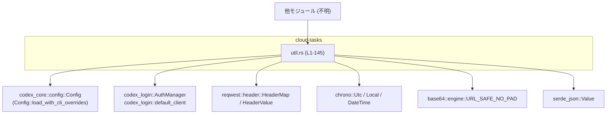
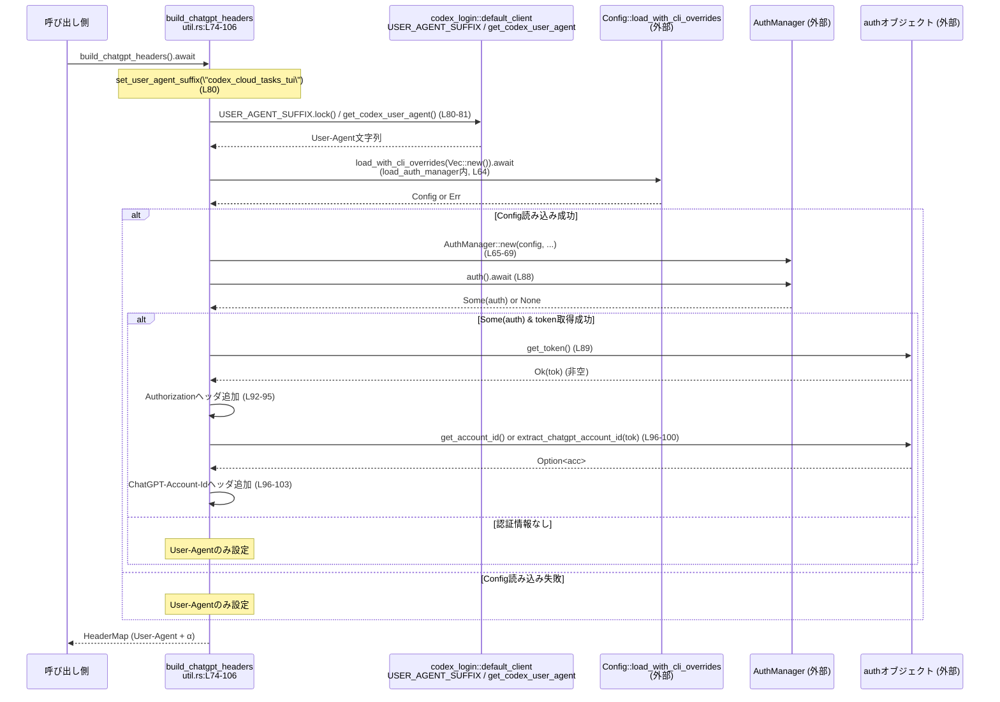

# cloud-tasks/src/util.rs コード解説

---

## 0. ざっくり一言

ChatGPT バックエンドに向けた HTTP リクエスト用のヘッダ構築、URL 正規化、JWT からのアカウント ID 抽出、ログ出力、相対時間フォーマットといった共通ユーティリティ関数をまとめたモジュールです（util.rs:L1-145）。

---

## 1. このモジュールの役割

### 1.1 概要

- このモジュールは **ChatGPT/ChatGPT ベース API との通信** と **タスク表示用 UI** を補助するためのユーティリティ関数群を提供します。
- 主な機能は、  
  - ベース URL の正規化 (`normalize_base_url`)（util.rs:L31-43）  
  - JWT からの ChatGPT アカウント ID 抽出 (`extract_chatgpt_account_id`)（util.rs:L46-60）  
  - 認証マネージャの初期化 (`load_auth_manager`) とヘッダ構築 (`build_chatgpt_headers`)（util.rs:L62-106）  
  - タスク画面用 URL の生成 (`task_url`)（util.rs:L109-121）  
  - 相対時間表示 (`format_relative_time`, `format_relative_time_now`)（util.rs:L123-145）  
  です。
- そのほかに、エラーログのファイル出力 (`append_error_log`) と User-Agent サフィックスの設定 (`set_user_agent_suffix`) を行います（util.rs:L10-26）。

### 1.2 アーキテクチャ内での位置づけ

このファイルは「cloud-tasks」クレート内の汎用ユーティリティとして、他モジュールから呼び出される前提のモジュールです。外部クレートやランタイムとの関係は次のようになります。



- `build_chatgpt_headers` が **認証情報 (`AuthManager`) と HTTP ヘッダ (`HeaderMap`) の橋渡し** をする中心的な関数です（util.rs:L74-106）。
- `load_auth_manager` が `codex_core::config::Config` に依存し、設定から認証マネージャを構築します（util.rs:L62-70）。
- これらは async 関数であり、非同期ランタイム（例: Tokio 上の `#[tokio::main]`）から呼び出されることが想定されます（呼び出し側はこのチャンクには現れません）。

### 1.3 設計上のポイント

- **状態をほとんど持たないユーティリティ設計**  
  - グローバル状態へのアクセスは `codex_login::default_client::USER_AGENT_SUFFIX` に対する書き込みのみで、それも Mutex 経由で行われます（util.rs:L10-13）。
  - それ以外の関数は入力値から結果を返す純粋関数、もしくは外部 I/O（ファイル、時刻、環境）を行う関数です。
- **エラーハンドリング方針**  
  - 設定ロードや認証取得に失敗した場合は `Option` で `None` を返し、呼び出し元の処理を継続可能にしています（util.rs:L62-70, L87-104）。
  - ログ出力やヘッダ構築では I/O エラーを握りつぶし、アプリケーション全体の動作を止めない実装になっています（util.rs:L16-25, L83-86, L92-103）。
- **安全性と並行性**  
  - `USER_AGENT_SUFFIX` へのアクセスは Mutex の `lock()` を使い、ロック取得に失敗した場合は静かに何もしない実装です（util.rs:L10-13）。
  - async 関数 (`load_auth_manager`, `build_chatgpt_headers`) は await チェーンで非同期処理をつなぎ、ブロッキング I/O は持たない構造です（util.rs:L62-70, L74-104）。

---

## 2. 主要な機能一覧（コンポーネントインベントリー）

### 2.1 関数インベントリー（行番号付き）

このチャンク（cloud-tasks/src/util.rs:L1-145）に定義されている公開関数の一覧です。

| 名前 | 種別 | 役割 / 用途 | 公開性 | 根拠 |
|------|------|------------|--------|------|
| `set_user_agent_suffix` | 関数 | `codex_login::default_client::USER_AGENT_SUFFIX` にサフィックス文字列を設定する | `pub` | util.rs:L10-14 |
| `append_error_log` | 関数 | `error.log` ファイルにタイムスタンプ付きのエラーメッセージを追記する | `pub` | util.rs:L16-26 |
| `normalize_base_url` | 関数 | ベース URL から末尾スラッシュ除去と `/backend-api` の付与を行い、クライアント内部で利用する標準形に整える | `pub` | util.rs:L28-43 |
| `extract_chatgpt_account_id` | 関数 | JWT トークンから ChatGPT アカウント ID を抽出する（存在する場合のみ） | `pub` | util.rs:L45-60 |
| `load_auth_manager` | 非同期関数 | 設定 (`Config`) から `AuthManager` を構築し、`Option` で返す | `pub async` | util.rs:L62-70 |
| `build_chatgpt_headers` | 非同期関数 | ChatGPT バックエンド用の `HeaderMap` を組み立てる（User-Agent, Authorization, ChatGPT-Account-Id） | `pub async` | util.rs:L72-106 |
| `task_url` | 関数 | 与えられたベース URL とタスク ID から、ブラウザで開けるタスク詳細ページの URL を組み立てる | `pub` | util.rs:L108-121 |
| `format_relative_time` | 関数 | 参照時刻と対象時刻の差から、`"10s ago"` などの相対時間表現またはローカル時刻文字列を生成する | `pub` | util.rs:L123-141 |
| `format_relative_time_now` | 関数 | 現在時刻を基準に `format_relative_time` を呼び出すラッパー | `pub` | util.rs:L143-145 |

### 2.2 機能のまとめ（箇条書き）

- User-Agent のサフィックス設定機能
- タイムスタンプ付きエラーログ出力機能
- ベース URL の正規化機能（ChatGPT ホスト用の特別ルールを含む）
- JWT からの ChatGPT アカウント ID 抽出機能
- 設定に基づく `AuthManager` の初期化機能
- ChatGPT バックエンド向け HTTP ヘッダの構築機能
- タスク詳細ページのブラウザ向け URL 生成機能
- 相対時間表現（秒/分/時間/日超過時のローカル時刻）生成機能

---

## 3. 公開 API と詳細解説

### 3.1 型一覧（構造体・列挙体など）

このファイル内 **で新しく定義される構造体・列挙体はありません**（util.rs:L1-145）。

利用している主な外部型は次のとおりです（参考情報です。定義は他クレートにあります）。

| 名前 | 種別 | 定義元 | 役割 / 用途 | 根拠 |
|------|------|--------|-------------|------|
| `Config` | 構造体 | `codex_core::config::Config` | 設定値の読み込みと保持 | util.rs:L7, L64 |
| `AuthManager` | 構造体 | `codex_login::AuthManager` | 認証情報の取得・管理 | util.rs:L8, L65-69 |
| `HeaderMap` | 構造体 | `reqwest::header::HeaderMap` | HTTP ヘッダのマップ | util.rs:L5, L74, L82 |
| `DateTime<Utc>` | 構造体 | `chrono::DateTime` | UTC 時刻の表現 | util.rs:L2, L4, L123-124, L143 |

---

### 3.2 関数詳細（主要 7 件）

#### `append_error_log(message: impl AsRef<str>)`（util.rs:L16-26）

**概要**

- 現在の UTC 時刻を ISO 8601 形式（RFC3339）で取得し、`error.log` に `[timestamp] メッセージ` という形式で 1 行追記します（util.rs:L17-25）。

**引数**

| 引数名 | 型 | 説明 |
|--------|----|------|
| `message` | `impl AsRef<str>` | ログに出力するメッセージ文字列。`String` や `&str` など `AsRef<str>` を実装している型が渡せます。 |

**戻り値**

- 戻り値はありません（`()`）。  
  成功・失敗に関わらず、呼び出し元には何も返しません。

**内部処理の流れ**

1. `Utc::now().to_rfc3339()` で現在の UTC 時刻を文字列化します（util.rs:L17）。
2. `std::fs::OpenOptions` を用いて `error.log` を `create(true)`, `append(true)` で開きます（util.rs:L18-21）。
   - ファイルが存在しない場合は作成されます。
   - 開けなかった場合は `if let Ok(...)` により、以降の処理はスキップされます。
3. `std::io::Write` をインポートし（util.rs:L23）、`writeln!` マクロで 1 行 `[ts] <message>` を書き込みます（util.rs:L24）。
4. `writeln!` の結果は `_` に束縛され無視されるため、書き込み失敗は呼び出し側に伝播しません（util.rs:L24）。

**Examples（使用例）**

```rust
// エラーが発生した箇所でログを残す例
append_error_log("Failed to fetch tasks from backend"); // 単純なメッセージ

let detail = format!("Backend returned status {}", 500); // 詳細付きメッセージ
append_error_log(detail);                               // String もそのまま渡せる
```

**Errors / Panics**

- ファイルオープン (`OpenOptions::open`) や書き込み (`writeln!`) のエラーはすべて握りつぶされます。
  - ファイルが開けない場合、何も書かずに関数終了（util.rs:L18-25）。
  - 書き込みエラーも `_` で無視されます（util.rs:L24）。
- 独自に `panic!` を発生させるコードはありません。

**Edge cases（エッジケース）**

- `message` が空文字列の場合も、`[]` の後に空のメッセージが書き込まれます。
- カレントディレクトリに書き込み権限がない場合はログは記録されませんが、アプリケーションは継続します。

**使用上の注意点**

- ログファイルの場所は固定で `./error.log` です。パスはこのファイルからは変更できません（util.rs:L21）。
- 重大な失敗時にもエラーが呼び出し元に返らないため、「ログが確実に書けたか」を検知する用途には適していません。

---

#### `normalize_base_url(input: &str) -> String`（util.rs:L31-43）

**概要**

- ベース URL 文字列から末尾の `'/'` をすべて削除し、ChatGPT ホスト (`https://chatgpt.com`, `https://chat.openai.com`) の場合に `/backend-api` が含まれていなければ付与した文字列を返します（util.rs:L31-42）。

**引数**

| 引数名 | 型 | 説明 |
|--------|----|------|
| `input` | `&str` | 設定から取得したベース URL 文字列。スキームやホスト名を含む任意の文字列。 |

**戻り値**

- 整形済みの URL 文字列（`String`）。  
  末尾スラッシュが削除され、必要なら `/backend-api` が付与されています。

**内部処理の流れ**

1. `input.to_string()` でミュータブルな `String` に変換（util.rs:L32）。
2. `while base_url.ends_with('/') { base_url.pop(); }` で末尾の `'/'` をすべて取り除きます（util.rs:L33-35）。
3. `base_url` が  
   - `"https://chatgpt.com"` または `"https://chat.openai.com"` で始まり（`starts_with`）、かつ  
   - 文字列中に `"/backend-api"` を含んでいない（`!contains("/backend-api")`）  
   場合に限り `/backend-api` を末尾に追加します（util.rs:L36-41）。
4. 処理後の `base_url` を返却します（util.rs:L42）。

**Examples（使用例）**

```rust
let url = normalize_base_url("https://chatgpt.com/"); 
assert_eq!(url, "https://chatgpt.com/backend-api");    // ChatGPT ホストには /backend-api を付与

let url = normalize_base_url("https://api.example.com/codex/");
assert_eq!(url, "https://api.example.com/codex");      // 非 ChatGPT ホストは末尾スラッシュのみ除去
```

**Errors / Panics**

- 文字列操作のみであり、I/O もインデックスアクセスも行っていないため、通常は `panic` 要因はありません。

**Edge cases（エッジケース）**

- `input` が空文字列 (`""`) の場合、末尾スラッシュ除去は何も起こらず、空文字のまま返ります。
- `https://chatgpt.com/backend-api-v2` のように `"/backend-api"` を部分文字列として含む場合は、`contains("/backend-api")` が真になるため `/backend-api` は追加されません（util.rs:L36-38）。
- `http://chatgpt.com`（スキームが `http`）など、`starts_with("https://chatgpt.com")` を満たさないホストは特別扱いされません。

**使用上の注意点**

- この関数は URL の妥当性検証（有効な URL かどうか）を行いません。単なる文字列処理です。
- ChatGPT 以外のホストでもそのまま利用できますが、`/backend-api` を勝手に付与することはありません。

---

#### `extract_chatgpt_account_id(token: &str) -> Option<String>`（util.rs:L46-60）

**概要**

- JWT 形式のトークン文字列からペイロード部分を Base64URL デコードし、  
  JSON 内の `"https://api.openai.com/auth"` → `"chatgpt_account_id"` フィールドを抽出して返します（util.rs:L52-59）。

**引数**

| 引数名 | 型 | 説明 |
|--------|----|------|
| `token` | `&str` | JWT 形式のアクセストークン。`"<header>.<payload>.<signature>"` の形を想定。 |

**戻り値**

- `Option<String>`  
  - `Some(account_id)` : JWT ペイロードに期待するフィールドが存在し、正しくパースできた場合  
  - `None` : トークン形式不正・Base64 デコード失敗・JSON パース失敗・フィールド欠如のいずれか

**内部処理の流れ**

1. `token.split('.')` で `.` 区切りに分割し、3 パート（ヘッダ・ペイロード・シグネチャ）を取り出します（util.rs:L47-49）。
   - 3 つ未満、またはどれかが空文字の場合は `None` を返します（util.rs:L48-50）。
2. ペイロード部分 (`payload_b64`) を `base64::engine::general_purpose::URL_SAFE_NO_PAD` でデコードします（util.rs:L52-54）。
   - デコード失敗時は `ok()?` により `None` を返します（util.rs:L54）。
3. デコードしたバイト列から `serde_json::from_slice` で `serde_json::Value` にパースします（util.rs:L55）。
   - パース失敗時も `None` を返します（util.rs:L55）。
4. JSON の `"https://api.openai.com/auth"` フィールドを取得し、その中の `"chatgpt_account_id"` を文字列として取り出します（util.rs:L56-59）。
   - どこかで `get` や `as_str` が失敗すれば `None` になります。

**Examples（使用例）**

```rust
// 実際には有効な JWT を使う必要があります。ここでは概念的な例です。
let token = "<header>.<base64url-encoded payload>.<signature>";

if let Some(account_id) = extract_chatgpt_account_id(token) {
    println!("ChatGPT account id = {}", account_id);
} else {
    println!("account id not found or token invalid");
}
```

**Errors / Panics**

- Base64 デコードや JSON パースの失敗はすべて `None` としてマスクされ、`panic` にはなりません。
- 独自の `panic!` 呼び出しはありません。

**Edge cases（エッジケース）**

- `token` に `.` が 2 個未満しか含まれない場合：即座に `None` を返します（util.rs:L48-50）。
- JWT 形式だが、ペイロードが期待する JSON 構造を持たない場合（`"https://api.openai.com/auth"` キーがないなど）：`None` を返します（util.rs:L56-59）。
- パディング付き Base64 であっても Base64URL 互換であれば、`URL_SAFE_NO_PAD` でデコードできる場合がありますが、ここでは JWT 標準に沿った Base64URL を想定しています。

**使用上の注意点**

- この関数はトークンの署名検証や有効期限チェックを一切行わず、文字列としてペイロードを読むだけです。
- 取得できるアカウント ID は **トークンが信頼できる前提** で利用するべきです。安全性自体は上位の認証ロジック（`AuthManager` 側）に依存しています。

---

#### `load_auth_manager() -> Option<AuthManager>`（util.rs:L62-70）

**概要**

- 設定 (`Config`) を非同期に読み取り、その情報を使って `AuthManager` を初期化し、`Some(AuthManager)` として返します（util.rs:L64-69）。
- 設定ロードに失敗した場合は `None` を返します。

**引数**

- 引数はありません。

**戻り値**

- `Option<AuthManager>`  
  - `Some(AuthManager)` : 設定のロードに成功した場合  
  - `None` : 設定ロードに失敗した場合（`ok()?` による早期リターン）

**内部処理の流れ**

1. `Config::load_with_cli_overrides(Vec::new()).await` を呼び出し、CLI からの上書き無しで設定を読み込みます（util.rs:L64）。
   - 返り値が `Err` の場合、`ok()?` により `None` を返して終了します（util.rs:L64）。
2. 読み込んだ `config` から、以下の引数で `AuthManager::new` を呼び出します（util.rs:L65-69）。
   - `config.codex_home`
   - `false`（`enable_codex_api_key_env` を無効化）
   - `config.cli_auth_credentials_store_mode`
3. 作成した `AuthManager` を `Some(...)` でラップして返します（util.rs:L65-69）。

**Examples（使用例）**

```rust
// 非同期コンテキスト内での使用例（Tokio ランタイムなどが必要）
async fn example() {
    if let Some(auth_manager) = load_auth_manager().await {
        // 認証関連の操作に auth_manager を使用
        // 例: let auth = auth_manager.auth().await;
    } else {
        append_error_log("Failed to load AuthManager"); // エラー時はログなどに回す
    }
}
```

**Errors / Panics**

- 設定ロードの失敗は `None` として扱われ、エラー内容はここでは表に出ません（util.rs:L64）。
- `AuthManager::new` が `panic` するかどうかはこのチャンクからは分かりませんが、明示的な `panic!` 呼び出しはありません。

**Edge cases（エッジケース）**

- 設定ファイルが存在しない・読めない場合は `None` が返り、その後の認証は行われません。
- CLI からの設定上書きは常に空ベクタ（`Vec::new()`) が渡されるため、この層では CLI 上書きは考慮されていません（util.rs:L64）。

**使用上の注意点**

- async 関数なので、必ず非同期ランタイムの中で `load_auth_manager().await` のように呼び出す必要があります。
- 失敗時の理由はここでは分からないため、詳細なログ出力が必要な場合は `Config::load_with_cli_overrides` を直接使うなど、別途対応が必要です。

---

#### `build_chatgpt_headers() -> HeaderMap`（util.rs:L74-106）

**概要**

- ChatGPT バックエンドへの HTTP リクエストで使用する `HeaderMap` を構築します（util.rs:L74-105）。
- 必ず `User-Agent` を設定し、認証情報取得に成功した場合は `Authorization: Bearer <token>` と `ChatGPT-Account-Id: <id>` ヘッダも付与します（util.rs:L80-103）。

**引数**

- 引数はありません。

**戻り値**

- `HeaderMap`：  
  - 常に `User-Agent` ヘッダが含まれる  
  - 認証情報が取得できた場合のみ、`Authorization` と `ChatGPT-Account-Id` が追加されます。

**内部処理の流れ**

1. 必要なヘッダ関連型を `use` でインポート（util.rs:L75-78）。
2. `set_user_agent_suffix("codex_cloud_tasks_tui")` を呼び出し、デフォルトクライアントの User-Agent サフィックスを設定します（util.rs:L80）。
3. `codex_login::default_client::get_codex_user_agent()` で User-Agent 文字列を取得します（util.rs:L81）。
4. 新しい `HeaderMap` を作成し（util.rs:L82）、`USER_AGENT` ヘッダを挿入します（util.rs:L83-86）。
   - `HeaderValue::from_str(&ua)` に失敗した場合、 `"codex-cli"` を静的文字列として使用します（util.rs:L85-86）。
5. 以下の条件がすべて満たされる場合に限り、追加の認証ヘッダを設定します（util.rs:L87-104）。
   - `load_auth_manager().await` が `Some(am)` を返す（util.rs:L87）。
   - `am.auth().await` が `Some(auth)` を返す（util.rs:L88）。
   - `auth.get_token()` が `Ok(tok)` を返し、かつ `tok` が空文字ではない（util.rs:L89-90）。
6. 上記が満たされた場合：
   - `"Bearer {tok}"` から `Authorization` ヘッダを構築し、`HeaderMap` に挿入します（util.rs:L92-95）。
   - `auth.get_account_id()` または `extract_chatgpt_account_id(&tok)` のどちらかで `acc` が取得できた場合、  
     ヘッダ名 `"ChatGPT-Account-Id"` を `HeaderName::from_bytes` で作成し、ヘッダ値として `acc` を設定します（util.rs:L96-103）。
7. 最終的な `HeaderMap` を返します（util.rs:L105）。

**Examples（使用例）**

```rust
use reqwest::Client;
use cloud_tasks::util::build_chatgpt_headers; // 実際のパスはクレート構成に依存します

// 非同期コンテキスト内
async fn request_example() -> reqwest::Result<()> {
    let client = Client::new();                         // HTTP クライアント
    let headers = build_chatgpt_headers().await;        // ChatGPT 用ヘッダを構築

    let res = client
        .get("https://chatgpt.com/backend-api/some-endpoint")
        .headers(headers)                               // ここで利用
        .send()
        .await?;

    println!("status = {}", res.status());
    Ok(())
}
```

**Errors / Panics**

- `HeaderValue::from_str` に失敗した場合は `"codex-cli"` にフォールバックし、`panic` しません（util.rs:L85-86）。
- `load_auth_manager`, `am.auth()`, `auth.get_token()` のいずれかが失敗した場合（`None` や `Err`）は認証ヘッダを付けないだけで、関数自体は成功します（util.rs:L87-104）。
- 独自の `panic!` 呼び出しはありません。

**Edge cases（エッジケース）**

- 認証情報が一切取得できない場合：  
  - `User-Agent` のみを設定した `HeaderMap` が返ります。
- `auth.get_token()` が空文字列を返す場合：  
  - `!tok.is_empty()` によって認証ヘッダは設定されません（util.rs:L89-90）。
- `auth.get_account_id()` が `None` でも、トークンのペイロードに `chatgpt_account_id` が含まれていれば `extract_chatgpt_account_id` によりヘッダが設定されます（util.rs:L96-100）。

**使用上の注意点**

- async 関数なので、必ず非同期コンテキストで `build_chatgpt_headers().await` として使用する必要があります。
- 認証エラー時の挙動は「認証ヘッダを付けない」形になっているため、バックエンド側で 401/403 などのレスポンスとして現れます。アプリ側で明示的に検出したい場合は、`load_auth_manager` の結果を別途チェックする必要があります。
- User-Agent サフィックスは毎回 `"codex_cloud_tasks_tui"` に設定されるため、他の部分でサフィックスを変更している場合は上書きされます（util.rs:L80）。

---

#### `task_url(base_url: &str, task_id: &str) -> String`（util.rs:L109-121）

**概要**

- バックエンドのベース URL とタスク ID から、**ブラウザで開くためのタスク詳細ページ URL** を構築します（util.rs:L108-121）。
- バックエンドの API パス形式に応じて、`/codex/tasks/{task_id}` へのパス変換を行います。

**引数**

| 引数名 | 型 | 説明 |
|--------|----|------|
| `base_url` | `&str` | バックエンド API のベース URL。`normalize_base_url` で整形されます。 |
| `task_id` | `&str` | 対象タスクの識別子。URL に直接埋め込まれます。 |

**戻り値**

- ブラウザでアクセスするための URL 文字列（`String`）。  
  `/codex/tasks/{task_id}` 形式のパスを含みます。

**内部処理の流れ**

1. `normalize_base_url(base_url)` を呼び出し、標準化された URL を得ます（util.rs:L110）。
2. 次の順にパターンマッチし、最初にマッチしたパターンで URL を生成します。
   1. `normalized.strip_suffix("/backend-api")` が `Some(root)` なら、`{root}/codex/tasks/{task_id}` を返します（util.rs:L111-113）。
   2. それ以外で `normalized.strip_suffix("/api/codex")` が `Some(root)` なら、同様に `{root}/codex/tasks/{task_id}` を返します（util.rs:L114-116）。
   3. さらに `normalized.ends_with("/codex")` なら、`{normalized}/tasks/{task_id}` を返します（util.rs:L117-118）。
3. 上記のいずれにもマッチしない場合、デフォルトとして `{normalized}/codex/tasks/{task_id}` を返します（util.rs:L120）。

**Examples（使用例）**

```rust
let base = "https://chatgpt.com/backend-api";        // API ベース URL
let url = task_url(base, "task-123");
assert_eq!(url, "https://chatgpt.com/codex/tasks/task-123");

let base = "https://api.example.com/api/codex";      // 別の API 形式
let url = task_url(base, "task-456");
assert_eq!(url, "https://api.example.com/codex/tasks/task-456");
```

**Errors / Panics**

- 文字列操作のみであり、`panic` 要因はありません。
- `task_id` にどのような文字列を渡しても、そのまま文字列連結されます（エスケープや検証は行っていません）。

**Edge cases（エッジケース）**

- `base_url` が `/codex` で終わるが `/backend-api` や `/api/codex` では終わらない場合、`{normalized}/tasks/{task_id}` になります（util.rs:L117-118）。
- `base_url` が空文字列の場合、`normalize_base_url` は空文字を返し、結果として `"/codex/tasks/{task_id}"` という相対パスになります（util.rs:L110, L120）。

**使用上の注意点**

- `task_id` は URL エンコードされません。特殊文字を含める可能性がある場合は、呼び出し側でエスケープ処理を行う必要があります。
- `normalize_base_url` によって末尾スラッシュが調整されるため、`base_url` に余分なスラッシュが付いていても安全に利用できます。

---

#### `format_relative_time(reference: DateTime<Utc>, ts: DateTime<Utc>) -> String`（util.rs:L123-141）

**概要**

- 参照時刻 `reference` と対象時刻 `ts` の差から、  
  - 60 秒未満なら `"<秒>s ago"`  
  - 60 分未満なら `"<分>m ago"`  
  - 24 時間未満なら `"<時間>h ago"`  
  を返し、それ以外（24 時間以上前）はローカルタイムゾーンで `"Jan  2 13:45"` のような日時を返します（util.rs:L123-140）。

**引数**

| 引数名 | 型 | 説明 |
|--------|----|------|
| `reference` | `DateTime<Utc>` | 基準となる現在時刻など。 |
| `ts` | `DateTime<Utc>` | 表示したい対象の時刻。 |

**戻り値**

- 相対時間またはローカル日時を表す `String`。

**内部処理の流れ**

1. `let mut secs = (reference - ts).num_seconds();` で秒単位の差分を計算します（util.rs:L124）。
2. 差分が負（`ts` が `reference` より未来）なら、`secs = 0` に補正します（util.rs:L125-127）。
3. `secs < 60` の場合は `"{secs}s ago"` を返します（util.rs:L128-129）。
4. 分に変換し、`mins < 60` の場合は `"{mins}m ago"` を返します（util.rs:L131-133）。
5. 時間に変換し、`hours < 24` の場合は `"{hours}h ago"` を返します（util.rs:L135-137）。
6. それ以外の場合、`ts` をローカルタイムゾーン (`Local`) に変換し、`"%b %e %H:%M"` フォーマットで文字列化します（util.rs:L139-140）。

**Examples（使用例）**

```rust
use chrono::{Utc, Duration};

let now = Utc::now();
let ten_seconds_ago = now - Duration::seconds(10);
assert_eq!(format_relative_time(now, ten_seconds_ago), "10s ago");

let two_days_ago = now - Duration::days(2);
let s = format_relative_time(now, two_days_ago);
// 例: "Apr  5 14:30" のようなローカル時刻文字列になる
println!("{s}");
```

**Errors / Panics**

- `chrono` の差分計算とフォーマットのみで、通常使用では `panic` 要因はありません。

**Edge cases（エッジケース）**

- `ts` が `reference` より未来の場合：  
  - `secs < 0` が真になり、`secs` は 0 に補正されるため `"0s ago"` が返ります（util.rs:L124-129）。
- ちょうど 60 秒・60 分・24 時間ジャストの場合：  
  - `num_seconds()` の結果と整数除算により、閾値境界でどのカテゴリになるかは引き算結果に依存します（ここからは厳密な境界の挙動までは読み取れませんが、通常は期待通りの整数値になります）。

**使用上の注意点**

- 入力は UTC 時刻を前提としているため、ローカル時刻同士の差分を扱いたい場合は呼び出し側で UTC に変換してから渡す必要があります。
- 24 時間を超えた時点で、突然 `"Xd ago"` ではなく `"Apr  5 14:30"` のようにフォーマットが変わることに注意が必要です。

---

#### `format_relative_time_now(ts: DateTime<Utc>) -> String`（util.rs:L143-145）

> この関数は非常に薄いラッパーですが、`format_relative_time` との関係性を明確にするために補足します。

**概要**

- `Utc::now()` を参照時刻として `format_relative_time` を呼び出すユーティリティです（util.rs:L143-144）。

**引数**

| 引数名 | 型 | 説明 |
|--------|----|------|
| `ts` | `DateTime<Utc>` | 対象の時刻。 |

**戻り値**

- `format_relative_time(Utc::now(), ts)` の結果。

---

### 3.3 その他の関数

#### `set_user_agent_suffix(suffix: &str)`（util.rs:L10-14）

- `codex_login::default_client::USER_AGENT_SUFFIX` というグローバルな値に対して Mutex ロックを取得し、文字列を置き換えます（util.rs:L10-13）。
- ロックの取得に失敗した場合（Mutex ポイズンなど）は何も行わず終了します。

#### その他関数一覧

| 関数名 | 役割（1 行） | 根拠 |
|--------|--------------|------|
| `set_user_agent_suffix` | 共通クライアントの User-Agent サフィックスを設定する | util.rs:L10-14 |

（`append_error_log`, `normalize_base_url` など主要関数は 3.2 で詳細解説済みです。）

---

## 4. データフロー

ここでは、**ChatGPT へのリクエストで使うヘッダを構築するシナリオ** のデータフローを示します。対象は `build_chatgpt_headers` 周辺の処理（util.rs:L74-106）です。

### 4.1 処理の要点

- 呼び出し側から `build_chatgpt_headers().await` が呼ばれると、User-Agent が確定し、必要なら認証付きヘッダが構築されます。
- 認証情報の取得には `load_auth_manager` と、その内部での `Config` 読み込み・`AuthManager` 初期化が関与します。
- JWT からのアカウント ID 抽出には `extract_chatgpt_account_id` が使われます。

### 4.2 シーケンス図



---

## 5. 使い方（How to Use）

### 5.1 基本的な使用方法

代表的なフローとして、**タスク一覧取得などの HTTP リクエストを行う前にヘッダを構築して利用する** 例です。

```rust
use reqwest::Client;
use chrono::Utc;
// 仮のモジュールパス。実際のパスはクレート構成に依存します。
use cloud_tasks::util::{build_chatgpt_headers, task_url, format_relative_time_now};

#[tokio::main] // 例として Tokio ランタイムを利用
async fn main() -> Result<(), Box<dyn std::error::Error>> {
    let client = Client::new();                             // HTTP クライアントを用意

    let headers = build_chatgpt_headers().await;            // ChatGPT 用ヘッダを構築 (L74-106)

    let base_url = "https://chatgpt.com";                   // 設定などから取得したベースURL
    let task_id = "task-123";
    let url = task_url(base_url, task_id);                  // ブラウザ向けタスクURLを構築 (L109-121)
    println!("Task URL: {}", url);

    // 何らかのAPI呼び出し例（実際のエンドポイントは異なる想定）
    let api_url = "https://chatgpt.com/backend-api/codex/tasks";
    let res = client
        .get(api_url)
        .headers(headers)
        .send()
        .await?;

    println!("Status: {}", res.status());

    // タスクの作成時刻を相対時間で表示する例
    let created_at_utc = Utc::now();                        // 実際にはレスポンスから取得
    let label = format_relative_time_now(created_at_utc);   // "10s ago" など (L143-145)
    println!("Created: {}", label);

    Ok(())
}
```

### 5.2 よくある使用パターン

1. **バックエンド URL 正規化とタスク URL 表示**

   ```rust
   let base = "https://chatgpt.com/";                       // 末尾スラッシュ付き
   let normalized = normalize_base_url(base);               // "https://chatgpt.com/backend-api" (L31-43)
   let url = task_url(&normalized, "task-789");             // "https://chatgpt.com/codex/tasks/task-789"
   println!("Open in browser: {}", url);
   ```

2. **エラーログの記録**

   ```rust
   // バックエンド API 呼び出しでエラーになったとき
   if let Err(e) = some_backend_call().await {
       append_error_log(format!("backend call failed: {}", e)); // error.log に追記 (L16-26)
   }
   ```

3. **JWT からのアカウント ID 抽出（デバッグ用途）**

   ```rust
   // 認証フローから取得したトークンを検査
   let token = "..."; // 実際の JWT
   if let Some(acc_id) = extract_chatgpt_account_id(token) {    // (L46-60)
       println!("Using ChatGPT account: {}", acc_id);
   }
   ```

### 5.3 よくある間違い

```rust
// 間違い例: 非同期関数を await せずに使用している
// let headers = build_chatgpt_headers();  // コンパイルエラー: Future を返す

// 正しい例: async コンテキスト内で await する
let headers = build_chatgpt_headers().await;
```

```rust
// 間違い例: task_url に既に /codex/tasks を含む URL を渡している
let bad_base = "https://chatgpt.com/codex/tasks";           // これはAPIベースURLではない
let url = task_url(bad_base, "task-123");
// 結果は "https://chatgpt.com/codex/tasks/codex/tasks/task-123" のような不自然なものになりうる

// 正しい例: API のベースURL (例: /backend-api や /api/codex) を渡す
let good_base = "https://chatgpt.com/backend-api";
let url = task_url(good_base, "task-123");
```

### 5.4 使用上の注意点（まとめ）

- `build_chatgpt_headers` / `load_auth_manager` は async 関数であり、**非同期ランタイム上でのみ使用可能** です。
- 認証情報取得の失敗は「認証ヘッダが付かない」という形で現れ、エラーとしては返りません。
- `task_url` はあくまで **API ベース URL からブラウザ向け URL を生成** する関数であり、既に `/codex/tasks/...` を含む URL を渡すと重複します。
- ログ出力 (`append_error_log`) やヘッダ構築の内部で発生した I/O エラーは、**呼び出し元に伝播しません**。確実なエラー検知が必要な処理では、別途エラーハンドリングを行う必要があります。

---

## 6. 変更の仕方（How to Modify）

### 6.1 新しい機能を追加する場合

- **ChatGPT 関連の共通処理**（トークン解析、追加ヘッダ、URL 変換など）を追加したい場合は、このファイルに新たな関数を追加するのが自然です。
  1. `build_chatgpt_headers` に関係する機能なら、その近く（util.rs:L72-106 周辺）に関数を配置すると分かりやすくなります。
  2. 認証情報が必要な場合は、`load_auth_manager` や `extract_chatgpt_account_id` を再利用することで一貫した挙動になります。
  3. `pub` とするかどうかは、「cloud-tasks クレート外から呼ばれるかどうか」で判断します（このチャンクからは呼び出し元は分かりません）。

### 6.2 既存の機能を変更する場合

- **`build_chatgpt_headers` を変更する場合の注意点**（util.rs:L74-106）:
  - `User-Agent` の形式を変えると、`codex_login::default_client` 側の期待とずれる可能性があります。
  - 認証ヘッダを付与する条件を変えると、バックエンドの認可ロジックに影響します。呼び出し元の全箇所を検索し、想定と一致しているか確認が必要です。
- **`normalize_base_url` / `task_url` の変更**:
  - URL の組み立てルールを変えると、既存の URL を保存している外部システム（ブックマークなど）への影響があり得ます。
  - テストが存在する場合（このチャンクにはテストは現れていません）、URL 文字列のアサーションを必ず更新する必要があります。
- **契約（Contract）**:
  - `extract_chatgpt_account_id` は「失敗時は `None`」という契約を前提に呼び出されているため、例外を投げるような変更は避けるべきです。
  - `format_relative_time` のフォーマット仕様を変えると UI 表示に影響するので、表示仕様を明確にした上で変更する必要があります。

---

## 7. 関連ファイル・モジュール

このモジュールと密接に関係する外部モジュール／クレートは、コードから次のように読み取れます。

| パス / クレート | 役割 / 関係 | 根拠 |
|-----------------|------------|------|
| `codex_core::config::Config` | 設定の読み込みと保持。`load_auth_manager` 内で使用される。 | util.rs:L7, L64 |
| `codex_login::AuthManager` | 認証マネージャ。アクセストークンやアカウント ID を取得する。 | util.rs:L8, L65-69, L87-100 |
| `codex_login::default_client` | User-Agent の管理および `USER_AGENT_SUFFIX` を提供する。 | util.rs:L10-13, L80-81 |
| `reqwest::header` | HTTP ヘッダの型 (`HeaderMap`, `HeaderValue`, `HeaderName`, `USER_AGENT`, `AUTHORIZATION`) を提供。 | util.rs:L5, L74-78, L82-86, L92-95, L99-103 |
| `chrono` | UTC/ローカル時刻の扱いとフォーマットに利用。 | util.rs:L2-4, L17, L123-141, L143-144 |
| `base64` | JWT ペイロードの Base64URL デコードに使用。 | util.rs:L1, L52-54 |
| `serde_json` | JWT ペイロード JSON のパースに使用。 | util.rs:L55-59 |

- このチャンクにはテストコードや他の cloud-tasks 内モジュールへの具体的な参照は現れないため、**テストファイルや呼び出し元ファイルのパスは不明**です。

---

### 補足：バグ・セキュリティ・パフォーマンス上の注意（このチャンクから読み取れる範囲）

- **セキュリティ**
  - `extract_chatgpt_account_id` はトークンの署名検証を行わず、ペイロードをそのまま解釈します（util.rs:L52-59）。  
    トークンの信頼性は `AuthManager` 側の検証に依存します。
- **並行性**
  - `set_user_agent_suffix` は Mutex ロックの取得失敗時に静かに失敗するため、まれに User-Agent サフィックスが更新されないケースがあります（util.rs:L10-13）。  
    ただし、`panic` にはなりません。
- **パフォーマンス**
  - `append_error_log` は毎回ファイルを開き直します（util.rs:L18-21）。高頻度で呼び出すと I/O オーバーヘッドが大きくなる可能性があります。
  - `build_chatgpt_headers` は呼び出しごとに `load_auth_manager` を経由するため、キャッシュや再利用が行われていない場合は設定ロード・認証まわりのコストがかさむ可能性があります（util.rs:L64-69, L87-88）。  
    ただし `Config::load_with_cli_overrides` や `AuthManager::auth` の実装詳細はこのチャンクには現れません。
