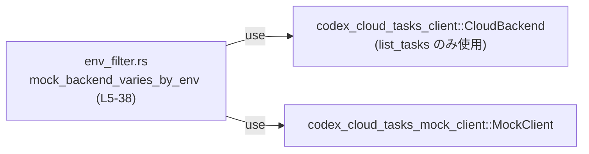
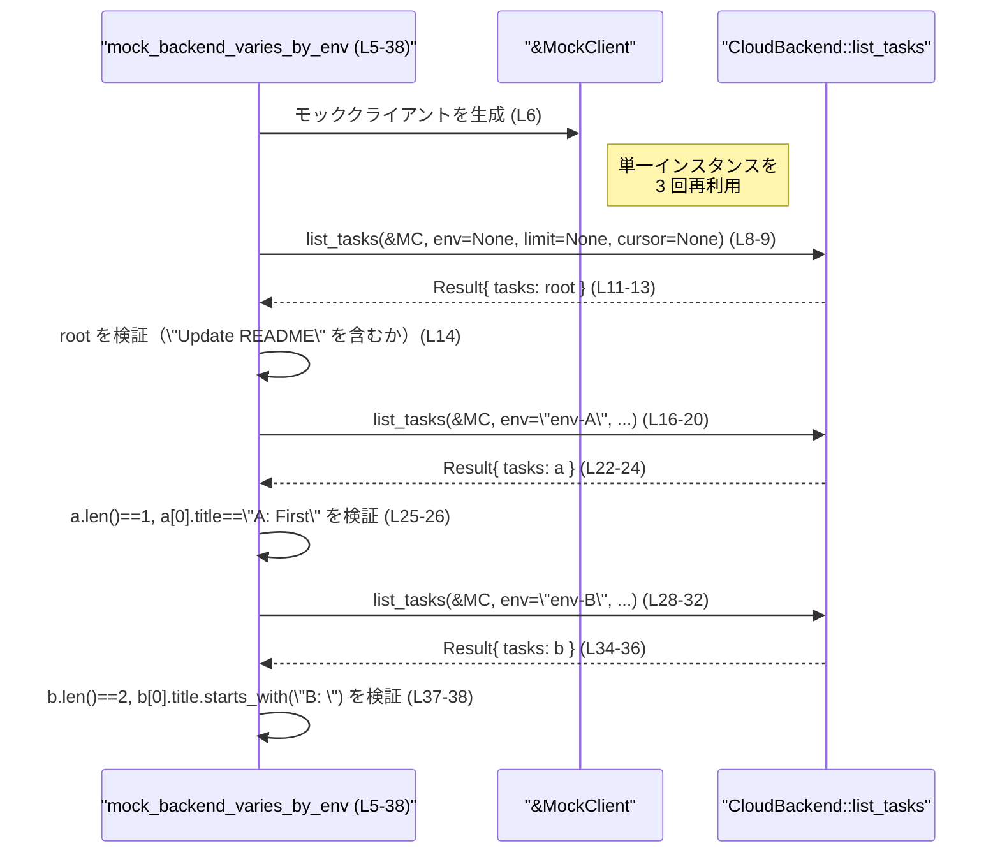

# cloud-tasks/tests/env_filter.rs

## 0. ざっくり一言

CloudBackend のモッククライアントに対して、環境（env）パラメータの値によって返されるタスク一覧が変わることを検証する Tokio 非同期テストです（`mock_backend_varies_by_env`）。  
（`cloud-tasks/tests/env_filter.rs:L4-38`）

---

## 1. このモジュールの役割

### 1.1 概要

- このモジュールは、Cloud Tasks クライアントの API `CloudBackend::list_tasks` に対し、モッククライアント `MockClient` を使ったときに **env 引数によって結果が切り替わる契約**をテストします。
- 具体的には、`env = None`（デフォルト環境）、`env = Some("env-A")`、`env = Some("env-B")` の 3 パターンで `list_tasks` を呼び出し、それぞれで返されるタスク一覧の内容をアサーションしています（`cloud-tasks/tests/env_filter.rs:L8-14, L16-26, L28-38`）。

### 1.2 アーキテクチャ内での位置づけ

このファイルはテスト専用モジュールであり、本体クレートではなく、外部クレートの API を利用して振る舞いを検証しています。

依存関係は次のとおりです（コードから読み取れる範囲）:

- `codex_cloud_tasks_client::CloudBackend`  
  `CloudBackend::list_tasks` を呼び出すことでタスク一覧を取得している（`cloud-tasks/tests/env_filter.rs:L8, L16, L28`）。
- `codex_cloud_tasks_mock_client::MockClient`  
  テスト用に直接インスタンス化され、`list_tasks` の第 1 引数として参照渡しされている（`cloud-tasks/tests/env_filter.rs:L6, L8, L17, L29`）。
- Tokio のテストマクロ `#[tokio::test]` により、テスト関数は非同期コンテキストで実行されます（`cloud-tasks/tests/env_filter.rs:L4`）。



> CloudBackend や MockClient の具体的な定義場所・実装詳細は、このチャンクには現れません。

### 1.3 設計上のポイント

- **非同期テストとしての設計**  
  - `#[tokio::test]` 属性により、非同期関数 `mock_backend_varies_by_env` が Tokio ランタイム上で実行されます（`cloud-tasks/tests/env_filter.rs:L4-5`）。
- **モッククライアントの利用**  
  - 実際のクラウドサービスではなく、`MockClient` のインスタンスを生成して API を検証しています（`cloud-tasks/tests/env_filter.rs:L6`）。
- **パラメータのバリエーションテスト**  
  - 同一クライアントに対して env を変えながら 3 回 `list_tasks` を呼び出し、それぞれの戻り値を個別に検証しています（`cloud-tasks/tests/env_filter.rs:L8-14, L16-26, L28-38`）。
- **エラー処理の方針**  
  - `list_tasks` の戻り値に対するエラー処理は `.unwrap()` による即時パニックのみで、テスト失敗として扱う設計です（`cloud-tasks/tests/env_filter.rs:L12, L23, L35`）。
- **順序に依存した検証**  
  - env-A, env-B では `a[0]`, `b[0]` のように 0 番目の要素を直接参照しており、タスクの順序が一定であることを前提にしています（`cloud-tasks/tests/env_filter.rs:L26, L38`）。

---

## 2. 主要な機能一覧（コンポーネントインベントリー）

このモジュールが提供する機能は単一のテスト関数です。

- `mock_backend_varies_by_env`: モックバックエンドの `list_tasks` 結果が env 引数によって変わることを検証する非同期テスト関数（`cloud-tasks/tests/env_filter.rs:L5-38`）。

---

## 3. 公開 API と詳細解説

### 3.1 型一覧（構造体・列挙体など）

このファイルに **型定義そのものは含まれていません** が、外部型を使用しています。

| 名前 | 種別 | 役割 / 用途 | 定義位置 |
|------|------|------------|----------|
| `CloudBackend` | 不明（外部クレートの型またはモジュール） | 関連関数 `list_tasks` を通じてタスク一覧を取得する API の窓口として利用されています（`list_tasks` を 3 回呼び出し）（`cloud-tasks/tests/env_filter.rs:L8, L16, L28`）。 | 型定義はこのチャンクには現れない |
| `MockClient` | 不明（外部クレートの型） | モックの Cloud Tasks クライアント。テスト内でインスタンス化され、`CloudBackend::list_tasks` の第 1 引数として使用されています（`cloud-tasks/tests/env_filter.rs:L6, L8, L17, L29`）。 | 型定義はこのチャンクには現れない |
| `tasks` フィールドの型 | 不明（シーケンス型） | `list_tasks` の戻り値から取得されるフィールド。`iter()`, `len()`, インデックスアクセス `[0]` が行われているため、タスクのシーケンス（ベクタやスライス等）であると解釈できます（`cloud-tasks/tests/env_filter.rs:L13-14, L24-26, L36-38`）。 | 型名・定義はこのチャンクには現れない |

> 「不明」は、型名や実装がこのファイルに現れないことを意味します。推測による具体名は付けていません。

### 3.2 関数詳細

#### `async fn mock_backend_varies_by_env()`

**概要**

- モッククライアント `MockClient` を用いて `CloudBackend::list_tasks` を 3 パターンの env で呼び出し、返却されるタスク一覧がそれぞれ期待した内容であることを検証する非同期テストです（`cloud-tasks/tests/env_filter.rs:L5-38`）。

**引数**

このテスト関数は引数を取りません（`cloud-tasks/tests/env_filter.rs:L5`）。

| 引数名 | 型 | 説明 |
|--------|----|------|
| なし | なし | テスト関数であり、外部から引数は受け取りません。 |

**戻り値**

- Rust のテスト関数として、戻り値は `()`（ユニット型）です。`async fn` ですが、`#[tokio::test]` により内部的に `Future` がテストランナーから実行されます（`cloud-tasks/tests/env_filter.rs:L4-5`）。

**内部処理の流れ（アルゴリズム）**

1. **モッククライアントの生成**  
   `let client = MockClient;` でモッククライアントを生成します（`cloud-tasks/tests/env_filter.rs:L6`）。

2. **デフォルト環境（env = None）のタスク取得と検証**  
   - `CloudBackend::list_tasks(&client, None, None, None)` を呼び出し、待機して結果をアンラップし `.tasks` フィールドを取得し、`root` に代入します（`cloud-tasks/tests/env_filter.rs:L8-13`）。
   - `root` 内のいずれかのタスクタイトルに `"Update README"` を含むものが存在することを `assert!` で検証します（`cloud-tasks/tests/env_filter.rs:L14`）。

3. **env-A のタスク取得と検証**  
   - `CloudBackend::list_tasks(&client, Some("env-A"), None, None)` を呼び出し、同様に `.await.unwrap().tasks` を `a` に代入します（`cloud-tasks/tests/env_filter.rs:L16-24`）。
   - `a.len()` が 1 であることを `assert_eq!` で検証します（`cloud-tasks/tests/env_filter.rs:L25`）。
   - `a[0].title` が `"A: First"` であることを検証します（`cloud-tasks/tests/env_filter.rs:L26`）。

4. **env-B のタスク取得と検証**  
   - `CloudBackend::list_tasks(&client, Some("env-B"), None, None)` を呼び出し、同様に `.await.unwrap().tasks` を `b` に代入します（`cloud-tasks/tests/env_filter.rs:L28-36`）。
   - `b.len()` が 2 であることを `assert_eq!` で検証します（`cloud-tasks/tests/env_filter.rs:L37`）。
   - `b[0].title` が `"B: "` で始まることを `starts_with("B: ")` によって検証します（`cloud-tasks/tests/env_filter.rs:L38`）。

**Examples（使用例）**

このテスト関数の呼び出しはテストランナーにより自動的に行われるため、直接呼び出すことは行いません。  
ただし、「環境ごとに異なる結果を返すことを検証するテスト」のテンプレートとして、次のように利用できます。

```rust
use codex_cloud_tasks_client::CloudBackend;                 // CloudBackend をインポート
use codex_cloud_tasks_mock_client::MockClient;              // モッククライアントをインポート

#[tokio::test]                                              // Tokio の非同期テストマクロ
async fn tasks_change_by_env_example() {                    // 非同期テスト関数
    let client = MockClient;                                // モッククライアントを生成

    // デフォルト環境（env = None）のタスク一覧を取得
    let default_tasks = CloudBackend::list_tasks(
        &client,                                            // クライアント参照を渡す
        None,                                               // env: None（デフォルト）
        None,                                               // limit は指定しない
        None,                                               // cursor も指定しない
    )
    .await                                                  // 非同期処理の完了を待つ
    .unwrap()                                               // Err の場合はテスト失敗としてパニック
    .tasks;                                                 // タスク一覧コレクションを取り出す

    // 特定の環境名でのタスク一覧を取得
    let staging_tasks = CloudBackend::list_tasks(
        &client,
        Some("staging"),                                    // 任意の環境名
        None,
        None,
    )
    .await
    .unwrap()
    .tasks;

    // 例: staging 環境ではタスク数が 0 でないことを確認する
    assert!(!staging_tasks.is_empty());                     // 空でないことを確認
}
```

**Errors / Panics**

- `CloudBackend::list_tasks` が `Err` を返した場合  
  - `.unwrap()` によりパニックし、テストは失敗扱いになります（`cloud-tasks/tests/env_filter.rs:L12, L23, L35`）。
- 期待するタスクが存在しない場合  
  - `assert!` や `assert_eq!` が失敗し、パニックが発生します（`cloud-tasks/tests/env_filter.rs:L14, L25-26, L37-38`）。
- 非同期処理に関するエラー  
  - このファイル内では、非同期ランタイムの初期化やスレッドに関連するエラー処理は行っておらず、`#[tokio::test]` マクロに依存しています（`cloud-tasks/tests/env_filter.rs:L4`）。

**Edge cases（エッジケース）**

- **未知の env**  
  - このテストでは `"env-A"` と `"env-B"` の 2 つの明示的な環境と `None` の 3 パターンのみ検証しており、その他の環境文字列についての挙動はテストされていません（`cloud-tasks/tests/env_filter.rs:L18, L30`）。
- **タスク順序の変更**  
  - アサーションは `[0]` を直接参照しており、タスクの順序が変わるとテストが失敗します（`cloud-tasks/tests/env_filter.rs:L26, L38`）。  
    順序が契約の一部でない場合、順序に依存しない形（例えば `iter().any(...)`）で検証する必要がありますが、このファイルから順序が契約かどうかは判断できません。
- **空の結果**  
  - env-A に対して `len() == 1`、env-B に対して `len() == 2` を前提にしており（`cloud-tasks/tests/env_filter.rs:L25, L37`）、これらの環境で空配列が返るケースは考慮されていません。

**使用上の注意点**

- この関数はテスト専用であり、アプリケーションコードから呼び出すことは想定されていません。
- `MockClient` の具体的な動作（どんなタスクを返すか）は外部クレートに依存しており、このファイルからは変更できません（`cloud-tasks/tests/env_filter.rs:L6-8`）。
- `CloudBackend::list_tasks` が非同期関数であるため、`await` を忘れるとコンパイルエラーになる点に注意が必要です（`cloud-tasks/tests/env_filter.rs:L11, L22, L34`）。
- `.unwrap()` によるエラー処理はテストには適していますが、同様の呼び出しを本番コードで行う場合は `?` や明示的なエラーハンドリングを検討する必要があります。  

### 3.3 その他の関数

- このファイルには `mock_backend_varies_by_env` 以外の関数は定義されていません。

---

## 4. データフロー

このテストにおける代表的なデータフローは、「モッククライアント → CloudBackend::list_tasks → タスクコレクション → アサーション」という流れです。

1. モッククライアント `client` を 1 つ作成します（`cloud-tasks/tests/env_filter.rs:L6`）。
2. その参照 `&client` と環境パラメータ（`None`, `"env-A"`, `"env-B"`）を `CloudBackend::list_tasks` に渡します（`cloud-tasks/tests/env_filter.rs:L8-9, L16-20, L28-32`）。
3. 非同期処理を `await` し、結果を `unwrap()` して `.tasks` フィールドを取り出します（`cloud-tasks/tests/env_filter.rs:L11-13, L22-24, L34-36`）。
4. 得られたタスクコレクションに対して、件数や要素のタイトルを検証します（`cloud-tasks/tests/env_filter.rs:L14, L25-26, L37-38`）。



---

## 5. 使い方（How to Use）

### 5.1 基本的な使用方法

このモジュールはテストコードであり、「CloudBackend と MockClient を使って環境ごとに結果を検証するテストを書く」ための参考になります。

```rust
use codex_cloud_tasks_client::CloudBackend;                 // CloudBackend の API を使用
use codex_cloud_tasks_mock_client::MockClient;              // モッククライアント

#[tokio::test]                                              // 非同期テストとして実行
async fn example_use_cloud_backend_with_env() {             // 非同期テスト関数
    let client = MockClient;                                // モッククライアントを作成

    // ある環境名 "env-X" のタスク一覧を取得
    let tasks = CloudBackend::list_tasks(
        &client,                                            // クライアント参照
        Some("env-X"),                                      // 任意の環境名
        None,                                               // limit なし
        None,                                               // cursor なし
    )
    .await                                                  // 非同期呼び出しを待機
    .unwrap()                                               // エラーがあればテスト失敗
    .tasks;                                                 // タスク一覧コレクションを取得

    // 期待するタスクが含まれるか検証
    assert!(tasks.iter().any(|t| t.title == "X: Something"));// 任意の条件で検証
}
```

### 5.2 よくある使用パターン

- **環境ごとのフィルタリング検証**  
  `mock_backend_varies_by_env` と同様に、複数の env 値で `list_tasks` を呼び出し、それぞれのタスク集合に対して異なる期待値をアサートするパターンです（`cloud-tasks/tests/env_filter.rs:L8-14, L16-26, L28-38`）。

- **デフォルト環境の検証**  
  env を `None` にすることで「デフォルト環境」を表現し、特定のタスクが必ず含まれることを確認するパターンです（`cloud-tasks/tests/env_filter.rs:L8-14`）。

### 5.3 よくある間違い（推測を含む一般的な注意）

このファイルから直接読み取れるものではありませんが、非同期テストと外部クライアント利用の一般的な注意として、次のような誤りが起こり得ます。

```rust
// 誤り例: await を忘れている（コンパイルエラーになる）
async fn wrong_example() {
    let client = MockClient;
    let result = CloudBackend::list_tasks(&client, None, None, None); // .await がない
    // ...
}

// 正しい例: 必ず .await を付ける
async fn correct_example() {
    let client = MockClient;
    let result = CloudBackend::list_tasks(&client, None, None, None)
        .await                       // 非同期結果を待機
        .unwrap();                   // テストなら unwrap でよいケースが多い
}
```

### 5.4 使用上の注意点（まとめ）

- **非同期コンテキスト必須**  
  `CloudBackend::list_tasks` は `await` されているため、非同期関数として定義されていることが読み取れます（`cloud-tasks/tests/env_filter.rs:L11, L22, L34`）。テストやアプリケーションコードから呼び出す際には、Tokio などの非同期ランタイム内で実行する必要があります。
- **モックと本番コードの混同に注意**  
  このファイルでは `MockClient` のみが用いられています（`cloud-tasks/tests/env_filter.rs:L6`）。本番コードでは別の実装（実クラウド接続クライアント）を使うことが想定されますが、その区別は外部のモジュール構成に依存します。
- **順序依存のテストであること**  
  タスク順序に依存したアサーション (`a[0]`, `b[0]`) を行っているため（`cloud-tasks/tests/env_filter.rs:L26, L38`）、モックの実装でタスクの並び順が変わるとテストが失敗します。

---

## 6. 変更の仕方（How to Modify）

### 6.1 新しい機能（テストケース）を追加する場合

新しい環境やフィルタ条件をテストしたい場合の手順です。

1. **追加したいシナリオを決める**  
   例: `"env-C"` で 3 件のタスクが返る、など。
2. **既存テストに追記するか、新しいテスト関数を定義する**  
   - 同じ関数内に追加する場合は、`let c = CloudBackend::list_tasks(&client, Some("env-C"), ...)` のようなブロックを追記します。
   - 他のテストと独立させたい場合は、`#[tokio::test]` を付けた新しい `async fn` を定義します。
3. **期待する結果をアサートする**  
   - `.len()` や `iter().any(...)` を使って、件数や内容を検証します。
4. **MockClient 側のデータ定義との整合性を確認する**  
   - `"env-C"` に対してどのようなタスクが返るかは MockClient の実装によるため、このファイルだけでは決められません。外部クレート側のデータに合わせて期待値を設定する必要があります。

### 6.2 既存の機能（このテスト）を変更する場合

- **`list_tasks` のシグネチャ変更への対応**  
  - 例えば、引数が増減した場合は、呼び出し箇所（`cloud-tasks/tests/env_filter.rs:L8-9, L16-20, L28-32`）をすべて更新する必要があります。
- **戻り値構造の変更**  
  - `.tasks` フィールド名が変わったり、型構造が変化した場合、`root`, `a`, `b` の取得箇所（`cloud-tasks/tests/env_filter.rs:L13, L24, L36`）とその後のアサーションを更新する必要があります。
- **契約の変更（件数やタイトル）**  
  - env-A で 1 件、env-B で 2 件という仕様が変わった場合は、`assert_eq!(a.len(), 1);` や `assert_eq!(b.len(), 2);` などの期待値を新しい仕様に合わせて更新します（`cloud-tasks/tests/env_filter.rs:L25, L37`）。

---

## 7. 関連ファイル

このモジュールに関連する（とコードから推測できる）外部ファイル・クレートは次のとおりです。

| パス / クレート | 役割 / 関係 |
|----------------|------------|
| `codex_cloud_tasks_client::CloudBackend` | `list_tasks` API を提供する型またはモジュール。タスク一覧の取得処理を実装していると考えられますが、実装はこのチャンクには現れません（`cloud-tasks/tests/env_filter.rs:L1, L8, L16, L28`）。 |
| `codex_cloud_tasks_mock_client::MockClient` | テスト用モッククライアント。`CloudBackend::list_tasks` の第 1 引数として使用され、環境によって異なるタスクデータを返す役割を持つと解釈されますが、詳細実装はこのチャンクには現れません（`cloud-tasks/tests/env_filter.rs:L2, L6`）。 |

---

### 補足（安全性・セキュリティ・並行性の観点）

- **安全性（パニック）**  
  - `.unwrap()` および `assert!` / `assert_eq!` により、仕様違反やエラー発生時にはパニックが起こる設計ですが、これはテストコードとしては一般的なパターンです（`cloud-tasks/tests/env_filter.rs:L12, L23, L35, L14, L25-26, L37-38`）。
- **セキュリティ**  
  - モッククライアントのみを利用しており、外部サービスへのアクセスや機密データの扱いはこのファイルからは読み取れません。そのため、このファイル単体では特段のセキュリティリスクは確認できません。
- **並行性**  
  - 非同期テストですが、この関数内で並列にタスクを実行しているわけではなく、3 つの `list_tasks` 呼び出しは直列に実行されています（`cloud-tasks/tests/env_filter.rs:L8-14, L16-26, L28-38`）。
  - 単一の `MockClient` インスタンスを複数回参照渡ししている点から、クライアント型が少なくともこの使い方においてはスレッド・タスク安全に利用できるように設計されていると推測できますが、その保証内容はこのチャンクには現れません。
