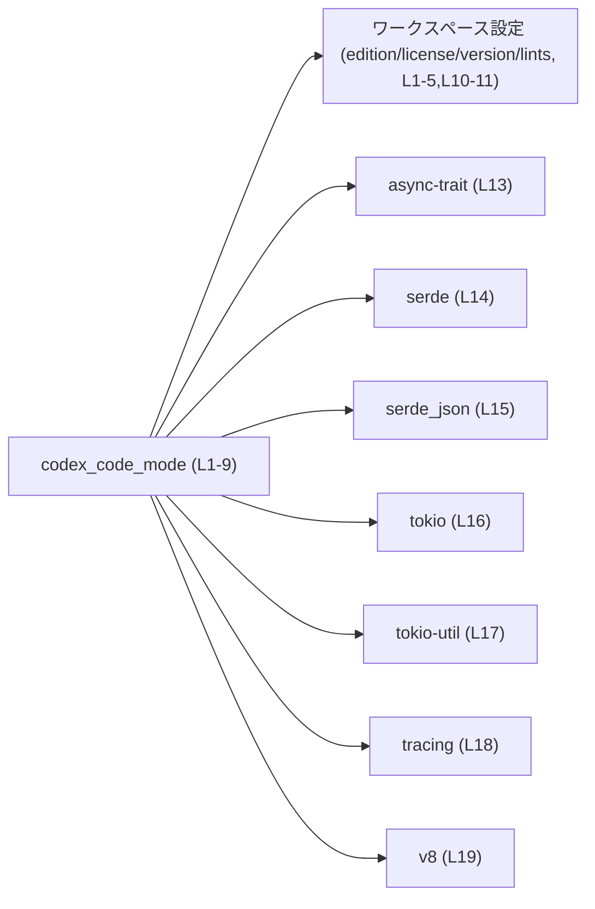
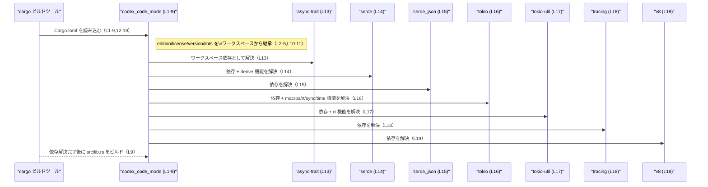

# code-mode/Cargo.toml コード解説

## 0. ざっくり一言

`code-mode/Cargo.toml` は、ライブラリクレート `codex_code_mode` のビルド設定と依存関係を定義するマニフェストファイルです（`[package]`〜`[dev-dependencies]` 全体, `code-mode/Cargo.toml:L1-21`）。

---

## 1. このモジュールの役割

### 1.1 概要

- このファイルは、Rust クレート `codex-code-mode` の  
  - パッケージ名・バージョン・ライセンス・エディションの継承設定（`[package]`, `code-mode/Cargo.toml:L1-5`）  
  - ライブラリターゲット名とエントリポイント `src/lib.rs`（`[lib]`, `code-mode/Cargo.toml:L6-9`）  
  - ワークスペース共通の lint 設定（`[lints]`, `code-mode/Cargo.toml:L10-11`）  
  - ランタイム／ユーティリティ依存クレート群（`[dependencies]`, `code-mode/Cargo.toml:L12-19`）  
  - テスト用の開発依存（`[dev-dependencies]`, `code-mode/Cargo.toml:L20-21`）  
  を指定するために存在します。
- 実際の公開 API やコアロジックは `src/lib.rs` にあり、このチャンクには含まれていません（`code-mode/Cargo.toml:L8`）。

### 1.2 アーキテクチャ内での位置づけ

- パッケージ名は `"codex-code-mode"`（`code-mode/Cargo.toml:L4`）、ライブラリクレート名は `"codex_code_mode"`（`code-mode/Cargo.toml:L8`）として定義されています。
- ライブラリのエントリポイントは `src/lib.rs` であり（`code-mode/Cargo.toml:L9`）、このファイルが API とコアロジックを持つ中心的なモジュールと考えられます。
- 依存クレートとして、非同期実行 (`tokio`, `async-trait`, `tokio-util`)、シリアライゼーション (`serde`, `serde_json`)、ロギング／トレーシング (`tracing`)、JavaScript エンジン埋め込み (`v8`) を利用する構成になっています（`code-mode/Cargo.toml:L12-19`）。

これを依存関係の観点から図示すると、次のようになります。



※ 実際にどの関数からどの依存が呼ばれるかは、このチャンクの情報だけでは分かりません。

### 1.3 設計上のポイント（このファイルから読み取れる範囲）

- **ワークスペース集中管理**  
  - `edition.workspace = true` / `license.workspace = true` / `version.workspace = true` により、エディション・ライセンス・バージョンをワークスペースルートで一元管理しています（`code-mode/Cargo.toml:L2-5`）。
  - 依存クレートも `workspace = true` 指定でワークスペース共通設定を共有しており、バージョン等の統一が図られています（`code-mode/Cargo.toml:L12-19`）。
- **ライブラリ専用クレート**  
  - `[lib]` セクションのみが定義され、バイナリターゲット（`[[bin]]` 等）はこのファイルにはありません（`code-mode/Cargo.toml:L6-9`）。
- **doctest 無効化**  
  - `doctest = false` により、ドキュメントコメント内のテストが実行されない設定になっています（`code-mode/Cargo.toml:L7`）。
- **lint 設定の共有**  
  - `[lints] workspace = true` によって、警告レベルや Clippy などの lint 設定をワークスペースで共有しています（`code-mode/Cargo.toml:L10-11`）。
- **非同期・並行処理と観測性の前提**  
  - `tokio`・`tokio-util`・`async-trait` の依存から、このクレートが非同期処理や並行性を扱う前提で実装されていることが示唆されます（`code-mode/Cargo.toml:L13,L16-17`）。
  - `tracing` への依存により、構造化ログやトレースを用いた観測性を持つ設計であることが示唆されます（`code-mode/Cargo.toml:L18`）。
  - ただし、具体的なエラー処理やスレッド安全性の設計は、このチャンクからは分かりません。

---

## 2. 主要な機能一覧

このファイルが提供する「機能」はビルド設定レベルのものに限られます。

- ライブラリクレート `codex_code_mode` の定義とエントリポイント指定（`code-mode/Cargo.toml:L4,L6-9`）
- エディション・ライセンス・バージョン・lint のワークスペース共通設定の利用（`code-mode/Cargo.toml:L2-5,L10-11`）
- 非同期処理・シリアライゼーション・トレーシング・V8 連携などの依存クレート宣言（`code-mode/Cargo.toml:L12-19`）
- テスト用に `pretty_assertions` を利用する開発依存の宣言（`code-mode/Cargo.toml:L20-21`）

### 2.1 コンポーネントインベントリー（ビルドレベル）

このチャンクから識別できる「コンポーネント」（パッケージ／ターゲット／依存）の一覧です。

| コンポーネント名        | 種別                 | 定義行範囲                          | 役割 / 説明 |
|-------------------------|----------------------|--------------------------------------|-------------|
| `codex-code-mode`       | Cargo パッケージ     | `code-mode/Cargo.toml:L1-5`         | ワークスペース内のパッケージ。エディション・ライセンス・バージョンはワークスペースから継承。 |
| `codex_code_mode`       | ライブラリクレート   | `code-mode/Cargo.toml:L6-9`         | `src/lib.rs` をエントリポイントとするライブラリ。公開 API とロジックはこのファイルの外側。 |
| ワークスペース設定      | edition/license/version | `code-mode/Cargo.toml:L2-5`      | 共通のエディション・ライセンス・バージョンを参照。具体的な値はこのチャンクには現れません。 |
| ワークスペース lint     | lint 設定            | `code-mode/Cargo.toml:L10-11`       | 警告や Clippy 設定をワークスペースルートから継承。 |
| `async-trait`           | 依存クレート         | `code-mode/Cargo.toml:L13`          | async 関数を含むトレイトを扱うためのクレート（一般的な用途）。バージョンはワークスペース依存設定から。 |
| `serde`                 | 依存クレート         | `code-mode/Cargo.toml:L14`          | シリアライゼーション／デシリアライゼーション用クレート。`features = ["derive"]` を追加指定。 |
| `serde_json`            | 依存クレート         | `code-mode/Cargo.toml:L15`          | JSON 形式を扱うためのクレート。 |
| `tokio`                 | 依存クレート         | `code-mode/Cargo.toml:L16`          | 非同期ランタイム。`macros`, `rt`, `sync`, `time` 機能を有効化。 |
| `tokio-util`            | 依存クレート         | `code-mode/Cargo.toml:L17`          | `tokio` 用ユーティリティ。`rt` 機能を有効化。 |
| `tracing`               | 依存クレート         | `code-mode/Cargo.toml:L18`          | 構造化ログ／トレース用のクレート。 |
| `v8`                    | 依存クレート         | `code-mode/Cargo.toml:L19`          | V8 JavaScript エンジンの Rust バインディング。 |
| `pretty_assertions`     | dev 依存クレート     | `code-mode/Cargo.toml:L20-21`       | テストで読みやすい差分を表示するためのアサーションユーティリティ（一般的な用途）。 |

※ Rust の関数・構造体といった「コード上のコンポーネント」は、このファイルには定義されていません。

---

## 3. 公開 API と詳細解説

このチャンクは Cargo マニフェストのみであり、Rust コード（`src/lib.rs` 等）は含まれていません。そのため、公開関数・構造体などの具体的な API は特定できません。

### 3.1 型一覧（構造体・列挙体など）

このファイル単体から分かる Rust の型定義はありません。

| 名前 | 種別 | 役割 / 用途 |
|------|------|-------------|
| （なし） | — | このチャンクには Rust の型定義は含まれていません。 |

※ 実際の構造体や列挙体は `src/lib.rs` などに定義されていると考えられますが、その内容はこのチャンクには現れません（`code-mode/Cargo.toml:L9`）。

### 3.2 関数詳細

#### このチャンクに関数定義は存在しません

- `Cargo.toml` はビルド設定ファイルであり、関数・メソッド・トレイト実装は持ちません。
- 従って、「関数詳細テンプレート」を具体的な関数に適用することは、このチャンクのみからはできません。
- 公開 API のシグネチャ、エラー型、内部アルゴリズム、エッジケースなどは、`src/lib.rs` およびその配下のモジュールを参照する必要があります（参照パスのみ `code-mode/Cargo.toml:L9` から分かります）。

### 3.3 その他の関数

- このチャンクには Rust コードそのものがないため、「補助関数」「ラッパー関数」に関する情報も存在しません。
- 実際の関数一覧・呼び出し関係は、他チャンク（`src/` 以下）を解析する必要があります。

---

## 4. データフロー

### 4.1 コンパイル時の依存解決フロー（概念図）

このチャンクから分かるのは、「どのクレートに依存しているか」というビルド時の関係のみです。実行時の関数呼び出しやデータの流れは分かりません。

ここでは、**Cargo によるビルド時の依存解決フロー**を sequence diagram で表現します。



- 実行時のデータフロー（例えば「どの API が V8 を呼ぶか」「どの非同期タスクが tokio を使うか」）は、このチャンクからは分かりません。
- ただし、依存構成から「非同期処理」「シリアライゼーション」「トレース」「V8 連携」がこのクレートで行われる可能性が高いことは読み取れます（`code-mode/Cargo.toml:L13-19`）。

---

## 5. 使い方（How to Use）

### 5.1 基本的な使用方法（このクレート自身のビルド）

このファイル自体の「使い方」は、Cargo を用いてビルド・テスト・実行することです。

```bash
# ワークスペースルート（親ディレクトリ）で:
cargo build -p codex-code-mode
cargo test  -p codex-code-mode
```

- `-p codex-code-mode` は、`[package] name = "codex-code-mode"` に対応します（`code-mode/Cargo.toml:L4`）。
- ビルドされるのはライブラリターゲット `codex_code_mode` であり、`src/lib.rs` に定義された公開 API がコンパイルされます（`code-mode/Cargo.toml:L6-9`）。

他のクレートからこのライブラリを利用する具体的な Rust コード例（どの関数を呼ぶか等）は、このチャンクからは分かりません。

### 5.2 よくある使用パターン（推測可能な範囲）

依存クレート構成から、以下のような「一般的な」使用パターンが考えられますが、**実際にこのクレートがそうしているかは、このファイルだけでは断定できません。**

- 非同期コンテキストでの利用  
  - `tokio` の `macros` 機能が有効になっているため（`code-mode/Cargo.toml:L16`）、一般的には `#[tokio::main]` や `#[tokio::test]` などのマクロを用いた非同期エントリポイントが想定されます。
- シリアライゼーション  
  - `serde` + `serde_json` に依存しているため（`code-mode/Cargo.toml:L14-15`）、構造体の JSON シリアライゼーション／デシリアライゼーションを行うコードが含まれている可能性があります。
- 観測性  
  - `tracing` に依存しているため（`code-mode/Cargo.toml:L18`）、トレーススパンやイベントを発行する構造になっている可能性があります。
- JavaScript 実行環境  
  - `v8` に依存しているため（`code-mode/Cargo.toml:L19`）、JavaScript コードを実行したり、V8 組み込みを行うロジックが存在する可能性があります。

これらはあくまで「依存クレートの一般的な用途」に基づく推測であり、**どの関数がどう使っているかはこのチャンクには現れません。**

### 5.3 よくある間違い（このファイル編集時の観点）

このファイルを変更する際に起こりうる典型的な問題を、一般的な Cargo の挙動に基づいて整理します。

```toml
# （誤り例）tokio の必要な機能フラグを削除してしまう
[dependencies]
tokio = { workspace = true }  # 元は features = ["macros", "rt", "sync", "time"] （L16）

# 結果として、src/lib.rs 内で tokio のマクロや runtime 関連 API を
# 使っているコードがコンパイルエラーになる可能性があります。
```

```toml
# （誤り例）ワークスペース依存を通常依存に書き換える
[dependencies]
serde = "1.0"  # 元は serde = { workspace = true, features = ["derive"] } （L14）

# ワークスペース全体で依存バージョンを揃える前提が崩れ、
# 他クレートとのバージョン不整合やビルドエラーの原因になる可能性があります。
```

これらは Cargo の一般的な挙動に基づく説明であり、**実際にどの変更が許容されるかはワークスペース全体の設計によります。**

### 5.4 使用上の注意点（まとめ）

- **ワークスペース整合性**  
  - `workspace = true` が多用されているため（`code-mode/Cargo.toml:L2-5,L10-11,L13-19`）、依存やメタデータを個別に変更すると、ワークスペースの方針とずれる可能性があります。
- **機能フラグの変更**  
  - `tokio` や `serde` の `features` を変更・削除すると、それに依存しているコードがコンパイルできなくなる可能性があります（`code-mode/Cargo.toml:L14,16-17`）。
- **doctest 無効化**  
  - `doctest = false` により、ドキュメントコメント内のサンプルコードがテストされません（`code-mode/Cargo.toml:L7`）。ドキュメントが実際の挙動と乖離していても CI では検出されない点に注意が必要です。
- **セキュリティ観点（V8 依存）**  
  - `v8` を用いる場合、一般的には「外部入力の JavaScript を実行する」ようなシナリオが想定されますが（`code-mode/Cargo.toml:L19`）、入力検証やサンドボックス構成などの具体的な対策は、このチャンクからは分かりません。

---

## 6. 変更の仕方（How to Modify）

### 6.1 新しい機能を追加する場合（マニフェストレベル）

このクレートに新しい機能（たとえば新しい外部サービス連携）を追加する際、Cargo 側で必要になる典型的な変更は次のようになります。

1. **必要な依存クレートの追加**  
   - `[dependencies]` セクションに新しい依存を追加します（`code-mode/Cargo.toml:L12-19` を参考）。
   - 既存と同様に `workspace = true` を利用するかどうかは、ワークスペースルートの設計と一致させる必要があります。
2. **必要であれば feature フラグを追加**  
   - `tokio` の追加機能や `serde` の feature 等が必要であれば、`features = [...]` に追記します（`code-mode/Cargo.toml:L14,16-17`）。
3. **`src/lib.rs` へのロジック追加**  
   - 実際の API やロジックは `src/lib.rs` 側に追加し、このファイルからは参照されません（`code-mode/Cargo.toml:L9`）。

このチャンクだけでは、どのモジュール・関数にコードを追加するべきかは分からないため、`src/` 以下の構造を別途確認する必要があります。

### 6.2 既存の機能を変更する場合（マニフェストレベル）

- **依存バージョン・feature の変更時の注意**  
  - すべての依存が `workspace = true` で統一されているため（`code-mode/Cargo.toml:L12-19`）、バージョンを上げる・下げるときは通常ワークスペースルートの `Cargo.toml` を変更することになります。
  - feature をオフにすると、それに依存するコードがコンパイルできなくなる可能性があります。
- **lint ポリシーの変更**  
  - lint 設定はワークスペース共通（`code-mode/Cargo.toml:L10-11`）なので、警告レベルや Clippy ルールの変更はワークスペースルート側で行うのが基本になります。
- **doctest の扱い**  
  - ドキュメントサンプルをテストしたい場合は、このファイルで `doctest = true` に変更することが可能です（`code-mode/Cargo.toml:L7`）。  
    ただし、既存のドキュメントコードが doctest 向けに書かれていない場合、テスト失敗が大量に出る可能性があります。

---

## 7. 関連ファイル

このチャンクから推定できる、密接に関係するファイル・ディレクトリです。

| パス                         | 役割 / 関係 |
|-----------------------------|------------|
| `code-mode/src/lib.rs`      | `[lib] path = "src/lib.rs"` で指定されたライブラリのエントリポイントです（`code-mode/Cargo.toml:L8-9`）。公開 API やコアロジックはこのファイル以降に定義されていますが、このチャンクには内容が現れません。 |
| ワークスペースルートの `Cargo.toml` | `edition.workspace`, `license.workspace`, `version.workspace` および `dependencies.{crate}.workspace = true` の設定を保持していると考えられるファイルです（`code-mode/Cargo.toml:L2-5,L12-19`）。具体的なパスや内容はこのチャンクには現れません。 |
| ワークスペースルートの lint 設定（`[lints]`） | `workspace = true` によって参照される lint 設定の元となる場所です（`code-mode/Cargo.toml:L10-11`）。Rust/Clippy の警告ポリシーがここで定義されていると考えられます。 |
| テストコード（`tests/`, `src/*_test.rs` 等） | `pretty_assertions` が dev-dependency として指定されているため（`code-mode/Cargo.toml:L20-21`）、どこかにテストコードが存在し、そこで利用されていると考えられます。ただし、このチャンクには具体的なテストファイルは現れません。 |

---

### このチャンクからは分からない点（まとめ）

- 公開 API（関数・構造体・モジュール階層）の具体的な内容
- エラー処理ポリシー（`Result` 型・エラー種別・リトライ戦略など）
- 実際の並行性モデル（どのタスクがどのスレッド上で動くか、`Send`/`Sync` 制約など）
- V8 の利用方法（実行する JavaScript の範囲、サンドボックスの有無）
- テスト戦略（単体テスト・統合テスト・プロパティテストなど）

これらはすべて `src/lib.rs` 以降の実装と、ワークスペース全体の設定を併せて確認する必要があります。
