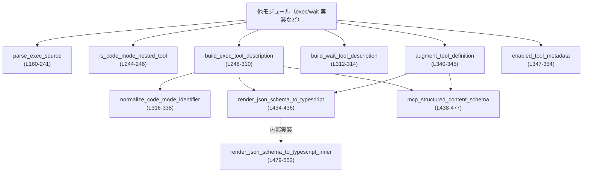
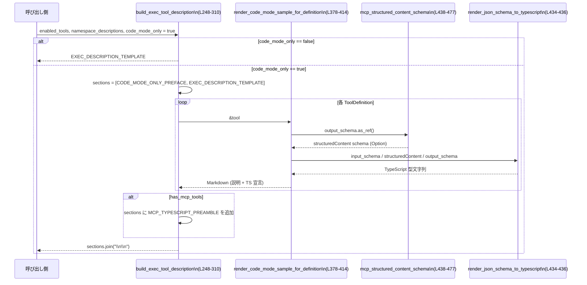
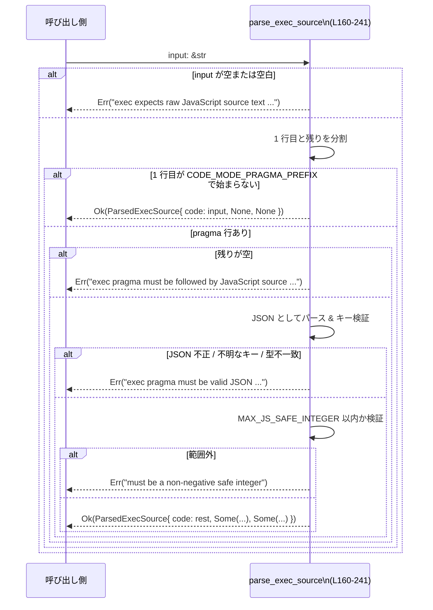

# code-mode/src/description.rs コード解説

## 0. ざっくり一言

このモジュールは、**Code Mode の `exec` / `wait` ツールの説明文生成**と、MCP ツールの **JSON Schema から TypeScript 型宣言を生成するユーティリティ**を提供するものです（code-mode/src/description.rs:L8-118, L248-310, L434-685）。

> 注: 行番号は、このチャンク内の先頭行を L1 として手動で付与しています。実ファイルとのずれがある場合があります。

---

## 1. このモジュールの役割

### 1.1 概要

このモジュールは、次の 2 つの問題を解決するために存在します。

- **`exec` ツール入力の取り扱い**  
  - 先頭行の pragma (`// @exec: {...}`) をパースし、`yield_time_ms` や `max_output_tokens` を検証する（L160-241）。
  - `exec` / `wait` ツールの説明テキスト（Markdown/英語）を構築する（L11-41, L34-41, L248-314）。
- **MCP ツールの JSON Schema から TypeScript 型への変換**  
  - `ToolDefinition` に含まれる `input_schema` / `output_schema` を TypeScript 型に変換し、`declare const tools: { ... }` 形式の宣言を生成する（L364-376, L378-414, L434-552, L569-685）。
  - MCP 標準の `CallToolResult` 形式を検出し、共通の TypeScript プリアンブルを埋め込む（L42-118, L438-477, L248-310）。

### 1.2 アーキテクチャ内での位置づけ

このモジュール自体は stateless な純関数群で構成されており、他のモジュールから以下のように呼び出されることが想定されます。



- 外部から直接見えるのは主に `pub fn` 群と `ToolDefinition` / `EnabledToolMetadata` などの型です（L129-136, L347-362）。
- JSON Schema から TypeScript への変換や MCP 検出は、`render_json_schema_to_typescript_inner` / `mcp_structured_content_schema` といった内部関数に隠蔽されています（L438-552）。
- 並行性に関する機能はなく、全て同期・メモリ安全な処理です（`unsafe` ブロックは存在しません）。

### 1.3 設計上のポイント

コードから読み取れる設計上の特徴を挙げます。

- **完全に純粋な関数群**  
  - 入力は引数のみ、出力は戻り値のみで、副作用（I/O・グローバル状態変更）はありません（全関数）。  
  - これにより並行実行やテストが容易です。

- **厳密な入力バリデーション**  
  - `parse_exec_source` は
    - 空文字列拒否（L160-165）
    - pragma 行がある場合は「JSON として妥当か」「キーが `yield_time_ms` / `max_output_tokens` のみか」「数値が安全な範囲か」を全て検証します（L187-236）。
    - `CodeModeExecPragma` には `#[serde(deny_unknown_fields)]` が付いており、未知のフィールドはエラーになります（L144-151）。

- **JavaScript / TypeScript 観点の安全性**  
  - JavaScript で安全に扱える整数範囲（53bit 未満）を `MAX_JS_SAFE_INTEGER` で定義し（L8）、pragma の数値をその範囲内に制限しています（L220-236）。
  - ツール名を TypeScript の識別子として利用する際は、`normalize_code_mode_identifier` で不正な文字を `_` に置換し、空の場合は `_` にフォールバックします（L316-338）。
  - JSON Schema のプロパティ名は、必要に応じて `serde_json::to_string` で正しくエスケープされた文字列リテラルとして出力し、TypeScript コード注入を防いでいます（L687-692）。

- **MCP 対応の抽象化**  
  - MCP 標準の `CallToolResult` 形式を検知するロジックを `mcp_structured_content_schema` に切り出し（L438-477）、TypeScript プリアンブル `MCP_TYPESCRIPT_PREAMBLE` を一度だけ出力するようにしています（L42-118, L300-303, L969-1065 のテスト）。

---

## 2. 主要な機能・コンポーネント一覧

### 2.1 型・構造体・列挙体一覧

| 名前 | 種別 | 公開 | 役割 / 用途 | 定義位置 |
|------|------|------|-------------|----------|
| `CodeModeToolKind` | 列挙体 | pub | ツールが「関数型入力」か「自由入力文字列」かを表す（`Function` / `Freeform`）（L122-127） | description.rs:L122-127 |
| `ToolDefinition` | 構造体 | pub | 1 つのツール（名前・説明・入出力スキーマ・種別）のメタデータ（L129-136） | L129-136 |
| `ToolNamespaceDescription` | 構造体 | pub | ツール名ごとに紐付けられた「名前空間名」とその説明文（L138-142） | L138-142 |
| `CodeModeExecPragma` | 構造体 | 非 pub | `// @exec: {...}` 行の JSON 部分を受ける内部用構造体（`yield_time_ms` / `max_output_tokens`）（L144-151） | L144-151 |
| `ParsedExecSource` | 構造体 | pub | `exec` 入力文字列をパースした結果（JavaScript コード本体とオプションの pragma 値）（L153-158） | L153-158 |
| `EnabledToolMetadata` | 構造体 | pub | Code Mode 上で利用可能なツールの公開メタデータ（ツール名 / グローバル名 / 説明 / 種別）（L356-362） | L356-362 |

### 2.2 関数一覧（概要）

**公開関数**

| 関数名 | 概要 | 定義位置 |
|--------|------|----------|
| `parse_exec_source` | `exec` ツールの入力文字列から pragma と JS コードを切り出し、数値の妥当性を検証する | L160-241 |
| `is_code_mode_nested_tool` | ツール名が Code Mode のトップレベルツール（PUBLIC / WAIT）かどうかを判定し、それ以外を「ネストされたツール」として扱う | L244-246 |
| `build_exec_tool_description` | `exec` ツールの説明文と、利用可能なネストされたツールごとの TypeScript 宣言を Markdown で構築する | L248-310 |
| `build_wait_tool_description` | `wait` ツールの説明文を返す（定数のラッパー） | L312-314 |
| `normalize_code_mode_identifier` | 任意のツール名を JavaScript/TypeScript の有効な識別子に変換する | L316-338 |
| `augment_tool_definition` | `ToolDefinition` を受け取り、`description` を TypeScript 宣言付きのものに書き換えて返す | L340-345 |
| `enabled_tool_metadata` | `ToolDefinition` から、実行時に必要なメタデータ (`EnabledToolMetadata`) を構築する | L347-354 |
| `render_code_mode_sample` | 説明文と TypeScript 宣言を組み合わせたサンプル文字列を生成する | L364-376 |
| `render_json_schema_to_typescript` | 任意の JSON Schema (`serde_json::Value`) を TypeScript 型表現に変換する公開エントリポイント | L434-436 |

**主な内部ヘルパー**

| 関数名 | 役割（1 行） | 定義位置 |
|--------|--------------|----------|
| `render_code_mode_sample_for_definition` | `ToolDefinition` から input/output 型を導出し、`render_code_mode_sample` を呼び出す | L378-414 |
| `render_code_mode_tool_declaration` | 1 つのツールの TypeScript 関数宣言文字列を生成する | L416-424 |
| `render_tool_heading` | Markdown のツール見出し `###` を生成する | L426-432 |
| `mcp_structured_content_schema` | `output_schema` が MCP `CallToolResult` 形式かどうか判定し、`structuredContent` 部分のスキーマを取り出す | L438-477 |
| `render_json_schema_to_typescript_inner` | JSON Schema を TypeScript 型に変換する実装本体 | L479-552 |
| `render_json_schema_type_keyword` | `type` キーワード（string, number, object など）を TypeScript 型に対応付ける | L554-566 |
| `render_json_schema_array` | `items` / `prefixItems` を持つ array スキーマを TypeScript 配列・タプル型に変換する | L569-585 |
| `append_additional_properties_line` | `additionalProperties` に応じて `[key: string]: ...` 行を付加する | L588-607 |
| `has_property_description` | プロパティに `description` が付いているかどうかを判定する | L609-614 |
| `render_json_schema_object_property` | 1 プロパティを `name?: Type;` の形式にレンダリングする | L616-625 |
| `render_json_schema_object` | object スキーマ全体を TypeScript のオブジェクト型に変換する | L627-685 |
| `render_json_schema_property_name` | プロパティ名を識別子として使うか、クォートされた文字列リテラルにするかを決める | L687-692 |
| `render_json_schema_literal` | JSON 値をそのまま TypeScript リテラルに変換する | L695-697 |

---

## 3. 公開 API と詳細解説

### 3.1 型一覧（構造体・列挙体など）

上記 2.1 の表を参照してください。ここでは特に API として重要な型に絞って補足します。

| 名前 | 種別 | 役割 / 用途 | 主なフィールド | 定義位置 |
|------|------|-------------|----------------|----------|
| `CodeModeToolKind` | enum | ツールの呼び出しスタイルを分類 | `Function`（構造化 JSON 引数） / `Freeform`（自由テキスト引数）（L124-126） | L122-127 |
| `ToolDefinition` | struct | 1 ツールのメタ情報 | `name`, `description`, `kind`, `input_schema`, `output_schema`（L131-135） | L129-136 |
| `ParsedExecSource` | struct | `exec` 入力のパース結果 | `code`, `yield_time_ms`, `max_output_tokens`（L155-157） | L153-158 |
| `EnabledToolMetadata` | struct | Code Mode 向けツールメタ情報（UI/説明用） | `tool_name`, `global_name`, `description`, `kind`（L358-361） | L356-362 |

### 3.2 重要な関数の詳細

#### `parse_exec_source(input: &str) -> Result<ParsedExecSource, String>`（L160-241）

**概要**

- `exec` ツールに渡される文字列入力から
  - 先頭行の pragma (`// @exec: {...}`) を任意で取り出し
  - その JSON を検証して `yield_time_ms` / `max_output_tokens` を取得し
  - 残りを純粋な JavaScript コードとして返す関数です。

**引数**

| 引数名 | 型 | 説明 |
|--------|----|------|
| `input` | `&str` | ユーザーから `exec` ツールへ渡される全入力文字列。先頭行に pragma を含んでもよい。 |

**戻り値**

- `Ok(ParsedExecSource)`  
  - `code`: 実際に V8 に渡す JavaScript ソース（pragma 行は除去済み）（L238-239）。
  - `yield_time_ms` / `max_output_tokens`: pragma から抽出したオプション値。
- `Err(String)`  
  - 入力が空、pragma の JSON が不正、対応していないフィールドを含む、数値が安全範囲外 など、いずれかの検証に失敗した場合のエラーメッセージ（L161-165, L181-185, L187-193, L195-203, L204-213, L215-219, L220-236）。

**内部処理の流れ**

1. 空入力チェック  
   - `input.trim().is_empty()` ならエラーを返します（L160-165）。
2. デフォルト値付きの `ParsedExecSource` を作成  
   - `code` はとりあえず `input.to_string()`、その他は `None`（L167-171）。
3. 先頭行と残りの行に分割  
   - `splitn(2, '\n')` で `first_line` と `rest` を得ます（L173-175）。
4. 先頭行の pragma 検出  
   - 行頭の空白を削った後、`CODE_MODE_PRAGMA_PREFIX` (`"// @exec:"`) で始まる場合のみ pragma とみなします（L176-179）。
   - 始まらない場合はそのまま `Ok(args)` を返し、pragma なしと判断します（L177-179）。
5. pragma がある場合の検証  
   - `rest` が空（JavaScript 本体がない）ならエラー（L181-185）。
   - `pragma` 部分をトリムして空でないことを確認（L187-193）。
   - `serde_json::from_str` で JSON としてパースし、失敗した場合はエラー（L195-199）。
   - `value.as_object()` によりトップレベルがオブジェクトか確認（L200-203）。
   - キーが `yield_time_ms` / `max_output_tokens` 以外を含む場合はエラー（L204-213）。
   - `CodeModeExecPragma` へのデシリアライズ時に、型不一致や負数があればエラー（L215-219, L144-151）。
6. 安全な整数範囲の検証  
   - `yield_time_ms` が `MAX_JS_SAFE_INTEGER` を超えればエラー（L220-227）。
   - `max_output_tokens` を `u64::try_from` し、変換できない／安全範囲外ならエラー（L228-236）。
7. 成功時の構造体構築  
   - `args.code = rest.to_string()` に差し替え（pragma 行を除去）（L238）。
   - `args.yield_time_ms` / `args.max_output_tokens` に検証済み値を設定し `Ok(args)` を返します（L239-241）。

**Examples（使用例）**

基本的な利用例です。入力文字列から pragma を取り出し、値を使って実行設定を決めるイメージです。

```rust
use code_mode::description::{parse_exec_source, ParsedExecSource}; // モジュールから関数と型をインポート

fn handle_exec_input(input: &str) -> Result<(), String> {          // exec 入力を処理する関数
    let parsed: ParsedExecSource = parse_exec_source(input)?;      // 文字列をパースして検証（エラーならここで Err を返す）

    // ここで parsed.yield_time_ms / parsed.max_output_tokens を実行設定に反映する
    println!("JS code: {}", parsed.code);                          // JavaScript 本体のみが入っている
    println!("yield_time_ms: {:?}", parsed.yield_time_ms);         // オプション値
    println!("max_output_tokens: {:?}", parsed.max_output_tokens); // オプション値

    Ok(())                                                         // 正常終了
}

fn main() -> Result<(), String> {
    let input = "// @exec: {\"yield_time_ms\": 10}\ntext('hi')";    // pragma 付き入力例
    handle_exec_input(input)                                       // 処理を実行
}
```

**Errors / Panics**

- `Err(String)` になる主な条件（コード上の根拠付き）:
  - 入力が空または空白のみ: L160-165。
  - pragma 行のあとに JavaScript 本体が無い: L181-185。
  - pragma 部分が空文字列: L187-193。
  - pragma が JSON でない／トップレベルがオブジェクトでない: L195-203。
  - サポートされていないキーが含まれる: L204-213。
  - `yield_time_ms` / `max_output_tokens` が整数でない・負数などで `CodeModeExecPragma` への変換に失敗: L215-219, L144-151。
  - `yield_time_ms` または `max_output_tokens` が `MAX_JS_SAFE_INTEGER` を超える: L220-236。
- `panic!` を起こすコードは含まれません（`unwrap` があるのは定数や Option への明らかに安全な箇所のみです）。

**Edge cases（エッジケース）**

- `input` が空文字・空白のみ  
  → エラー文字列 `"exec expects raw JavaScript source text (non-empty). ..."` を返します（L160-165）。
- pragma なし（先頭行が `"// @exec:"` で始まらない）  
  → `code = input.to_string()`、オプション値は `None` でそのまま戻ります（L167-171, L176-179）。
- pragma 行だけで JavaScript が 1 行もない  
  → `"exec pragma must be followed by JavaScript source on subsequent lines"` エラー（L181-185）。
- `yield_time_ms: -1` や `1.5` のような値  
  → `CodeModeExecPragma` へのデシリアライズ時にエラーとなり、`"must be non-negative safe integers: ..."` エラー（L215-219）。
- 非サポートのキー（例: `{"timeout": 10}`）  
  → `"exec pragma only supports ...; got`timeout`"` エラー（L204-213）。
- 極端に大きな `max_output_tokens`（usize 上限を超えるなど）  
  → `u64::try_from` で失敗し、`"must be a non-negative safe integer"` エラー（L228-236）。

**使用上の注意点**

- この関数は **入力文字列全体** を期待しており、`exec` 用の JavaScript を部分的に与える用途には向きません。
- pragma 行と JavaScript 本体は **必ず改行で区切られている必要** があります（同一行に pragma とコードを書く形式には対応していません；L173-181）。
- エラーメッセージは `String` で返されるため、上位の API で独自のエラー型に変換する場合は、パターンマッチやラッピングを行う必要があります。

---

#### `is_code_mode_nested_tool(tool_name: &str) -> bool`（L244-246）

**概要**

- 与えられたツール名が Code Mode 内部で定義されているトップレベルツール（`PUBLIC_TOOL_NAME` / `WAIT_TOOL_NAME`）以外かどうかを判定します。

**引数**

| 引数名 | 型 | 説明 |
|--------|----|------|
| `tool_name` | `&str` | 判定対象のツール名（通常は `ToolDefinition.name` ） |

**戻り値**

- `true` なら「ネストされたツール（exec が中から呼び出すツール）」として扱うべき名前。
- `false` なら `crate::PUBLIC_TOOL_NAME` または `crate::WAIT_TOOL_NAME` に一致する名前。

**内部処理**

- 単純に `tool_name != crate::PUBLIC_TOOL_NAME && tool_name != crate::WAIT_TOOL_NAME` を返しています（L244-246）。

**使用上の注意点**

- `PUBLIC_TOOL_NAME` / `WAIT_TOOL_NAME` はこのチャンクには定義がなく、別ファイルで定義されています（L6, L245）。実際の値はこのコードからは分かりません。
- この関数は呼び出し側にツールの役割を区別するためのヘルパーを提供しますが、どう利用するかは他モジュール側の設計に依存します。

---

#### `build_exec_tool_description(...) -> String`（L248-310）

```rust
pub fn build_exec_tool_description(
    enabled_tools: &[ToolDefinition],
    namespace_descriptions: &BTreeMap<String, ToolNamespaceDescription>,
    code_mode_only: bool,
) -> String
```

**概要**

- `exec` ツールの説明文を Markdown 文字列として構築する関数です。
- `code_mode_only` が `true` の場合は、
  - Code Mode 専用の前置き (`CODE_MODE_ONLY_PREFACE`)（L9-10）
  - 基本的な `exec` 説明 (`EXEC_DESCRIPTION_TEMPLATE`)（L11-33）
  - 有効なネストされたツールごとの TypeScript 宣言と説明
  - 必要に応じて MCP 共通型 `MCP_TYPESCRIPT_PREAMBLE`
  をまとめた説明を返します。

**引数**

| 引数名 | 型 | 説明 |
|--------|----|------|
| `enabled_tools` | `&[ToolDefinition]` | Code Mode から利用可能なツール一覧。ここから per-tool のサンプル宣言を生成します。 |
| `namespace_descriptions` | `&BTreeMap<String, ToolNamespaceDescription>` | ツール名 → 名前空間説明のマップ。名前空間ごとの共通ガイドを 1 回だけ挿入するために使われます。 |
| `code_mode_only` | `bool` | `true` の場合: Code Mode 上でのみ使用される exec 用の詳細説明を生成。`false` の場合: 共通テンプレートのみを返す。 |

**戻り値**

- Markdown 形式の説明文。例:
  - `code_mode_only == false` の場合: `EXEC_DESCRIPTION_TEMPLATE` の内容だけ（L253-255）。
  - `code_mode_only == true` の場合: パーツを結合した複合的な説明（L257-260, L300-307, L309）。

**内部処理の流れ**

1. `code_mode_only` が `false` なら早期リターン  
   - `EXEC_DESCRIPTION_TEMPLATE.to_string()` をそのまま返します（L253-255）。
2. Code Mode 専用の前置きとテンプレートから `sections` を初期化（L257-260）。
3. `enabled_tools` が空でなければツール一覧を展開（L262-298）。
   - `current_namespace` で「直前のツールの名前空間」を追跡（L263）。
   - `has_mcp_tools` で MCP 形式の `output_schema` を持つツールの有無を判定（L265-267, L438-477）。
4. 各ツールごとに:
   - `render_code_mode_sample_for_definition(tool)` で TypeScript 宣言付きの説明文を生成（L271, L378-414）。
   - `namespace_descriptions` から必要に応じて「名前空間見出し + 共通説明」を 1 回だけ追加（L272-286）。
   - `normalize_code_mode_identifier` で JS 識別子としてのグローバル名を得て Markdown の見出しを作り、サンプル説明を添付（L288-296, L316-338, L426-432）。
5. MCP ツールが少なくとも 1 つある場合、共通 TypeScript 定義を追加（L300-303, L42-118）。
6. `sections` を `"\n\n"` で結合し、最終的な説明文として返却（L305-307, L309）。

**Examples（使用例）**

最小限のツール定義から Code Mode 専用説明を生成する例です。

```rust
use code_mode::description::{
    build_exec_tool_description, CodeModeToolKind, ToolDefinition, ToolNamespaceDescription,
};
use serde_json::json;
use std::collections::BTreeMap;

fn build_description() -> String {
    // 有効なツール 1 件を定義
    let tools = vec![ToolDefinition {
        name: "weather_tool".to_string(),             // ツール名
        description: "Weather tool".to_string(),      // 説明（後で TypeScript 宣言付きに書き換え可能）
        kind: CodeModeToolKind::Function,             // 構造化引数ツール
        input_schema: Some(json!({                    // 入力 JSON Schema
            "type": "object",
            "properties": {},
            "additionalProperties": false
        })),
        output_schema: None,                          // 出力 Schema 未指定
    }];

    // 名前空間説明（今回は空）
    let namespaces: BTreeMap<String, ToolNamespaceDescription> = BTreeMap::new();

    // Code Mode 専用説明を生成
    build_exec_tool_description(&tools, &namespaces, true)
}
```

**Errors / Panics**

- この関数自体は `Result` を返さず、panic を起こしうるのは以下のみです。
  - `format!` によるメモリ確保失敗など、通常の Rust ランタイム上の例外的状況。
- JSON Schema がどのような形でも、`render_json_schema_to_typescript` 側で `unknown` 等にフォールバックしており、ここではエラーになりません（L378-406, L479-552）。

**Edge cases（エッジケース）**

- `enabled_tools` が空  
  → Code Mode 専用前置きと `EXEC_DESCRIPTION_TEMPLATE` の 2 セクションのみを返します（L262-263）。
- `namespace_descriptions` に説明が無い（空文字）場合  
  → 名前空間見出しセクションは作られず、ツールごとの見出しのみになります（L276-283, L936-966 のテスト）。
- `enabled_tools` が MCP ツールと非 MCP ツールを混在している場合  
  → MCP 形式のツールが 1 つでもあれば `Shared MCP Types:` セクションが 1 回だけ追加されます（L265-267, L300-303, L969-1065）。

**使用上の注意点**

- 名前空間説明（`namespace_descriptions`）は、`enabled_tools` の順番に依存してグルーピングされます（L263-286）。  
  ツールがランダムな順序の場合、同じ名前空間のセクションが複数回現れる可能性があります。この点は利用側で順序を揃えるか、別途制御する必要があります。
- MCP 共通型の出力有無は `output_schema` の内容から推測されます（L438-477）。  
  `CallToolResult` 形式と異なるスキーマを使う MCP ツールでは、共通定義が利用されない可能性があります。

---

#### `normalize_code_mode_identifier(tool_key: &str) -> String`（L316-338）

**概要**

- 任意のツール名（例: `"hidden-dynamic-tool"`）を、JavaScript/TypeScript の有効な識別子として使える形（例: `"hidden_dynamic_tool"`）に変換する関数です。

**引数**

| 引数名 | 型 | 説明 |
|--------|----|------|
| `tool_key` | `&str` | 元のツール名。ハイフンを含むなど、JS 的に不正な文字を含んでいてよい。 |

**戻り値**

- 正規化された識別子文字列。  
  - 1 文字目: `[A-Za-z_$]` のいずれかでなければ `_` に変換（L320-323）。
  - 2 文字目以降: `[A-Za-z0-9_$]` 以外は `_` に変換（L320-324, L326-330）。
  - 最終的に空文字列だった場合は `"_"` を返す（L333-335）。

**内部処理の流れ**

1. 空の `identifier` 文字列を用意（L317）。
2. `chars().enumerate()` で 1 文字ずつ走査（L319）。
3. 位置に応じて許可される文字種を判定し、不正なら `_` に置換（L320-324, L326-330）。
4. 全文字処理後、`identifier` が空なら `"_"` を返し、そうでなければ `identifier` を返す（L333-337）。

**Examples（使用例）**

```rust
use code_mode::description::normalize_code_mode_identifier;

fn main() {
    assert_eq!(
        "hidden_dynamic_tool",
        normalize_code_mode_identifier("hidden-dynamic-tool") // '-' が '_' に変換される
    );
    assert_eq!(
        "_123",
        normalize_code_mode_identifier("123")                  // 先頭数字は '_' に
    );
}
```

**Edge cases（エッジケース）**

- 全てが不正文字（空文字列や完全に非 ASCII の記号など）の場合  
  → `"_"` が返ります（L333-335）。
- 先頭文字が数字、以降が英数字の場合  
  → 先頭のみ `_`、以降はそのまま（例: `"1foo"` → `"_1foo"`）（L320-324）。

**使用上の注意点**

- この関数は **Unicode の非 ASCII アルファベットなどを許可していません**（`is_ascii_alphabetic` / `is_ascii_alphanumeric` を利用；L321, L323）。  
  ツール名に非 ASCII 文字を含めている場合、すべて `_` に置換される可能性があります。

---

#### `augment_tool_definition(definition: ToolDefinition) -> ToolDefinition`（L340-345）

**概要**

- 元の `ToolDefinition` を受け取り、`name` が `PUBLIC_TOOL_NAME` でない場合に、`description` を TypeScript 宣言付きのサンプルに置き換えた新しい `ToolDefinition` を返します。

**引数**

| 引数名 | 型 | 説明 |
|--------|----|------|
| `definition` | `ToolDefinition` | 元のツール定義。所有権はこの関数に移動します。 |

**戻り値**

- `ToolDefinition`  
  - `name`, `kind`, `input_schema`, `output_schema` は元のまま（L340-345）。
  - `description` は
    - `definition.name == PUBLIC_TOOL_NAME` の場合: 元の説明のまま。
    - それ以外: `render_code_mode_sample_for_definition(&definition)` によって生成された TypeScript 宣言付きの説明（L341-343, L378-414）。

**内部処理の流れ**

1. 引数 `definition` を `mut` として受け取り、書き換え可能にする（L340）。
2. 名前が `PUBLIC_TOOL_NAME` でない場合のみ、`description` を `render_code_mode_sample_for_definition` の結果で上書き（L341-343）。
3. `definition` を返す（L344-345）。

**Examples（使用例）**

```rust
use code_mode::description::{augment_tool_definition, CodeModeToolKind, ToolDefinition};
use serde_json::json;

fn main() {
    let def = ToolDefinition {
        name: "hidden_dynamic_tool".to_string(),              // PUBLIC_TOOL_NAME ではない
        description: "Test tool".to_string(),                 // 元の説明
        kind: CodeModeToolKind::Function,
        input_schema: Some(json!({                            // 入力 Schema
            "type": "object",
            "properties": { "city": { "type": "string" } },
            "required": ["city"],
            "additionalProperties": false
        })),
        output_schema: None,
    };

    let augmented = augment_tool_definition(def);             // description が TypeScript 宣言付きに
    println!("{}", augmented.description);                    // "declare const tools: { ... }" を含む
}
```

**Edge cases**

- `name == PUBLIC_TOOL_NAME` の場合  
  → 説明文は一切変更されません（L341）。
- `input_schema` / `output_schema` が `None` の場合  
  → TypeScript 型は `unknown` として出力されます（L383-390, L401-406）。

**使用上の注意点**

- この関数は **`description` を上書きする** ため、元の説明を保持したい場合は、呼び出し側で別途保存する必要があります。
- `PUBLIC_TOOL_NAME` かどうかの判定は文字列一致で行われるため、`PUBLIC_TOOL_NAME` の値を変えた場合の影響範囲を確認する必要があります（L6, L341）。

---

#### `render_code_mode_sample(...) -> String`（L364-376）

```rust
pub fn render_code_mode_sample(
    description: &str,
    tool_name: &str,
    input_name: &str,
    input_type: String,
    output_type: String,
) -> String
```

**概要**

- 任意の説明文と TypeScript 型情報から、`declare const tools: { ... }` を含むサンプル文字列を生成します。

**引数**

| 引数名 | 型 | 説明 |
|--------|----|------|
| `description` | `&str` | ツールの自然言語による説明文。 |
| `tool_name` | `&str` | ツールの元の名前（TypeScript 宣言用には内部で正規化されます）。 |
| `input_name` | `&str` | TypeScript 関数引数の名前（例: `"args"` / `"input"`）。 |
| `input_type` | `String` | TypeScript 表現としての入力型（例: `"string"` / `"{ city: string; }"`）。 |
| `output_type` | `String` | TypeScript 表現としての出力型（例: `"CallToolResult<{ echo: string; }>"`）。 |

**戻り値**

- Markdown テキスト。  
  形式は  
  - 説明文
  - 空行
  - `"exec tool declaration:\n```ts\ndeclare const tools: { ... };\n```"`
  の順で構成されます（L371-375）。

**内部処理の流れ**

1. `render_code_mode_tool_declaration` で 1 行の TypeScript 関数宣言を作成（L371-374, L416-424）。
2. `"declare const tools: { ... };"` の形でラップ（L371-373）。
3. 説明文と `"exec tool declaration:"` 見出し、TypeScript コードブロックを連結して返却（L371-375）。

**Examples（使用例）**

```rust
use code_mode::description::render_code_mode_sample;

fn main() {
    let ts_sample = render_code_mode_sample(
        "Weather tool",                             // 自然言語での説明
        "weather_tool",                             // ツール名
        "args",                                     // 引数名
        "{ city: string; }".to_string(),            // 入力型
        "{ ok: boolean; }".to_string(),             // 出力型
    );

    println!("{ts_sample}");                        // Markdown + TypeScript 宣言が出力される
}
```

**使用上の注意点**

- 実際の正規化（`normalize_code_mode_identifier`）は `render_code_mode_tool_declaration` 側で行われます（L416-424）。
- `description` に長大なテキストを渡した場合、そのまま連結されるため、上位の UI で表示長を制御する必要があります。

---

#### `render_json_schema_to_typescript(schema: &JsonValue) -> String`（L434-436, L479-552, L554-585, L627-685）

**概要**

- 任意の JSON Schema (`serde_json::Value`) を TypeScript の型表現文字列に変換する公開エントリポイントです。
- `render_json_schema_to_typescript_inner` に処理を委譲しています（L434-436, L479-552）。

**引数**

| 引数名 | 型 | 説明 |
|--------|----|------|
| `schema` | `&serde_json::Value` (`JsonValue`) | JSON Schema を表す JSON 値。 |

**戻り値**

- TypeScript 型の文字列表現。主な変換規則は以下の通りです（L479-552, L554-566, L569-585, L627-685）。
  - `true` → `"unknown"`
  - `false` → `"never"`
  - `{"const": value}` → `render_json_schema_literal(value)`（JSON リテラルに変換）
  - `{"enum": [v1, v2, ...]}` → `v1 | v2 | ...`
  - `{"anyOf": [s1, s2, ...]}` / `{"oneOf": [...]}` → `T1 | T2 | ...`
  - `{"allOf": [s1, s2, ...]}` → `T1 & T2 & ...`
  - `{"type": "string"}` → `"string"`
  - `{"type": "number"}` / `"integer"` → `"number"`
  - `{"type": "boolean"}` → `"boolean"`
  - `{"type": "null"}` → `"null"`
  - `{"type": "array"}` → `render_json_schema_array(...)` 結果
  - `{"type": "object"}` → `render_json_schema_object(...)` 結果
  - 上記いずれにも当てはまらない → `"unknown"`

**内部処理の流れ（要約）**

1. Bool スキーマの特別扱い  
   - `true` → `"unknown"`（任意の値を許容）（L481-482）。
   - `false` → `"never"`（いかなる値も許容しない）（L481-482）。
2. `Object` スキーマの場合（L483-549）:
   - `const` / `enum` / `anyOf` / `oneOf` / `allOf` を優先的に処理（L484-518）。
   - `type` が配列なら union として処理、単一文字列ならキーワードに応じた型へ（L520-535, L554-566）。
   - `properties` / `additionalProperties` / `required` などがあれば `render_json_schema_object` に委譲（L537-542, L627-685）。
   - `items` / `prefixItems` があれば `render_json_schema_array` に委譲（L544-546, L569-585）。
   - どれにも該当しなければ `"unknown"`（L548-549）。
3. `render_json_schema_array`（L569-585）:
   - `items` があれば `Array<item_type>`。
   - `prefixItems` が配列なら `[T1, T2, ...]` のタプル型。
   - どちらも無ければ `"unknown[]"`。
4. `render_json_schema_object`（L627-685）:
   - `required` から必須プロパティ名リストを作る（L628-637）。
   - `properties` をアルファベット順にソート（L638-645）。
   - いずれかのプロパティに `description` があれば、コメント付き `{ ... }` 形式の複数行オブジェクトを生成（L646-671）。
   - そうでなければ 1 行 `{ foo?: string; bar: number; }` 形式（L673-685）。
   - `additionalProperties` に応じて `[key: string]: ...;` を追加（L588-607, L668-669, L678-679）。

**Examples（使用例）**

```rust
use code_mode::description::render_json_schema_to_typescript;
use serde_json::json;

fn main() {
    // シンプルな object スキーマを TypeScript 型に変換
    let schema = json!({
        "type": "object",
        "properties": {
            "city": { "type": "string" },
            "temperature": { "type": "number" }
        },
        "required": ["city"]
    });

    let ts_type = render_json_schema_to_typescript(&schema);
    // 結果の例: "{ city: string; temperature?: number; }"
    println!("{ts_type}");
}
```

**Edge cases**

- `schema` が空オブジェクト `{}`  
  → `properties` なども無いため `"unknown"` が返ります（L537-549）。
- `properties` も `additionalProperties` も無い object  
  → `[key: string]: unknown;` を含む `{ [key: string]: unknown; }` 型になります（L588-607, L678-682）。
- `description` を含むプロパティ  
  → 対応する TypeScript プロパティの直前に `// ...` コメント行が入ります（L646-661）。

**使用上の注意点**

- この関数は **JSON Schema の完全な仕様を網羅しているわけではありません**。対応していないキーワードを含む場合、多くは `"unknown"` にフォールバックします（L537-549）。
- 生成される TypeScript はあくまで「補助的な型情報」であり、厳密なスキーマ検証の代替ではありません。

---

#### `enabled_tool_metadata(definition: &ToolDefinition) -> EnabledToolMetadata`（L347-354）

**概要**

- `ToolDefinition` から Code Mode 実行時に必要な最小限のメタデータを取り出し、`EnabledToolMetadata` として返します。

**引数**

| 引数名 | 型 | 説明 |
|--------|----|------|
| `definition` | `&ToolDefinition` | もとになるツール定義。所有権は移動しません。 |

**戻り値**

- `EnabledToolMetadata`  
  - `tool_name`: `definition.name.clone()`（L349）。
  - `global_name`: `normalize_code_mode_identifier(&definition.name)`（L350, L316-338）。
  - `description`: `definition.description.clone()`（L351）。
  - `kind`: `definition.kind`（コピー）（L352）。

**使用上の注意点**

- `description` がすでに `augment_tool_definition` などで TypeScript 宣言付きに変更されているかどうかは、呼び出し側の設計に依存します（L340-345）。
- この構造体は `Serialize` 派生を持つため（L356-362）、JSON 等で送出する用途にも使えます。

---

### 3.3 その他の関数一覧

公開 API のうち比較的単純なものと、内部ヘルパー関数をまとめます。

| 関数名 | 公開 | 役割（1 行） | 定義位置 |
|--------|------|--------------|----------|
| `build_wait_tool_description()` | pub | `WAIT_DESCRIPTION_TEMPLATE` をそのまま返すラッパー（L312-314） | L312-314 |
| `render_code_mode_sample_for_definition` | 非 pub | `ToolDefinition` から input/output TypeScript 型を導出し、`render_code_mode_sample` を呼び出す（L378-414） | L378-414 |
| `render_code_mode_tool_declaration` | 非 pub | ツール名を正規化して `name(arg: Type): Promise<Return>;` の宣言を生成（L416-424） | L416-424 |
| `render_tool_heading` | 非 pub | Markdown 見出し `### \`global\` (\`raw\`)` を生成（L426-432） | L426-432 |
| `mcp_structured_content_schema` | 非 pub | `output_schema` が MCP `CallToolResult` 形式か判定し、`structuredContent` スキーマを返す（L438-477） | L438-477 |
| `render_json_schema_to_typescript_inner` | 非 pub | JSON Schema から TypeScript 型への変換本体（L479-552） | L479-552 |
| `render_json_schema_type_keyword` | 非 pub | `type: "string" | "number" | ...` を TS 型キーワードに対応付ける（L554-566） | L554-566 |
| `render_json_schema_array` | 非 pub | array / tuple スキーマのレンダリング（L569-585） | L569-585 |
| `append_additional_properties_line` | 非 pub | `additionalProperties` に応じたインデックスシグネチャ行追加（L588-607） | L588-607 |
| `has_property_description` | 非 pub | プロパティに `description` があるか判定（L609-614） | L609-614 |
| `render_json_schema_object_property` | 非 pub | object プロパティ 1 件を `name?: Type;` に変換（L616-625） | L616-625 |
| `render_json_schema_object` | 非 pub | object スキーマ全体を TS オブジェクト型に変換（L627-685） | L627-685 |
| `render_json_schema_property_name` | 非 pub | プロパティ名を識別子か文字列リテラルにするか判定（L687-692） | L687-692 |
| `render_json_schema_literal` | 非 pub | JSON 値をそのまま TS リテラルにする（L695-697） | L695-697 |

---

## 4. データフロー

### 4.1 `exec` ツール説明生成のフロー

代表的なシナリオとして、Code Mode サーバが「利用可能なツール一覧」から `exec` ツール説明を構築する流れを示します。



- TypeScript 型生成は `render_json_schema_to_typescript` とその内部関数群にカプセル化されており、`build_exec_tool_description` からは JSON Schema を渡すだけで済みます（L391-406, L434-552）。
- MCP 形式の検出は `mcp_structured_content_schema` に集約されており、`CallToolResult<T>` 型のジェネリックパラメータとして使用するスキーマを返します（L438-477）。

### 4.2 `exec` 入力パースのフロー



---

## 5. 使い方（How to Use）

### 5.1 基本的な使用方法

#### 5.1.1 `exec` 入力をパースする

```rust
use code_mode::description::{parse_exec_source, ParsedExecSource}; // パーサと結果型をインポート

// exec ツールから受け取った生入力を処理する関数
fn handle_exec_input(raw_input: &str) -> Result<(), String> {
    // 文字列をパースし、pragma と JavaScript 本体を取り出す
    let parsed: ParsedExecSource = parse_exec_source(raw_input)?; // 失敗時は Err(String) をそのまま返す

    // ここで V8 実行に必要な設定を決定する
    let js_code = parsed.code;                                   // pragma 行を除いた JS コード
    let yield_ms = parsed.yield_time_ms.unwrap_or(10_000);       // デフォルト 10 秒などを適用
    let max_tokens = parsed.max_output_tokens.unwrap_or(10_000); // デフォルトの出力トークン数

    // run_js はこのファイルには定義されていないが、実際には V8 実行ロジックに渡す
    println!("Execute: {js_code} (yield_ms={yield_ms}, max_tokens={max_tokens})");

    Ok(())
}

fn main() -> Result<(), String> {
    // pragma 付きのサンプル入力
    let input = "\
        // @exec: {\"yield_time_ms\": 5000, \"max_output_tokens\": 2000}\n\
        text('hi');\
    ";
    handle_exec_input(input)
}
```

#### 5.1.2 `exec` / `wait` の説明を生成する

```rust
use code_mode::description::{
    build_exec_tool_description, build_wait_tool_description,
    CodeModeToolKind, ToolDefinition, ToolNamespaceDescription,
};
use serde_json::json;
use std::collections::BTreeMap;

// exec/wait ツールの説明テキストを生成する例
fn build_descriptions() -> (String, &'static str) {
    // 利用可能なツール定義
    let tools = vec![ToolDefinition {
        name: "weather_tool".to_string(),               // ツール名
        description: "Weather tool".to_string(),        // 説明
        kind: CodeModeToolKind::Function,               // Function 型
        input_schema: Some(json!({                      // JSON Schema
            "type": "object",
            "properties": { "city": { "type": "string" } },
            "required": ["city"],
        })),
        output_schema: None,
    }];

    // 名前空間説明（今回は空）
    let namespaces: BTreeMap<String, ToolNamespaceDescription> = BTreeMap::new();

    // Code Mode 専用 exec 説明
    let exec_description = build_exec_tool_description(&tools, &namespaces, true);

    // wait 説明（固定テキスト）
    let wait_description = build_wait_tool_description();

    (exec_description, wait_description)
}
```

### 5.2 よくある使用パターン

- **ツール定義を事前に拡張しておく**  
  - 実行サーバ側で起動時に `augment_tool_definition` を全ツールに適用し、`description` に TypeScript 宣言を含めた状態で保持する（L340-345）。
  - UI からは `EnabledToolMetadata` のみを利用し、`global_name` 等を表示や補完に使う（L347-354, L356-362）。

- **MCP ツールの structuredContent を型安全に扱いたい場合**  
  - `output_schema` に MCP `CallToolResult` 形式の JSON Schema を設定しておくと、`render_code_mode_sample_for_definition` 経由で `CallToolResult<YourType>` のジェネリック型が自動生成されます（L391-406, L438-477, L969-1065）。

### 5.3 よくある間違い

```rust
use code_mode::description::parse_exec_source;

// 間違い例: pragma 行だけを渡している
fn bad() {
    let input = "// @exec: {\"yield_time_ms\": 10}"; // JavaScript 本体がない
    let _ = parse_exec_source(input).unwrap();      // → ここで Err になり panic する
}

// 正しい例: pragma の後に必ず JavaScript コードを続ける
fn good() -> Result<(), String> {
    let input = "// @exec: {\"yield_time_ms\": 10}\ntext('hi')"; // 2 行目に JS
    let parsed = parse_exec_source(input)?;                      // Ok
    println!("{}", parsed.code);                                // "text('hi')" が出力される
    Ok(())
}
```

- また、`yield_time_ms` / `max_output_tokens` に負数や小数を指定すると JSON のパースは通っても `CodeModeExecPragma` への変換でエラーになります（L215-219）。

### 5.4 使用上の注意点（まとめ）

- **スレッド安全性**  
  - このモジュールはグローバルな可変状態を持たず、`unsafe` も使用していません。純粋な計算のみなので、どのスレッドから呼び出してもメモリ安全性に問題はありません。
- **バリデーションの責務**  
  - `parse_exec_source` は pragma 部分については厳密にバリデートしますが、JavaScript 本体の妥当性（構文エラーなど）は確認しません。V8 側のエラー処理と組み合わせる必要があります。
- **型情報の精度**  
  - JSON Schema → TypeScript の変換は best-effort であり、複雑なスキーマでは `unknown` にフォールバックすることがあります（L537-549）。その場合でも、実際の実行時検証は別の層で行う前提が適切です。

---

## 6. 変更の仕方（How to Modify）

### 6.1 新しい機能を追加する場合

- **`exec` pragma に新しいフィールドを追加したい場合**
  1. `CodeModeExecPragma` に新しいフィールドを追加する（L144-151）。
  2. `parse_exec_source` 内の「許可されるキー」一覧に新フィールド名を追加する（L204-213）。
  3. `MAX_JS_SAFE_INTEGER` などの制約が必要であれば、同様の範囲チェックを追加する（L220-236）。
  4. テストモジュールに新フィールドをカバーするテストを追加する（L733-755 付近）。

- **新しい `CodeModeToolKind` を追加したい場合**
  1. `CodeModeToolKind` enum にバリアントを追加する（L124-126）。
  2. `render_code_mode_sample_for_definition` の `match definition.kind` 分岐で、新バリアントに対する `input_name` / `input_type` の定義を追加する（L379-390）。
  3. 関連するテスト（特に `augment_tool_definition_*`）を拡張する（L769-842）。

- **JSON Schema → TypeScript 変換の対応範囲を広げたい場合**
  1. 既存の `render_json_schema_to_typescript_inner` に対応したいキーワード（例: `not`, `if/then/else`）を追加する（L479-552）。
  2. 必要なら `render_json_schema_array` / `render_json_schema_object` も拡張する（L569-585, L627-685）。
  3. 新しい変換ルールに対するテストを追加する。

### 6.2 既存の機能を変更する場合の注意点

- **契約の確認**
  - `parse_exec_source` の契約:
    - `Ok` のとき `code` は必ず非空（pragma がある場合は `rest` が空ならエラーになるため；L181-185, L238-241）。
    - `yield_time_ms` / `max_output_tokens` は 0 以上かつ `MAX_JS_SAFE_INTEGER` 以下（L220-236）。
  - これらの前提に依存するコードが他モジュールに存在する可能性があるため、変更時には全呼び出し側を確認する必要があります。

- **テキストテンプレートの変更**
  - `EXEC_DESCRIPTION_TEMPLATE` / `WAIT_DESCRIPTION_TEMPLATE` / `MCP_TYPESCRIPT_PREAMBLE` はテストで特定の文字列を期待している箇所があります（L863-869, L969-1065）。  
    変更する場合は、テストの期待値も合わせて更新する必要があります。

- **名前空間グルーピングのロジック**
  - `build_exec_tool_description` は `enabled_tools` の順序に依存して、名前空間の説明を 1 回だけ挿入する設計です（L263-286, L872-933）。  
    ツール順序の変更が UI/説明文に与える影響を事前に確認することが重要です。

---

## 7. 関連ファイル

このチャンクから直接参照されているが、定義が現れていないシンボルを挙げます（パスはこのファイルだけからは分かりません）。

| パス / シンボル | 役割 / 関係 |
|-----------------|------------|
| `crate::PUBLIC_TOOL_NAME` | Code Mode のトップレベル「公開ツール名」を表す定数。`is_code_mode_nested_tool` や `augment_tool_definition` で特別扱いされています（L6, L244-246, L340-343）。 |
| `crate::WAIT_TOOL_NAME` | `wait` ツールの公開名を表す定数。`is_code_mode_nested_tool` でトップレベルツールとして扱われます（L244-246）。 |
| 実際の `exec` / `wait` ツール実装 | 本ファイルは説明文とメタデータ変換のみを扱っており、実行ロジック（V8 を呼び出す部分など）は他ファイルに存在します。このチャンクには現れません。 |

---

### Bugs / Security / Tests / Performance に関する補足（要点）

- **明確なバグ・メモリ安全性の問題**  
  - `unsafe` は一切使用されておらず、全ての処理は `serde` / `serde_json` / 標準ライブラリ上で完結しています。  
  - ライフタイムや所有権の扱いも、コードから見る限り問題は確認できません。
- **セキュリティ観点**  
  - 本モジュール自体は文字列の生成のみを行い、実際の JavaScript 実行は行いません。  
  - TypeScript 宣言に埋め込まれるプロパティ名・リテラルは `serde_json::to_string` によりエスケープされるため、TypeScript コードとしての文法破壊やコード注入のリスクは抑えられています（L687-692, L695-697）。  
  - 一方、ツールの `description` や JSON Schema の `description` フィールドは、そのままコメントとして出力されるため（L646-661）、**プロンプト・インジェクション的な意味でのリスク**（LLM が説明文の指示に従ってしまうなど）はアプリケーション全体の設計で扱う必要があります。
- **テスト**  
  - `#[cfg(test)] mod tests` 内で、主な公開 API について広範なテストが定義されています（L699-1065）。  
    - `parse_exec_source` の pragma 有無／値の変化（L733-755）。  
    - `normalize_code_mode_identifier` の正規化（L757-767）。  
    - `augment_tool_definition` による TypeScript 宣言生成とコメント出力（L769-842）。  
    - `build_exec_tool_description` の名前空間グルーピング、MCP 型の共有定義の挿入回数など（L844-966, L968-1065）。
- **パフォーマンス・スケーラビリティ**  
  - 処理はすべて文字列操作と JSON パース/生成であり、I/O を含みません。  
  - `build_exec_tool_description` の複雑度は `O(n log n)` 程度（ツール数 `n` に対して JSON Schema の変換コスト + プロパティソート）であり、ツール数が数十〜数百程度であれば実務上問題になる可能性は低いと考えられます。
