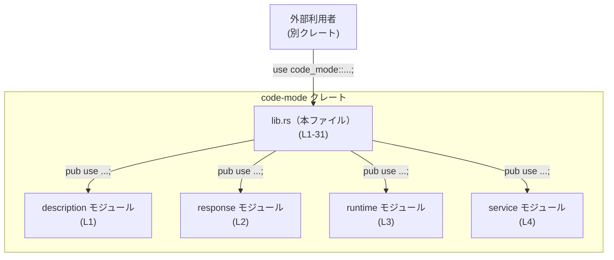

# code-mode/src/lib.rs

## 0. ざっくり一言

`code-mode/src/lib.rs` は、`code-mode` クレート全体の **公開 API の入口** を定義するファイルで、内部モジュール（`description`, `response`, `runtime`, `service`）のシンボルを再エクスポートし、ツール名に関する定数を公開する役割を持ちます（`code-mode/src/lib.rs:L1-4, L6-31`）。

---

## 1. このモジュールの役割

### 1.1 概要

- このモジュールは、`description`, `response`, `runtime`, `service` の 4 つの内部モジュールを宣言します（`code-mode/src/lib.rs:L1-4`）。
- それらのモジュールが持つ型・関数・定数を、`pub use` によってクレートルートから利用できるように再エクスポートします（`code-mode/src/lib.rs:L6-28`）。
- さらに、ツール名 `"exec"` と `"wait"` を表す 2 つの公開定数 `PUBLIC_TOOL_NAME`, `WAIT_TOOL_NAME` を定義します（`code-mode/src/lib.rs:L30-31`）。

### 1.2 アーキテクチャ内での位置づけ

このファイルはクレートのルートとして、外部利用者と内部モジュールの間の **名前空間のハブ** になっています。



- 外部クレートは `code_mode::CodeModeService` などの形でこのファイル経由で API にアクセスすると想定されます（名前からの推測であり、このチャンクだけでは断定できません）。
- 実行ロジック（リクエスト処理・エラーハンドリング・並行処理など）は、`description`, `response`, `runtime`, `service` 各モジュール側に存在し、このファイルには含まれていません（`code-mode/src/lib.rs` に関数定義がないことから）。

### 1.3 設計上のポイント

コードから読み取れる範囲での特徴は次のとおりです。

- **API 集約の方針**  
  - 内部モジュールに分割しつつ、クレートの利用者にはクレートルートからまとめて提供する構成になっています（`pub use` の多用、`code-mode/src/lib.rs:L6-28`）。
- **状態を持たないファイル**  
  - このファイル自身はグローバル状態や実行ロジックを持たず、モジュール宣言・再エクスポート・定数定義のみです（`code-mode/src/lib.rs:L1-31`）。
- **エラーハンドリング・並行性について**  
  - このファイルには関数・メソッドが存在しないため、エラーハンドリング戦略やスレッド／非同期処理の方針は読み取れません。これらは下位モジュール側にあると考えられます（事実: このチャンクに処理コードが存在しない）。
- **契約としてのツール名**  
  - `"exec"` / `"wait"` という文字列を公開定数として固定しており、外部との連携プロトコル上の「名前の契約」である可能性が高いです（`code-mode/src/lib.rs:L30-31`）。

---

## 2. 主要な機能一覧

このファイルから直接読み取れる「機能」は、あくまで API の公開と名前付けに関するものです。実処理の詳細は各モジュール側にあります。

- 内部モジュールの公開:
  - `description`, `response`, `runtime`, `service` モジュールをクレート内に宣言（`code-mode/src/lib.rs:L1-4`）。
- ツール記述関連 API の公開（推定）:
  - `CODE_MODE_PRAGMA_PREFIX`, `CodeModeToolKind`, `ToolDefinition`, `ToolNamespaceDescription` など、ツール定義や名前空間に関するシンボルを再エクスポート（`code-mode/src/lib.rs:L6-9`）。
- ツール説明生成・解析ユーティリティの公開（推定）:
  - `augment_tool_definition`, `build_exec_tool_description`, `build_wait_tool_description`, `is_code_mode_nested_tool`, `normalize_code_mode_identifier`, `parse_exec_source`, `render_code_mode_sample`, `render_json_schema_to_typescript` などのシンボルを再エクスポート（`code-mode/src/lib.rs:L10-17`）。
- 実行レスポンス関連型の公開（推定）:
  - `FunctionCallOutputContentItem`, `ImageDetail` など、レスポンス内容を表すと考えられるシンボルを再エクスポート（`code-mode/src/lib.rs:L18-19`）。
- 実行ランタイム関連 API の公開（推定）:
  - `DEFAULT_EXEC_YIELD_TIME_MS`, `DEFAULT_MAX_OUTPUT_TOKENS_PER_EXEC_CALL`, `DEFAULT_WAIT_YIELD_TIME_MS`, `ExecuteRequest`, `RuntimeResponse`, `WaitRequest` などを再エクスポート（`code-mode/src/lib.rs:L20-25`）。
- コアサービスの公開（推定）:
  - `CodeModeService`, `CodeModeTurnHost`, `CodeModeTurnWorker` を再エクスポート（`code-mode/src/lib.rs:L26-28`）。
- 公開ツール名定数:
  - `PUBLIC_TOOL_NAME` = `"exec"`, `WAIT_TOOL_NAME` = `"wait"` を定義（`code-mode/src/lib.rs:L30-31`）。

※「〜と考えられる」「〜と推定」と書いている箇所は、名称からの推測であり、このチャンクだけでは型や用途を断定できません。

---

## 3. 公開 API と詳細解説

### 3.1 型・シンボル一覧（再エクスポート含む）

この表は、クレートルートから見える主要シンボルの一覧です。  
種別は命名規約に基づく推定であり、定義は各モジュール側にあります。

| 名前 | 種別（推定） | 定義元モジュール | 役割 / 用途（推定を含む） | 根拠 |
|------|--------------|------------------|---------------------------|------|
| `CODE_MODE_PRAGMA_PREFIX` | 定数（推定） | `description` | コードモード用のプラグマに付与する接頭辞と推定 | `code-mode/src/lib.rs:L6` |
| `CodeModeToolKind` | 型（enum/struct 推定） | `description` | コードモードのツール種別を表すと推定 | `code-mode/src/lib.rs:L7` |
| `ToolDefinition` | 型（struct 推定） | `description` | ツール定義（メタ情報）を表すと推定 | `code-mode/src/lib.rs:L8` |
| `ToolNamespaceDescription` | 型（struct 推定） | `description` | ツールの名前空間に関する説明を保持すると推定 | `code-mode/src/lib.rs:L9` |
| `augment_tool_definition` | シンボル（関数/マクロ推定） | `description` | 既存ツール定義の拡張処理と推定 | `code-mode/src/lib.rs:L10` |
| `build_exec_tool_description` | シンボル（関数/マクロ推定） | `description` | `"exec"` ツールの説明情報生成と推定 | `code-mode/src/lib.rs:L11` |
| `build_wait_tool_description` | シンボル（関数/マクロ推定） | `description` | `"wait"` ツールの説明情報生成と推定 | `code-mode/src/lib.rs:L12` |
| `is_code_mode_nested_tool` | シンボル（関数/マクロ推定） | `description` | ネストしたツールかどうかを判定すると推定 | `code-mode/src/lib.rs:L13` |
| `normalize_code_mode_identifier` | シンボル（関数/マクロ推定） | `description` | ツール識別子の正規化処理と推定 | `code-mode/src/lib.rs:L14` |
| `parse_exec_source` | シンボル（関数/マクロ推定） | `description` | 実行対象ソースのパース処理と推定 | `code-mode/src/lib.rs:L15` |
| `render_code_mode_sample` | シンボル（関数/マクロ推定） | `description` | コードモードのサンプル生成と推定 | `code-mode/src/lib.rs:L16` |
| `render_json_schema_to_typescript` | シンボル（関数/マクロ推定） | `description` | JSON Schema から TypeScript 型定義を生成すると推定 | `code-mode/src/lib.rs:L17` |
| `FunctionCallOutputContentItem` | 型（struct/enmu 推定） | `response` | 関数呼び出しの出力アイテムを表すと推定 | `code-mode/src/lib.rs:L18` |
| `ImageDetail` | 型（struct 推定） | `response` | 画像出力の詳細情報を保持すると推定 | `code-mode/src/lib.rs:L19` |
| `DEFAULT_EXEC_YIELD_TIME_MS` | 定数（推定） | `runtime` | `exec` 実行ループのデフォルトの yield 間隔（ms 単位）と推定 | `code-mode/src/lib.rs:L20` |
| `DEFAULT_MAX_OUTPUT_TOKENS_PER_EXEC_CALL` | 定数（推定） | `runtime` | 実行 1 回あたりの出力トークン上限と推定 | `code-mode/src/lib.rs:L21` |
| `DEFAULT_WAIT_YIELD_TIME_MS` | 定数（推定） | `runtime` | `wait` 操作のデフォルトのポーリング間隔と推定 | `code-mode/src/lib.rs:L22` |
| `ExecuteRequest` | 型（struct 推定） | `runtime` | 実行リクエストを表すと推定 | `code-mode/src/lib.rs:L23` |
| `RuntimeResponse` | 型（struct/enum 推定） | `runtime` | ランタイムからの応答を表すと推定 | `code-mode/src/lib.rs:L24` |
| `WaitRequest` | 型（struct 推定） | `runtime` | 実行結果を待つためのリクエストと推定 | `code-mode/src/lib.rs:L25` |
| `CodeModeService` | 型（struct 推定） | `service` | コードモード機能を提供するサービス本体と推定 | `code-mode/src/lib.rs:L26` |
| `CodeModeTurnHost` | 型（struct 推定） | `service` | ある種の「ホスト側ターン」を扱うコンポーネントと推定 | `code-mode/src/lib.rs:L27` |
| `CodeModeTurnWorker` | 型（struct 推定） | `service` | 「ワーカー側ターン」を扱うコンポーネントと推定 | `code-mode/src/lib.rs:L28` |
| `PUBLIC_TOOL_NAME` | 定数 `&'static str` | クレートルート | 公開ツール名 `"exec"`（固定文字列） | `code-mode/src/lib.rs:L30` |
| `WAIT_TOOL_NAME` | 定数 `&'static str` | クレートルート | `"wait"` ツール名（固定文字列） | `code-mode/src/lib.rs:L31` |

> 注: 「種別（推定）」は Rust の命名慣習に基づくものであり、実際に struct / enum / 関数であるかどうかは、このチャンクだけでは確定できません。

### 3.2 関数詳細（このチャンクでの制約）

このファイルには関数定義が含まれておらず、関数と思われるシンボル（`augment_tool_definition` など）はすべて **別モジュールからの再エクスポート** です（`code-mode/src/lib.rs:L10-17`）。

したがって、

- シグネチャ（引数の型・戻り値の型）
- 内部処理
- エラー条件やパニック条件
- 非同期／同期かどうか

は、このチャンクからは読み取れず、詳細な「関数ごとのテンプレート解説」は実施できません。

参考までに、名前と「このチャンクで分かること／分からないこと」を整理します。

#### `augment_tool_definition`（種別不明）

- **このチャンクから分かること**
  - `description` モジュールから再エクスポートされている公開シンボルである（`code-mode/src/lib.rs:L10`）。
- **分からないこと**
  - 引数・戻り値・処理内容・エラー条件・同期/非同期など、具体的な仕様は不明です。

同様に、以下のシンボルについても同種の制約があります。

- `build_exec_tool_description`（`code-mode/src/lib.rs:L11`）
- `build_wait_tool_description`（`code-mode/src/lib.rs:L12`）
- `is_code_mode_nested_tool`（`code-mode/src/lib.rs:L13`）
- `normalize_code_mode_identifier`（`code-mode/src/lib.rs:L14`）
- `parse_exec_source`（`code-mode/src/lib.rs:L15`）
- `render_code_mode_sample`（`code-mode/src/lib.rs:L16`）
- `render_json_schema_to_typescript`（`code-mode/src/lib.rs:L17`）

### 3.3 その他の関数

- このファイル内には `fn` による関数定義が存在しないため、「補助関数」「ラッパー関数」は現れません（`code-mode/src/lib.rs:L1-31`）。
- 関数的な処理はすべて、再エクスポート元のモジュールに定義されています。

---

## 4. データフロー

このファイル自身に実行ロジックはなく、**データの流れ** というよりは **API 名の流れ（名前解決の経路）** を定義しています。

ここでは、「外部利用者が `CodeModeService` と `ExecuteRequest` を利用する」という典型的なアクセス経路を、名前解決の観点で示します。

```mermaid
sequenceDiagram
    participant Ext as 外部クレート\n(利用者)
    participant Lib as code_mode クレートルート\nlib.rs (L1-31)
    participant Svc as service モジュール\n(L4, L26-28)
    participant Run as runtime モジュール\n(L3, L20-25)

    Ext->>Lib: use code_mode::CodeModeService;\nuse code_mode::ExecuteRequest;
    Note right of Lib: lib.rs が<br/>service::CodeModeService<br/>runtime::ExecuteRequest を<br/>pub use している (L23, L26)

    Lib-->>Ext: シンボル名の公開\n(CodeModeService, ExecuteRequest)
    Ext->>Svc: 実際の型/メソッドを利用\n(コンパイル時に解決)
    Ext->>Run: 実行リクエスト型などを利用
```

- この図は **コンパイル時のシンボル解決の流れ** を表しており、実行時の関数呼び出しやメッセージフローはこのチャンクからは分かりません。
- 並行性や非同期処理に関するデータフローは、`runtime` や `service` モジュール側のコードを確認する必要があります。

---

## 5. 使い方（How to Use）

### 5.1 基本的な使用方法（推定）

クレートルートが多くのシンボルを再エクスポートしているため、利用者は通常、`code_mode::...` から直接型や定数をインポートすると想定されます（`code-mode/src/lib.rs:L6-28, L30-31`）。

以下は、クレート名を `code_mode` と仮定した場合のインポート例です（クレート名は Cargo.toml に依存し、このチャンクからは確定できません）。

```rust
// 仮想的な使用例（クレート名を code_mode と仮定）

// コアサービスとリクエスト/レスポンス型をインポート
use code_mode::{
    CodeModeService,       // service モジュール由来と推定 (L26)
    ExecuteRequest,        // runtime モジュール由来と推定 (L23)
    RuntimeResponse,       // runtime モジュール由来と推定 (L24)
    PUBLIC_TOOL_NAME,      // "exec" 定数 (L30)
    WAIT_TOOL_NAME,        // "wait" 定数 (L31)
};

fn main() {
    // ここで CodeModeService の具体的な new / メソッドは
    // このチャンクからは分からないため、あくまでイメージのみ。
    // let service = CodeModeService::new(...);
    // let request = ExecuteRequest { ... };
    // let response: RuntimeResponse = service.execute(request);

    println!("public tool: {PUBLIC_TOOL_NAME}, wait tool: {WAIT_TOOL_NAME}");
}
```

- 上記コードは、「クレートルートから直接インポートできる」という点のみが、このチャンクから確実に言える内容です。
- `CodeModeService` のコンストラクタやメソッド名は、`service` モジュール側を確認する必要があります。

### 5.2 よくある使用パターン（名前からの推定）

**注意**: ここで挙げるパターンはシンボル名からの推測を含みます。実際の API は定義元モジュールで要確認です。

1. **実行ツールと待機ツールの併用**

   - `PUBLIC_TOOL_NAME` = `"exec"` と `WAIT_TOOL_NAME` = `"wait"` を用いて、ツール呼び出しの識別子として利用する（`code-mode/src/lib.rs:L30-31`）。
   - `ExecuteRequest` と `WaitRequest`（`code-mode/src/lib.rs:L23, L25`）を組み合わせて、「実行 → 完了待ち」の 2 段階プロトコルを構成している可能性があります。

2. **ツール定義の動的生成・変換**

   - `ToolDefinition`, `ToolNamespaceDescription`（`code-mode/src/lib.rs:L8-9`）と、
     `augment_tool_definition`, `build_exec_tool_description`,
     `build_wait_tool_description` など（`code-mode/src/lib.rs:L10-12`）を組み合わせて、
     ツール定義の生成・加工を行うパターンが想定されます。

### 5.3 よくある間違い（起こり得る注意点）

このファイルの構造から想定される誤用と、その回避策を示します。

```rust
// （誤りの可能性がある）ツール名のべた書き
let tool_name = "exec";  // 文字列リテラルを直接使用

// （より安全な例）公開定数を利用して一貫性を保つ
use code_mode::PUBLIC_TOOL_NAME;

let tool_name = PUBLIC_TOOL_NAME; // 将来の変更にも追従しやすい
```

- `"exec"` / `"wait"` を文字列リテラルで散在させると、将来的にツール名を変更したい場合に漏れが発生するリスクがあります。
- `PUBLIC_TOOL_NAME` / `WAIT_TOOL_NAME` を利用することで、ツール名の「契約」を一箇所に集約できます（`code-mode/src/lib.rs:L30-31`）。

### 5.4 使用上の注意点（まとめ）

- **API 入口としての役割**  
  - 実際のロジックは `description`, `response`, `runtime`, `service` 各モジュールにあります。このファイルは「どこに何があるか」を外部に見せる入口のみです（`code-mode/src/lib.rs:L1-4, L6-28`）。
- **名前変更の影響**  
  - 再エクスポートするシンボル名（特に `CodeModeService`, `ExecuteRequest` など）やツール名定数を変更すると、外部クレートのビルドが壊れる可能性があります。公開 API としての後方互換性に注意が必要です。
- **安全性・エラーハンドリング・並行性**  
  - このファイルには処理コードがないため、メモリ安全性やエラー/並行性に関する問題は直接は発生しません。
  - 実際の安全性・エラー処理・非同期処理の挙動は、`runtime` や `service` モジュール側の実装に依存します。

---

## 6. 変更の仕方（How to Modify）

### 6.1 新しい機能を追加する場合

**前提**: このファイルは「公開 API のまとめ役」であるため、機能追加は通常、まず下位モジュールで行われ、その後ここで再エクスポートする形になると考えられます。

1. **適切なモジュールを選ぶ**
   - ツール定義関連であれば `description`、実行フロー関連であれば `runtime` または `service` など、機能に応じて追加先モジュールを選びます（`code-mode/src/lib.rs:L1-4`）。
2. **モジュール側に型・関数を定義**
   - 実際のロジックは `src/description.rs` などのモジュールファイル側に実装します（パスは `mod` 宣言からの推定であり、このチャンクには定義ファイルは現れません）。
3. **クレートルートで再エクスポート**
   - 外部に公開したい場合は、本ファイルで `pub use module_name::NewSymbol;` を追加します。
   - 例: `pub use runtime::NewRuntimeOption;`
4. **公開範囲の確認**
   - 公開 API として安定させるかどうか、`pub` のレベルで慎重に検討する必要があります。

### 6.2 既存の機能を変更する場合

このファイルを変更する場合の注意点です。

- **再エクスポートの削除・リネーム**
  - `pub use` を削除したり、対象シンボルを別名で再エクスポートする場合、外部利用者がコンパイルエラーになる可能性があります（`code-mode/src/lib.rs:L6-28`）。
- **ツール名定数の変更**
  - `PUBLIC_TOOL_NAME`, `WAIT_TOOL_NAME` の値を変更すると、外部システムとの連携（例えばプロトコル上のツール名一致）に影響する可能性があります（`code-mode/src/lib.rs:L30-31`）。
- **影響範囲の確認**
  - 変更前に、クレート内外で当該シンボルがどのように使われているか（特にテキストベースのプロトコルや設定ファイルなども含めて）を確認する必要があります。
- **テスト**
  - このファイル内にはテストコードはありませんが、API 変更後は下位モジュール側のテスト、もしくはクレート全体の統合テストの更新が必要になります（このチャンク内にテストの有無は記載されていません）。

---

## 7. 関連ファイル

このファイルから直接参照されているモジュール・ファイルを整理します。

| パス（推定） | 役割 / 関係 | 根拠 |
|--------------|------------|------|
| `src/description.rs` または `src/description/mod.rs` | `CodeModeToolKind`, `ToolDefinition` など、ツール定義やコードモードの説明関連シンボルを定義するモジュールと推定 | `mod description;` および `pub use description::...`（`code-mode/src/lib.rs:L1, L6-17`） |
| `src/response.rs` または `src/response/mod.rs` | `FunctionCallOutputContentItem`, `ImageDetail` など、レスポンス表現関連シンボルを定義すると推定 | `mod response;` および `pub use response::...`（`code-mode/src/lib.rs:L2, L18-19`） |
| `src/runtime.rs` または `src/runtime/mod.rs` | `ExecuteRequest`, `RuntimeResponse`, デフォルトタイミング定数など、実行ランタイム関連の型・値を持つと推定 | `mod runtime;` および `pub use runtime::...`（`code-mode/src/lib.rs:L3, L20-25`） |
| `src/service.rs` または `src/service/mod.rs` | `CodeModeService`, `CodeModeTurnHost`, `CodeModeTurnWorker` など、サービス・高レベル API を提供すると推定 | `mod service;` および `pub use service::...`（`code-mode/src/lib.rs:L4, L26-28`） |

> 注: 各モジュールの実際のファイル名 (`.rs` / `mod.rs`) はこのチャンクには明示されていませんが、Rust の一般的なモジュール解決規則からの推定です。実際の構成はリポジトリ全体を確認する必要があります。

---

### Bugs / Security / Edge cases に関する補足（このファイルに限定）

- **バグの可能性**
  - このファイルは宣言と再エクスポート、単純な文字列定数のみで構成されており、ロジック上のバグが入り込む余地は比較的少ないです（`code-mode/src/lib.rs:L1-31`）。
- **セキュリティ**
  - 入出力処理やパース処理は含まれていないため、このファイル単体でのセキュリティリスクはほぼありません。
  - 実際のセキュリティ特性は `description` や `runtime` などの実装に依存します。
- **エッジケース / 契約**
  - `PUBLIC_TOOL_NAME` / `WAIT_TOOL_NAME` の値が外部システムの期待とずれると、ツール呼び出し全体が機能しなくなるため、「外部との契約」として扱う必要があります（`code-mode/src/lib.rs:L30-31`）。
