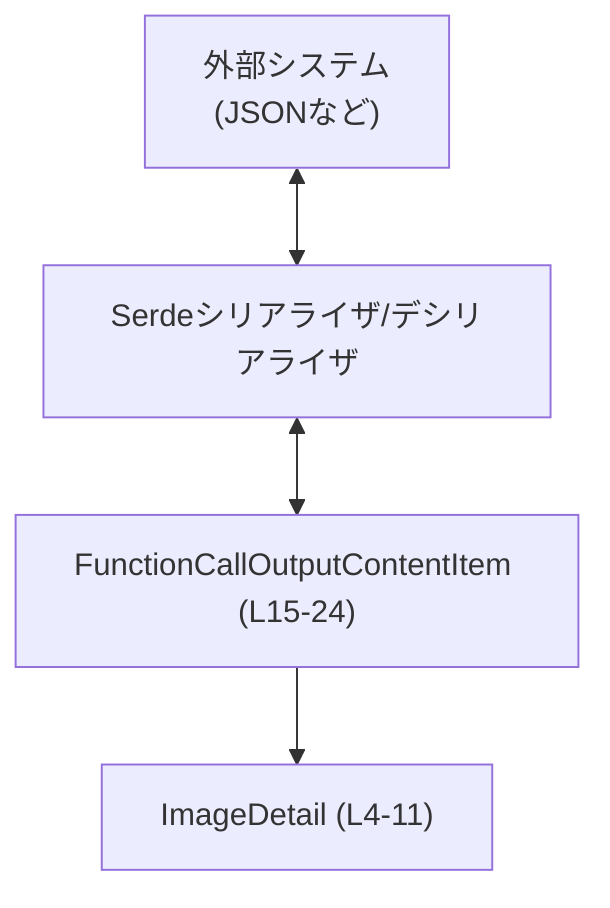
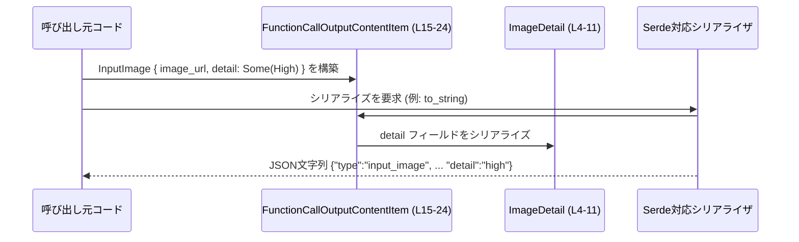
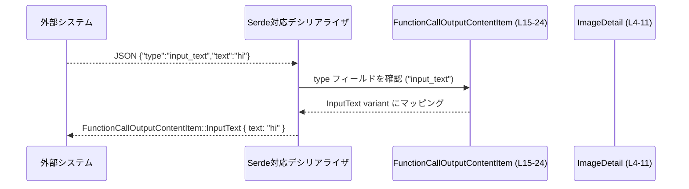

# code-mode/src/response.rs コード解説

## 0. ざっくり一言

- 関数呼び出しの「出力コンテンツ」を表現するための列挙体を定義し、テキストと画像（＋画像詳細）の情報を Serde でシリアライズ／デシリアライズできるようにするモジュールです（`code-mode/src/response.rs:L4-24`）。

---

## 1. このモジュールの役割

### 1.1 概要

- このモジュールは、関数呼び出しの結果として返すコンテンツを型安全に表現するためのデータ型を提供します。
- 具体的には、画像の詳細レベルを表す `ImageDetail` と、テキスト／画像の 2 種類の出力をひとまとめに表す `FunctionCallOutputContentItem` を定義しています（`code-mode/src/response.rs:L4-24`）。
- どちらの型も `serde::Serialize` / `serde::Deserialize` を実装しており、外部とのデータ交換（JSON など）を想定した設計になっています（`code-mode/src/response.rs:L1-2, L4-5, L13-14`）。

### 1.2 アーキテクチャ内での位置づけ

コードから分かる範囲では、このモジュールは「データモデル層」に相当します。

- 外部との I/O（JSON など）を行う層からは、`FunctionCallOutputContentItem` を通じてテキスト／画像コンテンツが受け渡されると考えられます（Serde 属性の存在からの推測であり、実際の呼び出し元はこのチャンクからは不明です）。
- `ImageDetail` は `FunctionCallOutputContentItem::InputImage` の補助的な情報としてのみ使われています（`code-mode/src/response.rs:L15-23`）。



- この図は、外部システムと本モジュールの型の間で、Serde を介してデータがやりとりされる関係を示しています。
- 具体的にどのモジュールが `FunctionCallOutputContentItem` を生成／処理しているかは、このファイルからは分かりません。

### 1.3 設計上のポイント

- **タグ付き enum によるコンテンツ種別の表現**  
  - テキストと画像の 2 種類のコンテンツを、1 つの enum `FunctionCallOutputContentItem` で表現しています（`code-mode/src/response.rs:L15-23`）。
  - Serde の `#[serde(tag = "type", rename_all = "snake_case")]` により、JSON 上では `"type"` フィールドで種別を判別できるようになっています（`code-mode/src/response.rs:L14`）。

- **画像詳細レベルの明示的な列挙**  
  - `ImageDetail` は `"auto" / "low" / "high" / "original"` の 4 通りの詳細レベルを列挙しています（`code-mode/src/response.rs:L6-10`）。
  - Serde の `rename_all = "lowercase"` により、外部表現は常に小文字になります（`code-mode/src/response.rs:L5`）。

- **オプションフィールドとデフォルト**  
  - 画像コンテンツの `detail` は `Option<ImageDetail>` であり、存在しない場合は `None` になります（`code-mode/src/response.rs:L21-22`）。
  - `#[serde(default, skip_serializing_if = "Option::is_none")]` によって、JSON では値が `None` のときフィールド自体が省略され、デシリアライズ時には省略された場合でも `None` が自動で補われます（`code-mode/src/response.rs:L21-22`）。

- **スレッド安全性への配慮（Rust 固有）**  
  - いずれの型も `String` と `Option<ImageDetail>` をフィールドに持つのみで、`unsafe` なコードや内部可変性（`Cell` など）は使用していません（`code-mode/src/response.rs:L16-22`）。
  - そのため、標準ライブラリの性質から、この型は他スレッドへ安全に送信可能（`Send`）かつ共有可能（`Sync`）なデータとして扱える設計になっています。

---

## 2. 主要な機能一覧

このモジュールが提供する機能を、データ型観点で整理します。

- `ImageDetail`: 画像に対して要求する詳細レベル（自動／低／高／元画像）を表現する列挙体。
- `FunctionCallOutputContentItem`: 関数呼び出しの出力コンテンツを、テキストまたは画像として表現する列挙体。
- Serde ベースのシリアライズ／デシリアライズ:
  - `ImageDetail` の小文字文字列表現（例: `"high"`）。
  - `FunctionCallOutputContentItem` のタグ付き JSON 表現（`"type": "input_text"` / `"input_image"` など）。

---

## 3. 公開 API と詳細解説

### 3.1 型一覧（構造体・列挙体など）

#### コンポーネントインベントリー

| 名前 | 種別 | 行範囲 | 役割 / 用途 |
|------|------|--------|-------------|
| `ImageDetail` | 列挙体 | `code-mode/src/response.rs:L4-11` | 画像の詳細レベル（自動・低・高・元画像）を表す。Serde を通じて小文字文字列として外部表現される。 |
| `FunctionCallOutputContentItem` | 列挙体 | `code-mode/src/response.rs:L13-24` | 関数呼び出しの出力コンテンツを、「テキスト」か「画像」の 2 種類の variant で表現する。Serde のタグ付き enum としてシリアライズされる。 |

#### `ImageDetail`

```rust
#[derive(Debug, Clone, Copy, Serialize, Deserialize, PartialEq, Eq)] // L4
#[serde(rename_all = "lowercase")]                                 // L5
pub enum ImageDetail {                                              // L6
    Auto,                                                           // L7
    Low,                                                            // L8
    High,                                                           // L9
    Original,                                                       // L10
}                                                                   // L11
```

- **役割**  
  画像生成や変換時の「どの程度の詳細度の画像を扱うか」を指定するための列挙体です（`code-mode/src/response.rs:L6-10`）。

- **Serde による外部表現**  
  - `#[serde(rename_all = "lowercase")]` により、各 variant はシリアライズ時に小文字になります（`code-mode/src/response.rs:L5`）。
    - `ImageDetail::Auto` → `"auto"`
    - `ImageDetail::Low` → `"low"`
    - `ImageDetail::High` → `"high"`
    - `ImageDetail::Original` → `"original"`
  - デシリアライズ時も同様に、これらの小文字文字列のみが有効な入力になります。

- **派生トレイト（derive）の意味**（`code-mode/src/response.rs:L4`）
  - `Debug`: `{:?}` でデバッグ出力可能。ログやトレースに利用しやすくなります。
  - `Clone` / `Copy`: 値コピーが安価な enum であり、所有権を意識せず代入・引数渡しができます。
  - `Serialize` / `Deserialize`: Serde 対応により、JSON 等へ自動変換可能。
  - `PartialEq` / `Eq`: 比較演算（`==`）が可能で、条件分岐やテストで使いやすくなります。

#### `FunctionCallOutputContentItem`

```rust
#[derive(Debug, Clone, Serialize, Deserialize, PartialEq)]           // L13
#[serde(tag = "type", rename_all = "snake_case")]                   // L14
pub enum FunctionCallOutputContentItem {                            // L15
    InputText {                                                     // L16
        text: String,                                               // L17
    },                                                              // L18
    InputImage {                                                    // L19
        image_url: String,                                          // L20
        #[serde(default, skip_serializing_if = "Option::is_none")]  // L21
        detail: Option<ImageDetail>,                                // L22
    },                                                              // L23
}                                                                   // L24
```

- **役割**  
  関数呼び出しの結果として得られる「出力コンテンツ」を、テキストまたは画像のどちらかとして表現する enum です（`code-mode/src/response.rs:L15-23`）。

- **Variant とフィールド**
  - `InputText { text: String }`（`code-mode/src/response.rs:L16-18`）  
    - テキストコンテンツを表します。  
    - `text`: 実際の文字列データ。
  - `InputImage { image_url: String, detail: Option<ImageDetail> }`（`code-mode/src/response.rs:L19-22`）  
    - 画像コンテンツを表します。  
    - `image_url`: 画像リソースの URL。  
    - `detail`: 画像の詳細レベル。`None` の場合は指定なし。

- **Serde による外部表現**（`code-mode/src/response.rs:L14, L21-22`）
  - `#[serde(tag = "type", rename_all = "snake_case")]` により、「内部タグ付き enum」としてシリアライズされます。
    - `InputText` → `"type": "input_text"`  
      JSON 例:

      ```json
      {
        "type": "input_text",
        "text": "こんにちは"
      }
      ```

    - `InputImage` → `"type": "input_image"`  
      JSON 例 (`detail` あり):

      ```json
      {
        "type": "input_image",
        "image_url": "https://example.com/image.png",
        "detail": "high"
      }
      ```

  - `detail` フィールドには
    - `#[serde(default)]`: JSON から `detail` フィールドが欠けていてもデシリアライズ可能で、その場合は `None` が入ります。
    - `skip_serializing_if = "Option::is_none"`: 値が `None` の場合、シリアライズ時に `detail` フィールド自体を出力しません。
      - したがって、`detail` は「省略 ≒ None」という挙動になります。

- **安全性・並行性（Rust 特有）**
  - フィールドは `String` と `Option<ImageDetail>` のみであり、いずれもスレッド安全な型です（`code-mode/src/response.rs:L17, L20-22`）。
  - このため `FunctionCallOutputContentItem` 自体も `Send` / `Sync` なデータとして扱え、スレッド間で送受信してもメモリ安全性は保たれます。
  - `unsafe` ブロックは存在せず、すべて安全な Rust コードで構成されています（`code-mode/src/response.rs:L1-24`）。

### 3.2 関数詳細（最大 7 件）

- このファイルには関数定義（`fn`）は存在しません（`code-mode/src/response.rs:L1-24`）。
- シリアライズ／デシリアライズのロジックは、すべて Serde の derive と属性により自動生成されるため、明示的な関数としては表れていません。

### 3.3 その他の関数

- 補助関数・ラッパー関数なども、このチャンクには定義されていません。

---

## 4. データフロー

ここでは、`FunctionCallOutputContentItem` が JSON として外部とやりとりされる典型的な流れを説明します。

### 4.1 シリアライズの流れ（例）



- この図は、「呼び出し元コードが `InputImage` variant を構築し、Serde 対応シリアライザ（例: `serde_json`）を通じて JSON 文字列に変換する」流れを示します。
- 具体的にどのシリアライザ（`serde_json`, `serde_yaml` など）が使われるかは、このファイルからは分かりません。

### 4.2 デシリアライズの流れ（例）



- `type` フィールドの文字列が enum の variant 名（snake_case に変換されたもの）に対応していない場合、Serde はデシリアライズエラーを返します。
- 同様に、`detail` が `"high"` などの有効な小文字文字列以外の場合もエラーになります（`code-mode/src/response.rs:L5, L21-22`）。

---

## 5. 使い方（How to Use）

### 5.1 基本的な使用方法

ここでは、`serde_json` を例に、テキスト／画像の両 variant をシリアライズ／デシリアライズするコード例を示します。  
※ `serde_json` の利用自体はこのファイルには書かれていませんが、一般的な Serde 利用例として示します。

```rust
use serde_json;                                                // JSON シリアライザ／デシリアライザ
use code_mode::response::{                                     // 本モジュールの型を読み込む（実際のパスは仮）
    FunctionCallOutputContentItem, ImageDetail,
};

fn main() -> Result<(), Box<dyn std::error::Error>> {
    // 1. テキストコンテンツの例 ------------------------------------------
    let text_item = FunctionCallOutputContentItem::InputText {  // InputText variant を構築
        text: "こんにちは".to_string(),                          // text フィールドに String を入れる
    };

    let json = serde_json::to_string(&text_item)?;              // Serde 経由で JSON 文字列に変換
    println!("Text JSON: {}", json);                            // 例: {"type":"input_text","text":"こんにちは"}

    let parsed: FunctionCallOutputContentItem =
        serde_json::from_str(&json)?;                           // JSON から再度デシリアライズ
    assert_eq!(text_item, parsed);                              // PartialEq 派生により比較可能

    // 2. 画像コンテンツの例 --------------------------------------------
    let image_item = FunctionCallOutputContentItem::InputImage {// InputImage variant を構築
        image_url: "https://example.com/image.png".to_string(), // image_url フィールド
        detail: Some(ImageDetail::High),                        // detail に ImageDetail::High を設定
    };

    let json = serde_json::to_string(&image_item)?;             // JSON に変換
    println!("Image JSON: {}", json);                           // 例: {"type":"input_image","image_url":"...","detail":"high"}

    let parsed: FunctionCallOutputContentItem =
        serde_json::from_str(&json)?;                           // JSON から再度デシリアライズ
    assert_eq!(image_item, parsed);                             // 等価性の検証

    Ok(())
}
```

- このコードにより、`FunctionCallOutputContentItem` が Serde で正しく往復変換できることを確認できます。

### 5.2 よくある使用パターン

1. **画像詳細を省略する（デフォルト None）**

```rust
let image_item = FunctionCallOutputContentItem::InputImage {
    image_url: "https://example.com/image.png".to_string(),
    detail: None,                                    // detail を明示的に None にする
};

let json = serde_json::to_string(&image_item)?;      // detail フィールドは JSON から省略される
// 例: {"type":"input_image","image_url":"https://example.com/image.png"}
```

- `#[serde(skip_serializing_if = "Option::is_none")]` のため、`detail` が `None` の場合フィールドが出力されません（`code-mode/src/response.rs:L21-22`）。

1. **外部入力からのデシリアライズ**

外部から JSON を受け取り、どの variant かを判定して処理する例です。

```rust
let json = r#"
{
  "type": "input_text",
  "text": "hello"
}
"#;

let item: FunctionCallOutputContentItem = serde_json::from_str(json)?; // デシリアライズ

match item {
    FunctionCallOutputContentItem::InputText { text } => {
        println!("テキスト: {}", text);
    }
    FunctionCallOutputContentItem::InputImage { image_url, detail } => {
        println!("画像 URL: {}", image_url);
        println!("詳細: {:?}", detail); // ImageDetail は Debug 派生により表示可能
    }
}
```

- `match` で variant ごとに処理を分けるのが典型的なパターンです。

### 5.3 よくある間違い

1. **`type` フィールドの値が誤っている JSON**

```json
{
  "type": "text",          // 誤り: 正しくは "input_text"
  "text": "hello"
}
```

- `rename_all = "snake_case"` によって、期待される値は `"input_text"` / `"input_image"` です（`code-mode/src/response.rs:L14`）。
- `"text"` や `"image"` などの値は variant 名と一致しないため、デシリアライズ時にエラーになります。

1. **`detail` の大文字表記**

```json
{
  "type": "input_image",
  "image_url": "https://example.com/image.png",
  "detail": "High"     // 誤り: 正しくは "high"
}
```

- `ImageDetail` は `rename_all = "lowercase"` のため、小文字文字列のみが有効です（`code-mode/src/response.rs:L5, L7-10`）。
- `"High"` など大文字を含む値はデシリアライズに失敗します。

1. **必須フィールドの欠如**

```json
{
  "type": "input_text"
  // "text" がない
}
```

- `InputText` variant の `text` フィールドには `default` が付与されていないため（`code-mode/src/response.rs:L16-18`）、この JSON はデシリアライズ時にエラーになります。

### 5.4 使用上の注意点（まとめ）

- **前提条件**
  - JSON を自前で組み立てる場合は、`type` フィールドと `detail` フィールドの文字列値が Serde の期待する形式（snake_case / lowercase）に一致している必要があります。
- **エラー条件**
  - `type` が `"input_text"` / `"input_image"` 以外の場合。
  - 各 variant に必要なフィールド（`text`, `image_url`）が欠如している場合。
  - `detail` が `"auto"`, `"low"`, `"high"`, `"original"` 以外の文字列である場合。
- **セキュリティ観点**
  - この型自体は純粋なデータ表現であり、ファイル I/O やネットワークアクセスは行いません。
  - しかし、`image_url` は外部リソースの URL を含むため、実際に利用するコード側では URL 検証や安全な取得処理が必要になります（このファイルからはその実装は分かりません）。
- **並行性**
  - `Clone` 派生により、必要に応じて値を複製してスレッド間で安全に渡すことができます（`code-mode/src/response.rs:L4, L13`）。
  - 内部可変性を持たないため、他スレッドから同一インスタンスを読み取り専用で共有してもデータ競合は発生しません。

---

## 6. 変更の仕方（How to Modify）

### 6.1 新しい機能を追加する場合

1. **新しい画像詳細レベルを追加する**

   - `ImageDetail` に新しい variant を追加します（`code-mode/src/response.rs:L6-10`）。
   - 例: `UltraHigh` を追加すると、外部表現は `"ultrahigh"` になります（`rename_all = "lowercase"` のため、スペースやアンダースコアなしの小文字連結になる点に注意）。
   - 既存クライアントがこの新しい値に対応していない場合、受信側でエラーになる可能性があります。

2. **新しいコンテンツ種別を追加する**

   - `FunctionCallOutputContentItem` に新しい variant を追加します（`code-mode/src/response.rs:L15-23`）。
   - 例: `InputAudio { audio_url: String }` など。
   - Serde の `rename_all = "snake_case"` により、外部表現は `"input_audio"` となります。
   - 既存クライアントがこの `"type": "input_audio"` を知らない場合、デシリアライズに失敗することがあります。

3. **追加時に考慮すべき点**
   - 既存の JSON スキーマとの互換性（クライアント／サーバ双方）。
   - 新しい variant が増えた場合、`match` を使っている呼び出し側コードで網羅性が崩れるため、コンパイラエラーとして現れる可能性があります（これは安全性の面では有利です）。

### 6.2 既存の機能を変更する場合

- **variant 名の変更**
  - `ImageDetail` や `FunctionCallOutputContentItem` の variant 名を変更すると、Serde が生成する外部表現（`"high"` / `"input_text"` など）も変わります（`code-mode/src/response.rs:L5, L14`）。
  - これは外部とのプロトコル破壊につながるため、後方互換性が必要な場合は極めて慎重な対応が必要です。

- **フィールド名の変更**
  - `text` や `image_url` のフィールド名を変更すると、JSON のフィールド名も変わり、既存クライアントが正しくパースできなくなります（`code-mode/src/response.rs:L17, L20`）。

- **`detail` の扱いの変更**
  - `#[serde(default, skip_serializing_if = "Option::is_none")]` を削除すると、
    - `detail` が JSON にない場合にデシリアライズエラーになる、
    - `None` のときも `detail: null` として出力される、
    など挙動が変わります（`code-mode/src/response.rs:L21-22`）。
  - 互換性や API の意図に応じて慎重に検討する必要があります。

- **影響範囲の確認**
  - 変更後は、`FunctionCallOutputContentItem` を使っているすべての箇所（`match` 式、シリアライズ／デシリアライズ）を確認する必要がありますが、それらはこのチャンクには現れていません。
  - テストコード（別ファイルが想定されます）が存在する場合は、 JSON の入力／出力フォーマットが期待どおりかを再確認することが推奨されます。

---

## 7. 関連ファイル

このチャンクから直接参照できるのは、`serde` 関連のシンボルのみです。

| パス / クレート | 役割 / 関係 |
|-----------------|------------|
| `serde::Serialize` / `serde::Deserialize`（`code-mode/src/response.rs:L1-2`） | `ImageDetail` と `FunctionCallOutputContentItem` のシリアライズ／デシリアライズを自動生成するために使用されるトレイト。 |
| その他の自前モジュール | このチャンクには現れず、どのファイルがこれらの型を利用しているかは不明です。 |

- テストコードや、この型を実際に利用するサービス層・API 層のファイルは、このチャンクには含まれていません。そのため、実際のユースケースや呼び出し元は別ファイルを参照する必要があります。
