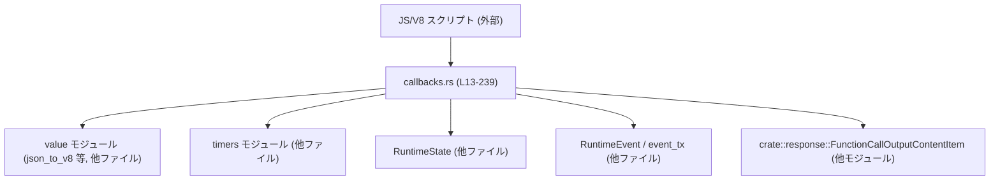
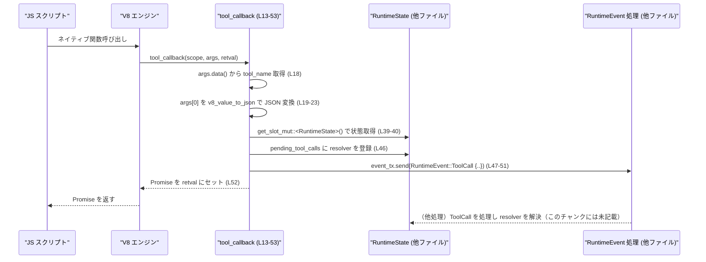

# code-mode/src/runtime/callbacks.rs コード解説

---

## 0. ざっくり一言

`code-mode/src/runtime/callbacks.rs` は、V8 上で動くスクリプトから呼び出される「ネイティブ関数コールバック群」を定義し、  
テキスト・画像・ツール呼び出し・永続ストア・タイマー・終了要求などを Rust 側の `RuntimeState` / `RuntimeEvent` に橋渡しするモジュールです（callbacks.rs:L13-239）。

---

## 1. このモジュールの役割

### 1.1 概要

- このモジュールは **「V8 JavaScript からの各種ネイティブ呼び出しを受け取り、Rust 側のランタイムにイベントとして伝える」** 役割を持ちます。
- 具体的には、以下のようなコールバックを提供します（callbacks.rs:L13-239）。
  - ツール呼び出し（`tool_callback`）
  - テキスト・画像出力（`text_callback`, `image_callback`）
  - 簡易ストアの保存・読み出し（`store_callback`, `load_callback`）
  - 通知（`notify_callback`）
  - タイマー（`set_timeout_callback`, `clear_timeout_callback`）
  - 実行の一時中断・終了（`yield_control_callback`, `exit_callback`）

### 1.2 アーキテクチャ内での位置づけ

このモジュールは、V8 のコールバック層と、Rust 側のランタイム状態 (`RuntimeState`) / イベント (`RuntimeEvent`) をつなぐ薄いアダプタになっています。



- JS 側 → V8 関数コールバック → 本モジュールの `*_callback` 関数が呼ばれます（callbacks.rs:L13-17 など）。
- コールバック内では、`RuntimeState` を `scope.get_slot` / `get_slot_mut` で取得し（callbacks.rs:L39-40, L72, L94, L127 など）、  
  `event_tx.send(RuntimeEvent::...)` を通じてランタイムに通知します（callbacks.rs:L47-51, L73-75, L95, L181-184, L224）。

### 1.3 設計上のポイント

コードから読み取れる特徴は次の通りです。

- **責務の分割**
  - 値変換（JSON との相互変換・テキストシリアライズ・画像正規化）は `value` モジュールに委譲（callbacks.rs:L7-11, L65, L90, L113, L152）。
  - タイマー管理は `timers` モジュールに委譲（callbacks.rs:L6, L194, L210）。
  - このファイルは「V8 引数 → Rust 型 → RuntimeEvent 送信」の粘着ロジックに専念しています。
- **状態管理**
  - `RuntimeState` は V8 のスロットに格納されており、各コールバックから `scope.get_slot(_mut)` で取得しています（callbacks.rs:L39-40, L72, L94, L127, L145, L180, L223, L233）。
  - ツール呼び出しの未解決 Promise は `state.pending_tool_calls` に保持されます（callbacks.rs:L46）。
  - 簡易 KV ストアは `state.stored_values` で管理されています（callbacks.rs:L127-129, L145-147）。
- **エラーハンドリング方針**
  - 引数や変換エラーは原則 `throw_type_error(scope, &error_text)` で JS 側に TypeError を投げて終了します（callbacks.rs:L26-29, L33-35, L40-41, L68-70, L105-110, L116-121, L123-125, L137-142, L152-154, L171-174, L177-178, L195-199, L210-212）。
  - 一部の関数は補助モジュール側のエラー処理に任せており、ここでは単に早期 return しています（`image_callback` の `Err(()) => return` など, callbacks.rs:L90-93）。
- **並行性 / 非同期**
  - ツール呼び出しは V8 の `PromiseResolver` を用いて非同期に扱います（callbacks.rs:L32-38, L52）。
  - Rust 側とは `event_tx` 経由のメッセージ送信で疎結合になっており、スレッド境界やイベントループは他モジュールに委ねられています（callbacks.rs:L45-48, L72-75, L95, L181-184, L224）。
- **安全性**
  - Rust 側では `Result` / `Option` でエラー・存在チェックを行い、パニックを避けるようになっています（例えば `saturating_add` によるオーバーフロー防止, callbacks.rs:L44）。
  - このファイル内に `unsafe` ブロックはありません。

---

## 2. 主要な機能一覧（コンポーネントインベントリー）

### 2.1 関数インベントリー

| 名前 | 種別 | 行番号 | 役割 / 用途 |
|------|------|--------|-------------|
| `tool_callback` | 関数 | callbacks.rs:L13-53 | JS からのツール呼び出しを受け取り、`RuntimeEvent::ToolCall` として送信し、Promise を返します。 |
| `text_callback` | 関数 | callbacks.rs:L55-78 | 任意の値をテキストにシリアライズし、`RuntimeEvent::ContentItem(InputText)` を送信します。 |
| `image_callback` | 関数 | callbacks.rs:L80-98 | JS 値から画像情報を正規化し、`RuntimeEvent::ContentItem` として送信します。 |
| `store_callback` | 関数 | callbacks.rs:L100-130 | キー文字列とシリアライズ可能な値を `RuntimeState.stored_values` に保存します。 |
| `load_callback` | 関数 | callbacks.rs:L132-157 | `stored_values` からキーで値を取り出し、V8 値に変換して返します。 |
| `notify_callback` | 関数 | callbacks.rs:L159-187 | 非空テキストを `RuntimeEvent::Notify` として送信します。 |
| `set_timeout_callback` | 関数 | callbacks.rs:L189-203 | タイマーをスケジュールし、その ID を JS に返します。 |
| `clear_timeout_callback` | 関数 | callbacks.rs:L205-215 | タイマーを解除します。 |
| `yield_control_callback` | 関数 | callbacks.rs:L218-226 | 実行を一時中断したい旨を `RuntimeEvent::YieldRequested` で通知します。 |
| `exit_callback` | 関数 | callbacks.rs:L228-238 | 終了要求フラグを立て、`EXIT_SENTINEL` 文字列で例外を投げて実行を中断します。 |

### 2.2 依存コンポーネント

このファイルから利用している他モジュール・型の一覧です（定義はこのチャンク外）。

| 名前 | 種別 | 行番号（参照側） | 役割 / 用途 |
|------|------|------------------|-------------|
| `RuntimeState` | 構造体 | callbacks.rs:L39-40, L72, L94, L127, L145, L180, L223, L233 | ランタイムの状態（イベント送信、ツール呼び出し管理、ストア等）を保持します。 |
| `RuntimeEvent` | 列挙体 | callbacks.rs:L47-51, L73-75, L95, L181-184, L224 | Rust 側へ通知するイベント種別を表します。 |
| `FunctionCallOutputContentItem` | 列挙体 | callbacks.rs:L73-75 | コンテンツ出力（テキスト・画像など）の型を表します。 |
| `EXIT_SENTINEL` | 定数 | callbacks.rs:L3, L236-237 | 終了用の特別な例外メッセージ文字列です。 |
| `timers::schedule_timeout` | 関数 | callbacks.rs:L194-200 | タイマーの登録処理を行います。 |
| `timers::clear_timeout` | 関数 | callbacks.rs:L210-212 | タイマーの解除処理を行います。 |
| `value::v8_value_to_json` | 関数 | callbacks.rs:L22, L113-125 | V8 値を JSON（おそらく `serde_json::Value`）に変換します。 |
| `value::json_to_v8` | 関数 | callbacks.rs:L152-154 | JSON から V8 値を生成します。 |
| `value::serialize_output_text` | 関数 | callbacks.rs:L65-71, L169-175 | V8 値をテキスト（`String`）に変換します。 |
| `value::normalize_output_image` | 関数 | callbacks.rs:L90-93 | V8 値を画像出力用の構造に正規化します。 |
| `value::throw_type_error` | 関数 | callbacks.rs:L27-28, L33-34, L40-41, L68-69, L108-109, L116-118, L123-124, L140-141, L153-154, L172-173, L177-178, L197-198, L210-212 | JS 側に TypeError 例外を投げるユーティリティです。 |

---

## 3. 公開 API と詳細解説

このモジュールの関数はすべて `pub(super)` で、ランタイム内部（親モジュール）からのみ使用される想定です（callbacks.rs:L13, L55, L80, L100, L132, L159, L189, L205, L218, L228）。

### 3.1 型一覧（このファイル内で定義される型）

このファイル内で新たに定義される構造体・列挙体・型エイリアスはありません（callbacks.rs 全体）。

（`RuntimeState` や `RuntimeEvent` は他ファイルで定義されています。）

---

### 3.2 重要な関数詳細（7件）

#### `tool_callback(scope: &mut v8::PinScope, args: v8::FunctionCallbackArguments, retval: v8::ReturnValue<v8::Value>)`

**概要**

- JS からの「ツール呼び出し」を受けるコールバックです（callbacks.rs:L13-17）。
- 入力値を JSON に変換し、`RuntimeEvent::ToolCall` を送信すると同時に、JS 側に `Promise` を返します（callbacks.rs:L22-23, L32-38, L47-51, L52）。

**引数**

| 引数名 | 型 | 説明 |
|--------|----|------|
| `scope` | `&mut v8::PinScope<'_, '_>` | V8 の実行コンテキスト/ハンドルスコープです。ここから `RuntimeState` や V8 オブジェクトを操作します（callbacks.rs:L14）。 |
| `args` | `v8::FunctionCallbackArguments` | JS から渡された引数群・関数に埋め込まれたデータ (`args.data()`) を参照します（callbacks.rs:L15, L18-23）。 |
| `retval` | `v8::ReturnValue<v8::Value>` | JS 側に返す値（この関数では Promise）をセットするためのハンドルです（callbacks.rs:L16, L52）。 |

**戻り値**

- Rust 関数としては戻り値を返しませんが、V8 側には `Promise` を返します。
  - `retval.set(promise.into())` により、JS からは Promise として受け取れます（callbacks.rs:L52）。

**内部処理の流れ**

1. **ツール名と入力取得**
   - `tool_name` は `args.data()` に埋め込まれている V8 値から文字列として取り出します（callbacks.rs:L18）。
   - 入力は `args.length()` が 0 なら `Ok(None)`、1 以上なら `v8_value_to_json(scope, args.get(0))` で JSON 変換します（callbacks.rs:L19-23）。
2. **入力のエラーチェック**
   - `v8_value_to_json` が `Err(error_text)` の場合、`throw_type_error` で JS に TypeError を投げて終了します（callbacks.rs:L24-30）。
3. **PromiseResolver の作成**
   - `v8::PromiseResolver::new(scope)` で resolver を生成し、失敗したら TypeError を投げます（callbacks.rs:L32-35）。
   - `resolver.get_promise(scope)` で JS に返す Promise ハンドルを取得します（callbacks.rs:L36）。
4. **RuntimeState の取得と ID 付与**
   - `scope.get_slot_mut::<RuntimeState>()` でランタイム状態を取得し、失敗したら TypeError（callbacks.rs:L39-42）。
   - `state.next_tool_call_id` から `"tool-{id}"` 形式の ID を作成し（callbacks.rs:L43）、`saturating_add(1)` で次の ID を進めます（callbacks.rs:L44）。
5. **未解決コールの登録とイベント送信**
   - `resolver` を `v8::Global` に包み `state.pending_tool_calls.insert(id.clone(), resolver)` で登録します（callbacks.rs:L38, L46）。
   - `event_tx = state.event_tx.clone()` を取得し（callbacks.rs:L45）、`RuntimeEvent::ToolCall { id, name: tool_name, input }` を送信します（callbacks.rs:L47-51）。
6. **Promise を返す**
   - `retval.set(promise.into())` で JS に Promise を返します（callbacks.rs:L52）。

**Examples（使用例：概念的）**

このコールバックは通常 V8 側でネイティブ関数として登録され、JS 側からは例えば次のように使われることが想定されます。

```javascript
// 仮想的な JS 例: 実際の関数名・登録方法はこのチャンクには記載されていません。
async function callTool(input) {
  // ここで callbacks.rs の tool_callback が呼ばれる想定
  const result = await tool("my_tool", input);
  return result;
}
```

> 実際の登録名・シグネチャは、このファイルからは分かりません。

**Errors / Panics**

- 次の場合に JS 側へ TypeError がスローされます。
  - `v8_value_to_json` がエラーを返した場合（callbacks.rs:L24-30）。
  - `PromiseResolver::new` が `None` を返した場合（callbacks.rs:L32-35）。
  - `RuntimeState` スロット取得に失敗した場合（callbacks.rs:L39-42）。
- `event_tx.send` の成否は無視されており、ここではエラーになりません（callbacks.rs:L47-51）。
- パニックを起こしそうな操作（インデックスアクセスなど）はなく、ID は `saturating_add` で安全に増加します（callbacks.rs:L44）。

**Edge cases（エッジケース）**

- 引数なしで呼ばれた場合
  - `input` は `None` になります（callbacks.rs:L19-21）。
- JSON 変換できない入力
  - `v8_value_to_json` が `Err` を返すと TypeError で即終了します（callbacks.rs:L24-30）。
- `RuntimeState` が設定されていない場合
  - TypeError `"runtime state unavailable"` がスローされます（callbacks.rs:L39-41）。
- `event_tx.send` が失敗した場合
  - 戻り値は `_ = event_tx.send(...)` で破棄されるため、Promise は返されますが、実際にはツール呼び出しが処理されない可能性があります（callbacks.rs:L45-51）。

**使用上の注意点**

- ツール側で `RuntimeEvent::ToolCall` を必ず処理し、登録された `resolver` を解決/却下しないと、JS 側の Promise が永遠に解決されない可能性があります（callbacks.rs:L38, L46-52）。
- `tool_name` は `args.data()` に埋め込まれており、JS 引数では変更できない点に注意が必要です（callbacks.rs:L18）。

---

#### `text_callback(scope, args, retval)`

**概要**

- V8 値をテキストに変換し、そのテキストを `RuntimeEvent::ContentItem(InputText { text })` として送信するコールバックです（callbacks.rs:L55-78）。

**引数・戻り値**

- 引数・戻り値の型は `tool_callback` と同様です（callbacks.rs:L56-59, L77）。
- JS 側には常に `undefined` を返します（callbacks.rs:L77）。

**内部処理**

1. 引数が 0 個なら `undefined`、そうでなければ第 1 引数を `value` として扱います（callbacks.rs:L60-64）。
2. `serialize_output_text(scope, value)` でテキストへ変換します（callbacks.rs:L65）。
   - エラーの場合 `throw_type_error` を呼んで終了します（callbacks.rs:L66-70）。
3. `RuntimeState` が存在すれば、`RuntimeEvent::ContentItem(FunctionCallOutputContentItem::InputText { text })` を送信します（callbacks.rs:L72-75）。
4. 戻り値として `undefined` をセットします（callbacks.rs:L77）。

**Errors / Edge cases**

- テキストに変換できない値の場合 TypeError がスローされます（callbacks.rs:L65-70）。
- `RuntimeState` がない場合、イベント送信は行われません（callbacks.rs:L72-76）。
- `event_tx.send` の失敗は無視されます（callbacks.rs:L73-75）。

**使用上の注意点**

- このコールバック自体は戻り値を提供しないため、JS 側で返り値を利用することはできません（callbacks.rs:L77）。
- どの型がテキストに変換可能かは `serialize_output_text` に依存し、このチャンクからは分かりません。

---

#### `image_callback(scope, args, retval)`

**概要**

- JS から渡された値を画像出力用のアイテムに正規化し、`RuntimeEvent::ContentItem` として送信します（callbacks.rs:L80-98）。

**内部処理**

1. 引数が 0 個なら `undefined` を、1 個以上なら第 1 引数を `value` として扱います（callbacks.rs:L85-89）。
2. `normalize_output_image(scope, value)` を呼び、正常なら `image_item` を得ます（callbacks.rs:L90-92）。
   - `Err(())` の場合は何もせず return します（callbacks.rs:L90-93）。
3. `RuntimeState` があれば `RuntimeEvent::ContentItem(image_item)` を送信します（callbacks.rs:L94-96）。
4. 戻り値として `undefined` を返します（callbacks.rs:L97）。

**Errors / Edge cases**

- `normalize_output_image` がエラーを返した場合、この関数はそのまま return します（callbacks.rs:L90-93）。
  - この時に TypeError などを投げるかどうかは `normalize_output_image` の実装に依存しており、このファイルからは判断できません。
- `RuntimeState` がない場合、画像は送信されません（callbacks.rs:L94-96）。

**使用上の注意点**

- 画像データの形式（URL / base64 / バイナリなど）がどう解釈されるかは `normalize_output_image` に依存します。
- JS 側で戻り値は常に `undefined` となるため、副作用（イベント送信）のみを目的とした関数です（callbacks.rs:L97）。

---

#### `store_callback(scope, args, retval)`

**概要**

- `RuntimeState.stored_values` にキーと値を保存するコールバックです（callbacks.rs:L100-130）。
- 値は JSON としてシリアライズ可能なものに制限されます（callbacks.rs:L113-121）。

**引数**

| 引数 | 説明 |
|------|------|
| 第 1 引数 | キー。V8 の `to_string` による文字列化が必須（callbacks.rs:L105-111）。 |
| 第 2 引数 | 保存する値。`v8_value_to_json` で JSON に変換されます（callbacks.rs:L112-125）。 |

**内部処理**

1. `args.get(0).to_string(scope)` でキーを文字列化します（callbacks.rs:L105-107）。
   - `None` の場合は `"store key must be a string"` で TypeError（callbacks.rs:L105-110）。
2. 第 2 引数を `v8_value_to_json(scope, value)` で JSON 変換します（callbacks.rs:L112-114）。
   - `Ok(Some(value))` ならそのまま使用（callbacks.rs:L113-114）。
   - `Ok(None)` の場合、「プレーンなシリアライズ可能オブジェクトのみ保存可能」というメッセージで TypeError（callbacks.rs:L115-121）。
   - `Err(error_text)` の場合、そのまま TypeError（callbacks.rs:L122-125）。
3. `RuntimeState` があれば `state.stored_values.insert(key, serialized)` を実行します（callbacks.rs:L127-129）。

**Errors / Edge cases**

- キーが文字列化できない場合 TypeError（callbacks.rs:L105-110）。
- 非シリアライズ可能なオブジェクト（循環参照など）の場合 `Ok(None)` → TypeError（callbacks.rs:L115-121）。
- 変換時の一般的なエラーも TypeError になります（callbacks.rs:L122-125）。
- 引数不足について:
  - `args.get(0)` / `args.get(1)` 自体は V8 の仕様により `undefined` になる可能性があり、その場合の挙動は `to_string` / `v8_value_to_json` の実装に依存します（callbacks.rs:L105-113）。
  - この関数自身は `args.length()` によるチェックを行っていません。

**使用上の注意点**

- 保存可能な値の制限（「プレーンなシリアライズ可能オブジェクト」）は `v8_value_to_json` の仕様に依存します（callbacks.rs:L113-121）。
- `RuntimeState` が存在しない場合、ストア操作は silently ignore されます（callbacks.rs:L127-129）。

---

#### `load_callback(scope, args, retval)`

**概要**

- `store_callback` で保存された値をキーで読み出し、V8 値として JS に返します（callbacks.rs:L132-157）。

**内部処理**

1. 第 1 引数を `to_string(scope)` でキー文字列に変換します（callbacks.rs:L137-143）。
   - `None` の場合 TypeError `"load key must be a string"`（callbacks.rs:L137-142）。
2. `RuntimeState` から `stored_values.get(&key)` で値を取得し、`cloned()` します（callbacks.rs:L144-147）。
3. 見つからなければ `undefined` を返して終了します（callbacks.rs:L148-150）。
4. 見つかった場合、`json_to_v8(scope, &value)` で V8 値に変換します（callbacks.rs:L152-154）。
   - `None` の場合 TypeError `"failed to load stored value"`（callbacks.rs:L152-154）。
5. 成功した場合、その V8 値を戻り値としてセットします（callbacks.rs:L156）。

**Errors / Edge cases**

- キーが文字列化できない場合 TypeError（callbacks.rs:L137-142）。
- `stored_values` に存在しないキーの場合は TypeError ではなく単に `undefined` を返します（callbacks.rs:L148-150）。
- JSON → V8 変換に失敗した場合 TypeError（callbacks.rs:L152-154）。
- `RuntimeState` がない場合は、常に `value` が `None` となり、`undefined` を返します（callbacks.rs:L144-150）。

**使用上の注意点**

- `store_callback` と `load_callback` でキー文字列の生成方法が同じ（`to_string(scope)`）である点に依存しています（callbacks.rs:L105-107, L137-139）。
- 変換エラーで TypeError が投げられる場合、JS 側で例外処理を行う必要があります。

---

#### `notify_callback(scope, args, retval)`

**概要**

- テキストメッセージを `RuntimeEvent::Notify` として送信するコールバックです（callbacks.rs:L159-187）。
- 空白のみの文字列は許可されず、TypeError になります（callbacks.rs:L176-178）。

**内部処理**

1. 引数がなければ `undefined`、あれば第 1 引数を `value` とします（callbacks.rs:L164-168）。
2. `serialize_output_text(scope, value)` でテキスト化し、エラーなら TypeError（callbacks.rs:L169-175）。
3. `text.trim().is_empty()` の場合 `"notify expects non-empty text"` で TypeError（callbacks.rs:L176-178）。
4. `RuntimeState` があれば `RuntimeEvent::Notify { call_id: state.tool_call_id.clone(), text }` を送信します（callbacks.rs:L180-184）。
5. `undefined` を返します（callbacks.rs:L186）。

**Errors / Edge cases**

- テキストに変換できない値 → TypeError（callbacks.rs:L169-175）。
- テキストが空文字または空白のみ → TypeError（callbacks.rs:L176-178）。
- `RuntimeState` がない場合、通知は送信されません（callbacks.rs:L180-185）。

**使用上の注意点**

- 通知がどのようにユーザーに提示されるかは `RuntimeEvent::Notify` の処理側に依存し、このチャンクからは分かりません。
- `call_id` として `state.tool_call_id` が使われているため、ツール呼び出しコンテキストと紐づく通知用途が想定されます（callbacks.rs:L181-183）。

---

#### `set_timeout_callback(scope, args, retval)`

**概要**

- 指定された遅延とコールバックでタイマーを登録し、そのタイマー ID を JS に返します（callbacks.rs:L189-203）。
- 実際の登録ロジックは `timers::schedule_timeout` に委譲されています（callbacks.rs:L194-200）。

**内部処理**

1. `timers::schedule_timeout(scope, args)` を呼び、`timeout_id` を取得します（callbacks.rs:L194-195）。
   - エラー時は `throw_type_error(scope, &error_text)` で終了（callbacks.rs:L196-199）。
2. 成功時は `timeout_id` を `f64` に変換し、`v8::Number::new` で V8 の Number 値として返します（callbacks.rs:L202）。

**Errors / Edge cases**

- 非数値の遅延や不正なコールバックなど、どのような条件でエラーになるかは `schedule_timeout` の実装に依存し、このファイルからは分かりません。
- `timeout_id` を `f64` に変換しているため、非常に大きな ID を扱う場合の丸めに注意が必要ですが、`schedule_timeout` の ID 型が不明なため詳細は不明です（callbacks.rs:L202）。

**使用上の注意点**

- JS 側は返された ID を `clear_timeout_callback` に渡してキャンセルすることが想定されます（callbacks.rs:L202, L205-215）。
- タイマー実行は非同期で行われる可能性が高く、コールバックのコンテキストは `timers` モジュール側に依存します。

---

### 3.3 その他の関数

| 関数名 | 行番号 | 役割（1行） |
|--------|--------|-------------|
| `clear_timeout_callback` | callbacks.rs:L205-215 | `timers::clear_timeout` を呼び出し、タイマーをキャンセルします。エラー時は TypeError を投げます。 |
| `yield_control_callback` | callbacks.rs:L218-226 | `RuntimeEvent::YieldRequested` を送信し、ランタイムに一時中断（イールド）を要求します。 |
| `exit_callback` | callbacks.rs:L228-238 | `RuntimeState.exit_requested` を `true` にし、`EXIT_SENTINEL` で例外を投げて実行を打ち切ります。 |

---

## 4. データフロー

ここでは、代表的な「ツール呼び出し」のデータフローを示します。

### 4.1 ツール呼び出しのフロー

- JS 側がネイティブ関数（例: `tool(...)`）を呼び出すと、V8 が `tool_callback` を実行します。
- `tool_callback` は入力値を JSON に変換し、`RuntimeEvent::ToolCall` を送信するとともに、Promise を JS に返します。
- Rust 側のランタイムは `RuntimeEvent::ToolCall` を受信して外部ツールを実行し、完了時に `pending_tool_calls` に登録した resolver を解決します（resolver の解決処理はこのチャンクには現れません）。



> `RuntimeEvent` を受け取って処理する側（EVT）はこのファイルには登場しません。

---

## 5. 使い方（How to Use）

このモジュールの関数は、通常は直接 Rust から呼び出すのではなく、V8 のネイティブコールバックとして登録され、JS 側から利用されます（登録コードはこのチャンクにはありません）。

### 5.1 基本的な使用方法（概念レベル）

典型的なフローとしては以下のようになります。

1. Rust 側で V8 の `FunctionTemplate` に各 `*_callback` を登録し、グローバル関数やオブジェクトメソッドとして公開する（この部分は他ファイル）。
2. JS 側からそれらの関数を呼び出す。
3. 本モジュール内のコールバックが `RuntimeEvent` を発行し、ランタイムがそれを処理する。

Rust 側からみた概念的なパターンは次のようになります（疑似コード）。

```rust
// 疑似コード: 実際の API やシグネチャはこのチャンクからは分かりません。
fn register_callbacks(scope: &mut v8::HandleScope) {
    // 例: ツール呼び出し
    // function_template.set_call_handler(tool_callback, data = tool_name);
    // 例: テキスト出力
    // function_template.set_call_handler(text_callback, data = ...);
}
```

### 5.2 よくある使用パターン（想定）

- **ツールの非同期呼び出し**
  - JS 側で `const result = await tool("my_tool", { foo: 1 });` のように呼び出し、結果は別のイベントで解決される Promise として受け取る（callbacks.rs:L13-52）。
- **コンテンツ出力**
  - スクリプトが `text("hello")` や `image({...})` のような関数を呼ぶと、ホストアプリケーション側にテキスト・画像が通知される（callbacks.rs:L55-78, L80-98）。
- **簡易ストレージ**
  - `store("key", value);` と `const value = load("key");` により、同一コンテキスト内での値の保存・読み出しが可能（callbacks.rs:L100-130, L132-157）。
- **通知**
  - `notify("Message")` により、ユーザー向けの通知イベントを発火（callbacks.rs:L159-187）。
- **タイマー**
  - `const id = setTimeout(callback, delay); clearTimeout(id);` 的な API の V8 側実装として使われることが想定されます（callbacks.rs:L189-203, L205-215）。

> 上記の関数名や API はあくまで想定であり、実際の JS インターフェースはこのチャンクからは分かりません。

### 5.3 よくある間違い（起こりうる誤用）

このファイルのロジックから推測される「起こりそうな誤用」と挙動は次の通りです。

- **保存できない値を `store` に渡す**
  - 循環参照を含むオブジェクトや、特殊な V8 オブジェクトなど、JSON に変換できない値を渡すと TypeError `"Only plain serializable objects can be stored."` が投げられます（callbacks.rs:L113-121）。
- **`notify` に空文字や空白のみを渡す**
  - `text.trim().is_empty()` な文字列は TypeError `"notify expects non-empty text"` になります（callbacks.rs:L176-178）。
- **`load` で存在しないキーを指定**
  - 例外は投げられず、単に `undefined` が返ります（callbacks.rs:L148-150）。
- **ランタイム状態がセットされていないコンテキストで実行**
  - `RuntimeState` が `scope` にセットされていない場合、多くのコールバックが TypeError を投げるか、何もしないで終了します（callbacks.rs:L39-41, L72, L94, L127, L145, L180, L223, L233）。

### 5.4 使用上の注意点（まとめ：安全性・エラー・並行性）

**安全性（Rust / V8）**

- Rust 側は `Result` / `Option` でエラーや存在チェックを行っており、パニックが起こりにくい設計になっています（callbacks.rs:L19-30, L32-35, L39-42, L65-71, L90-93, L105-111, L113-126, L137-143, L148-155, L169-175, L176-178, L194-200, L210-212）。
- ツール呼び出し ID は `saturating_add` で増加させており、オーバーフロー時もパニックせず最大値に張り付く挙動になります（callbacks.rs:L44）。

**エラーハンドリング**

- 不正な引数や変換エラーは基本的に JS 側に TypeError として報告されます（`throw_type_error` の呼び出し箇所）。
- ただし、`image_callback` のように補助関数にエラー処理を委譲している箇所もあり、例外が投げられるかはその実装依存です（callbacks.rs:L90-93）。
- `event_tx.send(...)` の結果はすべて無視されており、送信失敗時も JS 側には伝わりません（callbacks.rs:L47-51, L73-75, L95, L181-184, L224）。

**並行性 / 非同期**

- 非同期ツール呼び出しは Promise とイベント送信 （`RuntimeEvent::ToolCall`）の組み合わせで実現されています（callbacks.rs:L32-38, L47-52）。
- タイマーも `timers` モジュールに委譲され、非同期実行されることが想定されます（callbacks.rs:L194-200）。
- `RuntimeState` や `stored_values` へのアクセスは V8 の単一スレッド前提で設計されている可能性がありますが、このファイルからはスレッドモデルは断定できません。

**潜在的なリスク**

- `tool_callback` で `event_tx.send` が失敗した場合でも Promise は返され、`pending_tool_calls` に resolver が残る可能性があります（callbacks.rs:L38, L45-52）。  
  → その場合、JS 側から見ると Promise が解決されずハングしたように見える可能性があります。
- `exit_callback` は任意タイミングで `exit_requested = true` にし、`EXIT_SENTINEL` で例外を投げるため、JS コードからホストアプリケーションの実行を止める力を持ちます（callbacks.rs:L233-237）。  
  → このコールバックを expose する範囲には注意が必要です。

---

## 6. 変更の仕方（How to Modify）

### 6.1 新しい機能（コールバック）を追加する場合

新しいネイティブ関数を追加したい場合、このファイルのパターンに従うと分かりやすくなります。

1. **新しいコールバック関数を定義**
   - シグネチャは既存のコールバックと同じ形にします（`scope`, `args`, `retval`）（callbacks.rs:L13-17 等）。
2. **引数処理と検証**
   - `args.length()` や `args.get(i)` を用いて引数を取得し、必要に応じて `value` モジュールのヘルパーに処理を委譲します（callbacks.rs:L19-23, L60-65, L85-90）。
   - 不正な入力については `throw_type_error` を使うのが既存コードのスタイルです（callbacks.rs:L27-28 など）。
3. **RuntimeState / RuntimeEvent との連携**
   - `scope.get_slot::<RuntimeState>()` または `get_slot_mut` で状態を取得します（callbacks.rs:L39-40 など）。
   - 適切な `RuntimeEvent` バリアントを追加・送信する場合は、`RuntimeEvent` 定義側の変更も必要になります（このファイルには未記載）。
4. **親モジュールでの登録**
   - 親モジュール（`pub(super)` を使っている側）で新しいコールバックを V8 に登録します（このチャンク外の処理）。

### 6.2 既存の機能を変更する場合の注意点

- **契約（Contract）の維持**
  - `store_callback` / `load_callback` のキー文字列変換方法を変えると、既存の保存データと互換性が失われる可能性があります（callbacks.rs:L105-107, L137-139）。
  - `load_callback` は「存在しないキー → undefined」という契約になっているため、ここを例外に変えると既存スクリプトに影響が出る可能性があります（callbacks.rs:L148-150）。
  - `notify_callback` の「空文字禁止」ポリシーを緩める／厳しくする変更多くのスクリプトに影響する可能性があります（callbacks.rs:L176-178）。
- **イベント送信のエラーハンドリング**
  - 現状は `event_tx.send` の結果を無視していますが、エラーを JS に伝播するように変更する場合は、Promise の reject や追加の例外処理が必要になり、ツール呼び出し契約が変わります（callbacks.rs:L47-51, L73-75, L95, L181-184, L224）。
- **終了処理の扱い**
  - `exit_callback` の挙動（`exit_requested` のセットと `EXIT_SENTINEL` 例外）は、外側のランタイムがこの sentinel を特別扱いする前提の可能性が高いため、文字列や例外種別を変更する際には注意が必要です（callbacks.rs:L233-237）。

---

## 7. 関連ファイル

このモジュールと密接に関連するファイル・ディレクトリ（このチャンクの `use` 文から推測）です。

| パス | 役割 / 関係 |
|------|------------|
| `crate::response` | `FunctionCallOutputContentItem` を定義し、コンテンツ出力の型を提供しています（callbacks.rs:L1, L73-75）。 |
| `super::value` | `v8_value_to_json`, `json_to_v8`, `serialize_output_text`, `normalize_output_image`, `throw_type_error` など、「V8 値 ↔ Rust 型」変換とエラー生成を行うユーティリティ群です（callbacks.rs:L7-11, L65-71, L90-93, L113-125, L152-154, L169-175）。 |
| `super::timers` | `schedule_timeout`, `clear_timeout` を提供し、タイマーの登録・解除を担当します（callbacks.rs:L6, L194-200, L210-212）。 |
| `super`（親モジュール） | `RuntimeState`, `RuntimeEvent`, `EXIT_SENTINEL` を定義していると推測されます（callbacks.rs:L3-5, L39-40, L47-51, L72, L94, L127, L145, L180, L223, L233, L236-237）。 |
| `code-mode/src/runtime/...`（他ファイル） | `RuntimeEvent` を受信して処理し、ツール呼び出し結果の Promise 解決や通知表示など実際の動作を実装していると推測されます。このチャンクには現れません。 |

> 上記のうち具体的な実装内容は、この `callbacks.rs` のチャンクには含まれていないため、役割は `use` と呼び出し方からの推測に基づきます。
