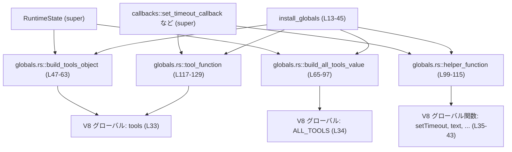
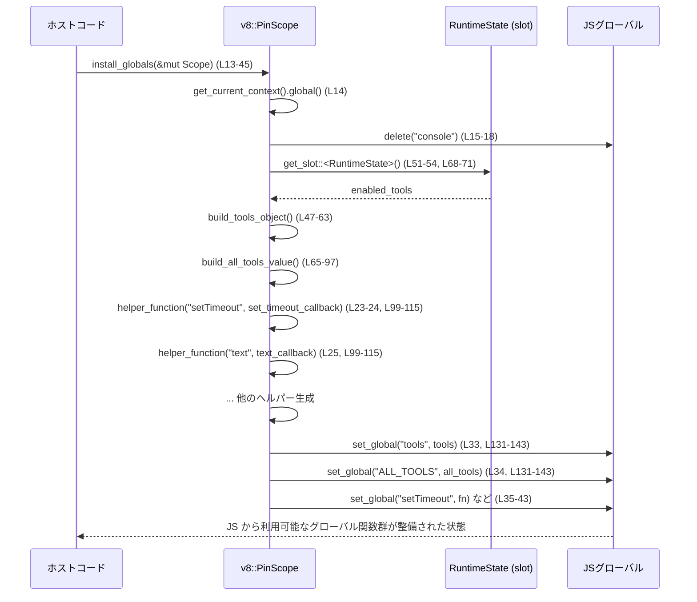

# code-mode/src/runtime/globals.rs

## 0. ざっくり一言

V8 上で動くスクリプト環境に対して、`tools` や `ALL_TOOLS`、`setTimeout` などの **グローバル関数・オブジェクトをインストールする初期化用モジュール**です（`install_globals`）。  
利用可能なツール一覧を V8 のグローバルオブジェクトへ公開するのが主な役割です（`build_tools_object`, `build_all_tools_value`）。  
（根拠: globals.rs:L13-45, L47-63, L65-97）

---

## 1. このモジュールの役割

### 1.1 概要

- このモジュールは **V8 の JavaScript 実行コンテキストに対し、特定のグローバル関数・オブジェクトを定義する問題** を解決するために存在し、次の機能を提供します。
  - 設定されたツール群を `tools` オブジェクトと `ALL_TOOLS` 配列として公開する  
    （根拠: globals.rs:L21-22, L47-63, L65-97）
  - `setTimeout`, `clearTimeout`, `text`, `image`, `store`, `load`, `notify`, `yield_control`, `exit` といったグローバル関数を定義し、Rust 側のコールバックに紐づける  
    （根拠: globals.rs:L23-31, L99-115, L117-129）
  - 既存の `console` グローバルを削除して上書きの衝突を避ける  
    （根拠: globals.rs:L15-19）

### 1.2 アーキテクチャ内での位置づけ

このモジュールは「ランタイム状態 `RuntimeState`」と「callbacks モジュール」に依存し、それらを V8 のグローバル空間にブリッジします。

- 上位: `super::RuntimeState` から有効なツール一覧を取得  
  （根拠: globals.rs:L51-54, L68-71）
- 横方向: `super::callbacks::*` の各コールバック関数を V8 の関数にマッピング  
  （根拠: globals.rs:L2-11, L23-31, L117-125）
- 下位: V8 の API (`v8::PinScope`, `v8::Object`, `v8::Array`, `v8::FunctionTemplate` など) を直接操作  



### 1.3 設計上のポイント

- **責務の分割**
  - `install_globals`: グローバル初期化全体を制御するエントリポイント  
    （根拠: globals.rs:L13-45）
  - `build_tools_object`: `tools` オブジェクト生成（名前→関数のマッピング）  
    （根拠: globals.rs:L47-63）
  - `build_all_tools_value`: `ALL_TOOLS` に公開するツールメタデータ配列の構築  
    （根拠: globals.rs:L65-97）
  - `helper_function` / `tool_function`: V8 の `FunctionTemplate` から `Function` を生成する共通処理  
    （根拠: globals.rs:L99-115, L117-129）
  - `set_global`: グローバルオブジェクトへの安全な値設定  
    （根拠: globals.rs:L131-143）

- **状態管理**
  - グローバルな状態は保持せず、`RuntimeState` を `scope.get_slot::<RuntimeState>()` 経由で参照する構造になっています。  
    `enabled_tools` が存在しない場合は `unwrap_or_default()` により空リストとして扱われます。  
    （根拠: globals.rs:L51-54, L68-71）

- **エラーハンドリング**
  - すべての関数は `Result<_, String>` を返し、V8 API が `None` や `Some(false)` を返した場合には明示的にエラー文字列を返します。  
    （根拠: globals.rs:L15-18, L72-76, L85-93, L99-115, L117-129, L131-143）
  - パニックを発生させる `unwrap` 等は使用していません。

- **並行性**
  - すべての関数は `&mut v8::PinScope` を引数に取り、**ミュータブル参照を通じてのみ V8 の状態にアクセス**します（共有参照は取らない）。  
    これにより Rust の型システム上、同一 `PinScope` への同時並行アクセスはコンパイル時に防がれます。  
    （根拠: globals.rs:L13, L47-48, L65-66, L99-101, L117-118, L131-133）

---

## 2. 主要な機能一覧（コンポーネントインベントリー）

### 2.1 機能の概要

- グローバル初期化:
  - `install_globals`: V8 のグローバルオブジェクトから `console` を削除し、`tools`, `ALL_TOOLS` と各種ヘルパー関数を登録する
- ツール公開:
  - `build_tools_object`: `RuntimeState.enabled_tools` から JS の `tools` オブジェクトを構成する
  - `build_all_tools_value`: `RuntimeState.enabled_tools` から JS の `ALL_TOOLS` 配列を構成する
- 関数生成:
  - `helper_function`: 任意の V8 コールバックからグローバル関数を生成する
  - `tool_function`: 汎用 `tool_callback` とツール名を紐づけた関数を生成する
- グローバル設定:
  - `set_global`: V8 グローバルオブジェクトにキーと値を設定する

### 2.2 関数インベントリー（行番号つき）

| 関数名 | 可視性 | 役割 / 用途 | 行番号 |
|--------|--------|-------------|--------|
| `install_globals` | `pub(super)` | V8 グローバルに `tools`/`ALL_TOOLS` と各種グローバル関数をインストールするエントリポイント | globals.rs:L13-45 |
| `build_tools_object` | `fn` | 有効なツールリストから `tools` オブジェクト（名前→関数）を生成 | globals.rs:L47-63 |
| `build_all_tools_value` | `fn` | 有効なツールリストから `ALL_TOOLS` 配列（メタデータ）を生成 | globals.rs:L65-97 |
| `helper_function` | `fn` | 指定名・コールバック付きの V8 `Function` を生成する汎用ヘルパー | globals.rs:L99-115 |
| `tool_function` | `fn` | 共通 `tool_callback` とツール名を埋め込んだ V8 `Function` を生成 | globals.rs:L117-129 |
| `set_global` | `fn` | V8 グローバルオブジェクトにキーと値を安全に設定 | globals.rs:L131-143 |

※ このファイル内に構造体・列挙体等の型定義はありません（`RuntimeState` は `super` から参照）。  

---

## 3. 公開 API と詳細解説

### 3.1 型一覧（構造体・列挙体など）

このファイル自体には新しい型定義はありません。  
利用している主な外部型のみ参考として挙げます。

| 名前 | 種別 | 役割 / 用途 | 根拠 |
|------|------|-------------|------|
| `RuntimeState` | 構造体（推定, `super`） | 有効なツール一覧 `enabled_tools` を保持 | globals.rs:L1, L51-54, L68-71 |
| `v8::PinScope<'s, '_>` | 外部構造体 | V8 の現在の実行スコープを表し、オブジェクト作成やスロット取得に利用 | globals.rs:L13, L47-48, L65-66, L99-101, L117-118, L131-133 |

※ `RuntimeState` の中身（`enabled_tools` の型など）は、このチャンクには現れないため詳細不明です。

---

### 3.2 関数詳細

#### `install_globals(scope: &mut v8::PinScope<'_, '_>) -> Result<(), String>`

**概要**

- V8 の現在のグローバルオブジェクトから既存の `"console"` を削除し、  
  `tools`, `ALL_TOOLS` および各種グローバル関数を定義する初期化関数です。  
  （根拠: globals.rs:L14-19, L21-43）

**引数**

| 引数名 | 型 | 説明 |
|--------|----|------|
| `scope` | `&mut v8::PinScope<'_, '_>` | 現在の V8 実行スコープ。ここからコンテキストや `RuntimeState` を取得し、グローバルオブジェクトを操作します。 |

**戻り値**

- `Result<(), String>`  
  - `Ok(())`: すべてのグローバル設定が成功した場合。  
  - `Err(String)`: 文字列生成やオブジェクト設定、`console` 削除などに失敗した場合のエラーメッセージ。  
    （根拠: globals.rs:L15-18, L21-22, L23-31, L33-43）

**内部処理の流れ**

1. 現在のコンテキストからグローバルオブジェクトを取得する。  
   （根拠: globals.rs:L14）
2. `"console"` というキーの `v8::String` を作成し、`global.delete` で削除する。  
   成功しなければエラーを返す。  
   （根拠: globals.rs:L15-18）
3. `build_tools_object` と `build_all_tools_value` を呼び出して、それぞれ `tools` オブジェクトと `ALL_TOOLS` 配列値を生成する。  
   （根拠: globals.rs:L21-22）
4. 各種コールバック（`clear_timeout_callback` など）に対して `helper_function` を呼び出し、`v8::Function` を生成する。  
   （根拠: globals.rs:L23-31, L99-115）
5. `set_global` を用いて、`tools`, `ALL_TOOLS`, 各種関数をグローバルオブジェクトに設定する。  
   （根拠: globals.rs:L33-43, L131-143）
6. すべて成功した場合に `Ok(())` を返す。  
   （根拠: globals.rs:L44）

**使用例（擬似コード）**

以下はランタイム初期化時に `install_globals` を呼び出す想定の例です。

```rust
// V8 の Isolate とコンテキストを作成し、PinScope を用意したあとで:
fn init_js_globals(scope: &mut v8::PinScope<'_, '_>) -> Result<(), String> {
    // ランタイム状態 RuntimeState を scope の slot にセットしておく必要がある
    // （実際の set_slot 呼び出しはこのチャンクには現れない）

    // グローバルへ tools や setTimeout などを登録
    crate::runtime::globals::install_globals(scope)?;

    Ok(())
}
```

このあと、JavaScript 側では `tools`, `ALL_TOOLS`, `setTimeout` などが利用可能になります（`callbacks` 側の実装に依存）。  

**Errors / Panics**

- エラー条件（`Err(String)` を返す主なケース）
  - `"console"` 文字列の生成失敗、または `global.delete` が成功を返さない場合  
    （根拠: globals.rs:L15-18）
  - `tools` / `ALL_TOOLS` オブジェクト・配列の生成でエラーが発生した場合（内部で `Err` が返る）  
    （根拠: globals.rs:L21-22, L47-63, L65-97）
  - 各ヘルパー関数生成（`helper_function`）やグローバル設定（`set_global`）が失敗した場合  
    （根拠: globals.rs:L23-31, L33-43, L99-115, L131-143）
- パニック
  - この関数内では `unwrap` などは使用されておらず、パニックを起こすコードは見当たりません。

**Edge cases（エッジケース）**

- `RuntimeState` が `scope` に設定されていない場合  
  → `build_tools_object` / `build_all_tools_value` 内で `unwrap_or_default()` により空リスト扱いされ、`tools` は空オブジェクト、`ALL_TOOLS` は空配列になります。  
  （根拠: globals.rs:L51-54, L68-71）
- ある特定のグローバル設定だけが失敗した場合  
  → その時点で `Err` が返され、それ以降のグローバルは設定されません。部分的に登録されたグローバルが残る可能性があります。  
  （根拠: globals.rs:L33-43）

**使用上の注意点**

- `scope` には `RuntimeState` があらかじめ `set_slot` されていることが前提になっています（このファイル内では設定されていません）。  
- 同じコンテキストに対して複数回呼ぶと、`tools` や各グローバル関数が上書きされます。これが意図された動作かどうかは、このチャンクからは判断できません。  
- `console` が削除されるため、通常の `console.log` などが利用できなくなる点に注意が必要です。  
  （根拠: globals.rs:L15-18）

---

#### `build_tools_object<'s>(scope: &mut v8::PinScope<'s, '_>) -> Result<v8::Local<'s, v8::Object>, String>`

**概要**

- `RuntimeState.enabled_tools` の内容から、`tools` グローバルに対応する JS オブジェクトを構築します。  
  各ツールは `tool.global_name` をキー、`tool_function` で生成される関数を値として登録されます。  
  （根拠: globals.rs:L47-63）

**引数**

| 引数名 | 型 | 説明 |
|--------|----|------|
| `scope` | `&mut v8::PinScope<'s, '_>` | V8 の実行スコープ。`RuntimeState` の取得とオブジェクト生成に利用します。 |

**戻り値**

- `Result<v8::Local<'s, v8::Object>, String>`  
  - 成功時: 全ツールをプロパティとして持つ `v8::Object`。  
  - 失敗時: 文字列生成や `tool_function` 生成に失敗したエラー文字列。  

**内部処理の流れ**

1. 新しい `v8::Object` を `tools` として生成。  
   （根拠: globals.rs:L50）
2. `scope.get_slot::<RuntimeState>()` から `enabled_tools` を取得し、`clone()` する。  
   スロットが存在しない場合は `unwrap_or_default()` で空コレクション。  
   （根拠: globals.rs:L51-54）
3. `enabled_tools` の各要素についてループし、
   - `tool.global_name` からキー用 `v8::String` を生成  
   - `tool.tool_name` を渡して `tool_function` 呼び出しから `v8::Function` を取得  
   - `tools.set` でオブジェクトに登録  
   （根拠: globals.rs:L56-61）
4. 完成した `tools` オブジェクトを `Ok(tools)` として返す。  
   （根拠: globals.rs:L62）

**使用例（`install_globals` 内での利用）**

```rust
// install_globals 内の抜粋（実際のコードと同じ）
let tools = build_tools_object(scope)?;       // 有効なツールから tools オブジェクトを生成
set_global(scope, global, "tools", tools.into())?; // JS グローバルに tools を登録
```

**Errors / Panics**

- エラー条件
  - ツール名（`tool.global_name`）の `v8::String` 生成に失敗した場合  
    （根拠: globals.rs:L57-58）
  - `tool_function` の生成に失敗した場合  
    （根拠: globals.rs:L59）
- パニック
  - `unwrap` 等は使用していません。

**Edge cases（エッジケース）**

- `enabled_tools` が空の場合  
  → 空の `v8::Object` が返されます。  
  （根拠: globals.rs:L51-56）
- `tools.set` の結果が `None` や `Some(false)` の場合  
  → 戻り値はチェックしておらず、エラーとして扱われません。`tools` オブジェクト内に期待したプロパティが存在しない可能性があります。  
  （根拠: globals.rs:L60）

**使用上の注意点**

- `tools.set` の結果をチェックしていないため、一部ツールの登録が silently 失敗してもこの関数は `Ok` を返します。この挙動が仕様かどうかはこのチャンクからは判断できませんが、グローバルとの整合性を重視する場合には注意が必要です。  
  （根拠: globals.rs:L60）

---

#### `build_all_tools_value<'s>(scope: &mut v8::PinScope<'s, '_>) -> Result<v8::Local<'s, v8::Value>, String>`

**概要**

- `RuntimeState.enabled_tools` から、ツールのメタデータ（名前・説明）を格納した JS 配列 `ALL_TOOLS` を構築します。  
  各要素は `{ name: string, description: string }` 形式のオブジェクトです。  
  （根拠: globals.rs:L65-97）

**引数**

| 引数名 | 型 | 説明 |
|--------|----|------|
| `scope` | `&mut v8::PinScope<'s, '_>` | V8 の実行スコープ。`RuntimeState` の取得と配列・文字列生成に利用します。 |

**戻り値**

- `Result<v8::Local<'s, v8::Value>, String>`  
  - 成功時: `v8::Array` を `Value` に変換したもの。  
  - 失敗時: 名前・説明・キーの文字列生成や配列への要素追加に失敗した場合のエラー文字列。  

**内部処理の流れ**

1. `enabled_tools` を `RuntimeState` から取得（なければ空）。  
   （根拠: globals.rs:L68-71）
2. `enabled_tools.len()` を元に、固定長の `v8::Array` を生成。  
   （根拠: globals.rs:L72）
3. 配列要素のキーに使う `"name"` と `"description"` の `v8::String` を生成。  
   （根拠: globals.rs:L73-76）
4. `enabled_tools.iter().enumerate()` でループし、各ツールごとに:
   - `v8::Object::new` で `item` を作成  
   - `tool.global_name` と `tool.description` から `name` / `description` 文字列を生成  
   - `item.set` で `name_key` / `description_key` を設定（失敗時は即 `Err`）  
   - `array.set_index` で配列に `item` を追加（失敗時は即 `Err`）  
   （根拠: globals.rs:L78-93）
5. 最終的な `array` を `Value` に変換して返す。  
   （根拠: globals.rs:L96）

**使用例（`install_globals` 内での利用）**

```rust
// install_globals 内の抜粋
let all_tools = build_all_tools_value(scope)?;           // ALL_TOOLS 用の配列を生成
set_global(scope, global, "ALL_TOOLS", all_tools)?;      // JS グローバル ALL_TOOLS として公開
```

**Errors / Panics**

- エラー条件
  - `"name"` / `"description"` キー名の文字列生成失敗  
    （根拠: globals.rs:L73-76）
  - 各ツールの `name` / `description` 文字列生成失敗  
    （根拠: globals.rs:L80-83）
  - `item.set` が成功を返さない場合  
    （根拠: globals.rs:L85-90）
  - `array.set_index` が成功を返さない場合  
    （根拠: globals.rs:L91-93）
- パニック
  - パニックを起こすコードはありません。

**Edge cases（エッジケース）**

- `enabled_tools` が空の場合  
  → 長さ 0 の `v8::Array` が生成され、そのまま `ALL_TOOLS` として公開されます。  
  （根拠: globals.rs:L68-72, L78-94）

**使用上の注意点**

- `ALL_TOOLS` はツールの実行関数ではなくメタデータのみを含むため、JS 側でこの配列を見て UI 表示などに利用し、実行には `tools` オブジェクトを参照させる構造だと考えられますが、これは命名からの推測であり、このチャンクからは断定できません。  
  （根拠: globals.rs:L72-83）

---

#### `helper_function<'s, F>(scope: &mut v8::PinScope<'s, '_>, name: &str, callback: F) -> Result<v8::Local<'s, v8::Function>, String> where F: v8::MapFnTo<v8::FunctionCallback>`

**概要**

- 任意の V8 関数コールバックと名前から、`v8::Function` を生成する汎用ヘルパーです。  
  `FunctionTemplate::builder(callback)` に `.data(name.into())` で名前を埋め込みます。  
  （根拠: globals.rs:L99-115）

**引数**

| 引数名 | 型 | 説明 |
|--------|----|------|
| `scope` | `&mut v8::PinScope<'s, '_>` | V8 実行スコープ |
| `name` | `&str` | 関数名。`v8::String` に変換され、テンプレートの `.data` として渡されます。 |
| `callback` | `F` (MapFnTo\<FunctionCallback\>) | 実際のネイティブコールバック。`FunctionTemplate` のビルダに渡されます。 |

**戻り値**

- `Result<v8::Local<'s, v8::Function>, String>`  
  - 成功時: V8 の `Function` 値。  
  - 失敗時: 名前文字列の生成または `get_function` の失敗時のエラー。  

**内部処理の流れ**

1. `name` を `v8::String` に変換。失敗時は `Err`。  
   （根拠: globals.rs:L107-108）
2. `v8::FunctionTemplate::builder(callback)` でテンプレートを作成し、`data(name.into())` で名前を付加して `build(scope)`。  
   （根拠: globals.rs:L109-111）
3. `template.get_function(scope)` から実際の `Function` を取得。`None` の場合はエラー。  
   （根拠: globals.rs:L112-114）

**使用例（`install_globals` 内での利用）**

```rust
// setTimeout 用の V8 関数を生成している箇所
let set_timeout = helper_function(scope, "setTimeout", set_timeout_callback)?;
// 生成された関数をグローバル setTimeout として登録
set_global(scope, global, "setTimeout", set_timeout.into())?;
```

**Errors / Panics**

- エラー条件
  - 関数名文字列の生成失敗  
    （根拠: globals.rs:L107-108）
  - `FunctionTemplate::get_function` が `None` を返した場合  
    （根拠: globals.rs:L112-114）

**Edge cases（エッジケース）**

- `name` が空文字列であっても、この関数自体はエラーにしません。V8 側でどう扱われるかは V8 の仕様に依存し、このチャンクからは不明です。  

**使用上の注意点**

- `.data(name.into())` で埋め込んだデータは、コールバック側で `info.data()` などから取得される想定ですが、その利用は `callbacks` モジュール内にあり、このチャンクには現れません。  

---

#### `tool_function<'s>(scope: &mut v8::PinScope<'s, '_>, tool_name: &str) -> Result<v8::Local<'s, v8::Function>, String>`

**概要**

- 汎用的な `tool_callback` に対して、ツール固有の名前（`tool_name`）を `.data` として埋め込んだ `v8::Function` を生成します。  
  これにより、ツールごとに異なるコールバック関数を個別に実装するのではなく、1 つの `tool_callback` で名前を識別できるようになります。  
  （根拠: globals.rs:L117-129, L10）

**引数**

| 引数名 | 型 | 説明 |
|--------|----|------|
| `scope` | `&mut v8::PinScope<'s, '_>` | V8 実行スコープ |
| `tool_name` | `&str` | ツール識別子。`v8::String` としてテンプレートの `.data` に格納されます。 |

**戻り値**

- `Result<v8::Local<'s, v8::Function>, String>`  
  - 成功時: `tool_callback` にツール名が紐づいた V8 関数。  
  - 失敗時: データ文字列の生成または `get_function` の失敗。  

**内部処理の流れ**

1. `tool_name` を `v8::String` に変換。失敗時はエラー。  
   （根拠: globals.rs:L121-122）
2. `FunctionTemplate::builder(tool_callback)` でテンプレートを生成し、`.data(data.into())` でツール名を埋め込む。  
   （根拠: globals.rs:L123-125）
3. `get_function` で `Function` を取得し、`None` の場合はエラー。  
   （根拠: globals.rs:L126-128）

**使用例（`build_tools_object` 内）**

```rust
for tool in enabled_tools {
    let name = v8::String::new(scope, &tool.global_name)
        .ok_or_else(|| "failed to allocate tool name".to_string())?;
    let function = tool_function(scope, &tool.tool_name)?; // 各ツール用の関数を生成
    tools.set(scope, name.into(), function.into());       // tools[global_name] = function
}
```

**Errors / Panics**

- エラー条件
  - ツール名文字列の生成失敗  
    （根拠: globals.rs:L121-122）
  - `get_function` が `None` の場合  
    （根拠: globals.rs:L126-128）

**Edge cases（エッジケース）**

- `tool_name` が空文字列や重複している場合の扱いは、このチャンクからは分かりません（`RuntimeState` 側の制約に依存）。  

**使用上の注意点**

- `tool_callback` の実装側で `.data()` を利用してツール名を判別していると考えられますが、その具体的な処理は `super::callbacks::tool_callback` にあり、このチャンクには現れません。  

---

#### `set_global<'s>(scope: &mut v8::PinScope<'s, '_>, global: v8::Local<'s, v8::Object>, name: &str, value: v8::Local<'s, v8::Value>) -> Result<(), String>`

**概要**

- V8 グローバルオブジェクトの指定プロパティに対し、安全に値を設定するヘルパーです。  
  文字列生成と `set` の結果をチェックし、失敗時には `Err` を返します。  
  （根拠: globals.rs:L131-143）

**引数**

| 引数名 | 型 | 説明 |
|--------|----|------|
| `scope` | `&mut v8::PinScope<'s, '_>` | V8 実行スコープ |
| `global` | `v8::Local<'s, v8::Object>` | 設定対象のオブジェクト（通常はグローバルオブジェクト） |
| `name` | `&str` | プロパティ名 |
| `value` | `v8::Local<'s, v8::Value>` | 設定する値 |

**戻り値**

- `Result<(), String>`  
  - 成功時: `Ok(())`  
  - 失敗時: キーの文字列生成または `set` の失敗時のエラー文字列。  

**内部処理の流れ**

1. `name` から `v8::String` を生成し、失敗時には `format!("failed to allocate global`{name}`")` でエラー。  
   （根拠: globals.rs:L137-138）
2. `global.set(scope, key.into(), value)` を呼び出し、`Some(true)` のときだけ成功とみなす。  
   その他 (`None` / `Some(false)`) の場合は `"failed to set global`{name}`"` でエラー。  
   （根拠: globals.rs:L139-143）

**使用例**

```rust
// install_globals 内の典型的な使い方
set_global(scope, global, "text", text.into())?;
set_global(scope, global, "exit", exit.into())?;
```

**Errors / Panics**

- エラー条件
  - グローバル名文字列の生成失敗  
    （根拠: globals.rs:L137-138）
  - `set` の戻り値が `Some(true)` 以外の場合  
    （根拠: globals.rs:L139-142）

**Edge cases（エッジケース）**

- `name` が既に存在するプロパティ名の場合  
  → 上書きが行われるかどうかは V8 の仕様に依存しますが、少なくとも `install_globals` の用途では `console` を先に削除してから設定しています。  
  （根拠: globals.rs:L15-18, L33-43）

**使用上の注意点**

- このヘルパーは結果を厳密にチェックするため、グローバル設定に失敗した場合に早期に `Err` が返されます。  
  これにより設定漏れが検出しやすい一方、部分的にしか設定されない状態でエラー復帰する可能性があります。  

---

### 3.3 その他の関数

このファイル内の関数はすべて 3.2 で詳細解説済みです。補助的な関数のみの一覧は次の通りです。

| 関数名 | 役割（1 行） |
|--------|--------------|
| `build_tools_object` | `RuntimeState.enabled_tools` から `tools` オブジェクトを構築 |
| `build_all_tools_value` | `RuntimeState.enabled_tools` から `ALL_TOOLS` 配列を構築 |
| `helper_function` | 任意コールバックから V8 関数を生成するヘルパー |
| `tool_function` | `tool_callback` + ツール名から V8 関数を生成 |
| `set_global` | V8 オブジェクトにプロパティを設定する安全なラッパー |

---

## 4. データフロー

ここでは、`install_globals` が呼ばれたときの典型的なデータフローを説明します。

1. ホストコードが V8 のコンテキストを作成し、`PinScope` を取得する。  
2. `RuntimeState` が `scope` のスロットに設定されている前提で、`install_globals` が呼ばれる。  
3. `install_globals` は `RuntimeState.enabled_tools` を使用して `tools` と `ALL_TOOLS` を構成し、  
   それらと各種関数を V8 のグローバルオブジェクトに設定する。  



この図は、`install_globals` とそれが利用するヘルパー (`build_tools_object`, `build_all_tools_value`, `helper_function`, `set_global`) の範囲（globals.rs:L13-45, L47-63, L65-97, L99-115, L131-143）を表しています。

---

## 5. 使い方（How to Use）

### 5.1 基本的な使用方法

`install_globals` を呼び出してから JavaScript コードを実行する、というのが基本フローです。

```rust
// 仮想的な初期化コードの例
fn setup_js_runtime(isolate: &mut v8::Isolate) -> Result<(), String> {
    // スコープを作成
    let mut hs = v8::HandleScope::new(isolate);          // ハンドルスコープを作成
    let scope = hs.enter();                              // PinScope を取得（概念的な例）

    // RuntimeState を slot に設定（詳細はこのチャンクにはない）
    // scope.set_slot(RuntimeState { enabled_tools: ... });

    // グローバルを初期化
    crate::runtime::globals::install_globals(scope)?;   // tools, ALL_TOOLS, 各種関数を登録

    Ok(())
}
```

この後、JS 側では例えば以下のように利用できます（JS 側の例、Rust から見たイメージ）:

```javascript
// JS 側 (イメージ)
ALL_TOOLS.forEach(t => {
  // t.name, t.description を利用して UI に表示
});

tools.myTool({ foo: "bar" });  // myTool は enabled_tools の1つである想定
```

### 5.2 よくある使用パターン

- **ツールの有効化 / 無効化**
  - `RuntimeState.enabled_tools` の内容を変えることで、`tools` / `ALL_TOOLS` に現れるツールを制御できます（実装はこのチャンクには現れませんが、`enabled_tools` を参照していることから分かります）。  
    （根拠: globals.rs:L51-54, L68-71）

- **環境ごとのグローバル構成**
  - 開発環境ではより多くのツールを `enabled_tools` に入れ、本番環境では限定する、といった使い方が可能です。

### 5.3 よくある間違い

```rust
// 間違い例: RuntimeState をスロットに入れずに install_globals を呼ぶ
fn init_without_state(scope: &mut v8::PinScope<'_, '_>) -> Result<(), String> {
    crate::runtime::globals::install_globals(scope)?;
    // この場合、tools や ALL_TOOLS は空になる
    Ok(())
}

// 正しい例: 先に RuntimeState をスロットに設定してから呼ぶ
fn init_with_state(scope: &mut v8::PinScope<'_, '_>, state: RuntimeState) -> Result<(), String> {
    scope.set_slot(state);             // 実際の set_slot 実装はこのチャンクには現れない
    crate::runtime::globals::install_globals(scope)?;
    Ok(())
}
```

上記のとおり、`RuntimeState` が設定されていないと有効なツールが 0 となり、`tools` と `ALL_TOOLS` が空になります。  
（根拠: globals.rs:L51-54, L68-71）

### 5.4 使用上の注意点（まとめ）

- **前提条件**
  - `scope` のスロットに `RuntimeState` がセットされていること（そうでないとツールが空になる）。  
    （根拠: globals.rs:L51-54, L68-71）
  - `install_globals` は V8 コンテキストごとに 1 回だけ呼ぶのが自然な想定です（複数回呼んだ場合の挙動は V8 仕様に依存し、このチャンクからは断定できません）。

- **エラー処理**
  - すべての関数は `Result` を返すので、`?` 演算子等でエラーを必ず拾う必要があります。  
  - エラーは文字列ベースであり、エラー型による詳細な分類はされていません。

- **並行性**
  - `&mut v8::PinScope` を受け取るため、同時に 2 つのスレッドから同じスコープに対して `install_globals` を呼ぶことはコンパイル時に防がれます。  
  - ただし、Isolate/コンテキストごとのスレッド安全性は V8 自体の制約に依存し、このチャンクからは詳細不明です。

- **Bugs/Security に関する注意**
  - `build_tools_object` 内の `tools.set` の戻り値がチェックされておらず、ツール登録が失敗しても検知されません。これは、エラーを見逃す可能性がある点として注意が必要です。  
    （根拠: globals.rs:L60）
  - このファイルは任意の JS コード実行を直接は行っておらず、`tool_callback` 等のコールバック側で何が許可されているかがセキュリティ上重要ですが、その実装はこのチャンクには現れません。

- **観測性 (Observability)**
  - ログ出力やメトリクス送出は一切行っていません。トラブルシュート時には、呼び出し側でエラー文字列をログに残す必要があります。  

---

## 6. 変更の仕方（How to Modify）

### 6.1 新しい機能を追加する場合

- **新しいグローバル関数を追加したい場合**
  1. `super::callbacks` モジュールに新しいコールバック関数を追加する（このチャンクには定義がないため別ファイル）。  
  2. `globals.rs` の `use super::callbacks::*` 部分にそのコールバックを追加する。  
     （根拠: globals.rs:L2-11）
  3. `install_globals` 内で `helper_function(scope, "NewName", new_callback)?;` を呼び、その結果を `set_global` でグローバルへ登録する。  
     （根拠: globals.rs:L23-31, L33-43）

- **新しいツールメタデータを ALL_TOOLS に追加したい場合**
  - 実際には `RuntimeState.enabled_tools` の要素に `global_name`, `description` 等を追加する形で対応します。  
    `build_all_tools_value` は `enabled_tools.iter()` を全走査しているため、ここを変更する必要はありません。  
    （根拠: globals.rs:L68-72, L78-83）

### 6.2 既存の機能を変更する場合

- **影響範囲の確認**
  - `install_globals` を呼び出している箇所（多くはランタイム初期化コード）をすべて確認する必要があります。  
  - `tools` / `ALL_TOOLS` / 各グローバル関数を JS 側から参照しているコード（フロントエンドのスクリプトなど）も影響を受ける可能性があります。

- **契約（前提条件・返り値の意味）に関する注意**
  - `build_all_tools_value` が `{ name, description }` というプロパティ名をハードコードしているため、プロパティ名を変更すると JS 側のコードもすべて更新する必要があります。  
    （根拠: globals.rs:L73-76, L85-90）
  - `set_global` は `Some(true)` のときのみ成功とみなす契約なので、V8 側の挙動が変わった場合の影響も考慮する必要があります。  
    （根拠: globals.rs:L139-143）

- **テストに関する観点**
  - 変更時には次のようなテストを用意するのが有用です（テストコード自体はこのチャンクには存在しません）:
    - `RuntimeState.enabled_tools` に 0/1/複数要素を設定したときの `tools` / `ALL_TOOLS` の内容検証。  
    - 各グローバル関数（`text`, `image` など）が実際に JS から呼び出せ、callbacks 側へ到達していることの確認。  

---

## 7. 関連ファイル

このモジュールと密接に関係するファイル・ディレクトリは、コードから次のように推定できます。

| パス | 役割 / 関係 |
|------|------------|
| `code-mode/src/runtime/mod.rs` もしくは類似ファイル | `RuntimeState` の定義および `enabled_tools` の構造を提供していると考えられます（`super::RuntimeState` 参照より）。 |
| `code-mode/src/runtime/callbacks.rs` または `runtime/callbacks/` 配下 | `clear_timeout_callback`, `set_timeout_callback`, `text_callback`, `tool_callback` など、JS から呼び出される実際のネイティブ処理を実装しています（`super::callbacks::*` 参照）。 |
| JS 側のスクリプト群 | `tools`, `ALL_TOOLS`, `setTimeout` など、このモジュールが登録するグローバルを利用するコード。Rust 側からは見えませんが、本モジュールの利用者に相当します。 |

`RuntimeState` や `callbacks` の具体的な内容はこのチャンクには現れないため、詳細はそれぞれのファイルを参照する必要があります。
