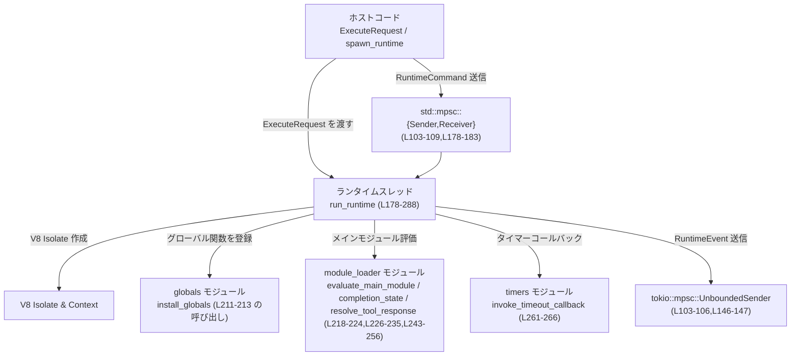
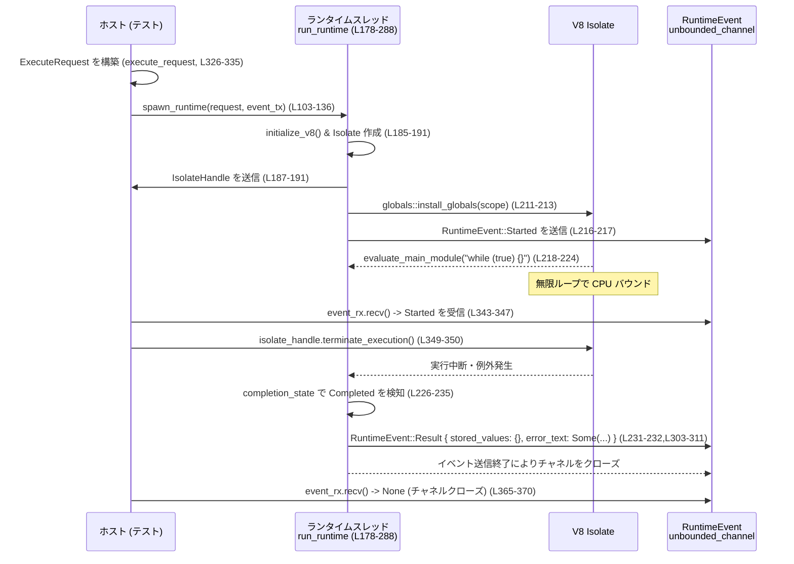

# code-mode/src/runtime/mod.rs コード解説

## 0. ざっくり一言

このモジュールは、V8 を使って別スレッド上でコード（おそらく JavaScript モジュール）を実行し、ホスト側とメッセージ（イベント・コマンド）でやり取りする「実行ランタイム」の中核を提供します（`spawn_runtime` と `run_runtime`）。  
ツール呼び出し・タイマー・終了通知などを `RuntimeEvent` / `RuntimeCommand` 経由で非同期に処理します（`RuntimeEvent`, `RuntimeCommand` 定義）。  
（根拠: `code-mode/src/runtime/mod.rs:L20-23,L42-101,L103-136,L178-288`）

---

## 1. このモジュールの役割

### 1.1 概要

- このモジュールは **「コード実行リクエストを受け取り、V8 上で実行し、結果や途中経過をイベントとして通知する」** ために存在します。  
- 実行は `spawn_runtime` により **専用スレッド** 上で行われ、`RuntimeCommand`（コマンド）を受け取りつつ、`RuntimeEvent`（イベント）を `tokio::mpsc` 経由で送り返します。  
- 実行完了時やエラー発生時には、`stored_values` と `error_text` を含む `RuntimeEvent::Result` を送信します。  
（根拠: `code-mode/src/runtime/mod.rs:L25-33,L42-58,L83-101,L103-136,L178-288,L290-301`）

### 1.2 アーキテクチャ内での位置づけ

このモジュールは「ホスト側 Rust コード」と「V8 上で動くスクリプト」の橋渡しです。

- 上位レイヤからは `ExecuteRequest` と `spawn_runtime` が入口になります。  
- 下位では `globals`, `module_loader`, `timers`, `callbacks`, `value` などのサブモジュールが V8 のグローバル・モジュールローダ・タイマー・コールバックなどを扱います。  
- イベントは `tokio::sync::mpsc::UnboundedSender<RuntimeEvent>` で上位に通知され、コマンドは `std::sync::mpsc::Sender<RuntimeCommand>` でランタイムに送られます。  



（根拠: `code-mode/src/runtime/mod.rs:L1-5,L83-101,L103-136,L146-147,L178-188,L192-193,L211-213,L218-224,L226-235,L243-266`）

### 1.3 設計上のポイント

- **専用スレッドでの V8 実行**  
  - `thread::spawn` でランタイムごとに OS スレッドを起動し、その中で V8 の `Isolate` と `Context` を作成します（`run_runtime`）。  
  - V8 の `IsolateHandle` を使って他スレッドから実行停止（`terminate_execution`）できるようにしています。  
  （根拠: `code-mode/src/runtime/mod.rs:L10,L103-136,L178-191,L337-351`）

- **一度きりの V8 プラットフォーム初期化**  
  - `OnceLock` と `initialize_v8` により、プロセス全体で V8 のプラットフォーム初期化を一度だけ行い、スレッド安全性を確保しています。  
  （根拠: `code-mode/src/runtime/mod.rs:L8,L167-176`）

- **イベント駆動のコマンドループ**  
  - `std::mpsc::Receiver<RuntimeCommand>` をブロッキングで `recv` し、ツールレスポンス・エラー・タイマー・Terminate を順に処理するループになっています。  
  - 各コマンド処理の後に `perform_microtask_checkpoint` を呼び、V8 のマイクロタスク（Promise の then など）を実行した上で完了状態をチェックしています。  
  （根拠: `code-mode/src/runtime/mod.rs:L75-81,L178-183,L237-287,L269-279`）

- **状態の V8 スコープへの格納**  
  - `RuntimeState` を `scope.set_slot` で V8 のスコープに紐付け、他モジュールが `scope.get_slot::<RuntimeState>` でアクセスできるようにしています（`capture_scope_send_error` で利用）。  
  （根拠: `code-mode/src/runtime/mod.rs:L146-157,L198-209,L290-301`）

- **エラーと結果の標準化された通知**  
  - 成功・エラー問わず最終結果は `RuntimeEvent::Result { stored_values, error_text }` に集約されます。  
  - エラー発生時には、それまでに積み上がった `stored_values` を `RuntimeState` から取得して結果に含めます。  
  （根拠: `code-mode/src/runtime/mod.rs:L42-58,L83-101,L218-224,L226-235,L243-266,L290-301,L303-311`）

---

## 2. 主要な機能一覧

- 実行リクエスト定義: `ExecuteRequest` により、ツール群・ソースコード・初期ストア値・制御パラメータをまとめて表現します。  
  （根拠: `code-mode/src/runtime/mod.rs:L25-33`）

- 実行結果モデル化: `RuntimeResponse` / `RuntimeEvent::Result` により、通常終了・中断・結果などを表現します。  
  （根拠: `code-mode/src/runtime/mod.rs:L42-58,L83-101`）

- ランタイムスレッドの起動: `spawn_runtime` が `ExecuteRequest` から `RuntimeConfig` を組み立て、V8 ランタイム用スレッドを開始します。  
  （根拠: `code-mode/src/runtime/mod.rs:L103-136,L138-144`）

- V8 プラットフォーム初期化: `initialize_v8` がプロセス全体で一度だけ V8 のプラットフォームを立ち上げます。  
  （根拠: `code-mode/src/runtime/mod.rs:L167-176`）

- 実行ループとイベント駆動処理: `run_runtime` が V8 Isolate と Context を作成し、モジュールの評価・ツールレスポンス・タイマー・完了状態の監視を行います。  
  （根拠: `code-mode/src/runtime/mod.rs:L178-288`）

- エラー時の結果生成: `capture_scope_send_error` と `send_result` が、スコープ上の状態を取り出して `RuntimeEvent::Result` を送信します。  
  （根拠: `code-mode/src/runtime/mod.rs:L290-301,L303-311`）

- CPU バウンドコードの強制停止: テスト `terminate_execution_stops_cpu_bound_module` が、`IsolateHandle::terminate_execution` により無限ループを停止できることを検証します。  
  （根拠: `code-mode/src/runtime/mod.rs:L337-371`）

---

## 3. 公開 API と詳細解説

### 3.1 型一覧（構造体・列挙体など）

| 名前 | 種別 | 可視性 | 役割 / 用途 | 定義位置 |
|------|------|--------|-------------|----------|
| `ExecuteRequest` | 構造体 | `pub` | ランタイム実行の入力全体（ツール・ソース・ストア・制御パラメータ）を表す | `code-mode/src/runtime/mod.rs:L25-33` |
| `WaitRequest` | 構造体 | `pub` | セル単位の待機要求と終了フラグを表すリクエスト。`yield_time_ms` と `terminate` を持つが、このファイル内では未使用 | `code-mode/src/runtime/mod.rs:L35-40` |
| `RuntimeResponse` | 列挙体 | `pub` | `Yielded` / `Terminated` / `Result` という三種類の高レベルな実行結果を表す | `code-mode/src/runtime/mod.rs:L42-58` |
| `TurnMessage` | 列挙体 | `pub(crate)` | ランタイムターン中のツール呼び出し・通知メッセージを表す。ここでは定義のみで、利用箇所はこのファイルには出現しない | `code-mode/src/runtime/mod.rs:L60-73` |
| `RuntimeCommand` | 列挙体 | `pub(crate)` | ランタイムスレッドに送るコマンド（ツールの成功/失敗応答、タイムアウト発火、Terminate）を表す | `code-mode/src/runtime/mod.rs:L75-81` |
| `RuntimeEvent` | 列挙体 | `pub(crate)` | ランタイムからホストへ送るイベント（開始・コンテンツ・ツールコール・通知・最終結果）を表す | `code-mode/src/runtime/mod.rs:L83-101` |
| `RuntimeConfig` | 構造体 | `pub(super)` ではなく `struct`（モジュール内） | `ExecuteRequest` から実行に必要な情報だけを抜き出した内部用設定 | `code-mode/src/runtime/mod.rs:L138-144` |
| `RuntimeState` | 構造体 | `pub(super)` | V8 スコープに紐付けて保持されるランタイムの内部状態（イベント送信先・ツール/タイマーの管理・stored_values など） | `code-mode/src/runtime/mod.rs:L146-157` |
| `CompletionState` | 列挙体 | `pub(super)` | メインモジュールの完了状態（`Pending` or `Completed { stored_values, error_text }`）を表す | `code-mode/src/runtime/mod.rs:L159-165` |

補助的な定数:

| 名前 | 種別 | 可視性 | 説明 | 定義位置 |
|------|------|--------|------|----------|
| `DEFAULT_EXEC_YIELD_TIME_MS` | `u64` 定数 | `pub` | 実行中にどれくらいの間隔で「yield」するかのデフォルト値（ミリ秒単位）。このファイル内では未使用 | `code-mode/src/runtime/mod.rs:L20` |
| `DEFAULT_WAIT_YIELD_TIME_MS` | `u64` 定数 | `pub` | 待機時のデフォルトの `yield` 間隔（推測）。このファイル内では未使用 | `code-mode/src/runtime/mod.rs:L21` |
| `DEFAULT_MAX_OUTPUT_TOKENS_PER_EXEC_CALL` | `usize` 定数 | `pub` | 1 回の実行で許可される最大出力トークン数。ここでは定義のみ | `code-mode/src/runtime/mod.rs:L22` |
| `EXIT_SENTINEL` | `&'static str` 定数 | `const`（モジュール内） | `"__codex_code_mode_exit__"` という特別な文字列。現状このファイルでは参照されていない | `code-mode/src/runtime/mod.rs:L23` |

### 3.2 関数詳細（重要な 5 件）

#### `spawn_runtime(request: ExecuteRequest, event_tx: mpsc::UnboundedSender<RuntimeEvent>) -> Result<(std_mpsc::Sender<RuntimeCommand>, v8::IsolateHandle), String>`

**概要**

`ExecuteRequest` を受け取り、V8 ランタイムを専用スレッド上で起動します。  
ホスト側からランタイムにコマンドを送るための `std_mpsc::Sender<RuntimeCommand>` と、V8 実行を強制停止するための `v8::IsolateHandle` を返します。  
（根拠: `code-mode/src/runtime/mod.rs:L103-136`）

**引数**

| 引数名 | 型 | 説明 |
|--------|----|------|
| `request` | `ExecuteRequest` | 実行に必要なツール定義・ソース・初期 `stored_values` などを含むリクエスト |
| `event_tx` | `tokio::sync::mpsc::UnboundedSender<RuntimeEvent>` | ランタイムからのイベント（開始・ツール呼び出し・結果など）を受け取るための送信チャネル |

（根拠: `code-mode/src/runtime/mod.rs:L103-106,L25-33,L83-101`）

**戻り値**

- `Ok((command_tx, isolate_handle))`  
  - `command_tx`: ランタイムスレッドに `RuntimeCommand` を送るための同期 MPSC 送信側。  
  - `isolate_handle`: 他スレッドから V8 の実行を中断できるハンドル（テストで `terminate_execution()` に利用）。  
- `Err(String)`  
  - ランタイムスレッドの初期化（V8 Isolate ハンドル送信）が失敗した場合 `"failed to initialize code mode runtime"` を返します。  
（根拠: `code-mode/src/runtime/mod.rs:L103-136,L337-351`）

**内部処理の流れ**

1. `std_mpsc::channel()` で `command_tx` / `command_rx` を作成し、実行ループ側とホスト側のコマンドチャネルを用意する。  
2. `std_mpsc::sync_channel(1)` で `isolate_handle_tx` / `isolate_handle_rx` を作成し、Isolate ハンドルを一度だけ受け取る同期チャネルを作る。  
3. `request.enabled_tools` を `enabled_tool_metadata` で変換して `Vec<EnabledToolMetadata>` を構築し、`RuntimeConfig` を組み立てる。  
4. 新しいスレッドを起動し、その中で `run_runtime(config, event_tx, command_rx, isolate_handle_tx, runtime_command_tx)` を呼ぶ。  
5. 呼び出し元スレッドは `isolate_handle_rx.recv()` でランタイム側からの `IsolateHandle` を待ち、受信に失敗した場合は `Err` を返して終了。  
6. 成功時は `(command_tx, isolate_handle)` を `Ok` で返す。  
（根拠: `code-mode/src/runtime/mod.rs:L103-121,L122-130,L132-135`）

**Rust 言語特有の安全性 / 並行性**

- `ExecuteRequest` は値として受け取るため、`RuntimeConfig` へ所有権がムーブし、その後スレッドに安全に渡されます（所有権の移動によりデータ競合が防がれる）。  
  （根拠: `code-mode/src/runtime/mod.rs:L103-121,L138-144`）
- `std::sync::mpsc` の `Sender` / `Receiver` は `Send` を実装しており、スレッド間で安全に共有・移動できます。  
- V8 の `IsolateHandle` は V8 ランタイム側で thread-safe なハンドルとして提供されており、テストでは別スレッド（ tokio runtime スレッド）から `terminate_execution` を呼び出しても動作しています。  
  （根拠: `code-mode/src/runtime/mod.rs:L187-189,L337-351`）

**Examples（使用例）**

テストと同様に、単純なコードを実行するランタイムを起動する例です（ツールなし・無限ループではない前提）。

```rust
use std::collections::HashMap;
use tokio::sync::mpsc;
use code_mode::runtime::{
    ExecuteRequest,
    RuntimeEvent,
    spawn_runtime,
}; // 実際のパスはプロジェクト構成に合わせる

#[tokio::main]
async fn main() -> Result<(), Box<dyn std::error::Error>> {
    // RuntimeEvent を受け取るチャネルを作成する
    let (event_tx, mut event_rx) = mpsc::unbounded_channel::<RuntimeEvent>(); // イベント受信用

    // 実行リクエストを組み立てる（ツールなし・最小構成）
    let request = ExecuteRequest {
        tool_call_id: "call_1".to_string(),           // ツール呼び出し ID
        enabled_tools: Vec::new(),                    // ツールなし
        source: "/* module source */".to_string(),    // 実行したいモジュールのソース
        stored_values: HashMap::new(),                // 初期 stored_values
        yield_time_ms: Some(1),                       // 使用場所はこのファイルには出現しない
        max_output_tokens: None,                      // 同上
    };

    // ランタイムを起動する
    let (command_tx, isolate_handle) = spawn_runtime(request, event_tx)?; // スレッド起動 & IsolateHandle 取得

    // イベントを待ち受ける（Started → Result を想定）
    while let Some(event) = event_rx.recv().await {   // 非同期にイベントを受信
        match event {
            RuntimeEvent::Started => {
                println!("runtime started");
            }
            RuntimeEvent::Result { stored_values, error_text } => {
                println!("runtime finished, stored_values={:?}, error={:?}", stored_values, error_text);
                break;
            }
            _ => {
                // 他のイベント(ContentItem, ToolCallなど)はここで処理
            }
        }
    }

    // 必要に応じて command_tx を使って RuntimeCommand を送ることもできる
    drop(command_tx); // 今回は使わないので明示的に破棄

    // IsolateHandle を使った明示的な停止も可能
    let _ = isolate_handle.terminate_execution();     // 実行中なら停止を試みる（失敗してもエラーにはしない）

    Ok(())
}
```

この例では、`RuntimeCommand` は送らず、ただ開始と完了イベントだけを受け取る最小限の使い方を示しています。

**Errors / Panics**

- `spawn_runtime` 内で明示的に `panic!` を呼んでいる箇所はありません。  
- エラーになるのは `isolate_handle_rx.recv()` が `Err` を返した場合のみで、その際 `"failed to initialize code mode runtime"` という固定メッセージを返します。  
  （根拠: `code-mode/src/runtime/mod.rs:L132-135`）

**Edge cases（エッジケース）**

- ランタイムスレッドが `IsolateHandle` を送る前にパニックなどで終了した場合、`recv()` は `Err` を返し、`spawn_runtime` は `Err(String)` を返します。  
- `enabled_tools` が空であっても、そのまま `Vec::new()` として `RuntimeConfig` に渡されるだけで、追加のチェックは行っていません。  
  （根拠: `code-mode/src/runtime/mod.rs:L110-120`）

**使用上の注意点**

- `event_tx` の受信側（`event_rx`）を作成しておかないと、ランタイムから送られるイベントは `send` 失敗として破棄されますが、このモジュールではエラーを無視しているため、呼び出し側には通知されません。  
  （根拠: `code-mode/src/runtime/mod.rs:L216,L308-311`）
- `command_tx` の送信側をすべて `drop` すると、`command_rx.recv()` は `Err` を返し、実行ループは `break` して終了します。この場合、最終 `Result` イベントが送られる保証はありません。  
  （根拠: `code-mode/src/runtime/mod.rs:L237-241`）

---

#### `initialize_v8()`

**概要**

V8 のプラットフォーム（`v8::Platform`）とランタイム（`v8::V8`）をプロセス全体で一度だけ初期化するための関数です。  
`OnceLock` を利用して、複数のランタイムスレッドから呼ばれても一度だけ初期化されるようになっています。  
（根拠: `code-mode/src/runtime/mod.rs:L167-176`）

**引数 / 戻り値**

- 引数・戻り値ともにありません。

**内部処理の流れ**

1. `static PLATFORM: OnceLock<v8::SharedRef<v8::Platform>>` を定義。  
2. `PLATFORM.get_or_init(...)` を呼び、未初期化ならクロージャ内で  
   - `v8::new_default_platform(0, false)` でプラットフォームを作成。  
   - `initialize_platform` と `initialize` を呼び、V8 を初期化。  
   - `SharedRef` を `PLATFORM` に格納。  
3. すでに初期化済みの場合は、格納済みの `SharedRef` を返すだけで、再初期化は行われません。  
（根拠: `code-mode/src/runtime/mod.rs:L167-176`）

**Rust 言語特有の安全性 / 並行性**

- `OnceLock` はスレッドセーフな一度きりの初期化プリミティブであり、`get_or_init` は複数スレッドから呼ばれてもクロージャが最大一回だけ実行されることを保証します。  
  これにより、V8 のグローバル初期化が競合することを防止しています。  
  （根拠: `code-mode/src/runtime/mod.rs:L8,L167-176`）

**使用上の注意点**

- `run_runtime` の冒頭で必ず呼ばれる設計になっているため、呼び出し側が `initialize_v8` を意識する必要はありません。  
  （根拠: `code-mode/src/runtime/mod.rs:L178-185`）

---

#### `run_runtime(config: RuntimeConfig, event_tx: mpsc::UnboundedSender<RuntimeEvent>, command_rx: std_mpsc::Receiver<RuntimeCommand>, isolate_handle_tx: std_mpsc::SyncSender<v8::IsolateHandle>, runtime_command_tx: std_mpsc::Sender<RuntimeCommand>)`

**概要**

専用スレッドで実行されるランタイムの本体です。V8 Isolate と Context を作成し、グローバルのインストール・メインモジュールの評価・ツールレスポンスやタイマーの処理・完了状態の監視を行います。  
最終的には `RuntimeEvent::Result` を送信するか、明示的な `Terminate` もしくはチャネルクローズでループを抜けて終了します。  
（根拠: `code-mode/src/runtime/mod.rs:L178-288`）

**引数**

| 引数名 | 型 | 説明 |
|--------|----|------|
| `config` | `RuntimeConfig` | 実行に必要な設定（ツール情報・ソース・初期 stored_values） |
| `event_tx` | `mpsc::UnboundedSender<RuntimeEvent>` | ランタイムからイベントを送信する送信側 |
| `command_rx` | `std_mpsc::Receiver<RuntimeCommand>` | ホストからのコマンドを受信する受信側 |
| `isolate_handle_tx` | `std_mpsc::SyncSender<v8::IsolateHandle>` | 初期化完了後に Isolate のハンドルを呼び出し元へ通知するための同期送信側 |
| `runtime_command_tx` | `std_mpsc::Sender<RuntimeCommand>` | `RuntimeState` に格納される、ランタイム内からコマンドを再送するための送信側（このファイルでは使用箇所は出現しません） |

（根拠: `code-mode/src/runtime/mod.rs:L178-184,L138-144,L146-157`）

**戻り値**

- 戻り値はなく、終了するまでスレッド内でブロッキングに動作します。

**内部処理の流れ（アルゴリズム）**

1. **V8 初期化と Isolate 作成**  
   - `initialize_v8()` を呼び、グローバルな V8 プラットフォームを初期化。  
   - `v8::Isolate::new` で新しい Isolate を作成し、`thread_safe_handle()` を `isolate_handle_tx` 経由で呼び出し元へ送信。送信に失敗した場合は即 return。  
   （根拠: `code-mode/src/runtime/mod.rs:L185-191`）

2. **モジュールローディング環境の準備**  
   - `set_host_import_module_dynamically_callback` で、`import()` 文を処理するコールバックを `module_loader::dynamic_import_callback` に設定。  
   - V8 のマクロ `v8::scope!` で `HandleScope` を作り、`Context::new` でコンテキストを作成し `ContextScope` に入る。  
   （根拠: `code-mode/src/runtime/mod.rs:L192-196`）

3. **RuntimeState をスコープに紐付け**  
   - `RuntimeState` を構築して `scope.set_slot` に保存。これにより他のモジュールから `scope.get_slot::<RuntimeState>()` で同じ状態にアクセスできる。  
   （根拠: `code-mode/src/runtime/mod.rs:L198-209`）

4. **グローバル関数のインストールと開始通知**  
   - `globals::install_globals(scope)` がエラーを返した場合は `send_result(&event_tx, HashMap::new(), Some(error_text))` を呼んで即終了。  
   - 成功した場合、`RuntimeEvent::Started` を `event_tx` 経由で送信。  
   （根拠: `code-mode/src/runtime/mod.rs:L211-217`）

5. **メインモジュールの評価**  
   - `module_loader::evaluate_main_module(scope, &config.source)` でメインモジュールを評価し、Pending な Promise（もしくは `Option`）を受け取る。エラーなら `capture_scope_send_error` を呼んで終了。  
   - `module_loader::completion_state` に `pending_promise` を渡し、すでに `Completed` であれば結果を送信して終了。`Pending` ならイベントループへ進む。  
   （根拠: `code-mode/src/runtime/mod.rs:L218-235`）

6. **イベント駆動ループ**  
   - `command_rx.recv()` でブロッキングにコマンドを待つ。チャネルが閉じられたら `break` して終了。  
   - 受信したコマンドを `match` で分岐して処理：  
     - `Terminate` → ループを `break`（この場合、ここでは `Result` イベントは送信されません）。  
     - `ToolResponse` / `ToolError` → `module_loader::resolve_tool_response` でツール呼び出しに対する Promise を解決／拒否。エラーなら `capture_scope_send_error`。  
     - `TimeoutFired` → `timers::invoke_timeout_callback` でタイマーコールバックを呼ぶ。エラーなら `capture_scope_send_error`。  
   - その後 `scope.perform_microtask_checkpoint()` でマイクロタスクを実行し、`completion_state` を再評価。  
     - `Completed` なら `send_result` で結果を通知し、終了。  
     - `Pending` なら継続。  
   - `pending_promise` が `Some` の場合、V8 の `PromiseState` を直接調べ、Pending でない場合は `pending_promise = None` として二度目以降のチェックをスキップ。  
   （根拠: `code-mode/src/runtime/mod.rs:L237-287`）

```mermaid
%% コマンドループの概要 run_runtime (L237-287)
flowchart TD
    A["command_rx.recv() 成功?"] -->|Err| B["ループ終了<br/>関数 return"]
    A -->|Ok(command)| C["match command"]
    C -->|Terminate| B
    C -->|ToolResponse/ToolError| D["resolve_tool_response 呼び出し"]
    C -->|TimeoutFired| E["invoke_timeout_callback 呼び出し"]
    D --> F["エラー? -> capture_scope_send_error で Result を送信して return"]
    E --> F
    F --> G["perform_microtask_checkpoint"]
    G --> H["completion_state チェック"]
    H -->|Completed| I["send_result で Result を送信して return"]
    H -->|Pending| J["Promise state を確認し Pending でなければ pending_promise=None"]
    J --> A
```

**Rust 言語特有の安全性 / 並行性**

- `command_rx.recv()` はブロッキング呼び出しであり、ランタイムスレッドはコマンドが来るまでスリープ状態になります。これにより CPU リソースが無駄に消費されません。  
- `RuntimeState` は V8 スレッド内だけで使用される前提で `HashMap` などの可変状態を保持していますが、`set_slot`/`get_slot` によって他のモジュールも同じスレッド上のスコープから安全にアクセスできます。  
  （根拠: `code-mode/src/runtime/mod.rs:L146-157,L198-209,L290-301`）
- `IsolateHandle` を他スレッドから使って強制停止した場合でも、`completion_state` などを通じて `Result` イベントが送られることがテストで確認されています。  
  （根拠: `code-mode/src/runtime/mod.rs:L218-235,L337-371`）

**Errors / Panics**

- `globals::install_globals`・`module_loader::evaluate_main_module`・`resolve_tool_response`・`timers::invoke_timeout_callback` など、外部モジュール関数から `Err(String)` が返ってくる可能性があります。  
  - これらのエラーはいずれも `capture_scope_send_error` を通じて `RuntimeEvent::Result { error_text: Some(...) }` に変換され、最後のイベントとして通知されます。  
  （根拠: `code-mode/src/runtime/mod.rs:L211-224,L243-266,L290-301`）
- `RuntimeCommand::Terminate` 分岐では `Result` を送信せずにループを抜けるため、その後の状態は呼び出し側に通知されません。これは仕様かどうか、このファイル単独からは判断できませんが、少なくとも `Result` は送信されないという事実が読み取れます。  
  （根拠: `code-mode/src/runtime/mod.rs:L243-244,L303-311`）

**Edge cases（エッジケース）**

- `command_rx` がクローズされた場合（すべての送信側が drop された場合）、`recv` は `Err` を返し、`Result` イベントを送信せずに終了します。  
  （根拠: `code-mode/src/runtime/mod.rs:L237-241`）
- メインモジュールが同期的に完了した場合は、コマンドループに入る前に `Result` が送信され、その後のコマンドは受け付けられません。  
  （根拠: `code-mode/src/runtime/mod.rs:L226-235`）
- `pending_promise` が `None` の場合にも `completion_state(scope, pending_promise.as_ref())` が呼ばれますが、その挙動は `module_loader` の実装依存であり、このファイルからは詳細不明です。  
  （根拠: `code-mode/src/runtime/mod.rs:L226-235,L237-238`）

**使用上の注意点**

- `RuntimeCommand::Terminate` を送った場合には `Result` イベントが来ないことに注意が必要です。テストでは `IsolateHandle::terminate_execution` を使うパターンを採用しており、こちらでは `Result` が送信されることが確認されています。  
  （根拠: `code-mode/src/runtime/mod.rs:L243-244,L337-371`）
- エラー時に `stored_values` を保持したい場合は、`RuntimeState.stored_values` を適切に更新する仕組み（おそらく `globals` / `value` モジュール側）が必要です。このファイル内には `stored_values` を更新するコードは出現しません。  
  （根拠: `code-mode/src/runtime/mod.rs:L146-157,L198-209,L290-301`）

---

#### `capture_scope_send_error(scope: &mut v8::PinScope<'_, '_>, event_tx: &mpsc::UnboundedSender<RuntimeEvent>, error_text: Option<String>)`

**概要**

V8 スコープ上に保存された `RuntimeState` から `stored_values` を取り出し、渡された `error_text` と共に `RuntimeEvent::Result` を送信するヘルパー関数です。  
エラー発生時の結果通知を一元化する役割を持ちます。  
（根拠: `code-mode/src/runtime/mod.rs:L290-301`）

**引数**

| 引数名 | 型 | 説明 |
|--------|----|------|
| `scope` | `&mut v8::PinScope<'_, '_>` | V8 のピン留めされたスコープ。ここから `RuntimeState` を取り出す |
| `event_tx` | `&mpsc::UnboundedSender<RuntimeEvent>` | 結果イベントを送るための送信側 |
| `error_text` | `Option<String>` | エラーメッセージ（存在しない場合は `None`） |

**戻り値**

- 戻り値なし。`send_result` を呼び出して副作用（イベント送信）のみ行います。

**内部処理の流れ**

1. `scope.get_slot::<RuntimeState>()` で、スコープに紐付いている `RuntimeState` を取得。  
2. `map` と `clone` を使って、`stored_values` のクローンを生成。  
3. `RuntimeState` が見つからない場合（`get_slot` が `None` を返す場合）は、`HashMap::default()`（空マップ）を用いる。  
4. `send_result(event_tx, stored_values, error_text)` を呼び、`RuntimeEvent::Result` を送信。  
（根拠: `code-mode/src/runtime/mod.rs:L290-301`）

**Rust 言語特有の安全性**

- `get_slot::<RuntimeState>()` は `Option<&RuntimeState>` を返すため、`map(...).unwrap_or_default()` によって「存在しない場合は空の `HashMap`」という安全なフォールバックをしています。  
  これにより、スロットが見つからない状況でもパニックにならずに動作します。  
  （根拠: `code-mode/src/runtime/mod.rs:L295-299`）

**使用上の注意点**

- `RuntimeState` 内の `stored_values` は `clone()` で複製されるため、大きなデータを格納している場合はコピーコストがかかります。  
- `send_result` の戻り値（`send` の成否）は無視されているため、結果イベントが実際に受信される保証はありません。  
  （根拠: `code-mode/src/runtime/mod.rs:L295-301,L303-311`）

---

#### `send_result(event_tx: &mpsc::UnboundedSender<RuntimeEvent>, stored_values: HashMap<String, JsonValue>, error_text: Option<String>)`

**概要**

`stored_values` と `error_text` を `RuntimeEvent::Result` にまとめて、イベントチャネルに送信するヘルパー関数です。  
（根拠: `code-mode/src/runtime/mod.rs:L303-311`）

**引数**

| 引数名 | 型 | 説明 |
|--------|----|------|
| `event_tx` | `&mpsc::UnboundedSender<RuntimeEvent>` | イベント送信用チャネル |
| `stored_values` | `HashMap<String, JsonValue>` | 実行結果として残したい値のマップ |
| `error_text` | `Option<String>` | エラーメッセージ（成功時は `None`） |

**戻り値**

- 戻り値なし。`let _ = event_tx.send(...)` により、送信失敗は無視されます。

**内部処理**

- `RuntimeEvent::Result { stored_values, error_text }` を生成し、`event_tx.send(...)` を呼んでいます。結果は無視（`let _ = ...`）しているため、チャネルがクローズされていてもパニックすることはありません。  
（根拠: `code-mode/src/runtime/mod.rs:L303-311`）

**使用上の注意点**

- イベントの送信に失敗したとしても呼び出し側には通知されないため、上位レイヤが「結果イベントが必ず来る」ことを前提に設計すると不整合が起きる可能性があります。  

---

### 3.3 その他の関数

テストモジュール内の補助関数・テスト関数です。

| 関数名 | 役割（1 行） | 定義位置 |
|--------|--------------|----------|
| `execute_request(source: &str) -> ExecuteRequest` | テスト用に、与えられた `source` から最小構成の `ExecuteRequest` を組み立てるヘルパー | `code-mode/src/runtime/mod.rs:L326-335` |
| `terminate_execution_stops_cpu_bound_module()` | 無限ループコードに対して `IsolateHandle::terminate_execution` を使うことで `Result` イベントが発生し、エラーがセットされることを検証する非同期テスト | `code-mode/src/runtime/mod.rs:L337-371` |

---

## 4. データフロー

ここでは、代表的な処理シナリオとして「ホストが `ExecuteRequest` を渡し、CPU バウンドなコードを強制停止する」ケースのデータフローを説明します。  
（テスト `terminate_execution_stops_cpu_bound_module` をベースにしています。）

1. ホストが `ExecuteRequest` を作成し、`spawn_runtime` に渡す。  
2. `spawn_runtime` がランタイムスレッドを起動し、`run_runtime` が V8 Isolate と Context を構築。  
3. `globals::install_globals` がグローバル関数をインストールし、`RuntimeEvent::Started` が送信される。  
4. メインモジュール `"while (true) {}"` を評価し、CPU バウンドな無限ループが開始される。  
5. ホストは `IsolateHandle::terminate_execution()` を呼び出し、V8 が実行を中断する。  
6. ランタイム側は完了状態を検知し、`RuntimeEvent::Result { stored_values: {}, error_text: Some(...) }` を送信する。  
7. その後、イベントチャネルがクローズされ、ホスト側の `event_rx.recv()` は `None` を返す。  



（根拠: `code-mode/src/runtime/mod.rs:L103-136,L178-288,L326-335,L337-371`）

このシーケンスから、**CPU バウンドなコードに対しても IsolateHandle 経由で安全に停止し、エラー付きの `Result` が得られる**ことがわかります。

---

## 5. 使い方（How to Use）

### 5.1 基本的な使用方法

このモジュールの代表的な使い方は:

1. `ExecuteRequest` を組み立てる。  
2. `tokio::mpsc::unbounded_channel()` で `RuntimeEvent` を受け取るチャネルを用意する。  
3. `spawn_runtime` でランタイムを起動し、`command_tx` と `isolate_handle` を取得する。  
4. `event_rx` からイベントを読み続け、`Result` を受け取ったら終了する。  

テストを踏まえた基本例:

```rust
use std::collections::HashMap;
use std::time::Duration;
use tokio::sync::mpsc;
use code_mode::runtime::{ExecuteRequest, RuntimeEvent, spawn_runtime};

#[tokio::main]
async fn main() -> Result<(), Box<dyn std::error::Error>> {
    // 1. RuntimeEvent を受け取るチャネルを作成
    let (event_tx, mut event_rx) = mpsc::unbounded_channel::<RuntimeEvent>();

    // 2. 実行リクエストを構築
    let request = ExecuteRequest {
        tool_call_id: "call_1".to_string(),  // 一意なツール呼び出し ID
        enabled_tools: Vec::new(),           // ツール定義なし（最小構成）
        source: "/* your module source */".to_string(), // 実行したいモジュールソース
        stored_values: HashMap::new(),       // 初期 stored_values
        yield_time_ms: Some(1),              // 使用箇所はこのファイルには出現しない
        max_output_tokens: None,             // 同上
    };

    // 3. ランタイム起動
    let (command_tx, isolate_handle) = spawn_runtime(request, event_tx)?;

    // 4. イベントループ
    while let Some(event) = event_rx.recv().await {
        match event {
            RuntimeEvent::Started => {
                println!("runtime started");
            }
            RuntimeEvent::Result { stored_values, error_text } => {
                println!("values = {:?}, error = {:?}", stored_values, error_text);
                break;
            }
            other => {
                println!("event: {:?}", other);
                // ToolCall などのイベントをここで処理し、必要なら command_tx に RuntimeCommand を送る
            }
        }
    }

    // 必要に応じてランタイムの終了を明示的に指示
    let _ = isolate_handle.terminate_execution();
    drop(command_tx);

    Ok(())
}
```

この例では `RuntimeCommand` を送っていませんが、ツール応答やタイムアウトを扱う場合には `command_tx` を使って `RuntimeCommand::ToolResponse` / `ToolError` / `TimeoutFired` を送ることになります（その詳細は他モジュールに依存し、このファイルからは不明です）。

### 5.2 よくある使用パターン

1. **単純な一回完結のモジュール実行**  
   - ソースが同期的に完結する場合（`completion_state` が即 `Completed` を返す場合）、`Started` → `Result` という 2 つのイベントだけを受け取るパターンになります。  
   （根拠: `code-mode/src/runtime/mod.rs:L226-235,L216-217`）

2. **CPU バウンド / 長時間実行モジュールの強制停止**  
   - テストが示す通り、`IsolateHandle::terminate_execution` を使うことで無限ループを停止させ、`error_text` 付きの `Result` を得ることができます。  
   - この場合、`RuntimeCommand::Terminate` は使用していません。  
   （根拠: `code-mode/src/runtime/mod.rs:L337-371,L243-244`）

3. **外部ツールと連携する非同期処理**（推測を交えず構造のみ）  
   - ランタイムから `RuntimeEvent::ToolCall { id, name, input }` が送られ、ホストが外部ツールを実行し、その結果を `RuntimeCommand::ToolResponse { id, result }` あるいは `ToolError { id, error_text }` として送り返す、という循環が想定されますが、その具体的な実装はこのファイルには現れません。  
   （根拠: `code-mode/src/runtime/mod.rs:L83-101,L75-81,L243-256`）

### 5.3 よくある間違い

```rust
// 間違い例: RuntimeEvent を受信しない
let (event_tx, _event_rx) = mpsc::unbounded_channel::<RuntimeEvent>();
let (_command_tx, _handle) = spawn_runtime(request, event_tx)?;
// _event_rx を使わないまま放置すると、Result が送られても誰も受信しない

// 正しい例: Result などのイベントを最後まで読む
let (event_tx, mut event_rx) = mpsc::unbounded_channel::<RuntimeEvent>();
let (_command_tx, _handle) = spawn_runtime(request, event_tx)?;
while let Some(event) = event_rx.recv().await {
    if let RuntimeEvent::Result { .. } = event {
        break;
    }
}
```

- このモジュールでは `send_result` の `send` 結果を無視しているため、イベントを受信しなくてもランタイム側は気づきません。上位レイヤで「必ず Result を見に行く」ことが前提となります。  
  （根拠: `code-mode/src/runtime/mod.rs:L303-311`）

```rust
// 間違い例: RuntimeCommand::Terminate を送って Result を待つ
command_tx.send(RuntimeCommand::Terminate)?;
// その後、Result を受信しようとする

// 実際の挙動: このファイルの実装では Terminate 分岐は単にループを抜けるだけで Result を送らない
// (Result は送られずに run_runtime が return する)

// 正しい例の一つ: IsolateHandle::terminate_execution を使う (テストと同じパターン)
handle.terminate_execution();
// completion_state を通じて Result が送られることが期待できる（テストで確認済）
```

（根拠: `code-mode/src/runtime/mod.rs:L243-244,L303-311,L337-371`）

### 5.4 使用上の注意点（まとめ）

- **イベント受信の必須性**: `RuntimeEvent::Result` は必ず送信されるわけではありません（`Terminate` コマンドやチャネルクローズでは送られない）。必ずしも Result を前提にせず、「イベントチャネルがクローズされたら終了」といった扱いが安全です。  
  （根拠: `code-mode/src/runtime/mod.rs:L237-244,L303-311`）
- **強制停止の手段**: `RuntimeCommand::Terminate` だけでは結果通知が行われないのに対し、`IsolateHandle::terminate_execution` はテストで Result の送信が確認されています。CPU バウンドなコードを扱う場合は後者のパターンが想定されています。  
  （根拠: `code-mode/src/runtime/mod.rs:L243-244,L337-371`）
- **エラー情報の取り出し**: エラー発生時でも `stored_values` が返される可能性があるため、`error_text` だけでなく `stored_values` も確認して利用する設計が可能です。  
  （根拠: `code-mode/src/runtime/mod.rs:L42-58,L83-101,L290-301`）

---

## 6. 変更の仕方（How to Modify）

### 6.1 新しい機能を追加する場合

例: 新しい種類のランタイムコマンドを追加したい場合。

1. **`RuntimeCommand` にバリアントを追加する**  
   - たとえば `NewCommand { ... }` を追加する場合は、`RuntimeCommand` 列挙体に新しいバリアントを定義します。  
   （根拠: `code-mode/src/runtime/mod.rs:L75-81`）

2. **`run_runtime` の `match command` に分岐を追加する**  
   - 新バリアントに対応した処理を `match command { ... }` に追加する必要があります。  
   （根拠: `code-mode/src/runtime/mod.rs:L243-267`）

3. **必要に応じて `RuntimeState` にフィールドを追加する**  
   - 新機能が追加の状態を必要とする場合は、`RuntimeState` にフィールドを追加し、`set_slot` 時に初期値をセットします。  
   （根拠: `code-mode/src/runtime/mod.rs:L146-157,L198-209`）

4. **関連サブモジュールへのフック**  
   - もし新機能がタイマーやツール呼び出しと関係するなら、`timers` や `callbacks`、`globals` にも対応する処理を追加する必要がありますが、それらの詳細はこのファイルからは分かりません。  

### 6.2 既存の機能を変更する場合

変更時に確認すべき契約・注意点:

- **`RuntimeEvent::Result` の契約**  
  - `stored_values` と `error_text` が結果の唯一の出力であるため、意味や型を変える場合はこの列挙体と `send_result` / `capture_scope_send_error` / `completion_state` のすべてを更新する必要があります。  
  （根拠: `code-mode/src/runtime/mod.rs:L42-58,L83-101,L226-235,L290-301,L303-311`）

- **`Terminate` の扱い**  
  - もし `RuntimeCommand::Terminate` でも `Result` を送りたい場合は、`match` 内の分岐で `send_result` を呼ぶなどの変更が必要になります。その際、二重送信にならないように `completion_state` の挙動との整合性を確認する必要があります。  
  （根拠: `code-mode/src/runtime/mod.rs:L243-244,L269-279`）

- **並行性・ブロッキング**  
  - `command_rx.recv()` がブロッキングである点を変更する場合（例えばタイムアウトを設ける・非同期チャネルに変えるなど）、`loop` 全体の構造と `completion_state` の呼び出しタイミングを慎重に検討する必要があります。  
  （根拠: `code-mode/src/runtime/mod.rs:L237-279`）

- **テストの更新**  
  - `terminate_execution_stops_cpu_bound_module` は挙動の重要な一部（強制停止時に `Result` が送られること）を検証しているため、挙動を変える場合はテスト内容も合わせて更新する必要があります。  
  （根拠: `code-mode/src/runtime/mod.rs:L337-371`）

---

## 7. 関連ファイル

このモジュールと密接に関係するファイル・モジュールは以下の通りです。

| パス / モジュール | 役割 / 関係 | 根拠 |
|-------------------|-------------|------|
| `code-mode/src/runtime/callbacks.rs` (`mod callbacks;`) | コールバック関連の機能を提供するモジュール。具体的な API はこのチャンクには現れないが、`RuntimeState` などを通じてツール呼び出しや通知に関わると推測される（推測であることに注意）。 | `code-mode/src/runtime/mod.rs:L1` |
| `code-mode/src/runtime/globals.rs` (`mod globals;`) | `globals::install_globals(scope)` が V8 コンテキストにグローバル関数やオブジェクトをインストールする。失敗時には文字列エラーを返し、`send_result` を通じて結果イベントが送信される。 | `code-mode/src/runtime/mod.rs:L2,L211-214` |
| `code-mode/src/runtime/module_loader.rs` (`mod module_loader;`) | メインモジュールの評価（`evaluate_main_module`）、完了状態の判定（`completion_state`）、ツールレスポンスの解決（`resolve_tool_response`）、動的 import のコールバック（`dynamic_import_callback`）など、モジュール管理の中心を担う。 | `code-mode/src/runtime/mod.rs:L3,L192-193,L218-235,L243-256` |
| `code-mode/src/runtime/timers.rs` (`mod timers;`) | タイマー機能を提供するモジュール。`RuntimeState.pending_timeouts` に `ScheduledTimeout` が保持され、`invoke_timeout_callback` を通じてコールバックが呼び出される。 | `code-mode/src/runtime/mod.rs:L4,L146-150,L261-266` |
| `code-mode/src/runtime/value.rs` (`mod value;`) | ここでは参照されていないため、具体的な役割は不明ですが、`stored_values` や V8 <-> Rust 間の値変換に関連している可能性があります（名前からの推測であり、コードからは断定できません）。 | `code-mode/src/runtime/mod.rs:L5,L146-151` |
| `crate::description::{ToolDefinition, EnabledToolMetadata, enabled_tool_metadata}` | ツールの定義と「有効なツール」のメタデータへの変換を提供。`ExecuteRequest.enabled_tools` からランタイムが参照する `EnabledToolMetadata` ベクタを生成します。 | `code-mode/src/runtime/mod.rs:L15-17,L25-33,L138-144,L110-120` |
| `crate::response::FunctionCallOutputContentItem` | `RuntimeResponse` や `RuntimeEvent::ContentItem` で使用される、ツール呼び出しなどの出力アイテムを表す型。詳細はこのチャンクには現れません。 | `code-mode/src/runtime/mod.rs:L18,L42-58,L83-87` |

---

以上が、`code-mode/src/runtime/mod.rs` に関する構造・データフロー・エラー/並行性の観点を含めた解説です。  
他モジュールの内部実装や、実際のツール呼び出しのプロトコルなどはこのチャンクには現れないため、不明な点はそのまま不明として扱いました。
