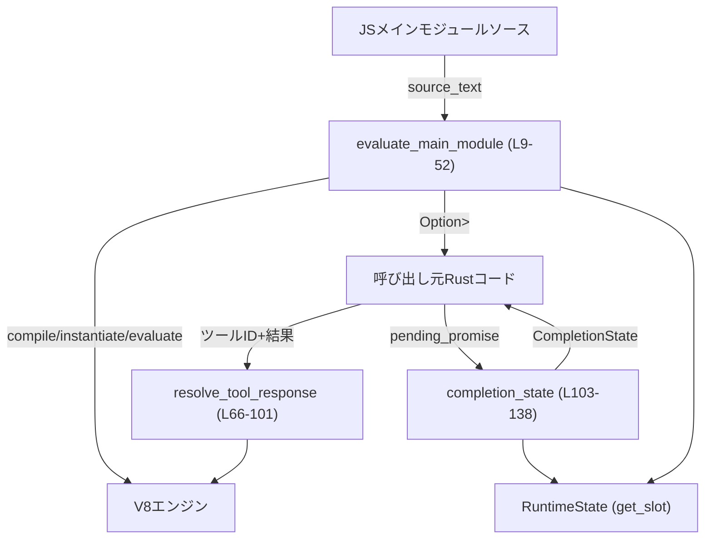
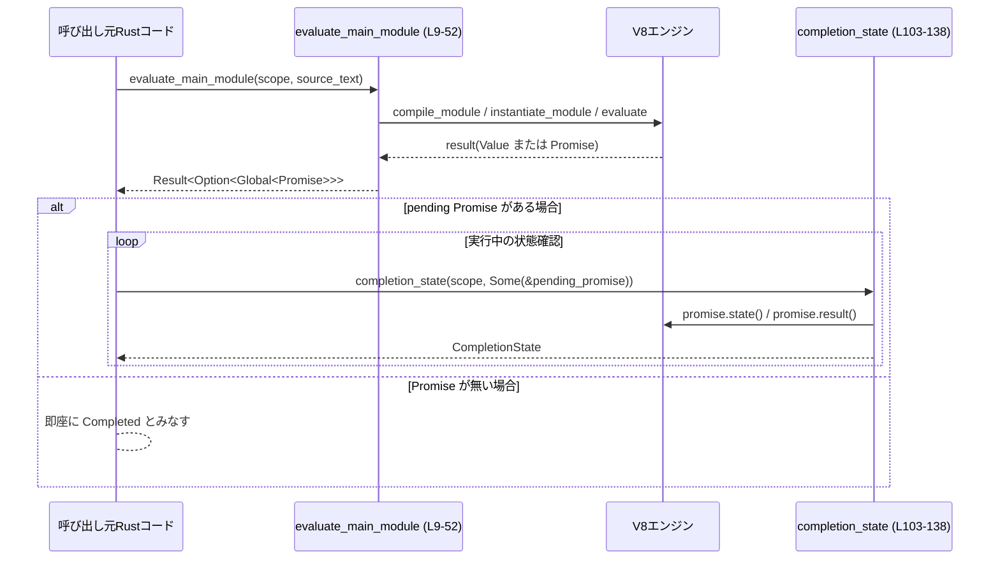

# code-mode/src/runtime/module_loader.rs

## 0. ざっくり一言

V8 の `Module` をコンパイル・実行し、その結果の `Promise` 状態やツール呼び出しの完了を Rust 側で管理するランタイムブリッジのモジュールです（`evaluate_main_module` / `completion_state` / `resolve_tool_response` など）。  

---

## 1. このモジュールの役割

### 1.1 概要

- このモジュールは **V8 上で実行するメイン ES モジュールの評価** と、  
  **実行状態の確認・ツール呼び出し結果の反映** を行います。
- 具体的には:
  - JS ソース文字列をモジュールとしてコンパイル・インスタンス化・評価する（`evaluate_main_module`）  
    （`code-mode/src/runtime/module_loader.rs:L9-52`）
  - 外部ツールから返ってきた JSON/エラーを、V8 内の `Promise` に resolve/reject する  
    （`resolve_tool_response`、`L66-101`）
  - 実行中の `Promise` の状態と、`RuntimeState.stored_values` をまとめて返す  
    （`completion_state`、`L103-138`）
- ES `import` / `import()` は、現状 **すべて「サポートされていない」例外として扱う** 設計になっています  
  （`resolve_module` が常に例外を投げて `None` を返す、`L223-235`）。

### 1.2 アーキテクチャ内での位置づけ

このモジュールは、V8 のモジュール実行と、ランタイム状態 (`RuntimeState`)・完了状態 (`CompletionState`) の橋渡しをします。



- `RuntimeState` は V8 の `PinScope` にスロットとして保存されており、  
  `exit_requested` / `stored_values` / `pending_tool_calls` が利用されています  
  （`L59-60`, `L73-75`, `L108-110`）。
- `value_to_error_text` / `json_to_v8` は、V8 値との相互変換とエラーテキスト生成を担うユーティリティです  
  （`L6-7`, `L84-85`, `L97-98`, `L131-132`）。

### 1.3 設計上のポイント

- **例外処理の一元化**
  - V8 の例外は `v8::TryCatch` によって捕捉され、`value_to_error_text` で文字列化して `Err(String)` として返しています  
    （`evaluate_main_module:L13-14,L19-23,L24-30,L31-41`,  
      `resolve_tool_response:L79-81,L94-99`）。
- **「正常終了による中断」と「エラー」の区別**
  - `EXIT_SENTINEL` 文字列と `RuntimeState.exit_requested` の組み合わせを検知する `is_exit_exception` により、  
    **ホスト要求による終了** と **エラーによる失敗** を区別します（`L54-64`）。
- **Promise ベースの非同期実行管理**
  - メインモジュール評価の結果が `Promise` なら `Global<Promise>` として保持し、  
    後から `completion_state` で状態確認できるようにしています（`L45-49`, `L103-138`）。
- **import を明示的に不サポート**
  - 静的 import / 動的 `import()` ともに、`resolve_module` が例外を投げて `None` を返す実装で、  
    現状は「exec では import は使えない」というポリシーになっています（`L164-173`, `L175-220`, `L223-235`）。
- **スレッド安全性**
  - すべての公開関数が `&mut v8::PinScope` を受け取るため、同一スコープ／Isolate に対して  
    複数スレッドから同時に操作することはコンパイル時に防がれます。

---

## 2. 主要な機能一覧（コンポーネントインベントリー）

### 2.1 関数一覧

| 名前 | 種別 | 可視性 | 行範囲 | 役割 |
|------|------|--------|--------|------|
| `evaluate_main_module` | 関数 | `pub(super)` | `module_loader.rs:L9-52` | JS ソースをモジュールとしてコンパイル・インスタンス化・評価し、トップレベル `Promise` を返す |
| `is_exit_exception` | 関数 | private | `L54-64` | 例外が `EXIT_SENTINEL` かつ `RuntimeState.exit_requested` のときに「正常終了」と判定する |
| `resolve_tool_response` | 関数 | `pub(super)` | `L66-101` | `RuntimeState.pending_tool_calls` に登録されている `Promise` を、ツール結果で resolve/reject する |
| `completion_state` | 関数 | `pub(super)` | `L103-138` | `RuntimeState.stored_values` と pending `Promise` の状態から `CompletionState` を構築する |
| `script_origin` | 関数 | private | `L141-161` | V8 用の `ScriptOrigin` を生成するユーティリティ |
| `resolve_module_callback` | 関数 | private | `L164-173` | V8 の静的 import 解決用コールバック。`resolve_module` に委譲 |
| `dynamic_import_callback` | 関数 | `pub(super)` | `L175-220` | V8 の動的 `import()` 用コールバック。`Promise` を返し、`resolve_module` に委譲 |
| `resolve_module` | 関数 | private | `L223-235` | すべての import に対して「Unsupported import in exec」とする例外を投げる |

### 2.2 外部コンポーネント（このファイルから参照されるもの）

| 名前 | 種別 | 使用箇所 | 説明（コードから分かる範囲） |
|------|------|----------|-------------------------------|
| `RuntimeState` | 構造体 | `L59-60,L73-75,L108-110` | `exit_requested: bool`、`stored_values`、`pending_tool_calls` を保持するランタイム状態 |
| `CompletionState` | 列挙体 | `L3,L103-138` | `Pending` と、`Completed { stored_values, error_text }` らしきバリアントを持つ完了状態 |
| `EXIT_SENTINEL` | 定数 | `L4,L62-63` | 終了要求を表す特別な文字列。例外メッセージと比較される |
| `json_to_v8` | 関数 | `L6,L84-85` | `serde_json::Value` を V8 値に変換する |
| `value_to_error_text` | 関数 | `L7,L20-22,L28-29,L38,L97-98,L131-132` | V8 の例外値からエラーメッセージ文字列を生成する |

---

## 3. 公開 API と詳細解説

### 3.1 型一覧（このファイルで定義される型）

このファイル内で新たに定義される構造体・列挙体はありません。

ただし、上位モジュールから以下の型が利用されています。

| 名前 | 種別 | 役割 / 用途 | 根拠 |
|------|------|-------------|------|
| `CompletionState` | 列挙体 | `Pending` または `Completed { stored_values, error_text }` を表現する完了状態 | `completion_state` の戻り値と `CompletionState::Pending` / `CompletionState::Completed { .. }` の使用（`L103-138`） |
| `RuntimeState` | 構造体 | ランタイムの共有状態。`exit_requested` フラグ、`stored_values`、`pending_tool_calls` を保持 | `get_slot::<RuntimeState>` とフィールドアクセスから（`L59-60,L73-75,L108-110`） |

フィールドやその他の詳細な定義は、このチャンクには存在しません。

---

### 3.2 関数詳細

#### `evaluate_main_module(scope: &mut v8::PinScope<'_, '_>, source_text: &str) -> Result<Option<v8::Global<v8::Promise>>, String>`

**概要**

- 渡された JS ソース文字列を ES モジュールとしてコンパイル・インスタンス化・評価し、  
  トップレベルの戻り値が `Promise` であれば `Global<Promise>` を返します（`L9-52`）。
- 評価中に発生した V8 例外は文字列化されて `Err(String)` として返されます。

**引数**

| 引数名 | 型 | 説明 |
|--------|----|------|
| `scope` | `&mut v8::PinScope<'_, '_>` | V8 コンテキストを操作するスコープ。例外捕捉や文字列生成に使用（`L13-18`） |
| `source_text` | `&str` | 実行する JS モジュールソース（`L15-16`） |

**戻り値**

- `Ok(Some(Global<Promise>))`  
  - モジュール評価結果が `Promise` のとき、その `Promise` をグローバルに保持したハンドル。
- `Ok(None)`  
  - 評価が同期的に完了し `Promise` でない結果だった場合、または `EXIT_SENTINEL` による正常終了例外が発生した場合（`L31-37,L45-51,L54-64`）。
- `Err(String)`  
  - コンパイル／インスタンス化／評価中にエラーが発生した場合のメッセージ（`L19-23,L24-30,L31-41`）。

**内部処理の流れ**

1. `v8::TryCatch` で `scope` をラップし、例外を捕捉できるようにする（`L13-14`）。
2. `source_text` から V8 文字列を生成し、失敗したら `"failed to allocate exec source"` で `Err` を返す（`L15-16`）。
3. `"exec_main.mjs"` をリソース名として `script_origin` を生成し、失敗したらそのまま `Err` を返す（`L17,L141-161`）。
4. `v8::script_compiler::Source` を作成し、`compile_module` でモジュールをコンパイルする。失敗時は `tc.exception()` を `value_to_error_text` で文字列化して `Err`（`L18-23`）。
5. `instantiate_module` を `resolve_module_callback` 付きで呼び出し、失敗時も同様に例外を `Err` で返す（`L24-30,L164-173,L223-235`）。
6. `module.evaluate` を呼び、戻り値に応じて:
   - `Some(result)` の場合は続行（`L31-32`）。
   - `None` の場合、`tc.exception()` があれば
     - `is_exit_exception` が `true` なら `Ok(None)` （正常終了扱い）（`L34-37,L54-64`）。
     - それ以外なら `value_to_error_text` で `Err`（`L34-39`）。
     - 例外も取れなければ `"unknown code mode exception"` で `Err`（`L40`）。
7. `tc.perform_microtask_checkpoint()` を呼び、保留中のマイクロタスク（Promise の then など）を実行（`L43`）。
8. 評価結果 `result` が `Promise` か判定し、そうであれば `Local<Promise>` に変換して `Global<Promise>` に昇格し `Ok(Some(...))` を返す（`L45-49`）。
9. `Promise` でなければ `Ok(None)` を返す（`L51`）。

**Examples（使用例）**

※ `scope` の生成方法はこのファイルには現れないため、省略します。

```rust
// JS モジュールを評価する例
fn run_main(scope: &mut v8::PinScope) -> Result<(), String> {
    // 実行するモジュール（簡単な例）
    let source = r#"
        export const value = 1;
    "#;

    // モジュールを評価
    let pending = evaluate_main_module(scope, source)?; // エラーなら Err(String) が返る

    // トップレベルが Promise でなければすぐ完了
    if pending.is_none() {
        return Ok(());
    }

    // Promise がある場合は、呼び出し元で completion_state を使って完了を監視する
    Ok(())
}
```

**Errors / Panics**

- `Err(String)` になる条件:
  - V8 文字列の生成に失敗（`L15-16`）
  - `ScriptOrigin` / source map URL の生成に失敗（`L141-148` 間接的）
  - モジュールコンパイル・インスタンス化・評価のいずれかで例外が発生（`L19-23,L24-30,L31-41`）
- `panic!` は使用されていません。

**Edge cases（エッジケース）**

- `source_text` が空文字列でもコンパイルは試みられます。JS 側で構文エラーになれば `Err` になります（コンパイル失敗時のパス、`L19-23`）。
- import 文を含むモジュールは、`resolve_module` が必ず例外を投げるため、インスタンス化段階で `Err("Unsupported import in exec: ...")` に相当するメッセージで失敗します（`L24-30,L223-235`）。
- 評価時に `EXIT_SENTINEL` 例外が投げられ、かつ `exit_requested` が `true` の場合のみ、`Ok(None)` として「正常終了」とみなされます（`L31-37,L54-64`）。

**使用上の注意点**

- import や `import()` を含むコードは、この実装ではサポートされず、必ずエラーになります。
- `Ok(None)` は「同期完了」だけでなく「EXIT_SENTINEL による終了」の場合も含むため、呼び出し側は `CompletionState` などと合わせて意味付けする必要があります。
- `perform_microtask_checkpoint` 後に追加で例外が発生しても、この関数内では再チェックしていません。マイクロタスク中のエラーを検出するかどうかは、上位の設計に依存します。

---

#### `resolve_tool_response(scope: &mut v8::PinScope<'_, '_>, id: &str, response: Result<JsonValue, String>) -> Result<(), String>`

**概要**

- `RuntimeState.pending_tool_calls` に登録されているツール呼び出し用 `PromiseResolver` を取り出し、  
  ツールからの結果（JSON またはエラーメッセージ）で resolve または reject します（`L66-101`）。

**引数**

| 引数名 | 型 | 説明 |
|--------|----|------|
| `scope` | `&mut v8::PinScope<'_, '_>` | V8 スコープ。`RuntimeState` へのアクセスと V8 値生成に利用（`L72-75,L84-90`） |
| `id` | `&str` | ツール呼び出しを識別する ID。`pending_tool_calls` のキーとして使用（`L68,L75-77`） |
| `response` | `Result<JsonValue, String>` | ツール結果。成功時は JSON、失敗時はエラーテキスト（`L69,L82-93`） |

**戻り値**

- `Ok(())`  
  - 対応する `Promise` を正常に resolve/reject できた場合。
- `Err(String)`  
  - ランタイム状態が利用できない、該当 ID が登録されていない、または resolve/reject 中に V8 例外が発生した場合。

**内部処理の流れ**

1. `RuntimeState` を `scope.get_slot_mut::<RuntimeState>()` で取得し、失敗したら `"runtime state unavailable"` で `Err`（`L72-75`）。
2. `state.pending_tool_calls.remove(id)` で ID に対応する resolver を取り出し、存在しなければ `"unknown tool call`{id}`"` で `Err`（`L71-77`）。
3. 新しい `TryCatch` スコープ `tc` を作り、resolver を `Local` ハンドルに変換（`L79-81`）。
4. `response` に応じて:
   - `Ok(JsonValue)` の場合、`json_to_v8` で V8 値に変換し、`resolver.resolve(&tc, value)` を呼ぶ（`L82-87`）。
   - `Err(error_text)` の場合、V8 文字列を生成し、`resolver.reject(&tc, value.into())` を呼ぶ（`L88-92`）。
5. `tc.has_caught()` を確認し、例外があれば `value_to_error_text` でメッセージ化して `Err`（`L94-99`）。
6. 問題なければ `Ok(())` を返す（`L100`）。

**Examples（使用例）**

```rust
// ツール実行後に JS 側の Promise を解決する例
fn on_tool_finished(
    scope: &mut v8::PinScope,
    call_id: &str,
    tool_result: Result<serde_json::Value, String>,
) -> Result<(), String> {
    // 成功/失敗をそのまま JS 側の Promise に伝搬する
    resolve_tool_response(scope, call_id, tool_result)
}
```

**Errors / Panics**

- `Err(String)` になる条件:
  - `RuntimeState` スロットが設定されていない（`L72-75`）。
  - `pending_tool_calls` に該当 ID が存在しない（`L71-77`）。
  - `json_to_v8` や V8 文字列生成に失敗（`L84-90`）。
  - resolver の `resolve` / `reject` 実行中に V8 例外が発生し、`value_to_error_text` で文字列化された場合（`L94-99`）。
- `panic!` は使用されていません。

**Edge cases（エッジケース）**

- 同じ `id` に対して複数回呼び出すと、2 回目以降は `pending_tool_calls.remove` が `None` を返すため `"unknown tool call ..."` エラーになります（`L71-77`）。
- `json_to_v8` がサポートしていない JSON 型（例えば非常に大きな数値など）を渡した場合、`"failed to serialize tool response"` エラーになります（`L84-86`）。

**使用上の注意点**

- `id` と `pending_tool_calls` の管理はこのファイルには無く、他の場所で一貫して管理されている前提です。
- ツールエラー文字列はそのまま JS 世界へ渡されるため、内部情報を含めるかどうかは上位の設計で判断する必要があります。

---

#### `completion_state(scope: &mut v8::PinScope<'_, '_>, pending_promise: Option<&v8::Global<v8::Promise>>) -> CompletionState`

**概要**

- `RuntimeState.stored_values` と、オプションの pending `Promise` の状態に基づき、  
  実行の完了状態 `CompletionState` を返します（`L103-138`）。

**引数**

| 引数名 | 型 | 説明 |
|--------|----|------|
| `scope` | `&mut v8::PinScope<'_, '_>` | `RuntimeState` と V8 `Promise` の状態取得に使用 |
| `pending_promise` | `Option<&v8::Global<v8::Promise>>` | 実行中のトップレベル `Promise` へのハンドル（`L105-106,L119-120`） |

**戻り値**

- `CompletionState::Pending`  
  - `pending_promise` があり、その `Promise` の状態が `Pending` の場合（`L119-121`）。
- `CompletionState::Completed { stored_values, error_text }`  
  - `Promise` が存在しない、または `Fulfilled`/`Rejected` の場合。  
  - `error_text` には、reject された理由の文字列表現、ただし `EXIT_SENTINEL` の場合は `None` が入ります（`L112-137`）。

**内部処理の流れ**

1. `RuntimeState` の `stored_values` を取得し、クローンしてローカルに保持。スロットが無ければデフォルト値（`L107-110`）。
2. `pending_promise` が `None` なら、すぐに `Completed { stored_values, error_text: None }` を返す（`L112-117`）。
3. `pending_promise` がある場合は `Local<Promise>` に変換し、その状態を取得（`L119-120`）。
4. 状態に応じて:
   - `Pending` → `CompletionState::Pending`（`L121`）。
   - `Fulfilled` → エラー無しで `Completed`（`L122-125`）。
   - `Rejected` → `Promise.result(scope)` で理由を取り出し、`is_exit_exception` なら `error_text: None`、それ以外なら `value_to_error_text` の結果を `Some` として `Completed`（`L126-137`）。

**Examples（使用例）**

```rust
fn poll_execution(
    scope: &mut v8::PinScope,
    pending: Option<&v8::Global<v8::Promise>>,
) -> CompletionState {
    completion_state(scope, pending)
}
```

**Edge cases（エッジケース）**

- `RuntimeState` スロットが存在しない場合、`stored_values` は `Default::default()` にフォールバックします（`L107-110`）。
- `Promise` が reject され、かつ exit sentinel でない場合、`error_text` に詳細なエラー文字列が格納されます（`L126-132`）。
- exit sentinel による reject の場合は `error_text: None` となり、「エラーではない完了」として扱えます（`L127-131`）。

**使用上の注意点**

- `CompletionState::Pending` が返る間は、呼び出し側が適宜ポーリングやイベントループ駆動を行う必要があります。
- `stored_values` の内容や型はこのチャンクには現れないため、利用時には別途定義を確認する必要があります。

---

#### `dynamic_import_callback<'s>(scope: &mut v8::PinScope<'s, '_>, …) -> Option<v8::Local<'s, v8::Promise>>`

**概要**

- V8 の動的 import (`import()`) に対するホスト側コールバックです（`L175-220`）。
- モジュール解決を `resolve_module` に委譲し、その結果に応じて `Promise` を resolve/reject します。
- 現状 `resolve_module` が常に失敗するため、**すべての `import()` は reject される Promise を返す** ことになります（`L223-235`）。

**主な引数**

| 引数名 | 型 | 説明 |
|--------|----|------|
| `scope` | `&mut v8::PinScope<'s, '_>` | V8 スコープ |
| `_host_defined_options` | `v8::Local<'s, v8::Data>` | ホスト定義オプション（未使用）（`L177`） |
| `_resource_name` | `v8::Local<'s, v8::Value>` | インポート元リソース名（未使用）（`L178`） |
| `specifier` | `v8::Local<'s, v8::String>` | `import()` のモジュール指定子（`L179,L182`） |
| `_import_attributes` | `v8::Local<'s, v8::FixedArray>` | import attributes（未使用）（`L180`） |

**戻り値**

- `Some(Local<Promise>)`  
  - 動的 import のためにホストが生成した `Promise`。resolve/reject 状態は内部で決定。
- `None`  
  - `PromiseResolver::new(scope)` の生成に失敗した場合（`L183`）。

**内部処理の流れ**

1. `specifier` を Rust 文字列へ変換（`to_rust_string_lossy`）（`L182`）。
2. `v8::PromiseResolver::new(scope)?` で resolver を生成。失敗したら `None` を返す（`L183`）。
3. `resolve_module(scope, &specifier)` を呼び、結果に応じて分岐（`L185-186`）。
4. `Some(module)` の場合:
   - `ModuleStatus::Uninstantiated` なら `instantiate_module` を試み、失敗したら `"failed to instantiate module"` で reject（`L187-197`）。
   - `ModuleStatus::Instantiated | Evaluated` の場合、`evaluate` を呼び、失敗したら `"failed to evaluate module"` で reject（`L198-207`）。
   - それ以外の成功ケースでは `module.get_module_namespace()` を resolve 値として、Promise を返す（`L209-211`）。
5. `None` の場合:
   - `"unsupported import in exec"` という文字列で reject し、Promise を返す（`L213-219`）。

**Edge cases（エッジケース）**

- 現状の `resolve_module` 実装は常に `None` を返すため（`L223-235`）、実際には `Some(module)` 分岐には到達しません。
- `specifier` 文字列の内容によって挙動が変わることはなく、すべて `"unsupported import in exec"` で reject されます（`L214-217`）。

**使用上の注意点**

- この実装のままでは、JS コード内で `import()` を使うことはできません（すべて reject）。
- `resolve_module` を実装しても、`instantiate_module` / `evaluate` で V8 例外が発生する可能性があるため、適切なエラーハンドリングが必要です。

---

#### `is_exit_exception(scope: &mut v8::PinScope<'_, '_>, exception: v8::Local<'_, v8::Value>) -> bool`

**概要**

- 例外値が「EXIT_SENTINEL 文字列」かつ `RuntimeState.exit_requested == true` であれば、  
  exit 専用の例外として扱うための判定関数です（`L54-64`）。

**内部ロジック**

1. `scope.get_slot::<RuntimeState>()` で状態を取得し、`state.exit_requested` を得る。スロットが無ければ `false`（`L58-61`）。
2. その上で
   - `exception.is_string()` かつ
   - 文字列化した結果が `EXIT_SENTINEL` と等しい
   場合に `true` を返す（`L62-63`）。

**使用箇所**

- `evaluate_main_module` で「EXIT_SENTINEL による終了」を検出するために使用（`L34-37`）。
- `completion_state` で Promise reject が exit によるものかを判定するために使用（`L126-129`）。

**使用上の注意点**

- `EXIT_SENTINEL` 文字列を JS 側から直接 throw しても、`exit_requested` が `true` でなければ exit とみなされません。

---

#### `resolve_module<'s>(scope: &mut v8::PinScope<'s, '_>, specifier: &str) -> Option<v8::Local<'s, v8::Module>>`

**概要**

- 現状の実装では、**すべてのモジュール指定子に対して例外を投げ、`None` を返す** 関数です（`L223-235`）。
- 静的 import (`resolve_module_callback`) と動的 import (`dynamic_import_callback`) の両方から利用されます。

**内部処理**

1. `"Unsupported import in exec: {specifier}"` というメッセージの V8 文字列生成を試みる（`L227-229`）。
2. 生成に成功した場合、その文字列で `scope.throw_exception` を呼び出す（`L230`）。
3. 生成に失敗した場合、`undefined` 値で `throw_exception` を呼び出す（`L231-232`）。
4. 常に `None` を返す（`L234`）。

**使用上の注意点**

- import 支援を実装する場合は、この関数を差し替えることが想定されます。
- 現状は「exec では import を使わせない」というポリシーを強制する役割を持っています。

---

### 3.3 その他の関数

| 関数名 | 役割（1 行） | 根拠 |
|--------|--------------|------|
| `script_origin` | 指定されたリソース名から V8 用の `ScriptOrigin` を組み立てるユーティリティ | `L141-161` |
| `resolve_module_callback` | 静的 import 解決時に V8 から呼ばれ、`resolve_module` を呼び出す | `L164-173` |

---

## 4. データフロー

ここでは、「メインモジュールの評価から完了状態取得まで」の一連の流れを示します。



- `evaluate_main_module` が `Ok(Some(promise))` を返した場合、呼び出し側は `pending_promise` として保持し、`completion_state` で状態を監視します。
- `Ok(None)` の場合は、同期完了または exit sentinel による終了とみなされます。
- `CompletionState::Completed` に含まれる `stored_values` は、`RuntimeState` に蓄えられた結果であり、どのように更新されるかは別モジュールで定義されています（`L107-110`）。

---

## 5. 使い方（How to Use）

### 5.1 基本的な使用方法

メインモジュールの実行と完了状態の取得の流れの一例です。

```rust
fn run_js_main(scope: &mut v8::PinScope) -> Result<(), String> {
    // 1. 実行する JS モジュールソースを用意する
    let source = r#"
        // 例: トップレベルで非同期処理を行う
        export default (async () => {
            // ...
        })();
    "#;

    // 2. モジュールを評価する
    let pending = evaluate_main_module(scope, source)?; // エラーなら Err(String)

    // 3. Promise がある場合は、その状態を監視する
    let mut pending = pending;
    loop {
        let state = completion_state(
            scope,
            pending.as_ref(), // Option<&Global<Promise>>
        );

        match state {
            CompletionState::Pending => {
                // ここでホスト側のイベントループを回す、等の処理を行う
            }
            CompletionState::Completed { stored_values, error_text } => {
                if let Some(err) = error_text {
                    eprintln!("JS error: {err}");
                } else {
                    // 正常完了。stored_values の利用は別モジュールの定義に依存
                }
                break;
            }
        }
    }

    Ok(())
}
```

### 5.2 よくある使用パターン

1. **純粋に同期的なモジュール**
   - トップレベルが `Promise` でない → `evaluate_main_module` は `Ok(None)` を返し、即座に `CompletionState::Completed` になります。

2. **トップレベルで `async` / `Promise` を返すモジュール**
   - `evaluate_main_module` が `Ok(Some(promise))` を返すため、その `promise` を保持しつつ `completion_state` で状態を監視します。

3. **外部ツール連携**
   - どこかで `RuntimeState.pending_tool_calls` に `PromiseResolver` が登録されている前提で、
   - ツール完了時に `resolve_tool_response(scope, id, result)` を呼び、JS 側の Promise を解決します（`L66-101`）。

### 5.3 よくある間違い

```rust
// 間違い例: import を含むコードをそのまま実行しようとする
let source = r#"import x from "./x.mjs";"#;
let r = evaluate_main_module(scope, source);
// → resolve_module が必ず例外を投げるため、Err("Unsupported import in exec: ...") 相当になる

// 正しい例: この実装のままでは import を使わないコードに限定する
let source = r#"export const x = 1;"#;
let r = evaluate_main_module(scope, source);
```

```rust
// 間違い例: resolve_tool_response に存在しない ID を渡す
let result = resolve_tool_response(scope, "unknown-id", Ok(json!({"ok": true})));
// → "unknown tool call `unknown-id`" の Err になる（L71-77）
```

### 5.4 使用上の注意点（まとめ）

- **import / dynamic import は非サポート**  
  - `resolve_module` が必ず例外を投げるため、静的・動的いずれの import も使用できません（`L223-235`）。
- **exit sentinel の扱い**  
  - `EXIT_SENTINEL` を exit シグナルとして使う設計になっており、それ以外の例外はエラー文字列として扱われます（`L54-64`）。
- **エラー情報は文字列のみ**  
  - すべてのエラーは `String` に変換されるため、スタックトレースなどの詳細をどこまで含めるかは `value_to_error_text` の実装に依存します。
- **潜在的なセキュリティ上の注意**  
  - ツールエラーや import 失敗メッセージに、内部情報（パスなど）を含めるかどうかは、`value_to_error_text` や `resolve_module` のメッセージ設計に依存します（`L227-229`）。  

---

## 6. 変更の仕方（How to Modify）

### 6.1 新しい機能を追加する場合

**例: import をサポートしたい場合**

1. **モジュール解決ロジックの実装**
   - `resolve_module` において、`specifier` から実際のソースを取得し、`v8::Module` を生成する処理を実装します（`L223-235`）。
   - `script_origin` を再利用して、適切な `ScriptOrigin` を付与すると一貫性があります（`L141-161`）。

2. **動的 import 対応**
   - `dynamic_import_callback` の `Some(module)` 分岐が実際に使われるようになるため、  
     モジュールキャッシュ・再利用ポリシーなどを設計します（`L185-212`）。

3. **エラー設計**
   - import 失敗時に返すメッセージが、セキュリティ上適切かどうか（パス漏えいなど）を検討します（`L227-229`）。

### 6.2 既存の機能を変更する場合

- **終了条件の変更**
  - EXIT_SENTINEL の値や exit 判定条件を変えたい場合は、`EXIT_SENTINEL` 定数の定義側と `is_exit_exception`（`L54-64`）、およびそれを使用している `evaluate_main_module` / `completion_state`（`L34-37,L126-129`）を見直す必要があります。
- **エラーメッセージの改善**
  - 例外メッセージや `"unknown code mode exception"` といったフォールバックメッセージ（`L22-23,L29-30,L40,L98-99`）を変更する場合は、ログやユーザー向け表示との整合性を確認する必要があります。
- **パフォーマンス面**
  - `stored_values.clone()`（`L107-110`）は内容によってはコストが高くなりうるため、大きなデータを格納する場合は参照ベースの設計に変更するかを検討します。

---

## 7. 関連ファイル

このモジュールと密接に関係するコンポーネント（モジュールパスベースで記述します）。

| モジュール / パス | 役割 / 関係 |
|-------------------|------------|
| `super::RuntimeState` | V8 スコープのスロットとして格納されるランタイム共有状態。`exit_requested` / `stored_values` / `pending_tool_calls` を提供（`L59-60,L73-75,L108-110`）。 |
| `super::CompletionState` | `completion_state` の戻り値として、実行状態（Pending / Completed）を表現する列挙体（`L3,L103-138`）。 |
| `super::EXIT_SENTINEL` | exit 判定用の特別な文字列定数。`is_exit_exception` で使用（`L4,L62-63`）。 |
| `super::value::json_to_v8` | JSON → V8 値変換ユーティリティ。ツール応答のシリアライズに使用（`L6,L84-85`）。 |
| `super::value::value_to_error_text` | V8 例外値 → エラーテキスト変換ユーティリティ。各所のエラーパスで使用（`L7,L20-22,L28-29,L38,L97-98,L131-132`）。 |

テストコードや、`RuntimeState` / `CompletionState` の具体的な定義を含むファイルは、このチャンクには現れないため不明です。
