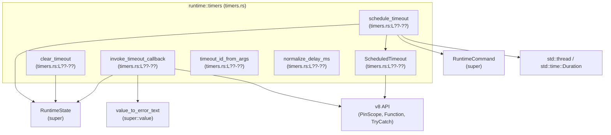

# code-mode/src/runtime/timers.rs

## 0. ざっくり一言

JavaScript の `setTimeout` / `clearTimeout` 相当のタイマー機能を、V8 と Rust ランタイムの間で橋渡しするモジュールです。  
コールバック関数を保持し、別スレッドでの待機後にランタイムへ「タイムアウトが発火した」というコマンドを送ります。

---

## 1. このモジュールの役割

### 1.1 概要

- このモジュールは **V8 上の JavaScript コードからのタイマー要求**（`setTimeout` / `clearTimeout`）を処理するために存在します。
- V8 の `FunctionCallback` として呼び出される関数を通じて
  - コールバック関数と遅延時間を保持し
  - `std::thread::spawn` でスレッドを起動して待機し
  - 待機完了後に `RuntimeCommand::TimeoutFired { id }` をランタイムに送信します。
- さらに、別の場所から呼び出される `invoke_timeout_callback` により、保持していた V8 の関数を実際に呼び出します。

### 1.2 アーキテクチャ内での位置づけ

このモジュールが依存している主なコンポーネントを示します（行番号はこのチャンクからは取得できないため `L??-??` と表記します）。



- `RuntimeState` / `RuntimeCommand` / `value_to_error_text` は `super` モジュールに定義されていますが、このチャンクには定義本体は現れません。
- V8 の `PinScope`, `Function`, `TryCatch` を直接扱い、Rust 側のスレッドとチャネルで非同期動作を実現しています。

### 1.3 設計上のポイント

コードから読み取れる特徴を列挙します。

- **責務の分離**
  - `schedule_timeout` が **登録とスレッド起動** を担当します。
  - `clear_timeout` が **登録済みタイマーのキャンセル（コールバックの破棄）** を担当します。
  - `invoke_timeout_callback` が **タイムアウト発火時の JS コールバック呼び出しと例外処理** を担当します。
  - `timeout_id_from_args` / `normalize_delay_ms` が引数のパース・正規化を担当します。
- **状態管理**
  - `RuntimeState` 内の
    - `next_timeout_id` による ID 採番（`saturating_add(1)` によるオーバーフロー安全な加算）  
    - `pending_timeouts` による `timeout_id -> ScheduledTimeout` の保存
    - `runtime_command_tx`（チャネル送信側）の複製
    を行っています。
- **エラーハンドリング**
  - API 返り値は `Result<…, String>` として、失敗時に人間可読なエラーメッセージを返します。
  - V8 コールバック実行時は `v8::TryCatch` を使用し、例外をキャッチして `value_to_error_text` で文字列化します。
  - ランタイム状態が取得できない場合（`get_slot_mut::<RuntimeState>()` が `None` の場合）は `"runtime state unavailable"` というエラー文字列を返します。
- **並行性**
  - タイマーの待機自体は **専用スレッド** で行い、待機後に `RuntimeCommand::TimeoutFired` をチャネルで送信します。
  - V8 へのアクセス（コールバック呼び出し）は `invoke_timeout_callback` 内でのみ行われており、`PinScope` 上で実行されるため、V8 のスレッド安全性を保ちやすい構造になっています。
  - タイマーをクリアしても、スリープ中のスレッドは停止しませんが、`invoke_timeout_callback` が `pending_timeouts` からエントリを取得できなければ何も行わず終了するため、JS コールバックは実行されません。

---

## 2. 主要な機能一覧

- `ScheduledTimeout` 構造体: V8 のコールバック関数（`v8::Global<v8::Function>`）を保持するコンテナ。
- `schedule_timeout`: JS の `setTimeout` 相当。コールバックと遅延を登録し、スレッドを起動してタイムアウトコマンドを送信する。
- `clear_timeout`: JS の `clearTimeout` 相当。指定された ID のタイマーを `pending_timeouts` から削除する。
- `invoke_timeout_callback`: タイムアウト ID に対応する V8 コールバックを取り出して呼び出し、例外を `Err(String)` として報告する。
- `timeout_id_from_args`: JS 側から渡されたタイマー ID 引数を検証し、`Option<u64>` に変換するユーティリティ。
- `normalize_delay_ms`: 遅延時間（ミリ秒）の `f64` を `u64` に正規化するユーティリティ（非有限値や負値は 0、非常に大きな値は `u64::MAX` にクリップ）。

---

## 3. 公開 API と詳細解説

### 3.1 型一覧（構造体・列挙体など）

| 名前               | 種別     | 役割 / 用途                                                                 | 定義位置                    |
|--------------------|----------|-----------------------------------------------------------------------------|-----------------------------|
| `ScheduledTimeout` | 構造体   | タイマーに対応する V8 コールバック関数（`v8::Global<v8::Function>`）を保持 | `timers.rs:L??-??`（不明） |

- フィールド:
  - `callback: v8::Global<v8::Function>`  
    V8 の関数をガーベジコレクションとスコープの外まで保持するためのグローバルハンドルです。（`timers.rs:L??-??`）

### 3.2 関数詳細

#### `schedule_timeout(scope: &mut v8::PinScope<'_, '_>, args: v8::FunctionCallbackArguments) -> Result<u64, String>`

**概要**

- JS の `setTimeout` 相当のエントリポイントです（`timers.rs:L??-??`）。
- 引数からコールバックと遅延時間（ミリ秒）を取得し、`RuntimeState` に登録した上で、別スレッドで待機し、待機後に `RuntimeCommand::TimeoutFired { id }` を送信します。
- 正常終了時は割り当てた `timeout_id`（`u64`）を返します。

**引数**

| 引数名  | 型                               | 説明 |
|---------|----------------------------------|------|
| `scope` | `&mut v8::PinScope<'_, '_>`      | V8 の現在のスコープ。コールバックの型変換やグローバルハンドルの作成、`RuntimeState` の取得に使用します。 |
| `args`  | `v8::FunctionCallbackArguments`  | JS 側から渡された `setTimeout` の引数。<br>0 番目にコールバック、1 番目に遅延ミリ秒が入っている想定です。 |

**戻り値**

- `Ok(u64)`  
  登録されたタイマーの ID。`RuntimeState.next_timeout_id` から採番されます。
- `Err(String)`  
  - コールバック引数が関数でない場合（`"setTimeout expects a function callback"`）。
  - `RuntimeState` がスコープから取得できない場合（`"runtime state unavailable"`）。

**内部処理の流れ**

1. `args.get(0)` で最初の引数を取得し、`is_function()` で関数であることを確認します。関数でなければ `Err` を返します。（`timers.rs:L??-??`）
2. `v8::Local::<v8::Function>::try_from(callback)` で型変換を試み、失敗した場合も同じエラーメッセージを返します。（`timers.rs:L??-??`）
3. 遅延時間を `args.get(1).number_value(scope)` から取得し、`map(normalize_delay_ms)` で `u64` に正規化し、変換できなければ `unwrap_or(0)` で 0ms を用います。（`timers.rs:L??-??`）
4. `v8::Global::new(scope, callback)` でコールバックをグローバルハンドルとして確保します。（`timers.rs:L??-??`）
5. `scope.get_slot_mut::<RuntimeState>()` からランタイム状態を取得し、`next_timeout_id` を読み出して `timeout_id` とし、`saturating_add(1)` で次の ID を更新します。（`timers.rs:L??-??`）
6. `runtime_command_tx` をクローンし、`pending_timeouts.insert(timeout_id, ScheduledTimeout { callback })` でタイマーを登録します。（`timers.rs:L??-??`）
7. `thread::spawn(move || { ... })` で新しいスレッドを生成し、`thread::sleep(Duration::from_millis(delay_ms))` で待機した後、`runtime_command_tx.send(RuntimeCommand::TimeoutFired { id: timeout_id })` を送信します。（`timers.rs:L??-??`）
8. 最後に `Ok(timeout_id)` を返します。

**簡易フローチャート**

```mermaid
flowchart TD
  A["引数取得<br/>callback = args.get(0)"] --> B{"callback は関数か？"}
  B -- No --> Err["Err(\"setTimeout expects a function callback\")"]
  B -- Yes --> C["v8::Function へ変換"]
  C --> D["delay_ms = normalize_delay_ms(args.get(1)) or 0"]
  D --> E["RuntimeState 取得"]
  E --> F["timeout_id = state.next_timeout_id<br/>state.next_timeout_id += 1 (飽和加算)"]
  F --> G["pending_timeouts に {id -> ScheduledTimeout{callback}} を挿入"]
  G --> H["スレッド spawn: sleep(delay_ms)"]
  H --> I["sleep 後 RuntimeCommand::TimeoutFired{id} を送信"]
  I --> J["Ok(timeout_id) を返す"]
```

**Examples（使用例・擬似コード）**

> 注意: 実際には V8 のセットアップや `FunctionCallback` 登録が必要で、このファイルだけでは完全な実行例は構成できません。

```rust
fn rust_exposed_set_timeout(
    scope: &mut v8::PinScope<'_, '_>,               // V8 から渡されるスコープ
    args: v8::FunctionCallbackArguments,            // JS の setTimeout(...args)
    mut rv: v8::ReturnValue,                        // 戻り値書き込み用
) {
    match schedule_timeout(scope, args) {           // timers.rs の関数を呼び出す
        Ok(id) => {
            let local = v8::Number::new(scope, id as f64); // JS に返すため Number に変換
            rv.set(local.into());                          // 戻り値として timeout id を返す
        }
        Err(msg) => {
            // JS 例外として報告するか、コンソールに出すなど
            eprintln!("setTimeout error: {}", msg);
        }
    }
}
```

**Errors / Panics**

- `Err` になる条件
  - コールバック引数が関数でない、または `v8::Function` への変換に失敗した場合。
  - `RuntimeState` が `scope` に紐付いていない場合（`get_slot_mut` が `None` を返す場合）。
- パニックの可能性
  - `std::thread::spawn` は、OS スレッドが作成できない場合などにパニックする可能性があります（標準ライブラリ仕様に由来）。このコードではそれを捕捉していません。

**Edge cases（エッジケース）**

- 遅延引数が与えられない、`undefined`、`null` などで数値変換できない場合  
  → `number_value` が `None` になり、`unwrap_or(0)` で 0ms として扱われます。
- 遅延が `NaN`・`Infinity`・負の値などの非有限/非正数の場合  
  → `normalize_delay_ms` によって 0ms に変換されます。
- 遅延が非常に大きな値の場合  
  → `normalize_delay_ms` 内で `u64::MAX` にクリップされます。
- タイマー登録後、`RuntimeCommand` の受信側が存在しない場合  
  → `send` の戻り値は破棄されているため、エラーは無視されます（`let _ = runtime_command_tx.send(...);`）。

**使用上の注意点**

- `schedule_timeout` は **スレッドを 1 つ生成** するため、多数のタイマーを短時間に生成するとスレッド数が増加し、リソース枯渇やスケジューリング負荷につながる可能性があります。
- `RuntimeState` が `scope` に登録されていることが前提です。登録されていないと `"runtime state unavailable"` が返ります。
- コールバックは `v8::Global` として保持されるため、`invoke_timeout_callback` で必ず取り出して解放する（`pending_timeouts.remove`）という契約に依存しています。

---

#### `clear_timeout(scope: &mut v8::PinScope<'_, '_>, args: v8::FunctionCallbackArguments) -> Result<(), String>`

**概要**

- JS の `clearTimeout` 相当のエントリポイントです（`timers.rs:L??-??`）。
- 引数からタイマー ID を読み取り、`RuntimeState.pending_timeouts` から該当エントリを削除します。
- 対応する ID が存在しないか、引数が省略等の場合は何もせず成功 (`Ok(())`) とします。

**引数**

| 引数名  | 型                               | 説明 |
|---------|----------------------------------|------|
| `scope` | `&mut v8::PinScope<'_, '_>`      | V8 スコープ。`RuntimeState` の取得に使用します。 |
| `args`  | `v8::FunctionCallbackArguments`  | JS から渡された `clearTimeout` の引数。 |

**戻り値**

- `Ok(())`
  - タイマーを正常に削除した場合。
  - 引数が省略されている、あるいは無効な ID（<= 0 など）の場合。
- `Err(String)`
  - タイマー ID が数値に変換できなかった場合（`"clearTimeout expects a numeric timeout id"`）。
  - `RuntimeState` が取得できなかった場合（`"runtime state unavailable"`）。

**内部処理の流れ**

1. `timeout_id_from_args(scope, args)?` を呼び出し、`Option<u64>` としてタイマー ID を取得します。（`timers.rs:L??-??`）
   - `Err` ならそのまま伝播（`?` 演算子）。
   - `Ok(None)` なら何もせず `Ok(())` を返します。
2. `scope.get_slot_mut::<RuntimeState>()` で状態を取得し、失敗時はエラー文字列で `Err` を返します。（`timers.rs:L??-??`）
3. `state.pending_timeouts.remove(&timeout_id);` で対応するエントリを削除します。（`timers.rs:L??-??`）
4. `Ok(())` を返します。

**Examples（使用例・擬似コード）**

```rust
fn rust_exposed_clear_timeout(
    scope: &mut v8::PinScope<'_, '_>,
    args: v8::FunctionCallbackArguments,
) {
    if let Err(msg) = clear_timeout(scope, args) {
        eprintln!("clearTimeout error: {}", msg); // ログなど
    }
}
```

**Errors / Panics**

- `Err` になる条件
  - `timeout_id_from_args` で、引数 0 番目が存在するが数値に変換できない場合。
  - `RuntimeState` が見つからない場合。
- パニックの可能性
  - この関数内では明示的なパニック要因はありません。

**Edge cases**

- 引数が 0 個、あるいは `null` / `undefined` の場合  
  → `timeout_id_from_args` が `Ok(None)` を返し、何もせず `Ok(())`。
- `NaN` / `Infinity` / 0 以下の値が渡された場合  
  → `timeout_id_from_args` が `Ok(None)` を返し、何もせず `Ok(())`。
- すでに削除された ID / 存在しない ID の場合  
  → `pending_timeouts.remove` は何もせず、エラーにはなりません。

**使用上の注意点**

- `clear_timeout` はスレッド自体を止めるわけではなく、**コールバックを実行しないようにするだけ** です。  
  スレッドはスリープ完了後に `RuntimeCommand::TimeoutFired` を送信しますが、その後 `invoke_timeout_callback` が呼ばれても該当 ID が存在しないためコールバックは実行されません。
- V8 スコープに `RuntimeState` が登録されていることが前提です。

---

#### `invoke_timeout_callback(scope: &mut v8::PinScope<'_, '_>, timeout_id: u64) -> Result<(), String>`

**概要**

- タイムアウト ID に対応する `ScheduledTimeout` を `RuntimeState.pending_timeouts` から取り出し、実際に V8 の関数を呼び出す関数です（`timers.rs:L??-??`）。
- 呼び出し中の JS 例外は `v8::TryCatch` で捕捉され、エラーメッセージ文字列として `Err(String)` で返されます。

**引数**

| 引数名      | 型                          | 説明 |
|-------------|-----------------------------|------|
| `scope`     | `&mut v8::PinScope<'_, '_>` | V8 スコープ。`RuntimeState` 取得と JS 関数呼び出しに使用します。 |
| `timeout_id`| `u64`                       | 実行対象のタイムアウト ID。`schedule_timeout` が返した値。 |

**戻り値**

- `Ok(())`
  - 対応するコールバックが存在し、例外なく実行された場合。
  - 対応する `timeout_id` がすでに `pending_timeouts` から削除されている場合（何もせず成功扱い）。
- `Err(String)`
  - `RuntimeState` の取得に失敗した場合。
  - JS コールバック実行中に例外が発生し、`TryCatch` が例外を検知した場合。

**内部処理の流れ**

1. `scope.get_slot_mut::<RuntimeState>()` で状態を取得し、失敗したら `"runtime state unavailable"` で `Err` を返します。（`timers.rs:L??-??`）
2. `state.pending_timeouts.remove(&timeout_id)` で登録されていた `ScheduledTimeout` を取り出します。（`timers.rs:L??-??`）
   - `None` の場合はすでに削除済みとみなし、`Ok(())` を返します。
3. `let tc = std::pin::pin!(v8::TryCatch::new(scope));` で TryCatch を生成し、`let mut tc = tc.init();` で初期化します。（`timers.rs:L??-??`）
4. `v8::Local::new(&tc, &callback.callback)` でグローバルハンドルからローカルな関数ハンドルを作成します。（`timers.rs:L??-??`）
5. `let receiver = v8::undefined(&tc).into();` で `this` を `undefined` として設定し、`callback.call(&tc, receiver, &[]);` でコールバックを引数なしで呼び出します。（`timers.rs:L??-??`）
6. `tc.has_caught()` で例外発生有無を確認し、発生していれば:
   - `tc.exception()` で例外オブジェクトを取得し、
   - `value_to_error_text(&mut tc, exception)` でエラーテキスト化し、
   - それを `Err(String)` として返します。  
   例外オブジェクトが取得できない（`None`）場合は `"unknown code mode exception"` を返します。（`timers.rs:L??-??`）
7. 例外がなければ `Ok(())` を返します。

**Examples（使用例・擬似コード）**

```rust
fn handle_timeout_fired(
    scope: &mut v8::PinScope<'_, '_>,
    timeout_id: u64,
) {
    if let Err(msg) = invoke_timeout_callback(scope, timeout_id) {
        // ここで JS エラーをログに残すなどの処理を行う
        eprintln!("timeout callback error: {}", msg);
    }
}
```

**Errors / Panics**

- `Err` になる条件
  - `RuntimeState` が取得できない。
  - JS コールバック実行中に例外が投げられ、`TryCatch` がそれを検知した場合。
- パニックの可能性
  - この関数内には明示的なパニック要因はありませんが、V8 バインディングが内部でパニックを起こす可能性は一般的にはあります（このチャンクからは判断できません）。

**Edge cases**

- `pending_timeouts` に `timeout_id` が存在しない場合  
  → 何もせず `Ok(())` を返します（クリア済みタイマーに対応した挙動）。
- コールバック実行中に JS 例外が発生した場合  
  → `Err("…")` が返り、呼び出し側で適宜処理する必要があります。
- `value_to_error_text` が例外オブジェクトを文字列化できない（`tc.exception()` が `None`）場合  
  → `"unknown code mode exception"` という汎用メッセージが返されます。

**使用上の注意点**

- この関数は V8 の `PinScope` 上で実行される必要があり、**JS コールバックはこのスレッド上でのみ呼び出される前提** です。
- 例外を `Err(String)` として返すことで、呼び出し側でログ出力や上位への伝播を行えるようになっています。例外を握りつぶしたい場合でも、ここで `Err` を無視するかどうかを明示的に決める必要があります。

---

#### `timeout_id_from_args(scope: &mut v8::PinScope<'_, '_>, args: v8::FunctionCallbackArguments) -> Result<Option<u64>, String>`

**概要**

- `clear_timeout` 用に、JS の引数からタイマー ID を抽出して検証するユーティリティ関数です（`timers.rs:L??-??`）。
- 正常な正の有限数値なら `Some(u64)` を返し、引数なしや `null` / `undefined`、非有限値や 0 以下なら `Ok(None)`（何もしないべき）とみなします。
- 数値変換自体が失敗した場合は `Err(String)` を返します。

**引数**

| 引数名  | 型                               | 説明 |
|---------|----------------------------------|------|
| `scope` | `&mut v8::PinScope<'_, '_>`      | 数値変換に使用する V8 スコープ。 |
| `args`  | `v8::FunctionCallbackArguments`  | JS 側から渡された引数。 |

**戻り値**

- `Ok(Some(u64))`  
  有効なタイマー ID。
- `Ok(None)`  
  - 引数なし。
  - 引数が `null` / `undefined`。
  - 非有限値（`NaN` / `Infinity`）または 0 以下の数値。
- `Err(String)`  
  引数 0 番目が存在し、かつ数値への変換に失敗した場合（`"clearTimeout expects a numeric timeout id"`）。

**内部処理の流れ**

1. `args.length() == 0` または `args.get(0).is_null_or_undefined()` の場合、`Ok(None)` を返します。（`timers.rs:L??-??`）
2. `args.get(0).number_value(scope)` を呼び出し、`Some(timeout_id)` でなければ `Err("clearTimeout expects a numeric timeout id")` を返します。（`timers.rs:L??-??`）
3. `!timeout_id.is_finite() || timeout_id <= 0.0` の場合、`Ok(None)` を返します。（`timers.rs:L??-??`）
4. 上記以外の場合、`timeout_id.trunc().min(u64::MAX as f64) as u64` により整数に切り捨て・最大値クリップを行い、`Ok(Some(...))` を返します。（`timers.rs:L??-??`）

**Examples（使用例・擬似コード）**

```rust
fn example(scope: &mut v8::PinScope, args: v8::FunctionCallbackArguments) {
    match timeout_id_from_args(scope, args) {
        Ok(Some(id)) => println!("valid timeout id: {}", id),
        Ok(None) => println!("no-op (no id given or id is non-positive/invalid)"),
        Err(e) => eprintln!("invalid timeout id: {}", e),
    }
}
```

**Errors / Panics**

- `Err` になる条件
  - 引数が存在するが、数値に変換できないと V8 に判断された場合。
- パニックの可能性
  - この関数内には明示的なパニック要因はありません。

**Edge cases**

- `clearTimeout()`（引数なし）、`clearTimeout(undefined)`、`clearTimeout(null)`  
  → `Ok(None)`。
- `clearTimeout(NaN)`、`clearTimeout(Infinity)`、`clearTimeout(0)`、`clearTimeout(-1)`  
  → `Ok(None)`。
- `clearTimeout("abc")` のように完全に数値化不可能な値  
  → `Err("clearTimeout expects a numeric timeout id")`。

**使用上の注意点**

- `Err` と `Ok(None)` の違いが重要です。`Err` は「型として数値ですらない」ケース、`Ok(None)` は「数値としては読めるが '有効な ID' とは見なさない」ケースです。
- 呼び出し側（`clear_timeout`）では `Ok(None)` を単なる no-op と扱っています。

---

#### `normalize_delay_ms(delay_ms: f64) -> u64`

**概要**

- `setTimeout` の第 2 引数（遅延ミリ秒）を `u64` に正規化するユーティリティ関数です（`timers.rs:L??-??`）。
- 非有限値や 0 以下の値は 0ms とみなし、正の有限値は整数に切り捨てた上で `u64::MAX` にクリップします。

**引数**

| 引数名    | 型    | 説明 |
|-----------|-------|------|
| `delay_ms`| `f64` | JS 側から取得した遅延ミリ秒。 |

**戻り値**

- `u64`  
  0 以上 `u64::MAX` 以下のミリ秒値。

**内部処理の流れ**

1. `if !delay_ms.is_finite() || delay_ms <= 0.0` なら 0 を返します。（`timers.rs:L??-??`）
2. それ以外の場合、`delay_ms.trunc().min(u64::MAX as f64) as u64` を返します。（`timers.rs:L??-??`）

**Examples（使用例）**

```rust
assert_eq!(normalize_delay_ms(100.9), 100);
assert_eq!(normalize_delay_ms(-5.0), 0);
assert_eq!(normalize_delay_ms(f64::NAN), 0);
assert_eq!(normalize_delay_ms(f64::INFINITY), 0);
```

**Errors / Panics**

- エラーやパニックは発生しません（単純な数値演算のみです）。

**Edge cases**

- 非有限値（`NaN`, `Infinity` など） → 0。
- 負の値、0 → 0。
- `u64::MAX as f64` より大きい値 → `u64::MAX` にクリップ。

**使用上の注意点**

- `schedule_timeout` では、この関数の前に `args.get(1).number_value(scope)` で `f64` 化しています。その時点で「数値化できない」値は `None` になり、`unwrap_or(0)` で 0ms 扱いになります。

---

### 3.3 その他の関数

- このモジュールに存在する関数はすべて 3.2 で詳細説明済みのため、本セクションに追加で記載すべき補助関数はありません。

---

## 4. データフロー

ここでは、`setTimeout` 呼び出しからタイマー発火、コールバック呼び出しまでの典型的なデータフローを説明します。

1. JS 側から `setTimeout(callback, delay)` が呼ばれ、V8 を経由して `schedule_timeout` が呼ばれます。
2. `schedule_timeout` は
   - `callback` を `v8::Global<v8::Function>` として `ScheduledTimeout` に保存し、
   - `RuntimeState.pending_timeouts` に `timeout_id` とともに登録し、
   - 別スレッドを起動して `delay` ミリ秒の `sleep` 後に `RuntimeCommand::TimeoutFired { id: timeout_id }` を送信します。
3. （このチャンクには現れませんが）どこかで `RuntimeCommand` を受信する側があり、その側から `invoke_timeout_callback(scope, timeout_id)` が呼ばれる前提の設計になっています。
4. `invoke_timeout_callback` は
   - `pending_timeouts` から `ScheduledTimeout` を取り出し、
   - `v8::TryCatch` 付きでコールバックを実行し、例外があれば `Err(String)` を返します。

この流れをシーケンス図で表します（行番号は省略しますが、`schedule_timeout` / `invoke_timeout_callback` はいずれも `timers.rs` 内にあります）。

```mermaid
sequenceDiagram
  participant JS as JSコード
  participant V8 as V8ランタイム
  participant Set as schedule_timeout<br/>(timers.rs)
  participant Th as タイマースレッド
  participant CmdRx as RuntimeCommand受信側<br/>(別モジュール; このチャンク外)
  participant Invoke as invoke_timeout_callback<br/>(timers.rs)

  JS->>V8: setTimeout(callback, delay)
  V8->>Set: schedule_timeout(scope, args)
  Set->>Set: pending_timeouts に ScheduledTimeout を登録
  Set->>Th: thread::spawn (sleep(delay))
  Set-->>V8: timeout_id を返す

  Th->>Th: sleep(Duration::from_millis(delay))
  Th->>CmdRx: RuntimeCommand::TimeoutFired { id }

  CmdRx->>Invoke: invoke_timeout_callback(scope, id)
  Invoke->>Invoke: pending_timeouts から削除
  alt コールバック存在
    Invoke->>V8: callback.call(...)
    alt JS例外が発生
      Invoke-->>CmdRx: Err(String)
    else 正常終了
      Invoke-->>CmdRx: Ok(())
    end
  else コールバックなし（クリア済み等）
    Invoke-->>CmdRx: Ok(())
  end
```

---

## 5. 使い方（How to Use）

### 5.1 基本的な使用方法（全体フロー）

このモジュールは通常、V8 に `setTimeout` / `clearTimeout` を提供するためのコールバックとして使われる形を想定しています（呼び出し元はこのチャンクにはありません）。

典型的な流れ（擬似コード）は以下のようになります。

```rust
// V8 初期化時のどこか（擬似コード）
fn install_timeout_functions(scope: &mut v8::PinScope<'_, '_>, global: v8::Local<v8::Object>) {
    // setTimeout を登録
    let set_timeout_func = v8::Function::new(scope, |scope, args, mut rv| {
        match schedule_timeout(scope, args) {             // timers.rs の関数
            Ok(id) => {
                let id_val = v8::Number::new(scope, id as f64);
                rv.set(id_val.into());
            }
            Err(msg) => {
                // エラーを JS 例外に変換する処理はこのチャンクにはありません
                eprintln!("setTimeout error: {}", msg);
            }
        }
    }).unwrap();

    // clearTimeout を登録
    let clear_timeout_func = v8::Function::new(scope, |scope, args, _rv| {
        if let Err(msg) = clear_timeout(scope, args) {
            eprintln!("clearTimeout error: {}", msg);
        }
    }).unwrap();

    // global オブジェクトにセット
    // global.set(..., set_timeout_func);
    // global.set(..., clear_timeout_func);
}
```

タイマー発火時には、別モジュールで `RuntimeCommand::TimeoutFired` を受信し、`invoke_timeout_callback` を呼び出す実装を置く形になります。

### 5.2 よくある使用パターン

1. **普通の一回限りのタイマー**

   - JS: `setTimeout(() => { ... }, 1000);`
   - Rust 側: `schedule_timeout` が `1000` を受け取り、1 秒後に `TimeoutFired` コマンドを送信。

2. **即時実行に近いタイマー**

   - JS: `setTimeout(callback)` または `setTimeout(callback, 0)` や `setTimeout(callback, -100)`
   - Rust 側:
     - 引数 2 がない場合 → `unwrap_or(0)` で 0ms。
     - 負値の場合 → `normalize_delay_ms` により 0ms。
   - 結果、**スレッド生成直後のほぼ即時**で `TimeoutFired` が送信されます。

3. **タイマーのキャンセル**

   - JS:

     ```js
     const id = setTimeout(cb, 1000);
     clearTimeout(id);
     ```

   - Rust:
     - `schedule_timeout` が `id` を返し、`pending_timeouts` に登録。
     - `clear_timeout` が `id` を `pending_timeouts` から削除。
     - スレッドは 1 秒後に `TimeoutFired { id }` を送るが、`invoke_timeout_callback` では該当 id が存在しないため何も実行されない。

### 5.3 よくある間違い

```rust
// 間違い例: コールバック引数が関数でない
// JS 側: setTimeout(123, 1000);
// Rust 側: schedule_timeout が Err("setTimeout expects a function callback") を返す

// 間違い例: clearTimeout に文字列 ID を渡す
// JS 側: clearTimeout("abc");
// Rust 側: timeout_id_from_args が Err("clearTimeout expects a numeric timeout id") を返し、
//          clear_timeout も Err(...) を返す

// 正しい例: 数値として解釈可能な ID を渡す
// JS 側:
const id = setTimeout(cb, 1000);
clearTimeout(id);             // number 型の id なので OK
clearTimeout(1.9);            // 1 に切り捨てられて扱われる
clearTimeout("42");           // JS 側で Number("42") => 42 になるなら OK（V8 の number_value に依存）
```

### 5.4 使用上の注意点（まとめ）

- **スレッド数の増加**  
  `setTimeout` 1 回につき OS スレッド 1 本を起動する設計になっているため、多数のタイマーを扱う場合はスレッド数・メモリ使用量・コンテキストスイッチコストを考慮する必要があります。
- **RuntimeState の前提**  
  すべての公開関数（`schedule_timeout` / `clear_timeout` / `invoke_timeout_callback`）は、`scope.get_slot_mut::<RuntimeState>()` で状態が取得できることを前提にしています。  
  取得できない場合は `"runtime state unavailable"` を返し、処理は行われません。
- **V8 スレッド安全性**  
  V8 API の呼び出しは `invoke_timeout_callback` 内のスコープでのみ行われ、タイマースレッド側では V8 に一切触れていないため、V8 の単一スレッド実行の制約を満たす構造になっています。
- **例外処理**  
  JS コールバックの例外は Rust 側に `Err(String)` として伝播します。これをどのようにユーザーに見せるか（ログ、JS 例外再スローなど）は呼び出し元の責務です。

---

## 6. 変更の仕方（How to Modify）

### 6.1 新しい機能を追加する場合

例として、「繰り返し実行する `setInterval` のような機能」を追加する場合の観点を示します（あくまでこのファイルの構造から導かれる一般的な方針であり、実際の設計は他ファイルにも依存します）。

- **どこに追加するか**
  - `code-mode/src/runtime/timers.rs` 内に新たな構造体（例: `ScheduledInterval`）と関数（例: `schedule_interval` / `clear_interval`）を追加するのが自然です。
- **依存すべき既存ロジック**
  - ID 採番や `pending_timeouts` の利用方法は `schedule_timeout` / `clear_timeout` / `invoke_timeout_callback` を参考にすることができます。
  - 遅延時間の正規化は `normalize_delay_ms` を再利用できます。
- **呼び出し元との接続**
  - 新しい関数は、現状の `schedule_timeout` と同様に V8 の `FunctionCallback` としてバインドされることが想定されます。
  - 繰り返し実行を実現する場合は、コールバック実行後に再度登録するか、別のデータ構造で管理する必要があります（このチャンクにはその実装はありません）。

### 6.2 既存の機能を変更する場合

- **タイマー ID の仕様を変える場合**
  - `RuntimeState.next_timeout_id` の扱いと `schedule_timeout` の ID 採番部分を変更する必要があります。
  - `timeout_id_from_args` は、ID の型や値域が変わる場合に合わせて調整する必要があります。
  - 既存の呼び出し元が ID を数値として扱っている前提を崩さないよう確認する必要があります。
- **遅延時間の扱いを変える場合**
  - `normalize_delay_ms` のロジックを変更します（例: 最小遅延を 4ms にする等）。
  - その影響範囲は `schedule_timeout` からのみなので、このファイル内で完結しています。
- **例外処理の方針を変える場合**
  - `invoke_timeout_callback` 内の `TryCatch` 処理を変更します。
  - 例外を JS 側に再スローする、ログにのみ出すなどのポリシー変更は、`Err(String)` の扱い方にも影響するため、呼び出し側モジュールとの契約を確認する必要があります。

---

## 7. 関連ファイル

このモジュールと密接に関係するコンポーネントは、`super` モジュールとして参照されていますが、具体的なファイルパスはこのチャンクからは分かりません。

| パス / モジュール                      | 役割 / 関係 |
|----------------------------------------|-------------|
| `code-mode/src/runtime/timers.rs`      | 本レポート対象のファイル。タイマー機能（setTimeout / clearTimeout / コールバック実行）を提供します。 |
| `super::RuntimeState`（ファイル名不明）| タイマー ID 採番、`pending_timeouts`（`HashMap<u64, ScheduledTimeout>` と思われる）、`runtime_command_tx` を保持する構造体。`get_slot_mut::<RuntimeState>()` で取得されます。 |
| `super::RuntimeCommand`（ファイル名不明） | ランタイムへのコマンド列挙体。ここでは `RuntimeCommand::TimeoutFired { id: u64 }` が利用されています。 |
| `super::value::value_to_error_text`（ファイル名不明） | V8 の例外オブジェクトを人間可読なエラーテキストに変換する関数。`invoke_timeout_callback` 内で使用されます。 |
| `std::thread`, `std::time::Duration`   | タイマースレッドの生成とスリープに利用されます。 |

---

### Bugs / Security / Contracts / Edge Cases（まとめ的な補足）

- **潜在的なリソース枯渇（Security / DoS 的観点）**
  - 悪意のあるコードが大量に `setTimeout` を呼び出すと、その分だけ OS スレッドが生成されるため、メモリやスレッド数の上限に達してプロセス全体に影響を与える可能性があります。
- **契約（Contracts）**
  - `schedule_timeout` は「有効な関数コールバックと、`RuntimeState` が存在する」ことを前提に `Ok(timeout_id)` を返します。
  - `clear_timeout` / `invoke_timeout_callback` は、「存在しない ID は単に無視する（no-op）」という契約に基づいています。
- **テスト**
  - このファイル内にはテストコード（`#[test]` など）は含まれていません。このモジュールの振る舞いを検証するテストは、別ファイルに用意されているか、まだ存在しない可能性があります（このチャンクからは不明です）。
