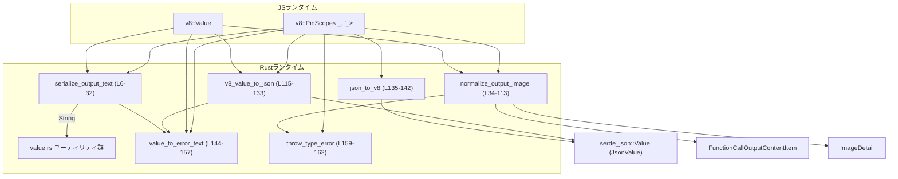
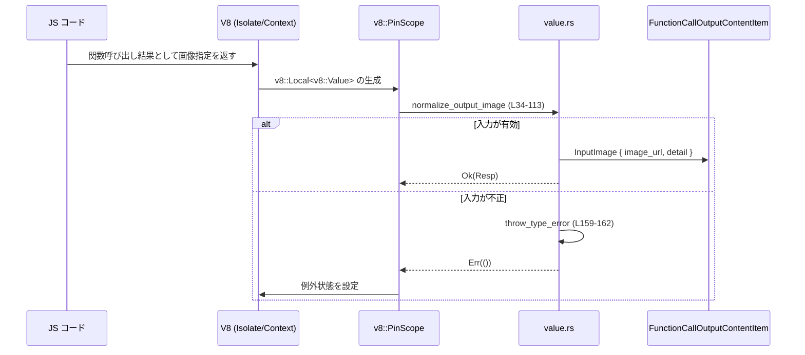
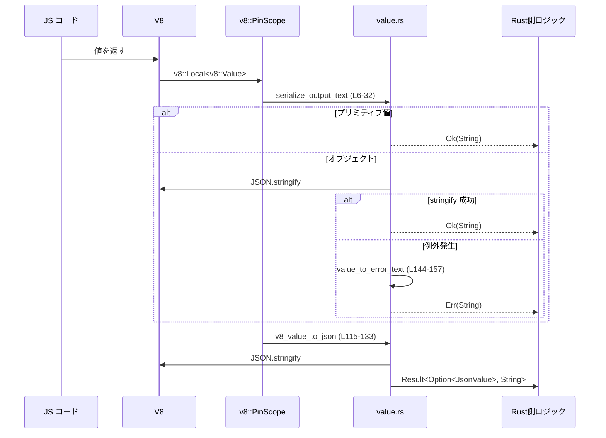

# code-mode/src/runtime/value.rs コード解説

## 0. ざっくり一言

V8 の `v8::Value` と Rust 側の `String` / `serde_json::Value` / 独自レスポンス型との間で値を変換し、特に「テキスト出力」と「画像出力」の正規化、および V8 例外の文字列化を行うユーティリティ群です。  

---

## 1. このモジュールの役割

### 1.1 概要

- このモジュールは **V8 JavaScript 値を Rust 側で扱いやすい形に変換する** ために存在し、以下の機能を提供します。
  - JS の任意の値を安全に文字列化する (`serialize_output_text`)  
    → 可能なら JSON 文字列として、そうでなければロスのある文字列化  
    [code-mode/src/runtime/value.rs:L6-32]
  - JS から渡された画像指定を検証・正規化して内部型 `FunctionCallOutputContentItem` に変換する (`normalize_output_image`)  
    [code-mode/src/runtime/value.rs:L34-113]
  - JS 値と `serde_json::Value` の相互変換 (`v8_value_to_json` / `json_to_v8`)  
    [code-mode/src/runtime/value.rs:L115-142]
  - V8 例外オブジェクトからスタックトレースなどの文字列を抽出する (`value_to_error_text`)  
    [code-mode/src/runtime/value.rs:L144-157]
  - V8 の TypeError を投げるヘルパー (`throw_type_error`)  
    [code-mode/src/runtime/value.rs:L159-162]

### 1.2 アーキテクチャ内での位置づけ

このファイルは「コードモード」ランタイムの一部として、V8 エンジンとアプリケーション側レスポンス型 (`FunctionCallOutputContentItem`, `ImageDetail`) の間を橋渡しする層に位置します。

主な依存関係を図示すると次のようになります：



※ 実際の呼び出し元（例えば「コードモード」本体）はこのチャンクには現れないため不明です。

### 1.3 設計上のポイント

- すべての関数が `&mut v8::PinScope` を受け取り、**V8 のスコープとライフタイムに従った安全な操作**のみ行います（`unsafe` ブロック無し）  
  [code-mode/src/runtime/value.rs:L6-9][L34-37][L115-118][L135-137][L144-147][L159]
- 例外/エラー処理は以下の二段構えです：
  - Rust 側：`Result<_, String>` や `Result<_, ()>` でエラーを返却  
    [L6-9][L34-37][L115-118]
  - JS 側：必要に応じて V8 の `throw_exception` により TypeError を投げる  
    [L106-112][L159-162]
- JSON 変換では **V8 の `JSON.stringify` → `serde_json`** という二段階を取り、変換に失敗した場合は詳細なエラーメッセージを付けて返します  
  [L119-133]
- 画像 URL の正規化では、**空文字列禁止 / `http://`・`https://`・`data:` のみ許可 / detail パラメータの列挙制約**を明示的にチェックします  
  [L71-83][L85-101]
- 並行性に関して：
  - このファイル内にはスレッド生成や共有状態は存在せず、すべての関数が単一の `&mut v8::PinScope` に対する同期的な操作のみ行います。  
    並行アクセスの可否や V8 スコープのスレッド安全性は、V8 ランタイム側の定義に依存し、このチャンクからは判断できません。

---

## 2. コンポーネントインベントリー（主要な機能一覧）

### 関数・型インベントリー

| 名前 | 種別 | 役割 / 用途 | 定義位置 |
|------|------|-------------|----------|
| `JsonValue` | 型エイリアス (`serde_json::Value`) | JSON 値表現 | code-mode/src/runtime/value.rs:L1 |
| `FunctionCallOutputContentItem` | 構造体/列挙体（外部定義） | 関数呼び出しの出力コンテンツを表す内部レスポンス型 | code-mode/src/runtime/value.rs:L3 |
| `ImageDetail` | 列挙体（外部定義と推測） | 画像詳細レベル（`Auto/Low/High/Original`）を表現 | code-mode/src/runtime/value.rs:L4 |
| `serialize_output_text` | 関数 | JS 値を安全に文字列化する | code-mode/src/runtime/value.rs:L6-32 |
| `normalize_output_image` | 関数 | JS 側の画像指定（URL と detail）を検証して `FunctionCallOutputContentItem` に変換 | code-mode/src/runtime/value.rs:L34-113 |
| `v8_value_to_json` | 関数 | V8 値を `serde_json::Value` に変換 | code-mode/src/runtime/value.rs:L115-133 |
| `json_to_v8` | 関数 | `serde_json::Value` を V8 値に変換 | code-mode/src/runtime/value.rs:L135-142 |
| `value_to_error_text` | 関数 | V8 値（主に例外）から `stack` プロパティなどを抽出し文字列化 | code-mode/src/runtime/value.rs:L144-157 |
| `throw_type_error` | 関数 | 指定メッセージで V8 の例外をスロー | code-mode/src/runtime/value.rs:L159-162 |

---

## 3. 公開 API と詳細解説

### 3.1 型一覧（このファイルで直接定義される型）

このファイル内で新たに定義される構造体・列挙体はありません。  
使用している主な外部型は以下の通りです：

| 名前 | 種別 | 説明 |
|------|------|------|
| `JsonValue` | `serde_json::Value` の別名 | 汎用的な JSON 値 |
| `FunctionCallOutputContentItem` | （外部定義） | 関数呼び出しの出力コンテンツ。ここでは `InputImage { image_url, detail }` 変種が使用されます [L103] |
| `ImageDetail` | （外部定義） | 画像の詳細レベルを表す列挙。`Auto/Low/High/Original` の 4 種がコードから読み取れます [L89-92] |

### 3.2 関数詳細

#### `serialize_output_text(scope: &mut v8::PinScope<'_, '_>, value: v8::Local<'_, v8::Value>) -> Result<String, String>`

**概要**

- 任意の V8 値を「人間が読めるテキスト」に変換するヘルパーです。  
  - プリミティブ値はそのまま `to_rust_string_lossy`  
  - オブジェクトなどは可能なら `JSON.stringify` してから文字列化  
  - 失敗した場合は V8 例外の内容を文字列として返します  
  [code-mode/src/runtime/value.rs:L10-31]

**引数**

| 引数名 | 型 | 説明 |
|--------|----|------|
| `scope` | `&mut v8::PinScope<'_, '_>` | 現在の V8 スコープ。文字列化や JSON 操作に使用します [L6-9] |
| `value` | `v8::Local<'_, v8::Value>` | 文字列化したい JS 値 [L6-9] |

**戻り値**

- `Ok(String)`  
  - 変換された文字列。プリミティブ値の場合はほぼ JS の `String(value)` に相当し、オブジェクトの場合は JSON 文字列または `toString()` に近い表現になります。
- `Err(String)`  
  - `JSON.stringify` 時に V8 例外が発生した場合、その例外情報を文字列化したもの  
  [L25-30]

**内部処理の流れ**

1. 値が `undefined/null/boolean/number/bigint/string` のいずれかなら、`to_rust_string_lossy` で直接文字列化して返す  
   [L10-18]
2. それ以外（オブジェクトなど）の場合、`v8::TryCatch` を使って `JSON.stringify` を試みる  
   [L20-22]
3. `JSON.stringify` が値を返した場合、その文字列を Rust `String` に変換して `Ok`  
   [L22-24]
4. `JSON.stringify` が `None` を返し、かつ `TryCatch` に例外が捕捉されていた場合は、  
   `value_to_error_text` で例外を文字列化して `Err` として返す  
   [L25-30][L144-157]
5. 例外も無く `None` だった場合は、最後のフォールバックとして `value.to_rust_string_lossy(&tc)` で文字列化して `Ok`  
   [L31]

**Examples（使用例・疑似コード）**

```rust
// 疑似コード: 実際には V8 Isolate / Context / Scope の初期化が必要です。
fn log_js_value(scope: &mut v8::PinScope, value: v8::Local<v8::Value>) {
    match serialize_output_text(scope, value) { // JS値をテキストに変換 [L6-32]
        Ok(text) => println!("JS value: {}", text),
        Err(err_text) => eprintln!("Failed to serialize JS value: {}", err_text),
    }
}
```

**Errors / Panics**

- Rust 側で panic を起こすコードは含まれていません（`unwrap`/`expect` 不使用） [L6-32]。
- `Err(String)` になるのは、`JSON.stringify` 実行中に V8 例外が発生した場合のみです [L25-30]。

**Edge cases（エッジケース）**

- 値が `undefined` / `null` の場合も `to_rust_string_lossy` により `"undefined"` や `"null"` 相当の文字列が返されます [L10-18]。
- 循環参照を含むオブジェクトなど、`JSON.stringify` が例外を投げるケースでは、そのスタック情報などを含む文字列を `Err` として返却します（`value_to_error_text` 参照） [L25-30][L144-157]。
- `JSON.stringify` が `None` を返し、例外も無いという稀なケースでは、最終的に `to_rust_string_lossy` にフォールバックします [L31]。

**使用上の注意点**

- 返り値 `Result` を無視すると、JS 側のエラー情報を取りこぼします。呼び出し側で必ず `Err` ケースを処理する前提になります。
- 文字コード変換は `to_rust_string_lossy` を使用しているため、変換不能な文字は置き換えられる可能性があります [L17][L23][L31]。

---

#### `normalize_output_image(scope: &mut v8::PinScope<'_, '_>, value: v8::Local<'_, v8::Value>) -> Result<FunctionCallOutputContentItem, ()>`

**概要**

- JS 側から渡される「画像出力指定」を検証・正規化し、内部レスポンス型 `FunctionCallOutputContentItem::InputImage { image_url, detail }` に変換します。  
  入力は以下のいずれかに制限されています [L39-41][L64-76]：
  - 非空の URL 文字列
  - `{"image_url": "<非空URL>", "detail"?: "<auto|low|high|original|null>"}` 形式のオブジェクト

**引数**

| 引数名 | 型 | 説明 |
|--------|----|------|
| `scope` | `&mut v8::PinScope<'_, '_>` | V8 スコープ。`value` のプロパティ取得と TypeError スローに使用 | [L34-37][L106-110] |
| `value` | `v8::Local<'_, v8::Value>` | 画像指定の JS 値 | [L34-37] |

**戻り値**

- `Ok(FunctionCallOutputContentItem::InputImage { image_url, detail })`  
  - 正常な URL と、オプションの `ImageDetail` を含む出力アイテムです [L103]。
- `Err(())`  
  - 入力が不正であった場合。内部で `throw_type_error` により JS 側へ TypeError 例外を投げます [L106-112][L159-162]。

**内部処理の流れ**

1. ローカルクロージャ内で `Result<FunctionCallOutputContentItem, String>` を構築し、最終的に `Result<_, ()>` にマッピングする構造になっています [L38-104][L106-112]。
2. 入力 `value` が文字列の場合、そのまま `image_url` とし、`detail` は `None` [L39-40]。
3. オブジェクト（かつ配列でない）であれば、`image_url` と `detail` プロパティを取り出す [L41-63]。
   - `image_url`:
     - キー `"image_url"` を文字列として生成 [L45-46]。
     - `object.get(scope, image_url_key.into())` でプロパティ取得 [L49-56]。
     - 値が文字列でない、または欠損している場合はエラー [L49-56]。
   - `detail`:
     - キー `"detail"` を生成し [L47-48]、プロパティを取得 [L57]。
     - `string` の場合はその文字列、`null`/`undefined` なら `None`、それ以外の型ならエラー [L57-62]。
4. 上記以外（例えば boolean や配列）の入力はエラー [L64-69]。
5. `image_url` が空文字列ならエラー [L71-76]。
6. `image_url` を小文字化してプロトコルをチェックし、`http://` / `https://` / `data:` 以外はエラー [L77-83]。
7. `detail` が `Some(string)` の場合、小文字化して `ImageDetail::Auto/Low/High/Original` のいずれかにマッピングし、その他の文字列はエラー [L85-99]。
8. すべての検証に通った場合、`FunctionCallOutputContentItem::InputImage { image_url, detail }` を返す [L103]。
9. クロージャの結果が `Err(error_text)` の場合、`throw_type_error(scope, &error_text)` を呼び出し、`Err(())` を返す [L106-112][L159-162]。

**Examples（使用例・疑似コード）**

```rust
// 疑似コード: V8 スコープ構築部分は省略
fn handle_image_output(scope: &mut v8::PinScope, value: v8::Local<v8::Value>) {
    match normalize_output_image(scope, value) { // [L34-113]
        Ok(FunctionCallOutputContentItem::InputImage { image_url, detail }) => {
            println!("Image URL: {}", image_url);
            println!("Detail: {:?}", detail); // ImageDetail または None
        }
        Err(()) => {
            // ここに来る時点で、JS 側には TypeError が投げられている [L106-112]。
        }
    }
}
```

**Errors / Panics**

- Rust 側での panic はありません。
- `Err(())` が返る条件：
  - 入力が文字列でも対応オブジェクトでもない [L64-69]。
  - `image_url` プロパティが欠損／非文字列／空文字列 [L49-56][L71-76]。
  - URL のスキームが `http://` / `https://` / `data:` 以外 [L77-83]。
  - `detail` プロパティが存在し、かつ文字列でも `null`/`undefined` でもない [L57-62]。
  - `detail` が文字列だが `"auto"|"low"|"high"|"original"` のいずれにも一致しない [L85-99]。
- エラー時には `throw_type_error` によって V8 側に TypeError が送出されます [L106-112][L159-162]。

**Edge cases（エッジケース）**

- `image_url` に空文字列が渡された場合：`Err(())` + TypeError [L71-76]。
- URL の大文字小文字は `to_ascii_lowercase` で正規化されるため、`HTTP://` などでも許可されます [L77-81]。
- `detail` が `null` / `undefined` / 存在しない場合：`detail` は `None` となり、既定の扱いになります [L57-62][L85-101]。
- `detail` に `"AUTO"` のような大文字が渡された場合も、小文字化して判定するため有効です [L87-92]。

**使用上の注意点（含むバグ/セキュリティ観点）**

- この関数は URL の形式（スキーム）しか検証せず、URL の到達性や内容までは検証しません。  
  巨大な `data:` URL などに対するサイズ制限はこのコードからは読み取れません [L77-83]。
- 戻り値の `Err(())` だけを見ているとエラー理由が分からないため、実際のエラー内容は JS 側の例外メッセージ（`throw_type_error` のメッセージ）を確認する設計になっています [L65-67][L73-75][L82-83][L94-96][L106-112]。
- `FunctionCallOutputContentItem` の他のバリアント（画像以外）が存在するかどうかはこのチャンクからは不明です。

---

#### `v8_value_to_json(scope: &mut v8::PinScope<'_, '_>, value: v8::Local<'_, v8::Value>) -> Result<Option<JsonValue>, String>`

**概要**

- V8 の任意の JS 値を `serde_json::Value` (`JsonValue`) に変換します。  
  - まず V8 側の `JSON.stringify` で JSON 文字列を得る  
  - 次に `serde_json::from_str` により Rust の JSON 値にパース  
  [code-mode/src/runtime/value.rs:L119-133]

**引数**

| 引数名 | 型 | 説明 |
|--------|----|------|
| `scope` | `&mut v8::PinScope<'_, '_>` | V8 スコープ [L115-118] |
| `value` | `v8::Local<'_, v8::Value>` | JSON 化したい JS 値 [L115-118] |

**戻り値**

- `Ok(Some(JsonValue))`  
  - 正常に JSON 化できた場合。
- `Ok(None)`  
  - `JSON.stringify` が `None` を返し、例外も発生しなかった場合（JSON 化できないが、エラーではない扱い） [L121-128]。
- `Err(String)`  
  - `JSON.stringify` 中に V8 例外が発生した場合、または `serde_json::from_str` でパースに失敗した場合 [L122-127][L130-132]。

**内部処理の流れ**

1. `v8::TryCatch` を用意し、`JSON.stringify(&tc, value)` を呼び出す [L119-121]。
2. `JSON.stringify` が `Some(js_string)` を返した場合：
   - `js_string` を Rust `String` に変換し [L130]、
   - `serde_json::from_str` で `JsonValue` へパース [L130-132]。
3. `JSON.stringify` が `None` の場合：
   - `tc.has_caught()` が真なら、`value_to_error_text` で例外を文字列化して `Err(String)` [L122-127][L144-157]。
   - 例外が無ければ `Ok(None)` として返す [L121-128]。

**Examples（使用例・疑似コード）**

```rust
fn extract_json(scope: &mut v8::PinScope, value: v8::Local<v8::Value>) {
    match v8_value_to_json(scope, value) { // [L115-133]
        Ok(Some(json)) => {
            // serde_json::Value として処理できる
            println!("Got JSON: {}", json);
        }
        Ok(None) => {
            // JSON 化できない値（関数など）だった可能性
            println!("Value is not JSON-serializable.");
        }
        Err(err) => {
            eprintln!("Failed to convert to JSON: {}", err);
        }
    }
}
```

**Errors / Panics**

- Rust 側 panic なし。
- `Err` の条件：
  - V8 側 `JSON.stringify` 実行中に例外が発生 [L122-127]。
  - JSON 文字列を `serde_json::from_str` でパースする際に失敗 [L130-132]。

**Edge cases**

- `JSON.stringify` が `undefined` を返すタイプの値（例えば関数）は、例外が発生しない限り `Ok(None)` になります [L121-128]。
- 生成された JSON 文字列が `serde_json` 的に不正（例えば巨大な数値など）な場合は、`failed to serialize JavaScript value: {err}` というエラーメッセージで `Err` になります [L130-132]。

**使用上の注意点**

- `Ok(None)` と `Err` の意味が異なる点（前者は「非 JSON 値」、後者は「エラー発生」）を呼び出し側が区別する必要があります [L121-128][L122-127]。
- `JsonValue` に変換できたとしても、その構造が期待どおりかどうかは別途検証が必要です。構造の検証はこの関数の責務ではありません。

---

#### `json_to_v8<'s>(scope: &mut v8::PinScope<'s, '_>, value: &JsonValue) -> Option<v8::Local<'s, v8::Value>>`

**概要**

- `serde_json::Value` を JSON 文字列にシリアライズし、それを V8 の `JSON.parse` で再び JS 値にする、という経路で Rust → V8 への JSON 値変換を行うヘルパーです [L135-142]。

**引数**

| 引数名 | 型 | 説明 |
|--------|----|------|
| `scope` | `&mut v8::PinScope<'s, '_>` | JS 値生成に使用する V8 スコープ [L135-137] |
| `value` | `&JsonValue` | V8 値に変換したい JSON 値 [L135-138] |

**戻り値**

- `Some(v8::Local<v8::Value>)`  
  - 正常に JSON 文字列化され、V8 の `JSON.parse` に成功した場合。
- `None`  
  - `serde_json::to_string` が失敗、または `v8::String::new` が失敗、または `v8::json::parse` が失敗した場合（詳細な理由は返さない設計） [L139-141]。

**内部処理の流れ**

1. `serde_json::to_string(value)` で JSON 文字列を生成し、`ok()?` により失敗時は `None` を返す [L139]。
2. 生成した文字列で V8 の `v8::String` をつくり、失敗時は `None` [L140]。
3. `v8::json::parse(scope, json)` を呼び出し、成功すれば `Some(v8::Value)`、失敗すれば `None` [L141]。

**Examples（使用例・疑似コード）**

```rust
fn send_json_to_js(scope: &mut v8::PinScope, json: &serde_json::Value) {
    if let Some(js_value) = json_to_v8(scope, json) { // [L135-142]
        // js_value を JS 側の関数に渡すなど
    } else {
        eprintln!("Failed to convert JSON value to V8 value");
    }
}
```

**Errors / Panics**

- エラー詳細は返さず、`None` によって失敗のみを表現します [L139-141]。
- Rust 側 panic はありません。

**Edge cases**

- `JsonValue` 内に `serde_json` がシリアライズできない値が含まれていると `None` を返します（`ok()?` のため）。  
  具体的にどの値が対象かは `serde_json` の仕様に依存し、このチャンクだけからは判断できません [L139]。
- V8 側の `JSON.parse` は不正な JSON 文字列を渡すと例外を投げ得ますが、ここでは戻り値の `Option` によって失敗を表すのみで、例外詳細の取得は行っていません [L141]。

**使用上の注意点**

- 失敗時の理由が分からないため、問題がある場合は `serde_json::to_string` を別途呼び出してエラーを確認するなど、外側での診断が必要になります。
- JSON 経由で変換するため、元の型情報（たとえば日付型など JSON では表現されないもの）は復元されません。

---

#### `value_to_error_text(scope: &mut v8::PinScope<'_, '_>, value: v8::Local<'_, v8::Value>) -> String`

**概要**

- V8 の例外オブジェクトなどから、エラーメッセージとして利用するテキストを抽出します。  
  可能であれば `stack` プロパティ（スタックトレース）を使い、なければ単純な文字列化結果を返します [L148-156]。

**引数**

| 引数名 | 型 | 説明 |
|--------|----|------|
| `scope` | `&mut v8::PinScope<'_, '_>` | プロパティ取得に使用する V8 スコープ [L144-147] |
| `value` | `v8::Local<'_, v8::Value>` | エラーオブジェクト（例外）など [L144-147] |

**戻り値**

- `String` — エラー説明として利用できる文字列。

**内部処理の流れ**

1. `value.is_object()` を確認し、オブジェクトであれば `v8::Local<v8::Object>::try_from(value)` でオブジェクトに変換 [L148-150]。
2. `"stack"` というキーの `v8::String` を生成 [L150-151]。
3. `object.get(scope, key.into())` で `stack` プロパティを取得し、文字列であればその値を `to_rust_string_lossy` で返す [L151-155]。
4. 上記条件に合致しない場合は、単純に `value.to_rust_string_lossy(scope)` を返す [L156]。

**使用例**

```rust
fn log_exception(scope: &mut v8::PinScope, exc: v8::Local<v8::Value>) {
    let text = value_to_error_text(scope, exc); // [L144-157]
    eprintln!("JS exception: {}", text);
}
```

**使用上の注意点**

- `stack` プロパティが存在し、かつ文字列である場合はスタックトレース全体が返る可能性があります。  
  ログに出力する際には情報量や秘匿情報の扱いに注意が必要です。
- `stack` が存在しない単純な文字列エラーなどは、`to_rust_string_lossy` による文字列表現となります [L156]。

---

#### `throw_type_error(scope: &mut v8::PinScope<'_, '_>, message: &str)`

**概要**

- 渡されたメッセージを V8 の `String` に変換し、それを `scope.throw_exception` で送出するヘルパーです。  
  主に `normalize_output_image` の入力検証エラー時に使用されます [L106-112][L159-162]。

**引数**

| 引数名 | 型 | 説明 |
|--------|----|------|
| `scope` | `&mut v8::PinScope<'_, '_>` | 例外送出に使用する V8 スコープ [L159] |
| `message` | `&str` | エラーメッセージ [L159] |

**戻り値**

- ありません（`()`）。V8 側の状態（例外フラグ）が変わるだけです [L159-162]。

**内部処理の流れ**

1. `v8::String::new(scope, message)` でメッセージ文字列を生成。失敗したら何もせず終了 [L160]。
2. 成功した場合、その `v8::String` を `into()` で `v8::Value` に変換し、`scope.throw_exception(...)` を呼ぶ [L161]。

**使用上の注意点**

- この関数は「TypeError」と名付けられていますが、実際にどのエラー種別が V8 で使われるかは `throw_exception` の実装に依存し、このチャンクだけでは詳細不明です [L161]。
- 呼び出し元は、例外送出後に Rust 側でも `Err` を返して処理を打ち切るパターンになっており（`normalize_output_image` 参照）、Rust/JS 双方でエラーを扱う設計になっています [L106-112]。

---

### 3.3 その他の関数

上記 6 関数がこのファイルに存在するすべての関数です。補助的なラッパー関数など、他に関数はありません。

---

## 4. データフロー

代表的なシナリオとして、「JS からの画像出力指定を受け取り、内部レスポンスオブジェクトに変換する」流れを示します。



同様に、テキストや JSON の出力は次のようなデータフローになります。



---

## 5. 使い方（How to Use）

### 5.1 基本的な使用方法（疑似コード）

実際には V8 Isolate や Context の初期化が必要ですが、その部分は省略し、各関数の典型的な利用パターンだけを示します。

```rust
// 疑似コード: V8 の初期化やスコープ構築はランタイム側で実装されている前提です。
fn process_js_result(scope: &mut v8::PinScope, js_value: v8::Local<v8::Value>) {
    // 1. テキストとしてログ出力したい場合
    match serialize_output_text(scope, js_value) {
        Ok(text) => println!("JS result (text): {}", text),
        Err(err) => eprintln!("Failed to serialize JS value: {}", err),
    }

    // 2. JSON として処理したい場合
    match v8_value_to_json(scope, js_value) {
        Ok(Some(json)) => println!("JS result (JSON): {}", json),
        Ok(None) => println!("JS result is not JSON-serializable"),
        Err(err) => eprintln!("Failed to convert JS value to JSON: {}", err),
    }
}
```

### 5.2 よくある使用パターン

1. **画像出力の正規化**

```rust
fn handle_image(scope: &mut v8::PinScope, js_image_value: v8::Local<v8::Value>) {
    match normalize_output_image(scope, js_image_value) {
        Ok(FunctionCallOutputContentItem::InputImage { image_url, detail }) => {
            // この image_url を後続の HTTP クライアントやレスポンス生成に利用する
            println!("URL = {}, detail = {:?}", image_url, detail);
        }
        Err(()) => {
            // JS 側には TypeError が投げられている想定。
            // Rust 側では追加ログなどを行う。
        }
    }
}
```

1. **Rust 側で構築した JSON を JS に返す**

```rust
fn send_data_to_js(scope: &mut v8::PinScope) {
    let data = serde_json::json!({
        "message": "hello",
        "count": 42,
    });

    if let Some(js_value) = json_to_v8(scope, &data) {
        // js_value を JS 関数呼び出しの引数に使うなど
    }
}
```

### 5.3 よくある間違い

```rust
// 間違い例: normalize_output_image のエラーを無視している
fn bad(scope: &mut v8::PinScope, value: v8::Local<v8::Value>) {
    let _ = normalize_output_image(scope, value); // Err(()) を無視すると、なぜ失敗したか分からない
}

// 正しい例: 結果をチェックし、エラー時に適切な対応を行う
fn good(scope: &mut v8::PinScope, value: v8::Local<v8::Value>) {
    match normalize_output_image(scope, value) {
        Ok(item) => { /* 正常系処理 */ }
        Err(()) => {
            // JS 側に TypeError が投げられている前提で、Rust 側でログを出すなど
        }
    }
}
```

```rust
// 間違い例: v8_value_to_json で Ok(None) と Err を区別しない
fn bad_json(scope: &mut v8::PinScope, value: v8::Local<v8::Value>) {
    if let Ok(json_opt) = v8_value_to_json(scope, value) {
        // json_opt が None でも JSON として扱ってしまう可能性
        println!("JSON: {:?}", json_opt);
    }
}

// 正しい例: Ok(None) と Err を区別する
fn good_json(scope: &mut v8::PinScope, value: v8::Local<v8::Value>) {
    match v8_value_to_json(scope, value) {
        Ok(Some(json)) => println!("JSON: {}", json),
        Ok(None) => println!("Value is not JSON-serializable"),
        Err(err) => eprintln!("Error converting to JSON: {}", err),
    }
}
```

### 5.4 使用上の注意点（まとめ）

- すべての関数は `&mut v8::PinScope` に依存するため、**有効な V8 スコープのライフタイム内**でのみ呼び出す必要があります。
- `normalize_output_image` はエラー時に JS 側の例外と Rust 側の `Err(())` の両方でエラーを示す設計です。呼び出し側は JS 側の例外伝播も考慮する必要があります [L106-112][L159-162]。
- JSON 変換と文字列化はすべてロスのある変換（`to_rust_string_lossy` / `serde_json`）のため、厳密なバイナリ再現性は保証されません [L17][L23][L31][L130-132]。
- ロギングやメトリクスなどの観測可能性（observability）はこのファイル内では実装されておらず、必要に応じて呼び出し側で追加する設計です。

---

## 6. 変更の仕方（How to Modify）

### 6.1 新しい機能を追加する場合

- **新しい出力種別の正規化**を行いたい場合（例：動画、音声など）：
  1. `normalize_output_image` と同様の関数を同ファイルまたは近傍ファイルに追加し、入力検証と内部レスポンス型への変換ロジックをそこにまとめる [L34-113]。
  2. `FunctionCallOutputContentItem` に対応するバリアントを追加し（このチャンクには定義がないため詳細不明）、新関数からそのバリアントを生成する。
  3. 既存のランタイム呼び出しコードから、新しい正規化関数を呼ぶように変更する。

- **JSON 変換のバリエーション**（例：`Result<T, E>` を直接変換したいなど）が必要な場合は、`v8_value_to_json` / `json_to_v8` をラップする関数を追加し、構造体レベルの検証をそのラッパー側で行うと分離が保ちやすいです。

### 6.2 既存の機能を変更する場合

- `normalize_output_image` の仕様変更（例えば許可する URL スキームを増やす）を行う場合：
  - 変更前に `lower.starts_with("http://") || ...` 部分の条件式の影響範囲を確認する [L77-81]。
  - 呼び出し側が「http(s) / data のみ許可」という前提を持っているかどうかは、このチャンクだけでは分からないため、関連するレスポンス処理やセキュリティチェックを検索して確認する必要があります。
- `serialize_output_text` や `v8_value_to_json` のエラーメッセージ形式を変更する場合：
  - `value_to_error_text` を経由している部分と、`serde_json::from_str` のエラーメッセージをラップしている部分があり [L25-30][L123-127][L130-132][L144-157]、テストコードやログ解析などが依存していないか確認が必要です。
- 変更後は、最低限以下の観点でテストを追加・更新することが有用です：
  - 正常系：すべての想定入力パターン（文字列/オブジェクト/`detail` 値など）で期待どおりの出力になるか。
  - 異常系：不正入力時に V8 例外が投げられ、Rust 側でも `Err` が返るか。
  - JSON 変換の成功/失敗・非シリアライズ可能値の扱い（`Ok(None)`）の確認。

---

## 7. 関連ファイル

| パス | 役割 / 関係 |
|------|------------|
| `crate::response::FunctionCallOutputContentItem` | 関数呼び出しの出力コンテンツ全体を表す型。ここでは `InputImage { image_url, detail }` 変種が利用されます [code-mode/src/runtime/value.rs:L3][L103]。定義本体はこのチャンクには現れません。 |
| `crate::response::ImageDetail` | 画像詳細レベル（`Auto/Low/High/Original`）を表す列挙体。`normalize_output_image` で `detail` の正規化に利用されます [code-mode/src/runtime/value.rs:L4][L89-92]。 |
| `v8` クレート（またはバインディング） | V8 エンジンとの橋渡しを行う外部ライブラリ。`PinScope` や `Local<Value>`, `json::stringify/parse` などが使用されています [code-mode/src/runtime/value.rs:L6-9][L20-22][L119-121][L139-141][L159-161]。 |
| `serde_json` クレート | JSON のシリアライズ/デシリアライズを行うライブラリ。`JsonValue` の定義と `to_string` / `from_str` が使用されています [code-mode/src/runtime/value.rs:L1][L130-132][L139]。 |

このチャンク以外のファイル（例えばランタイムのエントリポイントや `response` モジュールの定義）は提示されていないため、より広い依存関係や呼び出し元の詳細はここからは分かりません。
