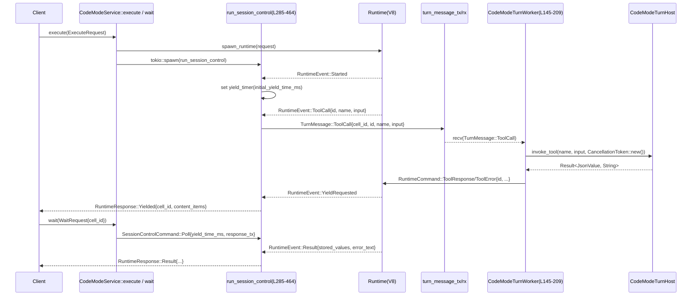

# code-mode/src/service.rs コード解説

---

## 0. ざっくり一言

このファイルは、JavaScript/V8 ベースの「コード実行セッション」を管理するサービス層であり、

- 実行セッションの生成・ポーリング・終了
- ランタイムとツールホスト間のブリッジ（通知・ツール呼び出し）

を非同期に調停するモジュールです（service.rs:L25-215, L285-464）。

---

## 1. このモジュールの役割

### 1.1 概要

このモジュールは **コード実行ランタイム（V8）を扱う runtime モジュール** と、  
**外側のホスト（ツール実装や UI）** の間を仲介し、次の問題を解決します。

- 実行要求 (`ExecuteRequest`) ごとの **セッション管理**（cell_id 発行、状態保持）（service.rs:L43-49, L78-113）
- ランタイムからのイベント (`RuntimeEvent`) を受け取り、  
  呼び出し側へ `RuntimeResponse` として返す **制御ループ**（service.rs:L285-464）
- ランタイムからの通知・ツール呼び出し (`TurnMessage`) を、  
  ホストの `CodeModeTurnHost` 実装に橋渡しする **ターンワーカー**（service.rs:L145-209）

### 1.2 アーキテクチャ内での位置づけ

主なコンポーネントの関係を簡略図で示します。

```mermaid
graph LR
    %% service.rs:L25-23, L78-215, L285-464
    Client["クライアント\n(サービス呼び出し側)"]
    Service["CodeModeService\nexecute / wait (L55-145)"]
    Session["run_session_control\nセッション制御 (L285-464)"]
    Runtime["runtime モジュール\nV8 実行エンジン"]
    TurnChan["turn_message_tx/rx\n(mpsc) (L43-48)"]
    Worker["CodeModeTurnWorker\nターンワーカー (L145-209, L218-227)"]
    Host["CodeModeTurnHost\nホスト実装 (L25-35)"]

    Client -->|ExecuteRequest / WaitRequest| Service
    Service -->|spawn_runtime, RuntimeCommand| Runtime
    Service -->|tokio::spawn| Session
    Runtime -->|RuntimeEvent (mpsc)| Session
    Session -->|TurnMessage (Notify/ToolCall)| TurnChan
    Worker -->|recv()| TurnChan
    Worker -->|notify/invoke_tool| Host
    Worker -->|RuntimeCommand::ToolResponse/ToolError| Runtime
    Session -->|RuntimeResponse| Client
```

- `CodeModeService` はクライアントから見える窓口です（service.rs:L51-113, L115-143）。
- 実行ごとに `run_session_control` タスクを立ち上げ、ランタイムとクライアントの間でイベントを調停します（service.rs:L97-108, L285-464）。
- ツール呼び出しや通知は `TurnMessage` 経由で `CodeModeTurnWorker` に渡され、  
  そこから `CodeModeTurnHost` 実装に委譲されます（service.rs:L145-209）。

### 1.3 設計上のポイント

コードから読み取れる設計上の特徴です。

- **非同期・並行設計**
  - `tokio::spawn` によりセッション制御ループをタスクとして実行（service.rs:L97-108, L285-305）。
  - ランタイムとの通信には `tokio::sync::mpsc::UnboundedSender/Receiver` を使用（service.rs:L84-88, L288-289）。
  - セッション管理や共有状態には `Arc` と `tokio::Mutex` が用いられています（service.rs:L43-49, L55-67）。

- **セッション単位の状態管理**
  - セッションごとに `cell_id` を `AtomicU64` から採番し（service.rs:L78-83）、  
    `Inner.sessions` に `SessionHandle` として登録（service.rs:L89-95）。
  - 各セッションは `RuntimeCommand` を送る `runtime_tx` と、  
    クライアントからの制御コマンドを受ける `control_tx` を保持します（service.rs:L37-41, L89-95）。

- **ランタイムイベント駆動**
  - `RuntimeEvent::Started`, `ContentItem`, `YieldRequested`, `Notify`, `ToolCall`, `Result` などを  
    1 つの select ループで処理（service.rs:L305-402）。
  - `YieldRequested` やタイマー満了を契機に `RuntimeResponse::Yielded` を返して、  
    長時間計算中でも応答性を保てるようになっています（service.rs:L343-357, L444-457）。

- **エラーと終了条件の明示的管理**
  - セッション終了時のパスを `termination_requested` と `runtime_closed` の 2 つのフラグで管理し、  
    「通常終了」「強制終了」「想定外の終了」を区別してクライアントに返却します（service.rs:L301-303, L315-340, L373-400）。
  - `missing_cell_response` で、存在しない `cell_id` に対する待機要求をエラーとして表現します（service.rs:L252-259）。

---

## 2. 主要な機能一覧（＋コンポーネントインベントリー概要）

### 2.1 主な機能

- コード実行セッションの開始: `CodeModeService::execute`（service.rs:L78-113）
- 実行セッションのポーリング・終了リクエスト: `CodeModeService::wait`（service.rs:L115-143）
- ランタイムとホスト間のツール呼び出し／通知ブリッジ: `CodeModeService::start_turn_worker` と `CodeModeTurnHost`（service.rs:L25-35, L145-209）
- ランタイムイベントの調停とレスポンス生成: `run_session_control`（service.rs:L285-464）
- セッションのグローバルな `stored_values` の取得・差し替え: `stored_values`, `replace_stored_values`（service.rs:L70-76）

### 2.2 コンポーネントインベントリー（概要）

詳細な表は 3 章で示しますが、ここでは大枠だけ整理します。

- 公開トレイト
  - `CodeModeTurnHost`: ツール実行と通知をホスト側に委譲するためのトレイト（service.rs:L25-35）

- 公開構造体
  - `CodeModeService`: セッション管理と実行 API を提供するサービス（service.rs:L51-53）
  - `CodeModeTurnWorker`: ターンメッセージを処理するワーカーのハンドル（Drop でシャットダウン）（service.rs:L218-227）

- 内部構造体・列挙体
  - `Inner`: 共有状態（stored_values, sessions, turn_message_*）を保持（service.rs:L43-49）
  - `SessionHandle`: 各セッションの制御チャンネルを保持（service.rs:L37-41）
  - `SessionControlCommand`: セッション制御用のコマンド（Poll / Terminate）（service.rs:L230-238）
  - `PendingResult`: 一時的にバッファされる実行結果（service.rs:L240-244）
  - `SessionControlContext`: セッション制御ループに渡されるコンテキスト（service.rs:L246-250）

- 主要な関数
  - `CodeModeService::execute` / `wait` / `start_turn_worker`（service.rs:L78-145）
  - `run_session_control`（service.rs:L285-464）
  - ヘルパー: `missing_cell_response`, `pending_result_response`, `send_or_buffer_result`（service.rs:L252-283）

---

## 3. 公開 API と詳細解説

### 3.1 型一覧（構造体・列挙体など）

#### 公開型

| 名前 | 種別 | 公開 | 行範囲 | 役割 / 用途 |
|------|------|------|--------|-------------|
| `CodeModeTurnHost` | トレイト | `pub` | service.rs:L25-35 | ツール呼び出し (`invoke_tool`) と通知 (`notify`) をホスト側に委譲するためのインターフェース。`CodeModeTurnWorker` から呼ばれます。 |
| `CodeModeService` | 構造体 | `pub` | service.rs:L51-53 | コード実行セッションを開始・管理するサービス。クライアントはこの型を通して `execute` / `wait` / `start_turn_worker` を利用します。 |
| `CodeModeTurnWorker` | 構造体 | `pub` | service.rs:L218-220 | ターンメッセージ処理タスクのライフサイクルを管理するハンドル。Drop 時にワーカーにシャットダウンシグナルを送ります。 |

#### 非公開型（内部）

| 名前 | 種別 | 公開 | 行範囲 | 役割 / 用途 |
|------|------|------|--------|-------------|
| `SessionHandle` | 構造体 | private | service.rs:L37-41 | 各セッションの `control_tx` と `runtime_tx` をまとめて保持。`Inner.sessions` の値として利用。 |
| `Inner` | 構造体 | private | service.rs:L43-49 | 共有状態（`stored_values` / `sessions` / `turn_message_*` / `next_cell_id`）を保持する構造体。`CodeModeService` は `Arc<Inner>` を持ちます。 |
| `SessionControlCommand` | enum | private | service.rs:L230-238 | セッション制御ループへの制御メッセージ。`Poll` と `Terminate` の 2 種類。 |
| `PendingResult` | 構造体 | private | service.rs:L240-244 | 実行結果を一時的に保持。レスポンスチャネルが未設定のときに使われます。 |
| `SessionControlContext` | 構造体 | private | service.rs:L246-250 | `run_session_control` に渡されるコンテキスト（cell_id, runtime_tx, runtime_terminate_handle）。 |

### 3.2 重要な関数・メソッドの詳細

#### `CodeModeService::new() -> Self`

**概要**

- `CodeModeService` の新しいインスタンスを生成し、内部の共有状態 `Inner` を初期化します（service.rs:L55-68）。

**引数**

なし。

**戻り値**

- `CodeModeService`: 空の `stored_values` と `sessions` を持ち、`next_cell_id` を 1 に初期化したサービスインスタンス（service.rs:L60-66）。

**内部処理の流れ**

- `turn_message_tx`, `turn_message_rx` の `mpsc::unbounded_channel` を作成（service.rs:L57）。
- `Inner` を生成し、以下を初期化（service.rs:L60-66）。
  - `stored_values`: 空の `HashMap`
  - `sessions`: 空の `HashMap`
  - `turn_message_tx`: 上で生成した送信側
  - `turn_message_rx`: 受信側を `Arc<Mutex<...>>` でラップ
  - `next_cell_id`: `AtomicU64::new(1)`
- それを `Arc` で包み `CodeModeService` に保持して返却。

**Examples（使用例）**

詳細な使用例は「5.1 基本的な使用方法」を参照してください。

**Errors / Panics**

- このメソッド内で `Result` や `panic!` を使用しておらず、通常の条件ではエラーを返しません（service.rs:L55-68）。

**Edge cases（エッジケース）**

- 特別なエッジケースはありません。常に新しいサービスが生成されます。

**使用上の注意点**

- グローバルに 1 つだけでなく、複数の `CodeModeService` を生成することも可能ですが、  
  実行セッション・メッセージキューはそれぞれ独立になります（service.rs:L55-67）。

---

#### `CodeModeService::execute(&self, request: ExecuteRequest) -> Result<RuntimeResponse, String>`

**概要**

- 新しいコード実行セッションを開始し、最初の `RuntimeResponse`（`Result` か `Yielded` のいずれか）を返します（service.rs:L78-113）。

**引数**

| 引数名 | 型 | 説明 |
|--------|----|------|
| `request` | `ExecuteRequest` | 実行するコードやツール設定、`yield_time_ms` などを含むリクエスト。`Clone` されて `spawn_runtime` に渡されます（service.rs:L85）。 |

**戻り値**

- `Ok(RuntimeResponse)`: ランタイムからの最初の応答。
  - 即時終了の場合は `RuntimeResponse::Result`（テスト参照: service.rs:L512-536）。
  - 一時停止（yield）の場合は `RuntimeResponse::Yielded`（テスト参照: service.rs:L607-645）。
- `Err(String)`: ランタイムの起動に失敗した場合、`spawn_runtime` からのエラー文字列がそのまま返ると推測できますが、詳細は `spawn_runtime` の定義がこのチャンクにはないため明確ではありません（service.rs:L85, L110-113）。

**内部処理の流れ**

1. `cell_id` を `next_cell_id.fetch_add(1, Ordering::Relaxed)` で採番し、文字列化（service.rs:L78-83）。
2. ランタイムイベント用の `event_tx, event_rx` を `mpsc::unbounded_channel` で生成（service.rs:L84）。
3. `spawn_runtime(request.clone(), event_tx)` で V8 ランタイムを起動し、`runtime_tx` と `runtime_terminate_handle` を受け取る（service.rs:L85）。
4. セッション制御用の `control_tx, control_rx`、最初のレスポンス受信用の `oneshot::channel()` を生成（service.rs:L86-87）。
5. `Inner.sessions` に `cell_id` をキーとして `SessionHandle` を登録（service.rs:L89-95）。
6. `run_session_control` を新しい tokio タスクとして起動し、セッション制御を開始（service.rs:L97-108）。
7. `response_rx.await` で最初のレスポンスを待ち、`oneshot` チャネルがクローズされた場合は `"exec runtime ended unexpectedly"` というエラーメッセージで `Err` を返す（service.rs:L110-113）。

**Examples（使用例）**

「5.1 基本的な使用方法」の `execute` 呼び出し例を参照してください。

**Errors / Panics**

- `spawn_runtime` が `Err` を返した場合、この関数も `Err(String)` を返します（service.rs:L85）。
- `run_session_control` 側のエラー等で `response_tx` がドロップされると、  
  `response_rx.await` は `Err(_)` になり、`"exec runtime ended unexpectedly"` というエラー文字列で `Err` が返されます（service.rs:L110-113）。
- メソッド自身は `panic!` を行っていません。

**Edge cases（エッジケース）**

- `request.yield_time_ms` が `None` の場合、`DEFAULT_EXEC_YIELD_TIME_MS` を使用して初期の yield タイマーが設定されます（service.rs:L107）。
- 実行開始直後にランタイムが終了してしまった場合でも、  
  `run_session_control` が `RuntimeResponse::Result` もしくはエラー付きの `Result` を返し、  
  それをこのメソッドが受け取る形になります（service.rs:L305-340, L373-400）。

**使用上の注意点**

- このメソッドは **最初の応答まで** しか待ちません。長時間実行するコードの場合、  
  最初の応答が `RuntimeResponse::Yielded` になり、その後の進行は `wait` を使ってポーリングする前提になっています（service.rs:L343-357, L407-418）。
- ツール呼び出しや通知を使用する場合は、別途 `start_turn_worker` を呼んで  
  ターンワーカーを起動しておく必要があります（service.rs:L145-209）。  

---

#### `CodeModeService::wait(&self, request: WaitRequest) -> Result<RuntimeResponse, String>`

**概要**

- 既存の実行セッション（cell_id 指定）に対して、  
  次の `RuntimeResponse` を取得するか、またはセッションを終了させます（service.rs:L115-143）。

**引数**

| 引数名 | 型 | 説明 |
|--------|----|------|
| `request` | `WaitRequest` | `cell_id`, `yield_time_ms`, `terminate` などを含むポーリング／終了リクエスト（service.rs:L115-135）。 |

**戻り値**

- `Ok(RuntimeResponse)`: 対応するセッションからの応答。
  - セッションが存在しない場合は `RuntimeResponse::Result` で `error_text` に `"exec cell {cell_id} not found"` が入ります（service.rs:L124-126, L252-259）。
- `Err(String)`: このメソッド内では `Err` を生成していません。戻り値の `Err` は型上の都合ですが、実際には常に `Ok` を返しています（service.rs:L115-143）。

**内部処理の流れ**

1. `request.cell_id` をコピーして `cell_id` 変数に退避（service.rs:L116）。
2. `Inner.sessions` をロックして、指定の `cell_id` に対応する `SessionHandle` を取得（service.rs:L117-123）。
3. 見つからなければ `missing_cell_response(cell_id)` を返す（service.rs:L124-126, L252-259）。
4. `oneshot::channel()` を新たに作成し、レスポンス受信用に使用（service.rs:L127）。
5. `request.terminate` に応じて `SessionControlCommand::Terminate` または `Poll` を組み立て（service.rs:L128-135）。
6. `handle.control_tx.send(control_message)` でセッション制御ループへコマンドを送信。  
   失敗した場合（セッション制御側が終了している）は `missing_cell_response` を返す（service.rs:L136-138）。
7. `response_rx.await` で応答を待ち、`Ok(response)` をそのまま返す。  
   `Err(_)`（送信側がドロップ済み）の場合は `missing_cell_response(request.cell_id)` を返す（service.rs:L139-142）。

**Examples（使用例）**

- 初回の `execute` 呼び出し後に、続きの結果をポーリングする例は「5.1 基本的な使用方法」を参照してください。

**Errors / Panics**

- 内部で `Err` を返すケースはなく、`missing_cell_response` を `Ok(...)` でラップして返却します（service.rs:L124-126, L136-142）。
- `control_tx.send(...)` が失敗するときはセッション制御タスクが既に終了している状態であり、  
  その場合も「セルが見つからない」扱いになります（service.rs:L136-138）。

**Edge cases（エッジケース）**

- 存在しない `cell_id` を指定した場合:  
  `RuntimeResponse::Result` で `error_text: Some("exec cell {cell_id} not found")` を返します（service.rs:L124-126, L252-259）。
- `terminate = true` で呼ぶと、セッションは終了処理に入り、  
  実際のレスポンスは `RuntimeResponse::Terminated` もしくは、既に結果がバッファされていれば `Result` になります（service.rs:L230-238, L419-441, テスト: L607-671）。

**使用上の注意点**

- `wait` は **セッションごとに 1 つのポーリング処理** を想定しています。  
  複数のタスクから同じ `cell_id` に対して同時に `wait` を呼ぶと、レスポンスの所有権が競合する可能性があります。  
  この挙動はこのファイルだけからは厳密には分かりませんが、`SessionControlCommand` の設計からは  
  単一クライアント想定と解釈できます（service.rs:L230-238, L407-418）。

---

#### `CodeModeService::start_turn_worker(&self, host: Arc<dyn CodeModeTurnHost>) -> CodeModeTurnWorker`

**概要**

- ランタイムからの `TurnMessage`（ツール呼び出し／通知）を処理するワーカータスクを起動し、  
  その制御用ハンドル `CodeModeTurnWorker` を返します（service.rs:L145-209, L218-227）。

**引数**

| 引数名 | 型 | 説明 |
|--------|----|------|
| `host` | `Arc<dyn CodeModeTurnHost>` | ツール呼び出しと通知を処理するホスト実装。`Arc` により複数タスクから共有されます（service.rs:L145-146, L180-185）。 |

**戻り値**

- `CodeModeTurnWorker`: Drop 時にシャットダウンシグナルを送り、  
  バックグラウンドタスクを終了させるためのハンドル（service.rs:L206-209, L218-227）。

**内部処理の流れ**

1. `oneshot::channel()` でシャットダウン用チャネルを作成（service.rs:L145-147）。
2. `inner` と `turn_message_rx` をクローンしてローカルに保持（service.rs:L147-148）。
3. `tokio::spawn` で非同期タスクを起動（service.rs:L150-204）。
   - ループ内で `tokio::select!` を用い、次の 2 つを待機（service.rs:L151-158）。
     - シャットダウンシグナル (`shutdown_rx`)
     - `turn_message_rx` からの次の `TurnMessage`
   - `TurnMessage::Notify` の場合: `host.notify(...)` を await し、失敗時には `tracing::warn!` でログ出力（service.rs:L163-173）。
   - `TurnMessage::ToolCall` の場合: 別のタスクを `tokio::spawn` し、  
     `host.invoke_tool(...)` を await → 結果に応じて `RuntimeCommand::ToolResponse` または `ToolError` を  
     対応するセッションの `runtime_tx` に送信（service.rs:L174-201）。
4. 呼び出し側には `CodeModeTurnWorker { shutdown_tx: Some(shutdown_tx) }` を返す（service.rs:L206-209）。

**Examples（使用例）**

- 5.1 の「基本的な使用方法」に、ホスト実装と合わせた `start_turn_worker` の例を示します。

**Errors / Panics**

- `host.notify` / `host.invoke_tool` の戻り値 `Err(String)` は、  
  - `notify` の場合: `warn!` ログとして記録されます（service.rs:L168-171）。
  - `invoke_tool` の場合: ランタイムに `RuntimeCommand::ToolError { id, error_text }` として返されます（service.rs:L195-198）。
- `runtime_tx.send(command)` が失敗した場合（セッション終了後など）は、結果を無視するのみで、エラーはロギング等されません（service.rs:L195-200）。
- ワーカータスク側で `panic!` を行っている箇所はありません。

**Edge cases（エッジケース）**

- `inner.sessions` に `cell_id` が存在しない場合（セッション終了済みなど）、  
  ツール呼び出しの応答は送信されず、単に早期 return します（service.rs:L186-193）。  
  ランタイム側でこれをどう扱うかは、このチャンクからは分かりません。
- `start_turn_worker` を 1 度も呼ばない場合、`run_session_control` から送られた `TurnMessage` は  
  `mpsc::UnboundedSender` のバッファに溜まり続け、ホストに届きません（service.rs:L43-48, L358-371）。  
  その際、ランタイムがどう振る舞うかは不明です。

**使用上の注意点**

- `CodeModeTurnWorker` のインスタンスが Drop されると、シャットダウンシグナルが送られ、  
  ワーカータスクは停止します（service.rs:L218-227）。  
  ツール呼び出しを継続して扱いたい場合は、このハンドルをスコープ外に出さないように管理する必要があります。
- `CodeModeTurnHost` 実装は `Send + Sync` である必要があり、  
  非同期メソッドは `Send` な future を返す前提です（`async_trait` 使用, service.rs:L25-35）。

---

#### `CodeModeTurnHost::invoke_tool(...)` / `CodeModeTurnHost::notify(...)`

**概要**

- これらは **ホスト側で実装されるコールバック** であり、  
  ランタイムからのツール実行要求と通知を処理する役割を持ちます（service.rs:L25-35）。

**シグネチャ**

```rust
async fn invoke_tool(
    &self,
    tool_name: String,
    input: Option<JsonValue>,
    cancellation_token: CancellationToken,
) -> Result<JsonValue, String>; // service.rs:L27-32

async fn notify(&self, call_id: String, cell_id: String, text: String) -> Result<(), String>; // service.rs:L34
```

**引数（invoke_tool）**

| 引数名 | 型 | 説明 |
|--------|----|------|
| `tool_name` | `String` | 呼び出すツールの名前。 |
| `input` | `Option<JsonValue>` | ツールに渡される JSON 入力。 |
| `cancellation_token` | `CancellationToken` | キャンセル用トークン。現状、このファイル内ではキャンセル要求は発行されていません（常に `CancellationToken::new()` が渡されます, service.rs:L183-185）。 |

**戻り値**

- `invoke_tool`: 成功時 `Ok(JsonValue)`（ツールの結果）、失敗時 `Err(String)`（エラーメッセージ）。
- `notify`: 成功時 `Ok(())`、失敗時 `Err(String)`。

**使用され方**

- `CodeModeTurnWorker` から呼び出され、  
  - `notify`: エラーは `warn!` ログに出力されるのみ（service.rs:L163-173）。
  - `invoke_tool`: 結果は `RuntimeCommand::ToolResponse` / `ToolError` としてランタイムへ返送されます（service.rs:L180-201）。

**使用上の注意点**

- エラー文字列はそのままログ出力またはランタイムに渡されるため、  
  機密情報を含まないようにするなど、エラーメッセージ内容に注意が必要です（service.rs:L168-171, L195-198）。
- `CancellationToken` は現状このモジュール側からキャンセルされていませんが、  
  将来的な拡張や外部との連携を考えると、キャンセル対応した実装が望ましいと考えられます。  
  ただし、この点はコードから読み取れる事実のみです（service.rs:L183-185）。

---

#### `run_session_control(...)`（非公開だがコアロジック）

```rust
async fn run_session_control(
    inner: Arc<Inner>,
    context: SessionControlContext,
    mut event_rx: mpsc::UnboundedReceiver<RuntimeEvent>,
    mut control_rx: mpsc::UnboundedReceiver<SessionControlCommand>,
    initial_response_tx: oneshot::Sender<RuntimeResponse>,
    initial_yield_time_ms: u64,
) // service.rs:L285-292
```

**概要**

- 1 セッション分のランタイムイベントとクライアントからの制御コマンドを受け取り、  
  `RuntimeResponse` を生成して返す **状態機械** です（service.rs:L293-460）。
- 初回応答は `initial_response_tx` 経由で `execute` に返り、以降は `wait` が渡す `oneshot` で返却されます。

**引数**

| 引数名 | 型 | 説明 |
|--------|----|------|
| `inner` | `Arc<Inner>` | 共有状態（turn_message_tx, sessions）へのアクセスに使用。 |
| `context` | `SessionControlContext` | `cell_id`, `runtime_tx`, `runtime_terminate_handle` を保持。 |
| `event_rx` | `mpsc::UnboundedReceiver<RuntimeEvent>` | ランタイムからのイベント受信チャネル。 |
| `control_rx` | `mpsc::UnboundedReceiver<SessionControlCommand>` | クライアントからの Poll / Terminate コマンド受信チャネル。 |
| `initial_response_tx` | `oneshot::Sender<RuntimeResponse>` | `execute` に対する初回レスポンス送信に使用。 |
| `initial_yield_time_ms` | `u64` | 初回の自動 `Yielded` を発生させるまでのタイムアウト（ミリ秒）。 |

**戻り値**

- `async fn` ですが、戻り値は `()` であり、セッション終了時にタスクが完了するのみです（戻り値自体は使われません）。  
  代わりに `RuntimeResponse` は `oneshot::Sender` 経由で外部へ渡されます。

**内部処理の流れ（簡略化）**

1. `context` から `cell_id`, `runtime_tx`, `runtime_terminate_handle` を取り出す（service.rs:L293-297）。
2. ローカル状態を初期化（service.rs:L298-303）。
   - `content_items`: 出力アイテムの一時バッファ
   - `pending_result`: まだクライアントに返していない `PendingResult`
   - `response_tx`: 現在待機中の `oneshot::Sender<RuntimeResponse>`（初期値は `initial_response_tx`）
   - `termination_requested`, `runtime_closed`, `yield_timer`
3. `loop` 内で `tokio::select!` により 3 つのイベントを待機（service.rs:L305-459）。
   - ランタイムイベント (`maybe_event`, L307-341)
   - 制御コマンド (`maybe_command`, L403-443)
   - タイマー満了 (`yield_timer`, L444-457)

4. **ランタイムイベントの処理**（service.rs:L342-401）
   - `Started`: `yield_timer` を `initial_yield_time_ms` にセット。
   - `ContentItem(item)`: `content_items` に push。
   - `YieldRequested`:
     - `yield_timer` をキャンセル。
     - `response_tx` があれば `RuntimeResponse::Yielded` を送り、`response_tx` を `None` に。
   - `Notify` / `ToolCall`:
     - `inner.turn_message_tx` に対応する `TurnMessage` を送信（service.rs:L358-371）。
   - `Result { stored_values, error_text }`:
     - `termination_requested` が `true` なら、`RuntimeResponse::Terminated` を送り終了。
     - そうでなければ `PendingResult` を作成し、`send_or_buffer_result` で即時送信 or バッファ。

5. **ランタイムチャネルのクローズ**（service.rs:L314-340）
   - `event_rx.recv()` が `None` を返した場合、`runtime_closed = true` に設定。
   - `termination_requested` が `true` の場合:
     - `RuntimeResponse::Terminated` を返してループ終了。
   - そうでなく `pending_result` も未設定の場合:
     - `error_text: Some("exec runtime ended unexpectedly")` を持つ `PendingResult` を生成し、  
       `send_or_buffer_result` に渡す。

6. **制御コマンドの処理**（service.rs:L403-443）
   - `Poll { yield_time_ms, response_tx: next_response_tx }`:
     - `pending_result` があれば即座に `Result` を返して終了。
     - なければ `response_tx = Some(next_response_tx)` とし、  
       `yield_timer` を `yield_time_ms` に設定。
   - `Terminate { response_tx: next_response_tx }`:
     - `pending_result` があれば即座に `Result` を返して終了。
     - なければ `termination_requested = true` とし、`yield_timer` を停止。
     - `runtime_tx.send(RuntimeCommand::Terminate)` と  
       `runtime_terminate_handle.terminate_execution()` を呼び出し、ランタイムに終了を要求（service.rs:L428-429）。
     - すでに `runtime_closed` なら `RuntimeResponse::Terminated` を返して終了。  
       そうでなければ、`event_rx` が閉じるのを待つ。

7. **タイマー満了**（service.rs:L444-457）
   - `yield_timer` が存在する場合にのみ発火。
   - `response_tx` があれば `RuntimeResponse::Yielded` を返し、`response_tx = None`。

8. ループ終了後のクリーンアップ（service.rs:L462-463）
   - 念のため `runtime_tx.send(RuntimeCommand::Terminate)` を送信。
   - `inner.sessions` から `cell_id` を削除。

**Examples（使用例）**

- 直接呼び出されることはなく、`CodeModeService::execute` からのみ `tokio::spawn` 経由で使用されます（service.rs:L97-108）。

**Errors / Panics**

- `oneshot::Sender::send` の戻り値は無視されており、失敗時も処理を続行します（service.rs:L317-322, L351-356, L380-385, L413-414, L421-422, L432-435, L453-456）。
- `runtime_tx.send(RuntimeCommand::Terminate)` や `runtime_terminate_handle.terminate_execution()` のエラーも無視しています（service.rs:L428-429, L462）。
- `panic!` を呼び出している箇所はありません。

**Edge cases（エッジケース）**

- ランタイムが予期せず終了した場合:  
  `error_text: Some("exec runtime ended unexpectedly")` を持つ `PendingResult` が生成され、  
  まだレスポンスを待っているクライアントがいれば即座に返されます（service.rs:L315-330, L325-337）。
- クライアントが結果をすぐにはポーリングしない場合:  
  `PendingResult` が `pending_result` に保持され、次の `Poll` で返されます（service.rs:L299-300, L392-398, L412-414, L420-422）。
- `Terminate` が呼ばれた後にランタイムがもう結果を出している場合:  
  `PendingResult` が優先され、その内容（通常の `Result`）が返されます（service.rs:L419-422）。

**使用上の注意点**

- この関数は **セッションごとに 1 つ** 生成される想定であり、  
  同じ `cell_id` に対して複数の `run_session_control` が存在しない前提で設計されています（service.rs:L89-95, L97-108）。
- タイマーと `YieldRequested` の両方が存在するため、  
  クライアント側は `RuntimeResponse::Yielded` がいつ来るかを厳密には予測しないほうが安全です。

---

### 3.3 その他の関数・メソッド一覧（インベントリー）

#### 公開メソッド（補助）

| 関数名 | 行範囲 | 役割（1 行） |
|--------|--------|--------------|
| `CodeModeService::stored_values(&self) -> HashMap<String, JsonValue>` | service.rs:L70-72 | 内部の `stored_values` をクローンして取得。非同期ロックを行います。 |
| `CodeModeService::replace_stored_values(&self, values: HashMap<String, JsonValue>)` | service.rs:L74-76 | 内部の `stored_values` を外部から与えた値で置き換えます。 |
| `CodeModeService::default() -> Self`（`Default` 実装） | service.rs:L212-216 | `new` の糖衣構文。 |

#### 内部ヘルパー

| 関数名 | 行範囲 | 役割（1 行） |
|--------|--------|--------------|
| `missing_cell_response(cell_id: String) -> RuntimeResponse` | service.rs:L252-259 | 存在しない `cell_id` に対するエラー付き `RuntimeResponse::Result` を生成。 |
| `pending_result_response(cell_id: &str, result: PendingResult) -> RuntimeResponse` | service.rs:L261-268 | `PendingResult` を `RuntimeResponse::Result` に変換。 |
| `send_or_buffer_result(...) -> bool` | service.rs:L270-283 | `response_tx` があれば即時送信し、なければ `pending_result` にバッファ。即時送信したかどうかを返す。 |

#### テスト関連関数

| 関数名 | 行範囲 | 役割（1 行） |
|--------|--------|--------------|
| `execute_request(source: &str) -> ExecuteRequest` | service.rs:L490-499 | テスト用の `ExecuteRequest` 初期化ヘルパー。 |
| `test_inner() -> Arc<Inner>` | service.rs:L501-510 | テスト用の `Inner` 初期化ヘルパー。 |
| `synchronous_exit_returns_successfully()` | service.rs:L512-536 | 即時 `exit()` するコードが正しく `Result` を返すことを検証。 |
| `v8_console_is_not_exposed_on_global_this()` | service.rs:L538-561 | `globalThis.console` が露出していないことを検証。 |
| `output_helpers_return_undefined()` | service.rs:L564-605 | `text`/`image`/`notify` ヘルパーが `undefined` を返すことを検証。 |
| `terminate_waits_for_runtime_shutdown_before_responding()` | service.rs:L607-672 | `Terminate` 要求がランタイムのシャットダウン完了を待つことを検証。 |

---

## 4. データフロー

### 4.1 代表的な処理シナリオ

ここでは「長時間実行されるコードがツール呼び出しを行い、途中で yield し、最後に結果を返す」シナリオを例にとります。

1. クライアントが `CodeModeService::execute` を呼び出し、新しいセッションが作成される（service.rs:L78-113）。
2. `spawn_runtime` でランタイムが起動し、`RuntimeEvent` を `event_rx` に送信する（service.rs:L84-85）。
3. `run_session_control` が `RuntimeEvent::Started` を受け取り、タイマーを設定（service.rs:L343-345）。
4. ランタイムが `RuntimeEvent::ToolCall` を発行 → `run_session_control` が `TurnMessage::ToolCall` を `turn_message_tx` に送信（service.rs:L365-371）。
5. `CodeModeTurnWorker` が `TurnMessage::ToolCall` を受信し、`CodeModeTurnHost::invoke_tool` を呼び出す（service.rs:L174-201）。
6. ツール結果がランタイムに `RuntimeCommand::ToolResponse` として戻る（service.rs:L195-199）。
7. ランタイムが `YieldRequested` やタイマー満了に応じて `RuntimeResponse::Yielded` が返り、`execute` または `wait` の呼び出しが完了する（service.rs:L349-357, L444-457）。
8. 最終的に `RuntimeEvent::Result` が届き、`RuntimeResponse::Result` が返される（service.rs:L373-400）。

### 4.2 シーケンス図



---

## 5. 使い方（How to Use）

### 5.1 基本的な使用方法

ここでは、ホスト側で `CodeModeTurnHost` を実装し、  
`CodeModeService` を通じてコードを実行し、ツール呼び出しを処理する典型的なフローを示します。

```rust
use std::sync::Arc;
use serde_json::json;
use tokio_util::sync::CancellationToken;

use code_mode::service::{CodeModeService, CodeModeTurnHost};
use code_mode::runtime::{ExecuteRequest, WaitRequest, RuntimeResponse}; // 実際のパスは crate に依存

// ホスト側の実装例                                         // CodeModeTurnHost の簡易実装
struct MyHost;

#[async_trait::async_trait]
impl CodeModeTurnHost for MyHost {
    async fn invoke_tool(
        &self,
        tool_name: String,
        input: Option<serde_json::Value>,
        _cancellation_token: CancellationToken,
    ) -> Result<serde_json::Value, String> {
        match tool_name.as_str() {
            "echo" => Ok(json!({ "echo": input })),
            _ => Err(format!("unknown tool: {tool_name}")),
        }
    }

    async fn notify(&self, call_id: String, cell_id: String, text: String) -> Result<(), String> {
        println!("[notify] call_id={call_id}, cell_id={cell_id}, text={text}");
        Ok(())
    }
}

#[tokio::main]
async fn main() -> Result<(), String> {
    // サービスとホストの初期化                          // CodeModeService とホストを準備
    let service = CodeModeService::new();
    let host = Arc::new(MyHost);

    // ターンワーカー起動                                // TurnMessage を処理するワーカーを起動
    let _worker = service.start_turn_worker(host);

    // 実行リクエストの作成                               // 実行したいコードを指定
    let request = ExecuteRequest {
        tool_call_id: "call_1".to_string(),
        enabled_tools: vec!["echo".to_string()],
        source: r#"text("hello");"#.to_string(),
        stored_values: Default::default(),
        yield_time_ms: Some(50),
        max_output_tokens: None,
    };

    // セッション開始                                     // セッションを開始し、最初のレスポンスを待つ
    let mut response = service.execute(request).await?;

    loop {
        match response {
            RuntimeResponse::Yielded { cell_id, content_items } => {
                println!("yielded from {cell_id}, items = {content_items:?}");
                // 続きの結果を取得する WaitRequest を送る           // wait で続きの結果を問い合わせる
                let wait_req = WaitRequest {
                    cell_id: cell_id.clone(),
                    yield_time_ms: Some(100),
                    terminate: false,
                };
                response = service.wait(wait_req).await?;
            }
            RuntimeResponse::Result {
                cell_id,
                content_items,
                stored_values,
                error_text,
            } => {
                println!("finished cell {cell_id}, error={error_text:?}");
                println!("items: {content_items:?}");
                println!("stored_values: {stored_values:?}");
                break;
            }
            RuntimeResponse::Terminated { cell_id, content_items } => {
                println!("terminated cell {cell_id}, partial items = {content_items:?}");
                break;
            }
        }
    }

    Ok(())
}
```

この例では、`execute` → `Yielded` → `wait` → `Result` という基本フローを示しています。

### 5.2 よくある使用パターン

1. **即時終了するコード**
   - `yield_time_ms` を短く設定しても、コードがすぐ終了する場合は最初のレスポンスが `Result` になります（テスト: service.rs:L512-536）。

2. **長時間実行コードのポーリング**
   - 初回 `execute` のレスポンスが `Yielded` の場合、`cell_id` を `WaitRequest` に渡して  
     `wait` を繰り返し呼び出します（service.rs:L343-357, L407-418）。

3. **ユーザ操作による強制終了**
   - UI などから「実行停止」操作があった場合、`terminate = true` を設定して `wait` を呼ぶと、  
     ランタイムに終了命令が送られ、シャットダウン完了後に `Terminated` 応答が返ります（テスト: service.rs:L607-671）。

### 5.3 よくある間違いと正しい例

```rust
// 間違い例: ターンワーカーを起動せずにツールを使うコードを実行する
let service = CodeModeService::new();
// ツールを呼ぶ可能性のあるコードを実行
let response = service.execute(request).await?;
// -> ToolCall に対する RuntimeCommand::ToolResponse/ToolError が送られない
//    （このファイルから分かる範囲では、TurnMessage が処理されません）

// 正しい例: 先に start_turn_worker を呼び、CodeModeTurnHost を登録する
let service = CodeModeService::new();
let host = Arc::new(MyHost);
let _worker = service.start_turn_worker(host); // ワーカーを保持しておく
let response = service.execute(request).await?;
```

```rust
// 間違い例: CodeModeTurnWorker を早期に drop してしまう
let worker = service.start_turn_worker(host);
// ... ここでスコープを抜けると worker が drop され shutdown が送信される

// 正しい例: worker を十分に長く保持する
let worker = service.start_turn_worker(host);
// worker を構造体フィールドや上位スコープに保持し、
// セッションが不要になるまで drop しない
```

### 5.4 使用上の注意点（まとめ）

- **ターンワーカーのライフサイクル**
  - `CodeModeTurnWorker` が Drop されると、ワーカータスクが停止し、  
    以降の `TurnMessage` はホストに届けられなくなります（service.rs:L218-227）。

- **cell_id の有効性**
  - `wait` では、`cell_id` に対応するセッションが存在しない場合、  
    `"exec cell {cell_id} not found"` としてエラーが返ります（service.rs:L124-126, L252-259）。  
    古い `cell_id` を再利用しないことが重要です。

- **並行呼び出し**
  - `CodeModeService` 自体は `Arc` と `tokio::Mutex` により、  
    複数タスクから安全に共有できるように設計されています（service.rs:L43-49, L55-67）。  
    ただし、同一セッション（同じ `cell_id`）に対する `wait` の並行呼び出しは  
    想定されていない可能性があります（service.rs:L230-238, L407-418）。

- **エラー文字列の扱い**
  - エラーは多くの場合 `String` で表現され、そのままレスポンスやログに載ります（service.rs:L32, L34, L110-113, L252-259, L195-198）。  
    機密情報を含まないようにすることが望ましいです。

### 5.5 テストから読み取れる挙動

このファイル内のテストは、本モジュールの重要な契約を確認しています。

- `synchronous_exit_returns_successfully`（service.rs:L512-536）
  - 即時に `exit()` するコードは、`cell_id = "1"` の `Result` として正常終了する。
- `v8_console_is_not_exposed_on_global_this`（service.rs:L538-561）
  - ランタイム環境で `globalThis.console` が存在しないことを確認。
- `output_helpers_return_undefined`（service.rs:L564-605）
  - `text` / `image` / `notify` 出力ヘルパーが `undefined` を返す仕様を確認。
- `terminate_waits_for_runtime_shutdown_before_responding`（service.rs:L607-671）
  - `Terminate` 要求への応答が、ランタイムイベントチャネルのクローズまでブロックされることを検証。  
    すなわち、`Terminated` 応答はランタイムのシャットダウン完了を前提としていることが分かります（service.rs:L637-659, L663-669）。

---

## 6. 変更の仕方（How to Modify）

### 6.1 新しい機能を追加する場合

例: 新しい種類のランタイムイベントやレスポンス種別を追加する場合。

1. **runtime 側の拡張**
   - `RuntimeEvent` / `RuntimeResponse` に新しいバリアントを追加（別ファイル、ここからは参照のみ）。
2. **セッション制御ループの対応**
   - `run_session_control` の `match event` に新しい分岐を追加し（service.rs:L342-401）、  
     適切な `RuntimeResponse` や `TurnMessage` を生成する。
3. **サービス API への影響確認**
   - `CodeModeService::execute` / `wait` の戻り値型は変えずに済むか、  
     あるいは新しい `RuntimeResponse` バリアントを呼び出し側で扱えるか確認。

### 6.2 既存の機能を変更する場合の注意点

- **契約の確認**
  - `missing_cell_response` のメッセージフォーマット（`"exec cell {cell_id} not found"`）や、  
    `"exec runtime ended unexpectedly"` というエラーテキストは、クライアント側で  
    文字列として検査されている可能性があります（service.rs:L252-259, L329-330）。  
    変更する場合は呼び出し側の影響を確認する必要があります。

- **終了シーケンス**
  - `Terminate` 要求がランタイムシャットダウン完了を待つ契約は、  
    テストで明示的に検証されています（service.rs:L607-671）。  
    ここを変更する場合、テストと呼び出し側の期待を再検討する必要があります。

- **同期とロック**
  - `Inner.sessions` や `Inner.stored_values` は `tokio::Mutex` により保護されています（service.rs:L43-49）。  
    ロックの獲得順序を変更する場合は、デッドロックの可能性に注意する必要があります。

---

## 7. 関連ファイル

このモジュールと密接に関係する型・関数は、`crate::runtime` モジュールに定義されていると読み取れます。

| パス / シンボル | 役割 / 関係 |
|-----------------|------------|
| `crate::runtime::ExecuteRequest` | `CodeModeService::execute` の入力。（service.rs:L17, L78-85） |
| `crate::runtime::WaitRequest` | `CodeModeService::wait` の入力。（service.rs:L22, L115-135） |
| `crate::runtime::RuntimeEvent` | ランタイムからのイベント。`run_session_control` が処理。（service.rs:L19, L288-289, L342-400） |
| `crate::runtime::RuntimeResponse` | クライアントに返る応答型。（service.rs:L20, L78-113, L115-143, L252-268） |
| `crate::runtime::RuntimeCommand` | ランタイムへの制御コマンド。ツール応答や Terminate など。（service.rs:L18, L40, L185-199, L428-429, L462） |
| `crate::runtime::TurnMessage` | ランタイムからホストへのメッセージ。`start_turn_worker` と `run_session_control` で使用。（service.rs:L21, L43-48, L358-371, L145-209） |
| `crate::runtime::spawn_runtime` | ランタイムプロセス起動関数。`execute` とテストから呼び出される。（service.rs:L23, L85, L614-622） |
| `crate::FunctionCallOutputContentItem` | 実行中に生成される出力アイテムの型。`run_session_control` で蓄積され、レスポンスに含まれる。（service.rs:L15, L240-244, L298-300, テスト: L525-535, L585-603） |

このファイルからは、これらの型や関数の具体的な実装は分かりませんが、  
インターフェースとしては上記のように連携していることが読み取れます。
