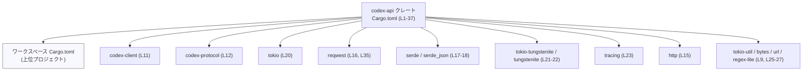
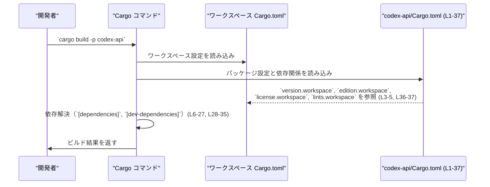

# codex-api/Cargo.toml コード解説

## 0. ざっくり一言

`codex-api/Cargo.toml` は、`codex-api` クレートの **パッケージメタデータ・依存関係・lint 設定** を定義する Cargo マニフェストファイルです（`Cargo.toml:L1-5, L6-27, L28-37`）。

---

## 1. このモジュールの役割

### 1.1 概要

- このファイルは `codex-api` というパッケージの名前だけをローカルに持ち、バージョン・エディション・ライセンスはワークスペース側の設定を参照しています（`version.workspace = true`, `edition.workspace = true`, `license.workspace = true`: `Cargo.toml:L2-5`）。
- 実装コードから利用される **本番用依存クレート** を `[dependencies]` で宣言しています（`Cargo.toml:L6-27`）。
- テストや開発補助のための **開発用依存クレート** を `[dev-dependencies]` で宣言しています（`Cargo.toml:L28-35`）。
- lint 設定もワークスペース単位で管理するよう指定されています（`[lints] workspace = true`: `Cargo.toml:L36-37`）。

### 1.2 アーキテクチャ内での位置づけ

このファイルは、`codex-api` クレートが **どの外部クレートに依存するか** を Cargo に伝える役割を持ちます。  
バージョンや lint 設定はすべてワークスペース側で一括管理されます（`Cargo.toml:L3-5, L36-37`）。

主要な依存関係に絞ったコンパイル時依存関係図は次のようになります。



- 実際の関数呼び出しやデータフローはソースコード側（例: `src/` 以下）に依存するため、このファイルだけからは分かりません。
- ここではあくまで「どのクレートに依存しうるか」という **コンパイル時の関係** のみが分かります。

### 1.3 設計上のポイント（マニフェストレベル）

コードから読み取れる範囲での特徴は次の通りです。

- **ワークスペース集中管理**
  - バージョン・エディション・ライセンス・lint 設定をすべて `workspace = true` で共有しています（`Cargo.toml:L3-5, L36-37`）。
  - 依存クレートのバージョンもすべて `workspace = true` にしており（`Cargo.toml:L7-27, L29-35`）、バージョン管理がワークスペースルートに集約されています。
- **非同期・ネットワーク指向の依存**
  - `tokio`, `futures`, `tokio-util` など非同期実行/ユーティリティ関連のクレートに依存しています（`Cargo.toml:L14, L20, L26`）。
  - `reqwest`, `http`, `tokio-tungstenite`, `tungstenite`, `eventsource-stream` など HTTP / WebSocket / EventSource 関連クレートに依存しています（`Cargo.toml:L15-16, L21-22, L24`）。
  - これらは一般的にネットワーク I/O と非同期処理のために用いられるクレートです（用途はクレートの一般的な機能に基づく説明です）。
- **シリアライゼーションとエラー処理の基盤**
  - `serde`, `serde_json` によりシリアライズ／デシリアライズの土台を持ち（`Cargo.toml:L17-18`）、`thiserror` によりエラー型の実装を容易にする基盤が用意されています（`Cargo.toml:L19`）。
  - 開発時には `anyhow` も利用可能です（`Cargo.toml:L29`）。
- **テスト・モックの整備**
  - `tokio-test`, `wiremock`, `assert_matches`, `pretty_assertions` など、非同期テスト・HTTP モック・検証用の開発依存が定義されています（`Cargo.toml:L29-35`）。
- **このファイルには実装コードはない**
  - 関数・構造体・モジュールなど Rust コードの定義は一切含まれていません。公開 API やコアロジックの詳細は、別ファイル（例: `src/` 以下）に存在するはずですが、このチャンクには現れていません。

---

## 2. 主要な機能一覧（このファイルが担う役割）

この `Cargo.toml` 自体が提供する「機能」は、ビルド設定の観点では次の通りです。

- パッケージ基本情報の宣言（`name`, `version`, `edition`, `license` のワークスペース継承）（`Cargo.toml:L1-5`）
- 本番用依存クレートの宣言（`[dependencies]`）（`Cargo.toml:L6-27`）
- 開発・テスト用依存クレートの宣言（`[dev-dependencies]`）（`Cargo.toml:L28-35`）
- lint 設定をワークスペースから継承する指定（`[lints] workspace = true`）（`Cargo.toml:L36-37`）

### 2.1 コンポーネントインベントリー（依存クレート一覧）

このチャンクに現れる依存クレートを、用途（一般的な役割）とともに一覧にします。

> 「用途」は各クレートの一般的な機能説明であり、`codex-api` 内での具体的な使われ方は、このファイルからは分かりません。

| コンポーネント | 種別 | 一般的な用途 | 根拠行 |
|----------------|------|--------------|--------|
| `async-trait` | 本番依存 | `async fn` を含むトレイトの実装をマクロで補助するクレート | `Cargo.toml:L7` |
| `base64` | 本番依存 | Base64 形式のエンコード／デコード | `Cargo.toml:L8` |
| `bytes` | 本番依存 | 効率的なバイトバッファ管理 | `Cargo.toml:L9` |
| `chrono` | 本番依存 | 日時・タイムゾーンの扱い | `Cargo.toml:L10` |
| `codex-client` | 本番依存 | 用途はこのチャンクからは不明（プロジェクト固有クレート） | `Cargo.toml:L11` |
| `codex-protocol` | 本番依存 | 用途はこのチャンクからは不明（プロジェクト固有クレート） | `Cargo.toml:L12` |
| `codex-utils-rustls-provider` | 本番依存 | 用途はこのチャンクからは不明（プロジェクト固有クレート） | `Cargo.toml:L13` |
| `futures` | 本番依存 | 非同期処理用のトレイト・コンビネータ | `Cargo.toml:L14` |
| `http` | 本番依存 | HTTP リクエスト／レスポンスなどの型定義 | `Cargo.toml:L15` |
| `reqwest` | 本番依存 | HTTP クライアント。`json`, `stream` フィーチャが有効化されている | `Cargo.toml:L16` |
| `serde` | 本番依存 | シリアライズ／デシリアライズ用フレームワーク（`derive` フィーチャ有効） | `Cargo.toml:L17` |
| `serde_json` | 本番依存 | JSON 形式のシリアライズ／デシリアライズ | `Cargo.toml:L18` |
| `thiserror` | 本番依存 | カスタムエラー型の実装を derive で簡略化する | `Cargo.toml:L19` |
| `tokio` | 本番依存 | 非同期ランタイム。`fs`, `macros`, `net`, `rt`, `sync`, `time` フィーチャ有効 | `Cargo.toml:L20` |
| `tokio-tungstenite` | 本番依存 | Tokio 上での WebSocket (`tungstenite`) 統合 | `Cargo.toml:L21` |
| `tungstenite` | 本番依存 | WebSocket プロトコル実装 | `Cargo.toml:L22` |
| `tracing` | 本番依存 | 構造化ログ・トレース収集 | `Cargo.toml:L23` |
| `eventsource-stream` | 本番依存 | Server-Sent Events (EventSource) のストリーム処理 | `Cargo.toml:L24` |
| `regex-lite` | 本番依存 | 軽量な正規表現マッチング | `Cargo.toml:L25` |
| `tokio-util` | 本番依存 | Tokio 用ユーティリティ（`codec`, `io` フィーチャ有効） | `Cargo.toml:L26` |
| `url` | 本番依存 | URL のパース・構築 | `Cargo.toml:L27` |
| `anyhow` | 開発依存 | エラー集約用ライブラリ。テストなどで汎用エラー型として利用されがち | `Cargo.toml:L29` |
| `assert_matches` | 開発依存 | `assert_matches!` マクロによるパターンマッチの検証 | `Cargo.toml:L30` |
| `pretty_assertions` | 開発依存 | 差分表示の見やすい `assert_eq!` 代替 | `Cargo.toml:L31` |
| `tempfile` | 開発依存 | 一時ファイル・ディレクトリの安全な生成 | `Cargo.toml:L32` |
| `tokio-test` | 開発依存 | Tokio ベースの非同期テスト用ユーティリティ | `Cargo.toml:L33` |
| `wiremock` | 開発依存 | HTTP モックサーバー（テスト用） | `Cargo.toml:L34` |
| `reqwest` | 開発依存 | テストコード側でも HTTP クライアントを利用できるようにする | `Cargo.toml:L35` |

---

## 3. 公開 API と詳細解説

このファイルは Rust コードではなく、ビルド設定のみを記述する TOML ファイルです。そのため、**型や関数といった公開 API はこのファイルには一切現れていません。**

### 3.1 型一覧（構造体・列挙体など）

| 名前 | 種別 | 役割 / 用途 |
|------|------|-------------|
| なし | - | この `Cargo.toml` には Rust の型定義は含まれていません |

- 実際の構造体・列挙体は、別ファイル（通常は `src/` 配下）に定義されているはずですが、このチャンクには現れていません。

### 3.2 関数詳細（最大 7 件）

- このファイルには関数定義が存在しないため、関数ごとの詳細解説は行えません。
- `codex-api` クレートの公開関数やメソッドは、Rust ソースファイル（`src/lib.rs` や `src/main.rs` など、実際のパスはこのチャンクからは不明）に実装されていると考えられますが、ここでは確認できません。

### 3.3 その他の関数

- 補助的な関数やラッパー関数についても、このファイルからは一切情報が得られません。

---

## 4. データフロー

このファイルには実行時の処理ロジックがないため、**実行時のデータフローや関数呼び出しの関係**は分かりません。  
ここでは代わりに、「`codex-api/Cargo.toml` が Cargo によってどのように利用されるか」という **ビルド時のフロー** を示します。



要点:

- ビルド時に Cargo がこの `Cargo.toml` を読み取り、ワークスペースルートの設定と統合します。
- 依存クレート一覧（`[dependencies]`, `[dev-dependencies]`）をもとに、コンパイル対象やリンク対象が決まります。
- 実行時に `codex-api` が具体的にどの依存クレートをどう呼び出すかは、このファイルからは分かりません。

---

## 5. 使い方（How to Use）

### 5.1 基本的な使用方法

開発者は通常、このファイルを **直接コードから呼び出す** ことはありません。役割は次の通りです。

- プロジェクトルートで `cargo build` や `cargo test` を実行すると、Cargo がこのファイルを自動で読み込みます。
- `codex-api` クレートに新しい依存を追加したい場合は、この `[dependencies]` や `[dev-dependencies]` セクションを編集します。

依存を追加する基本例（一般的なパターン）は次のようになります。

```toml
[dependencies]
# 既存の依存（本ファイルより引用）
tokio = { workspace = true, features = ["fs", "macros", "net", "rt", "sync", "time"] } # (L20)

# 新しい依存を追加する一般的な例（バージョンはダミー）
some-crate = { version = "1.2.3" }
```

- 実際には、このプロジェクトでは **バージョン管理をワークスペースに集約**しているため（`workspace = true` が多用されている: `Cargo.toml:L3-5, L7-27, L29-35`）、新しい依存を追加する場合も、まずワークスペースルートの `Cargo.toml` にバージョンを追加し、その後このファイル側で `{ workspace = true }` を指定する運用が想定されます（運用方針自体はこのチャンクからは明示されていませんが、設定からそう読めます）。

### 5.2 よくある使用パターン

このファイルに現れている代表的な記述パターンを示します。

1. **ワークスペースでバージョンを共有しつつ、フィーチャだけローカルで指定**

   ```toml
   reqwest = { workspace = true, features = ["json", "stream"] } # Cargo.toml:L16
   ```

   - バージョンはワークスペースルートで指定し、`json` と `stream` というフィーチャのみをこのクレート側で有効化しています。

2. **Tokio の複数フィーチャをまとめて有効化**

   ```toml
   tokio = { workspace = true, features = ["fs", "macros", "net", "rt", "sync", "time"] } # Cargo.toml:L20
   ```

   - ファイル I/O (`fs`), マクロ (`macros`), ネットワーク (`net`), ランタイム (`rt`), 同期原語 (`sync`), 時刻 (`time`) など、Tokio の主要機能を幅広く利用可能な構成になっています（Tokio の一般的なフィーチャ名に基づく説明です）。

3. **開発時のみ必要な依存を `dev-dependencies` に切り出す**

   ```toml
   [dev-dependencies]
   wiremock = { workspace = true } # Cargo.toml:L34
   tokio-test = { workspace = true } # Cargo.toml:L33
   ```

   - 本番バイナリには含めたくないモック・テストユーティリティは `dev-dependencies` に置かれています。

### 5.3 よくある間違い（一般的な注意）

このファイルから直接は見えませんが、**この種の設定で起こりがちな誤り**を、一般的なパターンとして示します。

```toml
# 間違い例: 同一依存に workspace と version を同時に指定
# tokio = { workspace = true, version = "1.37", features = ["rt"] }

# 正しい例: どちらか一方にする
# - ワークスペースでバージョン管理する場合（このプロジェクトのスタイル）
tokio = { workspace = true, features = ["rt"] }

# - 個別クレートで完結させる場合（このプロジェクトでは採用していないスタイル）
# tokio = { version = "1.37", features = ["rt"] }
```

- この `Cargo.toml` では実際に「間違い例」のような記述は存在せず、すべて `workspace = true` に統一されています（`Cargo.toml:L7-27, L29-35`）。

### 5.4 使用上の注意点（まとめ）

このファイルを編集する際の注意点を、コードから読み取れる範囲で整理します。

- **ワークスペース前提**
  - `version.workspace = true` / `edition.workspace = true` / `license.workspace = true` / `[lints] workspace = true` となっているため、これらを個別クレート側で変更しても反映されず、ワークスペースルートの設定を変更する必要があります（`Cargo.toml:L3-5, L36-37`）。
- **依存バージョンはワークスペース依存**
  - すべての依存で `workspace = true` が使われているため（`Cargo.toml:L7-27, L29-35`）、バージョンの衝突やアップグレードはワークスペースルート側で調整する必要があります。
- **本ファイルだけでは安全性・エラー・並行性の詳細は分からない**
  - どの依存クレートが使えるかまでは分かりますが、実際にどのように安全性やエラー処理、並行性が実装されているかはソースコード側の確認が必要です。

---

## 6. 変更の仕方（How to Modify）

### 6.1 新しい機能を追加する場合（マニフェスト視点）

`codex-api` に新しい機能を実装する際、マニフェストレベルで必要になりそうな変更手順は次のようになります。

1. **必要なクレートを特定**
   - 例: 新たに圧縮処理が必要になれば `flate2` などを検討する、といった一般的な流れです（具体的な新機能はこのチャンクからは分かりません）。

2. **ワークスペースルートに依存を追加**
   - このプロジェクトでは依存に `workspace = true` を使っているため、まずワークスペースルートの `Cargo.toml` にそのクレートのバージョンを追加する運用が自然です（ルートファイルの内容はこのチャンクからは不明です）。

3. **`codex-api/Cargo.toml` に依存を追加**

   ```toml
   [dependencies]
   # 既存の依存…
   # 新しい依存（例）
   new-crate = { workspace = true }
   ```

4. **必要に応じてフィーチャを設定**
   - `reqwest` や `tokio` のように、特定のフィーチャのみ有効化する場合は `{ workspace = true, features = ["..."] }` の形で追記します（`Cargo.toml:L16, L20, L26` 参照）。

### 6.2 既存の機能を変更する場合（マニフェスト視点）

既存の依存構成を変更する際は、次の点に注意する必要があります。

- **影響範囲の確認**
  - 依存クレートを削除・変更すると、それを利用しているすべてのモジュール・関数に影響します。どのコードがそのクレートを使っているかは、このファイルからは分からないため、ソースコード全体の検索が必要です。
- **ワークスペース整合性**
  - バージョンやフィーチャの変更が、他クレートと矛盾しないかをワークスペースルート側で確認する必要があります（すべて `workspace = true` のため: `Cargo.toml:L7-27, L29-35`）。
- **テストの再確認**
  - 開発依存（`wiremock`, `tokio-test`, `pretty_assertions` など）に変更を加える場合は、テストコードのコンパイル・実行が通ることを確認する必要があります（`Cargo.toml:L29-35`）。

---

## 7. 関連ファイル

このファイルと密接に関係すると考えられる設定ファイルを整理します。

| パス | 役割 / 関係 |
|------|------------|
| （ワークスペースルートの `Cargo.toml`・パス不明） | `version.workspace`, `edition.workspace`, `license.workspace`, `[lints] workspace = true` および各依存クレートのバージョンを実際に定義していると考えられますが、このチャンクにはその内容・場所は現れていません（`Cargo.toml:L3-5, L7-27, L29-35, L36-37`）。 |
| `codex-api` クレートの Rust ソースファイル（例: `src/` 以下、具体的パス不明） | 実際の公開 API・コアロジックはこれらのファイルに実装されているはずですが、このチャンクからは存在・内容ともに確認できません。 |

このチャンクから分かるのは、「`codex-api` クレートがどのような外部クレートに依存しうるか」と「それらのバージョンや lint 設定がワークスペースにより一括管理されている」という点までです。公開 API やコアロジック、エッジケース、具体的なエラー・並行性の扱いは、別チャンクの Rust ソースコードを解析する必要があります。
