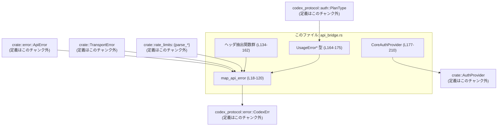
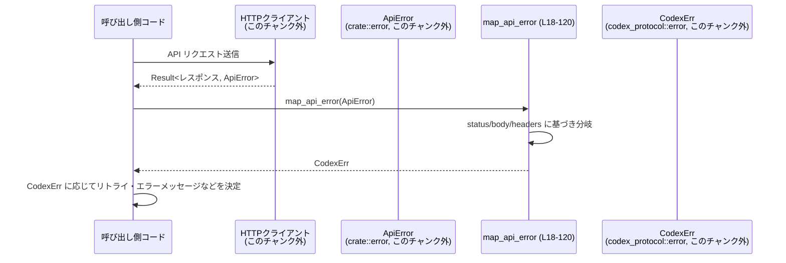

# codex-api/src/api_bridge.rs コード解説

## 0. ざっくり一言

`ApiError` / `TransportError` を `CodexErr` へ変換するエラー変換ブリッジと、`AuthProvider` トレイトを実装する `CoreAuthProvider` を提供するモジュールです（`codex-api/src/api_bridge.rs:L1-3`, `L18-120`, `L177-210`）。

---

## 1. このモジュールの役割

### 1.1 概要

- このモジュールは、API クライアント内部で発生するエラー型 `ApiError` を、プロトコル層 (`codex_protocol`) の共通エラー型 `CodexErr` に変換するために存在しています（`map_api_error`, `codex-api/src/api_bridge.rs:L18-120`）。
- HTTP レスポンスのステータスコード・ボディ・ヘッダからレート制限や使用量制限に関する情報を抽出し、`UsageLimitReachedError` などのエラー情報を組み立てます（`L37-88`, `L91-107`, `L151-162`, `L164-175`）。
- 認証用トークンとアカウントIDを保持する `CoreAuthProvider` を定義し、`crate::AuthProvider` トレイトを実装することで、呼び出し側から共通インターフェースで認証情報を取得できるようにしています（`L1`, `L177-210`）。

### 1.2 アーキテクチャ内での位置づけ

インポートから読み取れる依存関係を簡略化した図です。



- `map_api_error` がエラー型の橋渡しを行い、その内部でヘッダ抽出関数群や `UsageError*` 型を利用しています（`codex-api/src/api_bridge.rs:L18-120`, `L134-162`, `L164-175`）。
- `CoreAuthProvider` は `crate::AuthProvider` トレイトを実装し、上位の API クライアントから利用される位置づけです（`L1`, `L177-210`）。

### 1.3 設計上のポイント

- **集中したエラー変換**  
  - すべての `ApiError` を 1 箇所 (`map_api_error`) で `CodexErr` にマッピングする構造になっています（`codex-api/src/api_bridge.rs:L18-120`）。
- **安全なパースとフォールバック**  
  - JSON や base64 のパースは `ok()?` / `if let Ok(..)` で失敗時に `None` やフォールバック用のエラーに落とし込むため、パニックを起こさない構造です（`L45-56`, `L69-89`, `L151-162`）。
- **ヘッダ抽出の共通化**  
  - 任意ヘッダ名から `String` を取り出す `extract_header` をベースに、リクエストIDやエラーコードなどを抽出する小さな関数に分割されています（`L134-151`）。
- **状態の小ささ**  
  - `CoreAuthProvider` は `Option<String>` 2 つだけを持つ軽量な構造体で、内部でミューテーションは行わず、`Clone`/`Default` を derive した不変寄りの設計です（`L177-181`）。
- **並行性**  
  - グローバルな可変状態やスレッド関連のコードはこのチャンクにはなく、関数は純粋な変換・抽出に留まっています（全体）。

---

## 2. 主要な機能一覧

- エラー変換: `map_api_error` による `ApiError` → `CodexErr` 変換（`codex-api/src/api_bridge.rs:L18-120`）
- HTTP レスポンスヘッダからの ID / レート制限情報抽出（`extract_*`, `codex-api/src/api_bridge.rs:L134-162`, `L123-128`）
- レート制限・使用量エラー JSON (`UsageErrorResponse`) のパースと `UsageLimitReachedError` 組み立て（`L69-85`, `L164-175`）
- 認証情報の保持と `AuthProvider` 実装: `CoreAuthProvider`（`L177-210`）
- テストモジュールの委譲: `api_bridge_tests.rs` へのリンク（`L130-132`）

### 2.1 コンポーネントインベントリー（関数・型一覧）

| 名前 | 種別 | 公開範囲 | 行範囲 | 役割 |
|------|------|----------|--------|------|
| `map_api_error` | 関数 | `pub` | `codex-api/src/api_bridge.rs:L18-120` | `ApiError` を `CodexErr` に変換 |
| `ACTIVE_LIMIT_HEADER` 他 | 定数 | `pub` でない | `L123-128` | 使用ヘッダ名の定義 |
| `extract_request_tracking_id` | 関数 | 非公開 | `L134-136` | リクエストID or `cf-ray` を取得 |
| `extract_request_id` | 関数 | 非公開 | `L138-141` | 2 種のリクエストIDヘッダから取得 |
| `extract_header` | 関数 | 非公開 | `L143-148` | 任意ヘッダ名から `String` を取得 |
| `extract_x_error_json_code` | 関数 | 非公開 | `L151-162` | base64+JSON から `error.code` を抽出 |
| `UsageErrorResponse` | 構造体 | 非公開 | `L164-167` | usage 系エラー JSON のトップレベル |
| `UsageErrorBody` | 構造体 | 非公開 | `L169-175` | usage 系エラー JSON の `error` フィールド |
| `CoreAuthProvider` | 構造体 | `pub` | `L177-181` | 認証トークンとアカウントIDを保持 |
| `CoreAuthProvider::auth_header_attached` | メソッド | `pub` | `L183-188` | Authorization ヘッダが有効かどうか判定 |
| `CoreAuthProvider::auth_header_name` | メソッド | `pub` | `L190-192` | 使用するヘッダ名 (authorization) を返す |
| `CoreAuthProvider::for_test` | メソッド | `pub` | `L194-199` | テスト用の簡易コンストラクタ |
| `impl ApiAuthProvider for CoreAuthProvider` | トレイト実装 | 公開トレイトに対する実装 | `L202-209` | `bearer_token` / `account_id` の提供 |

---

## 3. 公開 API と詳細解説

### 3.1 型一覧（構造体・列挙体など）

#### 公開型

| 名前 | 種別 | 公開範囲 | フィールド | 役割 / 用途 | 根拠 |
|------|------|----------|------------|-------------|------|
| `CoreAuthProvider` | 構造体 | `pub` | `token: Option<String>`, `account_id: Option<String>` | 認証トークンとアカウントIDを保持し、`AuthProvider` トレイトを通じて外部へ提供する | `codex-api/src/api_bridge.rs:L177-181`, `L202-209` |

#### 内部型（エラー JSON パース用）

| 名前 | 種別 | 公開範囲 | 主なフィールド | 役割 / 用途 | 根拠 |
|------|------|----------|----------------|-------------|------|
| `UsageErrorResponse` | 構造体 | 非公開 | `error: UsageErrorBody` | `HTTP 429` の JSON ボディから usage エラー情報をパースするためのトップレベル | `codex-api/src/api_bridge.rs:L164-167`, `L69-88` |
| `UsageErrorBody` | 構造体 | 非公開 | `error_type: Option<String>`, `plan_type: Option<PlanType>`, `resets_at: Option<i64>` | usage エラーの詳細 (種別・プラン種別・リセット時刻) を保持 | `codex-api/src/api_bridge.rs:L169-175`, `L69-88` |

### 3.2 関数詳細（重要なもの）

#### `map_api_error(err: ApiError) -> CodexErr`

**概要**

- `crate::error::ApiError` を `codex_protocol::error::CodexErr` に変換します（`codex-api/src/api_bridge.rs:L18-120`）。
- ステータスコード・ボディ・ヘッダの内容に応じて、レート制限 / 使用量制限 / サーバ過負荷などの専用エラーを組み立てます。

**引数**

| 引数名 | 型 | 説明 |
|--------|----|------|
| `err` | `ApiError` | API クライアント層で発生したエラー。定義はこのチャンクにはありませんが、各種バリアントに応じてマッチングされます（`L19-25`, `L36-37`, `L119`）。 |

**戻り値**

- `CodexErr` (`codex_protocol::error::CodexErr`)  
  プロトコル層で扱う共通エラー型です。各バリアントはこのチャンクには定義されていませんが、`ContextWindowExceeded`, `QuotaExceeded`, `UsageLimitReached` などにマッピングされています（`codex-api/src/api_bridge.rs:L20-23`, `L55`, `L80-85` など）。

**内部処理の流れ**

主な流れのみを抜粋します（`codex-api/src/api_bridge.rs:L19-120`）。

1. `match err` で `ApiError` のバリアントごとに分岐します（`L19`）。
2. シンプルなバリアントは 1:1 で変換します:
   - `ContextWindowExceeded` → `CodexErr::ContextWindowExceeded`（`L20`）
   - `QuotaExceeded` → `CodexErr::QuotaExceeded`（`L21`）
   - `UsageNotIncluded` → `CodexErr::UsageNotIncluded`（`L22`）
   - `Retryable { message, delay }` → `CodexErr::Stream(message, delay)`（`L23`）
   - `Stream(msg)` → `CodexErr::Stream(msg, None)`（`L24`）
   - `ServerOverloaded` → `CodexErr::ServerOverloaded`（`L25`）
3. `ApiError::Api { status, message }` は `UnexpectedResponseError` にラップして `CodexErr::UnexpectedStatus` に変換します（`L26-34`）。
4. `ApiError::InvalidRequest { message }` は `CodexErr::InvalidRequest(message)` に変換します（`L35`）。
5. `ApiError::Transport(transport)` はさらに `TransportError` のバリアントで分岐します（`L36-118`）:
   - `TransportError::Http { status, url, headers, body }` の場合:
     1. `body.unwrap_or_default()` でボディを文字列化（`L43`）。
     2. `503 Service Unavailable` かつ JSON ボディの `error.code` が `"server_is_overloaded"` / `"slow_down"` の場合、`CodexErr::ServerOverloaded` を返します（`L45-56`）。
     3. `400 Bad Request` の場合、特定の画像エラーメッセージを含むかどうかで `InvalidImageRequest` / `InvalidRequest` を選択（`L58-65`）。
     4. `500 Internal Server Error` → `CodexErr::InternalServerError`（`L66-67`）。
     5. `429 Too Many Requests` の場合:
        - ボディを `UsageErrorResponse` としてパース（`L69`）。
        - `error_type == "usage_limit_reached"` の場合:
          - `x-codex-active-limit` ヘッダから limit ID を取得（`extract_header`, `ACTIVE_LIMIT_HEADER`, `L70-73`）。
          - `parse_rate_limit_for_limit` と `parse_promo_message` でレート制限情報・プロモメッセージを構築（`L72-75`）。
          - `resets_at` 秒を `DateTime<Utc>` に変換（`L76-79`）。
          - これらを `UsageLimitReachedError` に詰めて `CodexErr::UsageLimitReached` を返却（`L80-85`）。
        - `error_type == "usage_not_included"` の場合 `CodexErr::UsageNotIncluded`（`L86-88`）。
        - 上記以外・パース失敗時は `CodexErr::RetryLimit(RetryLimitReachedError { .. })` にフォールバックし、`extract_request_tracking_id` でトラッキング ID を付与（`L91-94`, `L134-136`）。
     6. その他のステータスは `UnexpectedResponseError` にまとめ、ヘッダから `cf-ray`, `x-request-id` 系、`x-openai-authorization-error`, `x-error-json` 中の `error.code` を抽出して格納（`L95-107`, `L123-128`, `L134-162`）。
   - `TransportError::RetryLimit` は内部サーバエラー状態の `RetryLimitReachedError` に変換します（`L110-113`）。
   - `TransportError::Timeout` は `CodexErr::Timeout`（`L114`）。
   - `TransportError::Network(msg)` / `Build(msg)` は `CodexErr::Stream(msg, None)`（`L115-117`）。
6. `ApiError::RateLimit(msg)` は `CodexErr::Stream(msg, None)` に変換します（`L119`）。

**Examples（使用例）**

`ApiError` を `CodexErr` に変換して呼び出し側に返す例です。`ApiError` の定義はこのチャンクにはありませんが、マッチしているバリアントをそのまま用いています。

```rust
use crate::error::ApiError;                               // ApiError 型をインポート（定義はこのチャンク外）
use codex_protocol::error::CodexErr;                      // CodexErr 型をインポート（定義はこのチャンク外）

fn call_api_and_map_error() -> Result<(), CodexErr> {     // 上位レイヤで使用する関数
    // ここでは仮に API 呼び出しが失敗して ApiError を返したと仮定
    let api_result: Result<(), ApiError> = Err(ApiError::QuotaExceeded); // QuotaExceeded エラーを想定

    match api_result {
        Ok(()) => Ok(()),                                 // 成功時はそのまま Ok
        Err(api_err) => {                                 // エラー時は ApiError を受け取る
            let codex_err = map_api_error(api_err);       // map_api_error (L18-120) で CodexErr に変換
            Err(codex_err)                                // 呼び出し元に CodexErr を返す
        }
    }
}
```

**Errors / Panics**

- 関数自体は `Result` を返さず、`CodexErr` を直接返します。
- 文字列・JSON・base64 デコードはすべて `Ok` / `Err` を安全に扱っており、`unwrap` を使用していません（`unwrap_or_default` は `Option` に対して安全です: `L43`）。
- このため、入力 `ApiError`/`TransportError` によってパニックが起きるパスは、コードからは確認できません。

**Edge cases（エッジケース）**

- ボディが `None` の HTTP エラー: `body.unwrap_or_default()` により空文字列として扱われます（`L43`）。
- `503` かつ JSON ボディが不正フォーマット: `from_str` が `Err` になり、過負荷判定ブロックをスキップして通常のステータス処理に落ちます（`L45-56`）。
- `429` で JSON パースに失敗 / `error_type` 不明: usage 系エラーにはせず、`CodexErr::RetryLimit` として扱います（`L69-89`, `L91-94`）。
- `x-error-json` ヘッダが不正 / base64 デコード失敗: `extract_x_error_json_code` が `None` を返し、`UnexpectedResponseError.identity_error_code` が `None` のままになります（`L151-162`, `L96-107`）。

**使用上の注意点**

- `ApiError` / `TransportError` のバリアント設計が変わった場合、この関数の `match` を更新しないと、新しいエラーが意図せずフォールバック・バリアントに入る可能性があります。
- HTTP レスポンスボディの文言（特に画像エラー判定の文字列）はハードコードされているため、サーバ側メッセージが変更されると `InvalidImageRequest` にマッピングされなくなる可能性があります（`L59-62`）。
- ログやモニタリングでトレースしたい場合、`UnexpectedResponseError` に埋め込まれた `status`, `body`, `url`, `request_id`, `cf_ray` などを利用する設計であると解釈できます（`L96-107`）。

---

#### `extract_request_tracking_id(headers: Option<&HeaderMap>) -> Option<String>`

**概要**

- リクエストトラッキング用の ID をヘッダから抽出します。
- まず `x-request-id`/`x-oai-request-id` を試し、なければ `cf-ray` を返します（`codex-api/src/api_bridge.rs:L134-136`）。

**引数**

| 引数名 | 型 | 説明 |
|--------|----|------|
| `headers` | `Option<&HeaderMap>` | HTTP レスポンスヘッダ。`None` の場合はヘッダなしとして扱われます。 |

**戻り値**

- `Option<String>`  
  - 一意なトラッキング ID (`x-request-id` 系 or `cf-ray`) が存在すれば `Some(String)`、なければ `None` です。

**内部処理**

1. `extract_request_id(headers)` を呼び出して、`x-request-id` / `x-oai-request-id` を検索（`L135`, `L138-141`）。
2. `Some` ならそのまま返し、`None` の場合は `or_else` で `extract_header(headers, CF_RAY_HEADER)` を呼び出し、`cf-ray` ヘッダを探します（`L135`, `L123`, `L126`, `L143-148`）。

**使用例**

```rust
use http::HeaderMap;                                     // ヘッダマップ型（定義は外部クレート）

fn example_tracking_id(headers: HeaderMap) {             // ヘッダを受け取る関数
    let id = extract_request_tracking_id(Some(&headers)); // x-request-id → x-oai-request-id → cf-ray の順で検索
    if let Some(id) = id {                               // 見つかった場合のみ処理
        println!("tracking id = {}", id);                // トラッキングIDをログに出すなど
    }
}
```

**Errors / Panics**

- `HeaderMap::get` / `to_str` の結果を `Option` チェーンで処理しているため、パニックは発生しません（`L143-148`）。
- ヘッダ値が非 UTF-8 の場合 `to_str().ok()` が `None` となり、結果的に ID も `None` になります。

**Edge cases**

- `headers` が `None` の場合: いずれのヘッダも取得できず、`None` を返します。
- 対象ヘッダ名は存在するが値が空文字列: 空文字の `String` を返します（`to_str` が成功するため）。

**使用上の注意点**

- どのヘッダをトラッキング ID として扱うかはここで固定されています。別のヘッダを使用したい場合、この関数を変更する必要があります。
- `cf-ray` は Cloudflare 固有ヘッダであり、インフラ構成によっては存在しない可能性があります。

---

#### `extract_x_error_json_code(headers: Option<&HeaderMap>) -> Option<String>`

**概要**

- `x-error-json` ヘッダに base64 エンコードされた JSON が入っていることを前提に、その中の `error.code` を取り出します（`codex-api/src/api_bridge.rs:L151-162`, `L123`, `L128`）。
- 抽出に失敗した場合は `None` になります。

**引数**

| 引数名 | 型 | 説明 |
|--------|----|------|
| `headers` | `Option<&HeaderMap>` | HTTP レスポンスヘッダ |

**戻り値**

- `Option<String>`  
  - `x-error-json` ヘッダがあり、base64 → JSON パース → `error.code` 抽出に成功すれば、そのコード文字列を `Some` で返し、それ以外は `None` を返します。

**内部処理の流れ**

1. `extract_header(headers, X_ERROR_JSON_HEADER)` で `x-error-json` ヘッダの文字列値を取得（`L152`, `L123`, `L128`, `L143-148`）。
2. `base64::engine::general_purpose::STANDARD.decode(encoded)` で base64 デコードを試み、失敗したら `None`（`L153-155`）。
3. `serde_json::from_slice::<Value>(&decoded)` で JSON をパースし、失敗したら `None`（`L156`）。
4. パースした `Value` から `.get("error").and_then(|error| error.get("code")).and_then(Value::as_str)` で `error.code` を `&str` として取得（`L157-160`）。
5. 見つかった場合は `str::to_string` によって `String` に変換し、`Some` として返却（`L161`）。

**使用例**

```rust
use http::HeaderMap;                                     // ヘッダマップ型
use http::header::HeaderValue;                           // ヘッダ値型

fn example_error_code() {                                // 使用例を示す関数
    let mut headers = HeaderMap::new();                  // 空のヘッダマップを作成
    // {"error":{"code":"identity_auth_failed"}} を base64 エンコードしたと仮定
    let encoded = "eyJlcnJvciI6eyJjb2RlIjoiaWRlbnRpdHlfYXV0aF9mYWlsZWQifX0=";
    headers.insert("x-error-json", HeaderValue::from_static(encoded)); // x-error-json ヘッダを設定

    let code = extract_x_error_json_code(Some(&headers)); // 関数で error.code を抽出
    assert_eq!(code.as_deref(), Some("identity_auth_failed")); // 期待されるコードを比較
}
```

**Errors / Panics**

- base64 デコード / JSON パースは `ok()?` チェーンで処理され、いずれかが失敗すると `None` を返すため、パニックにはなりません（`L153-156`）。

**Edge cases**

- ヘッダが存在しない (`headers` が `None` / キーが無い): 最初の `extract_header` が `None` を返し、全体として `None` になります（`L152`）。
- base64 文字列が壊れている: `decode(..).ok()?` で `None` となります（`L153-155`）。
- JSON に `error` / `code` フィールドが無い: `.get(..)` チェーンのどこかで `None` となり、`None` を返します（`L157-160`）。

**使用上の注意点**

- この関数は `UnexpectedResponseError.identity_error_code` に値を入れる用途で利用されており（`L96-107`）、ログや診断用の補助情報と見ることができます。
- ヘッダの形式や JSON の構造が変わった場合は、対応する変更をここに反映する必要があります。

---

#### `CoreAuthProvider::auth_header_attached(&self) -> bool`

**概要**

- `CoreAuthProvider` に設定されたトークンから、正しい形式の `Authorization: Bearer <token>` ヘッダを組み立てられるかどうかを判定します（`codex-api/src/api_bridge.rs:L183-188`）。

**引数**

| 引数名 | 型 | 説明 |
|--------|----|------|
| `&self` | `&CoreAuthProvider` | 認証情報を保持する構造体への参照 |

**戻り値**

- `bool`  
  - トークンが存在し、それを用いて `HeaderValue` が構築できれば `true`、そうでなければ `false` です。

**内部処理**

1. `self.token.as_ref()` で `Option<&String>` を取得し、`is_some_and` を使用（`L185-187`）。
2. トークンが `Some(token)` の場合のみ `http::HeaderValue::from_str(&format!("Bearer {token}"))` を試し、`is_ok()` なら `true` を返します（`L187`）。
3. トークンが `None` または `from_str` 失敗時は `false` です。

**使用例**

```rust
use crate::api_bridge::CoreAuthProvider;                 // CoreAuthProvider をインポート（モジュール名は仮）

fn check_auth_header() {                                 // 使用例
    let provider = CoreAuthProvider {                    // 直接フィールドを設定してインスタンス生成
        token: Some("my-token".to_string()),             // トークンを設定
        account_id: None,                                // アカウントIDは未設定
    };

    let attached = provider.auth_header_attached();      // Authorization ヘッダを付与できるか判定
    assert!(attached);                                   // 正常なトークンなら true
}
```

**Errors / Panics**

- `HeaderValue::from_str` の結果を `is_ok()` で判定するだけであり、パニックは発生しません（`L187`）。

**Edge cases**

- トークンが `None` の場合: 常に `false`。
- トークンに改行などヘッダとして不正な文字が含まれる場合: `HeaderValue::from_str` が失敗し `false` となります。

**使用上の注意点**

- 実際のヘッダ値はこのメソッドでは返されません。ヘッダ名・値の生成はこのモジュール外（または別の層）で行う前提と見えます。
- トークンの値がヘッダとして有効かどうかの簡易チェックとして利用できます。

---

#### `CoreAuthProvider::auth_header_name(&self) -> Option<&'static str>`

**概要**

- 認証ヘッダ名（`"authorization"`）を返すメソッドです。ただし、`auth_header_attached()` が `true` の場合のみ返します（`codex-api/src/api_bridge.rs:L190-192`）。

**引数**

| 引数名 | 型 | 説明 |
|--------|----|------|
| `&self` | `&CoreAuthProvider` | 認証情報を保持する構造体への参照 |

**戻り値**

- `Option<&'static str>`  
  - 有効なトークンが設定されていれば `Some("authorization")`、なければ `None` です。

**内部処理**

1. `self.auth_header_attached()` を呼び出し（`L191`）。
2. 結果が `true` なら `then_some("authorization")` により `Some("authorization")` を返し、`false` なら `None` を返します（`L191-192`）。

**使用例**

```rust
use crate::api_bridge::CoreAuthProvider;                 // CoreAuthProvider をインポート

fn build_headers(provider: &CoreAuthProvider) {          // ヘッダ構築の一例
    if let Some(header_name) = provider.auth_header_name() { // ヘッダ名を取得（なければスキップ）
        // 実際にはここでヘッダ値 "Bearer <token>" を組み立てる想定
        println!("use auth header: {}", header_name);    // "authorization" が出力される
    }
}
```

**使用上の注意点**

- 実際のヘッダ値は別途生成する必要があります。`bearer_token()` と組み合わせて `"Bearer <token>"` を作るのが自然な利用方法です（`L202-205`）。
- 認証ヘッダ名が将来変更される場合は、このメソッドを中心に変更することになります。

---

#### `CoreAuthProvider::for_test(token: Option<&str>, account_id: Option<&str>) -> Self`

**概要**

- テスト用に、`&str` から簡単に `CoreAuthProvider` を生成するコンストラクタです（`codex-api/src/api_bridge.rs:L194-199`）。

**引数**

| 引数名 | 型 | 説明 |
|--------|----|------|
| `token` | `Option<&str>` | 認証トークン文字列（所有権は呼び出し元に残る） |
| `account_id` | `Option<&str>` | アカウント ID 文字列 |

**戻り値**

- `CoreAuthProvider`  
  `token.map(str::to_string)` / `account_id.map(str::to_string)` で所有権を持つ `String` に変換したインスタンスです（`L195-197`）。

**使用例**

```rust
use crate::api_bridge::CoreAuthProvider;                 // CoreAuthProvider をインポート

fn build_provider_for_test() {                           // テストコードなどでの使用例
    let provider = CoreAuthProvider::for_test(           // for_test でインスタンス生成
        Some("test-token"),                              // &str を渡す
        Some("test-account-id"),                         // &str を渡す
    );

    assert_eq!(provider.token.as_deref(), Some("test-token"));   // String に変換されていることを確認
    assert_eq!(provider.account_id.as_deref(), Some("test-account-id"));
}
```

**使用上の注意点**

- メソッド名が示す通り、テスト用に短く書くためのユーティリティです。本番コードで使用できないわけではありませんが、命名上はテスト用途が想定されます。

---

### 3.3 その他の関数

| 関数名 | シグネチャ | 役割（1 行） | 根拠 |
|--------|------------|--------------|------|
| `extract_request_id` | `fn extract_request_id(headers: Option<&HeaderMap>) -> Option<String>` | `x-request-id` → `x-oai-request-id` の順にリクエストIDを探すヘルパー関数 | `codex-api/src/api_bridge.rs:L138-141` |
| `extract_header` | `fn extract_header(headers: Option<&HeaderMap>, name: &str) -> Option<String>` | 任意ヘッダから UTF-8 文字列値を `String` として取得する共通関数 | `codex-api/src/api_bridge.rs:L143-148` |

---

## 4. データフロー

ここでは、HTTP エラーが `map_api_error` を通じて `CodexErr` に変換される代表的なフローを示します。



要点（`codex-api/src/api_bridge.rs:L18-120`, `L134-162`）:

- HTTP クライアント層で `ApiError` が生成され、このモジュールの `map_api_error` に渡されます。
- `map_api_error` 内でヘッダ抽出関数 (`extract_*`) や JSON パース (`UsageErrorResponse`) が呼ばれ、`CodexErr`（および内部の `UnexpectedResponseError`/`UsageLimitReachedError` など）が組み立てられます。
- 呼び出し側は `CodexErr` の種類に応じて、リトライ・レート制限の待機・ユーザ向けエラー表示などを行う設計が想定されます（ただし具体的な利用方法はこのチャンクには現れません）。

---

## 5. 使い方（How to Use）

### 5.1 基本的な使用方法

1. API クライアント層で `Result<T, ApiError>` を返すようにし、エラー時に `map_api_error` で `CodexErr` に変換する。
2. 認証情報として `CoreAuthProvider` を構築し、`AuthProvider` トレイトとして上位レイヤから利用する。

```rust
use crate::error::ApiError;                               // ApiError 型（定義はこのチャンク外）
use codex_protocol::error::CodexErr;                      // CodexErr 型（定義はこのチャンク外）
use crate::api_bridge::{map_api_error, CoreAuthProvider}; // このモジュールの公開 API をインポート

// 仮の API 呼び出し関数。実際には HTTP リクエストなどを行う
fn low_level_call() -> Result<String, ApiError> {         // 低レベル関数は ApiError を返す
    // ここでは説明のためエラーを返すことにする
    Err(ApiError::QuotaExceeded)                          // 実装詳細はこのチャンク外
}

fn high_level_call() -> Result<String, CodexErr> {        // 上位レイヤは CodexErr を返す
    let result = low_level_call();                        // 低レベル API を呼び出す

    match result {
        Ok(body) => Ok(body),                             // 成功時はそのまま返す
        Err(api_err) => Err(map_api_error(api_err)),      // エラー時は map_api_error で変換
    }
}

fn build_auth_provider() -> CoreAuthProvider {            // 認証プロバイダを構築する例
    CoreAuthProvider::for_test(                           // テスト用コンストラクタを利用
        Some("my-token"),                                 // ベアラートークン
        Some("my-account-id"),                            // アカウントID
    )
}
```

### 5.2 よくある使用パターン

- **レート制限エラーのハンドリング**  
  `CodexErr::UsageLimitReached` / `UsageNotIncluded` を検出し、`UsageLimitReachedError` 内の `resets_at` や `rate_limits` を参照して待機時間/メッセージを決定するパターンが想定されますが、`CodexErr` や `UsageLimitReachedError` の定義はこのチャンクにはありません。

- **トラッキング ID とログ**  
  `UnexpectedStatus` / `RetryLimit` の場合に `request_id` や `cf_ray` をログ出力し、問題調査に役立てるパターンが考えられます（`codex-api/src/api_bridge.rs:L91-94`, `L96-107`, `L134-136`）。

### 5.3 よくある間違い

```rust
// 間違い例: ApiError をそのまま上位レイヤに返してしまう
fn wrong_usage() -> Result<(), crate::error::ApiError> {  // 上位レイヤが ApiError に依存してしまう
    // ...
    Err(crate::error::ApiError::QuotaExceeded)            // CodexErr に統一されていない
}

// 正しい例: map_api_error を通して CodexErr に変換する
fn correct_usage() -> Result<(), codex_protocol::error::CodexErr> {
    // ...
    let api_err = crate::error::ApiError::QuotaExceeded;  // 低レベルのエラー
    Err(map_api_error(api_err))                           // 高レベルでは CodexErr を返す
}
```

### 5.4 使用上の注意点（まとめ）

- `ApiError` / `TransportError` / `CodexErr` / `UsageLimitReachedError` などの定義は別モジュールにあり、このファイルではそれらのマッピングに専念しています（定義はこのチャンクには現れません）。
- ヘッダ名や JSON フォーマットが変更された場合、`map_api_error` および `extract_*` 系関数、`UsageError*` 型を更新する必要があります（`codex-api/src/api_bridge.rs:L69-85`, `L123-128`, `L151-162`）。
- グローバルなミューテーションや非同期処理は登場せず、並行性に関して特別な前提は設けていません（このチャンク全体）。`CoreAuthProvider` のインスタンスを複数スレッドで共有する場合の可否は、そのフィールド型 (`String`, `Option`) と Rust の自動実装に依存しますが、このチャンクからは明示的には分かりません。

---

## 6. 変更の仕方（How to Modify）

### 6.1 新しい機能を追加する場合

- **新しい API エラー種別の追加**
  1. `crate::error::ApiError` に新しいバリアントを追加する（このチャンクには定義がありません）。
  2. `map_api_error` の `match err` に新バリアント用の分岐を追加し、適切な `CodexErr` に変換するロジックを記述する（`codex-api/src/api_bridge.rs:L19-120`）。
- **新しいヘッダを利用したトラッキング情報の追加**
  1. 該当ヘッダ名を定数として追加（`L123-128` に倣う）。
  2. `extract_header` を利用して値を取得する関数を定義（`L143-148` を参考に別関数を作る）。
  3. 必要に応じて `UnexpectedResponseError` などにフィールドを追加し、`map_api_error` の該当箇所で設定する（`L96-107`）。

### 6.2 既存の機能を変更する場合

- **契約の確認ポイント**
  - `map_api_error` の戻り値 `CodexErr` の意味が変わると、プロトコル層全体に影響します。変更前に `codex_protocol::error` の利用箇所を確認する必要があります（定義はこのチャンクにはありません）。
  - レート制限の扱い (`UsageLimitReached` / `RetryLimit` など) を変更する場合、`UsageErrorResponse`/`UsageErrorBody` のフィールドは API の JSON 仕様と一致しているか確認する必要があります（`codex-api/src/api_bridge.rs:L69-89`, `L164-175`）。
- **テスト**
  - このファイルには `api_bridge_tests.rs` へのテストモジュールリンクがあり（`L130-132`）、振る舞いの変更時にはこのテストファイルで対象テストを追加・更新するのが自然です。テスト内容自体はこのチャンクには現れません。

---

## 7. 関連ファイル

| パス / モジュール | 役割 / 関係 | 根拠 |
|-------------------|------------|------|
| `crate::error` | `ApiError` 型や `ApiError::ContextWindowExceeded` などのバリアント定義を持つモジュール。`map_api_error` の入力側です。 | `codex-api/src/api_bridge.rs:L3`, `L19-25` |
| `crate::TransportError` | HTTP/ネットワークレベルのエラーを表す型。`ApiError::Transport` 経由で `map_api_error` に渡されます。 | `codex-api/src/api_bridge.rs:L2`, `L36-37`, `L110-117` |
| `crate::rate_limits` | `parse_promo_message`, `parse_rate_limit_for_limit` を提供し、429 レスポンスからレート制限情報を抽出します。 | `codex-api/src/api_bridge.rs:L4-5`, `L72-75` |
| `codex_protocol::error` | `CodexErr`, `RetryLimitReachedError`, `UnexpectedResponseError`, `UsageLimitReachedError` を定義するプロトコル層のエラー型モジュール。`map_api_error` の出力側です。 | `codex-api/src/api_bridge.rs:L10-13`, `L26-34`, `L80-85`, `L91-94`, `L96-107`, `L110-117` |
| `codex_protocol::auth` | `PlanType` を定義し、usage エラー時のプラン種別情報として使用されます。 | `codex-api/src/api_bridge.rs:L9`, `L173`, `L80-82` |
| `crate::AuthProvider` | 認証情報を取得するためのトレイト。`CoreAuthProvider` がこれを実装します。 | `codex-api/src/api_bridge.rs:L1`, `L202-209` |
| `api_bridge_tests.rs` | このモジュールのテストコードが置かれたファイル。`#[path = "api_bridge_tests.rs"]` で参照されます。 | `codex-api/src/api_bridge.rs:L130-132` |

このチャンクにはこれら関連モジュールの具体的な実装は含まれていないため、詳細な振る舞いは不明です。ただし、このファイルからは「エラー変換と認証プロバイダ実装のブリッジ層」という役割が読み取れます。
