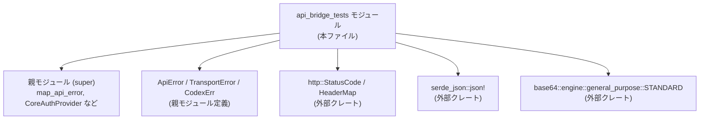
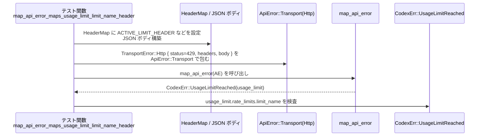

# codex-api/src/api_bridge_tests.rs

## 0. ざっくり一言

`map_api_error` と `CoreAuthProvider` の挙動を検証する単体テスト群であり、サーバ過負荷・レート制限・認証エラー時のエラー変換と、認証ヘッダー付与条件の契約をテストで定義しているファイルです。（api_bridge_tests.rs:L5-143）

---

## 1. このモジュールの役割

### 1.1 概要

- このモジュールは、親モジュール（`use super::*;`）で定義された
  - `map_api_error`
  - `ApiError` / `TransportError`
  - `CodexErr`
  - `CoreAuthProvider`
  の振る舞いをテストを通して仕様化しています。（api_bridge_tests.rs:L1-3, L5-9, L11-27, L29-64, L66-97, L99-143）
- 特に、HTTP レスポンスのステータスコード・ヘッダー・ボディから、どの `CodexErr` に変換されるか、およびエラー詳細メタデータ（リクエストIDやレート制限名など）がどのように抽出されるかを検証しています。（api_bridge_tests.rs:L13-24, L31-63, L68-96, L101-131）
- また、`CoreAuthProvider` が認証トークンを持つ場合に Authorization ヘッダーを添付することを検出できるかを確認しています。（api_bridge_tests.rs:L135-143）

### 1.2 アーキテクチャ内での位置づけ

このファイルは「親モジュールのエラー変換/認証ロジックのテストレイヤー」として位置づけられます。依存関係を簡略化して示すと次のようになります。



- `use super::*;` により、同じクレート内の親モジュールの公開 API をインポートしています。（api_bridge_tests.rs:L1）
- HTTP まわりは `http` クレートの `StatusCode`, `HeaderMap`, `HeaderValue` を利用しています。（api_bridge_tests.rs:L20-22, L31-38, L48-51, L68-72, L80-84, L101-113, L116-120）
- JSON ボディ構築には `serde_json::json!`、ヘッダー中の JSON を Base64 エンコードするために `base64` を使用しています。（api_bridge_tests.rs:L13-18, L40-46, L73-79, L108-112）

### 1.3 設計上のポイント

- **仕様をテストで定義**  
  - どの HTTP ステータス／ボディ／ヘッダーがどの `CodexErr` に対応するかを、個別のテスト関数で明示しています。（api_bridge_tests.rs:L5-9, L11-27, L29-64, L66-97, L99-131）
- **メタデータの抽出仕様**  
  - レート制限名やリクエスト ID、CF-Ray、認証エラーコードなどのメタデータを、HTTP ヘッダーからどのフィールドに格納するかをテストで固定しています。（api_bridge_tests.rs:L31-39, L57-63, L68-72, L90-96, L101-113, L125-131）
- **異なる情報源からの同一エラー判定**  
  - 直に `ApiError::ServerOverloaded` が来た場合と、HTTP 503 + JSON ボディ `"server_is_overloaded"` の場合の両方が `CodexErr::ServerOverloaded` にマップされることを検証し、実装に複数の判定経路があることを前提としています。（api_bridge_tests.rs:L5-9, L11-27）
- **明示的なパニック条件**  
  - 期待する `CodexErr` バリアントでない場合は `panic!` するテストスタイルを採用しており、マッピング契約が崩れた場合に即座に失敗するようになっています。（api_bridge_tests.rs:L54-56, L87-89, L122-124）

---

## 2. 主要な機能一覧（テスト観点）

このモジュール内のテスト関数と、それがカバーする仕様は次のとおりです。

| 関数名 | 役割（1行） | 根拠 |
|--------|-------------|------|
| `map_api_error_maps_server_overloaded` | `ApiError::ServerOverloaded` が `CodexErr::ServerOverloaded` にマップされることを検証する | api_bridge_tests.rs:L5-9 |
| `map_api_error_maps_server_overloaded_from_503_body` | HTTP 503 + JSON ボディ `"server_is_overloaded"` から `CodexErr::ServerOverloaded` が得られることを検証する | api_bridge_tests.rs:L11-27 |
| `map_api_error_maps_usage_limit_limit_name_header` | レート制限ヘッダーから `UsageLimitReached` 内の `limit_name` が設定されることを検証する | api_bridge_tests.rs:L29-64 |
| `map_api_error_does_not_fallback_limit_name_to_limit_id` | `limit_name` ヘッダーがないときに `limit_id` などへフォールバックしないこと（`limit_name` が `None` のまま）を検証する | api_bridge_tests.rs:L66-97 |
| `map_api_error_extracts_identity_auth_details_from_headers` | 認証エラー時に、リクエストIDや認証エラーコードなどのメタデータが `CodexErr::UnexpectedStatus` に格納されることを検証する | api_bridge_tests.rs:L99-132 |
| `core_auth_provider_reports_when_auth_header_will_attach` | `CoreAuthProvider` がトークンありの場合に Authorization ヘッダーを付与すると報告することを検証する | api_bridge_tests.rs:L135-143 |

---

## 3. 公開 API と詳細解説（テストから読み取れる契約）

### 3.1 型一覧（構造体・列挙体など）

このファイルでは新しい型定義は行われていませんが、重要な外部型の使われ方から契約を整理します。

| 名前 | 種別 | 役割 / 用途 | このファイルで分かること | 根拠 |
|------|------|-------------|--------------------------|------|
| `ApiError` | 列挙体（推定） | API 呼び出し時のエラーを表す | `ServerOverloaded` バリアントと `Transport(TransportError::Http { ... })` バリアントが存在する | api_bridge_tests.rs:L7, L19, L47, L80, L115 |
| `TransportError` | 列挙体（推定） | HTTP レベルのエラー表現 | 少なくとも `Http { status, url, headers, body }` バリアントがある | api_bridge_tests.rs:L19-24, L47-52, L80-85, L115-120 |
| `CodexErr` | 列挙体（推定） | Codex API レベルのエラー表現 | `ServerOverloaded`, `UsageLimitReached(_)`, `UnexpectedStatus(_)` バリアントがある | api_bridge_tests.rs:L8, L26, L54, L87, L122 |
| `UsageLimit` 相当の型 | 構造体（名前不明） | レート制限関連情報 | `CodexErr::UsageLimitReached(usage_limit)` の内部で、`usage_limit.rate_limits?.limit_name` にアクセスできる | api_bridge_tests.rs:L54-63, L87-96 |
| `CoreAuthProvider` | 構造体 | 認証ヘッダー付与のための情報を保持 | フィールド `token: Option<String>`, `account_id: None` を指定して構築でき、`auth_header_attached`, `auth_header_name` メソッドを持つ | api_bridge_tests.rs:L135-142 |
| `HeaderMap` | 構造体（外部） | HTTP ヘッダーのマップ | テスト用にヘッダーを構築し、`TransportError::Http` に渡すために使用 | api_bridge_tests.rs:L31-38, L68-72, L101-113 |

> 補足: これらの型自体の定義（フィールドや全バリアント）はこのチャンクには含まれていないため、上記以外の詳細は「コードからは読み取れません」。

---

### 3.2 関数詳細（テスト 6 件）

#### `map_api_error_maps_server_overloaded()`

**概要**

- 直接 `ApiError::ServerOverloaded` が `map_api_error` を通じて `CodexErr::ServerOverloaded` に変換されることを検証するテストです。（api_bridge_tests.rs:L5-9）

**引数**

- なし（標準的な `#[test]` 関数）

**戻り値**

- `()`（テストが成功すれば何も返さず終了）

**内部処理の流れ**

1. `map_api_error(ApiError::ServerOverloaded)` を呼び出し、結果を `err` に束縛します。（api_bridge_tests.rs:L7）
2. `matches!` マクロで `err` が `CodexErr::ServerOverloaded` であることを `assert!` します。（api_bridge_tests.rs:L8）

**Examples（使用例）**

テストをもとにした、`map_api_error` の最低限の利用例です。

```rust
// 直接 API レベルのエラーをアプリケーションエラーに変換する例
let err = map_api_error(ApiError::ServerOverloaded); // api_bridge_tests.rs:L7 相当

match err {
    CodexErr::ServerOverloaded => {
        // サーバ過負荷時のリトライやバックオフをここで行う
    }
    other => {
        // その他のエラー処理
        eprintln!("unexpected error: {other:?}");
    }
}
```

**Errors / Panics**

- テスト関数自体は `assert!` に失敗するとパニックします。（api_bridge_tests.rs:L8）
- `map_api_error` の内部で発生しうるエラー／パニックについては、このチャンクからは分かりません。

**Edge cases（エッジケース）**

- このテストは `ApiError::ServerOverloaded` のみを対象としており、他の `ApiError` バリアントの扱いはカバーしていません。（api_bridge_tests.rs:L7）

**使用上の注意点**

- 実装側は、`ApiError::ServerOverloaded` を必ず `CodexErr::ServerOverloaded` にマッピングする契約になっていると解釈できます。（テスト仕様より、api_bridge_tests.rs:L7-8）

---

#### `map_api_error_maps_server_overloaded_from_503_body()`

**概要**

- HTTP 503 (Service Unavailable) で、ボディの JSON に `"error": {"code": "server_is_overloaded"}` が含まれる場合にも、`CodexErr::ServerOverloaded` にマップされることを検証します。（api_bridge_tests.rs:L11-27）

**引数**

- なし

**戻り値**

- `()`

**内部処理の流れ**

1. `serde_json::json!` で `{"error":{"code":"server_is_overloaded"}}` の JSON を構築し、文字列化します。（api_bridge_tests.rs:L13-18）
2. その文字列を `body` として `TransportError::Http` バリアントに詰め、`ApiError::Transport(...)` を作成します。（api_bridge_tests.rs:L19-24）
3. その `ApiError` を `map_api_error` に渡し、戻り値 `err` を得ます。（api_bridge_tests.rs:L19-24）
4. `err` が `CodexErr::ServerOverloaded` であることを `assert!` します。（api_bridge_tests.rs:L26）

**Examples（使用例）**

```rust
// HTTP レベルの情報から map_api_error を使う例
let body = r#"{"error":{"code":"server_is_overloaded"}}"#.to_string(); // L13-18 相当
let api_error = ApiError::Transport(TransportError::Http {
    status: http::StatusCode::SERVICE_UNAVAILABLE,
    url: Some("http://example.com/v1/responses".to_string()),
    headers: None,
    body: Some(body),
});

let err = map_api_error(api_error);

assert!(matches!(err, CodexErr::ServerOverloaded));
```

**Errors / Panics**

- テストでは `assert!` の失敗でパニックします。（api_bridge_tests.rs:L26）
- JSON パースなどの内部処理のエラー扱いは、このチャンクからは不明です。

**Edge cases**

- ヘッダーが `None` でもサーバ過負荷判定が行われることを前提にしています。（api_bridge_tests.rs:L22）
- エラーコード文字列が `"server_is_overloaded"` 以外の場合の挙動は、このテストでは定義されていません。

**使用上の注意点**

- 実装側は、HTTP 503 とボディ内のエラーコードの両方を使ってサーバ過負荷を検知していると見なせます。（api_bridge_tests.rs:L19-26）

---

#### `map_api_error_maps_usage_limit_limit_name_header()`

**概要**

- レート制限エラー (`usage_limit_reached`) のとき、特定のヘッダーから「アクティブなレート制限名」を `UsageLimitReached` エラー内部に取り込むことを検証します。（api_bridge_tests.rs:L29-64）

**引数**

- なし

**戻り値**

- `()`

**内部処理の流れ**

1. `HeaderMap` を生成し、`ACTIVE_LIMIT_HEADER` と `"x-codex-other-limit-name"` を設定します。（api_bridge_tests.rs:L31-38）
2. ボディとして `{"error":{"type":"usage_limit_reached","plan_type":"pro"}}` を JSON 文字列で構築します。（api_bridge_tests.rs:L40-46）
3. これらを含む `TransportError::Http` → `ApiError::Transport` を作成し、`map_api_error` に渡します。（api_bridge_tests.rs:L47-52）
4. 返ってきたエラーを `CodexErr::UsageLimitReached(usage_limit)` としてパターンマッチします。（api_bridge_tests.rs:L54-56）
5. `usage_limit.rate_limits?.limit_name` が `"codex_other"` であることを `assert_eq!` で検証します。（api_bridge_tests.rs:L57-63）

**Examples（使用例）**

```rust
// レート制限エラーに対して、どのリミットが発火したかを調べる例
let mut headers = HeaderMap::new();
headers.insert(ACTIVE_LIMIT_HEADER, http::HeaderValue::from_static("codex_other"));
headers.insert(
    "x-codex-other-limit-name",
    http::HeaderValue::from_static("codex_other"),
);

let body = serde_json::json!({
    "error": {
        "type": "usage_limit_reached",
        "plan_type": "pro",
    }
}).to_string();

let err = map_api_error(ApiError::Transport(TransportError::Http {
    status: http::StatusCode::TOO_MANY_REQUESTS,
    url: Some("http://example.com/v1/responses".to_string()),
    headers: Some(headers),
    body: Some(body),
}));

if let CodexErr::UsageLimitReached(usage_limit) = err {
    let limit_name = usage_limit
        .rate_limits
        .as_ref()
        .and_then(|snapshot| snapshot.limit_name.as_deref());
    assert_eq!(limit_name, Some("codex_other"));
}
```

**Errors / Panics**

- 期待するバリアントでないと `panic!` に到達します。（api_bridge_tests.rs:L54-56）
- `usage_limit.rate_limits` が `None` の場合は `as_ref()` → `and_then` によって自然に `None` となり、テストの `assert_eq!` が失敗するだけです。（api_bridge_tests.rs:L57-63）

**Edge cases**

- `ACTIVE_LIMIT_HEADER` は設定されている前提でテストされています。（api_bridge_tests.rs:L31-34）
- `"x-codex-other-limit-name"` ヘッダーが存在しない場合は別テスト（次項）で扱われます。（api_bridge_tests.rs:L37-38, L66-97）
- ここでは `rate_limits` フィールドが `Some` で、かつ `limit_name` を持つケースのみをカバーしています。

**使用上の注意点**

- 実装側は、特定のヘッダー（`ACTIVE_LIMIT_HEADER` と `x-<limit>-limit-name` 系）を組み合わせて `limit_name` を決定していることが想定されます。（api_bridge_tests.rs:L31-39, L57-63）
- ヘッダー名や値は大小文字やフォーマットが変わるとマッチしないため、API 側と揃える必要があります。

---

#### `map_api_error_does_not_fallback_limit_name_to_limit_id()`

**概要**

- レート制限ヘッダーに `limit_name` がない場合でも、何かしらの ID へフォールバックせず、`limit_name` が `None` のままであることを検証します。（api_bridge_tests.rs:L66-97）

**引数**

- なし

**戻り値**

- `()`

**内部処理の流れ**

1. `HeaderMap` を生成し、`ACTIVE_LIMIT_HEADER` のみを設定します（`x-*-limit-name` は設定しない）。（api_bridge_tests.rs:L68-72）
2. ボディは先ほどと同様の `usage_limit_reached` JSON を構築します。（api_bridge_tests.rs:L73-79）
3. これを含む `ApiError::Transport(TransportError::Http { .. })` をつくり、`map_api_error` を呼び出します。（api_bridge_tests.rs:L80-85）
4. `CodexErr::UsageLimitReached(usage_limit)` にパターンマッチします。（api_bridge_tests.rs:L87-89）
5. `usage_limit.rate_limits?.limit_name` が `None` であることを検証します。（api_bridge_tests.rs:L90-96）

**Examples（使用例）**

```rust
// limit_name が特定できない場合は None で扱われる契約の例
let mut headers = HeaderMap::new();
headers.insert(ACTIVE_LIMIT_HEADER, http::HeaderValue::from_static("codex_other"));

let body = serde_json::json!({
    "error": { "type": "usage_limit_reached", "plan_type": "pro" }
}).to_string();

let err = map_api_error(ApiError::Transport(TransportError::Http {
    status: http::StatusCode::TOO_MANY_REQUESTS,
    url: Some("http://example.com/v1/responses".to_string()),
    headers: Some(headers),
    body: Some(body),
}));

if let CodexErr::UsageLimitReached(usage_limit) = err {
    let limit_name = usage_limit
        .rate_limits
        .as_ref()
        .and_then(|snapshot| snapshot.limit_name.as_deref());
    assert_eq!(limit_name, None);
}
```

**Errors / Panics**

- バリアントが異なる場合は `panic!` します。（api_bridge_tests.rs:L87-89）
- `usage_limit.rate_limits` が `None` でも `and_then` チェーンにより `None` となるだけで、パニックにはなりません。（api_bridge_tests.rs:L90-95）

**Edge cases**

- 「名前付きレート制限ヘッダーがない場合」はこのテストでカバーされていますが、`ACTIVE_LIMIT_HEADER` 自体が欠けているケースはテストされていません。（api_bridge_tests.rs:L68-72）

**使用上の注意点**

- 実装は「わからない情報」は `None` のままとし、他のフィールドから推測して埋めないポリシーを持っていることが、このテストから読み取れます。（api_bridge_tests.rs:L90-96）

---

#### `map_api_error_extracts_identity_auth_details_from_headers()`

**概要**

- 認証エラー（HTTP 401）時に、リクエストID・CF-Ray・認証エラー種別・詳細エラーコードをヘッダーから抽出し、`CodexErr::UnexpectedStatus` 内のフィールドに格納していることを検証します。（api_bridge_tests.rs:L99-132）

**引数**

- なし

**戻り値**

- `()`

**内部処理の流れ**

1. `HeaderMap` を作成し、以下のヘッダーを設定します。（api_bridge_tests.rs:L101-113）
   - `REQUEST_ID_HEADER` → `"req-401"`
   - `CF_RAY_HEADER` → `"ray-401"`
   - `X_OPENAI_AUTHORIZATION_ERROR_HEADER` → `"missing_authorization_header"`
   - `X_ERROR_JSON_HEADER` → Base64 エンコードされた `{"error":{"code":"token_expired"}}`
2. これらヘッダーと `status: UNAUTHORIZED`、`body: {"detail":"Unauthorized"}` を含む `TransportError::Http` を構築し、`ApiError::Transport` にラップします。（api_bridge_tests.rs:L115-120）
3. それを `map_api_error` に渡し、戻り値を `err` に束縛します。（api_bridge_tests.rs:L115-120）
4. `CodexErr::UnexpectedStatus(err)` にパターンマッチし、中の構造体（`err`）が持つ以下フィールドの値を検証します。（api_bridge_tests.rs:L122-131）
   - `request_id == Some("req-401")`
   - `cf_ray == Some("ray-401")`
   - `identity_authorization_error == Some("missing_authorization_header")`
   - `identity_error_code == Some("token_expired")`

**Examples（使用例）**

```rust
// 認証エラー時にメタデータを取り出す例
let mut headers = HeaderMap::new();
headers.insert(REQUEST_ID_HEADER, http::HeaderValue::from_static("req-401"));
headers.insert(CF_RAY_HEADER, http::HeaderValue::from_static("ray-401"));
headers.insert(
    X_OPENAI_AUTHORIZATION_ERROR_HEADER,
    http::HeaderValue::from_static("missing_authorization_header"),
);

let x_error_json =
    base64::engine::general_purpose::STANDARD.encode(r#"{"error":{"code":"token_expired"}}"#);
headers.insert(
    X_ERROR_JSON_HEADER,
    http::HeaderValue::from_str(&x_error_json).expect("valid x-error-json header"),
);

let err = map_api_error(ApiError::Transport(TransportError::Http {
    status: http::StatusCode::UNAUTHORIZED,
    url: Some("https://chatgpt.com/backend-api/codex/models".to_string()),
    headers: Some(headers),
    body: Some(r#"{"detail":"Unauthorized"}"#.to_string()),
}));

if let CodexErr::UnexpectedStatus(e) = err {
    assert_eq!(e.request_id.as_deref(), Some("req-401"));
    assert_eq!(e.cf_ray.as_deref(), Some("ray-401"));
    assert_eq!(e.identity_authorization_error.as_deref(), Some("missing_authorization_header"));
    assert_eq!(e.identity_error_code.as_deref(), Some("token_expired"));
}
```

**Errors / Panics**

- `CodexErr::UnexpectedStatus` でない場合は `panic!` が実行されます。（api_bridge_tests.rs:L122-124）
- Base64 デコードや JSON パースに失敗したときの挙動は、このチャンクからは分かりません。

**Edge cases**

- `X_ERROR_JSON_HEADER` の値が Base64 でない場合や、内部 JSON が期待と異なる場合はテストされていません。（api_bridge_tests.rs:L108-113）
- いずれかのヘッダーが欠けている場合のフィールド値（`None` になるか等）も、このテストからは読み取れません。

**使用上の注意点**

- 実装は、アイデンティティ関連エラー情報を複数のヘッダーから統合して 1 つのエラー構造体に集約する設計になっています。（api_bridge_tests.rs:L101-113, L125-131）
- `X_ERROR_JSON_HEADER` は Base64 で JSON をラップしている前提があり、この形式が変わると実装側のデコード処理も変更が必要になります。

---

#### `core_auth_provider_reports_when_auth_header_will_attach()`

**概要**

- `CoreAuthProvider` がトークンを保持しているときに、`auth_header_attached()` が `true`、`auth_header_name()` が `Some("authorization")` を返すことを確認します。（api_bridge_tests.rs:L135-143）

**引数**

- なし

**戻り値**

- `()`

**内部処理の流れ**

1. `CoreAuthProvider` を、`token: Some("access-token".to_string())`、`account_id: None` で構築します。（api_bridge_tests.rs:L136-138）
2. `auth.auth_header_attached()` が `true` であることを `assert!` します。（api_bridge_tests.rs:L141）
3. `auth.auth_header_name()` が `Some("authorization")` を返すことを `assert_eq!` します。（api_bridge_tests.rs:L142）

**Examples（使用例）**

```rust
// CoreAuthProvider を使って Authorization ヘッダーを設定するイメージ例
let auth = CoreAuthProvider {
    token: Some("access-token".to_string()),
    account_id: None,
};

if auth.auth_header_attached() {
    if let Some(header_name) = auth.auth_header_name() {
        // ここで実際の HTTP リクエストにヘッダーを付与する
        // request.headers.insert(header_name, format!("Bearer {}", "access-token"));
    }
}
```

**Errors / Panics**

- `auth_header_attached()` が `false`、または `auth_header_name()` の結果が期待と異なる場合、テストは `assert!`／`assert_eq!` の失敗でパニックします。（api_bridge_tests.rs:L141-142）

**Edge cases**

- `token: None` や `account_id: Some(...)` のケースはこのファイルではテストされていません。（api_bridge_tests.rs:L136-138）

**使用上の注意点**

- 実装は、`token` が存在するときに Authorization ヘッダーを添付することを前提としていると解釈できます。（api_bridge_tests.rs:L136-142）
- ヘッダー名は `"authorization"` に固定されていることがテストから読み取れます。（api_bridge_tests.rs:L142）

---

### 3.3 その他の関数

- このファイルには、補助的な関数やラッパー関数の定義はありません。定義されている関数はすべて `#[test]` 付きのテスト関数です。（api_bridge_tests.rs:L5-9, L11-27, L29-64, L66-97, L99-132, L135-143）

---

## 4. データフロー

### 4.1 代表的なシナリオ: レート制限エラーのマッピング

`map_api_error_maps_usage_limit_limit_name_header` テストを例に、HTTP レスポンスからアプリケーションエラーへのデータの流れを整理します。（api_bridge_tests.rs:L29-64）

1. テスト関数内で `HeaderMap`・JSON ボディが組み立てられ、`TransportError::Http` → `ApiError::Transport` とラップされます。（api_bridge_tests.rs:L31-52）
2. `map_api_error` が `ApiError` を `CodexErr` に変換します。（api_bridge_tests.rs:L47-52）
3. 戻ってきた `CodexErr::UsageLimitReached` の内部フィールド `usage_limit.rate_limits.limit_name` をテストが検査します。（api_bridge_tests.rs:L54-63）



この図から分かるポイント:

- エラー情報は「HTTP ステータス」「ヘッダー」「ボディ」をソースとして `map_api_error` に渡されます。（api_bridge_tests.rs:L47-52）
- `map_api_error` はそれらを解析し、`CodexErr` として意味づけされたエラー種別と付随情報を返します。（api_bridge_tests.rs:L54-63）
- テストは `CodexErr` 内部のさらにネストした構造体（`usage_limit.rate_limits`）の内容まで検査しているため、実装はこの構造を保つ必要があります。（api_bridge_tests.rs:L57-63）

---

## 5. 使い方（How to Use）

このファイルはテスト専用ですが、そこから `map_api_error` / `CoreAuthProvider` の現実的な使い方をある程度読み取ることができます。

### 5.1 基本的な使用方法

#### `map_api_error` を使ったエラー変換の基本フロー

```rust
// 1. HTTP レスポンス情報を TransportError::Http にまとめる
let http_error = TransportError::Http {
    status: http::StatusCode::TOO_MANY_REQUESTS,
    url: Some("http://example.com/v1/responses".to_string()),
    headers: Some(headers),              // HeaderMap
    body: Some(body_string),             // JSON 文字列
};

// 2. ApiError::Transport にラップする
let api_err = ApiError::Transport(http_error);

// 3. アプリケーションレベルの CodexErr にマッピング
let codex_err = map_api_error(api_err);

// 4. 種類と詳細に応じて処理
match codex_err {
    CodexErr::ServerOverloaded => {
        // サーバ過負荷 → バックオフ・リトライなど
    }
    CodexErr::UsageLimitReached(usage_limit) => {
        // レート制限 → usage_limit 内の情報を参照
    }
    CodexErr::UnexpectedStatus(e) => {
        // 認証エラーなど → e.request_id, e.identity_error_code 等をログ出力
    }
    _ => {
        // その他のエラー
    }
}
```

これはテストで使われているパターンを組み合わせた一般的な利用イメージです。（api_bridge_tests.rs:L19-24, L47-52, L80-85, L115-120）

#### `CoreAuthProvider` によるヘッダー付与判定

```rust
let auth = CoreAuthProvider {
    token: Some(access_token.clone()),
    account_id: None,                      // このチャンクでは None のケースのみ利用
};

if auth.auth_header_attached() {          // api_bridge_tests.rs:L141
    if let Some(name) = auth.auth_header_name() { // api_bridge_tests.rs:L142
        // 実際のリクエストに Authorization ヘッダーを付与する
        // request.headers.insert(name, format!("Bearer {}", access_token));
    }
}
```

### 5.2 よくある使用パターン

- **サーバ過負荷のリトライ判定**  
  - `ApiError::ServerOverloaded` または HTTP 503 + `"server_is_overloaded"` を `CodexErr::ServerOverloaded` として扱い、クライアント側でリトライ制御を行う。（api_bridge_tests.rs:L5-9, L11-27）
- **レート制限情報のログ／メトリクス送出**  
  - `CodexErr::UsageLimitReached(usage_limit)` を受け取ったら、`usage_limit.rate_limits.limit_name` などをログやメトリクスとして出力することで、どのリミットに達したかを観測できる。（api_bridge_tests.rs:L54-63, L87-96）
- **認証エラーの詳細調査**  
  - `CodexErr::UnexpectedStatus(e)` から `request_id` や `identity_error_code` を取り出し、バックエンドやサポートでの調査に利用する。（api_bridge_tests.rs:L122-131）

### 5.3 よくある間違い（推測される注意点）

テストから逆算して、以下のような誤用が起こると期待どおりの挙動にならない可能性があります。

```rust
// 間違い例: X_ERROR_JSON_HEADER に生の JSON を入れてしまう
headers.insert(
    X_ERROR_JSON_HEADER,
    http::HeaderValue::from_static(r#"{"error":{"code":"token_expired"}}"#),
);
// → テストでは Base64 エンコードした文字列が入る前提（api_bridge_tests.rs:L108-112）

// 正しい例:
let x_error_json =
    base64::engine::general_purpose::STANDARD.encode(r#"{"error":{"code":"token_expired"}}"#);
headers.insert(
    X_ERROR_JSON_HEADER,
    http::HeaderValue::from_str(&x_error_json).expect("valid x-error-json header"),
);
```

```rust
// 間違い例: レート制限名用ヘッダーを付け忘れる
headers.insert(ACTIVE_LIMIT_HEADER, http::HeaderValue::from_static("codex_other"));
// "x-codex-other-limit-name" を付けないと limit_name は None になる仕様（api_bridge_tests.rs:L68-72, L90-96）
```

### 5.4 使用上の注意点（まとめ）

- `map_api_error` は「HTTP レイヤの詳細（StatusCode, HeaderMap, JSON ボディ）」に依存して `CodexErr` を構築するため、API サーバ側のフォーマット変更に敏感です。（api_bridge_tests.rs:L19-24, L47-52, L80-85, L115-120）
- 認証エラー用のヘッダー `X_OPENAI_AUTHORIZATION_ERROR_HEADER`, `X_ERROR_JSON_HEADER` は特定の形式（文字列 + Base64 JSON）を前提としています。（api_bridge_tests.rs:L105-113）
- このチャンクには非同期や並行処理は登場せず、`map_api_error` 呼び出しは同期的に扱われています。

---

## 6. 変更の仕方（How to Modify）

### 6.1 新しい機能（エラー種別など）を追加する場合

1. **親モジュールに機能追加**  
   - 例: 新しい `ApiError` バリアントやそれに対応する `CodexErr` バリアントを追加する。
   - このチャンクからは親モジュールのファイル名は分かりませんが、`use super::*;` の側に実装があります。（api_bridge_tests.rs:L1）

2. **対応するテストを追加**  
   - 新しい HTTP ステータス／ヘッダー／ボディに対して、期待する `CodexErr` が返されることを確認する `#[test]` 関数を本ファイルに追加します。
   - 既存テスト（特に `map_api_error_maps_usage_limit_limit_name_header` や `map_api_error_extracts_identity_auth_details_from_headers`）と同じパターンで `HeaderMap` と JSON ボディを構築します。（api_bridge_tests.rs:L31-52, L101-120）

3. **メタデータがある場合はフィールド検証を追加**  
   - 新しいフィールドを `CodexErr` 内部に追加した場合、その値が正しくセットされることを `assert_eq!` で確認します。（api_bridge_tests.rs:L57-63, L125-131）

### 6.2 既存の機能を変更する場合

- **影響範囲の確認**
  - `map_api_error` のマッピングロジックを変更する場合、このファイルの全テストを確認する必要があります。特に、マッピング結果のバリアントやフィールド名が変わると、`panic!` によるテスト失敗が生じます。（api_bridge_tests.rs:L54-56, L87-89, L122-124）
- **契約の維持 / 更新**
  - 例えば、`CodexErr::UnexpectedStatus` のフィールド名を変更する場合は、テストのフィールドアクセス（`request_id`, `cf_ray`, `identity_error_code` など）と合わせて更新する必要があります。（api_bridge_tests.rs:L125-131）
- **テストの追加**
  - 新しいエッジケース（ヘッダー欠如、ボディが不正 JSON など）を取り扱うようにした場合、それに対応するテストケースを追加して、リグレッションを防ぎます。

---

## 7. 関連ファイル

このチャンクから明示的に分かる関連は親モジュールのみです。

| パス / モジュール | 役割 / 関係 |
|------------------|------------|
| `super`（親モジュール） | `map_api_error`, `ApiError`, `TransportError`, `CodexErr`, `CoreAuthProvider`, 各種ヘッダー名定数など本体実装を提供する。`api_bridge_tests.rs` はこれらに対する単体テストを定義している。（api_bridge_tests.rs:L1, L7, L19, L47, L80, L115, L136） |

> 親モジュールの具体的なファイルパス（例: `api_bridge.rs` 等）は、このチャンクには現れないため不明です。

---

## Bugs / Security / Contracts / Edge Cases まとめ（テストから読み取れる範囲）

- **Contracts（契約）**
  - `ApiError::ServerOverloaded` → `CodexErr::ServerOverloaded`（api_bridge_tests.rs:L5-9）
  - HTTP 503 + JSON `"server_is_overloaded"` → `CodexErr::ServerOverloaded`（api_bridge_tests.rs:L11-27）
  - HTTP 429 + レート制限ヘッダー → `CodexErr::UsageLimitReached` として `usage_limit.rate_limits.limit_name` が設定される（または `None` のまま）（api_bridge_tests.rs:L29-64, L66-97）
  - HTTP 401 + 各種ヘッダー → `CodexErr::UnexpectedStatus` にメタデータが格納される（api_bridge_tests.rs:L99-132）
  - `CoreAuthProvider` はトークンありで Authorization ヘッダー名 `"authorization"` を報告する（api_bridge_tests.rs:L135-143）

- **Edge Cases**
  - `limit_name` ヘッダー欠如時はフォールバックしない（api_bridge_tests.rs:L66-97）。
  - その他のエッジケース（ヘッダー欠如、ボディ不正など）はこのファイルでは明示されていません。

- **Bugs / Security 観点（このチャンクから分かること）**
  - テストは認証エラー時に `request_id` や `identity_error_code` を抽出することを保証しており、ログや監査の観点で重要な情報が落ちないことを確認しています。（api_bridge_tests.rs:L125-131）
  - 機密性の高い情報（トークン本体など）をここでログに出している痕跡はなく、このチャンクからは明確なセキュリティ問題は読み取れません。
  - 一方で、Base64 デコードや JSON パース時のエラー処理がどうなっているかはこのファイルからは不明であり、その部分の堅牢性については親モジュールの実装を確認する必要があります。
